# Level 2 (S式と評価モデル)

## 1. S式とは何か ― Lisp世界の唯一の構文

Lispは構文がほぼ1種類しかない言語である。それがS式（S-expression）である。S式は2つの要素から構成される。

| 種類 | 例 | 説明 |
|------|-----|------|
| アトム（atom） | `42` `"hello"` `foo` | 数値・文字列・シンボル |
| リスト（list） | `(a b c)` | 丸括弧に並ぶ要素列 |

アトムやリストを入れ子にできるため、S式は木構造（ツリー）を自然に表現できる。

### 1-1. 木構造としてのS式

例

```lisp
(+ (* 2 3) (- 10 4))
```

これを木として読むと構造が明確になる。

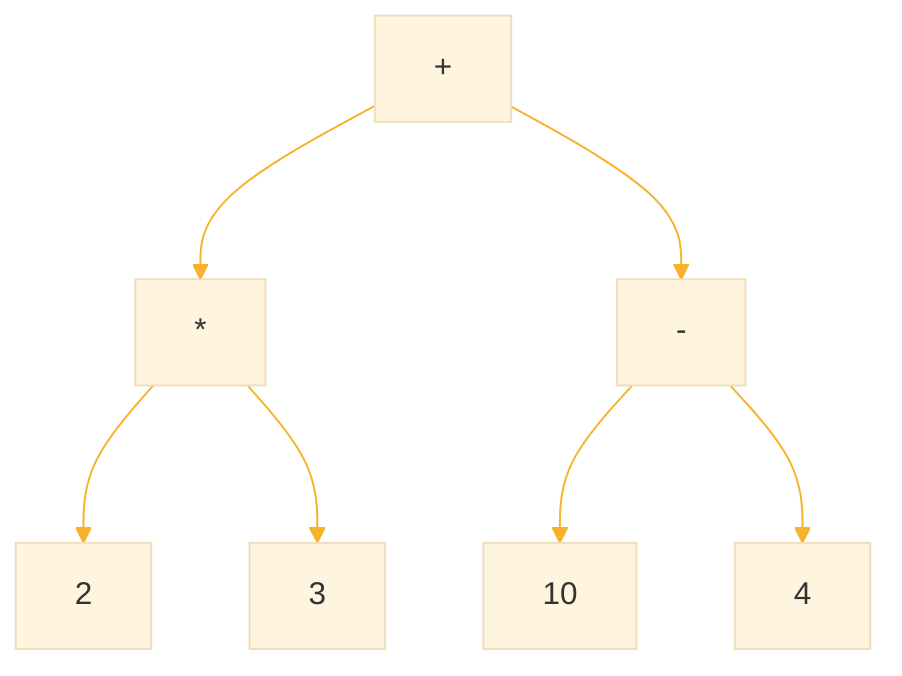


C、Java、Python などの言語では「構文が木構造」だが、Lispの場合は「コードそのものがデータ構造（木）」である。これこそが Lisp の核心であり、「同像性（homoiconicity）」と呼ばれる性質である。


### 2. 評価（evaluation）とは何か

Lisp処理系は、REPLに入力されたS式に対して評価（evaluation）を行う。評価とは、式を「実行」して結果を得るプロセスである。

#### 2-1. 基本的な評価規則

| 入力種類 | 評価結果 | 例 |
|----------|----------|-----|
| 数値リテラル | そのまま返す（自己評価的） | `42` → `42` |
| 文字列 | そのまま返す（自己評価的） | `"hi"` → `"hi"` |
| シンボル | 束縛された値を返す | `x` → `10`（xが10に束縛） |
| リスト | 先頭要素に応じた処理 | `(+ 1 2)` → `3` |

#### 2-2. シンボルが束縛されていない場合

束縛されていないシンボルを評価すると、unbound variable エラーが発生する。これは学習者が最初に遭遇しやすいエラーの一つである。

```lisp
CL-USER> unknown-symbol
; Error: The variable UNKNOWN-SYMBOL is unbound.
```

### 2-3. リスト評価の詳細：関数呼び出し

リストが評価されるとき、通常は関数呼び出しとして解釈される。リストの構造は以下の通りである。

```lisp
(先頭要素  引数1  引数2  引数3 ...)
 ↑関数名   ↑引数として評価される
```

例

```lisp
(+ 1 2 3)  ; 先頭の + が関数、1 2 3 が引数
→ 6
```

重要なのは、引数も評価されるという点である。

```lisp
(+ (* 2 3) (- 10 4))
; まず (* 2 3) → 6、(- 10 4) → 6 と評価
; 次に (+ 6 6) → 12
```

評価の流れを図示すると。

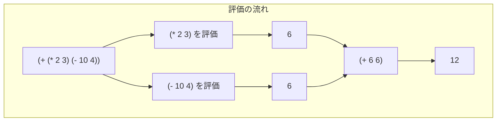

## 3. Special Form（特殊形式）

すべてのリストが関数呼び出しとして評価されるわけではない。Special Form（特殊形式）と呼ばれる構文は、独自の評価規則を持つ。

### 3-1. なぜ Special Form が必要か

関数呼び出しでは「すべての引数が先に評価される」。しかし、これでは実現できない制御構造がある。

```lisp
;; もし if が普通の関数だったら...
(if (> x 0)
    (print "positive")    ; 条件が偽でも評価される！
    (print "non-positive")) ; 条件が真でも評価される！
```

if が通常の関数なら、条件の真偽に関わらず両方の分岐が実行されてしまう。これは望ましくない。

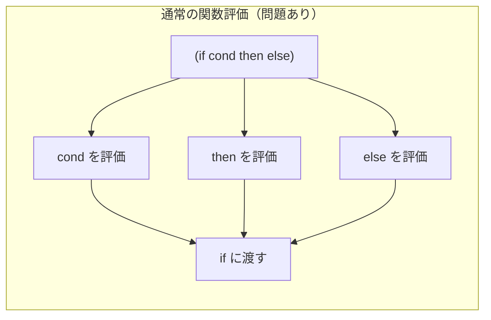

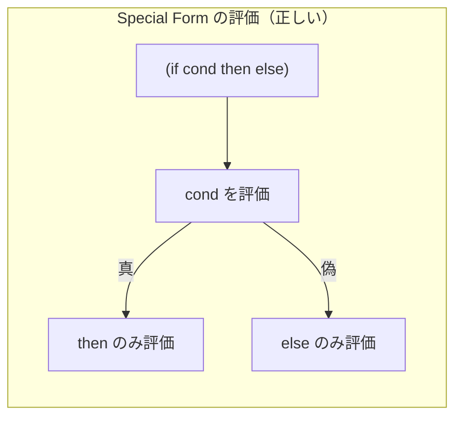

### 3-2. 主要な Special Form

| 名前 | 用途 | 評価規則 |
|------|------|----------|
| `quote` | 評価を抑制 | 引数を評価せずそのまま返す |
| `if` | 条件分岐 | 条件に応じて片方のみ評価 |
| `let` | 局所変数の導入 | 変数名は評価せず束縛 |
| `defun` | 関数定義 | 名前・引数リストは評価しない |
| `setq` | 変数への代入 | 変数名は評価せず、値のみ評価 |
| `cond` | 多分岐条件 | 真になる条件の節のみ評価 |
| `lambda` | 無名関数 | 引数リスト・本体は評価しない |

### 3-3. if の評価規則

```lisp
(if 条件式 真の場合の式 偽の場合の式)
```
評価の流れ
1. 条件式を評価
2. 結果が nil 以外なら「真の場合の式」のみを評価
3. 結果が nil なら「偽の場合の式」のみを評価

```
(if (> 5 3)
    "greater"
    "not greater")
→ "greater"  ; "not greater" は評価されない
```

> 重要： Special Form を見分けるには、Common Lisp の仕様を参照する必要がある。見た目だけでは関数と区別できない。

## 4. 「評価させない」ための仕組み：quote

quoteは最も基本的な Special Form であり、式の評価を止めるために使用される。

### 4-1. quote の基本

```lisp
(+ 1 2 3)        ; → 6（関数呼び出しとして評価）
(quote (+ 1 2 3)) ; → (+ 1 2 3)（データとして返す）
'(+ 1 2 3)       ; → (+ 1 2 3)（quote の短縮記法）
```

シングルクォート `'` は `(quote ...)` の短縮記法である。

### 4-2. なぜ quote が Special Form なのか

quote が通常の関数だったと仮定すると、矛盾が生じる。

もし quote が普通の関数なら、`(quote x)`は、
1. 引数 x を評価 → x が未束縛ならエラー！
2. quote に値を渡す

実際の quote（Special Form）
```lisp:
(quote x) ; → X（評価せずシンボルそのものを返す）
```

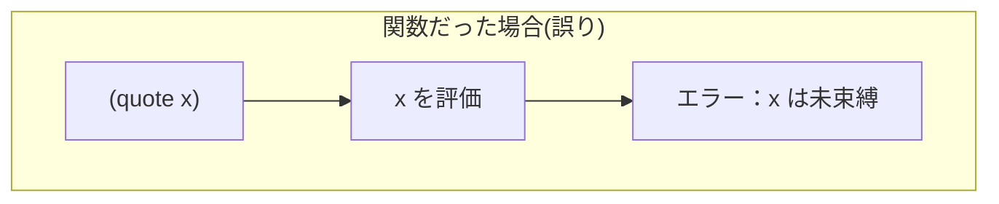
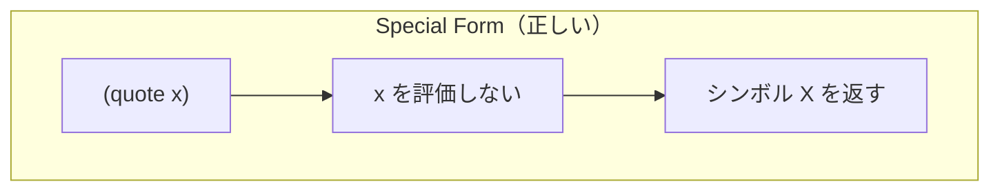

### 4-3. 「コード」と「データ」の境界

Lispにおける最初の大きな概念的壁は、同じ構文が「実行されるコード」も「操作されるデータ」も担うという点にある。

```lisp
(format t "Hello")   ; コードとして実行される
→ Hello
NIL

'(format t "Hello")  ; データとして保持される
→ (FORMAT T "Hello") ; リストデータ
```

この性質により、Lispではプログラムでプログラムを操作することが容易になる。これがマクロの基盤となる。


## 5. nil と空リスト ― Lispの特異点

nilはCommon Lispにおいて特別な存在であり、複数の役割を同時に担う。

### 5-1. nil の多面性

| 役割 | 表現 | 意味 |
|------|------|------|
| 偽（false） | `nil` | 論理値の偽 |
| 空リスト | `'()` または `()` | 要素を持たないリスト |
| シンボル | `nil` | COMMON-LISP パッケージのシンボル |


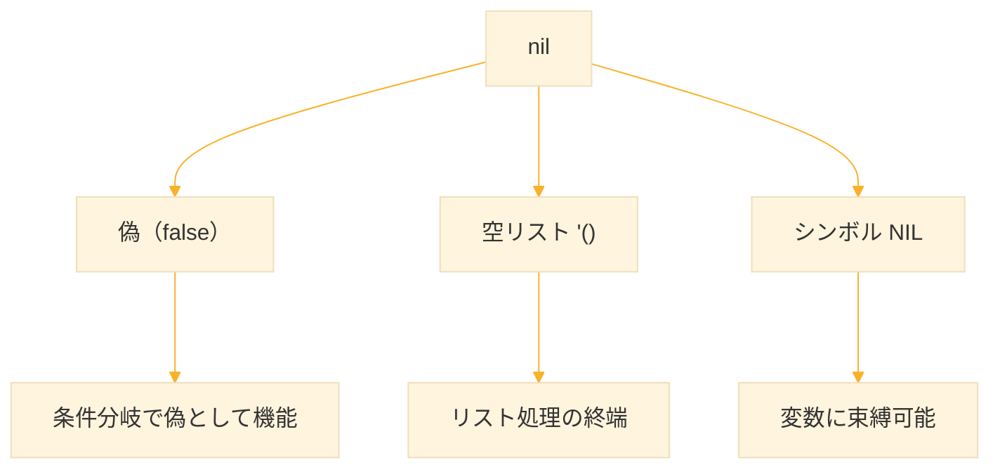

### 5-2. nil の同一性

```lisp
(eq nil '())      ; → T（同一オブジェクト）
(null nil)        ; → T（nilかどうか判定）
(null '())        ; → T
(listp nil)       ; → T（nilはリストである）
(atom nil)        ; → T（nilはアトムでもある！）
```

> 注意： nil は「アトムでありリストでもある」という特殊な存在である。これは再帰的なリスト処理で終端条件として機能するために重要な性質である。

### 5-3. 真偽値としての nil

Common Lisp では、nil のみが偽であり、nil 以外はすべて真として扱われる。

```lisp
(if nil "true" "false")  ; → "false"
(if 0 "true" "false")    ; → "true"（0も真！）
(if "" "true" "false")   ; → "true"（空文字列も真！）
(if '() "true" "false")  ; → "false"（'() = nil）
```

これは他の多くの言語（Python, JavaScript など）とは異なる点であり、注意が必要である。


## 6. リスト構造の生成と操作

### 6-1. list による生成

```lisp
(list 1 2 3)        ; → (1 2 3)
(list 'a 'b 'c)     ; → (A B C)
(list (+ 1 2) 'x)   ; → (3 X) 引数は評価される
```

### 6-2. cons, car, cdr の基本

Lisp のデータ構造の根本はconsセルである。consセルは2つのポインタを持つ構造体であり、car と cdr でそれぞれの要素にアクセスする。

```lisp
;; cons: 新しいconsセルを生成
(cons 'a 'b)        ; → (A . B)  ドット対
(cons 'a '(b c))    ; → (A B C)  リスト
(cons 'a nil)       ; → (A)      1要素のリスト

;; car: 最初の要素（cons の左側）
(car '(a b c))      ; → A

;; cdr: 残りの要素（cons の右側）
(cdr '(a b c))      ; → (B C)
(cdr '(a))          ; → NIL
```

### 6-3. リストの内部構造

リスト `(a b c)` は実際には cons セルの連鎖である。

```lisp
(a b c) = (cons 'a (cons 'b (cons 'c nil)))
```

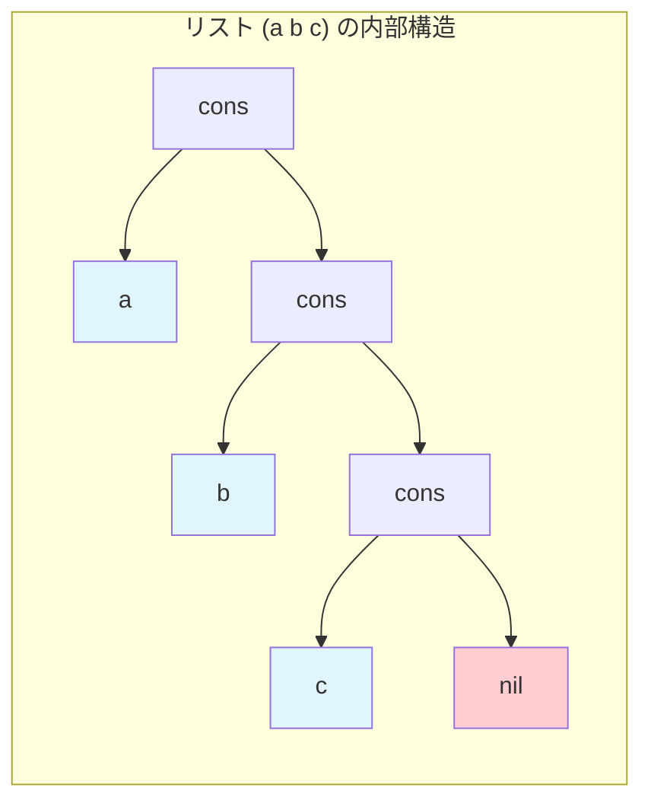

car と cdr の動作

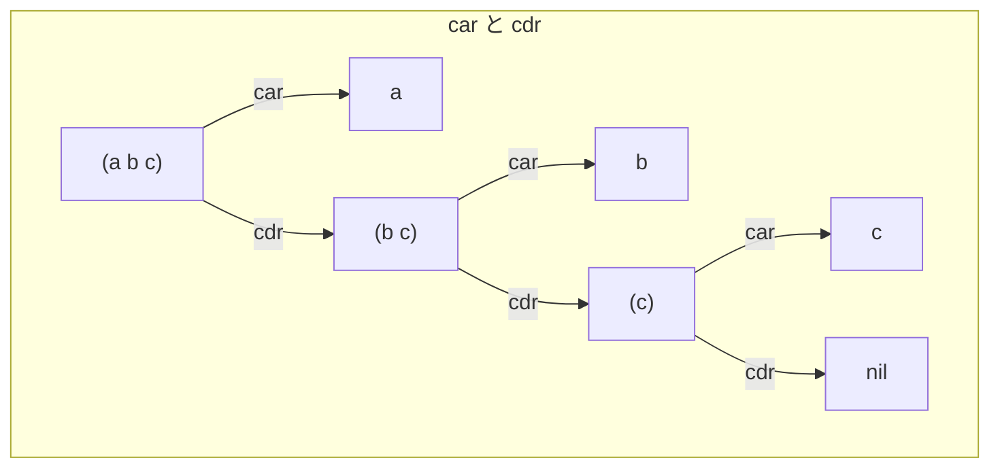


## 7. backquote（バッククォート）と「テンプレート構築」

### 7-1. なぜ backquote が必要か

quote を使うと式全体が評価されなくなる。しかし、「一部だけ評価したい」場合がある。

```lisp
(defparameter *name* "Yamada")

;; やりたいこと：(greeting "Yamada") を生成

;; quote では *name* が評価されない
'(greeting *name*)   ; → (GREETING *NAME*) 

;; list では全体の構造を手作業で組む必要がある
(list 'greeting *name*)  ; → (GREETING "Yamada") 
```

複雑な構造になると list での組み立ては煩雑になる。backquoteは「テンプレート」として機能し、この問題を解決する。

#### 7-2. backquote の記号

| 記号 | 名称 | 役割 |
|------|------|------|
| `` ` `` | バッククォート | テンプレート開始（基本は評価しない） |
| `,` | アンクォート | 指定部分のみ評価して埋め込む |
| `,@` | スプライシング | リストの中身を展開して挿入 |

```
;; 変数の定義
(defparameter *x* 10)
(defparameter *lst* '(1 2 3))

;; backquote によるテンプレート生成
`(a b ,*x* ,@*lst*)  ;; → (A B 10 1 2 3)

;; 比較：quote との違い
'(a b *x* *lst*)     ;; → (A B *X* *LST*)  ; 変数が評価されない

;; 比較：,@ を使わず , だけの場合
`(a b ,*x* ,*lst*)   ;; → (A B 10 (1 2 3))  ; リストが入れ子になる
```

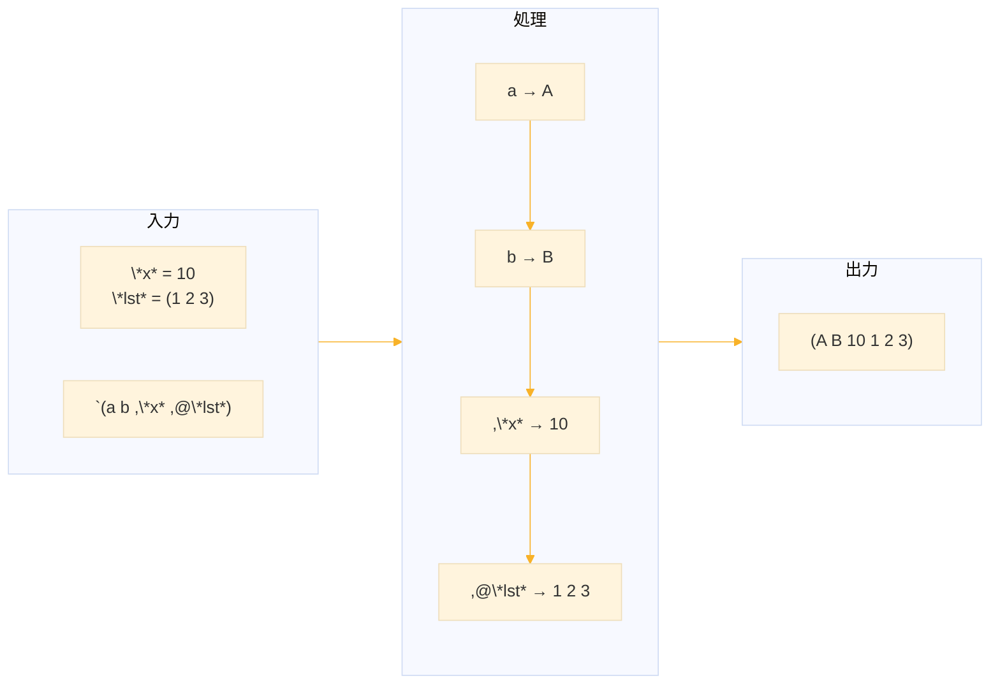

### 7-3. 基本的な使用例

```lisp
(defparameter *x* 10)

`(a b ,*x*)     ; → (A B 10)
;; テンプレート (a b □) の □ に *x* の値を埋め込む
```

### 7-4. スプライシング ,@ の効果

```lisp
(defparameter *lst* '(1 2 3))

;; , を使った場合：リストがそのまま1要素として入る
`(a ,*lst* d)   ; → (A (1 2 3) D)

;; ,@ を使った場合：リストの中身が展開される
`(a ,@*lst* d)  ; → (A 1 2 3 D)
```

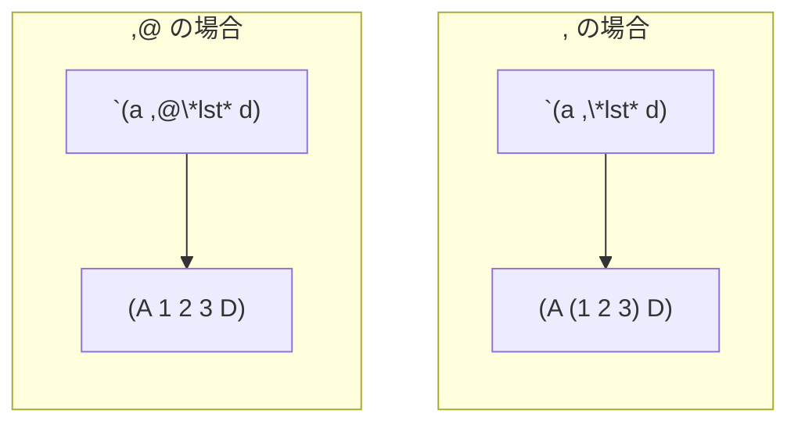

### 7-5. backquote の実用例：マクロの予習

backquote の真価はマクロ定義で発揮される。

```lisp
;; 繰り返し実行するマクロ（簡略版）
(defmacro repeat-twice (form)
  `(progn ,form ,form))

(repeat-twice (print "Hello"))
;; 展開結果: (progn (print "Hello") (print "Hello"))
;; → "Hello" が2回出力される
```

## 8. 演習問題と解説

### 演習1：評価モデルの判定

次の式が「評価される」か「データになる」か判別し、結果を予測せよ。

| 式 | 評価 or データ | 結果 |
|----|----------------|------|
| `(list 1 2 3)` | 評価 | `(1 2 3)` |
| `'(list 1 2 3)` | データ | `(LIST 1 2 3)` |
| `(+ 3 4)` | 評価 | `7` |
| `'(+ 3 4)` | データ | `(+ 3 4)` |

解説： quote がない場合、リストは関数呼び出しとして評価される。quote がある場合（`'`で始まる）、式はデータとして保持される。`'(list 1 2 3)` では `list` は関数として呼び出されず、シンボル `LIST` としてリスト内に残る。

### 演習2：backquote を使ったテンプレート生成

次の変数を利用して指定された構造を生成せよ。

```lisp
(defparameter *name* "Yamada")
(defparameter *skills* '("Lisp" "Research" "Automate"))
```

生成目標

```lisp
(about
  (name "Yamada")
  (skills "Lisp" "Research" "Automate"))
```

解答

```lisp
`(about
   (name ,*name*)
   (skills ,@*skills*))
```

解説： `*name*` は単一の値なので `,` で埋め込む。`*skills*` はリストであり、その中身を展開して並べたいので `,@` を使用する。もし `,` を使うと `(skills ("Lisp" "Research" "Automate"))` となり、リストが入れ子になってしまう。

### 演習3：対話UIテンプレート化

以下のようなデータ生成関数 `make-dialog` を backquote を使って設計せよ。

```lisp
(make-dialog "Hello" "お元気？")
;; 出力。
(dialog
  (bot "こんにちは")
  (bot "お元気？"))
```

解答

```lisp
(defun make-dialog (&rest messages)
  `(dialog
     ,@(mapcar (lambda (msg) `(bot ,msg)) messages)))
```

解説： `&rest` により可変長引数を受け取る。`mapcar` で各メッセージを `(bot メッセージ)` 形式に変換し、`,@` で展開する。内側の backquote `` `(bot ,msg)`` も重要で、`msg` の値を埋め込んでいる。

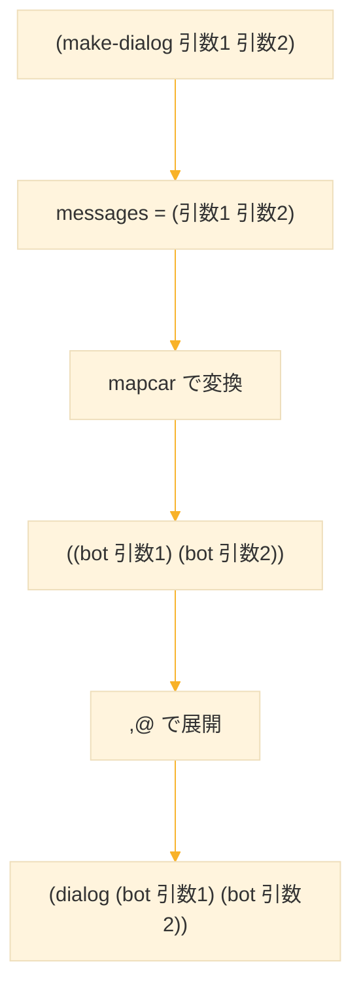


### 演習4：Special Form の理解

以下のコードの出力を予測し、なぜそうなるか説明せよ。

```lisp
(defparameter *counter* 0)

(defun increment ()
  (setq *counter* (+ *counter* 1))
  *counter*)

(if nil
    (increment)
    "skipped")

*counter*  ; この値は？
```

解答

```lisp
*counter* ; → 0
```

解説： `if` は Special Form であり、条件が `nil`（偽）の場合、真の分岐 `(increment)` は評価されない。したがって `*counter*` は変更されず `0` のままである。もし `if` が通常の関数なら、両方の分岐が評価され `*counter*` は `1` になっていた。

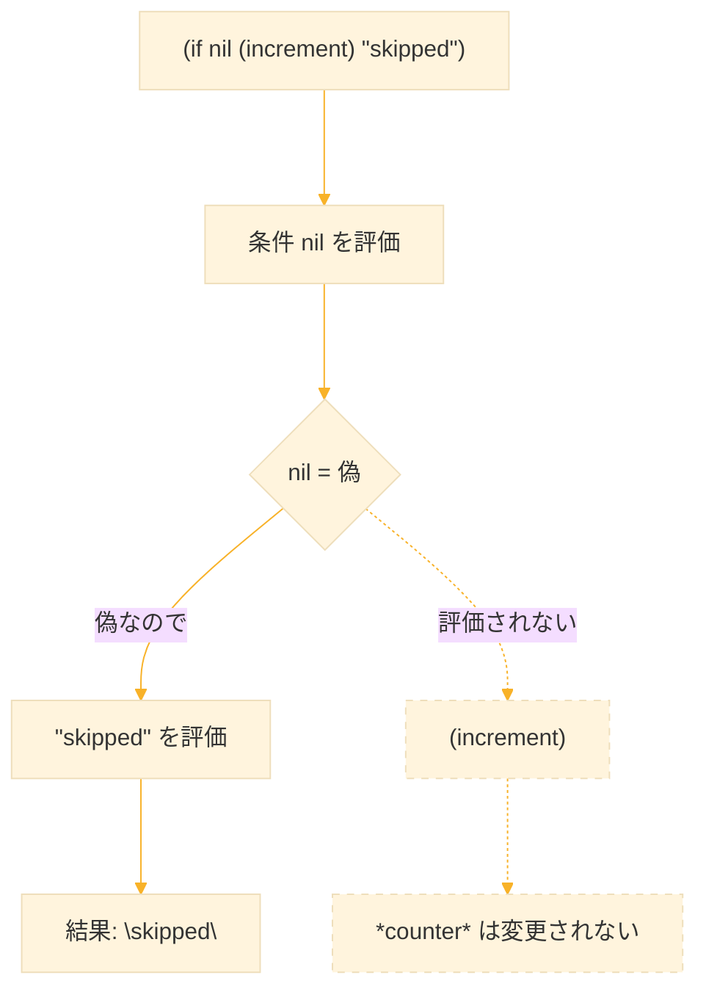


## 9. まとめ

1. S式は「構文」「データ」「抽象構造表現」の三役を担う。Lispの同像性（homoiconicity）の基盤である。

2. 評価モデルの理解は Lisp 習得の第一関門。リストは通常関数呼び出しとして評価されるが、Special Form は独自の評価規則を持つ。

3. quote は評価を抑制し、式をデータとして扱う。backquote はテンプレートとして機能し、一部のみ評価できる。

4. nil は偽・空リスト・シンボルの三役を担う特殊な存在である。

5. これらの理解がマクロ、メタプログラミング、言語設計へとつながる。次章ではこれらの概念を活用した高度なプログラミング技法を学ぶ。

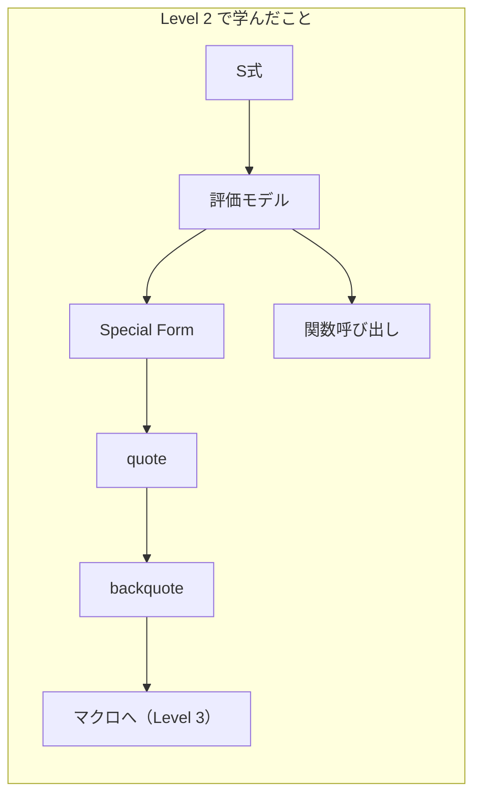

