# Level 3 (マクロとメタプログラミング)


## 1. メタプログラミングとは

**メタプログラミング**とは、「プログラムを操作するプログラム」を書くことである。Level 2 で学んだ通り、Lispでは**コードとデータが同じ構造（S式）** で表現される。この性質を活かし、プログラムで新しいプログラムを生成できる。


### 1-1. なぜメタプログラミングが可能か

Lispの**同像性（homoiconicity）** により、以下が成り立つ。

1. コードはリスト（S式）である
2. リストはデータとして操作できる
3. したがって、コードをデータとして操作できる

```lisp
;; これはコード
(+ 1 2 3)  ; → 6

;; これはデータ（リスト）
'(+ 1 2 3)  ; → (+ 1 2 3)

;; データをコードとして実行
(eval '(+ 1 2 3))  ; → 6
```


## 2. eval ― 動的評価

### 2-1. eval の基本

**eval** は、S式を受け取り、それを評価して結果を返す関数である。

```lisp
(eval 42)           ; → 42（自己評価）
(eval "hello")      ; → "hello"（自己評価）
(eval '(+ 1 2))     ; → 3（リストを評価）
(eval '(list 1 2))  ; → (1 2)
```

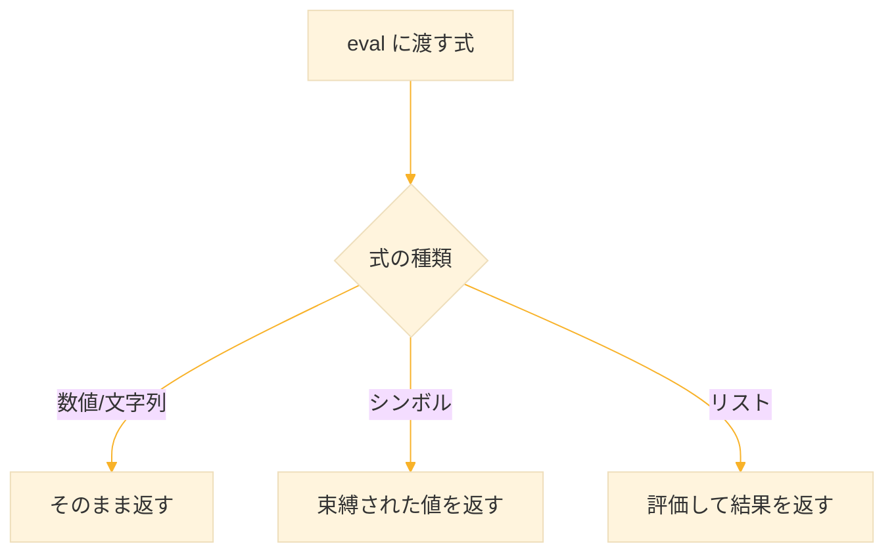

### 2-2. eval による動的コード実行

```lisp
;; コードを動的に組み立てて実行
(defparameter *op* '+)
(defparameter *args* '(1 2 3 4 5))

(eval (cons *op* *args*))
;; (cons '+ '(1 2 3 4 5)) → (+ 1 2 3 4 5)
;; (eval '(+ 1 2 3 4 5)) → 15
```

### 2-3. eval の注意点

eval は強力だが、以下の理由から**使用は最小限に**すべきである：

1. **パフォーマンス** - 実行時にコンパイル/解釈が必要
2. **セキュリティ** - 任意のコードが実行される危険
3. **デバッグ困難** - 動的生成コードは追跡しにくい

```lisp
;; 悪い例：ユーザー入力を直接 eval
(eval (read))  ; 危険！任意のコードが実行される

;; 良い例：限定された操作のみ許可
(defun safe-calc (op a b)
  (case op
    (+ (+ a b))
    (- (- a b))
    (* (* a b))
    (/ (/ a b))
    (otherwise (error "Unknown operator"))))
```

> **原則：** eval が必要と思ったら、まずマクロで解決できないか検討せよ。


## 3. マクロの基礎

### 3-1. 関数とマクロの違い

**関数**と**マクロ**は見た目が似ているが、動作タイミングが根本的に異なる。

| 特性 | 関数 | マクロ |
|------|------|--------|
| 実行時期 | 実行時 | コンパイル時/マクロ展開時 |
| 引数の扱い | 評価された値を受け取る | 評価前の式を受け取る |
| 戻り値 | 計算結果 | 新しいコード（S式） |
| 用途 | 値の計算 | 構文の拡張 |

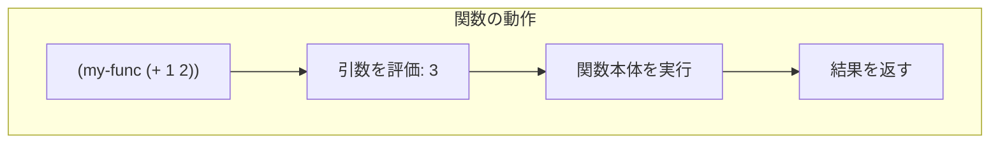

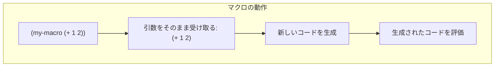

### 3-2. defmacro による定義

```lisp
(defmacro マクロ名 (引数...)
  本体)
```

簡単な例

```lisp
;; nil かどうかを判定するマクロ
(defmacro nil? (x)
  `(null ,x))

;; 使用
(nil? '())  ; → T
(nil? 42)   ; → NIL

;; 展開結果を確認
(macroexpand-1 '(nil? foo))
;; → (NULL FOO)
```

### 3-3. macroexpand による展開確認

マクロがどのようなコードに展開されるかを確認するには、**macroexpand-1** または **macroexpand** を使用する。

```lisp
;; macroexpand-1: 1段階だけ展開
(macroexpand-1 '(nil? x))
;; → (NULL X)

;; macroexpand: 完全に展開（マクロがなくなるまで）
(macroexpand '(nil? x))
;; → (NULL X)
```

## 4. 実用的なマクロの例

この章では、簡単なマクロから段階的に学んでいく。

### 4-1. 最初のマクロ：say-hello

まずは最も簡単なマクロを作ってみよう。

```lisp
;; 定義
(defmacro say-hello ()
  '(print "Hello!"))

;; 使用
(say-hello)
;; → "Hello!"
```

このマクロは引数を取らず、常に `(print "Hello!")` というコードに置き換わる。

**展開を確認してみよう**

```lisp
(macroexpand-1 '(say-hello))
;; → (PRINT "Hello!")
```


#### 4-2. 引数を取るマクロ：say

次に、引数を取るマクロを作ってみよう。

```lisp
;; 定義
(defmacro say (message)
  `(print ,message))

;; 使用
(say "Good morning!")
;; → "Good morning!"

(say "Good night!")
;; → "Good night!"
```

**ポイント**
- バッククォート `` ` `` でテンプレートを作る
- `,message` で引数の値を埋め込む

**展開を確認：**

```lisp
(macroexpand-1 '(say "Good morning!"))
;; → (PRINT "Good morning!")
```

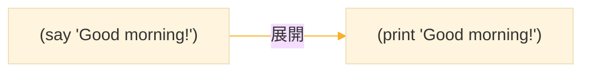


### 4-3. 複数の処理をまとめる：twice

同じ処理を2回実行するマクロを作ってみよう。

```lisp
;; 定義
(defmacro twice (action)
  `(progn
     ,action
     ,action))

;; 使用
(twice (print "Hello"))
;; → "Hello"
;; → "Hello"
```

##### progn とは

`progn` は複数の式を順番に実行し、最後の式の値を返す。

```lisp
(progn
  (print "1番目")
  (print "2番目")
  (print "3番目"))
;; → "1番目" "2番目" "3番目" が順に表示
;; → 戻り値は "3番目"
```

**展開を確認**

```lisp
(macroexpand-1 '(twice (print "Hello")))
;; → (PROGN (PRINT "Hello") (PRINT "Hello"))
```

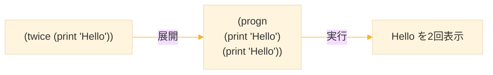


### 4-4. 条件付き実行：my-when

「条件が真のときだけ実行する」マクロを作ろう。

**まず、if の復習**

```lisp
(if 条件
    真のときの処理
    偽のときの処理)

;; 例
(if (> 5 3)
    (print "大きい")
    (print "小さい"))
;; → "大きい"
```

**問題：if では真のとき1つの式しか書けない**

```lisp
;; これはエラー！
(if (> 5 3)
    (print "5は")
    (print "3より大きい")  ; ← これは偽のときの処理になってしまう
    nil)
```

**解決策1：progn を使う**

```lisp
(if (> 5 3)
    (progn
      (print "5は")
      (print "3より大きい"))
    nil)
```

**解決策2：when マクロを作る**

毎回 `progn` を書くのは面倒なので、マクロで自動化しよう。

```lisp
;; 定義
(defmacro my-when (condition &body body)
  `(if ,condition
       (progn ,@body)
       nil))
```

#### `&body`の説明

| 記法 | 意味 |
|------|------|
| `&body body` | 残りの引数をすべてリストとして受け取る |
| `,@body` | リストの中身を展開して埋め込む |

**使用例**

```lisp
(my-when (> 5 3)
  (print "5は")
  (print "3より大きい"))
;; → "5は"
;; → "3より大きい"
```

**展開を確認：**

```lisp
(macroexpand-1 '(my-when (> 5 3)
                  (print "5は")
                  (print "3より大きい")))
;; → (IF (> 5 3)
;;       (PROGN (PRINT "5は") (PRINT "3より大きい"))
;;       NIL)
```

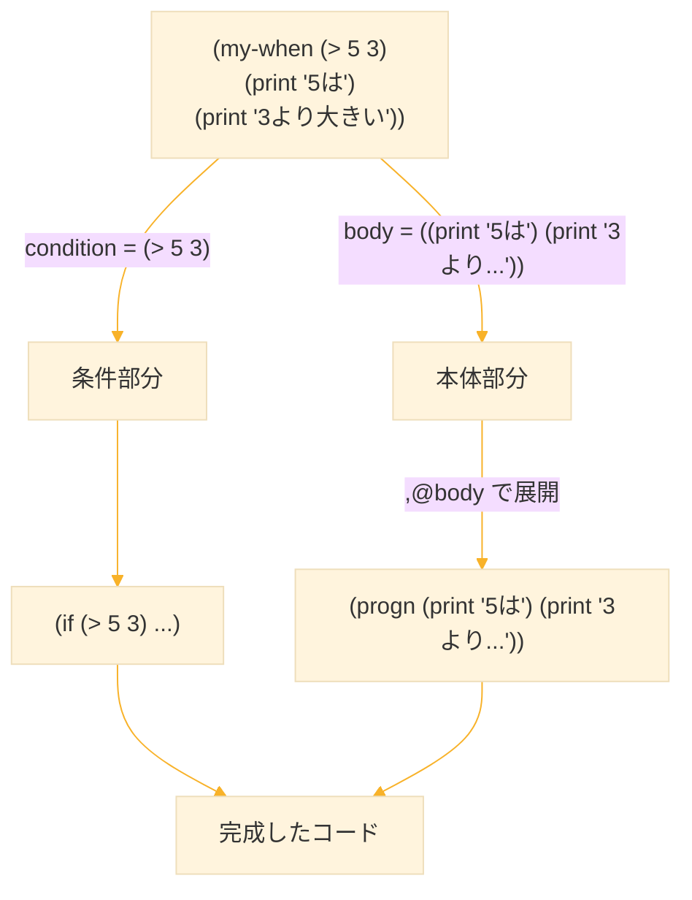


### 4-5. 条件が偽のとき実行：my-unless

`when` の逆、「条件が偽のときだけ実行する」マクロを作ろう。

```lisp
;; 定義
(defmacro my-unless (condition &body body)
  `(if (not ,condition)
       (progn ,@body)
       nil))

;; 使用例
(my-unless (< 5 3)
  (print "5は3より小さくない"))
;; → "5は3より小さくない"
```

**展開を確認：**

```lisp
(macroexpand-1 '(my-unless (< 5 3) (print "実行される")))
;; → (IF (NOT (< 5 3))
;;       (PROGN (PRINT "実行される"))
;;       NIL)
```


### 4-6. &body と ,@ の理解を深める

ここが重要なので、もう少し詳しく見てみよう。

**&body なしの場合：**

```lisp
(defmacro bad-when (condition body)
  `(if ,condition ,body nil))

;; 1つの式しか渡せない
(bad-when (> 5 3) (print "OK"))  ; → OK

;; 複数の式を渡したい場合は自分で progn を書く必要がある
(bad-when (> 5 3) (progn (print "A") (print "B")))
```

**&body ありの場合：**

```lisp
(defmacro good-when (condition &body body)
  `(if ,condition (progn ,@body) nil))

;; 複数の式をそのまま書ける
(good-when (> 5 3)
  (print "A")
  (print "B")
  (print "C"))
```

**,@ の動作**

```lisp
;; body = ((print "A") (print "B") (print "C")) のとき

;; ,body を使うと（リストがそのまま入る）
`(progn ,body)
;; → (PROGN ((PRINT "A") (PRINT "B") (PRINT "C")))
;; これは間違い！

;; ,@body を使うと（リストの中身が展開される）
`(progn ,@body)
;; → (PROGN (PRINT "A") (PRINT "B") (PRINT "C"))
;; これが正しい！
```

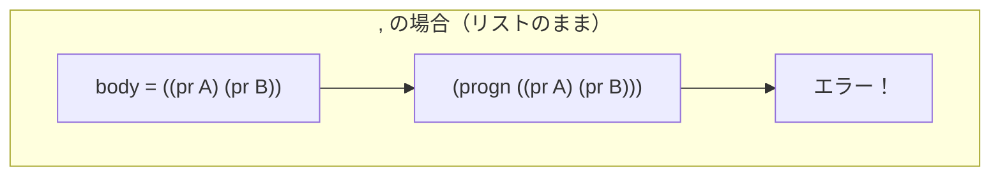
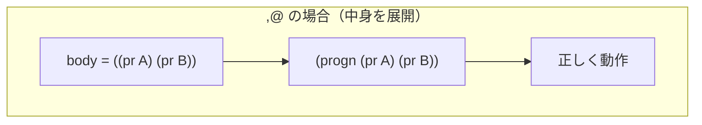


### 4-7. 実用例：計算結果を表示するマクロ

学んだことを使って、便利なマクロを作ってみよう。

```lisp
;; 式とその結果を表示するマクロ
(defmacro show (expr)
  `(format t "~a => ~a~%" ',expr ,expr))

;; 使用例
(show (+ 1 2 3))
;; 表示: (+ 1 2 3) => 6

(show (* 4 5))
;; 表示: (* 4 5) => 20
```

**ポイント**
- `',expr` は式そのもの（評価しない）
- `,expr` は式の評価結果

**展開を確認**

```lisp
(macroexpand-1 '(show (+ 1 2)))
;; → (FORMAT T "~a => ~a~%" '(+ 1 2) (+ 1 2))
;;                          ↑評価しない  ↑評価する
```

### 4-8. まとめ：マクロ作成の基本パターン

```lisp
(defmacro マクロ名 (引数... &body body)
  `(生成したいコード
     ,単一の値を埋め込む
     ,@リストの中身を展開))
```

| パーツ | 役割 |
|--------|------|
| `` ` `` | テンプレート開始 |
| `,x` | x の値を埋め込む |
| `,@xs` | xs の中身を展開 |
| `&body body` | 残り全部をリストで受け取る |
| `progn` | 複数の式を順番に実行 |

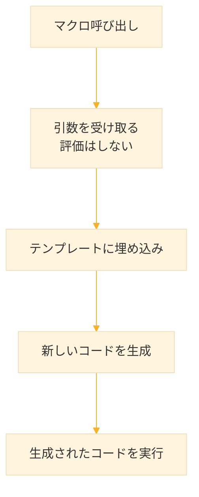

## 5. マクロ作成の注意点

マクロは強力だが、注意しないとバグを生みやすい。ここでは2つの典型的な問題と解決法を学ぶ。

### 5-1. 問題その1：多重評価

**まず、2倍にするマクロを作ってみよう**

```lisp
;; 定義
(defmacro bad-double (x)
  `(+ ,x ,x))

;; テスト
(bad-double 5)
;; → 10（正しい）

(bad-double (+ 1 2))
;; → 6（正しい）
```

一見問題なさそうに見える。

**問題が発生するケース：**

```lisp
(progn
  (defmacro bad-double (x)
    `(+ ,x ,x))
  
  (let ((n 0))
    (bad-double (incf n))))
;; → 3
```

**展開して原因を調べる：**

```lisp
(macroexpand-1 '(bad-double (incf n)))
;; → (+ (INCF N) (INCF N))
```

`(incf n)` が2回現れている！

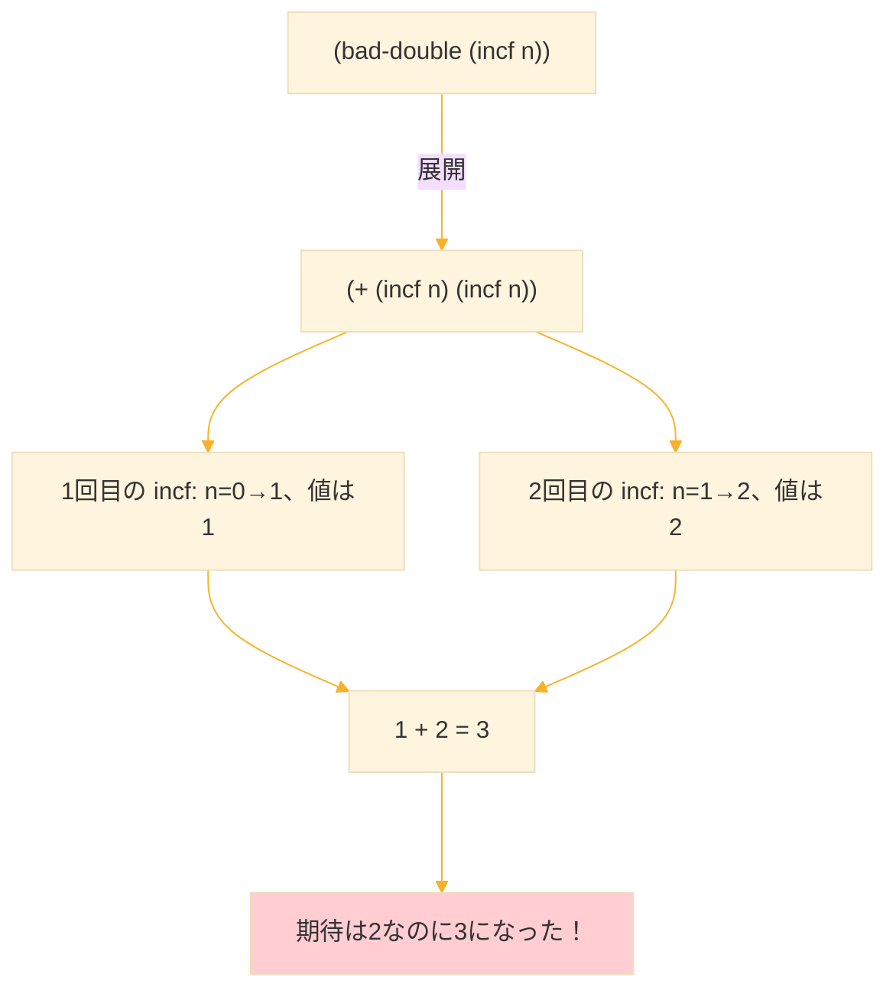

**解決策：引数を一度だけ評価する**

```lisp
;; 定義（安全版）
(defmacro good-double (x)
  `(let ((temp ,x))
     (+ temp temp)))

;; 展開を確認
(macroexpand-1 '(good-double (incf n)))
;; → (LET ((TEMP (INCF N)))
;;      (+ TEMP TEMP))
```

これなら `(incf n)` は1回しか評価されない。

```lisp
;; テスト
(progn
  (defmacro good-double (x)
    `(let ((temp ,x))
       (+ temp temp)))
    
  (let ((n 0))
    (good-double (incf n))))
;; → 2（正しい！）
;; n=0→1、temp=1、1+1=2
```

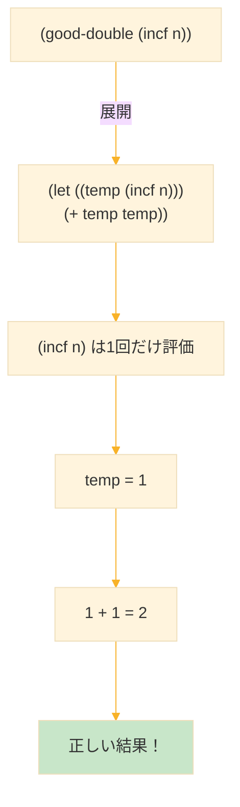

### 5-2. 問題その2：変数の衝突

**問題が発生するケース**

```lisp
;; 10を足すマクロ（問題あり）
(defmacro bad-add-10 (x)
  `(let ((value 10))
     (+ ,x value)))

;; テスト（普通の使い方）
(bad-add-10 5)
;; → 15（正しい）

;; ユーザーが value という変数を使うと...
(let ((value 3))
  (bad-add-10 value))
;; 期待: 3 + 10 = 13
;; 実際: ???
```

**展開して確認：**

```lisp
(macroexpand-1 '(bad-add-10 value))
;; → (LET ((VALUE 10))
;;      (+ VALUE VALUE))

;; つまり全体では：
(let ((value 3))
  (let ((value 10))    ; 内側の value が外側を隠す！
    (+ value value)))  ; value は 10 を参照
;; → 20（期待は13なのに！）
```

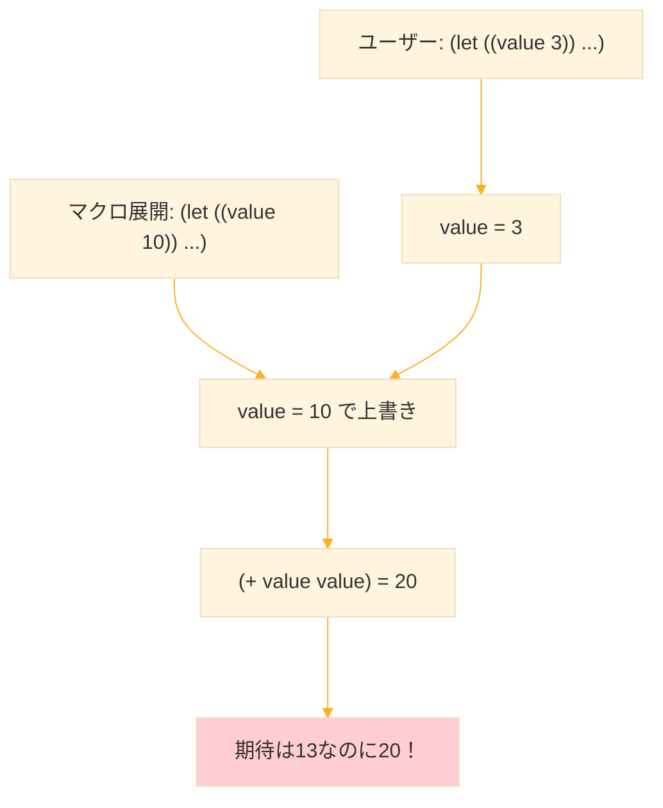

### 5-3. 解決策：gensym

**gensym** は「絶対に他と衝突しない名前」を作る関数である。

```lisp
(gensym)        ; → #:G123
(gensym)        ; → #:G124（呼ぶたびに違う）
(gensym "TEMP") ; → #:TEMP125（接頭辞付き）
```

`#:` で始まるシンボルは、他のどのシンボルとも等しくならない。

**gensym を使った安全なマクロ：**

```lisp
;; 定義（安全版）
(defmacro safe-double (x)
  (let ((temp (gensym "TEMP")))  ; マクロ展開時に一意な名前を生成
    `(let ((,temp ,x))
       (+ ,temp ,temp))))

;; 展開を確認
(macroexpand-1 '(safe-double (+ 1 2)))
;; → (LET ((#:TEMP126 (+ 1 2)))
;;      (+ #:TEMP126 #:TEMP126))
```

ユーザーがどんな変数名を使っても衝突しない。

```lisp
;; テスト
(let ((temp 100))
  (safe-double temp))
;; → 200（正しい！temp=100、100+100=200）

(let ((n 0))
  (safe-double (incf n)))
;; → 2（正しい！多重評価も防げている）
```

**safe-add-10 も修正：**

```lisp
;; 定義（安全版）
(defmacro safe-add-10 (x)
  (let ((val (gensym "VAL")))
    `(let ((,val 10))
       (+ ,x ,val))))

;; テスト
(let ((value 3))
  (safe-add-10 value))
;; → 13（正しい！）
```

展開を確認：

```lisp
(macroexpand-1 '(safe-add-10 value))
;; → (LET ((#:VAL127 10))
;;      (+ VALUE #:VAL127))
;; VALUE は外側の変数を参照する
```

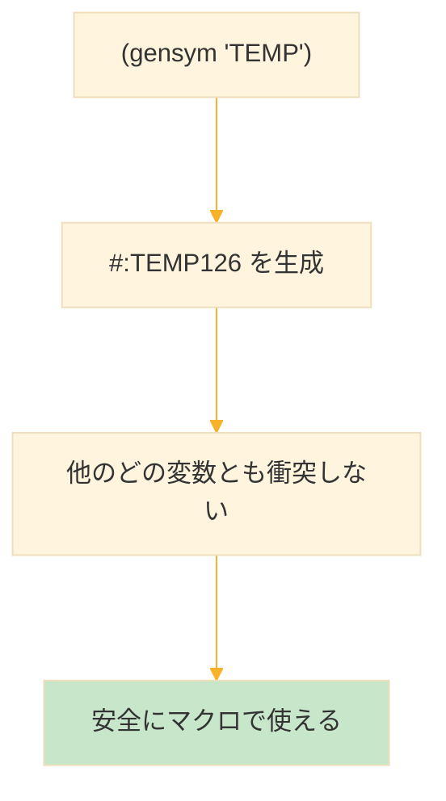

### 5-4. マクロ作成のチェックリスト

マクロを書いたら、以下を確認しよう：

| チェック項目 | 問題 | 対策 |
|--------------|------|------|
| 引数が複数回現れる？ | 多重評価 | let で一度だけ評価 |
| マクロ内で変数を使う？ | 変数衝突 | gensym を使う |
| 展開結果は正しい？ | - | macroexpand-1 で確認 |

**安全なマクロのテンプレート：**

```lisp
(defmacro safe-macro (arg)
  (let ((temp (gensym "TEMP")))   ; 1. gensym で変数名を作る
    `(let ((,temp ,arg))          ; 2. 引数を一度だけ評価
       ;; ,temp を使って処理
       )))
```

## 6. 演習問題と解説

### 演習1：square マクロ

引数を2乗するマクロ `square` を作成せよ。多重評価と変数衝突を防ぐこと。

```lisp
(square 5)
;; → 25

(let ((n 3))
  (square (incf n)))
;; → 16（3→4になり、4*4=16）
```

**解答**

```lisp
(defmacro square (x)
  (let ((temp (gensym "TEMP")))
    `(let ((,temp ,x))
       (* ,temp ,temp))))
```

**テスト**

```lisp
;; 基本テスト
(square 5)
;; → 25

;; 多重評価のテスト
(let ((n 3))
  (square (incf n)))
;; → 16

;; 展開確認
(macroexpand-1 '(square (incf n)))
;; → (LET ((#:TEMP128 (INCF N)))
;;      (* #:TEMP128 #:TEMP128))
```


### 演習2：my-unless マクロ

条件が偽のときだけ実行する `my-unless` を作成せよ。

```lisp
(my-unless (> 3 5)
  (print "3は5より大きくない")
  (print "だから実行される"))
;; → 2つとも表示される
```

**解答**

```lisp
(defmacro my-unless (condition &body body)
  `(if (not ,condition)
       (progn ,@body)
       nil))
```

**テスト**

```lisp
(my-unless (> 3 5)
  (print "実行される"))
;; → "実行される"

(my-unless (< 3 5)
  (print "実行されない"))
;; → NIL（何も表示されない）

;; 展開確認
(macroexpand-1 '(my-unless (> 3 5) (print "yes")))
;; → (IF (NOT (> 3 5))
;;       (PROGN (PRINT "yes"))
;;       NIL)
```


### 演習3：with-message マクロ

処理の前後にメッセージを表示するマクロを作成せよ。

```lisp
(with-message "計算中"
  (+ 1 2)
  (* 3 4))
;; 表示: 計算中...開始
;; 表示: 計算中...終了
;; 戻り値: 12
```

**ヒント：** `prog1` は最初の式の値を返し、残りの式も実行する。

```lisp
(prog1
  (+ 1 2)      ; ← この値（3）が返る
  (print "A")  ; 実行されるが戻り値には影響しない
  (print "B")) ; 実行されるが戻り値には影響しない
;; 表示: "A" "B"
;; 戻り値: 3
```

**解答**

```lisp
(defmacro with-message (msg &body body)
  `(progn
     (format t "~a...開始~%" ,msg)
     (prog1
       (progn ,@body)
       (format t "~a...終了~%" ,msg))))
```

**テスト**

```lisp
(with-message "計算中"
  (+ 1 2)
  (* 3 4))
;; 出力:
;; 計算中...開始
;; 計算中...終了
;; 戻り値: 12
```


### 演習4：repeat マクロ

指定回数だけ処理を繰り返す `repeat` マクロを作成せよ。

```lisp
(repeat 3
  (print "Hello"))
;; "Hello" が3回表示される
```

**ヒント：** `dotimes` を使う。

```lisp
;; dotimes の基本
(dotimes (i 3)
  (print i))
;; 0, 1, 2 が表示される
```

**解答**

```lisp
(defmacro repeat (n &body body)
  (let ((i (gensym "I"))
        (limit (gensym "LIMIT")))
    `(let ((,limit ,n))
       (dotimes (,i ,limit)
         ,@body))))
```

**なぜ gensym が2つ必要か：**

1. `limit` → n を一度だけ評価するため
2. `i` → ループ変数がユーザーの変数と衝突しないため

**テスト**

```lisp
(repeat 3
  (print "Hello"))
;; "Hello"
;; "Hello"
;; "Hello"

;; 多重評価のテスト
(let ((count 3))
  (repeat (progn (print "counting") count)
    (print "Hello")))
;; "counting" は1回だけ表示される
;; "Hello" は3回表示される
```

## 7. マクロのデバッグ方法

### 7-1. macroexpand-1 を使う

マクロが思った通りに動かないときは、まず展開結果を確認する。

```lisp
;; 1段階だけ展開
(macroexpand-1 '(my-when (> x 0) (print x)))
;; → (IF (> X 0) (PROGN (PRINT X)) NIL)
```

### 7-2. pprint で見やすく表示

複雑な展開結果は pprint（pretty print）を使うと見やすい。

```lisp
(pprint (macroexpand-1 '(repeat 3 (print "a") (print "b"))))
;; 整形されて表示される
```

### 7-3. 段階的に開発する

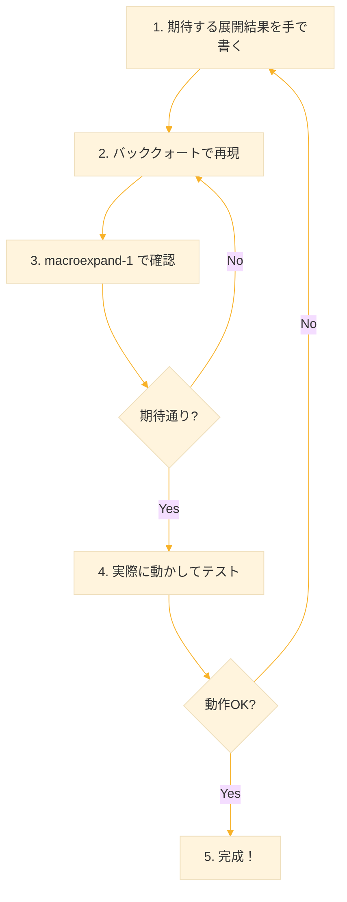

**例：square マクロを作る過程**

```lisp
;; 1. 期待する展開結果を手で書く
;; (square expr) は以下に展開されてほしい：
(let ((temp expr))
  (* temp temp))

;; 2. バッククォートで再現
;; temp は gensym で作る
(let ((temp (gensym)))
  `(let ((,temp expr))
     (* ,temp ,temp)))

;; 3. マクロとして定義
(defmacro square (x)
  (let ((temp (gensym)))
    `(let ((,temp ,x))
       (* ,temp ,temp))))

;; 4. 展開を確認
(macroexpand-1 '(square (+ 1 2)))
;; → 期待通りか確認

;; 5. 実行テスト
(square 5)        ; → 25
(square (+ 1 2))  ; → 9
```

## 8. まとめ

#### 学んだこと

1. **多重評価問題**
   - マクロの引数が複数回現れると、複数回評価される
   - 解決策：`let` で一度だけ評価して変数に束縛する

2. **変数衝突問題**
   - マクロ内の変数がユーザーの変数と同名だと衝突する
   - 解決策：`gensym` で一意な変数名を生成する

3. **安全なマクロのパターン**
   ```lisp
   (defmacro safe-macro (arg)
     (let ((temp (gensym)))
       `(let ((,temp ,arg))
          ;; ,temp を使う
          )))
   ```

4. **デバッグ方法**
   - `macroexpand-1` で展開結果を確認する
   - 期待する展開結果を先に書き、それを再現する

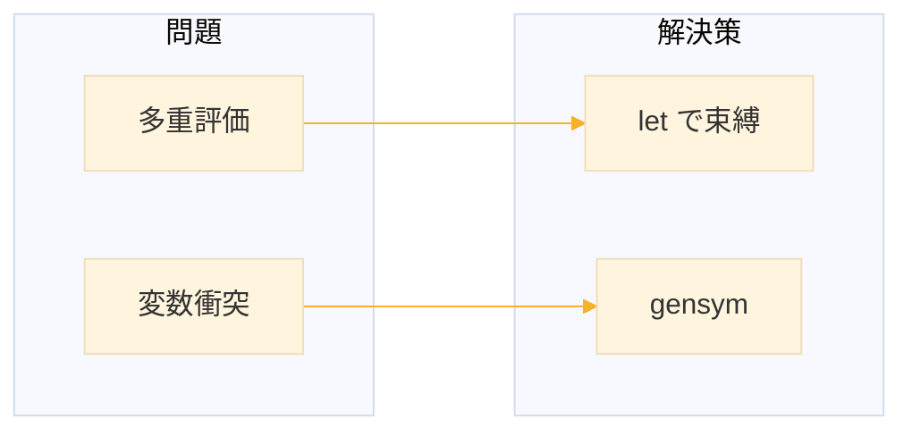

