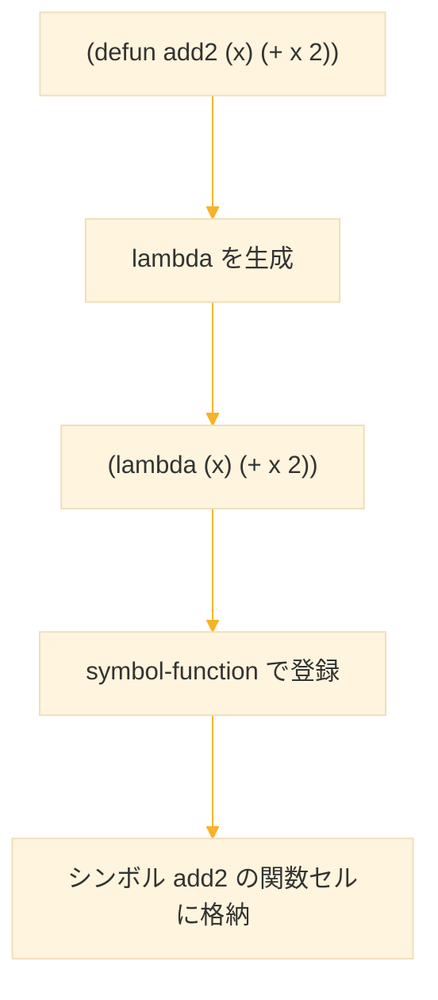
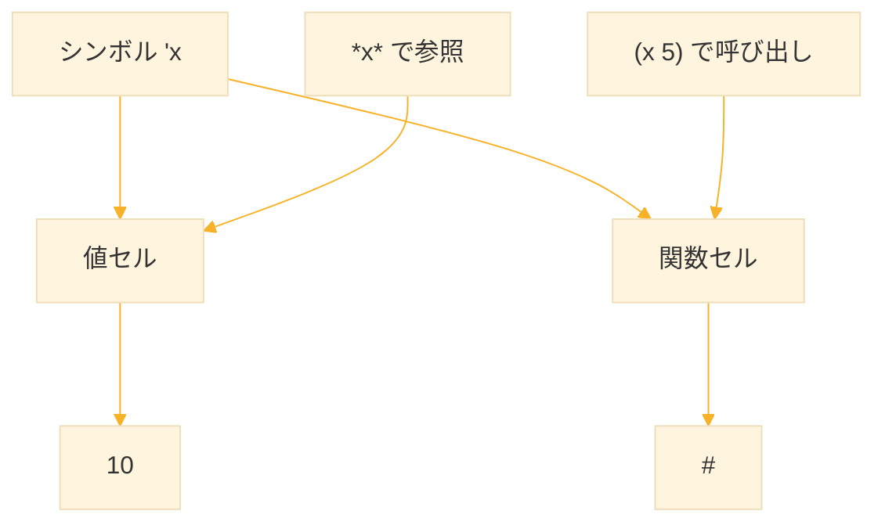
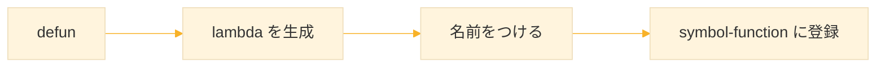
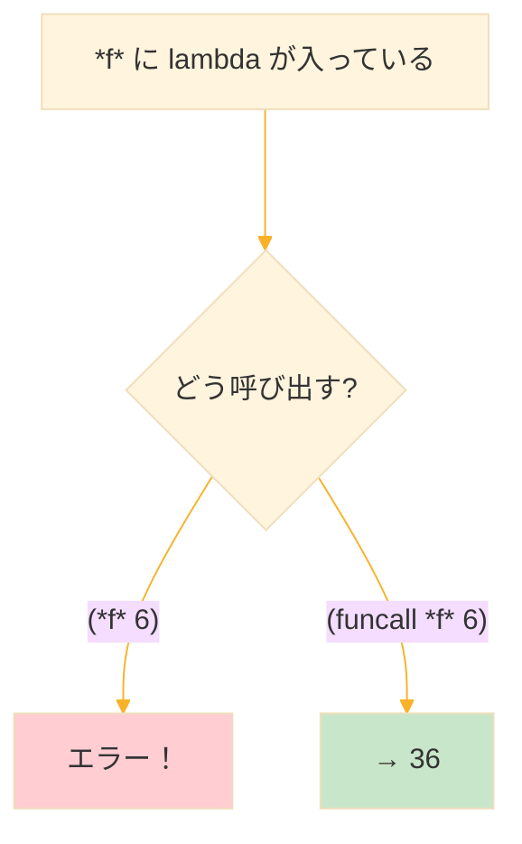
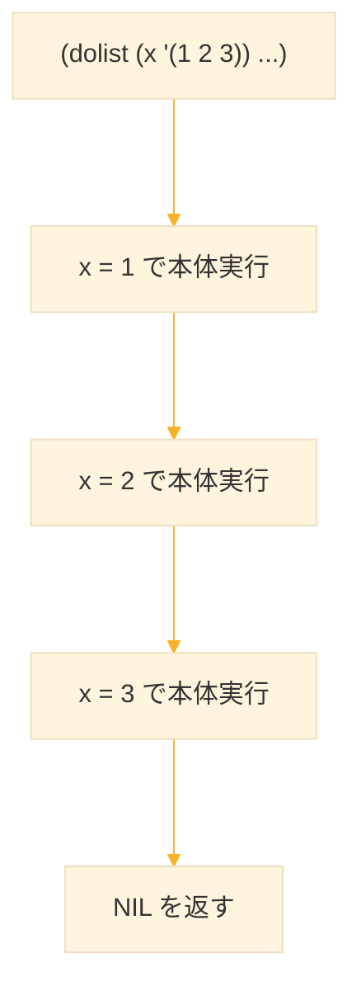
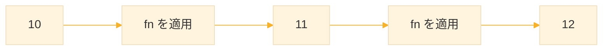
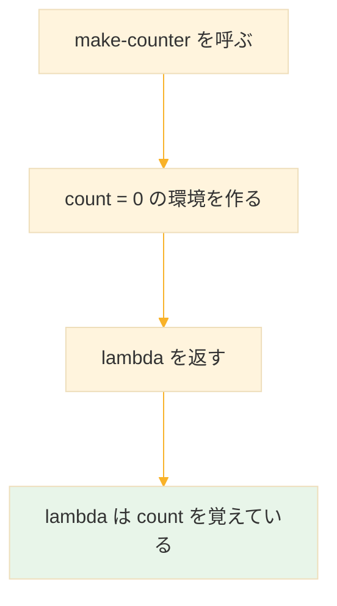
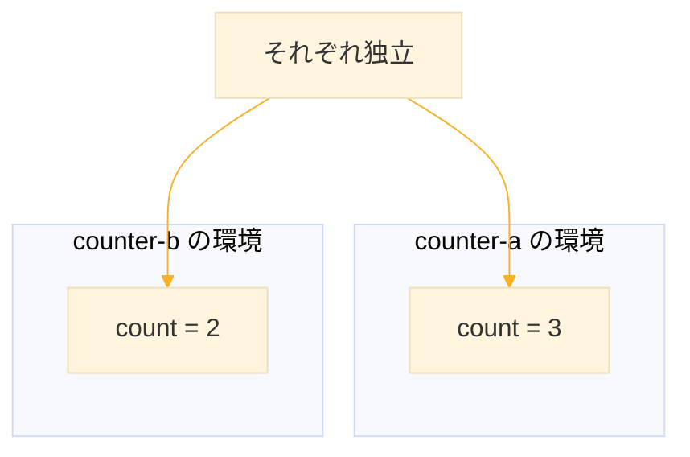

# Level 4 (関数定義：抽象化と λ（ラムダ）の意味)

この回の目的は、Common Lisp における「関数」という概念を、単なる「処理のかたまり」から一歩進め、

> **関数＝データを別のデータに変換する"装置"であり、プログラムの中で自由に扱える"値"である**

という視点で捉えなおすことにある。

そのために、次の6つのキーワードを段階的に扱う。

1. **defun**：名前付き関数を定義する構文
2. **lambda**：無名関数（関数オブジェクト）を作る構文
3. **setf**：変数や構造に値を書き込むための汎用代入マクロ
4. **symbol-function**：シンボルに結びついた「関数セル」を操作するための仕組み
5. **funcall**：関数オブジェクトを明示的に呼び出すための関数
6. **dolist**：リストを走査するための高レベルな反復マクロ

これらを理解すると、「関数を変数に入れる」「関数を引数として渡す」「関数を返す」といった Lisp 的な抽象化が自然に書けるようになる。


## 1. もう一度考える：「関数」とは何か

### 1-1. 手続き型言語での一般的イメージ

C, Java, Python などで「関数」と言うと、次のようなイメージが強い。

- 何か処理をまとめた「手続きのかたまり」
- コードを整理するための「ラベル」「箱」
- 同じ処理を何度も書かずに済ませるための仕組み

Python の例を見ると、その感覚がよく分かる。

```python
def add2(x):
    return x + 2
```

ここでは `add2` は「x+2 をする場所」であり、「あとで呼び出すための名前」として理解されがちである。

### 1-2. Lisp における関数のイメージ

Common Lisp では、関数はもう少し数学に近い形で考える。

> **関数＝入力を受け取り、出力を返す"変換装置"**

と理解するのが自然である。

例として、

- 入力：数 → 出力：別の数
- 入力：文字列 → 出力：整形された文字列
- 入力：リスト → 出力：別のリスト

のように、「ある型のデータを別のデータへ変換する装置」という視点を持つとよい。

さらに Lisp では、この「関数」が

- 変数に代入できる
- 引数として渡せる
- 返り値として返せる

といった性質を持つ。このようなオブジェクトを **第一級オブジェクト（first-class object）** と呼ぶ。


## 2. defun を丁寧に分解して理解する

### 2-1. defun の基本形

```lisp
(defun 関数名 (引数...)
  本体)
```

具体例：

```lisp
(defun add2 (x)
  (+ x 2))

(add2 10)
;; → 12
```

これを細かく読むと、次のようになる。

| 要素 | 説明 |
|------|------|
| `defun` | 新しい関数を定義するための特殊形式 |
| `add2` | 関数の名前（シンボル） |
| `(x)` | 引数リスト（ここでは引数が1つ） |
| `(+ x 2)` | 関数本体（実際に行う処理） |

Common Lisp では、**最後に評価された式の値が、その関数の返り値になる**というルールがある。

### 2-2. defun の本質：lambda に名前をつけているだけ

ここからが Lisp 的な重要ポイントである。実は defun の本質は、次のように書き換えられる。

> 「無名関数（lambda）を作り、それに名前を紐づけている」

技術的に書くと：

```lisp
(setf (symbol-function 'add2)
      (lambda (x)
        (+ x 2)))
```

`defun` という構文は、上のような処理を見やすい形にまとめた **"糖衣構文"** であると理解してよい。



## 3. symbol-function：関数セルを操作する

### 3-1. シンボルが持つ2つの「顔」

Common Lisp のシンボルは、内部的に複数の「セル」を持っている。ここでは次の2つを意識すればよい。

| セル | 役割 |
|------|------|
| 値セル（value cell） | 変数の値を格納する場所 |
| 関数セル（function cell） | 関数オブジェクトを格納する場所 |

同じ名前のシンボルでも、「変数としての x」と「関数としての x」が共存できる。

```lisp
;; 値セルに 10 を代入
(defparameter x 10)

;; 関数セルに関数を代入
(defun x (y) (* y y))

;; 両方使える
x        ;; → 10（変数）
(x 5)    ;; → 25（関数）
```



### 3-2. symbol-function の役割

`symbol-function` は、あるシンボルに結びついた「関数セル」を操作するための関数である。

```lisp
;; 関数を定義
(defun add2 (x) (+ x 2))

;; 関数セルの中身を取得
(symbol-function 'add2)
;; → #<FUNCTION ADD2>
```

`setf` と組み合わせることで、関数セルに直接書き込める。

```lisp
;; symbol-function で関数を登録
(setf (symbol-function 'my-square)
      (lambda (x) (* x x)))

;; 使用
(my-square 5)
;; → 25
```

つまり `defun` は、「symbol-function による関数セル操作」を分かりやすく書くための構文だと理解できる。


## 4. lambda：無名関数という「関数そのもの」

### 4-1. lambda の基本形

`lambda` は、無名関数（名前のない関数）を作るための構文である。

```lisp
(lambda (引数...)
  本体)
```

簡単な例

```lisp
(lambda (x) (+ x 10))
;; → #<FUNCTION (LAMBDA (X)) ...>
```

この時点ではまだ何も実行していない。これは「x を受け取って x+10 を返す関数オブジェクトを生成しただけ」である。

### 4-2. 無名関数をその場で呼び出す

無名関数も、通常の関数と同様に括弧をつけて呼び出すことができる。

```lisp
((lambda (x) (+ x 10)) 5)
;; → 15
```

読むときは、「`(lambda (x) (+ x 10))` という関数を、引数 5 で呼び出す」と理解すればよい。

数学の λ 計算で書く `(λx. x+10)(5)` に非常に近い。

### 4-3. defun と lambda の対応関係

```lisp
;; defun で定義
(defun add2 (x)
  (+ x 2))

;; 上と同じ意味
(setf (symbol-function 'add2)
      (lambda (x)
        (+ x 2)))
```

つまり、**defun は「この lambda に、この名前をつけておいて」と処理系に頼む構文**である。



## 5. setf：値の変更・代入を行う汎用マクロ

### 5-1. setf の基本的役割

`setf` は、Common Lisp における「代入」の標準的な手段である。

```lisp
;; 変数を定義してから代入
(defparameter *x* 0)
(setf *x* 10)
*x*
;; → 10
```

`setf` の特徴は、「どこに書き込むか」という **"場所（place）"** を抽象化して扱える点にある。

### 5-2. さまざまな場所に対する代入

`setf` は変数だけでなく、さまざまな場所に値を書き込める。

```lisp
;; 1. リストの要素を書き換える
(defparameter *lst* (list 'b 'c))
(setf (car *lst*) 'a)
*lst*
;; → (A C)

;; 2. 配列の要素を書き換える
(defparameter *arr* (make-array 3 :initial-contents '(10 20 30)))
(setf (aref *arr* 0) 100)
*arr*
;; → #(100 20 30)

;; 3. 関数セルへの割り当て
(setf (symbol-function 'f) (lambda (x) (* x x)))
(f 4)
;; → 16
```

このように、`setf` は「いろいろな種類の"左辺"に値を設定するための統一インターフェース」として使える。

### 5-3. setf と setq の違い

```lisp
;; setq: 変数への代入のみ
(setq *x* 10)

;; setf: 変数 + 構造への代入（より汎用的）
(setf *x* 10)           ; 変数
(setf (car *lst*) 1)    ; リストの要素
(setf (aref *arr* 0) 2) ; 配列の要素
```

`setf` は `setq` の上位互換なので、通常は `setf` を使えばよい。

## 6. funcall：関数オブジェクトを呼び出す

### 6-1. 関数を変数に入れる

関数も「値」なので、変数に入れることができる。

```lisp
;; 2乗する関数を変数に格納
(defparameter *f* (lambda (x) (* x x)))

;; funcall で呼び出す
(funcall *f* 6)
;; → 36
```

### 6-2. なぜ funcall が必要なのか

通常の呼び出しでは、`(add2 10)` のように「関数名」を先頭に書く。しかし変数に入っている関数を呼び出したいとき、そのまま書くとエラーになる。

```lisp
;; これはエラー
(*f* 6)
;; Error: *F* is not a function name

;; funcall を使う
(funcall *f* 6)
;; → 36
```

`funcall` は「この値を関数として解釈して呼び出してくれ」と明示的に伝えるための関数である。



### 6-3. #' 記法と function

`#'` は関数オブジェクトを取得するための省略記法である。

```lisp
(defun add2 (x) (+ x 2))

;; これらは同じ意味
##'add2
(function add2)
(symbol-function 'add2)

;; funcall で使う
(funcall #'add2 10)
;; → 12
```

`#'` を使うと、defun で定義した関数を「値として」他の関数に渡したり、変数に格納したりしやすくなる。


## 7. dolist：リストを歩くための高レベルマクロ

### 7-1. dolist の基本構文

`dolist` はリストを1つずつたどって処理するためのマクロである。

```lisp
(dolist (変数 リスト)
  本体)
```

```lisp
(dolist (x '(1 2 3 4))
  (format t "~a~%" x))
;; 1
;; 2
;; 3
;; 4
;; → NIL
```

手続き型の `for (i = 0; i < n; i++)` のようにインデックスを使うのではなく、「リスト構造を1つずつたどる」という発想で記述できるのが Lisp 的である。



### 7-2. dolist と関数オブジェクトを組み合わせる

`dolist` と `funcall` を組み合わせると、構造と処理の分離がしやすくなる。

```lisp
(defun print-mapped (fn lst)
  (dolist (x lst)
    (format t "~a~%" (funcall fn x))))
```

この `print-mapped` は、

- 「リストの各要素を取り出す」という構造（繰り返し）
- 「何をするか（fn で指定された変換）」という中身

を分離している。

呼び出し側は、「何をしたいか」だけ渡せばよい。

```lisp
(print-mapped (lambda (x) (* 2 x)) '(1 2 3 4))
;; 2
;; 4
;; 6
;; 8

(print-mapped (lambda (x) (* x x)) '(1 2 3 4))
;; 1
;; 4
;; 9
;; 16
```

このように、`dolist` は構造的な繰り返しを担当し、`lambda` + `funcall` が意味的な処理を担当する。これこそが **Lisp における抽象化の第一歩** である。


## 8. 高階関数：関数を引数・返り値として扱う

関数を「値」として扱えるということは、

- 関数を引数として受け取る
- 関数を返り値として返す

という使い方ができる、ということでもある。このような関数を **高階関数（higher-order function）** と呼ぶ。

### 8-1. 関数を引数として受け取る例

```lisp
(defun apply-twice (fn x)
  (funcall fn (funcall fn x)))
```

実行例：

```lisp
(apply-twice #'1+ 10)
;; → 12（1+ を2回適用：10 → 11 → 12）

(defun add2 (x) (+ x 2))
(apply-twice #'add2 10)
;; → 14（add2 を2回適用：10 → 12 → 14）
```



### 8-2. 関数を返す関数（関数生成）

```lisp
(defun make-adder (n)
  (lambda (x)
    (+ x n)))
```

```lisp
(defparameter *add5* (make-adder 5))
(funcall *add5* 10)
;; → 15

(defparameter *add100* (make-adder 100))
(funcall *add100* 10)
;; → 110
```

ここでは、

- `make-adder` は `lambda` を返す関数
- `lambda` 内部では `n` を「捕まえたまま」保持している（**クロージャ**）

という構造になっている。

## 9. クロージャ：環境を閉じ込める

#### 9-1. クロージャとは

**クロージャ（Closure）** は、関数とその関数が作られた環境（変数の束縛）をセットにしたものである。

```lisp
(defun make-counter ()
  (let ((count 0))
    (lambda ()
      (setf count (1+ count)))))
```



### 9-2. クロージャの動作

```lisp
(defparameter *counter* (make-counter))

(funcall *counter*)  ;; → 1
(funcall *counter*)  ;; → 2
(funcall *counter*)  ;; → 3
```

`*counter*` は `count` という変数を「閉じ込めて（close over）」いる。外からは直接 `count` にアクセスできない。

### 9-3. 独立したクロージャ

```lisp
(defparameter *counter-a* (make-counter))
(defparameter *counter-b* (make-counter))

(funcall *counter-a*)  ;; → 1
(funcall *counter-a*)  ;; → 2
(funcall *counter-b*)  ;; → 1（別のカウンター）
(funcall *counter-a*)  ;; → 3
(funcall *counter-b*)  ;; → 2
```

それぞれが独立した環境を持っている。




## 10. 標準の高階関数

Common Lisp には便利な高階関数が標準で用意されている。

### 10-1. mapcar：リストの変換

リストの各要素に関数を適用し、結果のリストを返す。

```lisp
(mapcar #'1+ '(1 2 3 4 5))
;; → (2 3 4 5 6)

(mapcar (lambda (x) (* x x)) '(1 2 3 4))
;; → (1 4 9 16)

;; 複数のリストを処理
(mapcar #'+ '(1 2 3) '(10 20 30))
;; → (11 22 33)
```

### 10-2. remove-if / remove-if-not：フィルタリング

```lisp
;; 偶数を取り除く
(remove-if #'evenp '(1 2 3 4 5 6))
;; → (1 3 5)

;; 偶数だけ残す
(remove-if-not #'evenp '(1 2 3 4 5 6))
;; → (2 4 6)
```

### 10-3. reduce：集約

リストの要素を順番に結合して1つの値にする。

```lisp
;; 合計
(reduce #'+ '(1 2 3 4 5))
;; → 15

;; 最大値
(reduce #'max '(3 1 4 1 5 9 2 6))
;; → 9

;; 初期値を指定
(reduce #'+ '(1 2 3) :initial-value 10)
;; → 16
```

### 10-4. find-if, count-if, every, some

```lisp
;; 最初の偶数を見つける
(find-if #'evenp '(1 3 5 6 7 8))
;; → 6

;; 偶数の個数
(count-if #'evenp '(1 2 3 4 5 6))
;; → 3

;; すべて偶数か
(every #'evenp '(2 4 6 8))
;; → T

;; いずれかが偶数か
(some #'evenp '(1 3 5 6))
;; → T
```

## 11. ここまでの整理

| ワード | 役割 | ポイント |
|--------|------|----------|
| defun | 名前付き関数定義 | 内部的には `setf (symbol-function ...) (lambda ...)` |
| lambda | 無名関数生成 | 関数オブジェクトそのもの |
| setf | 汎用代入マクロ | 変数・配列・スロット・関数セルなどに書き込む |
| symbol-function | 関数セル参照 | シンボルと関数オブジェクトを結びつける |
| funcall | 関数オブジェクト呼び出し | 変数や引数に入った関数を実行 |
| dolist | リスト走査マクロ | 構造の繰り返しだけを担当させると抽象化しやすい |
| mapcar | リスト変換 | 各要素に関数を適用 |
| reduce | 集約 | 要素を1つの値にまとめる |
| クロージャ | 環境を閉じ込める | 状態を持つ関数を作れる |

## 12. 練習課題

### 課題1：triple 関数

`defun` を使って、引数を3倍する関数 `triple` を定義せよ。

```lisp
(triple 5)
;; → 15
```

**解答**

```lisp
(defun triple (x)
  (* x 3))

;; テスト
(triple 5)
;; → 15
```


### 課題2：lambda で直接呼び出し

`lambda` を使って、10 を3倍する処理を書け。

**解答**

```lisp
((lambda (x) (* x 3)) 10)
;; → 30
```


### 課題3：symbol-function で関数を登録

`symbol-function` と `setf` を用いて、`square` という名前に「2乗関数」を登録せよ。その後、`(square 5)` が 25 を返すことを確認せよ。

**解答**

```lisp
(setf (symbol-function 'square)
      (lambda (x) (* x x)))

;; テスト
(square 5)
;; → 25
```


### 課題4：apply-twice を使う

以下の `apply-twice` を使って、様々な関数を試せ。

```lisp
(defun apply-twice (fn x)
  (funcall fn (funcall fn x)))
```

**解答例**

```lisp
;; まず triple を定義
(defun triple (x) (* x 3))

;; テスト
(apply-twice #'1+ 10)
;; → 12（10 → 11 → 12）

(apply-twice #'triple 2)
;; → 18（2 → 6 → 18）

(apply-twice (lambda (x) (* x x)) 2)
;; → 16（2 → 4 → 16）
```


### 課題5：dolist と lambda で変換表示

`dolist` と `lambda` を用いて、「リスト中の数を2倍して表示する」関数を書け。

**解答：**

```lisp
(defun print-doubled (lst)
  (dolist (x lst)
    (format t "~a~%" (* x 2))))

;; テスト
(print-doubled '(1 2 3 4 5))
;; 2
;; 4
;; 6
;; 8
;; 10
```

または `funcall` を使う形式：

```lisp
(defun print-mapped (fn lst)
  (dolist (x lst)
    (format t "~a~%" (funcall fn x))))

;; テスト
(print-mapped (lambda (x) (* x 2)) '(1 2 3 4 5))
;; 2
;; 4
;; 6
;; 8
;; 10
```


### 課題6：make-multiplier を作る

引数 n を受け取り、「n 倍する関数」を返す `make-multiplier` を作れ。

```lisp
(defparameter *double* (make-multiplier 2))
(funcall *double* 5)
;; → 10

(defparameter *triple* (make-multiplier 3))
(funcall *triple* 5)
;; → 15
```

**解答**

```lisp
(defun make-multiplier (n)
  (lambda (x) (* x n)))

;; テスト
(defparameter *double* (make-multiplier 2))
(funcall *double* 5)
;; → 10

(defparameter *triple* (make-multiplier 3))
(funcall *triple* 5)
;; → 15
```

