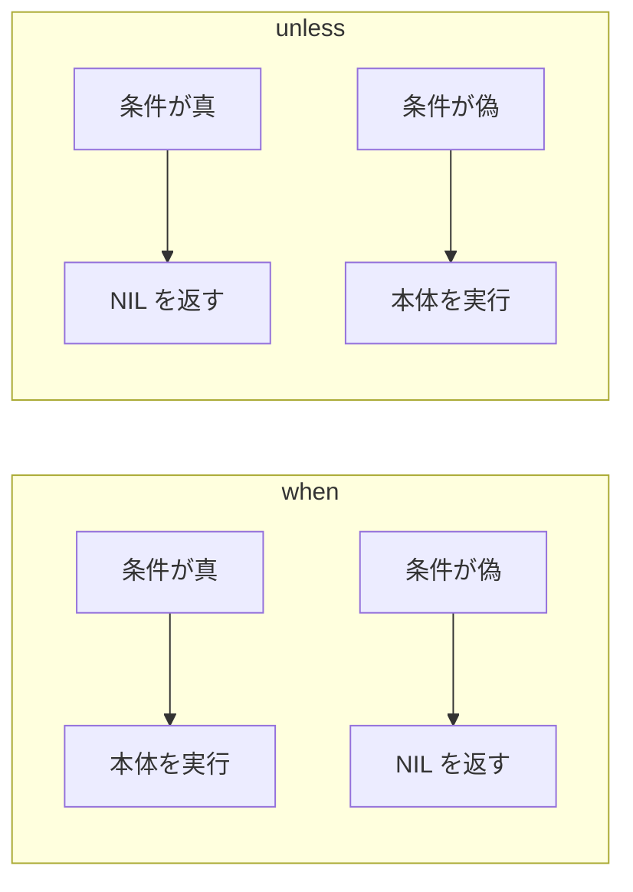
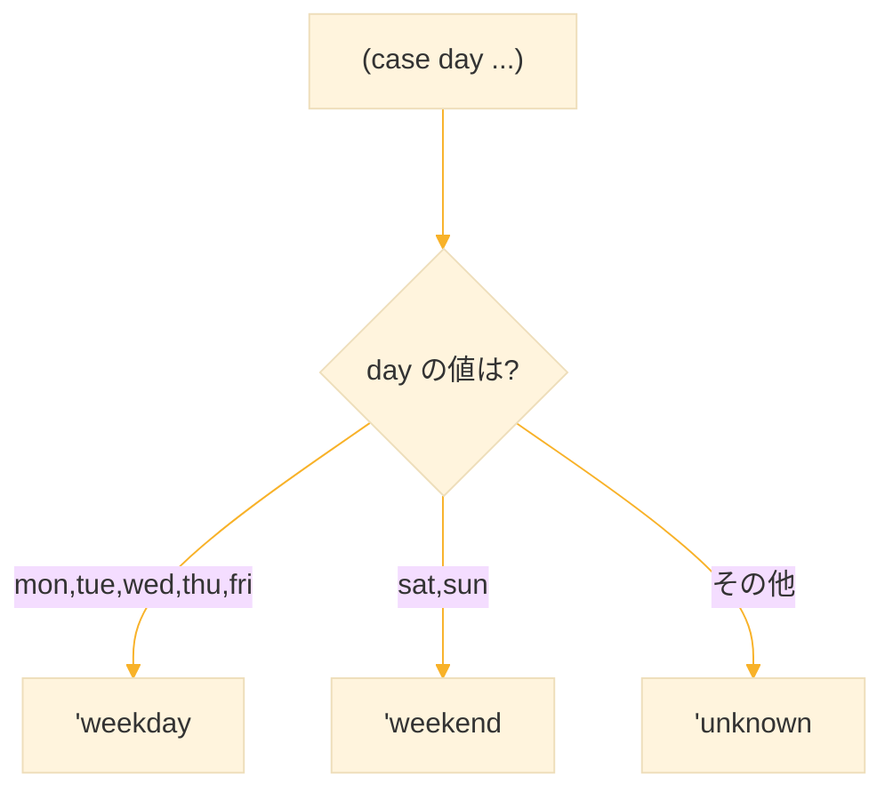
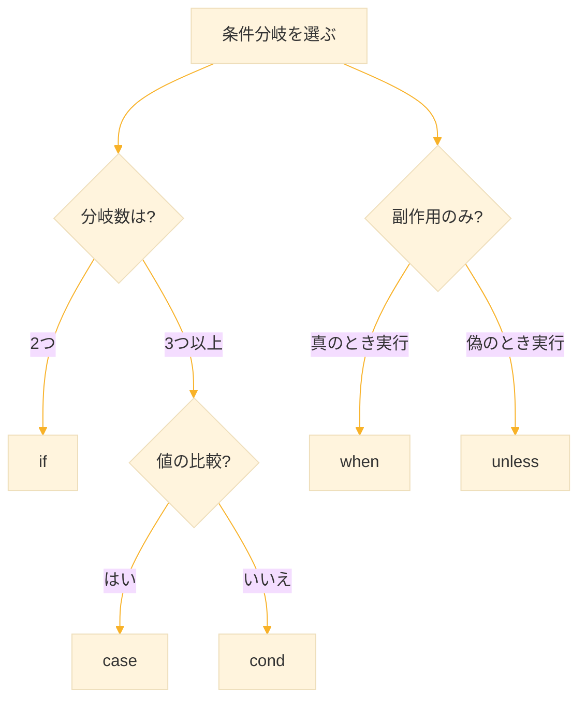

# Level 5 (条件分岐・判定によるロジック構築)

## 1. なぜ条件分岐が重要か

Lisp で関数を定義できるようになった今、次の必要が生まれる。

| 必要性 | 例 |
|--------|-----|
| 状態に応じて処理を切り替えたい | 点数 → 評価判定 |
| データに応じて手続きを変更したい | 数値/文字列/リストで処理を変える |
| 意味構造に基づいて分類したい | 文体分類・タグ付け・感情分類 |

> **条件分岐は「手続きの切替」ではなく「意味の切替」を設計する思考である**

## 2. if ― 二者択一の基本構文

### 2-1. if の構文

```lisp
(if 条件式
    真の場合の式
    偽の場合の式)
```

### 2-2. Common Lisp の真偽判定

| 値 | 判定 |
|----|------|
| `nil` または `'()` | 偽（false） |
| それ以外の全て | 真（true） |

```lisp
;; nil は偽
(if nil "真" "偽")
;; → "偽"

;; 0 も真（注意！）
(if 0 "真" "偽")
;; → "真"

;; 空文字列も真
(if "" "真" "偽")
;; → "真"
```

### 2-3. if の基本例

```lisp
(defun positive-or-negative (x)
  (if (> x 0)
      'positive
      'negative))

(positive-or-negative 4)
;; → POSITIVE

(positive-or-negative -3)
;; → NEGATIVE
```

### 2-4. else を省略

偽の場合の式は省略できる（その場合 `nil` が返る）。

```lisp
(let ((lst '(1 2 3)))
  (if lst
      (format t "リストは空ではない~%")))
;; リストは空ではない
;; → NIL
```

### 2-5. ネストした if

```lisp
(defun classify-number (x)
  (if (> x 0)
      "正の数"
      (if (< x 0)
          "負の数"
          "ゼロ")))

(classify-number 5)   ;; → "正の数"
(classify-number -3)  ;; → "負の数"
(classify-number 0)   ;; → "ゼロ"
```

### 2-6. progn で複数式を実行

`if` の then/else には1つの式しか書けない。複数の処理を行いたい場合は `progn` を使う。

```lisp
(let ((score 85))
  (if (>= score 80)
      (progn
        (format t "合格！~%")
        (format t "あなたの点数は ~A 点です~%" score))
      (format t "不合格です~%")))
;; 合格！
;; あなたの点数は 85 点です
```

**progn とは：**

`progn` は複数の式を順番に実行し、最後の式の値を返す特殊形式である。

```lisp
(progn
  (format t "処理A~%")
  (format t "処理B~%")
  100)
;; 処理A
;; 処理B
;; → 100
```

### 2-7. if の使用原則

- **真と偽の2択** に限定する
- 分岐が3つ以上の場合は `cond` へ移行

## 3. cond ― 複数条件の振り分け

### 3-1. cond の構文

```lisp
(cond
  (条件式1 結果1)
  (条件式2 結果2)
  ...
  (t       デフォルト))
```

**動作：**
- 上から順に条件を評価する
- 真になった節だけ実行
- その節の最後の値が戻り値
- どれもマッチしないと `NIL`（通常は `t` を最後に書く）

### 3-2. 基本例

```lisp
(defun sign-of (x)
  (cond
    ((> x 0)  "正の数")
    ((< x 0)  "負の数")
    (t        "ゼロ")))

(sign-of 5)   ;; → "正の数"
(sign-of -3)  ;; → "負の数"
(sign-of 0)   ;; → "ゼロ"
```

`t` は「どの条件にも当てはまらなかった場合のデフォルト」。

### 3-3. 点数判定

```lisp
(defun grade (score)
  (cond
    ((>= score 90) 'A)
    ((>= score 70) 'B)
    ((>= score 50) 'C)
    (t             'D)))

(grade 95)  ;; → A
(grade 75)  ;; → B
(grade 55)  ;; → C
(grade 30)  ;; → D
```

`cond` は「範囲判定」を自然に書ける。`if` をネストするより読みやすい。

### 3-4. 節に複数の式を書く

`cond` の各節には複数の式を書ける（`progn` 不要）。

```lisp
(defun check-list (lst)
  (cond
    ((null lst)
     (format t "リストは空です~%")
     0)
    (t
     (format t "リストの先頭は ~A~%" (car lst))
     (length lst))))

(check-list '())
;; リストは空です
;; → 0

(check-list '(a b c))
;; リストの先頭は A
;; → 3
```

### 3-5. エラー処理を含む例

```lisp
(defun safe-div (a b)
  (cond
    ((zerop b)
     (format t "Error: ゼロ除算~%")
     nil)
    (t
     (/ a b))))

(safe-div 10 2)   ;; → 5
(safe-div 10 0)
;; Error: ゼロ除算
;; → NIL
```

> **cond は「条件テーブルを上から順に評価するルール辞書」**


## 4. when / unless ― 条件が1つだけの簡潔な書き方

### 4-1. when の構文

```lisp
(when 条件
  式1
  式2
  ...)
```

- 条件が **真** の場合のみ本体を実行
- 複数の式を書ける（暗黙で `progn` が入る）
- 最後の式の値が戻り値
- 偽なら `NIL` を返す

### 4-2. when の例

```lisp
;; 正の数のときだけ処理
(let ((x 5))
  (when (> x 0)
    (format t "x は正の数です~%")))
;; x は正の数です

;; 複数の式を実行
(when (null '())
  (format t "リストは空です~%")
  (format t "初期値を設定します~%"))
;; リストは空です
;; 初期値を設定します

;; 値を返す
(let ((n 10))
  (when (evenp n)
    (* n 2)))
;; → 20
```

### 4-3. unless の構文

```lisp
(unless 条件
  式1
  式2
  ...)
```

- 条件が **偽** の場合のみ本体を実行
- `when` の逆

### 4-4. unless の例

```lisp
;; リストが空のときだけメッセージ
(defun warn-if-empty (lst)
  (unless lst
    (format t "リストは空です~%")))

(warn-if-empty '())
;; リストは空です
;; → NIL

(warn-if-empty '(1 2 3))
;; → NIL（何も表示されない）
```

```lisp
;; ゼロ除算チェック
(defun safe-div-2 (a b)
  (unless (zerop b)
    (/ a b)))

(safe-div-2 10 2)  ;; → 5
(safe-div-2 10 0)  ;; → NIL
```



### 4-5. when と unless の使い分け

| 構文 | 意味 | 用途 |
|------|------|------|
| `when` | 条件が真なら実行 | 肯定的条件 |
| `unless` | 条件が偽なら実行 | 否定的条件、ガード |

> **when/unless は副作用中心の処理に向く**


## 5. case ― 値による分類

cond は任意の条件式を列挙して評価するのに対して、case は特定の式に対して値（キー）を列挙して一致（eql 比較）を行う。

> **case は判定対象が「単純な値」のとき最適**

### 5-1. case の構文

```lisp
(case 式
  (キー1 結果1)
  (キー2 結果2)
  ...
  (t デフォルト))
```

- 式の値と各キーを `eql` で比較
- 最初に一致した節の本体を実行
- キーは複数書ける：`(a b c)`
- `t`（または `otherwise`）はデフォルト節

### 5-2. 曜日の分類

キーは、複数並べることが出来る。

```lisp
(defun day-type (day)
  (case day
    ((mon tue wed thu fri) 'weekday)
    ((sat sun)             'weekend)
    (otherwise             'unknown)))

(day-type 'mon)  ;; → WEEKDAY
(day-type 'sat)  ;; → WEEKEND
(day-type 'xyz)  ;; → UNKNOWN
```




### 5-3. メニュー選択

```lisp
(defun menu (n)
  (case n
    (1 "Start")
    (2 "Settings")
    (3 "Exit")
    (t "Invalid input")))

(menu 1)  ;; → "Start"
(menu 2)  ;; → "Settings"
(menu 5)  ;; → "Invalid input"
```

### 5-4. 複数キー、複数式

```lisp
(defun color-type (color)
  (case color
    ((red orange yellow)
     (format t "暖色です~%")
     'warm)
    ((blue green purple)
     (format t "寒色です~%")
     'cool)
    (t
     'unknown)))

(color-type 'red)
;; 暖色です
;; → WARM

(color-type 'blue)
;; 寒色です
;; → COOL
```


## 6. 条件式で使う述語（predicate）

条件式の可読性は **述語選択** に依存する。

### 6-1. よく使う述語一覧

| 判定 | 使用関数 | 例 |
|------|----------|-----|
| 数値比較 | `= < > <= >=` | `(> x 10)` |
| ゼロ判定 | `zerop` | `(zerop x)` |
| 偶数/奇数 | `evenp oddp` | `(evenp x)` |
| 正/負 | `plusp minusp` | `(plusp x)` |
| 型判定 | `numberp symbolp stringp listp` | `(stringp x)` |
| 空リスト | `null` | `(null lst)` |
| 文字列比較 | `string= string-equal` | `(string= a b)` |
| 等値判定 | `eq eql equal equalp` | `(equal a b)` |

Common Lisp の慣例で、真偽値（T または NIL）を返す関数には末尾に p がついている。

### 6-2. 述語の例

```lisp
;; 数値判定
(numberp 42)       ;; → T
(numberp "hello")  ;; → NIL

;; リスト判定
(listp '(1 2 3))   ;; → T
(null '())         ;; → T
(null '(1 2))      ;; → NIL

;; 文字列比較
(string= "hello" "hello")  ;; → T
(string= "hello" "HELLO")  ;; → NIL
(string-equal "hello" "HELLO")  ;; → T（大文字小文字無視）
```

### 6-3. 等値判定の使い分け

| 関数 | 比較方法 | 用途 |
|------|----------|------|
| `eq` | ポインタ比較 | シンボル |
| `eql` | 型と値 | 数値、文字、シンボル |
| `equal` | 構造的比較 | リスト、文字列 |
| `equalp` | より緩い比較 | 大文字小文字無視など |

```lisp
(eq 'a 'a)           ;; → T
(eql 1 1)            ;; → T
(equal '(1 2) '(1 2)) ;; → T
(equalp "ABC" "abc") ;; → T
```

> **条件式は「何を判定しているか」が読んで明確であること**

## 7. 条件分岐を使いすぎないための設計視点

### 7-1. 問題：ロジックの迷路化

初心者は条件式を乱立させがちになる。

```lisp
;; 悪い例
(when ...)
(when ...)
(if ...)
(when ...)
(cond ...)
```

これは **ロジックの迷路化** を引き起こす。

### 7-2. 原則1：判定を関数に分離する

```lisp
;; 悪い例
(if (and (>= score 80) (< score 90)) 'B ...)

;; 良い例
(defun b-grade-p (s)
  (and (>= s 80) (< s 90)))

(if (b-grade-p score) 'B ...)
```

**名前をつけた瞬間、条件式は「意味」になる。**

### 7-3. 原則2：データ駆動に寄せる

条件分岐ではなく、データ（テーブル）で振る舞いを定義する。

```lisp
;; 条件分岐で書く（あまり良くない）
(defun animal-sound (animal)
  (cond
    ((eq animal 'dog) "ワン")
    ((eq animal 'cat) "ニャー")
    ((eq animal 'cow) "モー")
    (t "???")))

;; データ駆動で書く（良い）
(defparameter *animal-sounds*
  '((dog . "ワン")
    (cat . "ニャー")
    (cow . "モー")))

(defun animal-sound (animal)
  (or (cdr (assoc animal *animal-sounds*))
      "???"))
```


## 8. 応用：条件分岐を高階関数で置き換える

Level 4 で学んだ高階関数を使うと、条件判定はより宣言的に書ける。

### 8-1. remove-if と remove-if-not

```lisp
;; 偶数を除く
(remove-if #'evenp '(1 2 3 4 5))
;; → (1 3 5)

;; 偶数だけ残す
(remove-if-not #'evenp '(1 2 3 4 5))
;; → (2 4 6)
```

| 関数 | 意味 |
|------|------|
| `remove-if` | 条件に一致する要素を除く |
| `remove-if-not` | 条件に一致する要素を残す |

### 8-2. 条件分岐を使わない例

「奇数だけを2倍して出力」を書いてみる。

```lisp
;; if を使う方法
(defun print-double-odd-v1 (lst)
  (dolist (x lst)
    (when (oddp x)
      (format t "~a~%" (* 2 x)))))

;; 高階関数を使う方法（条件式を外部化）
(defun print-double-odd-v2 (lst)
  (dolist (x (remove-if-not #'oddp lst))
    (format t "~a~%" (* 2 x))))

;; テスト
(print-double-odd-v2 '(1 2 3 4 5))
;; 2
;; 6
;; 10
```

> **条件式を述語関数として外部化すると、コードの中に if を置かなくて済む**


## 9. 条件分岐のまとめ

| 構文 | 用途 | 特徴 |
|------|------|------|
| `if` | 2択 | 真/偽の分岐 |
| `cond` | 複数条件 | 上から順に評価、範囲判定に強い |
| `when` | 真のときだけ | 副作用向け、暗黙の progn |
| `unless` | 偽のときだけ | ガード処理向け |
| `case` | 値による分類 | eql 比較、列挙値向け |




## 10. 練習課題

### 課題1：正負ゼロの分類

引数 `x` が 0 のとき `'zero`、正なら `'positive`、負なら `'negative` を返す関数を作れ。

**解答：**

```lisp
;; cond を使う
(defun classify-sign (x)
  (cond
    ((zerop x) 'zero)
    ((plusp x) 'positive)
    (t         'negative)))

;; テスト
(classify-sign 5)   ;; → POSITIVE
(classify-sign -3)  ;; → NEGATIVE
(classify-sign 0)   ;; → ZERO
```

### 課題2：空文字列の判定

文字列が空なら `"empty"`、そうでなければ `"ok"` を返す関数を作れ。

**解答：**

```lisp
(defun check-string (s)
  (if (string= s "")
      "empty"
      "ok"))

;; テスト
(check-string "")      ;; → "empty"
(check-string "hello") ;; → "ok"
```

または `zerop` と `length` を使う：

```lisp
(defun check-string (s)
  (if (zerop (length s))
      "empty"
      "ok"))
```

### 課題3：case で動物分類

`case` を使い、猫・犬・鳥を `'animal` に分類し、それ以外は `'unknown` と返せ。

**解答：**

```lisp
(defun classify-animal (x)
  (case x
    ((cat dog bird) 'animal)
    (otherwise      'unknown)))

;; テスト
(classify-animal 'cat)   ;; → ANIMAL
(classify-animal 'dog)   ;; → ANIMAL
(classify-animal 'bird)  ;; → ANIMAL
(classify-animal 'fish)  ;; → UNKNOWN
```


### 課題4：成績評価関数

点数を受け取り、以下の基準で評価を返す関数 `evaluate` を作れ。

- 90以上：`"優"`
- 70以上：`"良"`
- 50以上：`"可"`
- 50未満：`"不可"`

**解答：**

```lisp
(defun evaluate (score)
  (cond
    ((>= score 90) "優")
    ((>= score 70) "良")
    ((>= score 50) "可")
    (t             "不可")))

;; テスト
(evaluate 95)  ;; → "優"
(evaluate 75)  ;; → "良"
(evaluate 55)  ;; → "可"
(evaluate 30)  ;; → "不可"
```


### 課題5：when を使ったデバッグ出力

変数 `*debug*` が真のときだけメッセージを表示する `debug-print` 関数を作れ。

**解答**

```lisp
(defparameter *debug* t)

(defun debug-print (msg)
  (when *debug*
    (format t "[DEBUG] ~a~%" msg)))

;; テスト
(debug-print "処理を開始します")
;; [DEBUG] 処理を開始します

(setf *debug* nil)
(debug-print "これは表示されない")
;; → NIL（何も表示されない）
```


### 課題6：FizzBuzz

1から n までの数に対して、以下のルールで出力する関数 `fizzbuzz` を作れ。

- 3で割り切れる → "Fizz"
- 5で割り切れる → "Buzz"
- 両方で割り切れる → "FizzBuzz"
- それ以外 → 数値そのまま

**解答：**

```lisp
(defun fizzbuzz (n)
  (dotimes (i n)
    (let ((num (1+ i)))
      (format t "~a~%"
              (cond
                ((zerop (mod num 15)) "FizzBuzz")
                ((zerop (mod num 3))  "Fizz")
                ((zerop (mod num 5))  "Buzz")
                (t                    num))))))

;; テスト
(fizzbuzz 15)
;; 1
;; 2
;; Fizz
;; 4
;; Buzz
;; Fizz
;; 7
;; 8
;; Fizz
;; Buzz
;; 11
;; Fizz
;; 13
;; 14
;; FizzBuzz
```

## 11. まとめ

1. **条件分岐は「意味を選ぶ」こと**
   - 動作を変えるのではなく、意味を切り替える

2. **構文の使い分け**
   - `if` は2択限定
   - 増えるなら `cond`
   - 値の比較なら `case`

3. **when / unless は副作用中心**
   - 暗黙の `progn` で複数式が書ける

4. **条件式は述語関数で意味化する**
   - 名前をつけると可読性が上がる

5. **データ駆動・高階関数と組み合わせる**
   - 条件分岐を減らして抽象度を上げる

