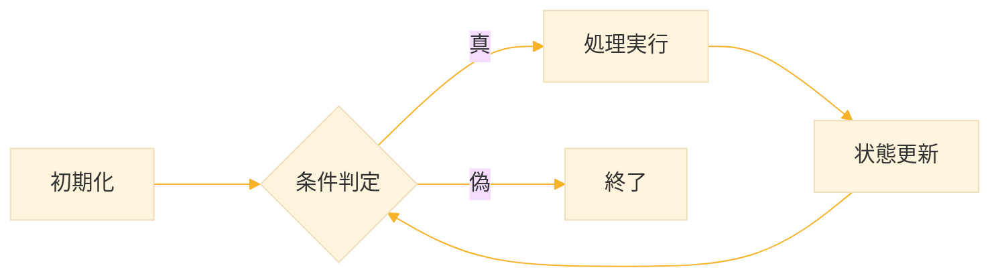
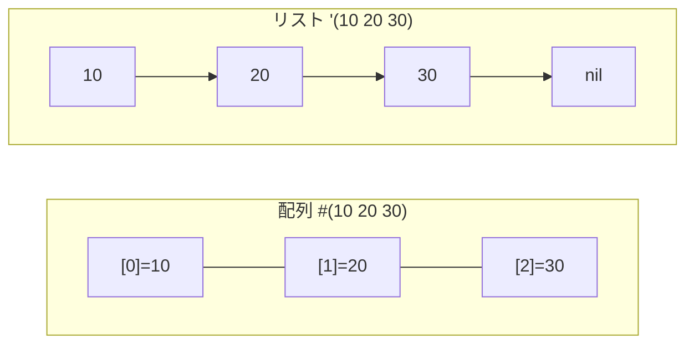
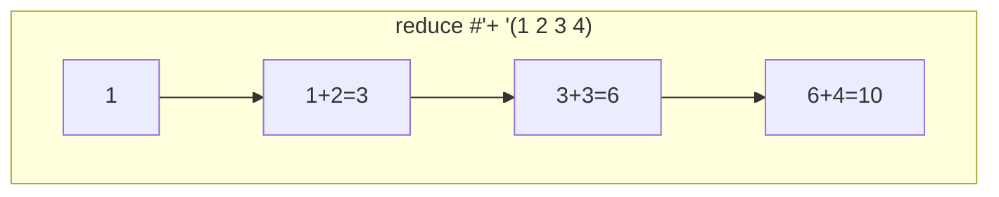
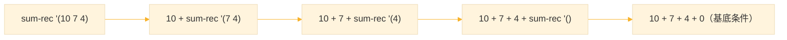
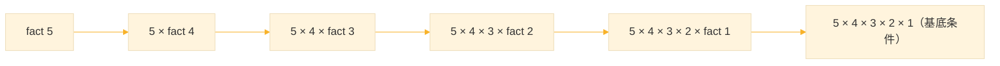
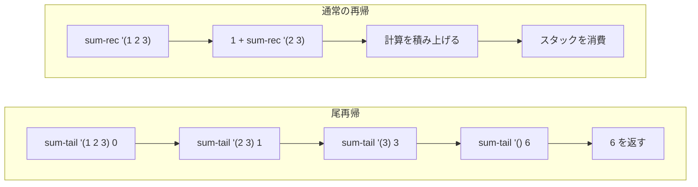
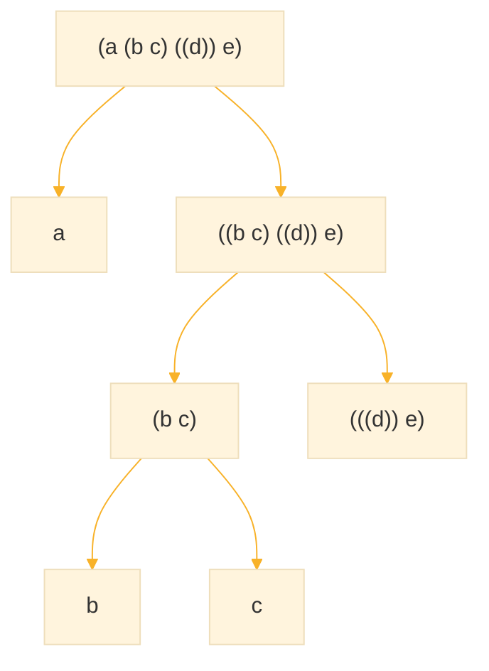
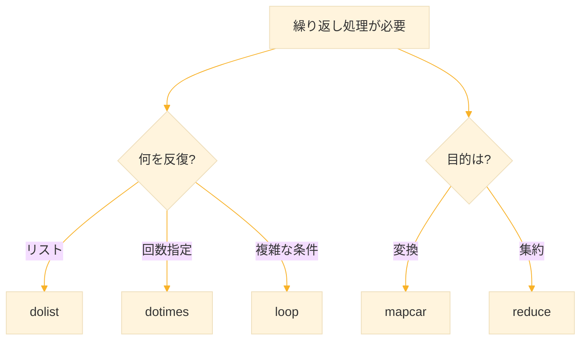

# Level 6  (再帰と反復)

## 1. 反復とは何か

**反復（iteration）** は、計算を以下の形式で行う：

1. 初期状態の設定
2. 条件評価
3. 状態の更新
4. 条件が満たされるまで継続

このプロセスは一般に、「時系列で変化し続ける状態（state）」に依存する。



### 1-1. Lisp における反復構文の種類

| 構文 | 特徴 | 想定する思考モデル | 使用推奨場面 |
|------|------|-------------------|--------------|
| `loop` | 汎用制御構文 | C言語に近い命令的思考 | 状態を細かく制御する処理 |
| `dotimes` | 回数反復 | カウンタベース | 指定回数の繰り返し |
| `dolist` | リスト走査 | データ列反復 | データ解析・集計 |
| `mapcar` | 関数適用 | 変換適用の宣言的思考 | 関数型データ処理 |
| `reduce` | 集約操作 | 演算子による統合 | 総計・評価器作成 |

## 2. loop ― 汎用で柔軟な反復

`loop` は最も自由度が高い反復構文である。変数更新・条件付き break などが書きやすく、C言語の `for` に近い。

### 2-1. 基本的な loop

```lisp
;; 1〜5 を表示
(loop for i from 1 to 5
      do (format t "~A " i))
;; 1 2 3 4 5
;; → NIL
```

```lisp
;; リスト要素を順番に表示
(loop for x in '(apple banana cherry)
      do (format t "~A~%" x))
;; apple
;; banana
;; cherry
```

### 2-2. 条件付き処理

```lisp
;; 偶数だけを表示
(loop for n from 1 to 10
      when (evenp n)
      do (format t "~A " n))
;; 2 4 6 8 10
```

### 2-3. 集約句（collect, sum など）

`loop` には値を集める便利な句がある。

```lisp
;; リストの合計を求める
(loop for n in '(3 8 2 7 5)
      sum n)
;; → 25

;; 2倍した値を収集
(loop for n in '(1 2 3 4 5)
      collect (* n 2))
;; → (2 4 6 8 10)
```

**主な集約句：**

| 句 | 意味 | 初期値 | 例 |
|----|------|--------|-----|
| `collect` | 値をリストに集める | `()` | `(collect x)` |
| `sum` | 合計値を計算 | `0` | `(sum x)` |
| `count` | 条件成立回数を数える | `0` | `(count (evenp x))` |
| `maximize` | 最大値を求める | -∞ | `(maximize x)` |
| `minimize` | 最小値を求める | +∞ | `(minimize x)` |

:::note warn
集約句（accumulation clause）は、Common Lisp の仕様上 loop マクロ専用 です。他の構文では使用できません。ただし、同様の 集約機能 を持つ関数は存在します。
:::

### 2-4. let と incf

`loop` の中でよく使う構文を確認する。

**let：ローカル変数の宣言**

```lisp
(let ((変数 初期値)
      (変数2 初期値2))
  本体の式...)
```

```lisp
(let ((x 10)
      (y 20))
  (+ x y))
;; → 30
```

**incf：変数を増加させる**

```lisp
(let ((x 5))
  (incf x 3)  ; x = x + 3
  x)
;; → 8

(let ((x 5))
  (incf x)    ; 省略すると 1 増加
  x)
;; → 6
```

### 2-5. loop で合計を求める（手動版）

```lisp
(defun sum-with-loop (lst)
  (let ((result 0))
    (loop for n in lst
          do (incf result n))
    result))

(sum-with-loop '(3 8 2 7 5))
;; → 25
```


## 3. dotimes ― 回数指定の反復

### 3-1. dotimes の構文

```lisp
(dotimes (変数 回数 [結果])
  本体...)
```

- 変数は 0 から `回数-1` まで変化
- 結果を省略すると `NIL` を返す

### 3-2. 基本例

```lisp
;; 0〜4 を表示
(dotimes (i 5)
  (format t "~A " i))
;; 0 1 2 3 4
;; → NIL

;; 合計値を求める（結果を指定）
(let ((sum 0))
  (dotimes (i 5 sum)
    (incf sum i)))
;; → 10（0+1+2+3+4）
```

### 3-3. 配列のアクセス

```lisp
;; 配列の要素を表示
(let ((arr #(10 20 30 40)))
  (dotimes (i (length arr))
    (format t "~A " (aref arr i))))
;; 10 20 30 40
```

**aref：配列の要素を取得**

```lisp
(aref #(10 20 30) 1)
;; → 20（インデックス1の要素）
```

### 3-4. 配列とリストの違い

| 項目 | 配列（vector） | リスト（list） |
|------|---------------|---------------|
| 内部構造 | 連続したメモリ領域 | 連結リスト（consセルの鎖） |
| アクセス速度 | ランダムアクセスが速い | 先頭から順次たどる |
| 要素数 | 固定長が基本 | 可変（追加・削除が容易） |
| 書き方 | `#(1 2 3)` | `'(1 2 3)` |
| 適する用途 | 数値処理・高速アクセス | データ構造・再帰処理 |




### 3-5. dotimes でリストを作る

```lisp
(let ((result '()))
  (dotimes (i 5 (nreverse result))
    (push (* i i) result)))
;; → (0 1 4 9 16)
```

**push と nreverse：**

`push` は 先頭に追加するため、処理途中の`result` は `(16 9 4 1 0)` の様に逆順になっている。そのため、最後に `nreverse` で 正しい順序に並び替えて返している。
nreverse は リストを破壊的に逆順にする関数 。元のリスト構造を変更して要素の順番を反転し、新しい先頭リストを返す。`nreverse` は 高速・省メモリ。元のリストを保持したい場合は `reverse` を使用する。

## 4. dolist ― リスト走査の基本

### 4-1. dolist の構文

```lisp
(dolist (変数 リスト [結果])
  本体...)
```

「順に取り出して処理する」という思考をそのまま書ける、最も自然なリスト反復方法。

### 4-2. 基本例

```lisp
;; リストの要素を順に表示
(dolist (x '(apple banana cherry))
  (format t "~A~%" x))
;; apple
;; banana
;; cherry

;; 合計値を求める
(let ((sum 0))
  (dolist (n '(3 8 2 7 5) sum)
    (incf sum n)))
;; → 25
```

### 4-3. 条件付き処理

```lisp
;; 偶数だけ表示
(dolist (n '(1 2 3 4 5))
  (when (evenp n)
    (format t "~A " n)))
;; 2 4
```

### 4-4. 新しいリストを作る

```lisp
(let ((result '()))
  (dolist (x '(1 2 3 4 5) (nreverse result))
    (push (* x x) result)))
;; → (1 4 9 16 25)
```

### 4-5. return で途中終了

`return` は 現在実行中のループやフォームを即座に終了し、指定した値を返す。主に **`do` 系ループ、`dolist`、`dotimes`、`loop` の中で使用**される。

```lisp
;; 最初の奇数を見つけたら終了
(dolist (x '(2 4 6 7 8))
  (when (oddp x)
    (return x)))
;; → 7
```

### 4-6. 最大値を求める

```lisp
(defun max-with-dolist (lst)
  (let ((max (car lst)))
    (dolist (x lst max)
      (when (> x max)
        (setf max x)))))

(max-with-dolist '(3 8 2 7 5))
;; → 8
```

## 5. mapcar と reduce ― 関数型アプローチ

### 5-1. mapcar：変換専用

「新しいリストを作る」場合に最適。副作用なしで変換処理に徹する。

```lisp
;; 各数値を2倍
(mapcar (lambda (x) (* x 2)) '(1 2 3 4 5))
;; → (2 4 6 8 10)

;; 文字列を大文字に
(mapcar #'string-upcase '("apple" "banana" "cherry"))
;; → ("APPLE" "BANANA" "CHERRY")

;; 2つのリストの要素を加算
(mapcar #'+ '(1 2 3) '(10 20 30))
;; → (11 22 33)
```

### 5-2. reduce：集約専用

```lisp:構文
(reduce function sequence
        :initial-value init
        :from-end t)
```

- `:initial-value` : 最初の累積値を指定（省略時は最初の要素が使われる）
- `:from-end t` : 末尾から畳み込みを行う（右折りたたみになる）

`reduce` は、シーケンス（リスト・ベクターなど）の全要素を、指定した関数で “1つの値” に畳み込む（まとめる）関数である。

```lisp
;; リストの合計
(reduce #'+ '(1 2 3 4))
;; → 10

;; 最大値
(reduce #'max '(3 9 2 7 5))
;; → 9

;; 初期値を指定
(reduce #'+ '(1 2 3) :initial-value 100)
;; → 106
```



### 5-3. 反復構文の比較

| 処理手法 | 記述量 | 分かりやすさ | 関数型度 | 適した処理 |
|----------|--------|-------------|---------|-----------|
| loop | 多い | 中 | 低 | 複雑な条件付き処理 |
| dotimes | 少ない | 高 | 低 | 回数指定の繰り返し |
| dolist | 少ない | 最高 | 中 | 教育用途・汎用 |
| mapcar | 少ない | 高 | 高 | 単純変換処理 |
| reduce | 少ない | 中 | 最高 | 集約・統計 |


## 6. 再帰とは何か

**再帰（recursion）** とは、自分自身を用いて自分を定義する手法である。

### 6-1. 再帰定義の3原則

| 原則 | 内容 | 欠けた場合の失敗 |
|------|------|-----------------|
| 基底条件（停止条件） | 最終的に終了する条件 | 無限再帰 |
| 問題の縮小 | データを小さくする | 状態が変化せず進まない |
| 自己適用 | 同じ規則を再利用 | 別処理に変化してしまう |

### 6-2. 反復と再帰のイメージ

リスト `(10 7 4)` の合計を考える。

**反復のイメージ（横方向）：**

```
start -> [10] -> [7] -> [4] -> end
         sum=10  sum=17 sum=21
```

**再帰のイメージ**




### 6-3. 実装比較 ― 3つのアプローチ

**手続き型（dolist）：**

```lisp
(defun sum-loop (lst)
  (let ((result 0))
    (dolist (x lst result)
      (incf result x))))

(sum-loop '(1 2 3 4 5))
;; → 15
```

**再帰型：**

```lisp
(defun sum-rec (lst)
  (if (null lst)
      0
      (+ (car lst)
         (sum-rec (cdr lst)))))

(sum-rec '(1 2 3 4 5))
;; → 15
```

**関数型（reduce）：**

```lisp
(defun sum-reduce (lst)
  (reduce #'+ lst :initial-value 0))

(sum-reduce '(1 2 3 4 5))
;; → 15
```

> 目的は同じでも **表現の思想が異なる**

## 7. 再帰の基本パターン

### 7-1. 階乗

```lisp
(defun fact (n)
  (if (<= n 1)
      1
      (* n (fact (1- n)))))

(fact 5)
;; → 120（5×4×3×2×1）
```



### 7-2. フィボナッチ数

```lisp
(defun fib (n)
  (if (< n 2)
      n
      (+ (fib (- n 1))
         (fib (- n 2)))))

(fib 10)
;; → 55
```

### 7-3. リストの長さ

```lisp
(defun length-rec (lst)
  (if (null lst)
      0
      (1+ (length-rec (cdr lst)))))

(length-rec '(a b c d e))
;; → 5
```

### 7-4. リストの反転

```lisp
(defun reverse-rec (lst)
  (if (null lst)
      nil
      (append (reverse-rec (cdr lst))
              (list (car lst)))))

(reverse-rec '(1 2 3 4 5))
;; → (5 4 3 2 1)
```

### 7-5. 再帰を書くときの注意点

#### チェックリスト

| チェック項目 | 確認内容 |
|-------------|---------|
| 基底条件があるか | `(null lst)` や `(<= n 1)` など終了条件 |
| 基底条件を先に書いているか | `if` の then 部分に終了処理 |
| データが縮小しているか | `(cdr lst)` や `(1- n)` を渡しているか |
| 空リスト/ゼロで動くか | `(func '())` や `(func 0)` でテスト |

#### よくある間違い

```lisp
;; NG：データが縮小していない
(defun wrong (lst)
  (if (null lst) 0
      (+ (car lst) (wrong lst))))   ; lst のまま渡している

;; OK：cdr で縮小
(defun correct (lst)
  (if (null lst) 0
      (+ (car lst) (correct (cdr lst)))))
```

#### 再帰のテンプレート

```lisp
;; リスト再帰
(defun リスト処理 (lst)
  (if (null lst)
      基底値
      (結合 (car lst) (リスト処理 (cdr lst)))))

;; 数値再帰
(defun 数値処理 (n)
  (if (<= n 1)
      基底値
      (結合 n (数値処理 (1- n)))))
```

#### trace でデバッグ

```lisp
(trace sum-rec)       ; トレース開始
(sum-rec '(1 2 3))    ; 呼び出しの様子が表示される
(untrace sum-rec)     ; トレース解除
```


## 8. 尾再帰最適化

### 8-1. 尾再帰とは

**尾再帰（tail recursion）** は、関数の最後で再帰呼び出しを行う形式。処理系によってはループに変換され、スタックを消費しない。

**尾再帰ではない：**

```lisp
(defun sum-rec (lst)
  (if (null lst)
      0
      (+ (car lst) (sum-rec (cdr lst)))))
;; ↑ + の計算が残っている → 尾再帰ではない
```

**尾再帰：**

```lisp
(defun sum-tail (lst acc)
  (if (null lst)
      acc
      (sum-tail (cdr lst) (+ acc (car lst)))))
;; ↑ 再帰呼び出しが最後 → 尾再帰
```

```lisp
;; 使い方
(sum-tail '(1 2 3 4 5) 0)
;; → 15
```



### 8-2. 尾再帰の例

**階乗（尾再帰版）：**

```lisp
(defun fact-tail (n acc)
  (if (<= n 1)
      acc
      (fact-tail (1- n) (* acc n))))

(fact-tail 5 1)
;; → 120
```

**フィボナッチ（尾再帰版）：**

```lisp
(defun fib-tail (n a b)
  (if (= n 0)
      a
      (fib-tail (1- n) b (+ a b))))

(fib-tail 10 0 1)
;; → 55
```

**リストの長さ（尾再帰版）：**

```lisp
(defun length-tail (lst acc)
  (if (null lst)
      acc
      (length-tail (cdr lst) (1+ acc))))

(length-tail '(a b c d e) 0)
;; → 5
```

### 8-3. 尾再帰の注意点

- Common Lisp の標準では尾再帰最適化は **保証されていない**
- ただし多くの処理系（SBCL など）は最適化を行う
- 実用上はループ（`loop`, `dolist`）がよく使われる
- 尾再帰は「理論価値」＋「関数型思考訓練」として習得する

## 9. 再帰が有効な場面

### 9-1. 木構造の処理

入れ子のリスト（木構造）は再帰で自然に処理できる。

```lisp
;; 入れ子リストの要素数を数える
(defun deep-count (tree)
  (cond
    ((null tree) 0)
    ((atom tree) 1)
    (t (+ (deep-count (car tree))
          (deep-count (cdr tree))))))

(deep-count '(a (b c) ((d)) e))
;; → 5
```



### 9-2. 再帰が自然な領域

| 分野 | 用例 | 再帰が自然な理由 |
|------|------|-----------------|
| 木構造解析 | XML, JSON, AST | 分割統治型 |
| 言語処理 | 文解析、依存構造 | 階層表現 |
| 画像処理 | フラクタル生成 | 自己相似性 |
| AI探索 | 深さ優先探索、minimax | 状態展開 |
| DSL | 構文規則展開 | 関数による記述 |


## 10. 練習課題

### 課題1：dolist で最大値

以下のリストの最大値を `dolist` で求めよ。

```lisp
'(8 4 19 7 3 11)
```

**解答**

```lisp
(defun max-dolist (lst)
  (let ((max (car lst)))
    (dolist (x (cdr lst) max)
      (when (> x max)
        (setf max x)))))

(max-dolist '(8 4 19 7 3 11))
;; → 19
```


### 課題2：再帰で最大値

同じリストの最大値を再帰で求めよ。

**解答**

```lisp
(defun max-rec (lst)
  (if (null (cdr lst))
      (car lst)
      (let ((rest-max (max-rec (cdr lst))))
        (if (> (car lst) rest-max)
            (car lst)
            rest-max))))

(max-rec '(8 4 19 7 3 11))
;; → 19
```

### 課題3：リストの反転（再帰）

再帰を使ってリストを反転する `my-reverse` を作れ。

**解答**

```lisp
(defun my-reverse (lst)
  (if (null lst)
      nil
      (append (my-reverse (cdr lst))
              (list (car lst)))))

(my-reverse '(1 2 3 4 5))
;; → (5 4 3 2 1)
```

### 課題4：尾再帰でリスト反転

尾再帰を使ってリストを反転する `my-reverse-tail` を作れ。

**解答**

```lisp
(defun my-reverse-tail (lst acc)
  (if (null lst)
      acc
      (my-reverse-tail (cdr lst) (cons (car lst) acc))))

(my-reverse-tail '(1 2 3 4 5) nil)
;; → (5 4 3 2 1)
```

### 課題5：deep-count

入れ子リストの要素数を数える `deep-count` を作れ。

```lisp
(deep-count '(a (b c) ((d)) e))
;; → 5
```

**解答**

```lisp
(defun deep-count (tree)
  (cond
    ((null tree) 0)
    ((atom tree) 1)
    (t (+ (deep-count (car tree))
          (deep-count (cdr tree))))))

(deep-count '(a (b c) ((d)) e))
;; → 5
```


### 課題6：木構造の最大深度

任意のネストリストの最大深度を求める `max-depth` を作れ。

```lisp
(max-depth '(a (b (c (d)))))
;; → 4
```

**解答**

```lisp
(defun max-depth (tree)
  (if (atom tree)
      0
      (1+ (reduce #'max
                  (mapcar #'max-depth tree)
                  :initial-value 0))))

(max-depth '(a (b (c (d)))))
;; → 4

(max-depth '((a b) (c (d e (f)))))
;; → 4
```

## 11. まとめ

#### 反復構文の選び方



#### 再帰の3原則

1. **基底条件** - 停止する条件を必ず書く
2. **問題の縮小** - データを小さくして渡す
3. **自己適用** - 同じ関数を呼び出す

#### 尾再帰のパターン

```lisp
(defun 関数名 (データ 累積値)
  (if (終了条件)
      累積値
      (関数名 (縮小したデータ) (更新した累積値))))
```

#### いつ何を使うか

| 状況 | 推奨 |
|------|------|
| 単純なリスト走査 | `dolist` |
| 回数指定の繰り返し | `dotimes` |
| リストの変換 | `mapcar` |
| 値の集約 | `reduce` |
| 複雑な制御 | `loop` |
| 木構造・再帰的データ | 再帰 |

