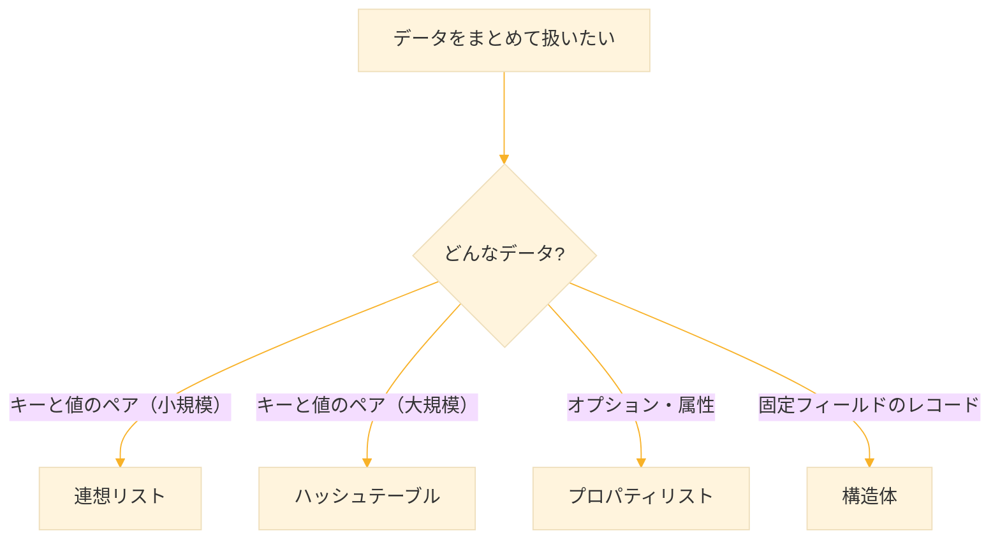
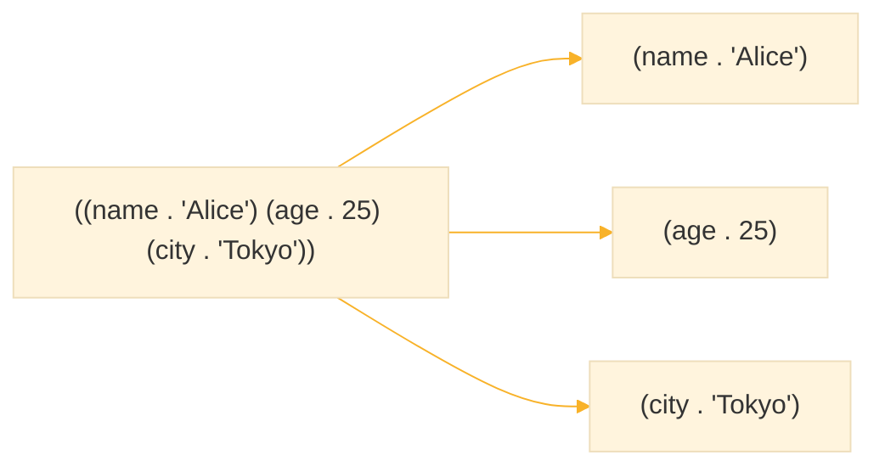
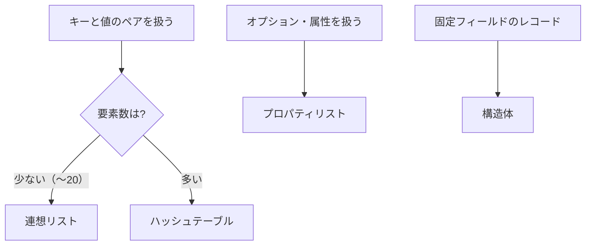

# Level 7 (データ構造)
## 1. データ構造とは

プログラムでは、複数のデータをまとめて扱う必要がある。Common Lisp には、目的に応じた様々なデータ構造が用意されている。

| データ構造 | 特徴 | 用途 |
|-----------|------|------|
| 連想リスト（alist） | キーと値のペアのリスト | 小規模な辞書、設定 |
| プロパティリスト（plist） | キーと値が交互に並ぶ | シンボルの属性、オプション |
| ハッシュテーブル | 高速な検索 | 大規模な辞書、キャッシュ |
| 構造体（defstruct） | 名前付きフィールド | レコード、オブジェクト |



## 2. 連想リスト（alist）

### 2-1. 連想リストとは

**連想リスト（association list, alist）** は、キーと値のペア（cons セル）を要素とするリストである。

常のリストは位置（インデックス）でアクセスするが、連想リストはキーでアクセスする。設定ファイル、オプション引数、小規模な辞書など、キーと値のペアを扱う場面で使われる。連想リストは「リストだけ」で作ることができ、特別な関数や構造を必要としない。

```lisp
;; 連想リストの例
'((name . "Alice")
  (age . 25)
  (city . "Tokyo"))
```



### 2-2. 連想リストの作成

```lisp
;; cons でペアを作り、list でまとめる
(list (cons 'name "Alice")
      (cons 'age 25)
      (cons 'city "Tokyo"))
;; → ((NAME . "Alice") (AGE . 25) (CITY . "Tokyo"))

;; ドット記法で直接書く
'((name . "Alice")
  (age . 25)
  (city . "Tokyo"))
```

### 2-3. assoc：キーで検索

`assoc` はキーに対応するペアを返す。

```lisp
(defparameter *person*
  '((name . "Alice")
    (age . 25)
    (city . "Tokyo")))

;; キーで検索
(assoc 'name *person*)
;; → (NAME . "Alice")

(assoc 'age *person*)
;; → (AGE . 25)

;; 値だけ取り出す
(cdr (assoc 'name *person*))
;; → "Alice"

;; 存在しないキー
(assoc 'country *person*)
;; → NIL
```

### 2-4. acons と pairlis：要素の追加

```lisp
;; acons：先頭に追加（元のリストは変更しない）
(acons 'email "alice@example.com" *person*)
;; → ((EMAIL . "alice@example.com") (NAME . "Alice") (AGE . 25) (CITY . "Tokyo"))

;; pairlis：複数のペアを一度に作成
(pairlis '(a b c) '(1 2 3))
;; → ((A . 1) (B . 2) (C . 3))
```

### 2-5. 連想リストの更新

連想リストは先頭から検索されるため、新しい値を先頭に追加すれば「更新」になる。

```lisp
;; 年齢を更新（実際は先頭に新しいペアを追加）
(defparameter *person*
  (acons 'age 26 *person*))

(assoc 'age *person*)
;; → (AGE . 26)  ; 先頭の新しい値が見つかる
```

### 2-6. 文字列キーの検索

`assoc` はデフォルトで `eql` で比較する。文字列をキーにする場合は `:test` を指定する。

```lisp
(defparameter *dict*
  '(("apple" . "りんご")
    ("banana" . "バナナ")
    ("orange" . "オレンジ")))

;; :test を指定しないと見つからない
(assoc "apple" *dict*)
;; → NIL

;; :test #'equal で文字列比較
(assoc "apple" *dict* :test #'equal)
;; → ("apple" . "りんご")
```

### 2-7. 連想リストの用途

- 設定ファイルの読み込み
- 小規模な辞書
- 関数のオプション引数
- 一時的なデータの関連付け

## 3. プロパティリスト（plist）

### 3-1. プロパティリストとは

**プロパティリスト（property list, plist）** は、キーと値が交互に並ぶフラットなリストである。

```lisp
;; プロパティリストの例
'(:name "Alice" :age 25 :city "Tokyo")
```

連想リストとの違い：

| 項目 | 連想リスト | プロパティリスト |
|------|-----------|-----------------|
| 構造 | `((k1 . v1) (k2 . v2))` | `(k1 v1 k2 v2)` |
| キー | 任意 | 通常キーワード |
| 用途 | 汎用辞書 | オプション、属性 |

### 3-2. getf：値の取得

```lisp
(defparameter *person*
  '(:name "Alice" :age 25 :city "Tokyo"))

;; 値を取得
(getf *person* :name)
;; → "Alice"

(getf *person* :age)
;; → 25

;; 存在しないキー（デフォルト値を指定可能）
(getf *person* :country)
;; → NIL

(getf *person* :country "Unknown")
;; → "Unknown"
```

### 3-3. setf と getf：値の更新

```lisp
(defparameter *person*
  (list :name "Alice" :age 25))

;; 値を更新
(setf (getf *person* :age) 26)

*person*
;; → (:NAME "Alice" :AGE 26)

;; 新しいキーを追加
(setf (getf *person* :city) "Tokyo")

*person*
;; → (:CITY "Tokyo" :NAME "Alice" :AGE 26)
```

### 3-4. remf：キーの削除

```lisp
(defparameter *person*
  (list :name "Alice" :age 25 :city "Tokyo"))

;; キーを削除
(remf *person* :city)

*person*
;; → (:NAME "Alice" :AGE 25)
```

### 3-5. シンボルのプロパティリスト

各シンボルには固有のプロパティリストがある。`get` と `setf` でアクセスする。

```lisp
;; シンボル 'apple にプロパティを設定
(setf (get 'apple 'color) 'red)
(setf (get 'apple 'taste) 'sweet)

;; プロパティを取得
(get 'apple 'color)
;; → RED

(get 'apple 'taste)
;; → SWEET

;; シンボルの全プロパティを取得
(symbol-plist 'apple)
;; → (TASTE SWEET COLOR RED)
```

### 3-6. キーワード引数との関係

関数のキーワード引数は、内部的にプロパティリストとして扱われる。

```lisp
(defun greet (&key name age)
  (format t "Hello, ~a! You are ~a years old.~%" name age))

;; キーワード引数で呼び出し
(greet :name "Alice" :age 25)
;; Hello, Alice! You are 25 years old.

;; 順序は自由
(greet :age 30 :name "Bob")
;; Hello, Bob! You are 30 years old.
```


## 4. ハッシュテーブル

### 4-1. ハッシュテーブルとは

**ハッシュテーブル** は、キーと値のペアを高速に検索できるデータ構造である。連想リストが端から順番に探すのに対し、ハッシュテーブルは一発で見つけることができる。

### 4-2. make-hash-table：作成

```lisp
;; 空のハッシュテーブルを作成
(defparameter *ht* (make-hash-table))

;; 文字列をキーにする場合は :test を指定
(defparameter *dict* (make-hash-table :test #'equal))
```

### 4-3. gethash：値の取得と設定

```lisp
(defparameter *ages* (make-hash-table))

;; 値を設定
(setf (gethash 'alice *ages*) 25)
(setf (gethash 'bob *ages*) 30)
(setf (gethash 'carol *ages*) 28)

;; 値を取得
(gethash 'alice *ages*)
;; → 25
;; → T（2番目の戻り値：キーが存在したか）

;; 存在しないキー
(gethash 'dave *ages*)
;; → NIL
;; → NIL（キーが存在しない）
```

### 4-4. 複数の戻り値の活用

`gethash` は2つの値を返す。2番目の値でキーの存在を確認できる。

```lisp
;; gethash は2つの値を返す：(1) 値、(2) キーが存在したか
(multiple-value-bind (value found-p)
    (gethash 'alice *ages*)
  (if found-p
      (format t "Alice is ~a years old.~%" value)
      (format t "Alice not found.~%")))
;; Alice is 25 years old.
```

### 4-5. remhash：キーの削除

```lisp
(remhash 'bob *ages*)
;; → T（削除成功）

(gethash 'bob *ages*)
;; → NIL
;; → NIL
```

### 4-6. maphash：全要素の走査

```lisp
;; 全要素を表示
(maphash (lambda (key value)
           (format t "~a: ~a~%" key value))
         *ages*)
;; ALICE: 25
;; CAROL: 28
```

### 4-7. hash-table-count：要素数

```lisp
(hash-table-count *ages*)
;; → 2
```

### 4-8. 文字列キーのハッシュテーブル

```lisp
;; :test #'equal で文字列をキーに
(defparameter *dict* (make-hash-table :test #'equal))

(setf (gethash "apple" *dict*) "りんご")
(setf (gethash "banana" *dict*) "バナナ")

(gethash "apple" *dict*)
;; → "りんご"
```

### 4-9. 連想リストとの使い分け

| 条件 | 推奨 |
|------|------|
| 要素数が少ない（〜20程度） | 連想リスト |
| 要素数が多い | ハッシュテーブル |
| 頻繁に検索する | ハッシュテーブル |
| データが不変 | 連想リスト |
| シリアライズが必要 | 連想リスト |


## 5. 構造体（defstruct）

### 5-1. 構造体とは

**構造体** は、名前付きのフィールドを持つデータ型である。C言語の `struct` に似ている。

### 5-2. defstruct：構造体の定義

```lisp
;; person 構造体を定義
(defstruct person
  name
  age
  city)
```

これにより自動的に以下が生成される：

- コンストラクタ `make-person`
- アクセサ `person-name`, `person-age`, `person-city`
- 述語 `person-p`
- コピー関数 `copy-person`

### 5-3. インスタンスの作成

```lisp
;; インスタンスを作成
(defparameter *alice*
  (make-person :name "Alice"
               :age 25
               :city "Tokyo"))

*alice*
;; → #S(PERSON :NAME "Alice" :AGE 25 :CITY "Tokyo")
```

### 5-4. アクセサ：フィールドの読み取り

```lisp
(person-name *alice*)
;; → "Alice"

(person-age *alice*)
;; → 25

(person-city *alice*)
;; → "Tokyo"
```

### 5-5. フィールドの更新

```lisp
;; setf でフィールドを更新
(setf (person-age *alice*) 26)

(person-age *alice*)
;; → 26
```

### 5-6. 述語：型の判定

```lisp
(person-p *alice*)
;; → T

(person-p "not a person")
;; → NIL
```

### 5-7. デフォルト値の設定

```lisp
(defstruct point
  (x 0)    ; デフォルト値 0
  (y 0))

(make-point)
;; → #S(POINT :X 0 :Y 0)

(make-point :x 10)
;; → #S(POINT :X 10 :Y 0)
```

### 5-8. 構造体の継承

```lisp
;; 基底構造体
(defstruct animal
  name
  age)

;; 継承した構造体
(defstruct (dog (:include animal))
  breed)

(defparameter *pochi*
  (make-dog :name "Pochi"
            :age 3
            :breed "Shiba"))

;; 親のアクセサも使える
(animal-name *pochi*)
;; → "Pochi"

(dog-breed *pochi*)
;; → "Shiba"

;; 型の判定
(dog-p *pochi*)
;; → T

(animal-p *pochi*)
;; → T（dog は animal でもある）
```

### 5-9. 構造体とリストの使い分け

```lisp
;; リストで表現（位置で意味を持たせる）
(defparameter *point-list* '(10 20))
(first *point-list*)   ; x
(second *point-list*)  ; y
;; → 何が x で何が y か分かりにくい

;; 構造体で表現
(defstruct point x y)
(defparameter *point-struct* (make-point :x 10 :y 20))
(point-x *point-struct*)
(point-y *point-struct*)
;; → 意図が明確
```


## 6. 実践例：住所録の実装

### 6-1. 構造体で人物を定義

```lisp
(defstruct contact
  name
  email
  phone
  (tags nil))  ; タグのリスト
```

### 6-2. ハッシュテーブルで管理

```lisp
;; 名前をキーにしたハッシュテーブル
(defparameter *contacts* (make-hash-table :test #'equal))

;; 連絡先を追加する関数
(defun add-contact (name email phone &optional tags)
  (setf (gethash name *contacts*)
        (make-contact :name name
                      :email email
                      :phone phone
                      :tags tags)))

;; 連絡先を検索する関数
(defun find-contact (name)
  (gethash name *contacts*))

;; 全連絡先を表示する関数
(defun list-contacts ()
  (maphash (lambda (name contact)
             (format t "~a: ~a~%"
                     name
                     (contact-email contact)))
           *contacts*))
```

### 6-3. 使用例

```lisp
;; データを追加
(add-contact "Alice" "alice@example.com" "090-1234-5678" '(friend work))
(add-contact "Bob" "bob@example.com" "080-9876-5432" '(friend))

;; 検索
(defparameter *alice* (find-contact "Alice"))
(contact-email *alice*)
;; → "alice@example.com"

(contact-tags *alice*)
;; → (FRIEND WORK)

;; 一覧表示
(list-contacts)
;; Alice: alice@example.com
;; Bob: bob@example.com
```

### 6-4. タグで検索

```lisp
;; 特定のタグを持つ連絡先を検索
(defun find-by-tag (tag)
  (let ((results nil))
    (maphash (lambda (name contact)
               (when (member tag (contact-tags contact))
                 (push contact results)))
             *contacts*)
    results))

(find-by-tag 'work)
;; → (#S(CONTACT :NAME "Alice" ...))
```


## 7. 練習課題

### 課題1：連想リストの操作

以下の連想リストから、指定されたキーの値を取得する関数 `get-value` を作れ。キーが存在しない場合はデフォルト値を返す。

```lisp
(defparameter *config*
  '((host . "localhost")
    (port . 8080)
    (debug . t)))

(get-value 'host *config*)
;; → "localhost"

(get-value 'timeout *config* 30)
;; → 30（デフォルト値）
```

**解答**

```lisp
(defun get-value (key alist &optional default)
  (let ((pair (assoc key alist)))
    (if pair
        (cdr pair)
        default)))

;; テスト
(get-value 'host *config*)
;; → "localhost"

(get-value 'timeout *config* 30)
;; → 30
```


### 課題2：プロパティリストの変換

連想リストをプロパティリストに変換する関数 `alist-to-plist` を作れ。

```lisp
(alist-to-plist '((a . 1) (b . 2) (c . 3)))
;; → (A 1 B 2 C 3)
```

**解答**

```lisp
(defun alist-to-plist (alist)
  (reduce #'append
          (mapcar (lambda (pair)
                    (list (car pair) (cdr pair)))
                  alist)))

;; テスト
(alist-to-plist '((a . 1) (b . 2) (c . 3)))
;; → (A 1 B 2 C 3)
```


### 課題3：ハッシュテーブルの統計

ハッシュテーブルの値（数値）の合計、平均、最大値を返す関数を作れ。

```lisp
(defparameter *scores* (make-hash-table))
(setf (gethash 'alice *scores*) 85)
(setf (gethash 'bob *scores*) 92)
(setf (gethash 'carol *scores*) 78)

(hash-stats *scores*)
;; → (:SUM 255 :AVG 85.0 :MAX 92)
```

**解答**

```lisp
(defun hash-stats (ht)
  (let ((values nil))
    (maphash (lambda (k v)
               (declare (ignore k))
               (push v values))
             ht)
    (if values
        (list :sum (reduce #'+ values)
              :avg (/ (reduce #'+ values)
                      (float (length values)))
              :max (reduce #'max values))
        (list :sum 0 :avg 0 :max 0))))

;; テスト
(hash-stats *scores*)
;; → (:SUM 255 :AVG 85.0 :MAX 92)
```


### 課題4：構造体の定義と操作

本を表す構造体 `book` を定義し、以下の操作を実装せよ。

- フィールド：title, author, year, price
- year のデフォルト値は 2024
- 10%割引後の価格を返す関数 `discounted-price`

**解答**

```lisp
(defstruct book
  title
  author
  (year 2024)
  price)

(defun discounted-price (book)
  (* (book-price book) 0.9))

;; テスト
(defparameter *my-book*
  (make-book :title "Common Lisp入門"
             :author "山田太郎"
             :price 3000))

(book-year *my-book*)
;; → 2024

(discounted-price *my-book*)
;; → 2700.0
```


### 課題5：図書館システム

構造体とハッシュテーブルを組み合わせて、簡単な図書館システムを作れ。

- 本を登録する `add-book`
- ISBN で検索する `find-book`
- 著者名で検索する `find-by-author`

**解答**

```lisp
(defstruct library-book
  isbn
  title
  author
  available)

(defparameter *library* (make-hash-table :test #'equal))

(defun add-book (isbn title author)
  (setf (gethash isbn *library*)
        (make-library-book :isbn isbn
                           :title title
                           :author author
                           :available t)))

(defun find-book (isbn)
  (gethash isbn *library*))

(defun find-by-author (author)
  (let ((results nil))
    (maphash (lambda (isbn book)
               (declare (ignore isbn))
               (when (string= author (library-book-author book))
                 (push book results)))
             *library*)
    results))

;; テスト
(add-book "978-1-234" "Lisp入門" "山田太郎")
(add-book "978-1-235" "Lisp応用" "山田太郎")
(add-book "978-1-236" "Python入門" "鈴木花子")

(library-book-title (find-book "978-1-234"))
;; → "Lisp入門"

(length (find-by-author "山田太郎"))
;; → 2
```


## 8. まとめ

### データ構造の選び方



### 各データ構造の関数

| データ構造 | 作成 | 取得 | 設定 | 削除 |
|-----------|------|------|------|------|
| 連想リスト | `acons`, `pairlis` | `assoc` | `acons` | - |
| プロパティリスト | `list` | `getf` | `setf` + `getf` | `remf` |
| ハッシュテーブル | `make-hash-table` | `gethash` | `setf` + `gethash` | `remhash` |
| 構造体 | `make-xxx` | `xxx-field` | `setf` + accessor | - |

### 使い分けの指針

- **連想リスト**：シンプル、小規模、イミュータブルなデータ
- **プロパティリスト**：キーワード引数、シンボルの属性
- **ハッシュテーブル**：大規模、高速検索が必要
- **構造体**：型安全、ドキュメント性、複雑なデータ

