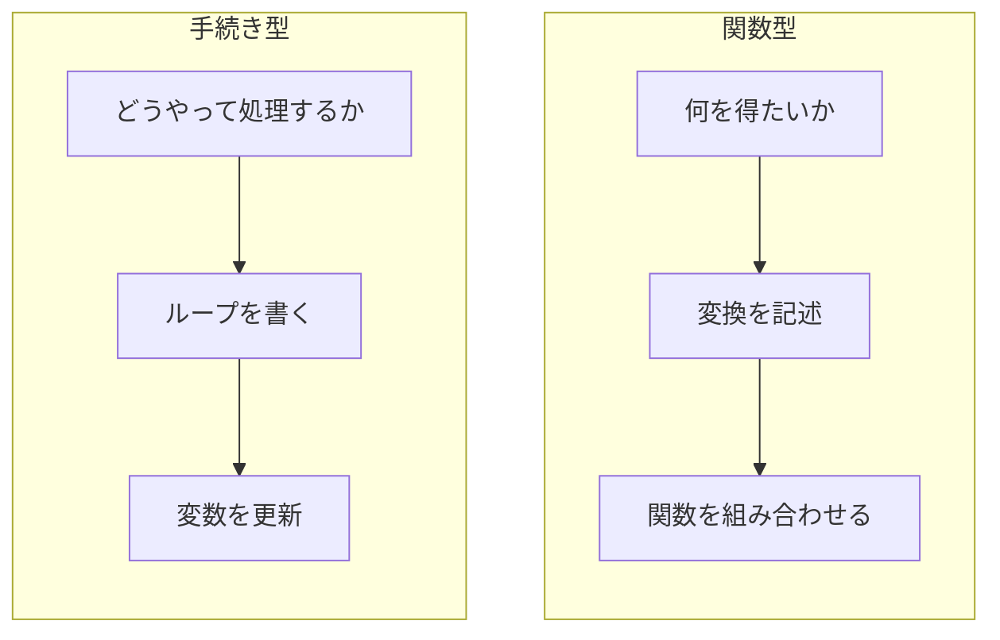
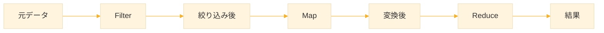
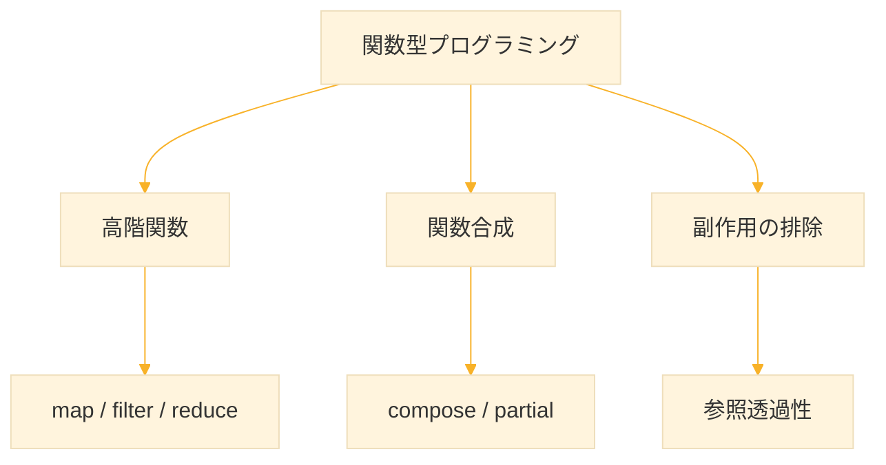

# Level 8 (関数型プログラミングの応用)

## 1. 関数型プログラミングとは

**関数型プログラミング** は、関数を中心に据えたプログラミングスタイルである。従来の「命令を順番に実行する」手続き型とは、考え方が異なる。

| 特徴 | 説明 |
|------|------|
| 関数は第一級オブジェクト | 関数を変数に入れたり、引数として渡せる |
| 副作用を避ける | データを変更せず、新しいデータを返す |
| 宣言的 | 「何を得たいか」を記述する |

### 1-1. 手続き型と関数型の違い

手続き型では「どうやって処理するか」を細かく指示する。一方、関数型では「何を得たいか」を宣言する。



例えば「リストの各要素を2倍する」場合：

```lisp
;; 手続き型：ループで1つずつ処理
(let ((result nil))
  (dolist (x '(1 2 3))
    (push (* x 2) result))
  (nreverse result))

;; 関数型：変換を宣言
(mapcar (lambda (x) (* x 2)) '(1 2 3))
```

関数型の方が「何をしたいか」が明確で、コードも短い。


## 2. Map → Filter → Reduce パイプライン

### 2-1. データ処理の3ステップ

実務のデータ処理の多くは、以下の3ステップの組み合わせで表現できる。これを **パイプライン** と呼ぶ。

1. **Filter（絞り込み）**：必要なデータだけ選ぶ
2. **Map（変換）**：各データを加工する
3. **Reduce（集約）**：全体を1つの値にまとめる



この順序は固定ではなく、処理の目的に応じて入れ替えてよい。重要なのは「小さな処理を組み合わせて複雑な処理を作る」という考え方である。

### 2-2. 具体例：成績処理

学生の点数リストから、合格者の平均点を求める例を見てみよう。

```lisp
;; 学生の点数リスト
(defparameter *scores* '(45 78 92 38 85 67 91 55))

;; 目標：合格者（60点以上）の平均点を求める
```

**ステップごとに分解**

まず、何をすべきか整理する。
1. 60点以上の点数だけを取り出す（Filter）
2. 点数はそのまま使う（Map は不要）
3. 合計を求めて人数で割る（Reduce + 計算）

```lisp
;; ステップ1：Filter（合格者だけ抽出）
(defparameter *passing*
  (remove-if-not (lambda (s) (>= s 60)) *scores*))
;; → (78 92 85 67 91)

;; ステップ2：Map（この例では不要、点数をそのまま使う）

;; ステップ3：Reduce（平均を計算）
(/ (reduce #'+ *passing*)
   (float (length *passing*)))
;; → 82.6
```

**1つの式で書く**

慣れてくると、これらを1つの式にまとめられる。`let` で中間結果を束縛すると読みやすい。

```lisp
(let ((passing (remove-if-not (lambda (s) (>= s 60)) *scores*)))
  (if passing
      (/ (reduce #'+ passing)
         (float (length passing)))
      0))
;; → 82.6
```

空のリストで割り算するとエラーになるため、`if` でチェックしている。

### 2-3. 具体例：テキスト分析

単語リストから、5文字以上の単語の総文字数を求める。

```lisp
;; 単語リスト
(defparameter *words* 
  '("the" "quick" "brown" "fox" "jumps" "over" "lazy" "dog"))

;; 目標：5文字以上の単語の総文字数を求める
```

処理の流れ
1. 5文字以上の単語を抽出（Filter）
2. 各単語を文字数に変換（Map）
3. 文字数を合計（Reduce）

```lisp
(reduce #'+                                    ; 3. 合計
        (mapcar #'length                       ; 2. 文字数に変換
                (remove-if-not                 ; 1. 5文字以上を抽出
                  (lambda (w) (>= (length w) 5))
                  *words*)))
;; → 15（"quick" + "brown" + "jumps" = 5 + 5 + 5）
```

コードは内側から外側に向かって読む。最初に `remove-if-not` が実行され、その結果に `mapcar` が適用され、最後に `reduce` で集約される。

### 2-4. 具体例：商品在庫管理

より実践的な例として、商品データの処理を見てみよう。

```lisp
;; 商品リスト（名前 価格 在庫数）
(defparameter *products*
  '(("Apple" 100 50)
    ("Banana" 80 0)
    ("Orange" 120 30)
    ("Grape" 200 0)
    ("Melon" 500 15)))

;; 目標：在庫がある商品の総在庫金額を計算
```

処理の流れ：
1. 在庫がある商品だけ抽出（Filter）
2. 各商品の在庫金額（価格×在庫数）を計算（Map）
3. 合計（Reduce）

```lisp
(reduce #'+
        ;; 各商品の「価格 × 在庫数」を計算
        (mapcar (lambda (p) (* (second p) (third p)))
                ;; 在庫数が 0 より大きい商品だけ残す
                (remove-if-not (lambda (p) (> (third p) 0))
                               *products*)))
;; → 16100
```

`second` と `third` でリストの2番目（価格）と3番目（在庫数）を取り出している。

## 3. 関数合成（Function Composition）

### 3-1. 関数合成とは

**関数合成** は、複数の関数をつなげて新しい関数を作ることである。数学では $(f \circ g)(x) = f(g(x))$ と書く。


なぜ関数合成が必要か？毎回 `(f (g x))` と書くのは冗長である。「f の後に g を適用する」という処理自体を関数として名前をつけておけば、再利用できる。

```lisp
;; 例：「絶対値を取ってから2倍する」
;; 手順1: x → (abs x)
;; 手順2: (abs x) → (* 2 (abs x))

;; 直接書くと
(* 2 (abs -5))
;; → 10
```

この処理を何度も使うなら、関数として定義しておきたい。

### 3-2. compose 関数の実装

2つの関数を合成する `compose` を自作してみよう。

```lisp
;; 2つの関数を合成する
(defun compose (f g)
  (lambda (x)
    (funcall f (funcall g x))))
```

この関数は「関数を受け取って、関数を返す」高階関数である。返される関数は、引数 `x` に対して「まず `g` を適用し、その結果に `f` を適用する」。

**使用例：**

```lisp
;; 「絶対値を取ってから2倍する」関数を作成
(defparameter *abs-then-double*
  (compose (lambda (x) (* x 2))  ; 後に適用（2倍）
           #'abs))               ; 先に適用（絶対値）

(funcall *abs-then-double* -5)
;; → 10（-5 → 5 → 10）

(funcall *abs-then-double* 3)
;; → 6（3 → 3 → 6）
```

注意：`compose` の引数の順序は「後に適用する関数が先」である。これは数学の表記 `f ∘ g` に合わせている。

### 3-3. 実用例

```lisp
;; 文字列を大文字にして長さを返す関数
(defparameter *uppercase-length*
  (compose #'length #'string-upcase))

(funcall *uppercase-length* "hello")
;; → 5

;; 1を足してから2乗する関数
(defparameter *inc-then-square*
  (compose (lambda (x) (* x x)) #'1+))

(funcall *inc-then-square* 4)
;; → 25（4 → 5 → 25）
```

### 3-4. 複数の関数を合成

3つ以上の関数を合成したい場合は、`compose-all` を定義する。

```lisp
;; 任意個の関数を合成
(defun compose-all (&rest fns)
  (if (null fns)
      #'identity                    ; 関数がなければ恒等関数
      (let ((fn1 (car fns))
            (rest-composed (apply #'compose-all (cdr fns))))
        (lambda (x)
          (funcall fn1 (funcall rest-composed x))))))
```

`identity` は「引数をそのまま返す」関数で、合成の単位元として機能する。

**使用例：**

```lisp
;; 「2倍 → 絶対値 → 1を足す」を合成
(defparameter *f*
  (compose-all #'1+                    ; 3番目：1を足す
               #'abs                   ; 2番目：絶対値
               (lambda (x) (* x 2))))  ; 1番目：2倍

(funcall *f* -5)
;; → 11（-5 → -10 → 10 → 11）
```


## 4. 部分適用（Partial Application）

### 4-1. 部分適用とは

**部分適用** は、関数の一部の引数を固定して新しい関数を作ることである。「汎用的な関数から、特化した関数を作る」技法と言える。

```lisp
;; + は2つの引数を取る
(+ 5 10)
;; → 15

;; 「5を足す」関数を作りたい
;; → 最初の引数を 5 に固定
```

毎回 `(lambda (x) (+ 5 x))` と書くのは面倒である。部分適用を使えば、より宣言的に書ける。

### 4-2. partial 関数の実装

```lisp
(defun partial (fn &rest fixed-args)
  (lambda (&rest more-args)
    (apply fn (append fixed-args more-args))))
```

**動作の説明：**
- `fixed-args`：あらかじめ固定する引数（リストとして受け取る）
- `more-args`：呼び出し時に渡す追加の引数
- `append`：固定引数と追加引数を1つのリストに結合
- `apply`：結合した引数で元の関数を呼び出す

`&rest` は「残りの引数をすべてリストとして受け取る」という意味である（詳細は後述）。

### 4-3. 使用例

```lisp
;; 5を足す関数
(defparameter *add5* (partial #'+ 5))
(funcall *add5* 10)
;; more-args = (10)
;; (append '(5) '(10)) = (5 10)
;; (apply #'+ '(5 10)) = (+ 5 10) = 15

;; 3倍する関数
(defparameter *triple* (partial #'* 3))
(funcall *triple* 7)
;; more-args = (7)
;; (append '(3) '(7)) = (3 7)
;; (apply #'* '(3 7)) = (* 3 7) = 21

;; リストの先頭に 'x を追加する関数
(defparameter *prepend-x* (partial #'cons 'x))
(funcall *prepend-x* '(1 2 3))
;; more-args = ((1 2 3))          ; リスト1つが引数
;; (append '(x) '((1 2 3))) = (x (1 2 3))
;; (apply #'cons '(x (1 2 3))) = (cons 'x '(1 2 3)) = (X 1 2 3)
```

### 4-4. 実用例：消費税計算

部分適用は、設定値を埋め込んだ関数を作るのに便利である。

```lisp
;; 税率を固定した計算関数を作る
(defparameter *add-tax-10* (partial #'* 1.1))   ; 10%
(defparameter *add-tax-8* (partial #'* 1.08))   ; 8%

(funcall *add-tax-10* 1000)
;; → 1100.0

(funcall *add-tax-8* 1000)
;; → 1080.0
```

税率が変わっても、`*add-tax-10*` の定義を1箇所変えるだけで済む。

### 4-5. 合成と部分適用の組み合わせ

`compose` と `partial` を組み合わせると、複雑な処理を宣言的に構築できる。

```lisp
;; 「5を足してから2倍する」関数
(defparameter *add5-then-double*
  (compose (partial #'* 2)
           (partial #'+ 5)))

(funcall *add5-then-double* 10)
;; → 30（10 → 15 → 30）
```

このように、小さな部品（関数）を組み合わせて大きな処理を作るのが、関数型プログラミングの本質である。

## 5. 引数の特殊な受け取り方

Common Lisp には、関数の引数を柔軟に受け取るための特殊な記法がある。これらを使いこなすと、より便利な関数を定義できる。

### 5-1. &rest：残りの引数をすべて受け取る

`&rest` は、「ここから後の引数をすべてリストとして受け取る」という意味である。引数の個数が不定の関数を作れる。

```lisp
(defun sum-all (&rest numbers)
  (reduce #'+ numbers :initial-value 0))

(sum-all 1 2 3)
;; → 6

(sum-all 1 2 3 4 5)
;; → 15

(sum-all)
;; → 0（引数なしでも動く）
```

### 5-2. &optional：省略可能な引数

`&optional` は、「この引数は省略できる」という意味である。省略された場合のデフォルト値を指定できる。

```lisp
(defun greet (name &optional (greeting "Hello"))
  (format nil "~a, ~a!" greeting name))

(greet "Alice")
;; → "Hello, Alice!"

(greet "Alice" "Good morning")
;; → "Good morning, Alice!"
```

デフォルト値は `(変数名 デフォルト値)` の形式で指定する。

### 5-3. &key：キーワード引数

`&key` は、「名前付きで引数を渡せる」という意味である。引数の順序を気にせず、必要なものだけ指定できる。

```lisp
(defun make-person (&key name age (city "Unknown"))
  (list :name name :age age :city city))

(make-person :name "Alice" :age 25)
;; → (:NAME "Alice" :AGE 25 :CITY "Unknown")

;; 順序は自由
(make-person :age 30 :name "Bob" :city "Tokyo")
;; → (:NAME "Bob" :AGE 30 :CITY "Tokyo")
```

キーワード引数は設定やオプションを渡すときに便利である。

### 5-4. まとめ

| 記号 | 意味 | 例 |
|------|------|-----|
| `&rest` | 残り全部をリストで受け取る | `(&rest args)` |
| `&optional` | 省略可能な引数 | `(&optional x y)` |
| `&key` | キーワード引数 | `(&key name age)` |

これらは組み合わせて使うこともできる。順序は `&optional` → `&rest` → `&key` でなければならない。


## 6. 副作用と参照透過性

### 6-1. 副作用とは

**副作用（side effect）** は、関数が「値を返す」以外に行う操作である。副作用があると、プログラムの動作を予測しにくくなる。

```lisp
;; 副作用の例
(setf *global* 10)     ; グローバル変数の変更
(print "hello")        ; 画面への出力
(incf counter)         ; 変数の更新
```

副作用自体は悪ではない。ファイルへの書き込みや画面表示は副作用だが、プログラムに必要な機能である。問題は、副作用が予期しない場所で起きることである。

### 6-2. 参照透過性

**参照透過性（referential transparency）** がある関数は、同じ引数に対して常に同じ結果を返す。数学の関数と同じ性質である。

```lisp
;; 参照透過性あり：常に同じ結果
(defun square (x)
  (* x x))

(square 5)  ;; → 25
(square 5)  ;; → 25（何度呼んでも同じ）
```

参照透過性がない関数は、外部の状態に依存するため、結果が変わりうる。

```lisp
;; 参照透過性なし：結果が変わりうる
(defparameter *factor* 2)

(defun multiply-by-factor (x)
  (* x *factor*))

(multiply-by-factor 5)  ;; → 10
(setf *factor* 3)
(multiply-by-factor 5)  ;; → 15（同じ引数でも結果が違う）
```

### 6-3. 副作用を避ける利点

副作用のない関数（純粋関数）には多くの利点がある。

| 利点 | 説明 |
|------|------|
| テストしやすい | 入力と出力だけ確認すればよい |
| バグが少ない | 予期しない状態変化がない |
| 並列処理に強い | 共有状態がないので競合しない |
| 理解しやすい | 関数を見れば動作が分かる |

### 6-4. 高階関数と副作用

高階関数に渡す関数は、純粋であるべきである。

**良い例：純粋な変換**

```lisp
(mapcar (lambda (x) (* x 2)) '(1 2 3))
;; → (2 4 6)
;; 副作用なし、元のリストも変更されない
```

**避けるべき例：副作用に頼る**

```lisp
;; mapcar の中で副作用を起こす（非推奨）
(defparameter *total* 0)
(mapcar (lambda (x) (incf *total* x)) '(1 2 3))
*total*
;; → 6
;; 動くが、mapcar の本来の目的から外れている
```

`mapcar` は「変換」のための関数である。副作用が目的なら `dolist` を使うべきである。

### 6-5. ガイドライン

高階関数に渡す関数では、以下を避ける。

- グローバル変数の読み書き
- `print` や `format` による出力
- `setf` や `incf` による破壊的操作

代わりに

- 引数だけに依存する
- 新しい値を返す
- 元のデータを変更しない

副作用が必要な処理は、プログラムの外側（入出力の境界）にまとめるのがよい設計である。

## 7. 実践例

### 7-1. ログファイルの解析

ログの行から特定のパターンを抽出する例。`search` は文字列内に部分文字列があれば位置を、なければ `NIL` を返す。

```lisp
(defparameter *log-lines*
  '("2024-01-15 INFO: Server started"
    "2024-01-15 ERROR: Database connection failed"
    "2024-01-15 INFO: Request processed"
    "2024-01-15 ERROR: Timeout occurred"))

;; エラー行だけを抽出
(remove-if-not (lambda (line)
                 (search "ERROR" line))
               *log-lines*)
;; → ("2024-01-15 ERROR: Database connection failed"
;;    "2024-01-15 ERROR: Timeout occurred")
```

### 7-2. データの正規化

数値データをカテゴリに変換する。`mapcar` でリスト全体を一括変換できる。

```lisp
;; 点数を5段階評価に変換
(defun grade (score)
  (cond ((>= score 90) 'A)
        ((>= score 80) 'B)
        ((>= score 70) 'C)
        ((>= score 60) 'D)
        (t 'F)))

(mapcar #'grade '(95 82 76 55 91 68))
;; → (A B C F A D)
```

### 7-3. 統計処理

平均と分散を計算する関数。分散は「各値と平均の差の2乗の平均」である。

```lisp
;; 平均値
(defun average (lst)
  (if (null lst)
      0
      (/ (reduce #'+ lst)
         (float (length lst)))))

;; 分散
(defun variance (lst)
  (let ((avg (average lst)))
    (average (mapcar (lambda (x)
                       (expt (- x avg) 2))
                     lst))))

(average '(2 4 4 4 5 5 7 9))
;; → 5.0

(variance '(2 4 4 4 5 5 7 9))
;; → 4.0
```

分散の計算では、まず `mapcar` で「各値と平均の差の2乗」のリストを作り、その平均を取っている。これも Map → Reduce パターンの一例である。


## 8. 練習課題

### 課題1：mapcar で変換

リストの各要素を3倍したリストを作れ。

```lisp
(defparameter *numbers* '(2 5 8 10))
;; → (6 15 24 30)
```

**解答**

```lisp
(mapcar (lambda (x) (* x 3)) *numbers*)
;; → (6 15 24 30)
```


### 課題2：Filter → Map → Reduce

偶数を抽出し、それぞれを2乗し、その合計を求めよ。

```lisp
(defparameter *nums* '(1 2 3 4 5 6 7 8 9 10))
;; → 220（4 + 16 + 36 + 64 + 100）
```

**解答**

```lisp
(reduce #'+
        (mapcar (lambda (x) (* x x))
                (remove-if-not #'evenp *nums*)))
;; → 220
```


### 課題3：compose を使う

「1を引いてから絶対値を取る」関数を compose で作れ。

```lisp
;; (funcall *f* 5)  → 4
;; (funcall *f* 0)  → 1
;; (funcall *f* -3) → 4
```

**解答**

```lisp
(defun compose (f g)
  (lambda (x)
    (funcall f (funcall g x))))

(defparameter *f*
  (compose #'abs #'1-))

(funcall *f* 5)   ;; → 4（5 → 4 → 4）
(funcall *f* 0)   ;; → 1（0 → -1 → 1）
(funcall *f* -3)  ;; → 4（-3 → -4 → 4）
```


### 課題4：partial を使う

10で割る関数を partial で作れ。

```lisp
;; (funcall *div10* 100) → 10
;; (funcall *div10* 50)  → 5
```

**解答**

```lisp
(defun partial (fn &rest fixed-args)
  (lambda (&rest more-args)
    (apply fn (append fixed-args more-args))))

;; 注意：/ は (/ 分子 分母) なので、分母を固定するには工夫が必要
(defparameter *div10*
  (lambda (x) (/ x 10)))

(funcall *div10* 100)  ;; → 10
(funcall *div10* 50)   ;; → 5
```


### 課題5：商品データの処理

商品リストから、在庫が10個以上ある商品だけを選び、価格を1.1倍（税込）にして、総額を求めよ。

```lisp
(defparameter *inventory*
  '(("Pen" 100 5)
    ("Notebook" 200 15)
    ("Eraser" 50 20)
    ("Ruler" 150 3)))
;; → 4400.0
```

**解答**

```lisp
(reduce #'+
        (mapcar (lambda (p)
                  (* (* (second p) 1.1)  ; 税込価格
                     (third p)))         ; 在庫数
                (remove-if-not
                  (lambda (p) (>= (third p) 10))
                  *inventory*)))
;; → 4400.0
;; Notebook: 200 * 1.1 * 15 = 3300
;; Eraser: 50 * 1.1 * 20 = 1100
;; 合計: 4400
```

### 課題6：compose-all の実装

任意個の関数を合成する `compose-all` を実装せよ。

```lisp
(defparameter *f* 
  (compose-all #'1+ #'abs (lambda (x) (* x 2))))

(funcall *f* -5)
;; → 11（-5 → -10 → 10 → 11）
```

**解答**

```lisp
(defun compose-all (&rest fns)
  (reduce (lambda (f g)
            (lambda (x) (funcall f (funcall g x))))
          fns
          :initial-value #'identity
          :from-end t))

;; テスト
(defparameter *f*
  (compose-all #'1+ #'abs (lambda (x) (* x 2))))

(funcall *f* -5)
;; → 11
```


## 9. まとめ

### 関数型プログラミングの3つの柱



### Map → Filter → Reduce パターン

データ処理の多くは、この3つの操作の組み合わせで表現できる。

```lisp
(reduce 集約関数
        (mapcar 変換関数
                (remove-if-not 条件関数 データ)))
```

### 関数合成と部分適用

小さな関数を組み合わせて、複雑な処理を構築する。

| 技法 | 目的 | 例 |
|------|------|-----|
| compose | 関数を連鎖 | `(compose #'abs #'1-)` |
| partial | 引数を固定 | `(partial #'+ 5)` |

### 副作用を避ける

純粋な関数はテストしやすく、バグが少ない。

- 高階関数には純粋な関数を渡す
- 元のデータを変更しない
- 新しい値を返す

