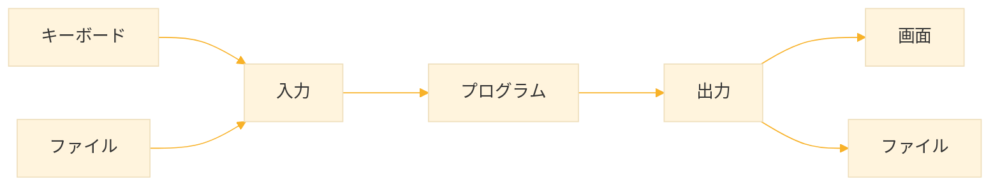
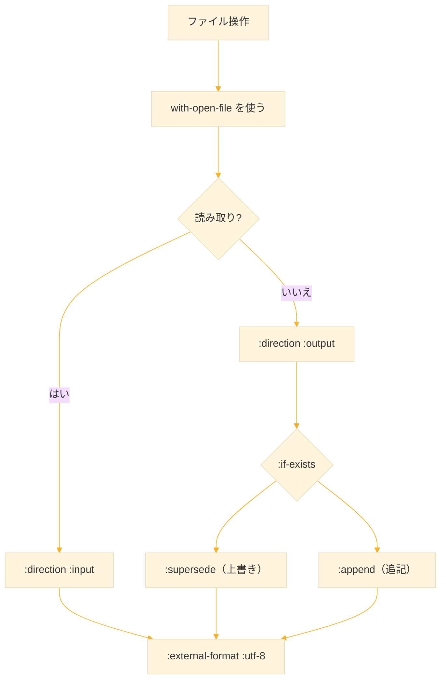

# Level 9 (入出力とファイル操作)
## 1. 入出力の基本

プログラムは、計算するだけでは意味がない。ユーザーからデータを受け取り、結果を表示したり、ファイルに保存したりする必要がある。この「外部とのデータのやり取り」が **入出力（I/O: Input/Output）** である。



### 1-1. ストリームとは

Common Lisp では、入出力は **ストリーム（stream）** という概念を通じて行われる。ストリームとは「データの流れ」を抽象化したもので、キーボードからの入力も、ファイルへの書き込みも、同じ仕組みで扱える。

水道の蛇口をイメージするとわかりやすい。蛇口を開けると水が流れ出るように、ストリームからはデータが流れてくる。逆に、排水口に水を流すように、ストリームにデータを流し込むこともできる。

### 1-2. 標準ストリーム

Common Lisp には、最初から用意されている標準的なストリームがある。

| ストリーム | 説明 | 用途 |
|:--|:--|:--|
| `*standard-input*` | 標準入力 | キーボードからの入力 |
| `*standard-output*` | 標準出力 | 画面への出力 |
| `*error-output*` | エラー出力 | エラーメッセージの出力 |

通常、私たちが `print` や `format` で出力すると、自動的に `*standard-output*`（画面）に表示される。入力関数 `read` は `*standard-input*`（キーボード）からデータを読み取る。


## 2. 基本的な出力関数

### 2-1. print ― デバッグ向けの出力

`print` は、値を出力する最も基本的な関数である。出力の前に改行し、後にスペースを入れる。

```lisp
(print "Hello")
```

実行すると、画面には以下のように表示される：

```
"Hello" 
```

`print` は **読み取り可能な形式** で出力する。つまり、文字列にはダブルクォートがつき、出力された内容をそのまま `read` で読み戻せる。これはデバッグやデータの保存に便利である。

### 2-2. prin1 ― 改行なしの読み取り可能形式

`prin1` は `print` と似ているが、前後に改行やスペースを入れない。

```lisp
(prin1 "Hello")
(prin1 "World")
```

出力：

```
"Hello""World"
```

連続して出力すると、くっついて表示される。改行が必要な場合は、別途 `terpri` を使う。

### 2-3. princ ― 人間が読みやすい形式

`princ` は **人間が読みやすい形式** で出力する。文字列のダブルクォートは表示されない。

```lisp
(princ "Hello")
```

出力：

```
Hello
```

ユーザーへのメッセージ表示には `princ` が適している。一方、データを保存して後で読み戻す場合は `prin1` を使う。

### 2-4. terpri ― 改行

`terpri` は改行だけを出力する。名前は「TERminate PRInt line」の略である。

```lisp
(princ "Hello")
(terpri)
(princ "World")
```

出力：

```
Hello
World
```

### 2-5. 出力関数の比較

| 関数 | 改行 | クォート | 主な用途 |
|--|--|--|--|
| `print` | 前に改行 | あり | デバッグ、簡易出力 |
| `prin1` | なし | あり | データ保存 |
| `princ` | なし | なし | ユーザー向け表示 |
| `terpri` | 改行のみ | - | 改行の挿入 |


## 3. format ― 強力な書式付き出力

### 3-1. format とは

`format` は、Common Lisp で最も強力な出力関数である。C言語の `printf` に似ているが、はるかに多機能である。書式文字列の中に **指定子** を埋め込み、値を整形して出力できる。

### 3-2. 基本構文

```lisp
(format 出力先 書式文字列 引数...)
```

**出力先** には3種類を指定できる：

| 出力先 | 動作 |
|--|--|
| `t` | 画面に出力し、`NIL` を返す |
| `nil` | 出力せず、文字列を返す |
| ストリーム | 指定したストリームに出力 |

```lisp
;; 画面に出力
(format t "Hello, World!")
;; Hello, World!
;; → NIL（戻り値）

;; 文字列として取得（画面には表示されない）
(format nil "Hello, World!")
;; → "Hello, World!"
```

`format` を使って文字列を組み立てる場合は、出力先に `nil` を指定する。これは非常によく使うパターンである。

### 3-3. 基本的な書式指定子

書式文字列の中で `~` から始まる部分が **書式指定子** である。指定子の位置に、引数が順番に埋め込まれる。

| 指定子 | 意味 | 例 |
|:--:|--|--|
| `~a` | 美的（Aesthetic）表示 | `(format t "~a" "hello")` → `hello` |
| `~s` | 標準（Standard）表示 | `(format t "~s" "hello")` → `"hello"` |
| `~d` | 10進整数（Decimal） | `(format t "~d" 42)` → `42` |
| `~f` | 浮動小数点数（Float） | `(format t "~f" 3.14)` → `3.14` |
| `~%` | 改行 | `(format t "~%")` |
| `~~` | チルダ自体を出力 | `(format t "~~")` → `~` |

`~a` と `~s` の違いは、`princ` と `prin1` の違いと同じである。人間向けには `~a`、データ保存には `~s` を使う。

### 3-4. 使用例

```lisp
;; 単純な値の埋め込み
(format t "名前: ~a~%" "Alice")
;; 名前: Alice

;; 複数の値を埋め込む
(format t "~a は ~d 歳です。~%" "Alice" 25)
;; Alice は 25 歳です。

;; 計算結果を埋め込む
(format t "合計: ~d~%" (+ 100 200 300))
;; 合計: 600
```

### 3-5. 数値の書式制御

数値を出力するとき、桁数や表示形式を細かく指定できる。

**整数の桁数指定**

```lisp
;; 5桁で右寄せ（空白で埋める）
(format t "|~5d|" 42)
;; |   42|

;; 5桁でゼロ埋め
(format t "|~5,'0d|" 42)
;; |00042|
```

**浮動小数点数の桁数**

```lisp
;; 全体5桁、小数点以下2桁
(format t "~5,2f" 3.14159)
;; 3.14
```

**カンマ区切り**

```lisp
;; 3桁ごとにカンマ
(format t "~:d" 1000000)
;; 1,000,000
```

これらは、金額や統計データの表示に便利である。

### 3-6. 条件付き出力

`~[` と `~]` で囲むと、条件に応じて異なる文字列を出力できる。

```lisp
;; インデックスで選択（0から開始）
(format t "~[zero~;one~;two~]" 0)  ;; → zero
(format t "~[zero~;one~;two~]" 1)  ;; → one
(format t "~[zero~;one~;two~]" 2)  ;; → two
```

真偽値で分岐する場合は `~:[` を使う：

```lisp
;; NIL なら最初、それ以外なら2番目
(format t "~:[失敗~;成功~]" t)    ;; → 成功
(format t "~:[失敗~;成功~]" nil)  ;; → 失敗
```

### 3-7. リストの繰り返し出力

`~{` と `~}` で囲むと、リストの各要素に対して繰り返し処理ができる。

```lisp
;; リストの各要素を出力
(format t "~{~a ~}" '(1 2 3 4 5))
;; 1 2 3 4 5

;; 区切り文字付き（~^ は最後の要素の後に区切りをつけない）
(format t "~{~a~^, ~}" '(a b c))
;; a, b, c
```

これは、リストの内容を表示するときに非常に便利である。


## 4. 入力関数

### 4-1. read ― S 式の読み取り

`read` は、入力から **S 式** を1つ読み取る。数値を入力すれば数値が、リストを入力すればリストが得られる。

```lisp
(read)
;; ユーザーが 42 と入力
;; → 42（数値として）

(read)
;; ユーザーが (1 2 3) と入力
;; → (1 2 3)（リストとして）
```

`read` は Lisp のデータ構造をそのまま読み取れるため、設定ファイルやデータファイルの読み込みに適している。

### 4-2. read-line ― 1行の読み取り

`read-line` は、入力を **1行そのまま文字列として** 読み取る。スペースを含む入力も受け取れる。

```lisp
(read-line)
;; ユーザーが Hello World と入力
;; → "Hello World"
```

ユーザーからの自由入力を受け取る場合は、`read` より `read-line` が適している。`read` だとスペースで区切られた部分だけを読み取ってしまうためである。

### 4-3. read-char ― 1文字の読み取り

`read-char` は、入力から **1文字だけ** 読み取る。キー入力の検出などに使う。

```lisp
(read-char)
;; ユーザーが a と入力
;; → #\a（文字オブジェクト）
```

### 4-4. 対話的プログラムの例

ユーザーと対話するプログラムを作ってみよう。

```lisp
(defun ask-name ()
  (format t "名前を入力してください: ")
  (finish-output)  ; 出力バッファを即座に表示
  (let ((name (read-line)))
    (format t "こんにちは、~a さん！~%" name)))
```

`finish-output` は、出力バッファの内容を強制的に表示する関数である。これがないと、プロンプトが表示される前に入力待ちになることがある。

実行例：

```
名前を入力してください: Alice
こんにちは、Alice さん！
```


## 5. ファイル操作の基本

### 5-1. なぜファイル操作が必要か

プログラムが終了すると、変数に保存したデータは消えてしまう。データを永続的に保存するには、ファイルに書き込む必要がある。また、大量のデータを処理する場合も、ファイルから読み込むことが多い。

### 5-2. ストリームによるファイルアクセス

ファイルを操作するには、まずファイルを開いて **ストリーム** を作成する。このストリームを通じて読み書きを行い、終わったらファイルを閉じる。


### 5-3. 外部形式（external-format）― 文字エンコーディングの指定

日本語などのマルチバイト文字を含むファイルを扱う場合、**外部形式** を指定する必要がある。外部形式とは、ファイル内の文字がどのようにエンコードされているかを指定するものである。

現代では UTF-8 が標準的なエンコーディングであり、ほとんどの場合 `:external-format :utf-8` を指定すれば問題ない。

```lisp
;; UTF-8 でファイルを開く
(open "japanese.txt" :direction :input :external-format :utf-8)
```

外部形式を指定しないと、システムのデフォルトエンコーディングが使われる。これは環境によって異なるため、**日本語を扱う場合は必ず `:external-format :utf-8` を明示的に指定する** ことを推奨する。

| 外部形式 | 説明 |
|--|--|
| `:utf-8` | UTF-8（推奨、最も汎用的） |
| `:utf-16` | UTF-16 |
| `:latin-1` | Latin-1（西欧言語向け） |
| `:default` | システムのデフォルト |

### 5-4. open と close

`open` でファイルを開き、`close` で閉じる。

```lisp
;; ファイルを読み取りモードで開く（UTF-8）
(defparameter *stream* (open "test.txt" 
                             :direction :input
                             :external-format :utf-8))

;; ストリームから1行読む
(read-line *stream*)

;; ファイルを閉じる
(close *stream*)
```

`:direction` オプションでモードを指定する：

| オプション | 意味 |
|:--|--|
| `:input` | 読み取り専用 |
| `:output` | 書き込み専用 |
| `:io` | 読み書き両用 |

### 5-5. open/close の問題点

`open` と `close` を別々に呼ぶ方法には問題がある。読み取り中にエラーが発生すると、`close` が実行されずにファイルが開いたままになってしまう。

```lisp
;; 危険なパターン
(defparameter *stream* (open "test.txt" 
                             :direction :input
                             :external-format :utf-8))
(some-function-that-might-fail)  ; ここでエラーが起きたら？
(close *stream*)  ; ← これが実行されない！
```

この問題を解決するのが `with-open-file` である。


## 6. with-open-file ― 安全なファイル操作

### 6-1. with-open-file の構文

```lisp
(with-open-file (ストリーム変数 ファイル名 オプション...)
  本体...)
```

`with-open-file` は、本体の処理が終わると **自動的にファイルを閉じる**。エラーが発生した場合でも確実に閉じられる。これは「リソースの自動解放」と呼ばれるパターンで、安全なプログラミングに欠かせない。

### 6-2. ファイルの読み取り

ファイルを1行ずつ読み取る基本パターン：

```lisp
(with-open-file (in "data.txt" 
                    :direction :input
                    :external-format :utf-8)
  (loop for line = (read-line in nil)
        while line
        do (format t "~a~%" line)))
```

`read-line` の引数：
- 第1引数：読み取るストリーム
- 第2引数：EOF（ファイル末尾）でエラーにするか（`nil` = エラーにしない、`NIL` を返す）

`loop` で繰り返し読み取り、`line` が `NIL`（ファイル末尾）になったら終了する。

### 6-3. ファイルへの書き込み

ファイルに書き込む基本パターン：

```lisp
(with-open-file (out "output.txt" 
                     :direction :output
                     :if-exists :supersede
                     :external-format :utf-8)
  (format out "1行目~%")
  (format out "2行目~%"))
```

`:if-exists` オプションは、ファイルが既に存在する場合の動作を指定する：

| オプション | 意味 |
|--|--|
| `:supersede` | 既存ファイルを削除して新規作成（上書き） |
| `:append` | 既存ファイルの末尾に追記 |
| `:error` | エラーを発生させる（デフォルト） |
| `:overwrite` | 既存ファイルを先頭から上書き |

`:if-does-not-exist` オプションは、ファイルが存在しない場合の動作を指定する：

| オプション | 意味 |
|--|--|
| `:create` | 新規作成（デフォルト） |
| `:error` | エラーを発生させる |

### 6-4. ファイルへの追記

ログファイルのように、既存の内容を残して追記したい場合：

```lisp
(with-open-file (out "log.txt"
                     :direction :output
                     :if-exists :append
                     :if-does-not-exist :create
                     :external-format :utf-8)
  (format out "[INFO] 処理が完了しました~%"))
```

この設定なら、ファイルが存在すれば追記、存在しなければ新規作成される。


## 7. S 式の読み書き

### 7-1. Lisp データの永続化

Common Lisp の大きな強みは、Lisp のデータ構造（リスト、シンボル、数値など）を **そのままファイルに保存し、そのまま読み戻せる** ことである。

他の言語では、データを保存するために JSON や XML などの形式に変換する必要がある。しかし Lisp では、S 式がそのまま保存形式になる。

### 7-2. データを保存する

`print` や `prin1` でデータをストリームに出力すると、S 式形式で保存される。

```lisp
;; 保存したいデータ
(defparameter *data* 
  '((name . "Alice")
    (age . 25)
    (scores . (80 90 85))))

;; ファイルに保存
(with-open-file (out "data.lisp"
                     :direction :output
                     :if-exists :supersede
                     :external-format :utf-8)
  (print *data* out))
```

ファイルの内容：

```
((NAME . "Alice") (AGE . 25) (SCORES 80 90 85))
```

### 7-3. データを読み込む

`read` でストリームから読み取ると、S 式がそのまま Lisp のデータとして復元される。

```lisp
;; ファイルから読み込み
(defparameter *loaded-data*
  (with-open-file (in "data.lisp" 
                      :direction :input
                      :external-format :utf-8)
    (read in)))

;; 読み込んだデータを使う
(cdr (assoc 'name *loaded-data*))
;; → "Alice"
```

これは非常に便利で、設定ファイル、ユーザーデータ、キャッシュなど、様々な用途に使える。

### 7-4. 複数のデータを読み書きする

1つのファイルに複数の S 式を保存することもできる。

```lisp
;; 複数のデータを保存
(with-open-file (out "multi.lisp"
                     :direction :output
                     :if-exists :supersede
                     :external-format :utf-8)
  (print '(item1 a b c) out)
  (print '(item2 x y z) out)
  (print '(item3 1 2 3) out))

;; 複数のデータを読み込み
(with-open-file (in "multi.lisp" 
                    :direction :input
                    :external-format :utf-8)
  (loop for item = (read in nil :eof)
        until (eq item :eof)
        collect item))
;; → ((ITEM1 A B C) (ITEM2 X Y Z) (ITEM3 1 2 3))
```

`read` の第3引数は、EOF に達したときに返す値である。ここでは `:eof` というシンボルを指定し、それが返されたらループを終了している。


## 8. パス操作

### 8-1. パス名とは

ファイルの場所を指定する文字列を **パス名** という。Common Lisp には、パス名を扱うための専用の機能がある。

パス名は複数の要素から構成される：

| 要素 | 意味 | 例 |
|--|--|--|
| directory | ディレクトリ | `/home/user/` |
| name | ファイル名（拡張子を除く） | `data` |
| type | 拡張子 | `txt` |

### 8-2. make-pathname ― パスの構築

プログラムでパスを組み立てるには `make-pathname` を使う。

```lisp
(make-pathname :directory '(:absolute "home" "user")
               :name "data"
               :type "txt")
;; → #P"/home/user/data.txt"
```

`:absolute` は絶対パス、`:relative` は相対パスを表す。


#### `#P` について

`#P` は **パス名オブジェクト** を表すリーダーマクロである。文字列とは異なり、パス名オブジェクトはディレクトリ・ファイル名・拡張子を構造として持つ。

```lisp
;; 文字列（単なる文字の並び）
"/home/user/data.txt"

;; パス名オブジェクト（構造を持つ）
##P"/home/user/data.txt"
```

`probe-file` や `directory` などの関数はパス名オブジェクトを返す。通常のファイル操作では文字列を渡しても自動変換されるため、`#P` を明示的に書く必要はない。

```lisp
;; どちらも同じ動作
(open "/home/user/data.txt" :direction :input)
(open #P"/home/user/data.txt" :direction :input)
```

他の主なリーダーマクロ：

| 記法 | 意味 | 例 |
|------|------|-----|
| `#P` | パス名 | `#P"/home/user"` |
| `#\` | 文字 | `#\a` `#\Space` |
| `#'` | 関数参照 | `#'length` |
| `#(` | ベクタ | `#(1 2 3)` |


### 8-3. パス名の分解

パス名から各要素を取り出すには、専用の関数を使う。

```lisp
(defparameter *path* #P"/home/user/data.txt")

(pathname-directory *path*)
;; → (:ABSOLUTE "home" "user")

(pathname-name *path*)
;; → "data"

(pathname-type *path*)
;; → "txt"
```

### 8-4. merge-pathnames ― パスの結合

相対パスと基準パスを結合するには `merge-pathnames` を使う。

```lisp
(merge-pathnames "subdir/file.txt" "/home/user/")
;; → #P"/home/user/subdir/file.txt"
```

### 8-5. probe-file ― ファイルの存在確認

ファイルが存在するかどうかを確認するには `probe-file` を使う。

```lisp
;; ファイルが存在する場合：完全なパス名を返す
(probe-file "data.txt")
;; → #P"/full/path/to/data.txt"

;; ファイルが存在しない場合：NIL を返す
(probe-file "nonexistent.txt")
;; → NIL
```

ファイルを開く前に存在確認をしておくと、より親切なエラーメッセージを表示できる。

### 8-6. directory ― ディレクトリの一覧

ディレクトリ内のファイルを列挙するには `directory` を使う。ワイルドカード `*` で条件を指定できる。

```lisp
;; .txt ファイルの一覧
(directory "/home/user/*.txt")
;; → (#P"/home/user/a.txt" #P"/home/user/b.txt" ...)

;; すべてのファイル
(directory "/home/user/*.*")
```


## 9. 実践例

### 9-1. 設定ファイルの読み書き

アプリケーションの設定を S 式で保存・読み込みするモジュール：

```lisp
;; 設定を保存
(defun save-config (config filename)
  (with-open-file (out filename
                       :direction :output         ; 書き込みモード
                       :if-exists :supersede      ; 既存ファイルは上書き
                       :external-format :utf-8)   ; UTF-8 で保存
    (print config out))                           ; S式としてファイルに出力
  (format t "設定を保存しました: ~a~%" filename)) ; 完了メッセージを表示

;; 設定を読み込み（ファイルがなければデフォルト値を返す）
(defun load-config (filename &optional default)
  (if (probe-file filename)                       ; ファイルが存在するか確認
      (with-open-file (in filename 
                          :direction :input       ; 読み取りモードで開く
                          :external-format :utf-8); UTF-8 で読み込み
        (read in))                                ; S式として読み込む
      default))                                   ; なければデフォルト値を返す
```

使用例

```lisp
;; 設定を保存
(save-config '((host . "localhost")
               (port . 8080)
               (debug . t))
             "config.lisp")
;; 設定を保存しました: config.lisp

;; 設定を読み込み
(defparameter *config* (load-config "config.lisp"))
(cdr (assoc 'port *config*))
;; → 8080
```

```:config.lisp
((HOST . "localhost") (PORT . 8080) (DEBUG . T)) 
```

### 9-2. テキストファイルの行単位処理

ファイルの各行に対して処理を行う汎用関数：

```lisp
(defun process-lines (filename func)
  "ファイルの各行に対して関数を適用する"
  (with-open-file (in filename 
                      :direction :input
                      :external-format :utf-8)
    (loop for line = (read-line in nil)
          while line
          do (funcall func line))))
```

使用例：

```lisp
;; 各行を表示
(process-lines "data.txt" #'print)

;; 行数を数える
(let ((count 0))
  (process-lines "data.txt" 
                 (lambda (line) 
                   (declare (ignore line))
                   (incf count)))
  count)
```

### 9-3. 簡易 CSV パーサー

CSV（カンマ区切り値）ファイルを読み取る簡易的な実装：

```lisp
;; 文字列を区切り文字で分割
(defun split-string (str delimiter)
  (let ((result nil)                              ; 結果を格納するリスト
        (start 0))                                ; 現在の部分文字列の開始位置
    (loop for i from 0 below (length str)         ; 文字列を1文字ずつ走査
          when (char= (char str i) delimiter)     ; 区切り文字を見つけたら
          do (push (subseq str start i) result)   ; 開始位置から現在位置までを追加
             (setf start (1+ i))                  ; 開始位置を次の文字に更新
          finally (push (subseq str start) result)) ; 最後の部分を追加
    (nreverse result)))                           ; 逆順になっているので反転

;; CSV ファイルを読み取り、リストのリストとして返す
(defun read-csv (filename)
  (with-open-file (in filename 
                      :direction :input           ; 読み取りモードで開く
                      :external-format :utf-8)    ; UTF-8 で読み込み
    (loop for line = (read-line in nil)           ; 1行ずつ読む（EOFでNIL）
          while line                              ; 行がある間繰り返す
          collect (split-string line #\,))))      ; カンマで分割して収集
```

data.csv の内容：

```
Alice,25,東京
Bob,30,大阪
Carol,28,京都
```

使用例：

```lisp
(read-csv "data.csv")
;; → (("Alice" "25" "東京") 
;;    ("Bob" "30" "大阪") 
;;    ("Carol" "28" "京都"))
```

### 9-4. ログファイルへの出力

タイムスタンプ付きでログを記録する関数：

```lisp
(defun log-message (message &optional (filename "app.log"))
  "タイムスタンプ付きでメッセージをログファイルに追記する"
  (with-open-file (out filename
                       :direction :output
                       :if-exists :append
                       :if-does-not-exist :create
                       :external-format :utf-8)
    (multiple-value-bind (sec min hour day month year)
        (get-decoded-time)
      (format out "[~4d-~2,'0d-~2,'0d ~2,'0d:~2,'0d:~2,'0d] ~a~%"
              year month day hour min sec message))))
```

使用例：

```lisp
(log-message "アプリケーション開始")
(log-message "ユーザーがログイン")
(log-message "処理完了")
```

app.log の内容：

```
[2024-01-15 10:30:45] アプリケーション開始
[2024-01-15 10:30:46] ユーザーがログイン
[2024-01-15 10:31:02] 処理完了
```


## 10. 練習課題

### 課題1：format の練習

以下の出力を format で作成せよ。

```
Name: Alice
Age:    25
Score: 85.50
```

**解答**

```lisp
(format t "Name: ~a~%Age: ~5d~%Score: ~5,2f~%"
        "Alice" 25 85.5)
```


### 課題2：ファイルへの書き込み

リストの内容を1行ずつファイルに書き込む関数 `write-lines` を作れ。

```lisp
(write-lines '("Line 1" "Line 2" "Line 3") "output.txt")
```

**解答**

```lisp
;; リストの各要素を1行ずつファイルに書き込む
(defun write-lines (lines filename)
  (with-open-file (out filename
                       :direction :output        ; 書き込みモード
                       :if-exists :supersede     ; 既存ファイルは上書き
                       :external-format :utf-8)  ; UTF-8 で保存
    (dolist (line lines)                         ; リストの各要素を順に処理
      (format out "~a~%" line))))                ; 1行出力して改行
```

実行例

```
(write-lines '("おはよう" "こんにちは" "こんばんは") "greeting.txt")
;; → NIL
```

### 課題3：ファイルからの読み取り

ファイルの全行をリストとして返す関数 `read-lines` を作れ。

**解答**

```lisp
;; ファイルの全行をリストとして返す
(defun read-lines (filename)
  (with-open-file (in filename 
                      :direction :input           ; 読み取りモードで開く
                      :external-format :utf-8)    ; UTF-8 で読み込み
    (loop for line = (read-line in nil)           ; 1行ずつ読む（EOFでNIL）
          while line                              ; 行がある間繰り返す
          collect line)))                         ; 各行をリストに収集
```

実行例
```
(read-lines "greeting.txt")
;; → ("おはよう" "こんにちは" "こんばんは")
```


### 課題4：単語数カウント

ファイル内の単語数を数える関数 `count-words` を作れ。（単語はスペースで区切られているとする）

**解答**

```lisp
;; ファイル内の単語数を数える（スペース区切り）
(defun count-words (filename)
  (let ((count 0))                                  ; 単語数カウンタ
    (with-open-file (in filename 
                        :direction :input           ; 読み取りモードで開く
                        :external-format :utf-8)    ; UTF-8 で読み込み
      (loop for line = (read-line in nil)           ; 1行ずつ読む
            while line                              ; 行がある間繰り返す
            do (incf count                          ; カウンタに加算
                     (length (split-string line #\Space))))) ; 行内の単語数
    count))                                         ; 最終結果を返す

;; split-string は 9-3 で定義済み
```


### 課題5：連想リストの保存と読み込み

連想リストをファイルに保存し、読み込む関数ペアを作れ。

**解答**

```lisp
;; 連想リストをファイルに保存
(defun save-alist (alist filename)
  (with-open-file (out filename
                       :direction :output         ; 書き込みモード
                       :if-exists :supersede      ; 既存ファイルは上書き
                       :external-format :utf-8)   ; UTF-8 で保存
    (print alist out)))                           ; S式として出力

;; 連想リストをファイルから読み込み
(defun load-alist (filename)
  (with-open-file (in filename 
                      :direction :input           ; 読み取りモードで開く
                      :external-format :utf-8)    ; UTF-8 で読み込み
    (read in)))                                   ; S式として読み込む

;; テスト
(save-alist '((a . 1) (b . 2) (c . 3)) "alist.lisp")
(load-alist "alist.lisp")
;; → ((A . 1) (B . 2) (C . 3))
```


### 課題6：ファイルのコピー

ファイルを別の場所にコピーする関数 `copy-file` を作れ。

**解答**

```lisp
;; ファイルを別の場所にコピー
(defun copy-file (source dest)
  (with-open-file (in source 
                      :direction :input           ; コピー元を読み取りモードで開く
                      :external-format :utf-8)    ; UTF-8 で読み込み
    (with-open-file (out dest
                         :direction :output       ; コピー先を書き込みモードで開く
                         :if-exists :supersede    ; 既存ファイルは上書き
                         :external-format :utf-8) ; UTF-8 で保存
      (loop for line = (read-line in nil)         ; 1行ずつ読む
            while line                            ; 行がある間繰り返す
            do (format out "~a~%" line)))))       ; コピー先に書き込む

;; テスト
(copy-file "source.txt" "dest.txt")
```


## 11. まとめ

### 出力関数の使い分け

| 目的 | 関数 |
|--|--|
| 簡単なデバッグ | `print` |
| 書式付き出力 | `format` |
| データ保存（読み戻し可能） | `prin1` |
| 人間向け表示 | `princ` |

### format の主要な書式指定子

| 指定子 | 意味 | 用途 |
|--|--|--|
| `~a` | 美的表示 | 人間向け |
| `~s` | S式表示 | データ保存 |
| `~d` | 整数 | 数値表示 |
| `~f` | 浮動小数点 | 数値表示 |
| `~%` | 改行 | 改行挿入 |
| `~{~}` | リストの繰り返し | リスト表示 |

### ファイル操作のパターン



**読み取りの基本形：**

```lisp
(with-open-file (in "file.txt" 
                    :direction :input
                    :external-format :utf-8)
  (loop for line = (read-line in nil)
        while line
        do (処理)))
```

**書き込みの基本形：**

```lisp
(with-open-file (out "file.txt"
                     :direction :output
                     :if-exists :supersede
                     :external-format :utf-8)
  (format out "~a~%" data))
```

### 日本語ファイルを扱う際の注意点

日本語を含むファイルを読み書きする際は、**必ず `:external-format :utf-8` を指定する**。これを忘れると、文字化けやエラーの原因になる。

### S 式の永続化

Lisp のデータは `print` で保存し、`read` で復元できる。これは他の言語にない Lisp の強みである。

