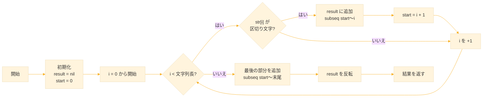
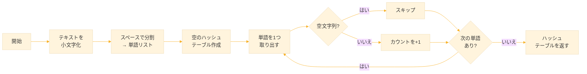
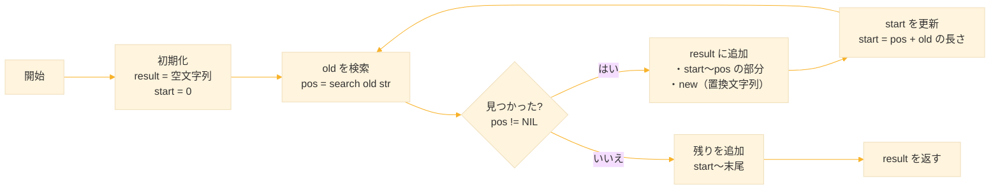
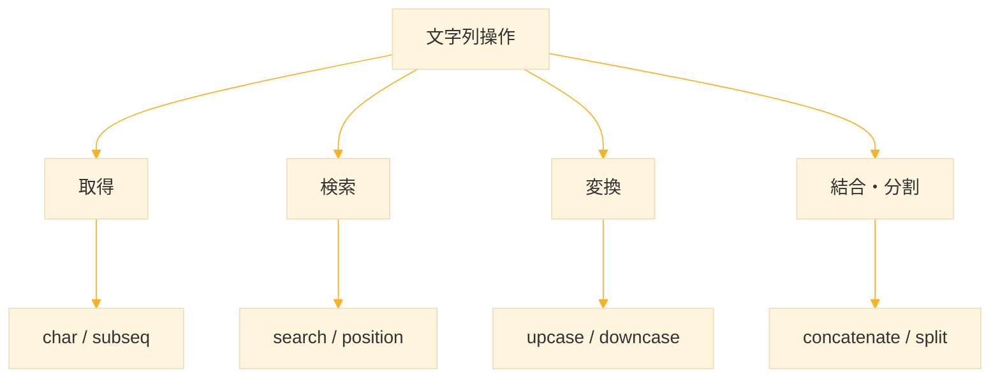

# Level 10 (文字列操作)

## 1. 文字列の基本

### 1-1. 文字列とは

**文字列（string）** は、文字の並びを表すデータ型である。Common Lisp では、文字列はダブルクォートで囲んで表現する。

```lisp
"Hello, World!"
"こんにちは"
""  ; 空文字列
```

文字列は **シーケンス** の一種であり、リストやベクタと同じ操作（`length`、`elt`、`subseq` など）が使える。

### 1-2. 文字列の長さ

```lisp
(length "Hello")
;; → 5

(length "こんにちは")
;; → 5

(length "")
;; → 0
```

### 1-3. 文字へのアクセス

文字列の各文字には、インデックス（0始まり）でアクセスできる。

```lisp
;; char：指定位置の文字を取得
(char "Hello" 0)  ;; → #\H

(char "Hello" 4)  ;; → #\o

(char "こんにちは" 4) ;; → は

;; elt でも同様（シーケンス共通の関数）
(elt "Hello" 1)
;; → #\e
```

`#\` は **文字オブジェクト** を表すリーダーマクロである。`#\a` は文字 a、`#\Space` はスペースを表す。

### 1-4. 文字列の作成

```lisp
;; make-string：指定長の文字列を作成
(make-string 5)
;; → "     "（スペース5個、処理系依存）

;; 初期文字を指定
(make-string 5 :initial-element #\*)
;; → "*****"

;; string：シンボルや文字を文字列に変換
(string 'hello)
;; → "HELLO"

(string #\a)
;; → "a"
```


## 2. 文字列の比較

### 2-1. 基本の比較関数

文字列の比較には専用の関数を使う。`=` や `eq` では正しく比較できない。

| 関数 | 大文字小文字 | 意味 |
|------|-------------|------|
| `string=` | 区別する | 等しい |
| `string-equal` | 区別しない | 等しい |
| `string<` | 区別する | より小さい（辞書順） |
| `string>` | 区別する | より大きい |
| `string<=` | 区別する | 以下 |
| `string>=` | 区別する | 以上 |


### 2-2. 使用例

```lisp
;; 完全一致
(string= "Hello" "Hello")
;; → T

(string= "Hello" "hello")
;; → NIL（大文字小文字が違う）

;; 大文字小文字を無視して比較
(string-equal "Hello" "hello")
;; → T

;; 辞書順の比較
(string< "abc" "abd")
;; → 2（異なる位置を返す）

(string< "abc" "abc")
;; → NIL（等しいので「より小さい」は偽）

(string< "apple" "banana")
;; → 0（最初の文字から異なる）
```

`string<` などは、異なる最初の位置を返す。等しい場合や条件を満たさない場合は `NIL` を返す。

### 2-3. 部分比較

`:start1`、`:end1`、`:start2`、`:end2` で比較範囲を指定できる。

```lisp
;; 先頭3文字だけ比較
(string= "Hello" "Helsinki" :end1 3 :end2 3)
;; → T（"Hel" = "Hel"）

;; 2文字目から4文字目まで比較
(string= "abcde" "xxbcdyy" :start1 1 :end1 4 :start2 2 :end2 5)
;; → T（"bcd" = "bcd"）
```


## 3. 文字列の検索

### 3-1. search ― 部分文字列の検索

`search` は、文字列内に部分文字列があるか探し、見つかった位置を返す。

```lisp:書式
(search subseq seq &key :test)
```

* **subseq**（探したいもの）
* **seq**（探す対象）
* **:test**（比較に使う関数）

返り値：一致した位置の「開始インデックス」（0-based）
一致しなければ NIL。

```lisp
(search "lo" "Hello, World!")
;; → 3（"lo" が位置3から始まる）

(search "xyz" "Hello, World!")
;; → NIL（見つからない）

;; 大文字小文字を無視
(search "HELLO" "Hello, World!" :test #'char-equal)
;; → 0
```

`char-equal` は「大文字・小文字を区別しない文字比較関数」

### 3-2. position ― 文字の検索

`position` は、指定した文字が最初に現れる位置を返す。

```lisp
(position #\o "Hello, World!")
;; → 4（最初の 'o' の位置）

(position #\x "Hello, World!")
;; → NIL（見つからない）

;; 後ろから検索
(position #\o "Hello, World!" :from-end t)
;; → 8（最後の 'o' の位置）
```

### 3-3. find ― 文字の存在確認

`find` は、文字が存在すればその文字を、なければ `NIL` を返す。

```lisp
(find #\o "Hello")
;; → #\o（存在する）

(find #\x "Hello")
;; → NIL（存在しない）
```

### 3-4. count ― 文字の出現回数

```lisp
(count #\o "Hello, World!")
;; → 2（'o' が2回出現）

(count #\l "Hello, World!")
;; → 3
```


## 4. 部分文字列

### 4-1. subseq ― 部分文字列の取得

`subseq` は、文字列の一部を取り出す。

```lisp
;; (subseq 文字列 開始位置 [終了位置])
(subseq "Hello, World!" 0 5)
;; → "Hello"

(subseq "Hello, World!" 7)
;; → "World!"（終了位置省略で末尾まで）

(subseq "Hello, World!" 7 12)
;; → "World"
```

終了位置は「その位置の手前まで」を意味する。つまり、**開始位置は含み、終了位置は含まない**。

### 4-2. 先頭・末尾の取得

```lisp
;; 先頭n文字
(subseq "Hello" 0 3)
;; → "Hel"

;; 末尾n文字
(let ((s "Hello"))
  (subseq s (- (length s) 2)))
;; → "lo"
```

### 4-3. 文字列の判定

特定のパターンで始まる・終わるかを判定する関数を自作できる。

```lisp
;; 指定した接頭辞で始まるか
(defun starts-with-p (str prefix)
  (and (>= (length str) (length prefix))       ; strがprefixより長いか確認
       (string= str prefix :end1 (length prefix)))) ; strの先頭部分とprefixを比較

(starts-with-p "Hello, World!" "Hello")
;; → T

(starts-with-p "Hello, World!" "World")
;; → NIL

;; 指定した接尾辞で終わるか
(defun ends-with-p (str suffix)
  (and (>= (length str) (length suffix))       ; strがsuffixより長いか確認
       (string= str suffix :start1 (- (length str) (length suffix))))) ; strの末尾部分とsuffixを比較

(ends-with-p "Hello, World!" "World!")
;; → T
```


## 5. 文字列の結合と変換

### 5-1. concatenate ― 文字列の結合

複数の文字列を結合するには `concatenate` を使う。

```lisp
(concatenate 'string "Hello" ", " "World!")
;; → "Hello, World!"

(concatenate 'string "abc" "def" "ghi")
;; → "abcdefghi"
```

第1引数の `'string` は、結果の型を指定している。

### 5-2. format による結合

`format` でも文字列を結合できる。変数を埋め込む場合に便利。

```lisp
(format nil "~a~a~a" "Hello" ", " "World!")
;; → "Hello, World!"

(let ((name "Alice")
      (age 25))
  (format nil "~a is ~d years old." name age))
;; → "Alice is 25 years old."
```

### 5-3. 大文字・小文字変換

```lisp
;; 大文字に変換
(string-upcase "Hello, World!")
;; → "HELLO, WORLD!"

;; 小文字に変換
(string-downcase "Hello, World!")
;; → "hello, world!"

;; 先頭だけ大文字（タイトルケース）
(string-capitalize "hello world")
;; → "Hello World"
```

これらの関数は元の文字列を変更せず、新しい文字列を返す。

### 5-4. 空白の除去

```lisp
;; 両端の空白を除去
(string-trim " " "  Hello  ")
;; → "Hello"

;; 複数の文字を指定
(string-trim " 	" "  	Hello	  ")
;; → "Hello"（スペースとタブを除去）

;; 左端のみ
(string-left-trim " " "  Hello  ")
;; → "Hello  "

;; 右端のみ
(string-right-trim " " "  Hello  ")
;; → "  Hello"
```

`string-trim` の第1引数は「除去する文字の集合」である。


## 6. 文字列の分割

Common Lisp には標準の split 関数がないため、自作する。

### 6-1. シンプルな実装

```lisp
;; 文字列を区切り文字で分割してリストを返す
(defun split-string (str delimiter)
  (let ((result nil)                              ; 結果を格納するリスト
        (start 0))                                ; 現在の部分文字列の開始位置
    (loop for i from 0 below (length str)         ; 文字列を1文字ずつ走査
          when (char= (char str i) delimiter)     ; 区切り文字を見つけたら
          do (push (subseq str start i) result)   ; 開始位置から現在位置までを追加
             (setf start (1+ i))                  ; 開始位置を次の文字に更新
          finally (push (subseq str start) result)) ; 最後の部分を追加
    (nreverse result)))                           ; 逆順になっているので反転

;; 使用例
(split-string "apple,banana,cherry" #\,)
;; → ("apple" "banana" "cherry")

(split-string "one two three" #\Space)
;; → ("one" "two" "three")
```




### 6-2. 空要素を除去するバージョン

```lisp
;; 空文字列を除去して分割
(defun split-string-no-empty (str delimiter)
  (remove-if (lambda (s) (string= s ""))          ; 空文字列を除去
             (split-string str delimiter)))        ; まず通常の分割を実行

;; 使用例
(split-string "a,,b,,c" #\,)
;; → ("a" "" "b" "" "c")

(split-string-no-empty "a,,b,,c" #\,)
;; → ("a" "b" "c")
```

### 6-3. 結合（join）

分割の逆操作として、リストを区切り文字で結合する関数も便利。

```lisp
(defun join-strings (lst delimiter)
  "リストの文字列を区切り文字で結合"
  (format nil (concatenate 'string "~{~a~^" (string delimiter) "~}") lst))

(join-strings '("apple" "banana" "cherry") #\,)
;; → "apple,banana,cherry"

(join-strings '("one" "two" "three") #\Space)
;; → "one two three"
```


## 7. 文字の操作

### 7-1. 文字と文字コード

文字とその文字コード（整数）を相互変換できる。

```lisp
;; 文字 → 文字コード
(char-code #\A)
;; → 65

(char-code #\a)
;; → 97

;; 文字コード → 文字
(code-char 65)
;; → #\A

(code-char 97)
;; → #\a
```

### 7-2. 文字の判定

```lisp
;; アルファベットか
(alpha-char-p #\a)
;; → T

(alpha-char-p #\1)
;; → NIL

;; 数字か
(digit-char-p #\5)
;; → 5（数値を返す）

(digit-char-p #\a)
;; → NIL

;; 英数字か
(alphanumericp #\a)
;; → T

(alphanumericp #\5)
;; → T

;; 大文字か・小文字か
(upper-case-p #\A)
;; → T

(lower-case-p #\a)
;; → T

;; 空白文字か
(member #\Space '(#\Space #\Tab #\Newline))
;; → (#\Space #\Tab #\Newline)
```

### 7-3. 文字の変換

```lisp
;; 大文字に変換
(char-upcase #\a)
;; → #\A

;; 小文字に変換
(char-downcase #\A)
;; → #\a
```

### 7-4. 特殊な文字

| 表記 | 意味 |
|------|------|
| `#\Space` | スペース |
| `#\Tab` | タブ |
| `#\Newline` | 改行 |
| `#\Return` | キャリッジリターン |

```lisp
;; 文字の比較
(char= #\a #\a)
;; → T

;; 大文字小文字を無視
(char-equal #\A #\a)
;; → T
```


## 8. 実践例

### 8-1. パスワード検証

```lisp
(defun valid-password-p (password)
  "パスワードが条件を満たすか検証"
  (and (>= (length password) 8)                    ; 8文字以上
       (some #'upper-case-p password)              ; 大文字を含む
       (some #'lower-case-p password)              ; 小文字を含む
       (some #'digit-char-p password)))            ; 数字を含む

(valid-password-p "abc")
;; → NIL（短すぎる）

(valid-password-p "abcdefgh")
;; → NIL（大文字・数字がない）

(valid-password-p "Abcdefg1")
;; → T
```

### 8-2. 単語の頻度カウント

```lisp
;; テキスト内の単語の出現頻度を返す
(defun word-frequency (text)
  (let ((words (split-string (string-downcase text) #\Space)) ; 小文字化してスペースで分割
        (freq (make-hash-table :test #'equal)))               ; 頻度を記録するハッシュテーブル
    (dolist (word words)                                      ; 各単語を処理
      (unless (string= word "")                               ; 空文字列でなければ
        (incf (gethash word freq 0))))                        ; カウントを1増やす（初期値0）
    freq))                                                    ; ハッシュテーブルを返す

;; 使用例
(defparameter *freq* 
  (word-frequency "the quick brown fox jumps over the lazy dog"))

(gethash "the" *freq*)
;; → 2

(gethash "fox" *freq*)
;; → 1
```



### 8-3. 文字列の置換

```lisp
;; 文字列内のすべての old を new に置換
(defun replace-all (str old new)
  (let ((result "")                                  ; 結果文字列
        (old-len (length old))                       ; 置換対象の長さ
        (start 0))                                   ; 検索開始位置
    (loop for pos = (search old str :start2 start)  ; old を検索
          while pos                                  ; 見つかる間繰り返す
          do (setf result (concatenate 'string 
                                        result 
                                        (subseq str start pos)  ; old の手前まで
                                        new))                   ; new で置換
             (setf start (+ pos old-len))            ; 次の検索開始位置を更新
          finally (setf result (concatenate 'string 
                                             result 
                                             (subseq str start)))) ; 残りを追加
    result))

;; 使用例
(replace-all "Hello, World!" "World" "Lisp")
;; → "Hello, Lisp!"

(replace-all "abcabc" "bc" "XY")
;; → "aXYaXY"
```



### 8-4. メールアドレスの簡易検証

```lisp
(defun valid-email-p (email)
  "メールアドレスの簡易検証"
  (let ((at-pos (position #\@ email)))
    (and at-pos                                    ; @ が存在
         (> at-pos 0)                              ; @ の前に文字がある
         (< at-pos (1- (length email)))            ; @ の後に文字がある
         (position #\. email :start at-pos)        ; @ より後に . がある
         (not (search ".." email)))))              ; 連続した . がない

(valid-email-p "user@example.com")
;; → T

(valid-email-p "invalid-email")
;; → NIL

(valid-email-p "@example.com")
;; → NIL
```


## 9. 練習課題

### 課題1：文字列の反転

文字列を逆順にする関数 `reverse-string` を作れ。

```lisp
(reverse-string "Hello")
;; → "olleH"
```

**解答**

```lisp
(defun reverse-string (str)
  (coerce (reverse (coerce str 'list)) 'string))

;; または
(defun reverse-string (str)
  (reverse str))  ; 文字列にも reverse が使える

(reverse-string "Hello")
;; → "olleH"
```


### 課題2：回文判定

文字列が回文（前から読んでも後ろから読んでも同じ）かを判定する関数を作れ。

```lisp
(palindrome-p "level")
;; → T

(palindrome-p "hello")
;; → NIL
```

**解答**

```lisp
(defun palindrome-p (str)
  (string= str (reverse str)))

;; 大文字小文字を無視するバージョン
(defun palindrome-p (str)
  (string-equal str (reverse str)))

(palindrome-p "Level")
;; → T
```


### 課題3：単語数カウント

文字列内の単語数を数える関数を作れ（スペース区切り）。

```lisp
(count-words "Hello World")
;; → 2

(count-words "  multiple   spaces  ")
;; → 2
```

**解答**

```lisp
(defun count-words (str)
  (length (split-string-no-empty str #\Space)))

;; split-string-no-empty はセクション6で定義済み

(count-words "Hello World")
;; → 2
```


### 課題4：キャメルケースへの変換

スネークケース（`hello_world`）をキャメルケース（`helloWorld`）に変換する関数を作れ。

```lisp
(snake-to-camel "hello_world")
;; → "helloWorld"

(snake-to-camel "user_first_name")
;; → "userFirstName"
```

**解答**

```lisp
(defun snake-to-camel (str)
  (let ((parts (split-string str #\_)))
    (format nil "~a~{~a~}"
            (first parts)
            (mapcar #'string-capitalize (rest parts)))))

(snake-to-camel "hello_world")
;; → "helloWorld"
```


### 課題5：文字の置換

文字列内の指定した文字をすべて別の文字に置き換える関数を作れ。

```lisp
(replace-char "Hello" #\l #\L)
;; → "HeLLo"
```

**解答**

```lisp
(defun replace-char (str old-char new-char)
  (substitute new-char old-char str))

(replace-char "Hello" #\l #\L)
;; → "HeLLo"
```


### 課題6：文字列の繰り返し

文字列を n 回繰り返した新しい文字列を作る関数を作れ。

```lisp
(repeat-string "ab" 3)
;; → "ababab"
```

**解答**

```lisp
(defun repeat-string (str n)
  (apply #'concatenate 'string 
         (make-list n :initial-element str)))

;; または format を使う
(defun repeat-string (str n)
  (format nil "~v@{~a~:*~}" n str))

(repeat-string "ab" 3)
;; → "ababab"
```


## 10. まとめ

### 文字列操作の主要関数

| カテゴリ | 関数 | 説明 |
|----------|------|------|
| 長さ | `length` | 文字列の長さ |
| アクセス | `char`, `elt` | 指定位置の文字 |
| 比較 | `string=`, `string-equal` | 等価比較 |
| 検索 | `search`, `position`, `find` | 部分文字列・文字の検索 |
| 部分取得 | `subseq` | 部分文字列 |
| 結合 | `concatenate` | 複数の文字列を結合 |
| 変換 | `string-upcase`, `string-downcase` | 大文字・小文字変換 |
| 除去 | `string-trim` | 空白の除去 |

### 文字操作の主要関数

| 関数 | 説明 |
|------|------|
| `char-code` | 文字 → 文字コード |
| `code-char` | 文字コード → 文字 |
| `char-upcase` | 大文字に変換 |
| `char-downcase` | 小文字に変換 |
| `alpha-char-p` | アルファベットか |
| `digit-char-p` | 数字か |

### 覚えておくべきパターン

```lisp
;; 部分文字列の取得
(subseq str start end)

;; 文字列の結合
(concatenate 'string str1 str2 str3)

;; 文字列の分割（自作が必要）
(split-string str delimiter)

;; 検索して位置を取得
(search pattern str)
(position char str)
```



