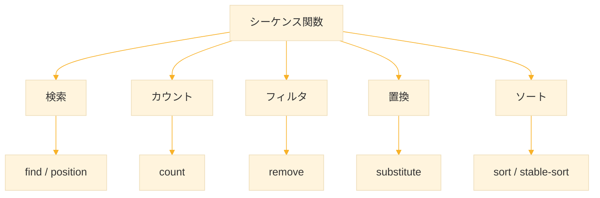
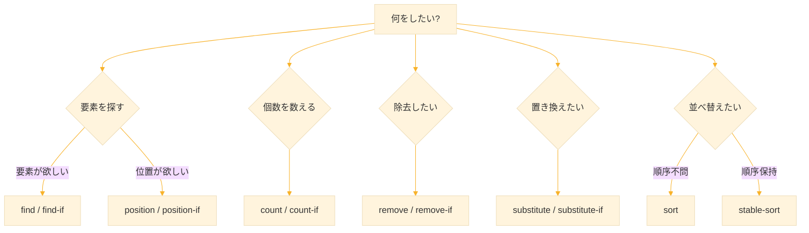

# Level 11 (シーケンス関数)
## 1. シーケンスとは

### 1-1. シーケンスの種類

**シーケンス（sequence）** は、要素が順番に並んだデータ構造の総称である。Common Lisp では、以下の3つがシーケンスに該当する。

| 種類 | 例 | 特徴 |
|------|-----|------|
| リスト | `(1 2 3)` | 可変長、先頭へのアクセスが速い |
| ベクタ | `#(1 2 3)` | 固定長、任意位置へのアクセスが速い |
| 文字列 | `"abc"` | 文字のベクタ |

### 1-2. シーケンス関数の利点

シーケンス関数は、リスト・ベクタ・文字列のすべてに対して同じように使える。データ構造を変えてもコードを変更する必要がない。

```lisp
;; length はすべてのシーケンスに使える
(length '(1 2 3))    ;; → 3
(length #(1 2 3))    ;; → 3
(length "abc")       ;; → 3

;; elt で要素にアクセス
(elt '(a b c) 1)     ;; → B
(elt #(a b c) 1)     ;; → B
(elt "abc" 1)        ;; → #\b
```

### 1-3. 本章で学ぶ関数




### 2. 検索系関数

#### 2-1. find ― 要素を探す

`find` は、シーケンス内で要素を探し、見つかれば **その要素自体** を返す。

```lisp:構文
(find 探す要素 シーケンス &key :test :key :start :end :from-end)
```


```lisp:使用例
(find 3 '(1 2 3 4 5))
;; → 3

(find 9 '(1 2 3 4 5))
;; → NIL（見つからない）

(find #\o "Hello")
;; → #\o
```

#### 2-2. find-if ― 条件で探す

`find-if` は、条件を満たす最初の要素を返す。

```lisp:構文
(find-if 条件関数 シーケンス &key :key :start :end :from-end)
```

```lisp:使用例
;; 最初の偶数を探す
(find-if #'evenp '(1 3 4 5 6))
;; → 4

;; 最初の大文字を探す
(find-if #'upper-case-p "heLLo")
;; → #\L

;; 長さが5以上の最初の単語
(find-if (lambda (w) (>= (length w) 5))
         '("the" "quick" "brown" "fox"))
;; → "quick"
```

#### 2-3. position ― 位置を探す

`position` は、要素が見つかった **位置（インデックス）** を返す。

```lisp:構文
(position 探す要素 シーケンス &key :test :key :start :end :from-end)
```

```lisp:使用例
(position 3 '(1 2 3 4 5))
;; → 2（0始まり）

(position #\o "Hello")
;; → 4

(position 9 '(1 2 3 4 5))
;; → NIL
```

#### 2-4. position-if ― 条件で位置を探す

```lisp:構文
(position-if 条件関数 シーケンス &key :key :start :end :from-end)
```

```lisp:使用例
;; 最初の偶数の位置
(position-if #'evenp '(1 3 4 5 6))
;; → 2

;; 最初のスペースの位置
(position-if (lambda (c) (char= c #\Space)) "Hello World")
;; → 5
```

#### 2-5. find と position の使い分け

| 関数 | 戻り値 | 用途 |
|------|--------|------|
| `find` | 要素自体 | 要素の値を使いたいとき |
| `position` | インデックス | 位置を知りたいとき |

```lisp
;; find：要素を取得して使う
(let ((found (find-if #'evenp '(1 3 4 5))))
  (when found
    (* found 2)))
;; → 8

;; position：位置を使って他の操作をする
(let ((pos (position #\@ "user@example.com")))
  (subseq "user@example.com" 0 pos))
;; → "user"
```


### 3. カウント系関数

#### 3-1. count ― 出現回数を数える

`count` は、指定した要素の出現回数を返す。

```lisp:構文
(count 数える要素 シーケンス &key :test :key :start :end :from-end)
```

```lisp:使用例
(count 3 '(1 3 3 2 3 4))
;; → 3

(count #\l "Hello, World!")
;; → 3

(count 'a '(a b a c a))
;; → 3
```

#### 3-2. count-if ― 条件を満たす要素を数える

```lisp:構文
(count-if 条件関数 シーケンス &key :key :start :end :from-end)
```

```lisp:使用例
;; 偶数の個数
(count-if #'evenp '(1 2 3 4 5 6 7 8))
;; → 4

;; 大文字の個数
(count-if #'upper-case-p "Hello World")
;; → 2

;; 5以上の要素の個数
(count-if (lambda (x) (>= x 5)) '(3 7 2 8 1 9 4))
;; → 3
```

#### 3-3. count-if-not ― 条件を満たさない要素を数える

```lisp:構文
(count-if-not 条件関数 シーケンス &key :key :start :end :from-end)
```

```lisp:使用例
;; 偶数でない（奇数の）個数
(count-if-not #'evenp '(1 2 3 4 5 6 7 8))
;; → 4

;; 空でない文字列の個数
(count-if-not (lambda (s) (string= s ""))
              '("a" "" "b" "" "c"))
;; → 3
```


### 4. フィルタ系関数

#### 4-1. remove ― 要素を除去

`remove` は、指定した要素を除去した **新しいシーケンス** を返す。元のシーケンスは変更されない。

```lisp:構文
(remove 除去する要素 シーケンス &key :test :key :start :end :from-end :count)
```

```lisp:使用例
(remove 3 '(1 2 3 4 3 5))
;; → (1 2 4 5)

(remove #\l "Hello")
;; → "Heo"

;; 元のリストは変わらない
(defparameter *lst* '(1 2 3 4 3 5))
(remove 3 *lst*)
;; → (1 2 4 5)
*lst*
;; → (1 2 3 4 3 5)（変わっていない）
```

#### 4-2. remove-if ― 条件で除去

`remove-if` は、条件を満たす要素を除去する。

```lisp:構文
(remove-if 条件関数 シーケンス &key :key :start :end :from-end :count)
```

```lisp:使用例
;; 偶数を除去
(remove-if #'evenp '(1 2 3 4 5 6))
;; → (1 3 5)

;; 空文字列を除去
(remove-if (lambda (s) (string= s ""))
           '("a" "" "b" "" "c"))
;; → ("a" "b" "c")

;; 負の数を除去
(remove-if #'minusp '(-3 1 -2 4 -5 6))
;; → (1 4 6)
```

#### 4-3. remove-if-not ― 条件を満たさない要素を除去

`remove-if-not` は、条件を満たす要素 **だけを残す**。フィルタリングに使う。

```lisp:構文
(remove-if-not 条件関数 シーケンス &key :key :start :end :from-end :count)
```

```lisp:使用例
;; 偶数だけ残す
(remove-if-not #'evenp '(1 2 3 4 5 6))
;; → (2 4 6)

;; 正の数だけ残す
(remove-if-not #'plusp '(-3 1 -2 4 -5 6))
;; → (1 4 6)

;; 5文字以上の単語だけ残す
(remove-if-not (lambda (w) (>= (length w) 5))
               '("the" "quick" "brown" "fox"))
;; → ("quick" "brown")
```

#### 4-4. remove-duplicates ― 重複を除去

```lisp:構文
(remove-duplicates シーケンス &key :test :key :start :end :from-end)
```

```lisp:使用例
(remove-duplicates '(1 2 2 3 3 3 4))
;; → (1 2 3 4)

(remove-duplicates '(a b a c b d))
;; → (A C B D)（後の方が残る）

;; 文字列の場合
(remove-duplicates "abracadabra")
;; → "cdbra"
```

`:from-end t` を指定すると、前の方が残る。

```lisp
(remove-duplicates '(a b a c b d) :from-end t)
;; → (A B C D)
```


##### 関連関数

| 関数 | 説明 |
|------|------|
| `remove` | 指定した要素を除去 |
| `remove-if` | 条件を満たす要素を除去 |
| `remove-duplicates` | 重複を除去 |
| `delete-duplicates` | 破壊的に重複を除去 |

### 5. 置換系関数

#### 5-1. substitute ― 要素を置換

`substitute` は、指定した要素を別の値に置き換えた **新しいシーケンス** を返す。

```lisp:構文
(substitute 新しい値 古い値 シーケンス &key :test :key :start :end :from-end :count)
```

```lisp:使用例
(substitute 0 3 '(1 2 3 4 3 5))
;; → (1 2 0 4 0 5)（3を0に置換）

(substitute #\X #\l "Hello")
;; → "HeXXo"
```

#### 5-2. substitute-if ― 条件で置換

```lisp:構文
(substitute-if 新しい値 条件関数 シーケンス &key :key :start :end :from-end :count)
```

```lisp:使用例
;; 偶数を0に置換
(substitute-if 0 #'evenp '(1 2 3 4 5 6))
;; → (1 0 3 0 5 0)

;; 負の数を0に置換
(substitute-if 0 #'minusp '(-3 1 -2 4 -5 6))
;; → (0 1 0 4 0 6)
```

#### 5-3. substitute-if-not ― 条件を満たさない要素を置換

```lisp:構文
(substitute-if-not 新しい値 条件関数 シーケンス &key :key :start :end :from-end :count)
```

```lisp:使用例
;; 偶数でない（奇数）を0に置換
(substitute-if-not 0 #'evenp '(1 2 3 4 5 6))
;; → (0 2 0 4 0 6)
```

##### 関連関数

| 関数 | 説明 |
|------|------|
| `substitute` | 指定した要素を置換 |
| `substitute-if` | 条件を満たす要素を置換 |
| `substitute-if-not` | 条件を満たさない要素を置換 |
| `nsubstitute-if-not` | 破壊的に置換 |

### 6. ソート関数

#### 6-1. sort ― 破壊的ソート

`sort` は、シーケンスを **破壊的に** ソートする。元のシーケンスが変更されるため、結果を使うべきである。

```lisp:構文
(sort シーケンス 比較関数 &key :key)
```

```lisp:使用例
;; 昇順ソート
(sort '(3 1 4 1 5 9 2 6) #'<)
;; → (1 1 2 3 4 5 6 9)

;; 降順ソート
(sort '(3 1 4 1 5 9 2 6) #'>)
;; → (9 6 5 4 3 2 1 1)

;; 文字列のソート（アルファベット順）
(sort '("banana" "apple" "cherry") #'string<)
;; → ("apple" "banana" "cherry")
```

**注意** `sort` は元のリストを破壊する。元のデータを保持したい場合は `copy-list` でコピーしてからソートする。

```lisp
(defparameter *data* '(3 1 4 1 5))

;; 元のデータを保持したい場合
(sort (copy-list *data*) #'<)
;; → (1 1 3 4 5)

*data*
;; → (3 1 4 1 5)（変わっていない）
```

#### 6-2. stable-sort ― 安定ソート

`stable-sort` は、同じ値の要素の **相対的な順序を保持** する。stable-sort は元のシーケンスを 破壊的に 変更する。

```lisp:構文
(stable-sort シーケンス 比較関数 &key :key)
```

```lisp:使用例
;; データ：(名前 . スコア)
(defparameter *scores*
  '(("Alice" . 80) ("Bob" . 90) ("Carol" . 80) ("Dave" . 90)))

;; stable-sort：同スコアの順序が保持される
(stable-sort (copy-list *scores*) #'< :key #'cdr)
;; → (("Alice" . 80) ("Carol" . 80) ("Bob" . 90) ("Dave" . 90))
;; Alice と Carol の順序、Bob と Dave の順序が保持される
```

#### 6-3. sort と stable-sort の違い

| 関数 | 同値要素の順序 | 用途 |
|------|--------------|------|
| `sort` | 保証されない | 高速なソートが必要なとき |
| `stable-sort` | 保持される | 順序が重要なとき |


### 7. キーワード引数

シーケンス関数は、動作をカスタマイズするための **キーワード引数** を受け取る。

#### 7-1. :test ― 比較関数の指定

デフォルトは `eql` で比較する。文字列やリストには `:test` を指定する。

```lisp
;; デフォルト（eql）では文字列が見つからない
(find "apple" '("apple" "banana" "cherry"))
;; → NIL

;; :test #'equal で内容を比較
(find "apple" '("apple" "banana" "cherry") :test #'equal)
;; → "apple"

;; 大文字小文字を無視
(find "APPLE" '("apple" "banana") :test #'string-equal)
;; → "apple"

;; remove でも同様
(remove "apple" '("apple" "banana" "apple") :test #'equal)
;; → ("banana")
```

#### 7-2. :key ― 比較対象を変換

要素を比較する前に、`:key` で指定した関数を適用する。

```lisp
;; 絶対値で検索
(find 3 '(1 -2 -3 4) :key #'abs)
;; → -3（abs で変換すると 3 になる）

;; 2番目の要素（年齢）で検索
(find 25 '(("Alice" 25) ("Bob" 30)) :key #'second)
;; → ("Alice" 25)

;; 長さで検索
(find 5 '("the" "quick" "brown") :key #'length)
;; → "quick"（長さが5）
```

#### 7-3. :start と :end ― 範囲の指定

検索・処理する範囲を限定できる。

```lisp
;; 位置2から検索
(find 1 '(1 2 1 3 1 4) :start 2)
;; → 1（位置2以降の最初の1）

(position 1 '(1 2 1 3 1 4) :start 2)
;; → 2

;; 位置0〜3の範囲で検索
(count 1 '(1 2 1 3 1 4) :start 0 :end 4)
;; → 2（位置0〜3に1が2個）
```

#### 7-4. :from-end ― 末尾から検索

```lisp
;; 最後の3の位置
(position 3 '(3 1 3 2 3 4) :from-end t)
;; → 4

;; 最後の偶数
(find-if #'evenp '(1 2 3 4 5 6) :from-end t)
;; → 6
```

#### 7-5. :count ― 処理する個数を制限

```lisp
;; 最初の2つだけ除去
(remove 3 '(3 1 3 2 3 4) :count 2)
;; → (1 2 3 4)

;; 末尾から2つだけ除去
(remove 3 '(3 1 3 2 3 4) :count 2 :from-end t)
;; → (3 1 2 4)
```

#### 7-6. キーワード引数のまとめ

| 引数 | 説明 | デフォルト |
|------|------|-----------|
| `:test` | 比較関数 | `#'eql` |
| `:key` | 要素を変換する関数 | `#'identity` |
| `:start` | 開始位置 | `0` |
| `:end` | 終了位置 | `nil`（末尾） |
| `:from-end` | 末尾から処理 | `nil` |
| `:count` | 処理する個数 | `nil`（全部） |


### 8. その他の便利な関数

#### 8-1. reverse ― 逆順


```lisp:構文
(reverse シーケンス)
```

```lisp:使用例
(reverse '(1 2 3 4 5))
;; → (5 4 3 2 1)

(reverse "Hello")
;; → "olleH"
```

reverse は元のシーケンスを変更せず、新しいシーケンスを返す。

| 非破壊的 | 破壊的 |
|----------|--------|
| `reverse` | `nreverse` |


#### 8-2. concatenate ― 結合

```lisp:構文
(concatenate 結果の型 シーケンス1 シーケンス2 ...)
```

```lisp:使用例
;; リストの結合
(concatenate 'list '(1 2) '(3 4) '(5 6))
;; → (1 2 3 4 5 6)

;; ベクタの結合
(concatenate 'vector #(1 2) #(3 4))
;; → #(1 2 3 4)

;; 文字列の結合
(concatenate 'string "Hello" ", " "World!")
;; → "Hello, World!"
```

#### 8-3. subseq ― 部分シーケンス

subseq は元のシーケンスを変更せず、新しいシーケンスを返す。開始位置は 含み、終了位置は 含まない。

```lisp:構文
(subseq シーケンス 開始位置 [終了位置])
```

```lisp:使用例
(subseq '(a b c d e) 1 4)
;; → (B C D)

(subseq "Hello, World!" 0 5)
;; → "Hello"
```

#### 8-4. copy-seq ― コピー

シーケンスのコピーを作成する関数。破壊的関数（sort, nreverse など）の前に使う。シャローコピー（浅いコピー）のため、ネストした要素は共有される。

```lisp:構文
(copy-seq シーケンス)
```

```lisp:使用例
(defparameter *original* '(1 2 3))
(defparameter *copy* (copy-seq *original*))

(setf (first *copy*) 99)
*copy*
;; → (99 2 3)
*original*
;; → (1 2 3)（変わっていない）
```

#### 8-5. fill ― 埋める

fill リテラルには使用できず、は元のシーケンスを 破壊的に 変更する。

```lisp:構文
(fill シーケンス 値 &key :start :end)
```

```lisp:使用例
;; すべての要素を同じ値で埋める
(fill (list 1 2 3 4 5) 0)
;; → (0 0 0 0 0)

;; 範囲を指定
(fill (list 1 2 3 4 5) 0 :start 1 :end 4)
;; → (1 0 0 0 5)

;; リテラルは変更できない（エラー）
(fill '(1 2 3 4 5) 0)
;; → エラー
```

#### 8-6. reduce ― 畳み込み

```lisp:構文
(reduce 関数 シーケンス &key :key :start :end :initial-value :from-end)
```

```lisp:使用例
;; 合計
(reduce #'+ '(1 2 3 4 5))
;; → 15

;; 最大値
(reduce #'max '(3 1 4 1 5 9 2 6))
;; → 9

;; 初期値を指定
(reduce #'+ '() :initial-value 0)
;; → 0

;; 文字列の結合
(reduce (lambda (a b) (concatenate 'string a b))
        '("a" "b" "c"))
;; → "abc"

;; 平均値
(defun average (lst)
  (if (null lst)
      0
      (/ (reduce #'+ lst)
         (float (length lst)))))

(average '(1 2 3 4 5))
;; → 3.0

;; リストの平坦化
(defun flatten-one-level (lists)
  (reduce #'append lists :initial-value nil))

(flatten-one-level '((1 2) (3 4) (5 6)))
;; → (1 2 3 4 5 6)

;; 最も長い文字列
(defun longest-string (strings)
  (reduce (lambda (a b)
            (if (> (length a) (length b)) a b))
          strings))

(longest-string '("apple" "banana" "fig"))
;; → "banana"

;; 連想リストから値を取得して合計
(defparameter *scores* '(("Alice" . 85) ("Bob" . 90) ("Carol" . 78)))

(reduce #'+ *scores* :key #'cdr)
;; → 253
```


### 9. 実践例

#### 9-1. データのフィルタリングと集計

```lisp
;; 商品データ：(名前 価格 カテゴリ)
(defparameter *products*
  '(("Apple" 100 :fruit)
    ("Notebook" 500 :stationery)
    ("Banana" 80 :fruit)
    ("Pen" 150 :stationery)
    ("Orange" 120 :fruit)))

;; フルーツだけ抽出
(remove-if-not (lambda (p) (eq (third p) :fruit)) *products*)
;; → (("Apple" 100 :FRUIT) ("Banana" 80 :FRUIT) ("Orange" 120 :FRUIT))

;; 価格の合計
(reduce #'+ *products* :key #'second)
;; → 950

;; 最も高い商品
(reduce (lambda (a b) (if (> (second a) (second b)) a b))
        *products*)
;; → ("Notebook" 500 :STATIONERY)

;; 価格順にソート
(stable-sort (copy-list *products*) #'< :key #'second)
;; → (("Banana" 80 :FRUIT) ("Apple" 100 :FRUIT) ...)
```

#### 9-2. テキスト処理

```lisp
;; 文字の頻度を数える
(defun char-frequency (str)
  (let ((chars (remove-duplicates (coerce str 'list)))) ; 文字列→リスト、重複除去
    (mapcar (lambda (c) (cons c (count c str)))         ; 各文字と出現回数のペアを作成
            chars)))

(char-frequency "hello")
;; → ((#\h . 1) (#\e . 1) (#\l . 2) (#\o . 1))

;; 最も多い文字を見つける
(defun most-frequent-char (str)
  (let ((freq (char-frequency str)))                   ; 頻度リストを取得
    (car (reduce (lambda (a b)                         ; 最大のペアを探す
                   (if (> (cdr a) (cdr b)) a b))       ; 出現回数(cdr)を比較
                 freq))))                              ; 結果のcarで文字を返す

(most-frequent-char "abracadabra")
;; → #\a
```

#### 9-3. リストの重複チェック

```lisp
;; 重複があるか判定
(defun has-duplicates-p (lst)
  (/= (length lst)
      (length (remove-duplicates lst :test #'equal))))

(has-duplicates-p '(1 2 3 4 5))
;; → NIL

(has-duplicates-p '(1 2 3 2 5))
;; → T
```

#### 9-4. 成績処理

```lisp
;; 学生データ：(名前 点数)
(defparameter *students*
  '(("Alice" 85) ("Bob" 72) ("Carol" 91) 
    ("Dave" 68) ("Eve" 78)))

;; 合格者（70点以上）を抽出
(remove-if-not (lambda (s) (>= (second s) 70)) *students*)
;; → (("Alice" 85) ("Bob" 72) ("Carol" 91) ("Eve" 78))

;; 点数でソート（降順）
(stable-sort (copy-list *students*) #'> :key #'second)
;; → (("Carol" 91) ("Alice" 85) ("Eve" 78) ("Bob" 72) ("Dave" 68))

;; 平均点
(let ((scores (mapcar #'second *students*)))
  (/ (reduce #'+ scores) (float (length scores))))
;; → 78.8
```


### 10. 練習課題

#### 課題1：偶数を抽出

リストから偶数だけを抽出する関数を作れ。

```lisp
(extract-evens '(1 2 3 4 5 6 7 8))
;; → (2 4 6 8)
```

**解答**

```lisp
(defun extract-evens (lst)
  (remove-if-not #'evenp lst))

(extract-evens '(1 2 3 4 5 6 7 8))
;; → (2 4 6 8)
```


#### 課題2：最大値のインデックス

リストの最大値の位置を返す関数を作れ。

```lisp
(max-index '(3 1 4 1 5 9 2 6))
;; → 5（9の位置）
```

**解答**

```lisp
(defun max-index (lst)
  (position (reduce #'max lst) lst))

(max-index '(3 1 4 1 5 9 2 6))
;; → 5
```


#### 課題3：要素の置き換え

リスト内の nil をすべて 0 に置き換える関数を作れ。

```lisp
(replace-nil '(1 nil 3 nil 5))
;; → (1 0 3 0 5)
```

**解答**

```lisp
(defun replace-nil (lst)
  (substitute 0 nil lst))

(replace-nil '(1 nil 3 nil 5))
;; → (1 0 3 0 5)
```


#### 課題4：上位N件を取得

リストをソートして上位N件を返す関数を作れ。

```lisp
(top-n 3 '(3 1 4 1 5 9 2 6))
;; → (9 6 5)
```

**解答**

```lisp
(defun top-n (n lst)
  (subseq (sort (copy-list lst) #'>) 0 n))

(top-n 3 '(3 1 4 1 5 9 2 6))
;; → (9 6 5)
```


#### 課題5：文字列内の数字を数える

文字列内の数字の個数を数える関数を作れ。

```lisp
(count-digits "abc123def456")
;; → 6
```

**解答**

```lisp
(defun count-digits (str)
  (count-if #'digit-char-p str))

(count-digits "abc123def456")
;; → 6
```


#### 課題6：キーでグループ化

リストを指定したキーでグループ化する関数を作れ。

```lisp
(group-by #'evenp '(1 2 3 4 5 6))
;; → ((NIL 1 3 5) (T 2 4 6))
```

**解答**

```lisp
(defun group-by (key-fn lst)
  (let ((keys (remove-duplicates (mapcar key-fn lst))))
    (mapcar (lambda (k)
              (cons k (remove-if-not (lambda (x) (eql (funcall key-fn x) k))
                                     lst)))
            keys)))

(group-by #'evenp '(1 2 3 4 5 6))
;; → ((NIL 1 3 5) (T 2 4 6))
```


### 11. まとめ

#### シーケンス関数一覧

| カテゴリ | 関数 | 説明 |
|----------|------|------|
| 検索 | `find`, `find-if` | 要素を探す |
| 検索 | `position`, `position-if` | 位置を探す |
| カウント | `count`, `count-if` | 個数を数える |
| フィルタ | `remove`, `remove-if` | 要素を除去 |
| フィルタ | `remove-duplicates` | 重複を除去 |
| 置換 | `substitute`, `substitute-if` | 要素を置き換え |
| ソート | `sort`, `stable-sort` | 並べ替え |
| その他 | `reverse`, `concatenate`, `subseq` | 操作 |

#### キーワード引数

| 引数 | 用途 |
|------|------|
| `:test` | 比較関数を変更 |
| `:key` | 比較前に変換 |
| `:start` / `:end` | 範囲を限定 |
| `:from-end` | 末尾から処理 |
| `:count` | 処理個数を制限 |

#### 関数選択のフローチャート



