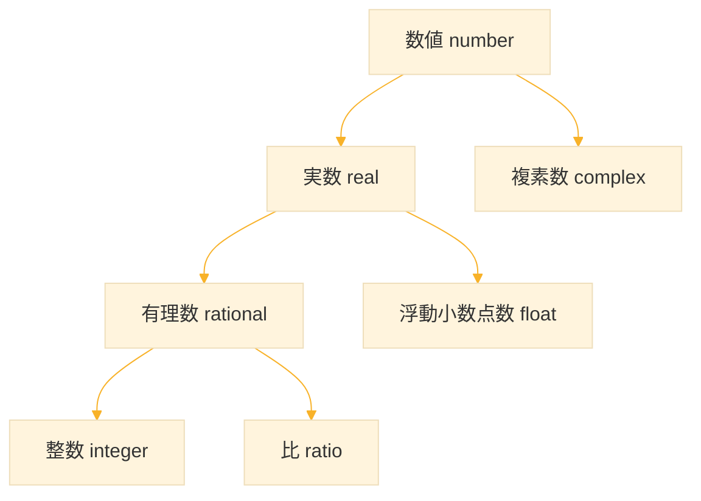
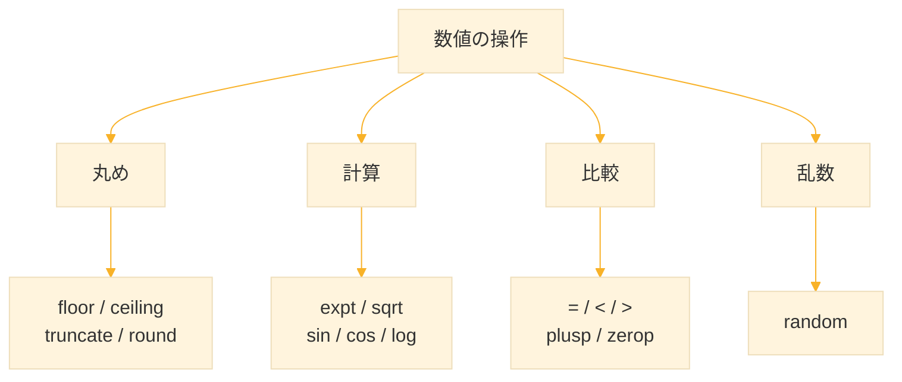

# Level 12 (数値と数学)
## 1. 数値の型

### 1-1. Common Lisp の数値型

Common Lisp は豊富な数値型を持つ。多くの言語では整数と浮動小数点数だけだが、Common Lisp は **有理数** や **複素数** もネイティブにサポートする。



### 1-2. 整数（integer）

整数は **任意精度** をサポートする。メモリが許す限り大きな数を扱える。

```lisp
;; 通常の整数
42
-17
0

;; 大きな整数も問題なし
(expt 2 100)  ; 2の100乗を計算
;; → 1267650600228229401496703205376

;; 整数の判定
(integerp 42)      ;; → T
(integerp 3.14)    ;; → NIL
```

### 1-3. 比（ratio）

**分数を正確に表現** できる。計算で誤差が生じない。

```lisp
;; 分数の表現
1/3                ;; → 1/3（0.333...ではない）
2/4                ;; → 1/2（自動的に約分される）

;; 分数の計算
(+ 1/3 1/6)        ;; → 1/2
(* 2/3 3/4)        ;; → 1/2

;; 比の判定
(ratiop 1/3)       ;; → T
(ratiop 2)         ;; → NIL（整数）
```

### 1-4. 浮動小数点数（float）

小数点を含む数。精度によって種類がある。

```lisp
;; 浮動小数点数
3.14
-2.5
1.0e10            ; 科学的記法（1.0 × 10^10）

;; 浮動小数点数の判定
(floatp 3.14)     ;; → T
(floatp 3)        ;; → NIL
```

**浮動小数点数の種類**

| 型 | 精度 | 例 |
|-----|------|-----|
| `short-float` | 最低精度 | `1.0s0` |
| `single-float` | 単精度 | `1.0f0` または `1.0` |
| `double-float` | 倍精度 | `1.0d0` |
| `long-float` | 最高精度 | `1.0l0` |

```lisp
;; 精度の指定
1.0f0             ; 単精度
1.0d0             ; 倍精度

;; 倍精度での計算
(* pi 2.0d0)      ;; → 6.283185307179586d0
```

### 1-5. 複素数（complex）

実数だけでは表せない数を扱うために、虚数単位 i（i² = -1）を導入した数。 実部と虚部からなり、a + bi の形で表す。√-1 のような計算や、電気工学・物理学で使われる。


```lisp
;; 複素数の表現
##C(3 4)           ; 3 + 4i
##C(1.0 2.0)       ; 1.0 + 2.0i

;; 複素数の作成
(complex 3 4)     ;; → #C(3 4)

;; 実部と虚部の取得
(realpart #C(3 4))  ;; → 3
(imagpart #C(3 4))  ;; → 4

;; 複素数の計算
(+ #C(1 2) #C(3 4))  ;; → #C(4 6)
(* #C(0 1) #C(0 1))  ;; → -1（i × i = -1）

;; 複素数の判定
(complexp #C(3 4))   ;; → T
```


## 2. 型の変換と判定

### 2-1. 型変換関数

```lisp
;; 浮動小数点数へ変換
(float 3)         ;; → 3.0
(float 1/3)       ;; → 0.33333334

;; 有理数へ変換
(rational 0.5)    ;; → 1/2
(rationalize 0.5) ;; → 1/2

;; 整数部分を取得（切り捨て）
(truncate 3.7)    ;; → 3, 0.7（2つの値を返す）
(truncate -3.7)   ;; → -3, -0.7
```

### 2-2. 型判定関数

| 関数 | 判定内容 |
|------|----------|
| `numberp` | 数値か |
| `realp` | 実数か |
| `rationalp` | 有理数か |
| `integerp` | 整数か |
| `floatp` | 浮動小数点数か |
| `complexp` | 複素数か |

```lisp
(numberp 42)      ;; → T
(numberp "42")    ;; → NIL

(realp 3.14)      ;; → T
(realp #C(1 2))   ;; → NIL

(rationalp 1/3)   ;; → T
(rationalp 3)     ;; → T（整数も有理数）
```


## 3. 基本的な算術演算

### 3-1. 四則演算

```lisp
(+ 1 2 3)         ;; → 6（加算、複数可）
(- 10 3)          ;; → 7（減算）
(- 5)             ;; → -5（符号反転）
(* 2 3 4)         ;; → 24（乗算、複数可）
(/ 10 3)          ;; → 10/3（除算、分数になる）
(/ 10.0 3)        ;; → 3.3333333（浮動小数点）
```

### 3-2. 整数除算

```lisp
;; 商と余りを同時に取得
(floor 10 3)      ;; → 3, 1（商と余り）
(truncate 10 3)   ;; → 3, 1

;; 余りだけ取得
(mod 10 3)        ;; → 1
(rem 10 3)        ;; → 1

;; mod と rem の違い（負の数の場合）
(mod -10 3)       ;; → 2（除数と同じ符号）
(rem -10 3)       ;; → -1（被除数と同じ符号）
```

### 3-3. 増減

```lisp
;; 1増やす
(1+ 5)            ;; → 6
(incf x)          ; x を1増やす（破壊的）

;; 1減らす
(1- 5)            ;; → 4
(decf x)          ; x を1減らす（破壊的）

;; 任意の値で増減
(incf x 10)       ; x を10増やす
(decf x 5)        ; x を5減らす
```


## 4. 丸め関数

### 4-1. 4つの丸め関数

| 関数 | 丸め方向 | 例（3.7） | 例（-3.7） |
|------|----------|----------|-----------|
| `floor` | 負の無限大方向 | 3 | -4 |
| `ceiling` | 正の無限大方向 | 4 | -3 |
| `truncate` | ゼロ方向 | 3 | -3 |
| `round` | 偶数丸め | 4 | -4 |

```lisp
;; floor：負の無限大方向へ丸める
(floor 3.7)       ;; → 3, 0.7
(floor -3.7)      ;; → -4, 0.3

;; ceiling：正の無限大方向へ丸める
(ceiling 3.2)     ;; → 4, -0.8
(ceiling -3.2)    ;; → -3, -0.2

;; truncate：ゼロ方向へ丸める（切り捨て）
(truncate 3.7)    ;; → 3, 0.7
(truncate -3.7)   ;; → -3, -0.7

;; round：最も近い偶数へ丸める（銀行丸め）
(round 0.5)   ;; → 0, 0.5
(round 1.5)   ;; → 2, -0.5
(round 2.5)   ;; → 2, 0.5
(round 3.5)   ;; → 4, -0.5
(round 4.5)   ;; → 4, 0.5

;; 0.5 以外は通常通り最も近い整数へ
(round 1.4)   ;; → 1, 0.4
(round 1.6)   ;; → 2, -0.39999998
```

### 4-2. 2つの値を返す

丸め関数は **2つの値** を返す。商と余りである。

```lisp
;; 1つ目の値だけ使う
(floor 10 3)      ;; → 3, 1

;; multiple-value-bind で両方受け取る
(multiple-value-bind (q r) (floor 10 3)
  (format t "商: ~A, 余り: ~A~%" q r))
;; → 商: 3, 余り: 1
```


## 5. 比較関数

### 5-1. 数値の比較

```lisp
;; 等しい
(= 3 3)           ;; → T
(= 3 3.0)         ;; → T（型が違っても値が同じならT）
(= 1 1 1 1)       ;; → T（複数可）

;; 等しくない
(/= 3 4)          ;; → T
(/= 1 2 3)        ;; → T（すべて異なる）
(/= 1 2 1)        ;; → NIL（1が重複）

;; 大小比較
(< 1 2 3)         ;; → T（昇順）
(> 3 2 1)         ;; → T（降順）
(<= 1 2 2 3)      ;; → T（昇順、等しいも可）
(>= 3 2 2 1)      ;; → T（降順、等しいも可）
```

### 5-2. 符号の判定

```lisp
;; 正・負・ゼロの判定
(plusp 5)         ;; → T（正）
(minusp -3)       ;; → T（負）
(zerop 0)         ;; → T（ゼロ）

;; 偶数・奇数の判定
(evenp 4)         ;; → T（偶数）
(oddp 3)          ;; → T（奇数）
```


## 6. 数学関数

### 6-1. 基本的な数学関数

```lisp
;; 絶対値
(abs -5)          ;; → 5
(abs #C(3 4))     ;; → 5.0（複素数の絶対値）

;; 符号
(signum 10)       ;; → 1
(signum -10)      ;; → -1
(signum 0)        ;; → 0

;; 最大・最小
(max 1 5 3 2)     ;; → 5
(min 1 5 3 2)     ;; → 1

;; 最大公約数・最小公倍数
(gcd 12 18)       ;; → 6
(lcm 4 6)         ;; → 12
```

### 6-2. べき乗と平方根

```lisp
;; べき乗
(expt 2 10)       ;; → 1024（2^10）
(expt 2 0.5)      ;; → 1.4142135（2^0.5 = √2）

;; 平方根
(sqrt 16)         ;; → 4.0
(sqrt 2)          ;; → 1.4142135
(sqrt -1)         ;; → #C(0.0 1.0)（虚数）

;; n乗根
(expt 8 1/3)      ;; → 2.0（3乗根）

;; 自然対数の底 e のべき乗
(exp 1)           ;; → 2.7182817（e^1）
(exp 2)           ;; → 7.389056（e^2）
```

### 6-3. 対数関数

```lisp
;; 自然対数（底がe）
(log 10)          ;; → 2.302585

;; 任意の底の対数
(log 100 10)      ;; → 2.0（log10(100)）
(log 8 2)         ;; → 3.0（log2(8)）

;; 常用対数（底が10）の計算
(/ (log 1000) (log 10))  ;; → 3.0
```

### 6-4. 三角関数

```lisp
;; 角度はラジアン
(sin 0)           ;; → 0.0
(cos 0)           ;; → 1.0
(tan 0)           ;; → 0.0

;; πを使う
(sin (/ pi 2))    ;; → 1.0（sin 90°）
(cos pi)          ;; → -1.0（cos 180°）

;; 逆三角関数
(asin 1)          ;; → 1.5707964（π/2）
(acos 0)          ;; → 1.5707964（π/2）
(atan 1)          ;; → 0.7853982（π/4）

;; atan2（2引数版）
(atan 1 1)        ;; → 0.7853982（π/4、45°）
```

### 6-5. 双曲線関数

```lisp
(sinh 0)          ;; → 0.0
(cosh 0)          ;; → 1.0
(tanh 0)          ;; → 0.0

;; 逆双曲線関数
(asinh 0)         ;; → 0.0
(acosh 1)         ;; → 0.0
(atanh 0)         ;; → 0.0
```


## 7. 乱数

### 7-1. random 関数

```lisp
;; 0以上n未満の乱数
(random 100)      ;; → 0〜99のランダムな整数
(random 1.0)      ;; → 0.0〜1.0未満のランダムな浮動小数点数

;; 範囲を指定した乱数
(+ 10 (random 11))     ; 10〜20のランダムな整数
(+ 1.0 (random 9.0))   ; 1.0〜10.0未満のランダムな浮動小数点数
```

### 7-2. 乱数の種（シード）

再現可能な乱数列を生成したい場合、`*random-state*` を使う。

```lisp
;; 現在の乱数状態
*random-state*

;; 乱数状態を保存
(defparameter *saved-state* (make-random-state *random-state*))

;; 保存した状態から乱数を生成（再現可能）
(random 100 *saved-state*)

;; 新しい乱数状態を作成
(make-random-state t)   ; 本当にランダムな新しい状態
```

### 7-3. 乱数のユーティリティ

```lisp
;; min〜maxの範囲の整数乱数
(defun random-range (min max)
  (+ min (random (1+ (- max min)))))  ; min〜maxの乱数を生成

(random-range 1 6)       ;; → 1〜6（サイコロ）

;; リストからランダムに選ぶ
(defun random-choice (lst)
  (nth (random (length lst)) lst))    ; ランダムな位置の要素を返す

(random-choice '(a b c d e))
;; → ランダムに選ばれた要素

;; リストをシャッフル（Fisher-Yates法）
(defun shuffle (lst)
  (let ((vec (coerce lst 'vector)))   ; リストをベクタに変換
    (loop for i from (1- (length vec)) downto 1
          do (rotatef (aref vec i)    ; i番目と
                      (aref vec (random (1+ i))))) ; 0〜i番目をスワップ
    (coerce vec 'list)))              ; リストに戻す

(shuffle '(1 2 3 4 5))
;; → ランダムな順序
```


## 8. ビット演算

### 8-1. ビット演算関数

```lisp
;; ビットAND
(logand #b1100 #b1010)  ;; → 8（#b1000）

;; ビットOR
(logior #b1100 #b1010)  ;; → 14（#b1110）

;; ビットXOR
(logxor #b1100 #b1010)  ;; → 6（#b0110）

;; ビットNOT
(lognot 0)              ;; → -1

;; ビットシフト
(ash 1 4)               ;; → 16（左に4ビットシフト）
(ash 16 -2)             ;; → 4（右に2ビットシフト）
```

### 8-2. ビット操作関数

```lisp
;; 特定のビットを調べる（0始まり）
(logbitp 0 5)           ;; → T（5 = #b101、0ビット目は1）
(logbitp 1 5)           ;; → NIL（1ビット目は0）

;; 立っているビット数を数える
(logcount 7)            ;; → 3（#b111）
(logcount 255)          ;; → 8

;; 整数の2進数表現
(format nil "~B" 42)    ;; → "101010"
```


## 9. 数値の表記

### 9-1. 異なる基数での表記

```lisp
;; 2進数（#b）
##b1010                  ;; → 10

;; 8進数（#o）
##o17                    ;; → 15

;; 16進数（#x）
##xFF                    ;; → 255
##x1A2B                  ;; → 6699

;; 任意の基数（#nR）
##3R102                  ;; → 11（3進数の102）
##36Rz                   ;; → 35（36進数のz）
```

### 9-2. 数値の出力フォーマット

```lisp
;; 10進数
(format nil "~D" 42)    ;; → "42"

;; 2進数
(format nil "~B" 42)    ;; → "101010"

;; 8進数
(format nil "~O" 42)    ;; → "52"

;; 16進数
(format nil "~X" 42)    ;; → "2A"

;; 浮動小数点数（固定小数点）
(format nil "~,2F" 3.14159)  ;; → "3.14"

;; 浮動小数点数（科学的記法）
(format nil "~E" 12345.6)    ;; → "1.23456E+4"

;; 桁区切り
(format nil "~:D" 1234567)   ;; → "1,234,567"
```


## 10. 実践例

### 10-1. 統計関数

```lisp
;; 合計
(defun sum (lst)
  (reduce #'+ lst :initial-value 0))  ; 空リストでも0を返す

;; 平均
(defun mean (lst)
  (if (null lst)
      0
      (/ (sum lst) (float (length lst)))))  ; 合計÷個数

;; 分散
(defun variance (lst)
  (let ((avg (mean lst)))                   ; 平均を計算
    (mean (mapcar (lambda (x)               ; 各値と平均の差の
                    (expt (- x avg) 2))     ; 2乗の平均
                  lst))))

;; 標準偏差
(defun standard-deviation (lst)
  (sqrt (variance lst)))                    ; 分散の平方根

;; 使用例
(defparameter *data* '(2 4 4 4 5 5 7 9))
(mean *data*)               ;; → 5.0
(variance *data*)           ;; → 4.0
(standard-deviation *data*) ;; → 2.0
```

### 10-2. 数学的計算

```lisp
;; 階乗
(defun factorial (n)
  (if (<= n 1)
      1
      (* n (factorial (1- n)))))  ; n × (n-1)!

(factorial 10)              ;; → 3628800

;; フィボナッチ数列
(defun fibonacci (n)
  (if (< n 2)
      n
      (+ (fibonacci (- n 1))      ; fib(n) = fib(n-1) + fib(n-2)
         (fibonacci (- n 2)))))

(fibonacci 10)              ;; → 55

;; 効率的なフィボナッチ（ループ版）
(defun fibonacci-fast (n)
  (loop repeat n                  ; n回繰り返す
        for a = 0 then b          ; a は前の b
        and b = 1 then (+ a b)    ; b は a + b
        finally (return a)))

(fibonacci-fast 50)         ;; → 12586269025

;; 素数判定
(defun primep (n)
  (and (> n 1)                    ; 1以下は素数でない
       (loop for i from 2 to (isqrt n)  ; 2から√nまで
             never (zerop (mod n i))))) ; 割り切れないことを確認

(primep 17)                 ;; → T
(primep 18)                 ;; → NIL

;; n以下の素数を列挙
(defun primes-up-to (n)
  (loop for i from 2 to n         ; 2からnまで
        when (primep i)           ; 素数なら
        collect i))               ; 収集

(primes-up-to 30)
;; → (2 3 5 7 11 13 17 19 23 29)
```

### 10-3. 金融計算

```lisp
;; 複利計算
(defun compound-interest (principal rate years)
  (* principal (expt (1+ rate) years)))  ; 元本 × (1+利率)^年数

(compound-interest 1000000 0.05 10)
;; → 1628894.6（100万円を年利5%で10年運用）

;; ローン返済額（毎月）
(defun monthly-payment (principal annual-rate years)
  (let* ((monthly-rate (/ annual-rate 12))  ; 月利
         (n (* years 12))                    ; 支払い回数
         (factor (expt (1+ monthly-rate) n)))
    (* principal                             ; 元本 ×
       (/ (* monthly-rate factor)            ; 月利×(1+月利)^n ÷
          (1- factor)))))                    ; (1+月利)^n - 1

(monthly-payment 30000000 0.02 35)
;; → 約99378（3000万円、年利2%、35年ローン）
```

### 10-4. 幾何学計算

```lisp
;; 2点間の距離
(defun distance (x1 y1 x2 y2)
  (sqrt (+ (expt (- x2 x1) 2)     ; (x2-x1)^2 +
           (expt (- y2 y1) 2))))  ; (y2-y1)^2 の平方根

(distance 0 0 3 4)          ;; → 5.0

;; 円の面積
(defun circle-area (radius)
  (* pi (expt radius 2)))         ; π × r^2

(circle-area 5)             ;; → 78.53982

;; 三角形の面積（ヘロンの公式）
(defun triangle-area (a b c)
  (let ((s (/ (+ a b c) 2)))      ; 半周長
    (sqrt (* s (- s a)            ; √(s(s-a)(s-b)(s-c))
             (- s b) 
             (- s c)))))

(triangle-area 3 4 5)       ;; → 6.0

;; 度からラジアンへ
(defun deg-to-rad (deg)
  (* deg (/ pi 180)))             ; 度 × π/180

;; ラジアンから度へ
(defun rad-to-deg (rad)
  (* rad (/ 180 pi)))             ; ラジアン × 180/π

(rad-to-deg (/ pi 4))       ;; → 45.0
```


## 11. 練習課題

### 課題1：絶対値の合計

リスト内の数値の絶対値の合計を求める関数を作れ。

```lisp
(sum-abs '(-3 1 -4 1 -5))
;; → 14
```

**解答**

```lisp
(defun sum-abs (lst)
  (reduce #'+ lst :key #'abs :initial-value 0))  ; 絶対値の合計

(sum-abs '(-3 1 -4 1 -5))
;; → 14
```


### 課題2：四捨五入（小数点以下n桁）

小数点以下n桁で四捨五入する関数を作れ。

```lisp
(round-to 3.14159 2)
;; → 3.14
```

**解答**

```lisp
(defun round-to (num digits)
  (let ((factor (expt 10 digits)))     ; 10^digits
    (/ (round (* num factor))          ; num×factor を丸めて
       (float factor))))               ; factor で割る

(round-to 3.14159 2)
;; → 3.14
```


### 課題3：最大公約数（複数引数）

任意個の整数の最大公約数を求める関数を作れ。

```lisp
(gcd-multiple 12 18 24)
;; → 6
```

**解答**

```lisp
(defun gcd-multiple (&rest nums)
  (reduce #'gcd nums))                 ; 順番にgcdを適用

(gcd-multiple 12 18 24)
;; → 6
```


### 課題4：二次方程式の解

二次方程式 ax² + bx + c = 0 の解を求める関数を作れ。

```lisp
(quadratic 1 -5 6)
;; → (3.0 2.0)
```

**解答**

```lisp
(defun quadratic (a b c)
  (let ((d (- (* b b) (* 4 a c))))     ; 判別式 b^2 - 4ac
    (cond
      ((> d 0)                          ; 2つの実数解
       (list (/ (+ (- b) (sqrt d)) (* 2 a))
             (/ (- (- b) (sqrt d)) (* 2 a))))
      ((= d 0)                          ; 重解
       (list (/ (- b) (* 2 a))))
      (t                                ; 複素数解
       (let ((real-part (/ (- b) (* 2 a)))
             (imag-part (/ (sqrt (- d)) (* 2 a))))
         (list (complex real-part imag-part)
               (complex real-part (- imag-part))))))))

(quadratic 1 -5 6)
;; → (3.0 2.0)

(quadratic 1 2 5)
;; → (#C(-1.0 2.0) #C(-1.0 -2.0))
```


### 課題5：数字の各桁の合計

整数の各桁の数字の合計を求める関数を作れ。

```lisp
(digit-sum 12345)
;; → 15
```

**解答**

```lisp
(defun digit-sum (n)
  (loop for c across (format nil "~D" (abs n))  ; 各桁を文字として取得
        sum (digit-char-p c)))                   ; 数値に変換して合計

(digit-sum 12345)
;; → 15
```


### 課題6：中央値

リストの中央値を求める関数を作れ。

```lisp
(median '(3 1 4 1 5 9 2 6))
;; → 3.5
```

**解答**

```lisp
(defun median (lst)
  (let* ((sorted (sort (copy-list lst) #'<))  ; ソート
         (len (length sorted))
         (mid (floor len 2)))                  ; 中央位置
    (if (oddp len)
        (nth mid sorted)                       ; 奇数個：中央の要素
        (/ (+ (nth (1- mid) sorted)           ; 偶数個：中央2つの平均
              (nth mid sorted))
           2.0))))

(median '(3 1 4 1 5 9 2 6))
;; → 3.5
```


## 12. まとめ

### 数値型

| 型 | 説明 | 例 |
|----|------|-----|
| 整数 | 任意精度 | `42`, `-17` |
| 比 | 正確な分数 | `1/3`, `2/5` |
| 浮動小数点数 | 小数 | `3.14`, `1.0d0` |
| 複素数 | 実部+虚部 | `#C(3 4)` |

### 丸め関数

| 関数 | 方向 |
|------|------|
| `floor` | 負の無限大方向 |
| `ceiling` | 正の無限大方向 |
| `truncate` | ゼロ方向 |
| `round` | 偶数丸め |

### 主要な数学関数

| カテゴリ | 関数 |
|----------|------|
| 基本 | `abs`, `signum`, `max`, `min`, `gcd`, `lcm` |
| べき乗・根 | `expt`, `sqrt`, `exp`, `log` |
| 三角関数 | `sin`, `cos`, `tan`, `asin`, `acos`, `atan` |
| 乱数 | `random` |

### 数値関数の選択



