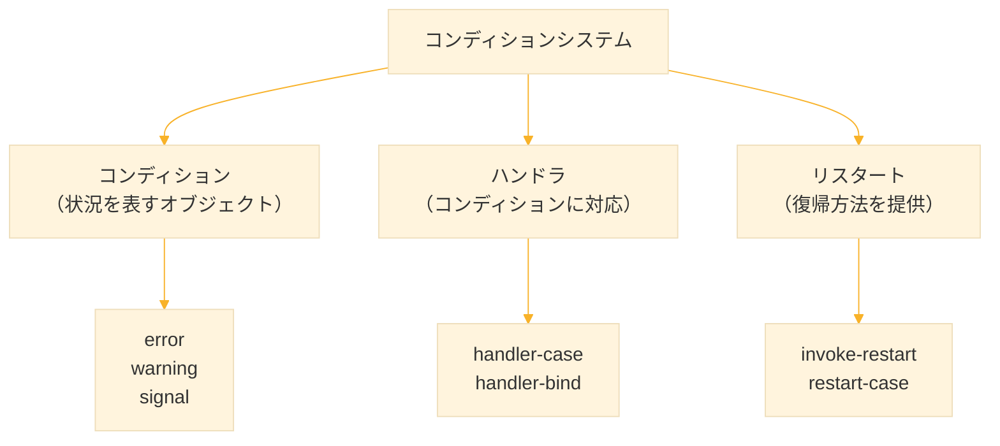
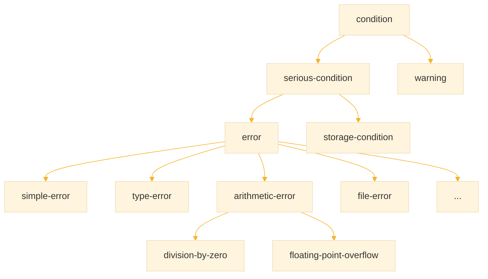
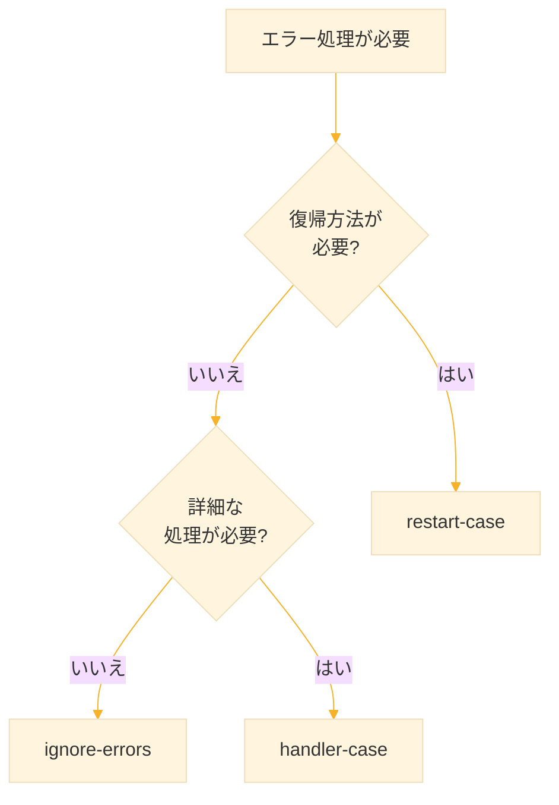

# Level 13 (エラー処理)
## 1. エラー処理の重要性

### 1-1. なぜエラー処理が必要か

プログラムは予期しない状況に遭遇する。ファイルが存在しない、ネットワークが切断される、不正な入力を受け取るなど。エラー処理を適切に行わないと、プログラムは突然クラッシュしてしまう。

Common Lisp は **コンディションシステム** という強力なエラー処理機構を持つ。これは単なる例外処理を超え、エラーからの **復帰** も可能にする。

### 1-2. コンディションシステムの構成




## 2. 基本的なエラー

### 2-1. エラーの発生

```lisp
;; ゼロ除算
(/ 1 0)
;; → エラー: division by zero

;; 存在しない関数
(undefined-function)
;; → エラー: undefined function

;; 型エラー
(+ "a" 1)
;; → エラー: "a" is not a number
```

### 2-2. error 関数

`error` 関数で意図的にエラーを発生させる。

```lisp
;; 単純なエラー
(error "Something went wrong")

;; フォーマット付きエラー
(defun divide (a b)
  (if (zerop b)
      (error "Cannot divide ~A by zero" a)  ; エラーメッセージを生成
      (/ a b)))

(divide 10 0)
;; → エラー: Cannot divide 10 by zero
```

### 2-3. warn 関数

`warn` は警告を出すが、プログラムは続行する。

```lisp
(defun check-value (x)
  (when (< x 0)
    (warn "Negative value: ~A" x))  ; 警告を出力
  (abs x))                          ; 処理は続行

(check-value -5)
;; 警告: Negative value: -5
;; → 5
```


## 3. handler-case によるエラー捕捉

### 3-1. 基本的な使い方

`handler-case` はエラーを捕捉し、適切に処理する。

```lisp
(handler-case
    (/ 10 0)                        ; エラーが発生する可能性のある式
  (division-by-zero ()              ; 捕捉するコンディション
    (format t "ゼロで割れません~%")
    nil))                           ; 代わりに返す値
;; ゼロで割れません
;; → NIL
```

### 3-2. 構文

```lisp
(handler-case 式
  (コンディション型1 (変数)
    処理1...)
  (コンディション型2 (変数)
    処理2...)
  ...)
```

### 3-3. 複数のコンディションを捕捉

```lisp
(defun safe-divide (a b)
  (handler-case
      (/ a b)
    (division-by-zero ()            ; ゼロ除算
      (format t "ゼロ除算エラー~%")
      nil)
    (type-error (e)                 ; 型エラー
      (format t "型エラー: ~A~%" e)
      nil)))

(safe-divide 10 0)
;; ゼロ除算エラー
;; → NIL

(safe-divide "a" 2)
;; 型エラー: ...
;; → NIL
```

### 3-4. コンディションオブジェクトの利用

変数でコンディションオブジェクトを受け取り、詳細情報を取得できる。

```lisp
(handler-case
    (/ 10 0)
  (division-by-zero (c)             ; c にコンディションが入る
    (format t "エラー: ~A~%" c)
    :error))
;; エラー: arithmetic error DIVISION-BY-ZERO ...
;; → :ERROR
```

### 3-5. error 型ですべてのエラーを捕捉

```lisp
(defun safe-eval (form)
  (handler-case
      (eval form)
    (error (e)                      ; すべてのエラーを捕捉
      (format t "エラーが発生: ~A~%" e)
      nil)))

(safe-eval '(+ 1 2))
;; → 3

(safe-eval '(/ 1 0))
;; エラーが発生: ...
;; → NIL
```


## 4. ignore-errors と unwind-protect

### 4-1. ignore-errors

エラーを無視して NIL を返す簡易的な方法。

```lisp
;; エラーが発生すると NIL を返す
(ignore-errors (/ 10 0))
;; → NIL, #<DIVISION-BY-ZERO ...>（2つの値）

;; 正常な場合は結果を返す
(ignore-errors (/ 10 2))
;; → 5
```

**注意** `ignore-errors` はデバッグを困難にするため、本番コードでは `handler-case` を推奨する。

### 4-2. unwind-protect

エラーが発生しても必ず実行したい処理がある場合に使う。

```lisp
(unwind-protect
    保護される式
  後始末の式...)
```

```lisp
;; ファイルを確実に閉じる
(let ((stream (open "test.txt" :direction :output)))
  (unwind-protect
      (progn
        (write-line "Hello" stream)
        (error "Something went wrong"))  ; エラー発生
    (close stream)                        ; 必ず実行される
    (format t "ストリームを閉じました~%")))
```

### 4-3. with-open-file との関係

`with-open-file` は内部で `unwind-protect` を使用している。

```lisp
;; with-open-file は自動的にファイルを閉じる
(with-open-file (stream "test.txt" :direction :output)
  (write-line "Hello" stream)
  (error "Error!"))  ; エラーでもファイルは閉じられる
```


## 5. コンディションの種類

### 5-1. コンディションの階層



### 5-2. 主なコンディション型

| コンディション | 説明 |
|---------------|------|
| `error` | すべてのエラーの基底 |
| `simple-error` | 単純なエラー |
| `type-error` | 型の不一致 |
| `arithmetic-error` | 算術エラー |
| `division-by-zero` | ゼロ除算 |
| `file-error` | ファイル関連エラー |
| `end-of-file` | ファイル終端 |
| `parse-error` | パースエラー |
| `warning` | 警告（続行可能） |

### 5-3. コンディションの判定

```lisp
(handler-case
    (/ 10 0)
  (division-by-zero ()
    :division-by-zero)
  (arithmetic-error ()
    :arithmetic-error)
  (error ()
    :other-error))
;; → :DIVISION-BY-ZERO（最初にマッチしたもの）
```

**注意** より具体的なコンディションを先に書く。


## 6. カスタムコンディション

### 6-1. define-condition

独自のコンディションを定義できる。

```lisp
;; カスタムコンディションの定義
(define-condition invalid-age-error (error)
  ((age :initarg :age               ; スロット定義
        :reader invalid-age-error-age))
  (:report (lambda (c stream)       ; エラーメッセージの生成
             (format stream "Invalid age: ~A"
                     (invalid-age-error-age c)))))

;; 使用例
(defun set-age (age)
  (if (or (< age 0) (> age 150))
      (error 'invalid-age-error :age age)  ; カスタムエラーを発生
      age))

(handler-case
    (set-age -5)
  (invalid-age-error (e)
    (format t "エラー: ~A~%" e)))
;; エラー: Invalid age: -5
```

### 6-2. スロットを持つコンディション

エラー発生時の詳細情報（値、フィールド名、理由など）を格納する変数を持つカスタムコンディション。 捕捉側でスロットにアクセスし、エラーの原因を詳しく調べられる。

```lisp
;; 複数のスロットを持つコンディション
(define-condition validation-error (error)
  ((field :initarg :field           ; フィールド名
          :reader validation-error-field)
   (value :initarg :value           ; 不正な値
          :reader validation-error-value)
   (reason :initarg :reason         ; 理由
           :reader validation-error-reason))
  (:report (lambda (c stream)
             (format stream "Validation error in ~A: ~A (~A)"
                     (validation-error-field c)
                     (validation-error-value c)
                     (validation-error-reason c)))))

;; 使用例
(defun validate-email (email)
  (unless (position #\@ email)
    (error 'validation-error
           :field "email"
           :value email
           :reason "missing @"))
  email)

(handler-case
    (validate-email "invalid")
  (validation-error (e)
    (format t "フィールド: ~A~%"
            (validation-error-field e))))
;; フィールド: email
```


## 7. リスタート

### 7-1. リスタートとは

リスタートは、エラー発生時に **復帰方法** を提供する仕組み。エラーを捕捉する側が、どのように復帰するか選択できる。

### 7-2. restart-case

```lisp
(defun parse-integer-with-restart (str)
  (restart-case
      (let ((result (parse-integer str :junk-allowed nil)))
        (or result
            (error "Cannot parse: ~A" str)))
    (use-value (value)              ; リスタート1：値を指定
      :report "Use a specific value"
      :interactive (lambda ()
                     (format t "Enter value: ")
                     (list (read)))
      value)
    (use-zero ()                    ; リスタート2：0を使う
      :report "Use zero"
      0)))

;; 対話的に使用する場合、エラー時にリスタートを選択できる
```

### 7-3. invoke-restart

プログラム内からリスタートを呼び出す。

```lisp
(defun safe-parse-integer (str)
  (handler-bind
      ((error (lambda (c)
                (declare (ignore c))
                (invoke-restart 'use-zero))))  ; use-zero リスタートを呼ぶ
    (parse-integer-with-restart str)))

(safe-parse-integer "abc")
;; → 0
```

### 7-4. 組み込みリスタート

いくつかのリスタートは標準で用意されている。

| リスタート | 説明 |
|-----------|------|
| `abort` | 処理を中止 |
| `continue` | 処理を続行 |
| `muffle-warning` | 警告を抑制 |
| `use-value` | 代わりの値を使用 |
| `store-value` | 値を格納して続行 |

```lisp
;; abort リスタートを使用
(defun do-something ()
  (restart-case
      (progn
        (format t "処理開始~%")
        (error "エラー発生"))
    (abort ()
      :report "処理を中止"
      (format t "中止しました~%")
      nil)))

(handler-bind
    ((error (lambda (c)
              (declare (ignore c))
              (invoke-restart 'abort))))
  (do-something))
;; 処理開始
;; 中止しました
;; → NIL
```


## 8. handler-bind

スタックを巻き戻さずにコンディションを処理するマクロ。 エラー発生地点のコンテキストを保持したまま処理できるため、リスタートへのアクセスが可能。

### 8-1. handler-case との違い

| 機能 | handler-case | handler-bind |
|------|-------------|--------------|
| スタック巻き戻し | 行う | 行わない |
| リスタートへのアクセス | 不可 | 可能 |
| 用途 | 単純なエラー処理 | 高度な制御 |

### 8-2. 使用例

```lisp
;; handler-bind はスタックを巻き戻さずにハンドラを実行
(handler-bind
    ((warning (lambda (c)
                (format t "警告を検出: ~A~%" c)
                (muffle-warning))))  ; 警告を抑制
  (warn "This is a warning")
  (format t "処理を続行~%"))
;; 警告を検出: This is a warning
;; 処理を続行
```


## 9. 実践例

### 9-1. ファイル読み込みのエラー処理

```lisp
(defun read-file-safely (path)
  "ファイルを安全に読み込み、エラー時はNILを返す"
  (handler-case
      (with-open-file (stream path :direction :input)
        (let ((contents (make-string (file-length stream))))
          (read-sequence contents stream)  ; ファイル内容を読み込む
          contents))
    (file-error (e)
      (format t "ファイルエラー: ~A~%" e)
      nil)
    (error (e)
      (format t "予期せぬエラー: ~A~%" e)
      nil)))

(read-file-safely "nonexistent.txt")
;; ファイルエラー: ...
;; → NIL
```

### 9-2. 数値入力のバリデーション

```lisp
;; カスタムコンディション：不正な入力を表すエラー
(define-condition invalid-input (error)
  ((input :initarg :input                   ; 入力された値
          :reader invalid-input-value)
   (expected :initarg :expected             ; 期待される条件
             :reader invalid-input-expected))
  (:report (lambda (c stream)               ; エラーメッセージの生成
             (format stream "Invalid input: ~A (expected ~A)"
                     (invalid-input-value c)
                     (invalid-input-expected c)))))

;; 正の整数を読み込む。不正な場合は再入力を求める
(defun read-positive-integer ()
  (loop                                     ; 有効な入力があるまで繰り返す
    (format t "正の整数を入力: ")
    (force-output)                          ; 出力を即座に表示
    (let ((input (read-line)))              ; 1行読み込む
      (handler-case
          (let ((n (parse-integer input)))  ; 文字列を整数に変換
            (if (plusp n)
                (return n)                  ; 正の数なら値を返して終了
                (error 'invalid-input       ; 正でなければエラー
                       :input n
                       :expected "positive")))
        (parse-error ()                     ; 数値に変換できなかった
          (format t "数値を入力してください~%"))
        (invalid-input (e)                  ; 正の数でなかった
          (format t "~A~%" e))))))
```

### 9-3. リトライ機能付きHTTPリクエスト（擬似）

```lisp
;; カスタムコンディション：ネットワークエラーを表す
(define-condition network-error (error)
  ((url :initarg :url                       ; アクセスしたURL
        :reader network-error-url))
  (:report (lambda (c stream)               ; エラーメッセージの生成
             (format stream "Network error accessing ~A"
                     (network-error-url c)))))

;; 最大max-retries回までリトライするHTTP GET
(defun http-get-with-retry (url &key (max-retries 3))
  (let ((attempts 0))                       ; 試行回数
    (loop
      (incf attempts)                       ; 試行回数を増やす
      (handler-case
          (return (http-get url))           ; 成功したら値を返す
        (network-error (e)
          (if (< attempts max-retries)
              (progn
                (format t "リトライ ~A/~A: ~A~%"
                        attempts max-retries e)
                (sleep 1))                  ; 1秒待機してリトライ
              (error e)))))))               ; 最大回数に達したらエラー

;; 擬似的なhttp-get（テスト用）
(let ((call-count 0))                       ; クロージャで呼び出し回数を保持
  (defun http-get (url)
    (incf call-count)
    (if (< call-count 3)
        (error 'network-error :url url)     ; 最初の2回は失敗
        (format nil "Response from ~A" url)))) ; 3回目以降は成功
```

### 9-4. トランザクション風の処理

```lisp
;; 操作リストを実行し、エラー時はロールバック
(defun with-transaction (operations)
  (let ((completed nil))                    ; 完了した操作を記録するリスト
    (unwind-protect
        (handler-case
            (progn
              (dolist (op operations)       ; 各操作を順に実行
                (funcall op)
                (push op completed))        ; 成功した操作を記録
              :success)                     ; すべて成功
          (error (e)                        ; エラー発生時
            (format t "エラー発生: ~A~%" e)
            (format t "ロールバック中...~%")
            :failed))
      ;; unwind-protect: 成功・失敗どちらでも実行される
      (format t "完了した操作: ~A個~%" (length completed)))))

;; 使用例
(with-transaction
  (list (lambda () (format t "操作1 完了~%"))
        (lambda () (format t "操作2 完了~%"))
        (lambda () (error "操作3で失敗"))
        (lambda () (format t "操作4 完了~%"))))
;; 操作1 完了
;; 操作2 完了
;; エラー発生: 操作3で失敗
;; ロールバック中...
;; 完了した操作: 2個
;; → :FAILED
```


## 10. 練習課題

### 課題1：安全な除算

ゼロ除算時に NIL を返す関数を作れ。

```lisp
(safe-divide 10 2)  ;; → 5
(safe-divide 10 0)  ;; → NIL
```

**解答**

```lisp
(defun safe-divide (a b)
  (handler-case
      (/ a b)
    (division-by-zero ()            ; ゼロ除算を捕捉
      nil)))

(safe-divide 10 2)  ;; → 5
(safe-divide 10 0)  ;; → NIL
```


### 課題2：デフォルト値付き変換

文字列を整数に変換し、失敗時はデフォルト値を返す関数を作れ。

```lisp
(parse-int-or "123" 0)   ;; → 123
(parse-int-or "abc" 0)   ;; → 0
```

**解答**

```lisp
(defun parse-int-or (str default)
  (handler-case
      (parse-integer str)
    (error ()                       ; すべてのエラーを捕捉
      default)))

(parse-int-or "123" 0)   ;; → 123
(parse-int-or "abc" 0)   ;; → 0
```


### 課題3：範囲チェック付きエラー

値が範囲外の場合にカスタムエラーを発生させる関数を作れ。

```lisp
(check-range 50 0 100)   ;; → 50
(check-range 150 0 100)  ;; → エラー
```

**解答**

```lisp
(define-condition out-of-range (error)
  ((value :initarg :value :reader out-of-range-value)
   (min :initarg :min :reader out-of-range-min)
   (max :initarg :max :reader out-of-range-max))
  (:report (lambda (c stream)
             (format stream "~A is out of range [~A, ~A]"
                     (out-of-range-value c)
                     (out-of-range-min c)
                     (out-of-range-max c)))))

(defun check-range (value min max)
  (if (and (>= value min) (<= value max))
      value
      (error 'out-of-range :value value :min min :max max)))

(check-range 50 0 100)   ;; → 50
;; (check-range 150 0 100)  → エラー: 150 is out of range [0, 100]
```


### 課題4：リトライ機能

失敗時に指定回数リトライする関数を作れ。

```lisp
(with-retry 3 (lambda () (random-fail)))
```

**解答**

```lisp
(defun with-retry (max-attempts fn)
  (loop for attempt from 1 to max-attempts
        do (handler-case
               (return (funcall fn))        ; 成功したら値を返す
             (error (e)
               (if (< attempt max-attempts)
                   (format t "リトライ ~A/~A~%" attempt max-attempts)
                   (error e))))))           ; 最終回はエラーを投げる

;; テスト用関数
(let ((count 0))
  (defun random-fail ()
    (incf count)
    (if (< count 3)
        (error "Failed")
        "Success")))

(with-retry 5 #'random-fail)
;; リトライ 1/5
;; リトライ 2/5
;; → "Success"
```


### 課題5：ログ付きエラー処理

エラーをログに記録してから再スローする関数を作れ。

**解答**

```lisp
(defparameter *error-log* nil)          ; エラーログ

(defun with-error-logging (fn)
  (handler-case
      (funcall fn)
    (error (e)
      (push (list (get-universal-time) e) *error-log*)  ; ログに記録
      (error e))))                                       ; 再スロー

;; 使用例
(ignore-errors
  (with-error-logging
    (lambda () (/ 1 0))))

;; ログを確認
(first *error-log*)
;; → (時刻 #<DIVISION-BY-ZERO ...>)
```


### 課題6：cleanup付き処理

成功・失敗に関わらずクリーンアップ処理を行う関数を作れ。

**解答**

```lisp
(defun with-cleanup (setup-fn body-fn cleanup-fn)
  (funcall setup-fn)                    ; セットアップ
  (unwind-protect
      (funcall body-fn)                 ; 本体処理
    (funcall cleanup-fn)))              ; 必ずクリーンアップ

;; 使用例
(with-cleanup
  (lambda () (format t "セットアップ~%"))
  (lambda ()
    (format t "処理中~%")
    (error "失敗"))
  (lambda () (format t "クリーンアップ~%")))
;; セットアップ
;; 処理中
;; クリーンアップ
;; → エラー発生
```


## 11. まとめ

### エラー処理の基本

| 機能 | 関数/マクロ | 用途 |
|------|------------|------|
| エラー発生 | `error` | 致命的エラー |
| 警告 | `warn` | 警告（続行可能） |
| エラー捕捉 | `handler-case` | 一般的なエラー処理 |
| エラー無視 | `ignore-errors` | 簡易的なエラー無視 |
| 後始末 | `unwind-protect` | 確実なクリーンアップ |

### コンディションの階層

```
condition
├── warning
└── serious-condition
    ├── error（一般的なエラー）
    │   ├── type-error
    │   ├── arithmetic-error
    │   │   └── division-by-zero
    │   └── file-error
    └── storage-condition
```

### handler-case vs handler-bind

| 特徴 | handler-case | handler-bind |
|------|-------------|--------------|
| スタック巻き戻し | あり | なし |
| リスタート利用 | 不可 | 可能 |
| 使いやすさ | 簡単 | 高度 |

### エラー処理の選択



