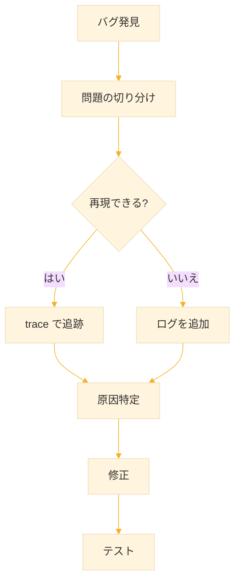

# Level 14 (デバッグと開発)
## 1. REPL の活用

### 1-1. REPL とは

**REPL（Read-Eval-Print Loop）** は Common Lisp の対話的開発環境。コードを入力すると即座に実行結果が表示される。

```
┌─────────────────────────────────┐
│  Read   → 入力を読み取る         │
│  Eval   → 評価（実行）する       │
│  Print  → 結果を表示する         │
│  Loop   → 繰り返す　　　         │
└─────────────────────────────────┘
```

### 1-2. REPL の基本操作

```lisp
;; 式を入力すると結果が返る
CL-USER> (+ 1 2 3)
6

;; 変数の定義
CL-USER> (defparameter *x* 10)
*X*

;; 関数の定義
CL-USER> (defun square (n) (* n n))
SQUARE

;; すぐにテスト
CL-USER> (square 5)
25
```

### 1-3. 特殊変数

REPL には直前の結果を参照する特殊変数がある。

| 変数 | 意味 |
|------|------|
| `*` | 直前の結果 |
| `**` | 2つ前の結果 |
| `***` | 3つ前の結果 |
| `+` | 直前の入力式 |
| `++` | 2つ前の入力式 |
| `+++` | 3つ前の入力式 |
| `/` | 直前の結果のリスト（多値の場合） |

```lisp
CL-USER> (+ 10 20)
30

CL-USER> (* * 2)        ; 30 * 2
60

CL-USER> (list * ** ***) ; 60, 30, ...
(60 30 ...)
```

### 1-4. REPL コマンド（SBCL の場合）

```lisp
;; 終了
(quit)
;; または
(exit)

;; パッケージの切り替え
(in-package :my-package)

;; 現在のパッケージを確認
*package*
```

package とはシンボルの名前空間を管理する仕組み。 同じ名前のシンボルを異なるパッケージに分けることで、名前の衝突を防ぐ。

```lisp
;; パッケージを定義
(defpackage :my-app
  (:use :cl)                    ; common-lisp パッケージを使用
  (:export :greet               ; 外部に公開するシンボル
           :farewell))

;; パッケージに切り替え
(in-package :my-app)

;; 関数を定義
(defun greet (name)
  (format nil "Hello, ~A!" name))

;; パッケージ名::シンボル（内部シンボル）
my-app::internal-function

;; パッケージ名:シンボル（外部シンボル）
my-app:greet

;; 別のパッケージから使用
(my-app:greet "Alice")
;; → "Hello, Alice!"
```


## 2. describe と inspect

### 2-1. describe

`describe` はオブジェクトの詳細情報を表示する関数。 関数の引数リスト、変数の型、クラスの構造など、デバッグや調査に役立つ情報を確認できる。

```lisp
;; 関数の情報
(describe #'mapcar)
;; MAPCAR is a FUNCTION.
;; Its lambda-list is: (FUNCTION LIST &REST MORE-LISTS)
;; ...

;; 変数の情報
(describe '*standard-output*)

;; クラスの情報
(describe (find-class 'string))

;; 数値の情報
(describe 42)
;; 42 is a FIXNUM.
```

### 2-2. inspect（対話的な調査）

`inspect` はオブジェクトを対話的に調査するコマンド。 内部構造を階層的に探索できる。

```lisp
;; リストを調査
(inspect '(a b c))
;; 対話的なインスペクタが起動

;; ハッシュテーブルを調査
(defparameter *ht* (make-hash-table))
(setf (gethash :a *ht*) 1)
(inspect *ht*)
```

### 2-3. apropos

名前の一部から関数やシンボルを検索する。

```lisp
;; "string" を含むシンボルを検索
(apropos "string")
;; STRING
;; STRING=
;; STRING-UPCASE
;; ...

;; "hash" を含むシンボル
(apropos "hash")
;; HASH-TABLE
;; GETHASH
;; MAKE-HASH-TABLE
;; ...
```

### 2-4. documentation

関数やマクロのドキュメントを取得する。

```lisp
;; 関数のドキュメント
(documentation 'mapcar 'function)
;; "Apply fn to successive elements of lists..."

;; 自分の関数にドキュメントを付ける
(defun add (a b)
  "2つの数を加算する"
  (+ a b))

(documentation 'add 'function)
;; "2つの数を加算する"
```


## 3. トレースとステップ実行

### 3-1. trace

`trace` は関数の呼び出しと戻り値を追跡する。

```lisp
(defun factorial (n)
  (if (<= n 1)
      1
      (* n (factorial (1- n)))))

;; トレースを有効化
(trace factorial)

(factorial 5)
;; 0: (FACTORIAL 5)
;;   1: (FACTORIAL 4)
;;     2: (FACTORIAL 3)
;;       3: (FACTORIAL 2)
;;         4: (FACTORIAL 1)
;;         4: FACTORIAL returned 1
;;       3: FACTORIAL returned 2
;;     2: FACTORIAL returned 6
;;   1: FACTORIAL returned 24
;; 0: FACTORIAL returned 120
;; → 120

;; トレースを解除
(untrace factorial)

;; すべてのトレースを解除
(untrace)
```

### 3-2. 複数の関数をトレース

```lisp
(defun fib (n)
  (if (< n 2)
      n
      (+ (fib (- n 1))
         (fib (- n 2)))))

(defun fib-sum (a b)
  (+ (fib a) (fib b)))

;; 複数の関数をトレース
(trace fib fib-sum)

(fib-sum 3 4)
;; トレース出力...

(untrace fib fib-sum)
```

### 3-3. step（ステップ実行）

`step` は式を1ステップずつ実行する。

```lisp
;; ステップ実行
(step (factorial 3))
;; 対話的なステッパーが起動
;; n: 次のステップ
;; s: ステップイン
;; o: ステップアウト
;; q: 終了
```

### 3-4. break

`break` は実行を中断してデバッガに入る。

```lisp
(defun process-item (item)
  (when (null item)
    (break "item is null"))        ; ここで中断
  (* item 2))

(process-item nil)
;; デバッガが起動
```


## 4. デバッガの使い方

### 4-1. デバッガへの入り方

エラーが発生すると自動的にデバッガに入る。

```lisp
* (/ 1 0)

debugger invoked on a DIVISION-BY-ZERO @100027BFF9 in thread
##<THREAD tid=1728 "main thread" RUNNING {1100030003}>:
  arithmetic error DIVISION-BY-ZERO signalled
Operation was (/ 1 0).

Type HELP for debugger help, or (SB-EXT:EXIT) to exit from SBCL.

restarts (invokable by number or by possibly-abbreviated name):
  0: [ABORT] Exit debugger, returning to top level.

(SB-KERNEL::INTEGER-/-INTEGER 1 0)
0]
```

### 4-2. デバッガのコマンド

| コマンド | 説明 |
|----------|------|
| `:abort` / `0` | 処理を中止して REPL に戻る |
| `:continue` | 可能なら処理を続行 |
| `:backtrace` | スタックトレースを表示 |
| `:help` | ヘルプを表示 |
| 数字 | リスタートを選択 |

### 4-3. バックトレースの読み方

番号が小さいほどエラーに近い。 番号0付近がエラー発生地点。SB- で始まる行はシステム内部なので無視し、自分の関数名を探す。引数の値も表示されるので、何が渡されたか確認できる。

| 見るべき点 | 説明 |
|-----------|------|
| 番号 0 付近 | エラーの直接原因 |
| 自分の関数名 | どこで呼び出したか |
| 引数の値 | 何が渡されたか |
| `SB-` で始まる行 | システム内部（通常無視） |

```
Backtrace for: #<SB-THREAD:THREAD tid=1728 "main thread" RUNNING {1100030003}>
0: (SB-KERNEL::INTEGER-/-INTEGER 1 0)
1: (INTERACTIVE-EVAL (TEST 0) :EVAL #<FUNCTION SB-DEBUG::DEBUG-EVAL>)  ;; (TEST 0)でエラー発生
2: (SB-DEBUG::DEBUG-EVAL-PRINT (TEST 0))
3: (SB-DEBUG::DEBUG-LOOP-FUN)
4: (INTERNAL-DEBUG)
5: ((FLET DEBUG :IN SB-DEBUG::%INVOKE-DEBUGGER))
6: (SB-DEBUG::%INVOKE-DEBUGGER #<DIVISION-BY-ZERO {11027FFBF3}>)       ;; ゼロ除算でエラー
7: ((LAMBDA NIL :IN SB-DEBUG::FUNCALL-WITH-DEBUG-IO-SYNTAX))
8: (SB-IMPL::CALL-WITH-SANE-IO-SYNTAX #<FUNCTION (LAMBDA NIL :IN SB-DEBUG::FUNCALL-WITH-DEBUG-IO-SYNTAX) {5FE56B}>)
9: ((FLET "THUNK" :IN SB-DEBUG::FUNCALL-WITH-DEBUG-IO-SYNTAX))
10: (SB-IMPL::%WITH-STANDARD-IO-SYNTAX #<FUNCTION (FLET "THUNK" :IN SB-DEBUG::FUNCALL-WITH-DEBUG-IO-SYNTAX) {5FE62B}>)
11: (SB-DEBUG::FUNCALL-WITH-DEBUG-IO-SYNTAX #<FUNCTION SB-DEBUG::%INVOKE-DEBUGGER> #<DIVISION-BY-ZERO {11027FFBF3}>)
12: (INVOKE-DEBUGGER #<DIVISION-BY-ZERO {11027FFBF3}>)
13: (ERROR DIVISION-BY-ZERO :OPERATION / :OPERANDS (1 0))
14: ("DIVISION-BY-ZERO-ERROR" 1)
```


### 4-4. デバッガでの変数確認

```lisp
(defun buggy-function (x y)
  (declare (optimize (debug 3))) ; ここにデバッグレベル3を指定を指定
  (let ((result (* x y)))
    (break "Checking values")    ; ここで中断
    (/ result (- x y))))

(buggy-function 5 3)
;; デバッガ内で
;; x → 5
;; y → 3
;; result → 15
```

Lispコンパイラはデフォルトで実行速度を優先する場合があり、その際、デバッガがresultという変数名と実際の値を結びつけるための情報を捨ててしまうことがあります。

デバッガで変数の値を見るため、関数定義の冒頭に (declare (optimize (debug 3))) を追加してデバッグレベルを上げます。これにより、コンパイラに対して「速度よりもデバッグのしやすさを最優先しろ（変数の情報を保持しろ）」と指示できます。

#### コンパイル時の最適化の優先度

```lisp
(declaim (optimize (debug 3)      ; デバッグ情報
                   (speed 0)      ; 実行速度
                   (safety 3)     ; 安全性チェック
                   (space 0)))    ; メモリ使用量
```

**debug（デバッグ情報）**

| レベル | 効果 |
|--------|------|
| 0 | デバッグ情報なし（最適化優先） |
| 1 | 基本的なデバッグ情報 |
| 2 | 詳細なデバッグ情報 |
| 3 | 完全なデバッグ情報（変数、行番号など） |


**speed（実行速度）**

| レベル | 効果 |
|--------|------|
| 0 | 速度を犠牲にしてよい |
| 1 | 通常の最適化 |
| 2 | 積極的な最適化 |
| 3 | 最大限の速度最適化 |

**safety（安全性チェック）**

| レベル | 効果 |
|--------|------|
| 0 | チェックなし（危険だが速い） |
| 1 | 基本的なチェック |
| 2 | 多くのチェック |
| 3 | すべてのチェック（配列境界、型など） |

**space（メモリ使用量）**

| レベル | 効果 |
|--------|------|
| 0 | メモリを多く使ってよい |
| 1 | 通常 |
| 2 | メモリ節約 |
| 3 | 最大限のメモリ節約 |


## 5. assert によるチェック

### 5-1. 基本的な assert

`assert` は条件が偽の場合にエラーを発生させる。

```lisp
(defun divide (a b)
  (assert (not (zerop b)) (b)         ; b が 0 でないことを確認
          "Divisor cannot be zero: ~A" b)
  (/ a b))

(divide 10 0)
;; エラー: Divisor cannot be zero: 0
```

### 5-2. 修正可能な assert

単にエラーを通知して停止するだけでなく、**「その場で値を書き換えて処理を続行させる」** ための仕組みが組み込まれています。

```lisp
(defun set-age (age)
  (assert (and (integerp age)
               (>= age 0)
               (<= age 150))
          (age)                        ; 修正可能な変数
          "Invalid age: ~A" age)
  age)

;; エラー時に age を修正する機会が与えられる
```

例えば、不正な値 `200` を渡して実行してみます。

```lisp
(set-age 200)
```

すると、デバッガが起動し、以下のような選択肢（Restarts）が表示されます（SBCLの場合のイメージ）。

```text
debugger invoked on a SIMPLE-ERROR in thread ...:
  Invalid age: 200

restarts (invokable by number or by possibly-abbreviated name):
  0: [CONTINUE] Retry assertion with new value for AGE.
  1: [ABORT   ] Exit debugger, returning to top level.

(SET-AGE 200)
   source: (ASSERT (AND (INTEGERP AGE) (>= AGE 0) (<= AGE 150)) (AGE)
                   "Invalid age: ~A" AGE)
0]
```

ここで **`0` (CONTINUE)** を選択すると、プロンプトが表示されます。

```text
The old value of AGE is 200.
Do you want to supply a new value?  (y or n)   ;; yを入力

Type a form to be evaluated:
25    ;; 25を入力 → 25
```

すると、関数 `set-age` は中断せず、変数 `age` の中身が `200` から `25` に書き換わり、何事もなかったかのように `25` を返して終了します。

計算の途中でデータ不良が見つかった場合でも、プログラム全体を再起動することなく、その場のデータだけ手動で直して計算を続行できます。

### 5-3. check-type

型をチェックする特化した関数。

```lisp
(defun greet (name)
  (check-type name string)            ; string 型かチェック
  (format nil "Hello, ~A!" name))

(greet "Alice")  ;; → "Hello, Alice!"
(greet 123)      ;; → エラー（The value of NAME is 123, which is not of type STRING.)
```


## 6. time と性能計測

### 6-1. time マクロ

`time` は実行時間とメモリ使用量を計測する。

```lisp
(time (dotimes (i 1000000) (sqrt i)))
;; Evaluation took:
;;   0.023 seconds of real time
;;   0.023438 seconds of total run time
;;   8,000,000 bytes consed
```

### 6-2. 比較のための計測

```lisp
;; 遅い実装
(defun fib-slow (n)
  (if (< n 2)
      n
      (+ (fib-slow (- n 1))
         (fib-slow (- n 2)))))

;; 速い実装
(defun fib-fast (n)
  (loop repeat n
        for a = 0 then b
        and b = 1 then (+ a b)
        finally (return a)))

;; 比較
(time (fib-slow 30))
;; → 約0.1秒

(time (fib-fast 30))
;; → 約0.00001秒
```

### 6-3. room（メモリ使用状況）

```lisp
;; メモリ使用状況を表示
(room)
;; Dynamic space usage is: 45,678,912 bytes.
;; ...

;; 簡易表示
(room nil)

;; 詳細表示
(room t)
```


## 7. 開発支援ツール

### 7-1. disassemble

コンパイルされたコードを逆アセンブルする。

```lisp
(defun add (a b)
  (+ a b))

(disassemble #'add)
;; ; disassembly for ADD
;; ; Size: 23 bytes. Origin: #x10033E4B40
;; ...
```

### 7-2. macroexpand

マクロを展開して確認する。

```lisp
;; 1段階展開
(macroexpand-1 '(when t (print "hello")))
;; → (IF T (PROGN (PRINT "hello")))

;; 完全展開
(macroexpand '(dotimes (i 3) (print i)))
;; → (BLOCK NIL (LET ((I 0)) ...))
```

### 7-3. コンパイル

```lisp
;; 関数をコンパイル
(compile 'my-function)

;; ファイルをコンパイル
(compile-file "my-program.lisp")

;; コンパイル済みファイルをロード
(load "my-program.fasl")
```

### 7-4. 実行可能ファイルへのコンパイル

https://www.codegenes.net/blog/compiling-common-lisp-to-an-executable/

## 8. SLIME/SLY の活用

### 8-1. SLIME とは

**SLIME（Superior Lisp Interaction Mode for Emacs）** は Emacs 用の強力な開発環境。Emacs 内で Lisp 処理系（SBCL など）と双方向で通信し、Lisp コードをリアルタイムで実行・編集できるようにする。

使用するには、SBCL、Quicklisp、Emacsがインストールします。

次に、SBCLを立ち上げ、QuicklispからSLIMEを入れます。

```
(ql:quickload "quicklisp-slime-helper")
```

インストール後のメッセージで以下の様にEmacsの設定するよう指示が表示されます。

```
To use, add this to your ~/.emacs:

  (load (expand-file-name "~/quicklisp/slime-helper.el"))
  ;; Replace "sbcl" with the path to your implementation
  (setq inferior-lisp-program "sbcl")
```

- EmacsでSLIMEを起動し、scratchバッファに移動します。（Ctrl+x → b → \*scratch* と入力 → Enter）
- EmacsでSLIMEを起動します。（M-x slime）
- REPLが表示されるので、以下を入力して動作を確認。

```
(+ 1 2 3)  ;; → 6
```

### 8-2. 主要なキーバインド

| キー | 機能 |
|------|------|
| `C-c C-c` | 関数をコンパイル |
| `C-c C-k` | ファイル全体をコンパイル |
| `C-c C-z` | REPL に移動 |
| `C-c C-d d` | ドキュメント表示 |
| `C-c C-d a` | apropos |
| `M-.` | 定義へジャンプ |
| `M-,` | 元の位置に戻る |
| `C-c C-t` | トレース切り替え |
| `C-x C-e` | カーソル前の式を評価 |

### 8-3. SLIME Inspector

```lisp
;; SLIME でオブジェクトを調査
;; C-c I でインスペクタを起動

;; インスペクタ内で
;; TAB: 次の項目へ
;; RET: 項目を展開
;; l: 戻る
;; q: 終了
```

### 8-4. SLIME Debugger

```lisp
;; エラー時に自動的に起動
;; v: ソースコードを表示
;; e: 式を評価
;; i: フレームを調査
;; r: リスタートを選択
;; a: abort
;; c: continue
```

### 8-5. SLIME ドキュメント

Emacsの使い方になれるところから始まるので、この環境が快適になるには時間がかかるかもしれません。

1. **SLIME User Manual（公式マニュアル）**
   [https://elpa.nongnu.org/nongnu-devel/doc/slime.html](https://elpa.nongnu.org/nongnu-devel/doc/slime.html)

2. **SLIME GitHub（最新ソース・README）**
   [https://github.com/slime/slime](https://github.com/slime/slime)

3. **quicklisp-slime-helper（Quicklisp 経由で SLIME を使う方式）**
   [https://github.com/quicklisp/quicklisp-slime-helper](https://github.com/quicklisp/quicklisp-slime-helper)

4. **slime-doc-contribs（SLIME のヘルプ／ドキュメント強化パッケージ）**
   [https://github.com/mmontone/slime-doc-contribs](https://github.com/mmontone/slime-doc-contribs)

5. **Qiita：common-lisp入門備忘録（SLIME と SBCL のセットアップ）**
   [https://qiita.com/legokichi/items/8b99fce09a4967c0dbd5](https://qiita.com/legokichi/items/8b99fce09a4967c0dbd5)

6. **Qiita：最小限の Common Lisp 環境 (Emacs + SLIME) の作成**
   [https://qiita.com/bori_so1/items/38182e4171fad82c7ff0](https://qiita.com/bori_so1/items/38182e4171fad82c7ff0)

10. **The Common Lisp Cookbook（英語）— Getting Started**
    [https://lispcookbook.github.io/cl-cookbook/getting-started.html](https://lispcookbook.github.io/cl-cookbook/getting-started.html)

11. **Practical Common Lisp（英語）— Emacs & SLIME で開発する流れに触れる書籍**
    [http://www.gigamonkeys.com/book/](http://www.gigamonkeys.com/book/)


## 9. 実践的なデバッグ技法

### 9-1. print デバッグ

```lisp
(defun process-data (data)
  (format t "DEBUG: data = ~A~%" data)  ; デバッグ出力
  (let ((result (transform data)))
    (format t "DEBUG: result = ~A~%" result)
    result))
```

### 9-2. 条件付きデバッグ出力

```lisp
(defparameter *debug* t)               ; デバッグフラグ

(defmacro debug-log (format-string &rest args)
  `(when *debug*
     (format t ,(concatenate 'string "DEBUG: " format-string "~%")
             ,@args)))

(defun calculate (x y)
  (debug-log "x=~A, y=~A" x y)         ; デバッグ出力
  (let ((result (+ x y)))
    (debug-log "result=~A" result)
    result))

;; デバッグを無効化
(setf *debug* nil)
```

### 9-3. 事前・事後条件

```lisp
(defun safe-sqrt (x)
  ;; 事前条件
  (assert (and (numberp x) (>= x 0))
          (x) "x must be a non-negative number: ~A" x)
  (let ((result (sqrt x)))
    ;; 事後条件
    (assert (>= result 0)
            () "Result must be non-negative")
    result))
```

### 9-4. ログ機能

```lisp
(defparameter *log-level* :info)       ; :debug, :info, :warn, :error

(defparameter *log-levels*
  '(:debug 0 :info 1 :warn 2 :error 3))

(defun log-message (level message &rest args)
  (when (>= (getf *log-levels* level)
            (getf *log-levels* *log-level*))
    (format t "[~A] ~A: ~?~%"
            (get-universal-time)
            level
            message
            args)))

;; 使用例
(log-message :debug "Processing item ~A" item)
(log-message :info "Started processing")
(log-message :warn "Deprecated function used")
(log-message :error "Failed to connect")
```


## 10. よくあるバグと対処法

### 10-1. 無限ループ

```lisp
;; 問題：終了条件が間違っている
(defun buggy-loop (n)
  (loop while (> n 0)
        do (print n)))               ; n が変わらない！

;; 修正
(defun fixed-loop (n)
  (loop while (> n 0)
        do (print n)
        (decf n)))                   ; n を減らす
```

### 10-2. 無限再帰

```lisp
;; 問題：基底ケースがない
(defun buggy-factorial (n)
  (* n (buggy-factorial (1- n))))    ; 止まらない

;; 修正
(defun factorial (n)
  (if (<= n 1)                       ; 基底ケース
      1
      (* n (factorial (1- n)))))
```

### 10-3. off-by-one エラー

```lisp
;; 問題：範囲が1つずれている
(defun buggy-sum (lst)
  (loop for i from 1 to (length lst) ; 1から開始は間違い
        sum (nth i lst)))

;; 修正
(defun sum-list (lst)
  (loop for i from 0 below (length lst)
        sum (nth i lst)))

;; または
(defun sum-list (lst)
  (reduce #'+ lst :initial-value 0))
```

### 10-4. 破壊的操作のバグ

```lisp
;; 問題：元のリストが破壊される
(defparameter *data* '(3 1 4 1 5))

(defun buggy-sort (lst)
  (sort lst #'<))                    ; 破壊的！

(buggy-sort *data*)
*data*                               ; → 不定

;; 修正
(defun safe-sort (lst)
  (sort (copy-list lst) #'<))        ; コピーしてからソート
```


## 11. 練習課題

### 課題1：トレースを使う

フィボナッチ関数をトレースして、fib(5) の呼び出し回数を数えよ。

**解答**

```lisp
(defun fib (n)
  (if (< n 2)
      n
      (+ (fib (- n 1)) (fib (- n 2)))))

(trace fib)
(fib 5)
;; トレース出力を数える → 15回の呼び出し
(untrace fib)
```


### 課題2：デバッグ出力マクロ

変数名と値を同時に表示するマクロを作れ。

```lisp
(let ((x 10) (y 20))
  (debug-vars x y))
;; x = 10
;; y = 20
```

**解答**

```lisp
(defmacro debug-vars (&rest vars)
  `(progn
     ,@(mapcar (lambda (var)
                 `(format t "~A = ~A~%" ',var ,var))
               vars)))

(let ((x 10) (y 20))
  (debug-vars x y))
;; x = 10
;; y = 20
```


### 課題3：実行時間計測関数

関数の実行時間を計測してミリ秒で返す関数を作れ。

**解答**

```lisp
(defun measure-time (fn)
  (let ((start (get-internal-real-time)))
    (funcall fn)
    (let ((end (get-internal-real-time)))
      (/ (* 1000.0 (- end start))
         internal-time-units-per-second))))

;; 使用例
(measure-time (lambda () (sleep 0.1)))
;; → 約100.0（ミリ秒）
```


### 課題4：アサーション付き関数

引数の型と範囲をチェックする除算関数を作れ。

**解答**

```lisp
(defun safe-divide (a b)
  (check-type a number)              ; a は数値
  (check-type b number)              ; b は数値
  (assert (not (zerop b)) (b)        ; b は非ゼロ
          "Cannot divide by zero")
  (/ a b))

(safe-divide 10 2)    ;; → 5
(safe-divide 10 0)    ;; → エラー
(safe-divide "a" 2)   ;; → 型エラー
```


### 課題5：ログレベル付きロガー

ログレベルを設定できるロガークラスを作れ。

**解答**

```lisp
(defparameter *log-level* 1)         ; 0:debug, 1:info, 2:warn, 3:error

(defun set-log-level (level)
  (setf *log-level*
        (ecase level
          (:debug 0)
          (:info 1)
          (:warn 2)
          (:error 3))))

(defun log-debug (msg &rest args)
  (when (<= 0 *log-level*)
    (apply #'format t (cons (concatenate 'string "[DEBUG] " msg "~%") args))))

(defun log-info (msg &rest args)
  (when (<= 1 *log-level*)
    (apply #'format t (cons (concatenate 'string "[INFO] " msg "~%") args))))

(defun log-warn (msg &rest args)
  (when (<= 2 *log-level*)
    (apply #'format t (cons (concatenate 'string "[WARN] " msg "~%") args))))

(defun log-error (msg &rest args)
  (when (<= 3 *log-level*)
    (apply #'format t (cons (concatenate 'string "[ERROR] " msg "~%") args))))

;; 使用例
(set-log-level :info)
(log-debug "This won't show")
(log-info "Processing ~A" "data")
;; [INFO] Processing data
```


## 12. まとめ

### REPL の特殊変数

| 変数 | 意味 |
|------|------|
| `*`, `**`, `***` | 直前の結果 |
| `+`, `++`, `+++` | 直前の入力 |

### 調査・検索ツール

| 関数 | 用途 |
|------|------|
| `describe` | オブジェクトの詳細 |
| `inspect` | 対話的調査 |
| `apropos` | シンボル検索 |
| `documentation` | ドキュメント取得 |

### デバッグツール

| 関数/マクロ | 用途 |
|------------|------|
| `trace` / `untrace` | 関数呼び出しの追跡 |
| `step` | ステップ実行 |
| `break` | 中断してデバッガへ |
| `assert` | 条件チェック |
| `check-type` | 型チェック |

### 性能計測

| 関数 | 用途 |
|------|------|
| `time` | 実行時間・メモリ計測 |
| `room` | メモリ使用状況 |

### デバッグの流れ



