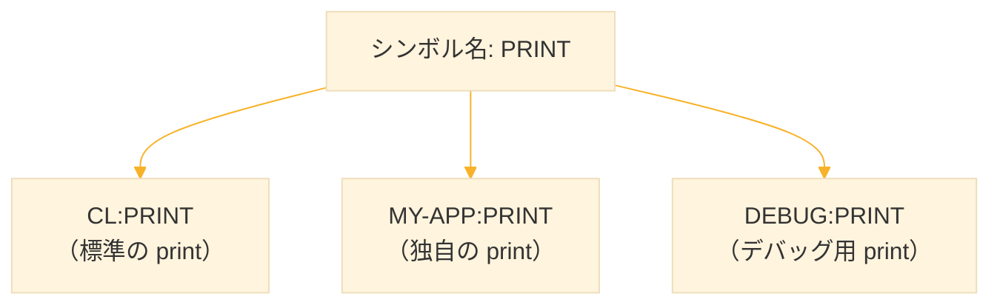
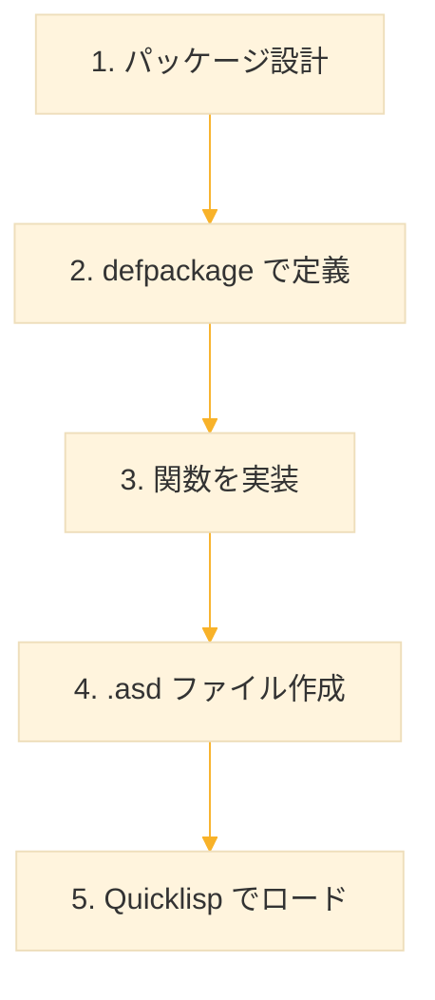

# Level 15 (パッケージとシステム)
## 1. パッケージとは

### 1-1. パッケージの役割

**パッケージ（package）** はシンボルの名前空間を管理する仕組み。異なるパッケージに同じ名前のシンボルを持てるため、名前の衝突を防げる。



### 1-2. 標準パッケージ

| パッケージ | 別名 | 説明 |
|-----------|------|------|
| `COMMON-LISP` | `CL` | 標準の関数・マクロ |
| `COMMON-LISP-USER` | `CL-USER` | ユーザー作業用 |
| `KEYWORD` | なし | キーワードシンボル |

```lisp
;; 現在のパッケージを確認
*package*
;; → #<PACKAGE "COMMON-LISP-USER">

;; パッケージ名を取得
(package-name *package*)
;; → "COMMON-LISP-USER"
```

### 1-3. シンボルとパッケージの関係

```lisp
;; シンボルはパッケージに所属する
(symbol-package 'print)
;; → #<PACKAGE "COMMON-LISP">

;; パッケージ修飾でシンボルを指定
cl:car                    ; COMMON-LISP パッケージの car
cl-user:my-var            ; CL-USER パッケージの my-var
:keyword                  ; KEYWORD パッケージ（キーワード）
```


## 2. パッケージの作成

### 2-1. defpackage

`defpackage` でパッケージを定義する。

```lisp
;; 基本的なパッケージ定義
(defpackage :my-utils                 ; パッケージ名
  (:use :cl)                          ; CL パッケージを使用
  (:export :add                       ; 外部に公開するシンボル
           :subtract
           :multiply))

;; パッケージに切り替え
(in-package :my-utils)

;; 関数を定義
(defun add (a b)
  "2つの数を加算する"
  (+ a b))

(defun subtract (a b)
  "2つの数を減算する"
  (- a b))

(defun multiply (a b)
  "2つの数を乗算する"
  (* a b))
```

### 2-2. defpackage のオプション

| オプション | 説明 |
|-----------|------|
| `:use` | 他のパッケージのシンボルを取り込む |
| `:export` | 外部に公開するシンボル |
| `:import-from` | 特定のシンボルだけ取り込む |
| `:shadow` | 同名シンボルを隠す |
| `:nicknames` | パッケージの別名 |
| `:documentation` | ドキュメント |

```lisp
(defpackage :my-app
  (:nicknames :app)                   ; 別名
  (:use :cl)                          ; CL を使用
  (:import-from :my-utils             ; my-utils から特定のシンボルを取り込む
                :add
                :multiply)
  (:export :main                      ; 公開するシンボル
           :run)
  (:documentation "My application package"))
```

### 2-3. in-package

`in-package` で現在のパッケージを切り替える。

```lisp
;; CL-USER から my-app に切り替え
(in-package :my-app)

;; 確認
*package*
;; → #<PACKAGE "MY-APP">

;; CL-USER に戻る
(in-package :cl-user)
```


## 3. シンボルのアクセス

### 3-1. 外部シンボルと内部シンボル

**`:` は export された公開シンボルのみ、`::` はすべてのシンボルにアクセス可能。** `::` は非公開の内部実装にもアクセスできるが、変更される可能性があるため非推奨。

| 種類 | 記法 | 説明 |
|------|------|------|
| 外部シンボル | `pkg:symbol` | export されたシンボル |
| 内部シンボル | `pkg::symbol` | export されていないシンボル |

```lisp
(defpackage :my-lib
  (:use :cl)
  (:export :public-fn))               ; public-fn だけ公開

(in-package :my-lib)

(defun public-fn ()                   ; 公開される
  "Public function"
  (private-fn))

(defun private-fn ()                  ; 公開されない
  "Private function"
  :secret)

;; 別のパッケージから
(in-package :cl-user)

(my-lib:public-fn)                    ; OK（外部シンボル）
;; → :SECRET

(my-lib::private-fn)                  ; OK（内部シンボル、非推奨）
;; → :SECRET

;; (my-lib:private-fn)                ; エラー（外部シンボルではない）
```

### 3-2. use-package

`use-package` で他のパッケージのシンボルを取り込む。

```lisp
;; my-utils のシンボルを現在のパッケージで使えるようにする
(use-package :my-utils)

;; パッケージ修飾なしで使える
(add 1 2)                             ; my-utils:add
;; → 3
```

### 3-3. import と shadowing-import

```lisp
;; 特定のシンボルだけ取り込む
(import 'my-utils:add)

;; 衝突する場合は shadowing-import
(shadowing-import 'my-utils:add)      ; 既存のシンボルを上書き
```


## 4. パッケージの設計パターン


1つのプロジェクトを複数のパッケージに分割する。
- `package.lisp` にすべてのパッケージ定義をまとめ、最初に読み込む。
- 機能ごとに `my-project.utils`、`my-project.core` のように階層的に名前をつける。
- 依存関係は `:use` や `:import-from` で明示し、公開する関数だけを `:export` する。
- `.asd` ファイルで読み込み順を管理し、ASDF/Quicklisp で一括ロードできるようにする。

### 4-1. 典型的なファイル構成

```
my-project/
├── package.lisp          ; パッケージ定義
├── utils.lisp            ; ユーティリティ
├── core.lisp             ; コア機能
└── main.lisp             ; メイン処理
```

### 4-2. package.lisp の例

```lisp
;;;; package.lisp

;; ユーティリティパッケージ
(defpackage :my-project.utils
  (:use :cl)
  (:export :read-file
           :write-file
           :split-string))

;; コアパッケージ
(defpackage :my-project.core
  (:use :cl :my-project.utils)        ; utils を使用
  (:export :process-data
           :analyze))

;; メインパッケージ
(defpackage :my-project
  (:use :cl :my-project.core)
  (:export :main
           :run))
```

### 4-3. 実装ファイルの例

```lisp
;;;; utils.lisp
(in-package :my-project.utils)

(defun read-file (path)
  "ファイルを読み込んで文字列を返す"
  (with-open-file (stream path)
    (let ((contents (make-string (file-length stream))))
      (read-sequence contents stream)
      contents)))

(defun write-file (path content)
  "文字列をファイルに書き込む"
  (with-open-file (stream path
                   :direction :output
                   :if-exists :supersede)
    (write-string content stream)))
```

```lisp
;;;; core.lisp
(in-package :my-project.core)

(defun process-data (data)
  "データを処理する"
  (mapcar #'string-upcase data))
```

```lisp
;;;; main.lisp
(in-package :my-project)

(defun main ()
  "メイン関数"
  (format t "Starting my-project...~%")
  (run))

(defun run ()
  "アプリケーションを実行"
  (process-data '("hello" "world")))
```


## 5. ASDF によるシステム定義

### 5-1. ASDF によるシステム定義

#### ASDF とは

**Another System Definition Facility** の略。複数ファイルで構成される Common Lisp プロジェクトをビルド・管理するツール。ファイルの依存関係を解決し、正しい順序でロードする。（入力してみるとわかる、マジかよと思うネーミング）


#### .asd ファイルの基本構造

```lisp
;;;; my-project.asd
(defsystem "my-project"
  :version "1.0.0"                    ; バージョン
  :author "Your Name"                 ; 作者
  :license "MIT"                      ; ライセンス
  :description "Project description"  ; 説明
  :depends-on ("alexandria"           ; 依存ライブラリ
               "cl-ppcre")
  :components ((:file "package")      ; 構成ファイル
               (:file "utils")
               (:file "main")))
```

#### defsystem のオプション一覧

| オプション | 説明 |
|-----------|------|
| `:version` | バージョン番号 |
| `:author` | 作者名 |
| `:license` | ライセンス |
| `:description` | 説明文 |
| `:depends-on` | 依存するシステム |
| `:components` | 構成ファイル/モジュール |
| `:serial t` | ファイルを順番に読み込む |
| `:pathname` | ソースのパス |
| `:homepage` | プロジェクトURL |


#### :components の書き方

##### ファイル指定

```lisp
:components ((:file "package")        ; package.lisp
             (:file "utils")          ; utils.lisp
             (:file "main"))          ; main.lisp
```

拡張子 `.lisp` は省略する。

##### 依存関係を明示

```lisp
:components ((:file "package")
             (:file "utils" :depends-on ("package"))      ; package に依存
             (:file "core" :depends-on ("package" "utils")) ; 複数に依存
             (:file "main" :depends-on ("core")))         ; core に依存
```

依存関係が複雑な場合に使う。どのファイルがどのファイルを必要とするか明確になる

##### :serial t で順番を保証

```lisp
:serial t                             ; この行を追加するだけ
:components ((:file "package")        ; 1番目：他に依存しない
             (:file "utils")          ; 2番目：package を使える
             (:file "core")           ; 3番目：package, utils を使える
             (:file "main"))          ; 4番目：すべてを使える
```

上から順に読み込む。:depends-on を書く手間が省ける。小規模プロジェクトで推奨。


#### モジュール（ディレクトリ）構成

```
my-project/
├── my-project.asd
├── src/
│   ├── package.lisp
│   ├── utils.lisp
│   └── core.lisp
└── tests/
    └── main-test.lisp
```

```lisp
(defsystem "my-project"
  :components
  ((:module "src"                     ; src/ ディレクトリを指定
    :serial t                         ; モジュール内でも使える
    :components
    ((:file "package")                ; src/package.lisp
     (:file "utils")                  ; src/utils.lisp
     (:file "core")))                 ; src/core.lisp
   (:module "tests"                   ; tests/ ディレクトリ
    :components
    ((:file "main-test")))))          ; tests/main-test.lisp
```

ディレクトリでファイルを整理する場合に使う。大規模プロジェクトで推奨。

#### 依存ライブラリ

```lisp
:depends-on ("alexandria"             ; Quicklisp からロード
             "cl-ppcre"
             "dexador")
```

システムをロードすると、依存ライブラリも自動的にロードされる。

---

#### システムのロード方法

```lisp
;; ASDF でロード
(asdf:load-system "my-project")

;; require でもOK（SBCL）
(require "my-project")

;; Quicklisp 経由（推奨）
(ql:quickload "my-project")
```


#### テスト用システムの定義

テストは別システムとして定義。本番コードにテストが混ざらない。

```lisp
;;;; my-project.asd
(defsystem "my-project"
  :serial t
  :depends-on ("alexandria")
  :components ((:file "package")
               (:file "main")))

;; テスト用システム（別システムとして定義）
(defsystem "my-project/tests"
  :depends-on ("my-project"           ; 本体に依存
               "fiveam")              ; テストフレームワーク
  :components ((:file "tests/main-test"))
  :perform (test-op (o s)             ; テスト実行方法
             (symbol-call :fiveam :run! :my-project-tests)))
```

```lisp
;; テストを実行
(asdf:test-system "my-project")
```


#### ローカルプロジェクトの登録

```lisp
;; 方法1：Quicklisp のローカルディレクトリに配置
;; ~/quicklisp/local-projects/my-project/

;; 方法2：パスを登録
(push #P"/path/to/my-project/" asdf:*central-registry*)

;; 方法3：ソースレジストリに追加（~/.sbclrc に記述）
(require :asdf)
(push '(:directory "/path/to/projects/")
      asdf:*default-source-registries*)
```

---

#### 完全な例

```lisp
;;;; calculator.asd
(defsystem "calculator"
  :version "1.0.0"
  :author "Your Name <you@example.com>"
  :license "MIT"
  :description "A simple calculator library"
  :homepage "https://github.com/yourname/calculator"
  :bug-tracker "https://github.com/yourname/calculator/issues"
  :source-control (:git "https://github.com/yourname/calculator.git")
  :depends-on ("alexandria")
  :serial t
  :pathname "src/"                    ; ソースのベースパス
  :components ((:file "package")
               (:file "operations")
               (:file "main"))
  :in-order-to ((test-op (test-op "calculator/tests"))))

(defsystem "calculator/tests"
  :depends-on ("calculator" "fiveam")
  :pathname "tests/"
  :components ((:file "test-operations"))
  :perform (test-op (o s)
             (symbol-call :fiveam :run! :calculator-tests)))
```

---

#### よく使うコマンド

```lisp
;; ロード（依存も含めてコンパイル・ロード）
(asdf:load-system "my-project")

;; テスト実行（:perform test-op が呼ばれる）
(asdf:test-system "my-project")

;; コンパイルのみ（ロードしない）
(asdf:compile-system "my-project")

;; システムの検索（存在確認）
(asdf:find-system "my-project")       ; → システムオブジェクト or NIL

;; バージョン取得
(asdf:system-version (asdf:find-system "my-project"))
;; → "1.0.0"
```

## 6. Quicklisp の活用

### 6-1. Quicklisp とは

**Quicklisp** は Common Lisp のパッケージマネージャ。数千のライブラリを簡単にインストールできる。

### 6-2. Quicklisp のインストール

```bash
## ダウンロード
curl -O https://beta.quicklisp.org/quicklisp.lisp

## SBCL で実行
sbcl --load quicklisp.lisp
```

```lisp
;; REPL で
(quicklisp-quickstart:install)

;; 起動時に自動ロード
(ql:add-to-init-file)
```

### 6-3. ライブラリのインストール

```lisp
;; ライブラリをインストール・ロード
(ql:quickload "alexandria")           ; ユーティリティ集
(ql:quickload "cl-ppcre")             ; 正規表現
(ql:quickload "dexador")              ; HTTP クライアント
(ql:quickload "cl-json")              ; JSON パーサー

;; 複数同時に
(ql:quickload '("alexandria" "cl-ppcre" "cl-json"))
```

### 6-4. ライブラリの検索

```lisp
;; 名前で検索
(ql:system-apropos "json")
;; → cl-json, jonathan, jsown, ...

;; インストール済みを確認
(ql:who-depends-on "alexandria")
```

### 6-5. よく使われるライブラリ

| ライブラリ | 用途 |
|-----------|------|
| `alexandria` | ユーティリティ関数集 |
| `cl-ppcre` | 正規表現 |
| `dexador` | HTTP クライアント |
| `cl-json` | JSON 処理 |
| `local-time` | 日付・時刻 |
| `bordeaux-threads` | マルチスレッド |
| `usocket` | ソケット通信 |
| `cl-csv` | CSV 処理 |


## 7. 自作ライブラリの公開準備

### 7-1. プロジェクト構成

```
my-library/
├── my-library.asd            ; システム定義
├── README.md                 ; ドキュメント
├── LICENSE                   ; ライセンス
├── src/
│   ├── package.lisp
│   └── main.lisp
└── tests/
    └── main-test.lisp
```

### 7-2. 完全な .asd ファイル

```lisp
;;;; my-library.asd
(defsystem "my-library"
  :version "0.1.0"
  :author "Your Name <your@email.com>"
  :license "MIT"
  :description "A useful library"
  :homepage "https://github.com/yourname/my-library"
  :depends-on ("alexandria")
  :serial t
  :components ((:module "src"
                :components
                ((:file "package")
                 (:file "main"))))
  :in-order-to ((test-op (test-op "my-library/tests"))))

;; テスト用システム
(defsystem "my-library/tests"
  :depends-on ("my-library" "fiveam")
  :components ((:module "tests"
                :components
                ((:file "main-test"))))
  :perform (test-op (o s)
             (symbol-call :fiveam :run! :my-library-tests)))
```

### 7-3. ローカルプロジェクトの登録

```lisp
;; Quicklisp のローカルプロジェクトディレクトリ
;; ~/quicklisp/local-projects/ にプロジェクトを配置

;; または、パスを追加
(push #P"/path/to/my-projects/" asdf:*central-registry*)

;; システムをロード
(ql:quickload "my-library")
```


## 8. パッケージのトラブルシューティング

### 8-1. 名前の衝突

```lisp
;; エラー例
(defpackage :my-app
  (:use :cl :lib-a :lib-b))           ; lib-a と lib-b に同名シンボル

;; 解決策1：shadow
(defpackage :my-app
  (:use :cl :lib-a :lib-b)
  (:shadow :conflicting-symbol))      ; 衝突するシンボルを隠す

;; 解決策2：import-from で必要なものだけ取り込む
(defpackage :my-app
  (:use :cl)
  (:import-from :lib-a :func-a)
  (:import-from :lib-b :func-b))
```

### 8-2. パッケージが見つからない

```lisp
;; エラー: Package MY-UTILS does not exist

;; 原因1：パッケージを定義していない
;; → defpackage を実行

;; 原因2：ファイルの読み込み順が間違っている
;; → package.lisp を最初にロード

;; 原因3：システムをロードしていない
;; → (ql:quickload "my-utils")
```

### 8-3. シンボルが見つからない

```lisp
;; エラー: Symbol ADD not found in package MY-UTILS

;; 原因1：export されていない
;; → defpackage に :export を追加

;; 原因2：パッケージを use していない
;; → (use-package :my-utils)
```

### 8-4. パッケージの再定義

```lisp
;; パッケージを削除して再定義
(delete-package :my-app)

;; または、既存のパッケージを変更
(rename-package :my-app :my-app-old)
```


## 9. 実践例

### 9-1. ユーティリティライブラリ

```lisp
;;;; string-utils.asd
(defsystem "string-utils"
  :version "1.0.0"
  :description "String utility functions"
  :serial t
  :components ((:file "package")
               (:file "string-utils")))
```

```lisp
;;;; package.lisp
(defpackage :string-utils
  (:use :cl)
  (:export :split
           :join
           :trim-all
           :starts-with-p
           :ends-with-p))
```

```lisp
;;;; string-utils.lisp
(in-package :string-utils)

(defun split (str delimiter)
  "文字列を区切り文字で分割"
  (let ((result nil)
        (start 0))
    (loop for i from 0 below (length str)
          when (char= (char str i) delimiter)
          do (push (subseq str start i) result)
             (setf start (1+ i))
          finally (push (subseq str start) result))
    (nreverse result)))

(defun join (lst separator)
  "リストを区切り文字で結合"
  (format nil (format nil "~~{~~A~~^~A~~}" separator) lst))

(defun trim-all (str)
  "前後の空白を除去"
  (string-trim '(#\Space #\Tab #\Newline) str))

(defun starts-with-p (str prefix)
  "指定した接頭辞で始まるか"
  (and (>= (length str) (length prefix))
       (string= str prefix :end1 (length prefix))))

(defun ends-with-p (str suffix)
  "指定した接尾辞で終わるか"
  (and (>= (length str) (length suffix))
       (string= str suffix :start1 (- (length str) (length suffix)))))
```

### 9-2. 設定ファイル管理

```lisp
;;;; config.lisp
(defpackage :my-app.config
  (:use :cl)
  (:export :*config*
           :load-config
           :get-config
           :set-config))

(in-package :my-app.config)

(defparameter *config* (make-hash-table :test 'equal)
  "設定を保存するハッシュテーブル")

(defun load-config (path)
  "ファイルから設定を読み込む"
  (with-open-file (stream path :if-does-not-exist nil)
    (when stream
      (let ((data (read stream)))       ; S式として読み込む
        (loop for (key value) on data by #'cddr
              do (setf (gethash key *config*) value))))))

(defun get-config (key &optional default)
  "設定値を取得"
  (gethash key *config* default))

(defun set-config (key value)
  "設定値を設定"
  (setf (gethash key *config*) value))

;; 使用例
;; config.lisp: (:database "localhost" :port 5432 :debug t)
;; (load-config "config.lisp")
;; (get-config :database) → "localhost"
```


## 10. 練習課題

### 課題1：基本的なパッケージ作成

数学ユーティリティのパッケージを作れ。

```lisp
(math-utils:square 5)    ;; → 25
(math-utils:cube 3)      ;; → 27
```

**解答**

```lisp
(defpackage :math-utils
  (:use :cl)
  (:export :square :cube))

(in-package :math-utils)

(defun square (x)
  "xの2乗を返す"
  (* x x))

(defun cube (x)
  "xの3乗を返す"
  (* x x x))
```


### 課題2：パッケージの使用

math-utils を使うアプリケーションパッケージを作れ。

**解答**

```lisp
(defpackage :my-calc
  (:use :cl)
  (:import-from :math-utils :square :cube)
  (:export :sum-of-squares))

(in-package :my-calc)

(defun sum-of-squares (lst)
  "リストの各要素の2乗の合計"
  (reduce #'+ (mapcar #'square lst)))
```


### 課題3：.asd ファイルの作成

以下の構成のプロジェクトの .asd ファイルを作れ。

```
calculator/
├── package.lisp
├── operations.lisp
└── main.lisp
```

**解答**

```lisp
(defsystem "calculator"
  :version "1.0.0"
  :author "Your Name"
  :license "MIT"
  :description "Simple calculator"
  :serial t
  :components ((:file "package")
               (:file "operations")
               (:file "main")))
```


### 課題4：Quicklisp でライブラリを使う

`cl-ppcre` を使って、文字列から数字だけを抽出する関数を作れ。

**解答**

```lisp
;; まずインストール
;; (ql:quickload "cl-ppcre")

(defun extract-numbers (str)
  "文字列から数字だけを抽出"
  (cl-ppcre:all-matches-as-strings "\\d+" str))

(extract-numbers "abc123def456")
;; → ("123" "456")
```


### 課題5：内部関数と外部関数

公開関数と非公開関数を持つパッケージを作れ。

**解答**

```lisp
(defpackage :secure-utils
  (:use :cl)
  (:export :hash-password))           ; validate は非公開

(in-package :secure-utils)

(defun validate (password)
  "パスワードの検証（非公開）"
  (>= (length password) 8))

(defun hash-password (password)
  "パスワードをハッシュ化（公開）"
  (if (validate password)             ; 内部で validate を使用
      (sxhash password)
      (error "Password too short")))

;; 外部から
;; (secure-utils:hash-password "mypassword") → ハッシュ値
;; (secure-utils:validate "test")            → エラー（非公開）
;; (secure-utils::validate "test")           → T（非推奨だが可能）
```


## 11. まとめ

### パッケージの基本

| 関数/マクロ | 用途 |
|------------|------|
| `defpackage` | パッケージを定義 |
| `in-package` | パッケージを切り替え |
| `use-package` | 他パッケージのシンボルを使用 |
| `export` | シンボルを公開 |
| `import` | シンボルを取り込む |

### シンボルのアクセス

| 記法 | 意味 |
|------|------|
| `pkg:symbol` | 外部シンボル |
| `pkg::symbol` | 内部シンボル |
| `:keyword` | キーワード |

### ASDF

| 関数 | 用途 |
|------|------|
| `defsystem` | システムを定義 |
| `asdf:load-system` | システムをロード |

### Quicklisp

| 関数 | 用途 |
|------|------|
| `ql:quickload` | ライブラリをロード |
| `ql:system-apropos` | ライブラリを検索 |

### パッケージ設計の流れ



