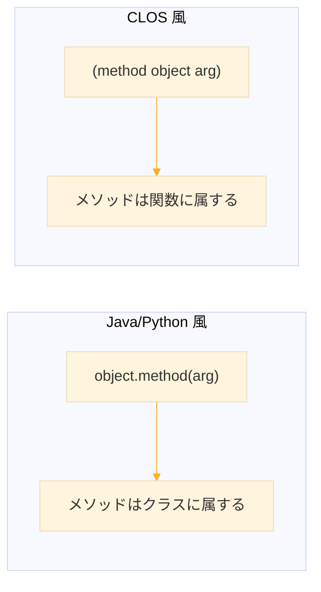
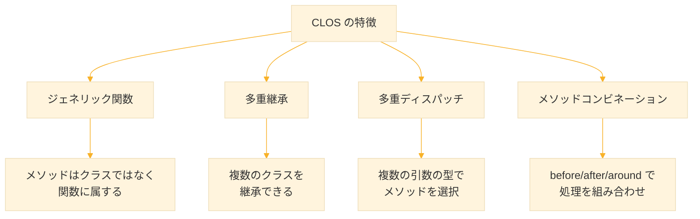

# Level 16 (オブジェクト指向（CLOS）)
## 1. CLOS とは

### 1-1. CLOS の概要

**CLOS（Common Lisp Object System）** は Common Lisp のオブジェクト指向システム。1980年代に Flavors（MIT）や LOOPS（Xerox）など複数のオブジェクト指向 Lisp を統合する形で設計され、1988年に公開、1994年に ANSI 標準に組み込まれた。

CLOS は Java や Python のオブジェクト指向を模倣するのではなく、Lisp の関数中心の思想を活かした独自のアプローチを取る。

| 特徴 | 説明 |
|------|------|
| ジェネリック関数 | メソッドはクラスではなく関数に属する |
| 多重継承 | 複数のクラスを継承できる |
| 多重ディスパッチ | 複数の引数の型でメソッドを選択 |
| メソッドコンビネーション | メソッドの組み合わせ方を制御 |
| MOP | CLOS 自体をカスタマイズ可能 |

### 1-2. 他言語との違い

Java や Python ではメソッドはクラスの内部に定義され、`object.method()` の形式で呼び出す。CLOS ではメソッドはジェネリック関数に属し、`(method object)` の形式で呼び出す。この違いにより、既存のクラスを修正せずに新しいメソッドを追加できる。



```lisp
;; Java 風（擬似コード）
;; dog.speak()
;; cat.speak()

;; CLOS 風
(speak dog)
(speak cat)
```


## 2. クラスの定義

### 2-1. defclass

`defclass` はクラスを定義するマクロ。クラス名、親クラスのリスト、スロット（メンバ変数）の定義を指定する。スロットにはオプションを付けて、初期化方法やアクセス方法を制御できる。

```lisp
(defclass person ()                   ; クラス名、親クラス（なし）
  ((name :initarg :name               ; スロット定義
         :accessor person-name)
   (age :initarg :age
        :accessor person-age
        :initform 0)))                ; デフォルト値
```

### 2-2. スロットオプション

スロットオプションはスロットの振る舞いを制御する。`:initarg` でインスタンス生成時のキーワード引数を指定し、`:accessor` で読み書き用の関数を自動生成する。`:initform` はスロットのデフォルト値を設定する。

| オプション | 説明 |
|-----------|------|
| `:initarg` | インスタンス生成時の引数名 |
| `:initform` | デフォルト値 |
| `:accessor` | 読み書き用関数を生成 |
| `:reader` | 読み取り専用関数を生成 |
| `:writer` | 書き込み専用関数を生成 |
| `:type` | 型を指定（ドキュメント目的） |
| `:documentation` | ドキュメント |

```lisp
(defclass product ()
  ((id :initarg :id
       :reader product-id             ; 読み取り専用（変更不可）
       :type integer)
   (name :initarg :name
          :accessor product-name       ; 読み書き可能
          :type string)
   (price :initarg :price
          :accessor product-price
          :initform 0                  ; 省略時は0
          :type number)
   (stock :initarg :stock
          :accessor product-stock
          :initform 0)))
```

### 2-3. インスタンスの生成

`make-instance` でクラスのインスタンスを生成する。`:initarg` で指定したキーワード引数を使って初期値を渡す。生成後は `:accessor` で定義した関数でスロットにアクセスできる。`setf` と組み合わせるとスロットの値を変更できる。

```lisp
;; make-instance でインスタンス生成
(defparameter *alice*
  (make-instance 'person
                 :name "Alice"
                 :age 30))

;; スロットにアクセス（accessor 関数を使用）
(person-name *alice*)                 ; → "Alice"
(person-age *alice*)                  ; → 30

;; スロットを変更（setf と accessor を組み合わせる）
(setf (person-age *alice*) 31)
(person-age *alice*)                  ; → 31
```

### 2-4. slot-value

`slot-value` はスロットに直接アクセスする低レベルな関数。accessor 関数がなくてもスロットを読み書きできる。`slot-boundp` でスロットに値が設定されているか確認できる。通常は accessor 関数を使うが、動的にスロット名を指定したい場合に便利。

```lisp
;; 読み取り
(slot-value *alice* 'name)            ; → "Alice"

;; 書き込み
(setf (slot-value *alice* 'age) 32)

;; スロットに値が設定されているか確認
(slot-boundp *alice* 'name)           ; → T
```


## 3. ジェネリック関数とメソッド

### 3-1. defgeneric と defmethod

ジェネリック関数は、引数の型に応じて異なるメソッドを呼び出す仕組み。`defgeneric` でジェネリック関数を宣言し、`defmethod` で具体的な実装を定義する。メソッドの引数に `((p person))` のように型を指定すると、その型のインスタンスが渡されたときに実行される。

```lisp
;; ジェネリック関数を定義（省略可能）
(defgeneric greet (object)
  (:documentation "オブジェクトに挨拶させる"))

;; メソッドを定義（person 型に対応）
(defmethod greet ((p person))
  (format nil "Hello, I'm ~A" (person-name p)))

;; 使用
(greet *alice*)                       ; → "Hello, I'm Alice"
```

### 3-2. defmethod だけで定義

`defgeneric` を省略して `defmethod` だけで定義することもできる。この場合、ジェネリック関数は自動的に作成される。小規模なプログラムでは `defmethod` だけで十分なことが多い。

```lisp
;; いきなり defmethod でOK（defgeneric は自動生成される）
(defmethod speak ((p person))
  (format nil "~A says hello" (person-name p)))

(speak *alice*)                       ; → "Alice says hello"
```

### 3-3. 複数のクラスに対応

同じジェネリック関数に対して、異なるクラス用のメソッドを複数定義できる。呼び出し時に引数の型を見て、適切なメソッドが自動的に選択される。これにより、クラスごとに異なる振る舞いを実現できる。

```lisp
(defclass dog ()
  ((name :initarg :name :accessor dog-name)))

(defclass cat ()
  ((name :initarg :name :accessor cat-name)))

;; 同じジェネリック関数に複数のメソッドを定義
(defmethod speak ((d dog))
  (format nil "~A says Woof!" (dog-name d)))

(defmethod speak ((c cat))
  (format nil "~A says Meow!" (cat-name c)))

;; 使用（引数の型に応じて適切なメソッドが呼ばれる）
(defparameter *pochi* (make-instance 'dog :name "Pochi"))
(defparameter *tama* (make-instance 'cat :name "Tama"))

(speak *pochi*)                       ; → "Pochi says Woof!"
(speak *tama*)                        ; → "Tama says Meow!"
```

### 3-4. 多重ディスパッチ

CLOS は複数の引数の型を組み合わせてメソッドを選択できる。これを多重ディスパッチと呼ぶ。Java などの単一ディスパッチでは第1引数の型だけで決まるが、CLOS ではすべての引数の型が考慮される。これにより、引数の組み合わせごとに異なる処理を定義できる。

```lisp
;; 2つの引数の型の組み合わせで分岐
(defmethod encounter ((d dog) (c cat))
  "Dog chases cat!")

(defmethod encounter ((c cat) (d dog))
  "Cat runs away!")

(defmethod encounter ((d1 dog) (d2 dog))
  "Dogs play together!")

;; 引数の順序で結果が変わる
(encounter *pochi* *tama*)            ; → "Dog chases cat!"
(encounter *tama* *pochi*)            ; → "Cat runs away!"
```


## 4. 継承

### 4-1. 単一継承

継承を使うと、既存のクラスのスロットやメソッドを引き継いだ新しいクラスを作れる。`defclass` の第2引数に親クラスを指定する。子クラスは親クラスのすべてのスロットを持ち、さらに独自のスロットを追加できる。

```lisp
;; 親クラス
(defclass animal ()
  ((name :initarg :name
         :accessor animal-name)
   (age :initarg :age
        :accessor animal-age
        :initform 0)))

;; 子クラス（animal を継承）
(defclass dog (animal)                ; 親クラスを指定
  ((breed :initarg :breed             ; 追加のスロット
          :accessor dog-breed)))

;; 使用（親クラスのスロットも使える）
(defparameter *rex*
  (make-instance 'dog
                 :name "Rex"
                 :age 3
                 :breed "Labrador"))

(animal-name *rex*)                   ; → "Rex"（継承したスロット）
(dog-breed *rex*)                     ; → "Labrador"（追加したスロット）
```

### 4-2. 多重継承

CLOS では複数の親クラスを継承できる。これを多重継承と呼ぶ。複数の親クラスからスロットとメソッドを引き継げるため、機能を柔軟に組み合わせられる。Java のインターフェースと異なり、実装も継承できる。

```lisp
;; 複数の特性を表すクラス
(defclass flyable ()
  ((wing-span :initarg :wing-span
              :accessor wing-span)))

(defclass swimmable ()
  ((max-depth :initarg :max-depth
              :accessor max-depth)))

;; 多重継承（3つの親クラスを持つ）
(defclass duck (animal flyable swimmable)
  ())

(defparameter *donald*
  (make-instance 'duck
                 :name "Donald"
                 :wing-span 50
                 :max-depth 10))

;; すべての親クラスのスロットにアクセスできる
(animal-name *donald*)                ; → "Donald"
(wing-span *donald*)                  ; → 50
(max-depth *donald*)                  ; → 10
```

### 4-3. クラス優先順位

多重継承では、複数の親クラスに同じ名前のメソッドがある場合がある。CLOS は **クラス優先順位リスト（CPL）** でメソッドの解決順序を決定する。CPL は `defclass` での親クラスの順序と継承関係から自動的に計算される。

```lisp
;; クラス優先順位を確認（SBCL の場合）
(sb-mop:class-precedence-list (find-class 'duck))
;; → (#<CLASS DUCK> #<CLASS ANIMAL> #<CLASS FLYABLE>
;;    #<CLASS SWIMMABLE> #<CLASS STANDARD-OBJECT> #<CLASS T>)
```

左から順に優先される。同名のメソッドがある場合、より左のクラスのメソッドが使われる。


## 5. メソッドコンビネーション

### 5-1. 主メソッドと補助メソッド

CLOS では1つのジェネリック関数に対して、主メソッドと補助メソッドを定義できる。主メソッドがメインの処理を行い、補助メソッドは前処理や後処理を担当する。これにより、ログ出力やバリデーションを主処理と分離して書ける。

| 種類 | 修飾子 | 実行タイミング |
|------|--------|---------------|
| 主メソッド | なし | メイン処理 |
| before | `:before` | 主メソッドの前 |
| after | `:after` | 主メソッドの後 |
| around | `:around` | 全体をラップ |

### 5-2. :before と :after

`:before` メソッドは主メソッドの前に実行される。`:after` メソッドは主メソッドの後に実行される。どちらも主メソッドの戻り値には影響しない。ログ出力や状態の記録に便利。

```lisp
(defclass bank-account ()
  ((balance :initarg :balance
            :accessor account-balance
            :initform 0)))

;; 主メソッド
(defmethod withdraw ((acc bank-account) amount)
  (decf (account-balance acc) amount))

;; before: 主メソッドの前に実行される
(defmethod withdraw :before ((acc bank-account) amount)
  (format t "Withdrawing ~A...~%" amount))

;; after: 主メソッドの後に実行される
(defmethod withdraw :after ((acc bank-account) amount)
  (format t "New balance: ~A~%" (account-balance acc)))

;; 使用
(defparameter *my-account*
  (make-instance 'bank-account :balance 1000))

(withdraw *my-account* 200)
;; Withdrawing 200...        ← before
;; New balance: 800          ← after
;; → 800                     ← 主メソッドの戻り値
```

### 5-3. :around

`:around` メソッドは主メソッドの実行全体をラップする。`call-next-method` を呼ぶと次のメソッド（他の around または主メソッド）が実行される。`call-next-method` を呼ばないと主メソッドは実行されない。条件付き実行やリトライ処理に使える。

```lisp
;; around: 条件を満たさないと主メソッドを実行しない
(defmethod withdraw :around ((acc bank-account) amount)
  (if (>= (account-balance acc) amount)
      (call-next-method)              ; 条件OKなら次のメソッドを実行
      (format t "Insufficient funds!~%")))

(withdraw *my-account* 10000)
;; Insufficient funds!
;; → NIL（主メソッドは実行されない）
```

### 5-4. 実行順序

メソッドの実行順序は決まっている。`:around` が最初と最後を包み、その中で `:before`、主メソッド、`:after` の順に実行される。`:around` 内で `call-next-method` を呼ぶことで、この順序が進む。

```
:around 開始
  ↓
:before 実行
  ↓
主メソッド実行
  ↓
:after 実行
  ↓
:around 終了
```

```lisp
(defclass logger () ())

(defmethod process ((l logger))
  (format t "  [Main] Processing~%")
  :done)

(defmethod process :before ((l logger))
  (format t "  [Before] Starting~%"))

(defmethod process :after ((l logger))
  (format t "  [After] Finished~%"))

(defmethod process :around ((l logger))
  (format t "[Around] Begin~%")
  (let ((result (call-next-method)))
    (format t "[Around] End~%")
    result))

(process (make-instance 'logger))
;; [Around] Begin
;;   [Before] Starting
;;   [Main] Processing
;;   [After] Finished
;; [Around] End
;; → :DONE
```


## 6. call-next-method

### 6-1. 親クラスのメソッドを呼ぶ

`call-next-method` は、クラス優先順位リストで次に来るメソッドを呼び出す。子クラスのメソッド内で親クラスのメソッドを呼ぶときに使う。他言語の `super` に相当するが、より柔軟に使える。

```lisp
(defmethod speak ((a animal))
  (format nil "~A makes a sound" (animal-name a)))

(defmethod speak ((d dog))
  (concatenate 'string
               (call-next-method)     ; 親の speak を呼ぶ
               " - Woof!"))

(speak *rex*)
;; → "Rex makes a sound - Woof!"
```

### 6-2. next-method-p

`next-method-p` は次に呼び出すメソッドがあるかどうかを確認する。`call-next-method` を呼ぶ前にチェックすることで、エラーを防げる。

```lisp
(defmethod process ((obj t))
  (if (next-method-p)
      (call-next-method)
      (format t "No more methods~%")))
```


## 7. 初期化のカスタマイズ

### 7-1. initialize-instance

`initialize-instance` は `make-instance` の内部で呼ばれるジェネリック関数。`:after` メソッドを定義することで、インスタンス生成時に追加の初期化処理を実行できる。自動的な値の設定やログ出力に使える。

```lisp
(defclass user ()
  ((username :initarg :username
             :accessor user-username)
   (email :initarg :email
          :accessor user-email)
   (created-at :accessor user-created-at)))  ; initarg なし

;; 初期化をカスタマイズ（:after で追加処理）
(defmethod initialize-instance :after ((u user) &key)
  (setf (user-created-at u) (get-universal-time))  ; 自動設定
  (format t "User ~A created~%" (user-username u)))

(defparameter *bob*
  (make-instance 'user
                 :username "bob"
                 :email "bob@example.com"))
;; User bob created
;; created-at は自動的に設定される
```

### 7-2. shared-initialize

`shared-initialize` は `initialize-instance`（新規作成時）と `reinitialize-instance`（再初期化時）の両方で呼ばれる。共通の初期化処理を書きたい場合に使う。

```lisp
(defmethod shared-initialize :after ((u user) slot-names &key)
  (format t "Initializing slots: ~A~%" slot-names))
```


## 8. メタオブジェクトプロトコル（MOP）

### 8-1. MOP とは

**MOP（Metaobject Protocol）** は CLOS 自体の振る舞いをカスタマイズする仕組み。通常のプログラミングではオブジェクトを操作するが、MOP ではクラスやメソッドという「仕組み自体」を操作できる。

MOP を使うと以下のことができる

- クラスの構造を動的に調べる
- スロットの保存方法を変更する
- インスタンス生成の仕組みを変更する
- 独自のクラスシステムを構築する

### 8-2. クラス情報の取得

`find-class` でクラスオブジェクトを取得し、MOP の関数でクラスの情報を調べられる。SBCL では `sb-mop` パッケージに MOP 関数がある。

```lisp
;; クラスオブジェクトを取得
(find-class 'person)
;; → #<STANDARD-CLASS PERSON>

;; スロット情報を取得（SBCL）
(sb-mop:class-slots (find-class 'person))

;; スロット名を取得
(mapcar #'sb-mop:slot-definition-name
        (sb-mop:class-slots (find-class 'person)))
;; → (NAME AGE)

;; 親クラスを取得
(sb-mop:class-direct-superclasses (find-class 'dog))
```

### 8-3. インスタンスの調査

`class-of` でインスタンスのクラスを取得できる。`typep` で型チェックを行える。これらは通常のプログラミングでもよく使う。

```lisp
;; クラスを確認
(class-of *alice*)
;; → #<STANDARD-CLASS PERSON>

;; クラス名を取得
(class-name (class-of *alice*))
;; → PERSON

;; 型チェック
(typep *alice* 'person)               ; → T
(typep *alice* 'animal)               ; → NIL
```


## 9. 実践例

### 9-1. 図形クラス

図形の階層構造を CLOS で表現する例。基底クラス `shape` を継承して `circle` と `rectangle` を定義し、ジェネリック関数 `area` で面積計算を実装する。

```lisp
;; 基底クラス（位置情報を持つ）
(defclass shape ()
  ((x :initarg :x :accessor shape-x :initform 0)
   (y :initarg :y :accessor shape-y :initform 0)))

;; 円（半径を追加）
(defclass circle (shape)
  ((radius :initarg :radius :accessor circle-radius)))

;; 長方形（幅と高さを追加）
(defclass rectangle (shape)
  ((width :initarg :width :accessor rectangle-width)
   (height :initarg :height :accessor rectangle-height)))

;; 面積を計算（ジェネリック関数）
(defgeneric area (shape)
  (:documentation "図形の面積を計算"))

(defmethod area ((c circle))
  (* pi (expt (circle-radius c) 2)))

(defmethod area ((r rectangle))
  (* (rectangle-width r) (rectangle-height r)))

;; 使用
(defparameter *c* (make-instance 'circle :radius 5))
(defparameter *r* (make-instance 'rectangle :width 4 :height 3))

(area *c*)                            ; → 78.53981...
(area *r*)                            ; → 12
```

### 9-2. ロガーシステム

出力先によって異なるロガーを実装する例。基底クラス `logger` を継承して `console-logger` と `file-logger` を作り、それぞれで `log-message` の実装を変える。

```lisp
;; 基底ロガークラス
(defclass logger ()
  ((name :initarg :name :accessor logger-name)
   (level :initarg :level
          :accessor logger-level
          :initform :info)))

;; ファイル出力ロガー
(defclass file-logger (logger)
  ((path :initarg :path :accessor logger-path)))

;; コンソール出力ロガー
(defclass console-logger (logger)
  ())

;; ログ出力（ジェネリック関数）
(defgeneric log-message (logger level message)
  (:documentation "メッセージをログ出力"))

;; コンソールへ出力
(defmethod log-message ((l console-logger) level message)
  (format t "[~A] ~A: ~A~%" level (logger-name l) message))

;; ファイルへ出力
(defmethod log-message ((l file-logger) level message)
  (with-open-file (stream (logger-path l)
                   :direction :output
                   :if-exists :append
                   :if-does-not-exist :create)
    (format stream "[~A] ~A: ~A~%" level (logger-name l) message)))

;; 使用
(defparameter *console* (make-instance 'console-logger :name "App"))
(log-message *console* :info "Application started")
;; [INFO] App: Application started
```

### 9-3. 状態パターン

状態パターンを CLOS で実装する例。マシンの状態をクラスで表現し、状態に応じた振る舞いを実現する。

```lisp
;; 状態クラス
(defclass state () ())
(defclass idle-state (state) ())
(defclass running-state (state) ())
(defclass stopped-state (state) ())

;; マシン（状態を持つ）
(defclass machine ()
  ((state :initarg :state
          :accessor machine-state
          :initform (make-instance 'idle-state))))

;; 状態遷移メソッド
(defgeneric start-machine (machine))
(defgeneric stop-machine (machine))

(defmethod start-machine ((m machine))
  (typecase (machine-state m)
    (idle-state
     (setf (machine-state m) (make-instance 'running-state))
     :started)
    (running-state
     :already-running)
    (stopped-state
     :cannot-start)))

(defmethod stop-machine ((m machine))
  (typecase (machine-state m)
    (running-state
     (setf (machine-state m) (make-instance 'stopped-state))
     :stopped)
    (t
     :not-running)))

;; 使用
(defparameter *m* (make-instance 'machine))
(start-machine *m*)                   ; → :STARTED
(start-machine *m*)                   ; → :ALREADY-RUNNING
(stop-machine *m*)                    ; → :STOPPED
```


## 10. 練習課題

### 課題1：基本的なクラス

従業員クラスを作れ。名前、部署、給与を持つ。

**解答**

```lisp
(defclass employee ()
  ((name :initarg :name
         :accessor employee-name)
   (department :initarg :department
               :accessor employee-department)
   (salary :initarg :salary
           :accessor employee-salary
           :initform 0)))

(defparameter *emp*
  (make-instance 'employee
                 :name "Tanaka"
                 :department "Engineering"
                 :salary 500000))

(employee-name *emp*)                 ; → "Tanaka"
```


### 課題2：継承

manager クラスを employee から継承して作れ。部下のリストを追加。

**解答**

```lisp
(defclass manager (employee)
  ((subordinates :initarg :subordinates
                 :accessor manager-subordinates
                 :initform nil)))

(defparameter *mgr*
  (make-instance 'manager
                 :name "Suzuki"
                 :department "Engineering"
                 :salary 800000
                 :subordinates (list *emp*)))
```


### 課題3：ジェネリック関数

describe-role というジェネリック関数を作り、employee と manager で異なる出力にせよ。

**解答**

```lisp
(defmethod describe-role ((e employee))
  (format nil "~A is a ~A employee"
          (employee-name e)
          (employee-department e)))

(defmethod describe-role ((m manager))
  (format nil "~A manages ~A people in ~A"
          (employee-name m)
          (length (manager-subordinates m))
          (employee-department m)))

(describe-role *emp*)                 ; → "Tanaka is a Engineering employee"
(describe-role *mgr*)                 ; → "Suzuki manages 1 people in Engineering"
```


### 課題4：:before と :after

給与変更時にログを出力するメソッドを作れ。

**解答**

```lisp
(defmethod (setf employee-salary) :before (new-value (e employee))
  (format t "Changing salary from ~A to ~A~%"
          (employee-salary e) new-value))

(defmethod (setf employee-salary) :after (new-value (e employee))
  (format t "Salary updated for ~A~%" (employee-name e)))

(setf (employee-salary *emp*) 550000)
;; Changing salary from 500000 to 550000
;; Salary updated for Tanaka
```


### 課題5：多重ディスパッチ

会議の参加者を処理するメソッドを作れ。manager と employee の組み合わせで異なる動作にする。

**解答**

```lisp
(defgeneric meeting (person1 person2))

(defmethod meeting ((m manager) (e employee))
  (format nil "~A gives instructions to ~A"
          (employee-name m) (employee-name e)))

(defmethod meeting ((e employee) (m manager))
  (format nil "~A reports to ~A"
          (employee-name e) (employee-name m)))

(defmethod meeting ((m1 manager) (m2 manager))
  (format nil "~A and ~A discuss strategy"
          (employee-name m1) (employee-name m2)))

(meeting *mgr* *emp*)                 ; → "Suzuki gives instructions to Tanaka"
(meeting *emp* *mgr*)                 ; → "Tanaka reports to Suzuki"
```


## 11. まとめ

### クラス定義

| 要素 | 説明 |
|------|------|
| `defclass` | クラスを定義 |
| `:initarg` | 初期化引数 |
| `:accessor` | 読み書きメソッド |
| `:initform` | デフォルト値 |

### メソッド

| 要素 | 説明 |
|------|------|
| `defgeneric` | ジェネリック関数を定義 |
| `defmethod` | メソッドを定義 |
| `call-next-method` | 次のメソッドを呼ぶ |

### メソッド修飾子

| 修飾子 | タイミング |
|--------|-----------|
| `:before` | 主メソッドの前 |
| `:after` | 主メソッドの後 |
| `:around` | 全体をラップ |

### CLOS の特徴



