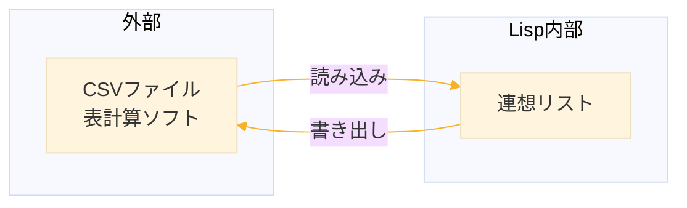
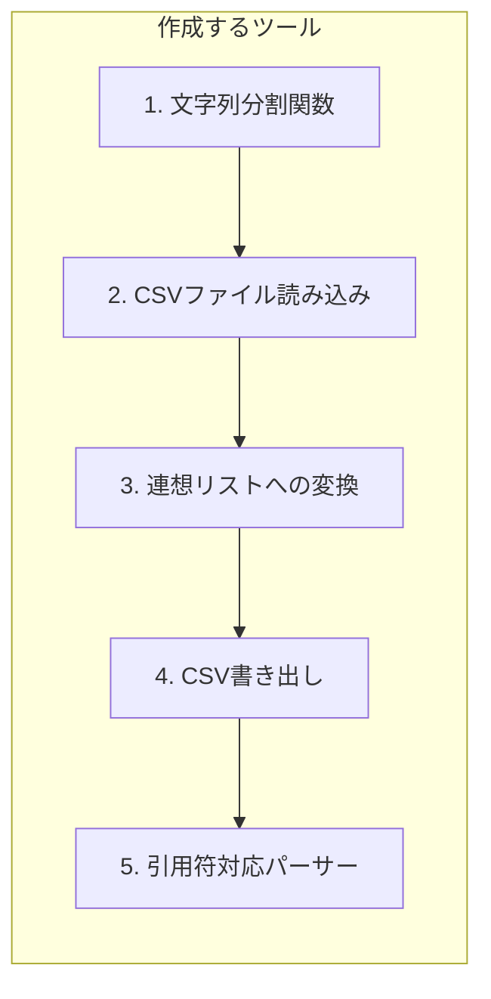
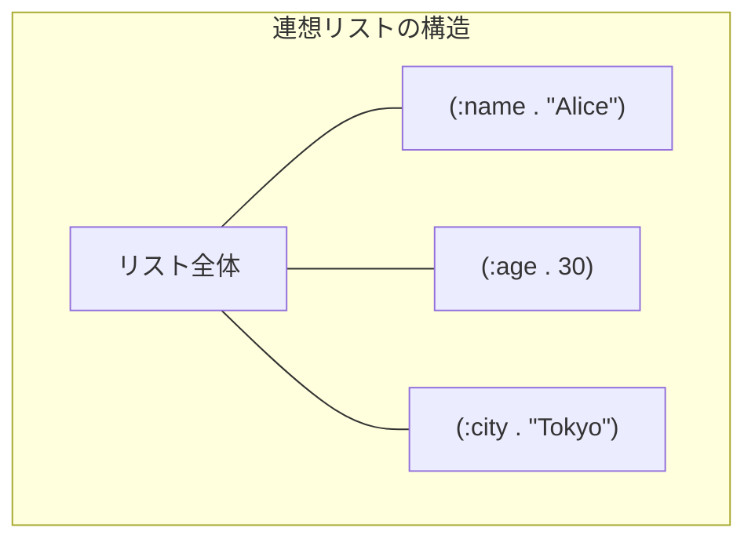
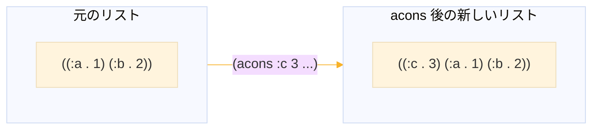
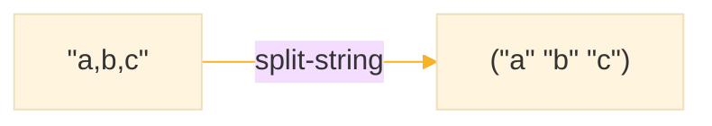
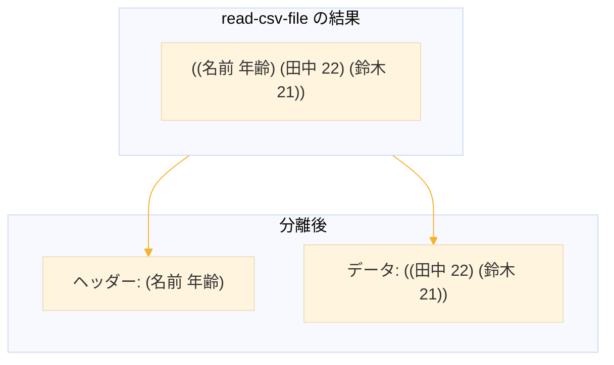
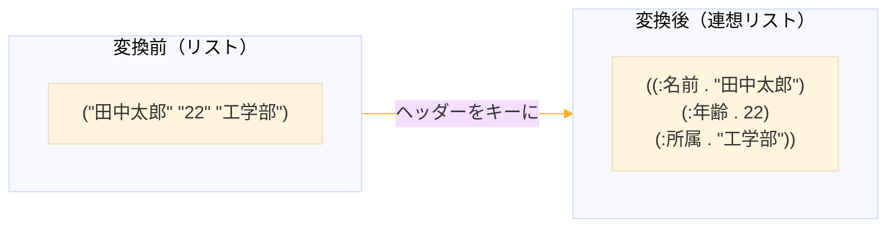
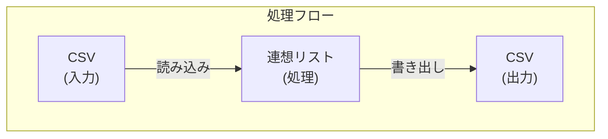
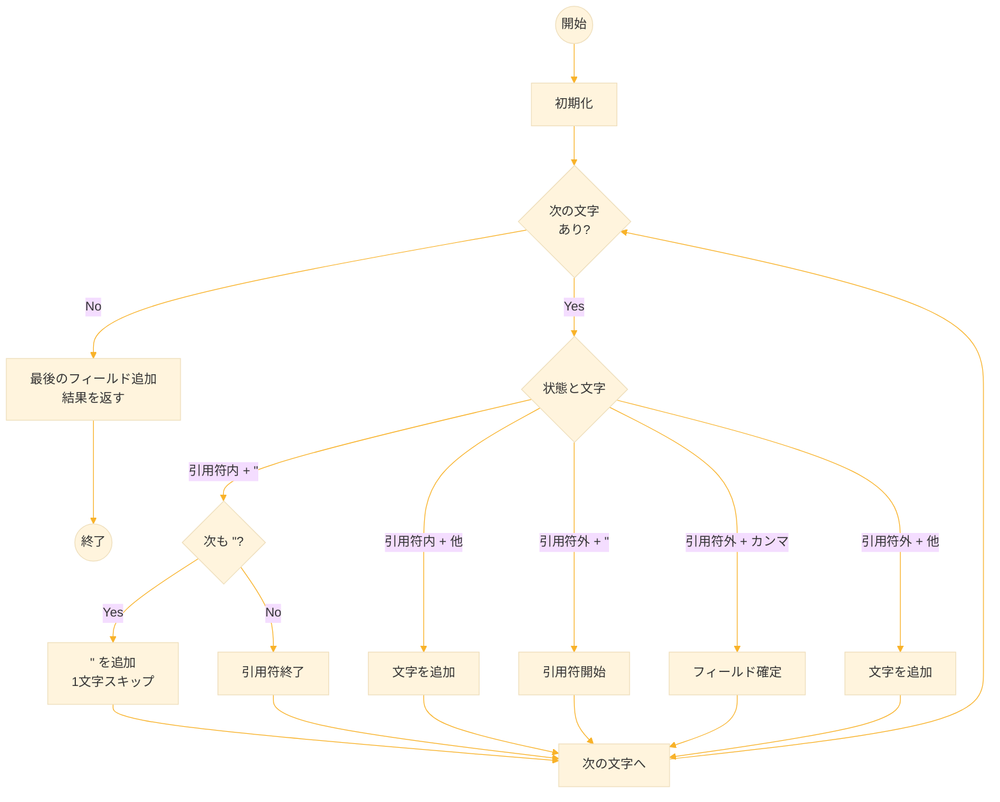
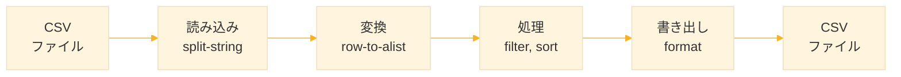

# Level 18-A (CSV処理)

## 1. この章の概要

### 1-1. 学習目標

CSV（Comma-Separated Values）は、表計算ソフトやデータベースとのデータ交換で最もよく使われる形式。この章では、CSVファイルの読み書きを通じて、実用的なデータ処理技術を習得する。



### 1-2. 扱う内容

| トピック | 説明 |
|----------|------|
| 連想リスト | キーと値のペアを管理するデータ構造 |
| CSV読み込み | ファイルからデータを読み込む |
| 型変換 | 文字列を適切な型に変換 |
| CSV書き出し | データをファイルに出力 |
| 引用符対応 | カンマを含むフィールドの処理 |

### 1-3. 作成するもの

この章では、以下のツールを段階的に作成する。




## 2. 連想リスト（alist）の基礎

### 2-1. 連想リストとは

**連想リスト（Association List, alist）** は、キーと値のペアを管理するデータ構造。ドットペア `(key . value)` をリストにまとめた形式で、CSVの各行を表現するのに適している。



```lisp
;;; 基本形式：((key1 . value1) (key2 . value2) ...)
;;; 各要素はドットペア（キーと値の組）
(defparameter *person*
  '((:name . "Alice")    ; キーワードシンボル :name と値 "Alice"
    (:age . 30)          ; 数値も値にできる
    (:city . "Tokyo")))  ; 任意の型を混在可能
```

**なぜ連想リストを使うのか**

| 利点 | 説明 |
|------|------|
| シンプル | 特別な構文なしで作成できる |
| 柔軟 | キーも値も任意の型 |
| 標準関数あり | `assoc`, `acons` などが用意されている |
| 可読性 | 内容が一目でわかる |

### 2-2. 検索：assoc

`assoc` は連想リストからキーでペアを検索する。見つかればドットペア全体を、見つからなければ `NIL` を返す。

```lisp
;;; assoc：キーで検索
;;; 戻り値はドットペア全体（値だけではない）
(assoc :name *person*)
;; → (:NAME . "Alice")

;;; 値だけ取り出すには cdr を使う
(cdr (assoc :name *person*))
;; → "Alice"

;;; 存在しないキーは NIL
(assoc :email *person*)
;; → NIL

;;; NIL の cdr も NIL なので安全
(cdr (assoc :email *person*))
;; → NIL
```

**文字列キーの場合**

デフォルトでは `eql` で比較するため、文字列キーには `:test` を指定する。

```lisp
;;; 文字列キーの連想リスト
(defparameter *data*
  '(("name" . "Bob")
    ("age" . 25)))

;;; :test #'string= で文字列比較
(assoc "name" *data* :test #'string=)
;; → ("name" . "Bob")
```

### 2-3. 追加：acons

`acons` は新しいペアを連想リストの**先頭に追加**する。元のリストは変更しない（非破壊的）。



```lisp
;;; acons：先頭に追加（非破壊的）
;;; 元のリストは変更されない
(defparameter *person2*
  (acons :email "alice@example.com" *person*))

*person2*
;; → ((:EMAIL . "alice@example.com") (:NAME . "Alice") (:AGE . 30) (:CITY . "Tokyo"))

*person*  ; 元のリストは変更されていない
;; → ((:NAME . "Alice") (:AGE . 30) (:CITY . "Tokyo"))
```

**値の更新**

同じキーを先頭に追加すると、`assoc` は最初に見つかったものを返すため、実質的に更新になる。

```lisp
;;; 同じキーを先頭に追加すると「更新」になる
(defparameter *person3*
  (acons :age 31 *person*))

*person3*
;; → ((:AGE . 31) (:NAME . "Alice") (:AGE . 30) (:CITY . "Tokyo"))
;;    ↑新しい値    古い値はそのまま残る↑

(cdr (assoc :age *person3*))
;; → 31（最初に見つかった値）
```

### 2-4. 便利なユーティリティ関数

実用的なプログラムでよく使う関数を定義しておく。

```lisp
(defun alist-get (alist key &optional default)
  "連想リストから値を取得する。なければ default を返す。"
  (let ((pair (assoc key alist)))  ; キーでペアを検索
    (if pair
        (cdr pair)     ; 見つかれば値を返す
        default)))     ; なければデフォルト値

(defun alist-set (alist key value)
  "連想リストの値を更新する（非破壊的）。
   既存のキーは削除してから新しい値を追加。"
  (acons key value 
         (remove key alist :key #'car)))  ; 既存のキーを削除

(defun alist-keys (alist)
  "連想リストのキー一覧を返す。"
  (mapcar #'car alist))

(defun alist-values (alist)
  "連想リストの値一覧を返す。"
  (mapcar #'cdr alist))
```

**使用例**

```lisp
(alist-get *person* :name)
;; → "Alice"

(alist-get *person* :email "unknown")
;; → "unknown"（存在しないのでデフォルト）

(alist-keys *person*)
;; → (:NAME :AGE :CITY)

(alist-values *person*)
;; → ("Alice" 30 "Tokyo")

;;; alist-set は重複なく更新
(alist-set *person* :age 31)
;; → ((:AGE . 31) (:NAME . "Alice") (:CITY . "Tokyo"))
```


## 3. CSV形式の理解

### 3-1. CSVとは

CSV（Comma-Separated Values）は、データをカンマで区切ったテキスト形式。シンプルで人間にも読みやすく、ほぼすべての表計算ソフトやデータベースが対応している。

```csv:students.csv
名前,年齢,所属
田中太郎,22,工学部
鈴木花子,21,文学部
山田一郎,23,理学部
```

**CSVファイル作成時の注意**

表計算ソフトからCSVを出力すると、フィールドがダブルクォートで囲まれることがある。本章の単純なパーサーでは引用符を処理しないため、引用符なしのCSVを使用すること。引用符対応は「7. 引用符対応（発展）」を参照。

### 3-2. CSVの基本ルール

| ルール | 説明 | 例 |
|--------|------|-----|
| カンマ区切り | 各フィールドをカンマで区切る | `a,b,c` |
| 1行1レコード | 改行でレコードを区切る | |
| ヘッダー行 | 1行目は列名（オプション） | `名前,年齢` |
| ダブルクォート | 特殊文字を含む場合に囲む | `"a,b",c` |

### 3-3. 特殊なケース

実際のCSVでは、フィールド内にカンマや改行を含むことがある。

```csv
"田中, 太郎",22,工学部          # カンマを含む値
"彼は""天才""だ",20,文学部      # ダブルクォート自体を含む値
```

**エスケープルール**
- フィールドにカンマ、改行、ダブルクォートを含む場合 → 全体をダブルクォートで囲む
- フィールド内のダブルクォート → 2つ重ねる（`""` → `"`）


## 4. CSVの読み込み

### 4-1. ステップ1：文字列の分割

CSV処理の基本は、カンマで文字列を分割すること。まず単純な分割関数を作る。



```lisp
(defun split-string (string delimiter)
  "文字列を区切り文字で分割してリストを返す。
   例：(split-string \"a,b,c\" #\\,) → (\"a\" \"b\" \"c\")"
  (let ((result '())      ; 結果を格納するリスト
        (start 0))        ; 現在の開始位置
    ;; 文字列全体を1文字ずつ走査
    (dotimes (i (length string))
      (when (char= (char string i) delimiter)
        ;; 区切り文字を見つけたら、そこまでの部分文字列を追加
        (push (subseq string start i) result)
        (setf start (1+ i))))  ; 開始位置を区切り文字の次に更新
    ;; 最後の要素を追加（区切り文字の後ろの残り）
    (push (subseq string start) result)
    ;; push で逆順になっているので反転して返す
    (nreverse result)))
```

**動作確認**

```lisp
(split-string "田中太郎,22,工学部" #\,)
;; (田中太郎 22 工学部)

(split-string "a,b,c,d" #\,)
;; (a b c d)

(split-string "hello" #\,)
;; (hello)  ; 区切り文字がなければ1要素

(split-string "a,,c" #\,)
;; (a  c)  ; 空フィールドも保持
```

### 4-2. ステップ2：ファイルの読み込み

ファイルを1行ずつ読み込んで、各行を分割する。

```lisp
(defun read-csv-file (filename)
  "CSVファイルを読み込んでリストのリストを返す。"
  (with-open-file (stream filename
                   :direction :input
                   :external-format :utf-8)
    (loop for raw-line = (read-line stream nil nil)
          while raw-line
          ;; 改行文字（CR/LF）と空白をトリム
          for line = (string-trim '(#\Space #\Tab #\Return #\Newline) raw-line)
          unless (zerop (length line))
          collect (split-string line #\,))))
```

**使用例**

```lisp
;;; students.csv の内容
;;; 名前,年齢,所属
;;; 田中太郎,22,工学部
;;; 鈴木花子,21,文学部

(read-csv-file "students.csv")
;; ((名前 年齢 所属)
;;  (田中太郎 22 工学部)
;;  (鈴木花子 21 文学部))
```

**改行コードについて**

OSによって改行の表現が異なる。`read-line` は改行で分割するが、Windows形式（CR+LF）の場合、CR（`#\Return`）が残ることがある。

| OS | 改行コード | 文字 |
|----|-----------|------|
| Unix/Linux/Mac | LF | `#\Newline` |
| Windows | CR+LF | `#\Return` + `#\Newline` |

`string-trim` で両方を除去すると、どのOSで作成されたファイルでも正しく処理できる。

### 4-3. ステップ3：ヘッダーとデータの分離

1行目をヘッダー（列名）として扱い、残りをデータとして分離する。



```lisp
(defun read-csv-with-header (filename)
  "CSVを読み込み、(ヘッダー . データリスト) を返す。"
  (let ((rows (read-csv-file filename)))
    (cons (first rows)      ; 1行目がヘッダー
          (rest rows))))    ; 2行目以降がデータ

;;; 使用例
(read-csv-with-header "students.csv")
;; ((名前 年齢 所属)           ; car でヘッダー取得
;;  (田中太郎 22 工学部)       ; cdr でデータ取得
;;  (鈴木花子 21 文学部))
```


## 5. S式への変換

### 5-1. 変換の目的

CSVを読み込んだだけでは「リストのリスト」で、各列が何を表すかわからない。ヘッダーをキーにした連想リストに変換すると、名前でアクセスできて便利。



### 5-2. キーワードへの変換

ヘッダーの文字列をキーワードシンボルに変換する。キーワードは `:name` のように先頭にコロンがつくシンボルで、どのパッケージからも同じものを参照できる。

```lisp
(defun string-to-keyword (string)
  "文字列をキーワードシンボルに変換する。
   例：\"名前\" → :名前"
  ;; intern でシンボルを作成
  ;; :keyword パッケージに作成するとキーワードになる
  (intern string :keyword))
```

**使用例**

```lisp
(string-to-keyword "名前")
;; 名前

(string-to-keyword "age")
;; age

;;; キーワードであることは keywordp で確認できる
(keywordp (string-to-keyword "名前"))
;; T
```

**REPLの表示について**

処理系や設定によって、REPLでの表示が異なることがある
- キーワードのコロン（`:`）が表示されない場合がある
- 文字列のダブルクォート（`"`）が表示されない場合がある

`keywordp` や `stringp` で型を確認できる。

### 5-3. 型の自動変換

CSVから読み込んだ値はすべて文字列。数値として扱いたい場合は変換が必要。

```lisp
(defun parse-value (string)
  "文字列を適切な型に変換する（型推論）。
   数字のみなら整数に、それ以外は文字列のまま。"
  (let ((trimmed (string-trim '(#\Space #\Tab #\Return #\Newline) string)))
    (cond
      ;; 空文字列は NIL
      ((zerop (length trimmed)) nil)
      ;; すべて数字なら整数に変換
      ((every #'digit-char-p trimmed)
       (let ((n (parse-integer trimmed))) n))
      ;; それ以外は文字列のまま
      (t trimmed))))
```

**使用例**

```lisp
(parse-value "22")
;; 22

(parse-value "工学部")
;; 工学部

(parse-value "  ")
;; NIL
```

**補足：parse-integer の戻り値**

`parse-integer` は2つの値を返す（多値）
- 第1戻り値：パースした整数
- 第2戻り値：パースを終了した位置

第1戻り値のみが必要な場合は `let` で束縛する。`let` は第1戻り値のみを変数に格納する。

### 5-4. 1行を連想リストに変換

ヘッダーと値のリストから連想リストを作る。

```lisp
(defun row-to-alist (headers values &key (type-convert t))
  "ヘッダーと値のリストから連想リストを作る。
   type-convert が T なら数値文字列を数値に変換。"
  (mapcar (lambda (h v)
            ;; キーワードと値のドットペアを作成
            (cons (string-to-keyword h)
                  (if type-convert
                      (parse-value v)
                      v)))
          headers
          values))
```

**使用例**

```lisp
(row-to-alist '("名前" "年齢" "所属")
              '("田中太郎" "22" "工学部"))
;; ((名前 . 田中太郎) (年齢 . 22) (所属 . 工学部))
```

### 5-5. 完全な変換関数

ファイル読み込みから連想リスト変換までをまとめる。

```lisp
(defun csv-to-alists (filename &key (type-convert t))
  "CSVファイルを読み込み、連想リストのリストを返す。
   1行目をヘッダーとして使用する。"
  (let* ((rows (read-csv-file filename))
         (headers (first rows))    ; 1行目をヘッダーに
         (data (rest rows)))       ; 残りがデータ
    ;; 各データ行を連想リストに変換
    (mapcar (lambda (row)
              (row-to-alist headers row :type-convert type-convert))
            data)))
```

**使用例**

```lisp
(csv-to-alists "students.csv")
;; (((名前 . 田中太郎) (年齢 . 22) (所属 . 工学部))
;;  ((名前 . 鈴木花子) (年齢 . 21) (所属 . 文学部))
;;  ((名前 . 山田一郎) (年齢 . 23) (所属 . 理学部)))

;;; 型変換なしで読み込む
(csv-to-alists "students.csv" :type-convert nil)
;; (((名前 . 田中太郎) (年齢 . 22) (所属 . 工学部))
;;  ...)  ; 年齢も文字列のまま
```

### 5-6. データへのアクセス

変換後のデータは、`assoc` でキーを指定してアクセスできる。

```lisp
(defparameter *students* (csv-to-alists "students.csv"))

;;; 1人目の名前を取得
(cdr (assoc :名前 (first *students*)))
;; → 田中太郎

;;; 全員の名前を取得
(mapcar (lambda (s) (cdr (assoc :名前 s))) *students*)
;; → (田中太郎 鈴木花子 山田一郎)

;;; 22歳以上の学生を抽出
(remove-if-not (lambda (s)
                 (>= (cdr (assoc :年齢 s)) 22))
               *students*)
;; → 田中太郎と山田一郎のデータ
```


## 6. CSVの書き出し

### 6-1. 逆変換の必要性

処理したデータを他のツールで使うために、連想リストからCSVに戻す機能も必要。



### 6-2. format の活用

`format` の `~{~}` ディレクティブを使うと、リストを簡単にカンマ区切りで出力できる。

```lisp
;;; ~{~} はリストの各要素に適用
(format nil "~{~A~}" '(1 2 3))
;; 123

;;; ~^ は最後の要素では出力しない（区切り文字に最適）
(format nil "~{~A~^,~}" '(1 2 3))
;; 1,2,3

;;; ~% は改行
(format nil "~{~A~^,~}~%" '(a b c))
;; A,B,C
```

### 6-3. 連想リストからCSV行への変換

```lisp
(defun alist-to-csv-row (alist keys)
  "連想リストを指定キーの順でCSV行に変換する。"
  ;; keys の順番で値を取り出し、カンマ区切りで結合
  (format nil "~{~A~^,~}"
          (mapcar (lambda (key)
                    (let ((val (cdr (assoc key alist))))
                      (if val 
                          (format nil "~A" val)  ; 値を文字列化
                          "")))                  ; NIL なら空文字
                  keys)))
```

**使用例**

```lisp
(alist-to-csv-row '((:名前 . "田中太郎") (:年齢 . 22) (:所属 . "工学部"))
                   '(:名前 :年齢 :所属))
;; 田中太郎,22,工学部
```

### 6-4. ファイルへの書き出し

```lisp
(defun alists-to-csv (alists filename keys)
  "連想リストのリストをCSVファイルに出力する。
   keys でカラムの順番を指定する。"
  (with-open-file (out filename
                   :direction :output           ; 書き込みモード
                   :if-exists :supersede        ; 既存ファイルは上書き
                   :external-format :utf-8)
    ;; ヘッダー行を出力
    (format out "~{~A~^,~}~%"
            (mapcar (lambda (k)
                      (string-downcase (symbol-name k)))
                    keys))
    ;; データ行を出力
    (dolist (alist alists)
      (format out "~A~%" (alist-to-csv-row alist keys)))))
```

**使用例**

```lisp
;;; データを処理して新しいCSVに出力
(defparameter *students* (csv-to-alists "students.csv"))

;;; 22歳以上の学生だけを抽出
(defparameter *seniors*
  (remove-if-not (lambda (s) (>= (cdr (assoc :年齢 s)) 22))
                 *students*))

;;; CSVに出力
(alists-to-csv *seniors* "seniors.csv" '(:名前 :年齢 :所属))
```

出力ファイル（seniors.csv）

```csv
名前,年齢,所属
田中太郎,22,工学部
山田一郎,23,理学部
```


## 7. 引用符対応（発展）

### 7-1. なぜ引用符対応が必要か

実際のCSVでは、フィールド内にカンマが含まれることがある。単純な `split-string` では正しく処理できない。

```
入力: "田中, 太郎",22,工学部

単純な分割: ("\"田中" " 太郎\"" "22" "工学部")  ← 間違い
正しい分割: ("田中, 太郎" "22" "工学部")        ← 正しい
```

### 7-2. 状態機械による実装

引用符の内側かどうかを追跡しながら分割する。



```lisp
(defun parse-csv-line (line &optional (delimiter #\,))
  "引用符を考慮してCSV行を分割する。
   RFC 4180 準拠のパーサー。"
  (let ((fields nil)      ; 結果のフィールドリスト
        (current (make-array 0 :element-type 'character
                              :adjustable t :fill-pointer 0))
        (in-quote nil)    ; 引用符内かどうかのフラグ
        (i 0)
        (len (length line)))
    
    (loop while (< i len) do
      (let ((char (char line i)))
        (cond
          ;; ケース1: 引用符内で引用符に遭遇
          ((and in-quote (char= char #\"))
           (if (and (< (1+ i) len)
                    (char= (char line (1+ i)) #\"))
               ;; "" はエスケープされた引用符 → " を1つ追加
               (progn
                 (vector-push-extend #\" current)
                 (incf i))  ; 次の " をスキップ
               ;; 単独の " は引用符の終了
               (setf in-quote nil)))
          
          ;; ケース2: 引用符内の通常文字
          (in-quote
           (vector-push-extend char current))
          
          ;; ケース3: 引用符の開始
          ((char= char #\")
           (setf in-quote t))
          
          ;; ケース4: 区切り文字（引用符の外）
          ((char= char delimiter)
           (push (copy-seq current) fields)
           (setf (fill-pointer current) 0))  ; バッファをクリア
          
          ;; ケース5: 通常の文字
          (t
           (vector-push-extend char current))))
      (incf i))
    
    ;; 最後のフィールドを追加
    (push (copy-seq current) fields)
    (nreverse fields)))
```

### 7-3. 動作テスト

```lisp
;;; 通常のケース
(parse-csv-line "a,b,c")
;; (a b c)

;;; カンマを含む値
(parse-csv-line "\"田中, 太郎\",22,工学部")
;; (田中, 太郎 22 工学部)

;;; エスケープされた引用符
(parse-csv-line "\"彼は\"\"天才\"\"です\",20")
;; (彼は"天才"です 20)

;;; 複合的なケース
(parse-csv-line "\"A,B\",\"C\"\"D\",E")
;; (A,B C"D E)
```

### 7-4. 引用符付き出力

書き出し時も、必要に応じて引用符で囲む。

```lisp
(defun needs-quoting-p (string)
  "値に引用符が必要かどうか判定する。"
  (or (find #\, string)       ; カンマを含む
      (find #\" string)       ; 引用符を含む
      (find #\Newline string))) ; 改行を含む

(defun quote-csv-value (value)
  "必要に応じて値を引用符で囲む。"
  (let ((str (format nil "~A" value)))
    (if (needs-quoting-p str)
        ;; 引用符を "" にエスケープして全体を "" で囲む
        (format nil "\"~A\""
                (with-output-to-string (out)
                  (loop for c across str do
                    (when (char= c #\")
                      (write-char #\" out))  ; " を "" に
                    (write-char c out))))
        str)))
```

**使用例**

```lisp
(quote-csv-value "hello")
;; hello

(quote-csv-value "a,b")
;; "a,b"

(quote-csv-value "say \"hi\"")
;; "say ""hi"""
```


## 8. 練習課題

### 課題1：基本（必須）

以下の要件を満たすプログラムを作成せよ。

1. テスト用CSVファイルを作成する関数
2. CSVを読み込んで全データを表示する関数
3. 特定条件（例：22歳以上）でフィルタリングする関数
4. 結果を新しいCSVファイルに出力


### 課題2：統計処理

CSVデータに対して以下の統計処理を行う関数を作成せよ。

```lisp
;;; 指定キーの合計を計算
(csv-sum *students* :成績)
;; → 340

;;; 指定キーの平均を計算
(csv-average *students* :成績)
;; → 85.0

;;; 指定キーの最大値を持つ行を返す
(csv-max-by *students* :成績)
;; → ((名前 . 高橋三郎) (成績 . 95) ...)
```


### 課題3：検索関数

様々な条件でデータを検索する関数を作成せよ。

```lisp
;;; キーの値が一致する行を検索
(csv-find-by *students* :所属 "工学部")
;; → 工学部の学生全員

;;; 条件に一致する最初の行を返す
(csv-find-first *students* :名前 "田中太郎")
;; → 田中太郎のデータ
```


### 課題4：引用符対応（発展）

以下のCSVを正しく処理できることを確認せよ。

```csv
商品名,価格,説明
りんご,100,甘くて美味しい
"バナナ, 大",150,"南国産, ""厳選""品"
みかん,80,愛媛産
```


## 9. 練習課題の解答

### 課題1の解答

```lisp
;;;; 課題1：基本的なCSV処理

(defun create-test-csv ()
  "テスト用のCSVファイルを作成する。"
  (with-open-file (out "students.csv"
                   :direction :output
                   :if-exists :supersede
                   :external-format :utf-8)
    (format out "名前,年齢,所属,成績~%")
    (format out "田中太郎,22,工学部,85~%")
    (format out "鈴木花子,21,文学部,92~%")
    (format out "山田一郎,23,理学部,78~%")
    (format out "佐藤次郎,20,経済学部,81~%")
    (format out "高橋三郎,24,工学部,95~%"))
  (format t "students.csv を作成しました。~%"))

(defun display-students (students)
  "学生データを整形して表示する。"
  (format t "~%=== 学生一覧 ===~%")
  (format t "~20A ~4A ~10A ~4A~%" "名前" "年齢" "所属" "成績")
  (format t "~40,,,'-A~%" "")  ; 区切り線
  (dolist (s students)
    (format t "~20A ~4D ~10A ~4D~%"
            (cdr (assoc :名前 s))
            (cdr (assoc :年齢 s))
            (cdr (assoc :所属 s))
            (cdr (assoc :成績 s))))
  (format t "~%合計: ~D名~%" (length students)))

(defun filter-by-age (students min-age)
  "指定年齢以上の学生を抽出する。"
  (remove-if-not (lambda (s)
                   (>= (cdr (assoc :年齢 s)) min-age))
                 students))

(defun task1-main ()
  "課題1のメイン関数"
  ;; 1. テストデータ作成
  (create-test-csv)
  
  ;; 2. 読み込んで全データ表示
  (let ((students (csv-to-alists "students.csv")))
    (display-students students)
    
    ;; 3. フィルタリング
    (let ((seniors (filter-by-age students 22)))
      (format t "~%=== 22歳以上の学生 ===~%")
      (display-students seniors)
      
      ;; 4. 結果をCSVに出力
      (alists-to-csv seniors "seniors.csv" '(:名前 :年齢 :所属 :成績))
      (format t "seniors.csv に出力しました。~%"))))
```

**実行結果**

```
CL-USER> (task1-main)
students.csv を作成しました。

=== 学生一覧 ===
名前                 年齢 所属       成績
----------------------------------------
田中太郎               22 工学部       85
鈴木花子               21 文学部       92
山田一郎               23 理学部       78
佐藤次郎               20 経済学部     81
高橋三郎               24 工学部       95

合計: 5名

=== 22歳以上の学生 ===
名前                 年齢 所属       成績
----------------------------------------
田中太郎               22 工学部       85
山田一郎               23 理学部       78
高橋三郎               24 工学部       95

合計: 3名
seniors.csv に出力しました。
```


### 課題2の解答

```lisp
;;;; 課題2：統計処理

(defun csv-sum (alists key)
  "指定キーの合計を計算する。"
  (reduce #'+ alists
          :key (lambda (row) 
                 (or (cdr (assoc key row)) 0))))

(defun csv-average (alists key)
  "指定キーの平均を計算する。"
  (if (null alists)
      0
      (/ (csv-sum alists key) 
         (length alists))))

(defun csv-max-by (alists key)
  "指定キーが最大の行を返す。"
  (reduce (lambda (a b)
            (if (> (or (cdr (assoc key a)) 0)
                   (or (cdr (assoc key b)) 0))
                a b))
          alists))

(defun csv-min-by (alists key)
  "指定キーが最小の行を返す。"
  (reduce (lambda (a b)
            (if (< (or (cdr (assoc key a)) 0)
                   (or (cdr (assoc key b)) 0))
                a b))
          alists))
```

**使用例**

```lisp
(defparameter *students* (csv-to-alists "students.csv"))

(csv-sum *students* :成績)
;; → 431

(csv-average *students* :成績)
;; → 431/5 (または 86.2)

(cdr (assoc :名前 (csv-max-by *students* :成績)))
;; → 高橋三郎

(cdr (assoc :名前 (csv-min-by *students* :成績)))
;; → 山田一郎
```


### 課題3の解答

```lisp
;;;; 課題3：検索関数

(defun csv-find-by (alists key value &key (test #'equal))
  "キーの値が一致する全ての行を返す。"
  (remove-if-not (lambda (row)
                   (funcall test (cdr (assoc key row)) value))
                 alists))

(defun csv-find-first (alists key value &key (test #'equal))
  "キーの値が一致する最初の行を返す。"
  (find-if (lambda (row)
             (funcall test (cdr (assoc key row)) value))
           alists))

(defun csv-filter (alists key predicate)
  "述語関数で行を絞り込む。"
  (remove-if-not (lambda (row)
                   (funcall predicate (cdr (assoc key row))))
                 alists))

(defun csv-sort (alists key &key (test #'<))
  "指定キーでソートする（非破壊的）。"
  (sort (copy-list alists)
        (lambda (a b)
          (funcall test
                   (cdr (assoc key a))
                   (cdr (assoc key b))))))
```

**使用例**

```lisp
;;; 工学部の学生を検索
(csv-find-by *students* :所属 "工学部")
;; → 田中太郎と高橋三郎のデータ

;;; 田中太郎を検索
(csv-find-first *students* :名前 "田中太郎")
;; → 田中太郎のデータ

;;; 成績80点以上を抽出
(csv-filter *students* :成績 (lambda (v) (>= v 80)))
;; → 80点以上の学生

;;; 成績順でソート（降順）
(mapcar (lambda (s) (cdr (assoc :名前 s)))
        (csv-sort *students* :成績 :test #'>))
;; → (高橋三郎 鈴木花子 田中太郎 佐藤次郎 山田一郎)
```


### 課題4の解答

```lisp
;;;; 課題4：引用符対応テスト

(defun create-quoted-csv ()
  "引用符を含むテストCSVを作成する。"
  (with-open-file (out "products.csv"
                   :direction :output
                   :if-exists :supersede
                   :external-format :utf-8)
    (format out "商品名,価格,説明~%")
    (format out "りんご,100,甘くて美味しい~%")
    (format out "\"バナナ, 大\",150,\"南国産, \"\"厳選\"\"品\"~%")
    (format out "みかん,80,愛媛産~%"))
  (format t "products.csv を作成しました。~%"))

(defun read-quoted-csv-file (filename)
  "引用符対応でCSVファイルを読み込む。"
  (with-open-file (stream filename
                   :direction :input
                   :external-format :utf-8)
    (loop for raw-line = (read-line stream nil nil)
          while raw-line
          for line = (string-trim '(#\Space #\Tab #\Return #\Newline) raw-line)
          unless (zerop (length line))
          collect (parse-csv-line line))))

(defun quoted-csv-to-alists (filename)
  "引用符対応CSVを連想リストに変換する。"
  (let* ((rows (read-quoted-csv-file filename))
         (headers (first rows))
         (data (rest rows)))
    (mapcar (lambda (row)
              (row-to-alist headers row))
            data)))

(defun test-quoted-csv ()
  "引用符対応のテスト"
  (create-quoted-csv)
  
  (format t "~%=== 生の分割結果 ===~%")
  (dolist (row (read-quoted-csv-file "products.csv"))
    (format t "~S~%" row))
  
  (format t "~%=== 連想リストに変換 ===~%")
  (let ((products (quoted-csv-to-alists "products.csv")))
    (dolist (p products)
      (format t "商品: ~A~%" (cdr (assoc :商品名 p)))
      (format t "  価格: ~A円~%" (cdr (assoc :価格 p)))
      (format t "  説明: ~A~%~%" (cdr (assoc :説明 p))))))
```

**実行結果**

```
CL-USER> (test-quoted-csv)
products.csv を作成しました。

=== 生の分割結果 ===
(商品名 価格 説明)
(りんご 100 甘くて美味しい)
(バナナ, 大 150 南国産, "厳選"品)
(みかん 80 愛媛産)

=== 連想リストに変換 ===
商品: りんご
  価格: 100円
  説明: 甘くて美味しい

商品: バナナ, 大
  価格: 150円
  説明: 南国産, "厳選"品

商品: みかん
  価格: 80円
  説明: 愛媛産
```


## 10. まとめ

### この章で学んだこと

1. **連想リスト** - `assoc`, `acons`
2. **文字列分割** - `split-string`
3. **CSV読み込み** - `read-csv-file`
4. **型変換** - `parse-value`
5. **CSV書き出し** - `alists-to-csv`
6. **引用符対応** - `parse-csv-line`

### 処理の全体像



### 主要な関数一覧

| 関数 | 用途 |
|------|------|
| `split-string` | 文字列を区切り文字で分割 |
| `read-csv-file` | CSVファイルを読み込む |
| `csv-to-alists` | CSVを連想リストに変換 |
| `alists-to-csv` | 連想リストをCSVに出力 |
| `parse-csv-line` | 引用符対応で行を分割 |
| `assoc` | 連想リストからキーで検索 |
| `acons` | 連想リストに追加 |

### 設計のポイント

1. **非破壊的な操作** - `acons`, `remove-if-not` は元のデータを変更しない
2. **段階的な処理** - 読み込み → 変換 → 処理 → 出力 を分離
3. **型変換のオプション化** - 必要に応じて有効/無効を切り替え
4. **エラーケースへの対応** - 空行、空フィールド、特殊文字


