# Level 18-B (JSON処理とデータ変換)
## 1. この章の概要

### 1-1. 学習目標

Level 18-A で学んだ CSV 処理を発展させ、JSON 形式の読み書きとデータ変換技術を習得する。複数のデータ形式を相互変換し、実用的なデータ処理ツールを作成する。

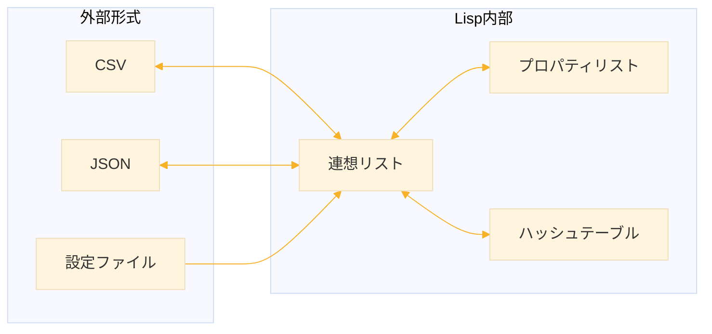

### 1-2. 扱う内容

| トピック | 説明 |
|----------|------|
| プロパティリスト | キーと値が交互に並ぶデータ構造 |
| JSON パース | JSON 文字列を Lisp データに変換 |
| JSON 生成 | Lisp データを JSON 文字列に変換 |
| 設定ファイル | INI/JSON 形式の設定管理 |
| データ集計 | グループ化、合計、カウント |

### 1-3. 前提知識

この章は Level 18-A の知識を前提とする。

- 連想リスト（alist）の基本操作
- `assoc`, `acons` の使い方
- CSV の読み書き


## 2. プロパティリスト（plist）

### 2-1. プロパティリストとは

**プロパティリスト（Property List, plist）** は、キーと値が交互に並ぶフラットなリスト。関数のキーワード引数と同じ構造で、設定やオプションの管理に便利。

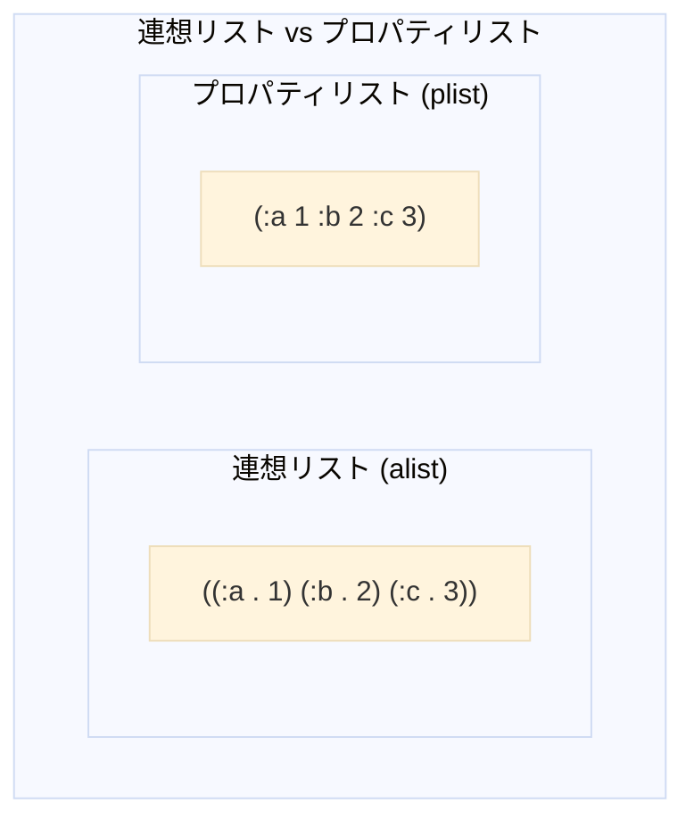

```lisp
;;; プロパティリストの基本形式
;;; (key1 value1 key2 value2 ...)
;;; キーと値が交互に並ぶ
(defparameter *config*
  '(:host "localhost"   ; キー :host、値 "localhost"
    :port 8080          ; キー :port、値 8080
    :debug t))          ; キー :debug、値 t
```

**実行例**

```lisp
(defparameter *config*
    '(:host "localhost" :port 8080 :debug t))
;; *CONFIG*

*config*
;; (HOST localhost PORT 8080 DEBUG T)
```

### 2-2. 基本操作：getf

`getf` はプロパティリストから値を取得する。連想リストの `assoc` と違い、ペアではなく**値を直接返す**。

```lisp
;;; getf：キーで値を取得
(getf *config* :host)
;; → localhost

(getf *config* :port)
;; → 8080

;;; 存在しないキーはデフォルト値を返す（省略時は NIL）
(getf *config* :timeout)
;; → NIL

(getf *config* :timeout 30)
;; → 30（デフォルト値）
```

**実行例**

```lisp
;;; 値の取得
(getf *config* :host)
;; localhost

(getf *config* :port)
;; 8080

(getf *config* :debug)
;; T

;;; 存在しないキー
(getf *config* :timeout)
;; NIL

;;; デフォルト値を指定
(getf *config* :timeout 30)
;; 30
```

**assoc との比較**

```lisp
;;; 連想リストの場合
(defparameter *alist* '((:host . "localhost") (:port . 8080)))
;; *ALIST*

(assoc :host *alist*)
(HOST . localhost)      ; ← ペア全体が返る

(cdr (assoc :host *alist*))
;; localhost               ; ← 値を取るには cdr が必要

;;; プロパティリストの場合
(getf *config* :host)
;; localhost               ; ← 値が直接返る
```

### 2-3. 更新と削除

`setf` と `getf` を組み合わせて値を更新する。`remf` でキーを削除する。どちらも**破壊的**操作。

```lisp
;;; setf + getf：値を更新（破壊的）
(setf (getf *config* :port) 3000)
*config*
;; → (HOST localhost PORT 3000 DEBUG T)

;;; 新しいキーを追加
(setf (getf *config* :timeout) 60)
*config*
;; → (TIMEOUT 60 HOST localhost PORT 3000 DEBUG T)

;;; remf：キーと値を削除（破壊的）
(remf *config* :debug)
*config*
;; → (TIMEOUT 60 HOST localhost PORT 3000)
```

**実行例**

```lisp
;;; 新しい plist を作成
(defparameter *settings* '(:name "test" :count 10))
;; *SETTINGS*

*settings*
;; (NAME test COUNT 10)

;;; 値を更新
(setf (getf *settings* :count) 20)
;; 20

*settings*
;; (NAME test COUNT 20)

;;; 新しいキーを追加（先頭に追加される）
(setf (getf *settings* :active) t)
;; T

*settings*
;; (ACTIVE T NAME test COUNT 20)

;;; キーと値を削除
(remf *settings* :name)
;; T                       ; 削除成功

*settings*
;; (ACTIVE T COUNT 20)
```

### 2-4. 連想リストとの相互変換

用途に応じて使い分けるため、相互変換できると便利。

```lisp
(defun alist-to-plist (alist)
  "連想リストをプロパティリストに変換する。"
  ;; loop の分配束縛でドットペアを (key . value) に分解
  (loop for (key . value) in alist
        collect key      ; キーを集める
        collect value))  ; 値を集める

(defun plist-to-alist (plist)
  "プロパティリストを連想リストに変換する。"
  ;; on plist by #'cddr：2要素ずつ進む
  ;; (key value) で2要素をまとめて受け取る
  (loop for (key value) on plist by #'cddr
        collect (cons key value)))
```

**実行例**

```lisp
;;; 連想リストからプロパティリストへ
(defparameter *my-alist* '((:a . 1) (:b . 2) (:c . 3)))
;; *MY-ALIST*

(alist-to-plist *my-alist*)
;; (A 1 B 2 C 3)

;;; 動作の解説
;;; (:a . 1) → key = :a, value = 1 → collect :a, collect 1
;;; (:b . 2) → key = :b, value = 2 → collect :b, collect 2
;;; (:c . 3) → key = :c, value = 3 → collect :c, collect 3
;;; 結果：(:a 1 :b 2 :c 3)

;;; プロパティリストから連想リストへ
(defparameter *my-plist* '(:x 10 :y 20 :z 30))
;; *MY-PLIST*

(plist-to-alist *my-plist*)
;; ((X . 10) (Y . 20) (Z . 30))

;;; 動作の解説
;;; 1回目: (key value) = (:x 10) → (cons :x 10) = (:x . 10)
;;; 2回目: (key value) = (:y 20) → (cons :y 20) = (:y . 20)
;;; 3回目: (key value) = (:z 30) → (cons :z 30) = (:z . 30)
;;; 結果：((:x . 10) (:y . 20) (:z . 30))

;;; 相互変換の確認
(plist-to-alist (alist-to-plist '((:name . "Alice") (:age . 30))))
;; ((NAME . Alice) (AGE . 30))
```

### 2-5. 使い分けの指針

| 場面 | 選択 | 理由 |
|------|------|------|
| 関数のオプション | plist | `&key` と同じ構造 |
| データベース的な用途 | alist | `assoc` で検索しやすい |
| JSON との相互変換 | alist | オブジェクト構造と対応 |
| 設定の一時保持 | plist | `getf` が簡潔 |


## 3. JSON の理解

### 3-1. JSON とは

JSON（JavaScript Object Notation）は、Web API で標準的に使われるデータ形式。人間にも読みやすく、多くのプログラミング言語でサポートされている。

```json
{
  "name": "Alice",
  "age": 30,
  "active": true,
  "scores": [85, 90, 78]
}
```

### 3-2. JSON と Lisp の対応

JSON の各型は Lisp のデータ構造と自然に対応する。

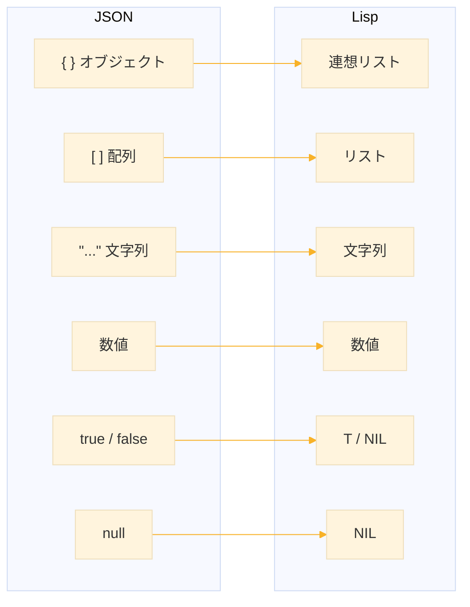

| JSON | Lisp | 例 |
|------|------|-----|
| オブジェクト `{}` | 連想リスト | `{"a": 1}` → `((:A . 1))` |
| 配列 `[]` | リスト | `[1, 2]` → `(1 2)` |
| 文字列 `"..."` | 文字列 | `"hello"` → `"hello"` |
| 数値 | 数値 | `42` → `42` |
| `true` | T | |
| `false`, `null` | NIL | |

### 3-3. JSON の構文規則

JSON の構文は単純だが、厳密に定義されている。

```
値 = オブジェクト | 配列 | 文字列 | 数値 | true | false | null

オブジェクト = "{" [メンバー ("," メンバー)*] "}"
メンバー = 文字列 ":" 値

配列 = "[" [値 ("," 値)*] "]"

文字列 = '"' 文字* '"'
```


## 4. JSON パーサーの実装

### 4-1. パーサーの構造

再帰下降構文解析で実装する。各関数は「パース結果」と「次の位置」を**多値**で返す。

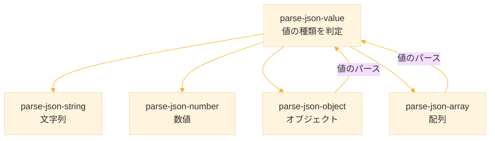

### 4-2. ユーティリティ関数

```lisp
(defun skip-whitespace (string pos)
  "空白文字をスキップして次の位置を返す。"
  (loop while (and (< pos (length string))
                   (member (char string pos)
                           '(#\Space #\Tab #\Newline #\Return)))
        do (incf pos))
  pos)

(defun string-to-keyword (string)
  "文字列をキーワードシンボルに変換する。"
  (intern string :keyword))
```

**実行例**

```lisp
;;; 空白スキップ
(skip-whitespace "   hello" 0)
;; 3                       ; 3文字目から非空白

(skip-whitespace "hello" 0)
;; 0                       ; 先頭が非空白なら0

(skip-whitespace "  x  y" 0)
;; 2                       ; 最初の空白だけスキップ

;;; 文字列からキーワードへ
(string-to-keyword "name")
;; name

(keywordp (string-to-keyword "name"))
;; T
```

### 4-3. 文字列のパース

JSON 文字列は `"` で囲まれ、`\n` などのエスケープシーケンスを含む。

```lisp
(defun parse-json-string (string pos)
  "JSON 文字列をパースする。
   戻り値：(values 文字列 次の位置)"
  ;; 開始位置が " であることを確認
  (assert (char= (char string pos) #\"))
  (incf pos)  ; 開始の " をスキップ
  
  (let ((result (make-array 0 :element-type 'character
                             :adjustable t :fill-pointer 0)))
    (loop while (< pos (length string))
          for char = (char string pos)
          do (cond
               ;; 終了の "
               ((char= char #\")
                (return-from parse-json-string
                  (values result (1+ pos))))
               ;; エスケープシーケンス
               ((char= char #\\)
                (incf pos)
                (vector-push-extend
                 (case (char string pos)
                   (#\n #\Newline)  ; \n → 改行
                   (#\t #\Tab)      ; \t → タブ
                   (#\r #\Return)   ; \r → 復帰
                   (#\" #\")        ; \" → "
                   (#\\ #\\)        ; \\ → \
                   (t (char string pos)))
                 result))
               ;; 通常の文字
               (t
                (vector-push-extend char result)))
             (incf pos))
    (error "Unterminated string at position ~A" pos)))
```

**実行例**

```lisp
;;; 単純な文字列
(parse-json-string "\"hello\"" 0)
;; hello                   ; 第1戻り値：パースした文字列
;; 7                       ; 第2戻り値：次の位置

;;; 動作の解説
;;; 位置0: " → 開始、スキップ
;;; 位置1-5: h,e,l,l,o → 文字を追加
;;; 位置6: " → 終了
;;; 結果: "hello", 次の位置は7

;;; エスケープシーケンスを含む文字列
(parse-json-string "\"line1\\nline2\"" 0)
;; line1
;; line2                   ; \n が改行に変換された
;; 14

;;; 途中から開始
(parse-json-string "xxx\"world\"yyy" 3)
;; world
;; 10
```

### 4-4. 数値のパース

数値を構成する文字を集めて、Lisp の `read-from-string` で変換する。

```lisp
(defun parse-json-number (string pos)
  "JSON 数値をパースする。
   戻り値：(values 数値 次の位置)"
  (let ((end pos))
    ;; 数値を構成する文字を探す
    (loop while (and (< end (length string))
                     (or (digit-char-p (char string end))
                         (member (char string end)
                                 '(#\- #\+ #\. #\e #\E))))
          do (incf end))
    ;; Lisp の数値に変換
    (let ((n (read-from-string (subseq string pos end))))
      (values n end))))
```

**実行例**

```lisp
;;; 整数
(parse-json-number "42" 0)
;; 42                      ; パースした数値
;; 2                       ; 次の位置

;;; 負の整数
(parse-json-number "-123" 0)
;; -123
;; 4

;;; 浮動小数点数
(parse-json-number "3.14159" 0)
;; 3.14159
;; 7

;;; 指数表記
(parse-json-number "1.5e10" 0)
;; 1.5e10
;; 6

;;; JSON の一部として
(parse-json-number "100, next" 0)
;; 100                     ; カンマの前で停止
;; 3                       ; 次の位置（カンマの位置）
```

### 4-5. 値のパース（メインディスパッチ）

最初の文字を見て、適切なパーサーを呼び出す。

```lisp
(defun parse-json-value (string pos)
  "JSON の値をパースする。最初の文字で種類を判定。
   戻り値：(values 値 次の位置)"
  (setf pos (skip-whitespace string pos))
  
  (when (>= pos (length string))
    (error "Unexpected end of input"))
  
  (let ((char (char string pos)))
    (cond
      ;; " → 文字列
      ((char= char #\")
       (parse-json-string string pos))
      
      ;; 数字または - → 数値
      ((or (digit-char-p char) (char= char #\-))
       (parse-json-number string pos))
      
      ;; { → オブジェクト
      ((char= char #\{)
       (parse-json-object string pos))
      
      ;; [ → 配列
      ((char= char #\[)
       (parse-json-array string pos))
      
      ;; true
      ((and (>= (- (length string) pos) 4)
            (string= "true" (subseq string pos (+ pos 4))))
       (values t (+ pos 4)))
      
      ;; false
      ((and (>= (- (length string) pos) 5)
            (string= "false" (subseq string pos (+ pos 5))))
       (values nil (+ pos 5)))
      
      ;; null
      ((and (>= (- (length string) pos) 4)
            (string= "null" (subseq string pos (+ pos 4))))
       (values nil (+ pos 4)))
      
      (t
       (error "Unexpected character '~A' at position ~A" char pos)))))
```

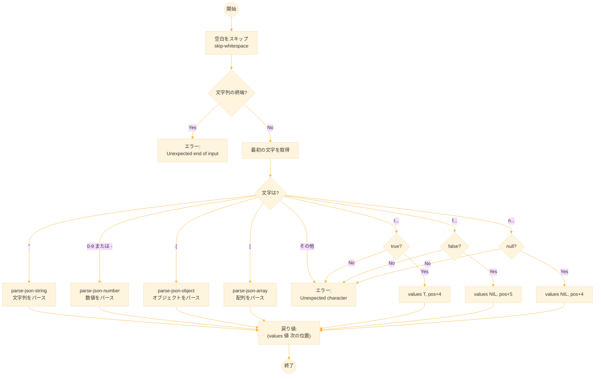

**実行例**

```lisp
;;; 文字列
(parse-json-value "\"hello\"" 0)
;; hello
;; 7

;;; 数値
(parse-json-value "42" 0)
;; 42
;; 2

;;; 真偽値
(parse-json-value "true" 0)
;; T
;; 4

(parse-json-value "false" 0)
;; NIL
;; 5

;;; null
(parse-json-value "null" 0)
;; NIL
;; 4

;;; 空白をスキップして値をパース
(parse-json-value "   123" 0)
;; 123
;; 6                       ; 空白3 + 数字3
```

### 4-6. オブジェクトのパース

`{...}` を連想リストに変換する。キーと値のペアをカンマで区切って読み取る。

```lisp
(defun parse-json-object (string pos)
  "JSON オブジェクトをパースして連想リストを返す。
   戻り値：(values 連想リスト 次の位置)"
  (assert (char= (char string pos) #\{))
  (incf pos)
  (setf pos (skip-whitespace string pos))
  
  (let ((result nil))
    (loop
      ;; } で終了（空オブジェクトまたは最後）
      (when (char= (char string pos) #\})
        (return-from parse-json-object
          (values (nreverse result) (1+ pos))))
      
      ;; キー（必ず文字列）をパース
      (multiple-value-bind (key new-pos)
          (parse-json-string string pos)
        (setf pos (skip-whitespace string new-pos))
        
        ;; : でキーと値を区切る
        (unless (char= (char string pos) #\:)
          (error "Expected ':' at position ~A" pos))
        (incf pos)
        
        ;; 値をパース
        (multiple-value-bind (value new-pos)
            (parse-json-value string pos)
          ;; キーワードシンボルに変換してペアを作成
          (push (cons (string-to-keyword key) value) result)
          (setf pos (skip-whitespace string new-pos))))
      
      ;; , で次のペアへ、} で終了
      (cond
        ((char= (char string pos) #\,)
         (incf pos)
         (setf pos (skip-whitespace string pos)))
        ((char= (char string pos) #\})
         (return-from parse-json-object
           (values (nreverse result) (1+ pos))))
        (t
         (error "Expected ',' or '}' at position ~A" pos))))))
```

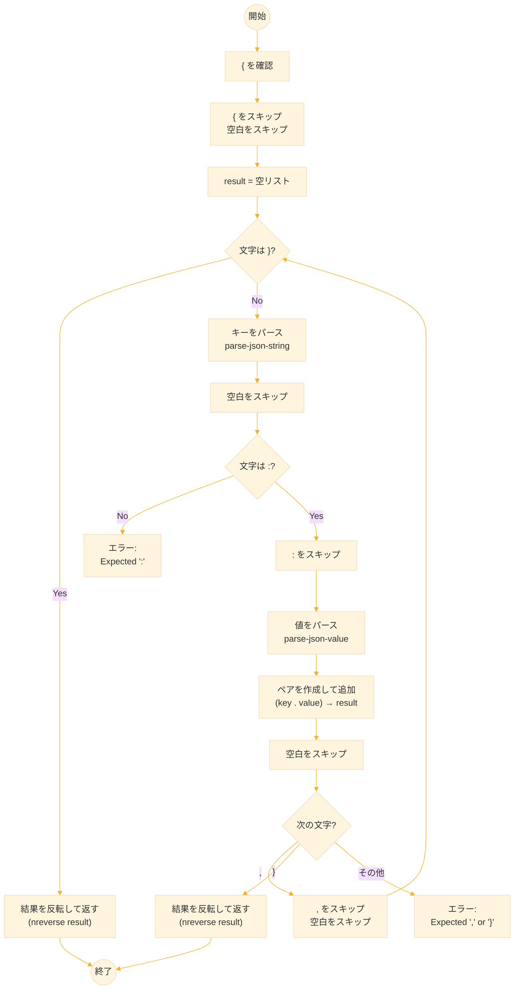

**実行例**

```lisp
;;; 空オブジェクト
(parse-json-object "{}" 0)
;; NIL
;; 2

;;; 単一ペア
(parse-json-object "{\"name\": \"Alice\"}" 0)
;; ((name . Alice))
;; 17

;;; 複数ペア
CL-USER> (parse-json-object "{\"name\": \"Alice\", \"age\": 30}" 0)
((name . Alice) (age . 30))
28
```

処理の流れ
1. { をスキップ
2. "name" をパース → キー "name"
3. : をスキップ
4. "Alice" をパース → 値 "Alice"
5. (:name . "Alice") を追加
6. , をスキップ
7. "age" をパース → キー "age"
8. : をスキップ
9. 30 をパース → 値 30
10. (:age . 30) を追加
11. } で終了

### 4-7. 配列のパース

`[...]` をリストに変換する。

```lisp
(defun parse-json-array (string pos)
  "JSON 配列をパースしてリストを返す。
   戻り値：(values リスト 次の位置)"
  (assert (char= (char string pos) #\[))
  (incf pos)
  (setf pos (skip-whitespace string pos))
  
  (let ((result nil))
    (loop
      ;; ] で終了（空配列または最後）
      (when (char= (char string pos) #\])
        (return-from parse-json-array
          (values (nreverse result) (1+ pos))))
      
      ;; 値をパース
      (multiple-value-bind (value new-pos)
          (parse-json-value string pos)
        (push value result)
        (setf pos (skip-whitespace string new-pos)))
      
      ;; , で次の値へ、] で終了
      (cond
        ((char= (char string pos) #\,)
         (incf pos)
         (setf pos (skip-whitespace string pos)))
        ((char= (char string pos) #\])
         (return-from parse-json-array
           (values (nreverse result) (1+ pos))))
        (t
         (error "Expected ',' or ']' at position ~A" pos))))))
```

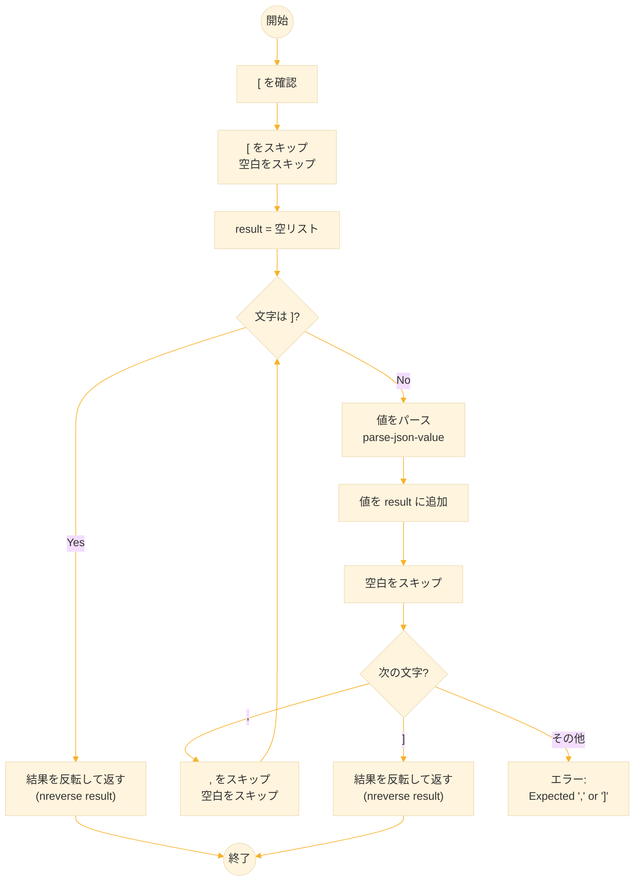
**実行例**

```lisp
;;; 空配列
(parse-json-array "[]" 0)
;; NIL
;; 2

;;; 数値の配列
(parse-json-array "[1, 2, 3]" 0)
;; (1 2 3)
;; 9

;;; 混合型の配列
(parse-json-array "[\"a\", 42, true]" 0)
;; (a 42 T)
;; 16

;;; ネストした配列
(parse-json-array "[[1, 2], [3, 4]]" 0)
;; ((1 2) (3 4))
;; 16
```

### 4-8. エントリーポイント

```lisp
(defun parse-json (string)
  "JSON 文字列をパースする（エントリーポイント）。"
  (multiple-value-bind (result pos)
      (parse-json-value string 0)
    (declare (ignore pos))
    result))
```

**実行例**

```lisp
;;; オブジェクト
(parse-json "{\"name\": \"Alice\", \"age\": 30}")
;; ((name . Alice) (age . 30))

;;; 配列
(parse-json "[1, 2, 3]")
;; (1 2 3)

;;; ネストしたデータ
(parse-json "{\"users\": [{\"name\": \"Alice\"}, {\"name\": \"Bob\"}]}")
;; ((users ((name . Alice)) ((name . Bob))))

;;; 真偽値と null
(parse-json "{\"active\": true, \"deleted\": false, \"data\": null}")
;; ((active . T) (deleted) (data))

;;; 複雑な例
(parse-json "{
   \"company\": \"Acme\",
   \"employees\": [
     {\"name\": \"Alice\", \"role\": \"Engineer\"},
     {\"name\": \"Bob\", \"role\": \"Designer\"}
   ],
   \"active\": true
 }")
;; ((company . Acme)
;;  (employees ((name . Alice) (role . Engineer))
;;             ((name . Bob) (role . Designer)))
;;  (active . T))
```

**REPLの表示について**

処理系や設定によって、REPLでの表示が異なることがある
- キーワードのコロン（`:`）が表示されない場合がある
- 文字列のダブルクォート（`"`）が表示されない場合がある

`keywordp` や `stringp` で型を確認できる。


## 5. JSON 生成

### 5-1. 基本方針

Lisp のデータ構造を JSON 文字列に変換する。`typecase` で値の型を判定し、適切な表現に変換する。

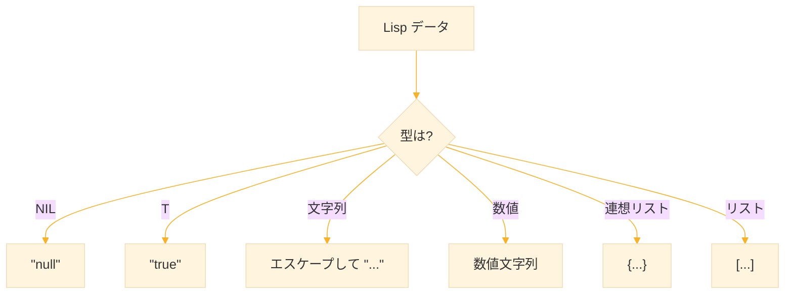

### 5-2. ヘルパー関数

```lisp
(defun escape-json-string (string)
  "JSON 用に文字列をエスケープする。"
  (with-output-to-string (out)
    (loop for char across string do
      (case char
        (#\Newline (write-string "\\n" out))
        (#\Tab (write-string "\\t" out))
        (#\Return (write-string "\\r" out))
        (#\" (write-string "\\\"" out))
        (#\\ (write-string "\\\\" out))
        (t (write-char char out))))))

(defun to-json-object (alist)
  "連想リストを JSON オブジェクトに変換する。"
  (format nil "{~{~A~^, ~}}"
          (mapcar (lambda (pair)
                    (format nil "\"~A\": ~A"
                            (string-downcase (symbol-name (car pair)))
                            (to-json (cdr pair))))
                  alist)))

(defun to-json-array (list)
  "リストを JSON 配列に変換する。"
  (format nil "[~{~A~^, ~}]"
          (mapcar #'to-json list)))
```

**実行例**

```lisp
;;; 文字列のエスケープ
(escape-json-string "hello")
;; hello

(escape-json-string "line1
line2")
;; line1\nline2

(escape-json-string "say \"hi\"")
;; say \"hi\"

;;; 配列変換（to-json 定義後）
(to-json-array '(1 2 3))
;; [1, 2, 3]

;;; オブジェクト変換（to-json 定義後）
(to-json-object '((:name . "Alice") (:age . 30)))
;; {"name": "Alice", "age": 30}
```

### 5-3. メイン関数

```lisp
(defun to-json (value)
  "Lisp の値を JSON 文字列に変換する。"
  (typecase value
    ;; NIL → "null"
    ;; 注意：空リストも NIL なので最初に判定
    (null "null")
    
    ;; T → "true"
    ((eql t) "true")
    
    ;; 文字列 → エスケープして "" で囲む
    (string
     (format nil "\"~A\""
             (escape-json-string value)))
    
    ;; 数値 → そのまま文字列化
    (number
     (princ-to-string value))
    
    ;; リスト → 連想リストか配列か判定
    (list
     (if (and (consp (first value))
              (symbolp (car (first value))))
         ;; 先頭がドットペアでキーがシンボル → オブジェクト
         (to-json-object value)
         ;; 通常のリスト → 配列
         (to-json-array value)))
    
    ;; シンボル → 文字列として出力
    (symbol
     (format nil "\"~A\""
             (string-downcase (symbol-name value))))
    
    ;; その他 → エラー
    (t
     (error "Cannot convert to JSON: ~A" value))))
```

**実行例**

```lisp
;;; 基本型
(to-json "hello")
;; "hello"

(to-json 42)
;; 42

(to-json 3.14)
;; 3.14

(to-json t)
;; true

(to-json nil)
;; null

;;; 配列（通常のリスト）
(to-json '(1 2 3))
;; [1, 2, 3]

(to-json '("a" "b" "c"))
;; ["a", "b", "c"]

;;; オブジェクト（連想リスト）
(to-json '((:name . "Alice") (:age . 30)))
;; {"name": "Alice", "age": 30}

;;; ネストしたデータ
(to-json '((:users . (((:name . "Alice"))
                      ((:name . "Bob"))))))
;; {"users": [{"name": "Alice"}, {"name": "Bob"}]}

;;; 複雑な例
(to-json '((:company . "Acme")
           (:active . t)
           (:tags . ("tech" "startup"))
           (:ceo . ((:name . "Alice")
                    (:age . 35)))))
;; {"company": "Acme", "active": true, "tags": ["tech", "startup"], "ceo": {"name": "Alice", "age": 35}}

;;; parse と to-json の往復
(to-json (parse-json "{\"x\": 1, \"y\": 2}"))
;; {"x": 1, "y": 2}
```


## 6. CSV ⇔ JSON 変換

### 6-1. 変換の流れ

CSV と JSON は連想リストを介して相互変換する。

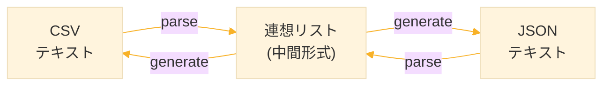

### 6-2. CSV から JSON へ

```lisp
(defun csv-to-json (csv-text)
  "CSV テキストを JSON 文字列に変換する。"
  (let* ((lines (remove-if (lambda (s)
                             (zerop (length
                                     (string-trim '(#\Space #\Tab #\Return #\Newline) s))))
                           (split-string csv-text #\Newline)))
         ;; 各行をトリム
         (lines (mapcar (lambda (s)
                          (string-trim '(#\Space #\Tab #\Return #\Newline) s))
                        lines))
         ;; 1行目をヘッダーに
         (headers (mapcar #'string-to-keyword
                          (split-string (first lines) #\,)))
         ;; 残りをデータに
         (data (mapcar (lambda (line)
                         (mapcar #'cons
                                 headers
                                 (split-string line #\,)))
                       (rest lines))))
    (to-json data)))
```

**実行例**

```lisp
;;; シンプルな変換
(csv-to-json "name,age
Alice,30
Bob,25")
;; [{"name": "Alice", "age": "30"}, {"name": "Bob", "age": "25"}]

;;; 処理の流れ
;;; 1. 行に分割：("name,age" "Alice,30" "Bob,25")
;;; 2. ヘッダー取得：(:name :age)
;;; 3. 各行を連想リストに
;;;    "Alice,30" → ((:name . "Alice") (:age . "30"))
;;;    "Bob,25"   → ((:name . "Bob") (:age . "25"))
;;; 4. JSON に変換

;;; 3列の例
(csv-to-json "name,department,salary
田中,Engineering,50000
鈴木,Sales,45000
山田,Marketing,48000")
;; [{"name": "田中", "department": "Engineering", "salary": "50000"}, {"name": "鈴木", "department": "Sales", "salary": "45000"}, {"name": "山田", "department": "Marketing", "salary": "48000"}]
```

### 6-3. JSON から CSV へ

```lisp
(defun json-to-csv (json-text)
  "JSON 配列を CSV 文字列に変換する。
   JSON はオブジェクトの配列であること。"
  (let ((data (parse-json json-text)))
    ;; 配列で、各要素が連想リスト形式かチェック
    (unless (and (listp data)
                 (listp (first data))
                 (consp (first (first data))))
      (error "JSON must be an array of objects"))
    
    (let ((keys (mapcar #'car (first data))))
      (with-output-to-string (out)
        ;; ヘッダー行
        (format out "~{~A~^,~}~%"
                (mapcar (lambda (k)
                          (string-downcase (symbol-name k)))
                        keys))
        ;; データ行
        (dolist (row data)
          (format out "~{~A~^,~}~%"
                  (mapcar (lambda (k)
                            (let ((v (cdr (assoc k row))))
                              (if v (format nil "~A" v) "")))
                          keys)))))))
```

**実行例**

```lisp
;;; JSON から CSV へ変換
(json-to-csv "[{\"name\": \"Alice\", \"age\": 30}, {\"name\": \"Bob\", \"age\": 25}]")
;; name,age
;; Alice,30
;; Bob,25

;;; 処理の流れ
;;; 1. JSON をパース：(((:name . "Alice") (:age . 30)) ...)
;;; 2. キーを取得：(:name :age)
;;; 3. ヘッダー行出力："name,age"
;;; 4. 各行のデータ出力："Alice,30", "Bob,25"

;;; 往復テスト
(json-to-csv (csv-to-json "x,y,z
1,2,3
4,5,6"))
;; x,y,z
;; 1,2,3
;; 4,5,6
```


## 7. 設定ファイル管理

### 7-1. INI 形式パーサー

INI 形式はセクションとキー＝値で構成される設定ファイル形式。

```ini
## コメント
app_name = MyApp
debug = true

[database]
host = localhost
port = 5432

[paths]
home = ${HOME}
```

### 7-2. 型推論

設定値を適切な型に変換する。

```lisp
(defun parse-config-value (string)
  "設定値を適切な型に変換する。"
  (let ((trimmed (string-trim '(#\Space #\Tab) string)))
    (cond
      ;; 空文字列
      ((zerop (length trimmed)) nil)
      
      ;; 真偽値（大文字小文字を区別しない）
      ((member trimmed '("true" "yes" "on" "1") :test #'string-equal)
       t)
      ((member trimmed '("false" "no" "off" "0") :test #'string-equal)
       nil)
      
      ;; 整数
      ((every #'digit-char-p trimmed)
       (let ((n (parse-integer trimmed))) n))
      
      ;; 引用符で囲まれた文字列
      ((and (>= (length trimmed) 2)
            (char= (char trimmed 0) #\")
            (char= (char trimmed (1- (length trimmed))) #\"))
       (subseq trimmed 1 (1- (length trimmed))))
      
      ;; その他は文字列
      (t trimmed))))
```

**実行例**

```lisp
;;; 真偽値
(parse-config-value "true")
;; T

(parse-config-value "false")
;; NIL

(parse-config-value "yes")
;; T

(parse-config-value "no")
;; NIL

;;; 整数
(parse-config-value "8080")
;; 8080

(parse-config-value "0")
;; NIL                     ; "0" は false として扱われる

;;; 引用符付き文字列
(parse-config-value "\"hello world\"")
;; hello world

;;; 通常の文字列
(parse-config-value "localhost")
;; localhost

;;; 空文字列
(parse-config-value "")
;; NIL
```

### 7-3. 環境変数の展開

```lisp
(defun expand-env-vars (string)
  "文字列中の ${VAR} を環境変数で置換する。"
  (let ((result (make-string-output-stream))  ; 結果を構築する出力ストリーム
        (i 0)                                  ; 現在の位置
        (len (length string)))                 ; 文字列の長さ
    
    ;; 文字列を1文字ずつ走査
    (loop while (< i len) do
      (if (and (char= (char string i) #\$)         ; $ で始まり
               (< (1+ i) len)                       ; 次の文字があり
               (char= (char string (1+ i)) #\{))   ; { が続く場合
          
          ;; ${...} パターンを検出
          (let ((end (position #\} string :start (+ i 2))))  ; } の位置を探す
            (if end
                ;; } が見つかった場合：環境変数を展開
                (let* ((var-name (subseq string (+ i 2) end))   ; 変数名を抽出
                       (var-value (uiop:getenv var-name)))       ; 環境変数の値を取得
                  (when var-value
                    (write-string var-value result))  ; 値があれば書き込む
                  (setf i (1+ end)))                  ; } の次へ移動
                
                ;; } が見つからない場合：$ をそのまま出力
                (progn
                  (write-char (char string i) result)
                  (incf i))))
          
          ;; 通常の文字：そのまま出力
          (progn
            (write-char (char string i) result)
            (incf i))))
    
    ;; ストリームの内容を文字列として返す
    (get-output-stream-string result)))
```

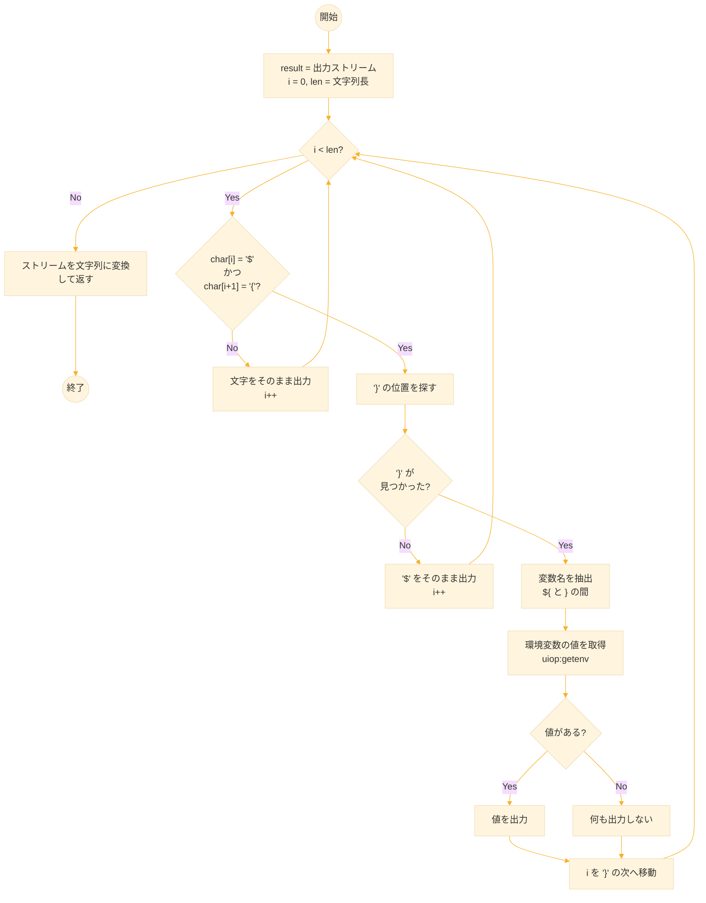

**実行例**

```lisp
;;; 環境変数なし
(expand-env-vars "hello world")
;; hello world

;;; 環境変数を展開（HOME が /home/user の場合）
(expand-env-vars "/path/${HOME}/data")
;; /path//home/user/data

;;; 複数の環境変数
(expand-env-vars "${HOME}/${USER}")
;; /home/user/username

;;; 存在しない環境変数は空文字に
(expand-env-vars "prefix-${NONEXISTENT}-suffix")
;; prefix--suffix
```

### 7-4. INI パーサー

```lisp
(defun parse-ini-line (line)
  "INI 形式の1行をパースする。
   戻り値：(:section name) | (:key-value key value) | nil"
  (let ((trimmed (string-trim '(#\Space #\Tab) line)))
    (cond
      ;; 空行
      ((zerop (length trimmed)) nil)
      
      ;; コメント（# または ;）
      ((or (char= (char trimmed 0) #\#)
           (char= (char trimmed 0) #\;))
       nil)
      
      ;; セクション [section]
      ((and (char= (char trimmed 0) #\[)
            (char= (char trimmed (1- (length trimmed))) #\]))
       (list :section
             (string-trim '(#\Space #\Tab)
                          (subseq trimmed 1 (1- (length trimmed))))))
      
      ;; key = value
      (t
       (let ((pos (position #\= trimmed)))
         (when pos
           (list :key-value
                 (string-trim '(#\Space #\Tab) (subseq trimmed 0 pos))
                 (string-trim '(#\Space #\Tab) (subseq trimmed (1+ pos))))))))))
```

**実行例**

```lisp
;;; 空行
(parse-ini-line "")
;; NIL

;;; コメント
(parse-ini-line "# this is a comment")
;; NIL

(parse-ini-line "; another comment")
;; NIL

;;; セクション
(parse-ini-line "[database]")
;; (SECTION database)

(parse-ini-line "[  server  ]")
;; (SECTION server)

;;; キー＝値
(parse-ini-line "host = localhost")
;; (KEY-VALUE host localhost)

(parse-ini-line "port=5432")
;; (KEY-VALUE port 5432)

(parse-ini-line "debug = true")
;; (KEY-VALUE debug true)
```

### 7-5. INI ファイル読み込み

```lisp
(defun read-ini-file (filename &key (expand-env t))
  "INI ファイルを読み込んでネストした連想リストを返す。
   戻り値：((section-name . ((key . value) ...)) ...)"
  (let ((result '())              ; 結果の連想リスト
        (current-section nil))    ; 現在処理中のセクション名
    
    (with-open-file (in filename :direction :input
                                 :external-format :utf-8)
      ;; ファイルを1行ずつ読み込む
      (loop for line = (read-line in nil nil)
            while line
            for parsed = (parse-ini-line line)  ; 行をパース
            when parsed do
              (case (first parsed)
                
                ;; [section] の場合
                (:section
                 (setf current-section (second parsed))
                 ;; セクションが未登録なら追加
                 (unless (assoc current-section result :test #'equal)
                   (push (cons current-section '()) result)))
                
                ;; key = value の場合
                (:key-value
                 (let* ((key (second parsed))
                        (raw-value (third parsed))
                        ;; 環境変数を展開（オプション）
                        (expanded (if expand-env
                                      (expand-env-vars raw-value)
                                      raw-value))
                        ;; 型変換（数値、真偽値など）
                        (value (parse-config-value expanded))
                        ;; 現在のセクションを検索
                        (section-entry (assoc current-section result
                                              :test #'equal)))
                   ;; セクションにキー・値ペアを追加
                   (if section-entry
                       (push (cons key value) (cdr section-entry))
                       ;; セクションがなければ新規作成
                       (push (cons current-section
                                   (list (cons key value)))
                             result)))))))
                             
    ;; push で逆順になっているので正順に戻す
    (mapcar (lambda (s)
              (cons (car s) (nreverse (cdr s))))  ; 各セクション内も反転
            (nreverse result))))                   ; セクション順も反転
```

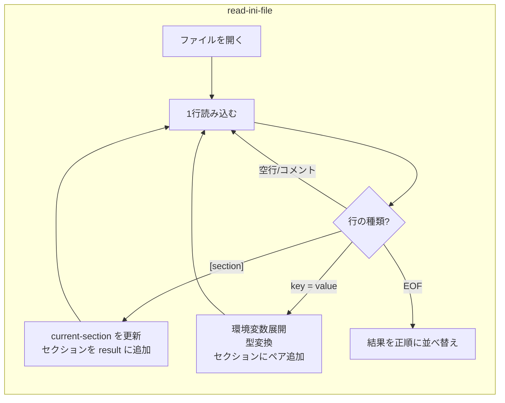

```lisp 
(defun config-get (config section key &optional default)
  "設定値を取得する。section が nil ならグローバル設定。"
  ;; セクションを検索
  (let ((section-data (cdr (assoc section config :test #'equal))))
    (if section-data
        ;; セクション内でキーを検索
        (let ((entry (assoc key section-data :test #'equal)))
          (if entry
              (cdr entry)    ; 値を返す
              default))      ; キーがなければデフォルト値
        default)))           ; セクションがなければデフォルト値
```


**実行例**

```lisp
;;; app.ini の内容
;;; app_name = MyApp
;;; debug = true
;;; version = 2
;;;
;;; [database]
;;; host = localhost
;;; port = 5432
;;;
;;; [logging]
;;; level = info
;;; file = /var/log/app.log

(defparameter *config* (read-ini-file "app.ini"))
;; *CONFIG*

*config*
;; ((NIL (app_name . MyApp) (debug . T) (version . 2))
;;  (database (host . localhost) (port . 5432))
;;  (logging (level . info) (file . /var/log/app.log)))

;;; グローバル設定の取得（section = nil）
(config-get *config* nil "app_name")
;; MyApp

(config-get *config* nil "debug")
;; T

(config-get *config* nil "version")
;; 2

;;; セクション内の設定
(config-get *config* "database" "host")
;; localhost

(config-get *config* "database" "port")
;; 5432

(config-get *config* "logging" "level")
;; info

;;; 存在しない設定にはデフォルト値
(config-get *config* "database" "timeout" 30)
;; 30

(config-get *config* "cache" "size" 1024)
;; 1024
```


## 8. データ集計ツール

### 8-1. グループ化

SQL の `GROUP BY` に相当する機能。指定したキーでデータをグループ化する。

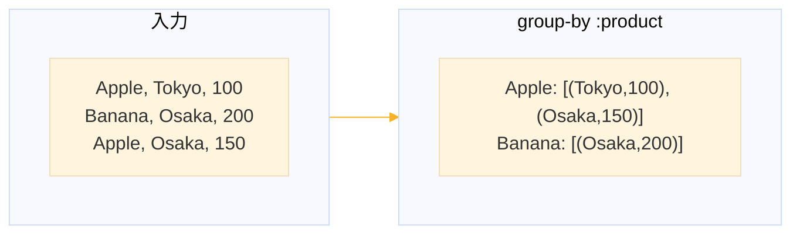

```lisp
(defun group-by (alists key)
  "連想リストのリストを指定キーでグループ化する。
   戻り値：((グループ値 . (行1 行2 ...)) ...)"
  ;; ハッシュテーブルで効率的にグループ化
  (let ((groups (make-hash-table :test 'equal)))
    (dolist (alist alists)
      (let ((group-key (cdr (assoc key alist))))
        ;; 同じキー値を持つ行をリストに追加
        (push alist (gethash group-key groups nil))))
    ;; ハッシュテーブルを連想リストに変換
    (let ((result nil))
      (maphash (lambda (k v)
                 (push (cons k (nreverse v)) result))
               groups)
      (nreverse result))))
```

**実行例**

```lisp
;;; テストデータ
(defparameter *sales*
           '(((product . Apple)  (region . Tokyo) (amount . 100))
             ((product . Banana) (region . Osaka) (amount . 200))
             ((product . Apple)  (region . Osaka) (amount . 150))
             ((product . Banana) (region . Tokyo) (amount . 180))
             ((product . Apple)  (region . Tokyo) (amount . 120))))
;; *SALES*

;;; 商品でグループ化
(group-by *sales* :product)
;; ((Apple . (((product . Apple) (region . Tokyo) (amount . 100))
;;            ((product . Apple) (region . Osaka) (amount . 150))
;;            ((product . Apple) (region . Tokyo) (amount . 120))))
;;  (Banana . (((product . Banana) (region . Osaka) (amount . 200))
;;             ((product . Banana) (region . Tokyo) (amount . 180)))))

;;; 地域でグループ化
(group-by *sales* :region)
;; ((Tokyo . (((product . Apple) (region . Tokyo) (amount . 100))
;;            ((product . Banana) (region . Tokyo) (amount . 180))
;;            ((product . Apple) (region . Tokyo) (amount . 120))))
;;  (Osaka . (((product . Banana) (region . Osaka) (amount . 200))
;;            ((product . Apple) (region . Osaka) (amount . 150)))))
```

### 8-2. 集計関数

```lisp
(defun sum-by (alists group-key value-key)
  "グループごとの合計を計算する。"
  ;; まずグループ化
  (let ((grouped (group-by alists group-key)))
    ;; 各グループを (グループ値 . 合計) に変換
    (mapcar (lambda (group)
              (cons (car group)  ; グループのキー値
                    ;; グループ内の値を合計
                    (reduce #'+
                            (mapcar (lambda (row)
                                      (let ((val (cdr (assoc value-key row))))
                                        ;; 文字列なら数値に変換、なければ 0
                                        (if (stringp val)
                                            (or (parse-integer val :junk-allowed t) 0)
                                            (or val 0))))
                                    (cdr group)))))  ; グループ内の全行
            grouped)))


(defun count-by (alists key)
  "グループごとの件数を数える。"
  ;; まずグループ化
  (let ((grouped (group-by alists key)))
    ;; 各グループを (グループ値 . 件数) に変換
    (mapcar (lambda (group)
              (cons (car group)          ; グループのキー値
                    (length (cdr group)))) ; グループ内の行数
            grouped)))


(defun average-by (alists group-key value-key)
  "グループごとの平均を計算する。"
  ;; まずグループ化
  (let ((grouped (group-by alists group-key)))
    ;; 各グループを (グループ値 . 平均) に変換
    (mapcar (lambda (group)
              (let* ((rows (cdr group))  ; グループ内の全行
                     ;; 各行から数値を抽出
                     (values (mapcar (lambda (row)
                                       (let ((val (cdr (assoc value-key row))))
                                         ;; 文字列なら数値に変換、なければ 0
                                         (if (stringp val)
                                             (or (parse-integer val :junk-allowed t) 0)
                                             (or val 0))))
                                     rows))
                     (sum (reduce #'+ values))    ; 合計
                     (count (length values)))     ; 件数
                (cons (car group)
                      ;; 0除算を避けて平均を計算
                      (if (zerop count) 0 (/ sum count)))))
            grouped)))
```

**実行例**

```lisp
;;; 商品ごとの売上合計
(sum-by *sales* :product :amount)
;; ((Apple . 370) (Banana . 380))

;;; 処理の流れ
;;; 1. group-by で商品ごとにグループ化
;;; 2. Apple グループ: 100 + 150 + 120 = 370
;;; 3. Banana グループ: 200 + 180 = 380

;;; 地域ごとの売上合計
(sum-by *sales* :region :amount)
;; ((Tokyo . 400) (Osaka . 350))

;;; 商品ごとの件数
(count-by *sales* :product)
;; ((Apple . 3) (Banana . 2))

;;; 地域ごとの件数
(count-by *sales* :region)
;; ((Tokyo . 3) (Osaka . 2))

;;; 商品ごとの平均売上
(average-by *sales* :product :amount)
;; ((Apple . 370/3) (Banana . 190))

;;; 小数で表示したい場合
(mapcar (lambda (pair)
            (cons (car pair) (float (cdr pair))))
                  (average-by *sales* :product :amount))
;; ((Apple . 123.33334) (Banana . 190.0))
```

### 8-3. フィルタリングとソート

```lisp
(defun csv-filter (alists key predicate)
  "条件を満たす行だけを抽出する。"
  (remove-if-not (lambda (row)
                   (funcall predicate (cdr (assoc key row))))
                 alists))

(defun csv-sort (alists key &key (test #'<))
  "指定キーでソートする（非破壊的）。"
  (sort (copy-list alists)
        (lambda (a b)
          (funcall test
                   (cdr (assoc key a))
                   (cdr (assoc key b))))))
```

**実行例**

```lisp
;;; 150以上の売上を抽出
(csv-filter *sales* :amount (lambda (v) (>= v 150)))
;; (((product . Banana) (region . Osaka) (amount . 200))
;;  ((product . Apple) (region . Osaka) (amount . 150))
;;  ((product . Banana) (region . Tokyo) (amount . 180)))

;;; Tokyo の売上を抽出
(csv-filter *sales* :region (lambda (v) (equal v "Tokyo")))
;; (((product . Apple) (region . Tokyo) (amount . 100))
;;  ((product . Banana) (region . Tokyo) (amount . 180))
;;  ((product . Apple) (region . Tokyo) (amount . 120)))

;;; 売上順でソート（昇順）
(mapcar (lambda (s) (cdr (assoc :amount s)))
                 (csv-sort *sales* :amount))
;; (100 120 150 180 200)

;;; 売上順でソート（降順）
(mapcar (lambda (s) (cons (cdr (assoc :product s))
                                    (cdr (assoc :amount s))))
                 (csv-sort *sales* :amount :test #'>))
;; ((Banana . 200) (Banana . 180) (Apple . 150) (Apple . 120) (Apple . 100))

;;; フィルタとソートの組み合わせ
(csv-sort (csv-filter *sales* :amount (lambda (v) (>= v 150)))
                   :amount :test #'>)
;; (((product . Banana) (region . Osaka) (amount . 200))
;;  ((product . Banana) (region . Tokyo) (amount . 180))
;;  ((product . Apple) (region . Osaka) (amount . 150)))
```


## 9. ハッシュテーブルとの連携

### 9-1. なぜハッシュテーブルを使うか

連想リストは要素数が多いと検索が遅くなる（O(n)）。ハッシュテーブルは検索が高速（O(1)）なので、大規模データには有利。

| データ構造 | 検索速度 | 用途 |
|-----------|----------|------|
| 連想リスト | O(n) | 小規模データ、シリアライズ |
| ハッシュテーブル | O(1) | 大規模データ、頻繁な検索 |

### 9-2. 相互変換

```lisp
(defun alist-to-hash (alist &key (test 'equal))
  "連想リストをハッシュテーブルに変換する。"
  (let ((hash (make-hash-table :test test)))
    (dolist (pair alist)
      (setf (gethash (car pair) hash) (cdr pair)))
    hash))

(defun hash-to-alist (hash)
  "ハッシュテーブルを連想リストに変換する。"
  (let ((result nil))
    (maphash (lambda (k v)
               (push (cons k v) result))
             hash)
    (nreverse result)))
```

**実行例**

```lisp
;;; 連想リストを準備
(defparameter *person-alist*
           '((:name . "Alice") (:age . 30) (:city . "Tokyo")))
;; *PERSON-ALIST*

;;; ハッシュテーブルに変換
(defparameter *person-hash*
           (alist-to-hash *person-alist*))
;; *PERSON-HASH*

;;; ハッシュテーブルから値を取得
(gethash :name *person-hash*)
;; Alice
;; T                       ; 第2戻り値：キーが存在した

(gethash :age *person-hash*)
;; 30
;; T

(gethash :email *person-hash*)
;; NIL
;; NIL                     ; 第2戻り値：キーが存在しない

;;; ハッシュテーブルに値を追加
(setf (gethash :email *person-hash*) "alice@example.com")
;; alice@example.com

(gethash :email *person-hash*)
;; alice@example.com
;; T

;;; 連想リストに戻す
(hash-to-alist *person-hash*)
;; ((name . Alice) (age . 30) (city . Tokyo) (email . alice@example.com))

;;; 大量データでの性能比較（概念的な例）
;;; 10000件のデータで検索する場合
;;; - 連想リスト: 平均5000回の比較
;;; - ハッシュテーブル: 1回のハッシュ計算 + 1回の比較
```


## 10. 練習課題

### 課題1：JSON パースの拡張

浮動小数点数と負の数を正しくパースできるように `parse-json-number` を改良せよ。

```lisp
(parse-json "{\"pi\": 3.14, \"negative\": -42}")
;; → ((pi . 3.14) (negative . -42))
```


### 課題2：連想リストのマージ

2つの連想リストをマージする関数を作れ。同じキーがあれば後の値で上書き。

```lisp
(alist-merge '((:a . 1) (:b . 2)) '((:b . 3) (:c . 4)))
;; → ((A . 1) (B . 3) (C . 4))
```


### 課題3：ネストした値へのアクセス

ネストした連想リストからパスを指定して値を取得する関数を作れ。

```lisp
(nested-get '((:user . ((:profile . ((:name . "Alice"))))))
            '(:user :profile :name))
;; → Alice
```


### 課題4：JSON バリデーション

JSON オブジェクトが必須キーを持っているか検証する関数を作れ。

```lisp
(validate-json '((:name . "Alice") (:age . 30))
               '(:name :age :email))
;; → (:EMAIL)  ; 不足しているキー
```


### 課題5：データ変換パイプライン

複数の変換処理を連結するマクロを作れ。

```lisp
(-> *sales*
    (csv-filter :region (lambda (v) (equal v "Tokyo")))
    (sum-by :product :amount))
;; → 東京の商品別売上合計
```


## 11. 練習課題の解答

### 課題1の解答

```lisp
(defun parse-json-number (string pos)
  "JSON 数値をパースする（浮動小数点・負数対応）。"
  (let ((end pos))
    ;; 負号をスキップ
    (when (and (< end (length string))
               (char= (char string end) #\-))
      (incf end))
    ;; 整数部
    (loop while (and (< end (length string))
                     (digit-char-p (char string end)))
          do (incf end))
    ;; 小数部
    (when (and (< end (length string))
               (char= (char string end) #\.))
      (incf end)
      (loop while (and (< end (length string))
                       (digit-char-p (char string end)))
            do (incf end)))
    ;; 指数部
    (when (and (< end (length string))
               (member (char string end) '(#\e #\E)))
      (incf end)
      (when (and (< end (length string))
                 (member (char string end) '(#\+ #\-)))
        (incf end))
      (loop while (and (< end (length string))
                       (digit-char-p (char string end)))
            do (incf end)))
    ;; パースして返す
    (let ((n (read-from-string (subseq string pos end))))
      (values n end))))
```

**テスト**

```lisp
(parse-json-number "3.14159" 0)
;; 3.14159
;; 7

(parse-json-number "-42" 0)
;; -42
;; 3

(parse-json-number "1.5e10" 0)
;; 1.5e10
;; 6

(parse-json "{\"pi\": 3.14159, \"neg\": -42, \"exp\": 1.5e10}")
;; ((pi . 3.14159) (neg . -42) (exp . 1.5e10))
```


### 課題2の解答

```lisp
(defun alist-merge (alist1 alist2)
  "2つの連想リストをマージする。同じキーは alist2 で上書き。"
  (let ((result (copy-alist alist1)))  ; 元のリストをコピー
    (dolist (pair alist2)
      ;; 既存のキーを削除
      (setf result (remove (car pair) result :key #'car))
      ;; 新しいペアを追加
      (push pair result))
    (nreverse result)))
```

**テスト**

```lisp
(alist-merge '((:a . 1) (:b . 2)) '((:b . 3) (:c . 4)))
;; ((A . 1) (B . 3) (C . 4))

;;; 処理の流れ
;;; 1. result = ((:a . 1) (:b . 2))
;;; 2. (:b . 3) を処理
;;;    - :b を削除 → result = ((:a . 1))
;;;    - (:b . 3) を追加 → result = ((:b . 3) (:a . 1))
;;; 3. (:c . 4) を処理
;;;    - :c を削除（なし）
;;;    - (:c . 4) を追加 → result = ((:c . 4) (:b . 3) (:a . 1))
;;; 4. 反転 → ((:a . 1) (:b . 3) (:c . 4))
```


### 課題3の解答

```lisp
(defun nested-get (alist path)
  "ネストした連想リストからパスで値を取得する。"
  (if (null path)
      alist  ; パスが空なら現在の値を返す
      (let ((value (cdr (assoc (first path) alist))))
        (if (null (rest path))
            value  ; 最後のキー
            (nested-get value (rest path))))))  ; 再帰
```

**テスト**

```lisp
(nested-get '((:user . ((:profile . ((:name . "Alice"))))))
             '(:user :profile :name))
;; Alice

;;; 処理の流れ
;;; 1. path = (:user :profile :name)
;;;    value = ((:profile . ((:name . "Alice"))))
;;; 2. path = (:profile :name)
;;;    value = ((:name . "Alice"))
;;; 3. path = (:name)
;;;    value = "Alice"
;;; 4. path = () → "Alice" を返す

(nested-get '((:a . ((:b . ((:c . 42))))))
             '(:a :b :c))
;; 42

(nested-get '((:config . ((:db . ((:host . "localhost")
                                  (:port . 5432))))))
             '(:config :db :port))
;; 5432
```


### 課題4の解答

```lisp
(defun validate-json (alist required-keys)
  "連想リストが必須キーを持っているか検証する。
   不足キーのリストを返す。空なら有効。"
  (remove-if (lambda (key)
               (assoc key alist))
             required-keys))
```

**テスト**

```lisp
(validate-json '((:name . "Alice") (:age . 30))
                '(:name :age :email))
;; (EMAIL)                 ; :email が不足

(validate-json '((:name . "Alice") (:age . 30) (:email . "a@b.c"))
                '(:name :age :email))
;; NIL                     ; すべて存在

;;; 実用例：バリデーションエラーの表示
(let ((missing (validate-json '((:name . "Alice"))
                              '(:name :age :email))))
  (if missing
      (format t "Missing keys: ~{~A~^, ~}~%" missing)
      (format t "Valid!~%")))
;; Missing keys: AGE, EMAIL
;; NIL
```


### 課題5の解答

```lisp
(defmacro -> (initial &rest forms)
  "データを左から右へ変換するパイプライン。
   各フォームの第1引数として前の結果を挿入する。"
  (if (null forms)
      initial
      (let ((first-form (first forms)))
        `(-> ,(if (listp first-form)
                  ;; (func arg1 arg2) → (func initial arg1 arg2)
                  `(,(first first-form) ,initial ,@(rest first-form))
                  ;; func → (func initial)
                  `(,first-form ,initial))
             ,@(rest forms)))))
```

**テスト**

```lisp
;;; マクロ展開の確認
(macroexpand-1
          '(-> *sales*
               (csv-filter :region (lambda (v) (equal v "Tokyo")))
               (sum-by :product :amount)))
;; (-> (CSV-FILTER *SALES* :REGION (LAMBDA (V) (EQUAL V "Tokyo")))
;;     (SUM-BY :PRODUCT :AMOUNT))

;;; 完全に展開
(macroexpand
          '(-> *sales*
               (csv-filter :region (lambda (v) (equal v "Tokyo")))
               (sum-by :product :amount)))
;; (SUM-BY (CSV-FILTER *SALES* :REGION (LAMBDA (V) (EQUAL V "Tokyo")))
;;         :PRODUCT :AMOUNT)

;;; 実行
(-> *sales*
             (csv-filter :region (lambda (v) (equal v "Tokyo")))
             (sum-by :product :amount))
;; ((Apple . 220) (Banana . 180))

;;; 処理の流れ
;;; 1. *sales* を csv-filter で Tokyo だけ抽出
;;; 2. 結果を sum-by で商品ごとに集計
;;; 3. Apple: 100 + 120 = 220, Banana: 180

;;; 複数段階のパイプライン
(-> *sales*
             (csv-filter :amount (lambda (v) (>= v 150)))
             (csv-sort :amount :test #'>)
             (mapcar (lambda (s) (cdr (assoc :product s))) _))
;; 注：最後の mapcar は _ を使えないので、この書き方は動作しない
;; 実際には以下のように書く
(mapcar (lambda (s) (cdr (assoc :product s)))
                 (-> *sales*
                     (csv-filter :amount (lambda (v) (>= v 150)))
                     (csv-sort :amount :test #'>)))
;; (Banana Banana Apple)
```


## 12. まとめ

### この章で学んだこと

1. **プロパティリスト** - `getf`, `remf` による操作
2. **JSON パース** - 再帰下降構文解析の実装
3. **JSON 生成** - 型に応じた文字列変換
4. **CSV ⇔ JSON 変換** - 連想リストを中間形式に
5. **設定ファイル** - INI 形式のパース、型推論、環境変数展開
6. **データ集計** - `group-by`, `sum-by`, `count-by`

### データ変換の全体像

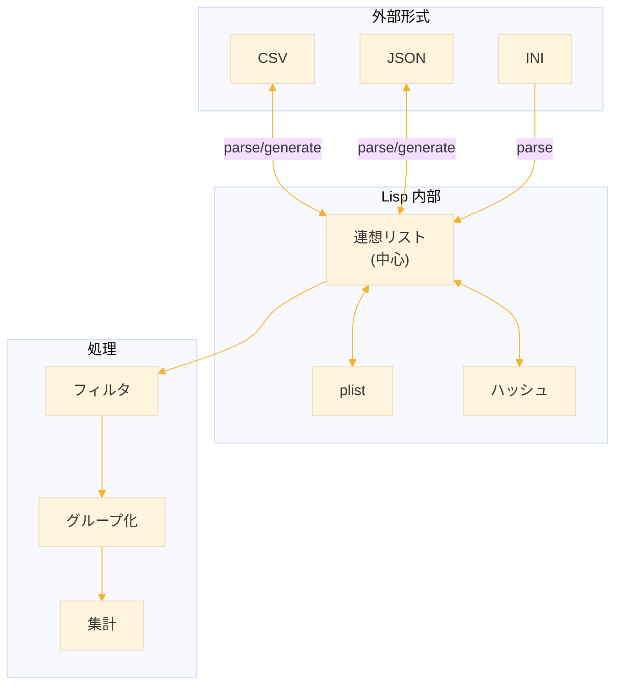

### 主要な関数一覧

| 関数 | 用途 |
|------|------|
| `getf` | プロパティリストから値を取得 |
| `parse-json` | JSON 文字列をパース |
| `to-json` | Lisp データを JSON に変換 |
| `csv-to-json` | CSV から JSON へ変換 |
| `json-to-csv` | JSON から CSV へ変換 |
| `read-ini-file` | INI ファイルを読み込む |
| `group-by` | データをグループ化 |
| `sum-by` | グループごとの合計 |
| `count-by` | グループごとの件数 |


