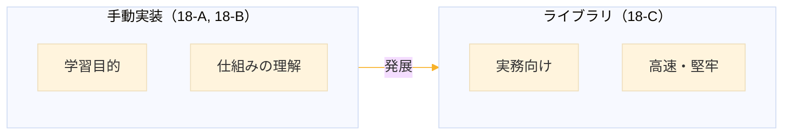
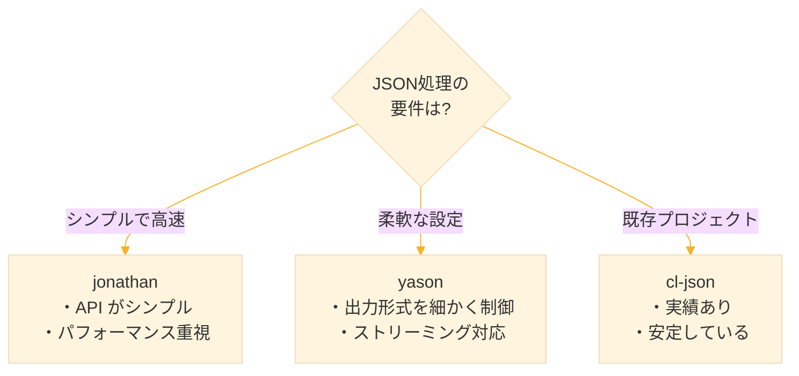
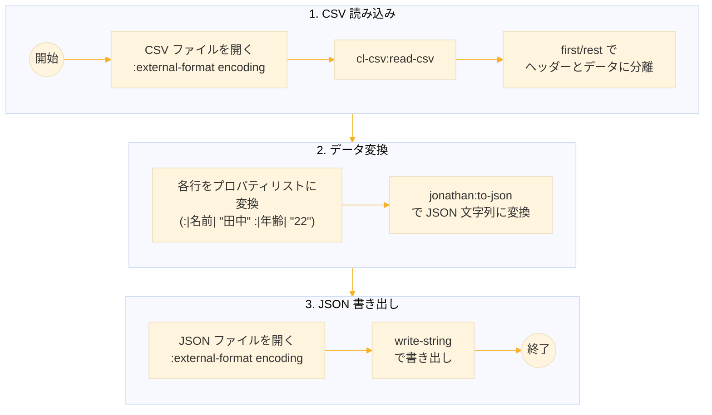
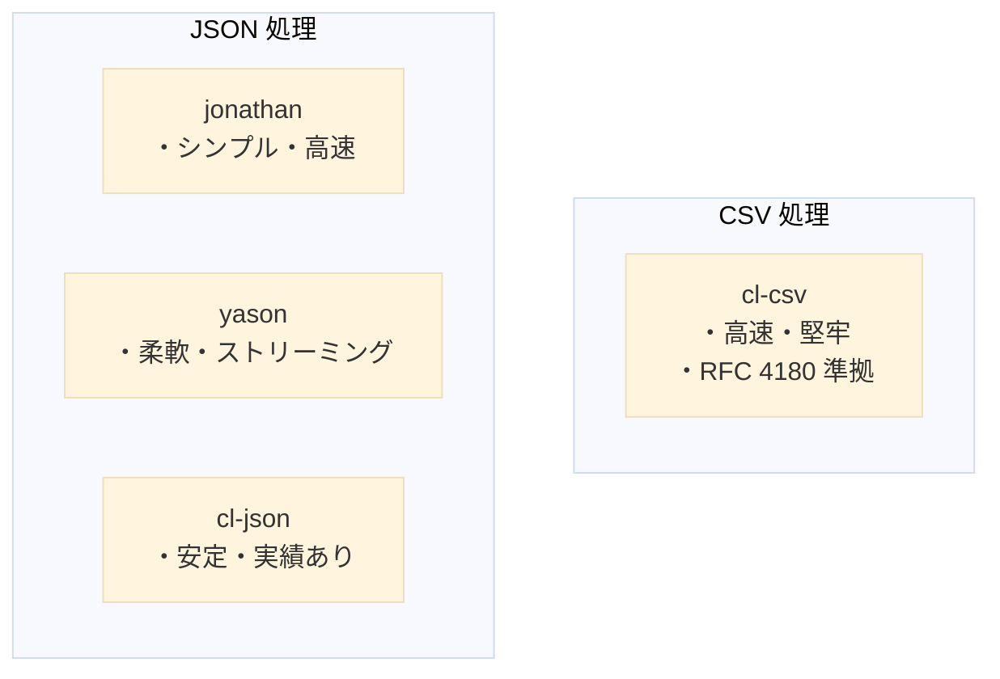

# Level 18-C (ライブラリを使った CSV/JSON 処理)

## 1. この章の概要

### 1-1. 学習目標

Level 18-A と 18-B では CSV と JSON の処理を自作した。これは学習のためであり、実務では、よくテストされたライブラリを使った方が開発効率と信頼性が向上する。この章では、Common Lisp の代表的なデータ処理ライブラリを学ぶ。



### 1-2. 扱うライブラリ

| ライブラリ | 用途 | 特徴 |
|-----------|------|------|
| cl-csv | CSV 処理 | RFC 4180 準拠、高速 |
| jonathan | JSON 処理 | 高速、シンプル |
| yason | JSON 処理 | 柔軟、ストリーミング対応 |
| cl-json | JSON 処理 | 古典的、安定 |

### 1-3. 前提知識

- Quicklisp のインストールと基本操作
- Level 18-A, 18-B の内容（連想リスト、データ変換の概念）


## 2. Quicklisp によるライブラリ管理

### 2-1. Quicklisp とは

Quicklisp は Common Lisp のパッケージマネージャで、数千のライブラリを簡単にインストールできる。

以下のURLから`quicklisp.lisp`をダウンロードする。

```
https://beta.quicklisp.org/quicklisp.lisp
```

SBCLを立ち上げ、ロードし、インストールを行う。

```
(load "quicklisp.lisp")
(quicklisp-quickstart:install)
```

### 2-2. インストール確認

`ql:system-apropos` は Quicklisp で利用可能なライブラリを検索するコマンドです。出力の各部分の意味を説明します。

**出力の解説**

```
##<SYSTEM cl-csv / cl-csv-20230618-git / quicklisp 2024-10-12>
         ~~~~~~   ~~~~~~~~~~~~~~~~~~~   ~~~~~~~~~~~~~~~~~~
           ①              ②                    ③
```

| 部分 | 内容 | 意味 |
|------|------|------|
| ① `cl-csv` | システム名 | ライブラリの名前。`(ql:quickload :cl-csv)` で使う |
| ② `cl-csv-20230618-git` | リリース名 | バージョン情報。2023年6月18日のgitスナップショット |
| ③ `quicklisp 2024-10-12` | Quicklisp dist | このライブラリが含まれる Quicklisp ディストリビューションの日付 |

**実行例**

```lisp
;;; "json" を含むライブラリを検索
CL-USER> (ql:system-apropos "json")
##<SYSTEM cl-json / cl-json-20220707-git / quicklisp 2024-10-12>
##<SYSTEM jonathan / jonathan-20211020-git / quicklisp 2024-10-12>
##<SYSTEM yason / yason-20231021-git / quicklisp 2024-10-12>
...

;;; 複数のライブラリがヒットする場合は一覧で表示される
```


### 2-3. ライブラリのロード

SBCLの最新バージョンを使用している場合、quickloadでエラーが発生することがある。その場合は、1つ前のバージョンをインストールしなおすとうまくいくことがある。

```lisp
;;; ライブラリをロード（初回はダウンロードも行う）
(ql:quickload :cl-csv)
(ql:quickload :jonathan)
(ql:quickload :yason)
```

## 3. cl-csv：CSV 処理ライブラリ

### 3-1. 概要

cl-csv は RFC 4180 に準拠した CSV パーサー。引用符、エスケープ、マルチバイト文字を正しく処理する。

```lisp
;;; ロード
(ql:quickload :cl-csv)
```

### 3-2. CSV の読み込み

### 文字列から読み込み

```lisp
(cl-csv:read-csv "名前,年齢,所属
田中太郎,22,工学部
鈴木花子,21,文学部")
;; (("名前" "年齢" "所属")
;;  ("田中太郎" "22" "工学部")
;;  ("鈴木花子" "21" "文学部"))
```

### ファイルから読み込み

cl-csv は UTF-8 に対応しているため、日本語も処理できます。ただし、ファイル読み込み時にエンコーディングを指定する必要があります。

```lisp
;;; ファイルから読み込み
;;; ファイルの場合は external-format を指定
(with-open-file (stream "students.csv"
                        :direction :input
                        :external-format :utf-8)
  (cl-csv:read-csv stream))

;;; 名前,年齢,所属
;;; 田中太郎,22,工学部
;;; 鈴木花子,21,文学部
```

### 3-3. オプションの指定

```lisp
;;; 区切り文字を変更（タブ区切り）
(cl-csv:read-csv "a	b	c
1	2	3"
                 :separator #\Tab)

;;; ヘッダー行をスキップしない（デフォルト）
(cl-csv:read-csv #P"data.csv" :skip-first-p nil)

;;; ヘッダー行をスキップ
(cl-csv:read-csv #P"data.csv" :skip-first-p t)
```

### 3-4. 1行ずつ処理

大きなファイルはメモリに全て読み込まず、1行ずつ処理する。

```lisp
;;; 各行に対して関数を適用
(cl-csv:do-csv (row #P"large-file.csv")
  (format t "処理中: ~A~%" row))

;;; 条件を満たす行だけ収集
(remove-if-not (lambda (row)
                 (string= (second row) "22"))
               (cl-csv:read-csv #P"students.csv"))
```

日本語 CSV を処理するには、ストリームを開いてから渡します。

```lisp
;;; 各行に対して関数を適用
(with-open-file (stream #P"large-file.csv"
                        :direction :input
                        :external-format :utf-8)
  (cl-csv:do-csv (row stream)
    (format t "処理中: ~A~%" row)))

;; 処理中: (名前 年齢 所属 成績)
;; 処理中: (田中太郎 22 工学部 85)
;; 処理中: (鈴木花子 21 文学部 92)
;; 処理中: (山田一郎 23 理学部 78)
;; 処理中: (佐藤次郎 20 経済学部 81)
;; 処理中: (高橋三郎 24 工学部 95)

;;; 条件を満たす行だけ収集
(with-open-file (stream #P"students.csv"
                        :direction :input
                        :external-format :utf-8)
  (remove-if-not (lambda (row)
                   (string= (second row) "22"))
                 (cl-csv:read-csv stream)))

;; ((田中太郎 22 工学部 85))
```

### 3-5. CSV の書き出し

```lisp
;;; リストを CSV 文字列に変換
(cl-csv:write-csv '(("name" "age" "city")
                    ("Alice" "30" "Tokyo")
                    ("Bob" "25" "Osaka"))
                  :stream nil)

;;; ファイルに書き出し
(with-open-file (out #P"output.csv"
                     :direction :output
                     :if-exists :supersede
                     :external-format :utf-8)  ;; UTF-8を指定
  (cl-csv:write-csv '(("a" "b" "c")
                      ("1" "2" "3"))
                    :stream out))
```

**実行例**

```lisp
;;; CSV 文字列を生成
(cl-csv:write-csv '(("name" "age")
                    ("Alice" "30")
                    ("Bob" "25"))
                    :stream nil)
"name,age
Alice,30
Bob,25
"

;;; カンマを含む値は自動で引用符で囲まれる
(cl-csv:write-csv '(("name" "comment")
                   ("Alice" "Hello, World"))
                     :stream nil)
;; name,comment
;; Alice,"Hello, World"
```


**エンコーディング一覧**

| 用途 | 指定 |
|------|------|
| 一般的な UTF-8 | `:utf-8` |
| Windows 日本語 | `:cp932` または `:sjis` |
| Latin-1 | `:latin-1` |
| ASCII のみ | 指定不要（デフォルト） |

### 3-6. 連想リストへの変換

cl-csv の結果を連想リストに変換する関数を作成する。

```lisp
(defun csv-to-alists-lib (source)
  "cl-csv を使って CSV を連想リストのリストに変換する。"
  (let* ((rows (cl-csv:read-csv source))
         (headers (first rows))                    ; 1行目をヘッダーに
         (data (rest rows)))                       ; 残りをデータに
    ;; 各行をヘッダーとペアにして連想リストに
    (mapcar (lambda (row)
              (mapcar #'cons headers row))
            data)))
```

**実行例**

```lisp
(csv-to-alists-lib "name,age,city
Alice,30,Tokyo
Bob,25,Osaka")
;; ((("name" . "Alice") ("age" . "30") ("city" . "Tokyo"))
;;  (("name" . "Bob") ("age" . "25") ("city" . "Osaka")))

;;; 値へのアクセス
(let ((data (csv-to-alists-lib "name,age
Alice,30
Bob,25")))
           (cdr (assoc "name" (first data) :test #'string=)))
;; Alice
```


## 4. jonathan：高速 JSON ライブラリ

### 4-1. 概要

jonathan は高速な JSON パーサー/ジェネレーター。シンプルな API で使いやすい。

```lisp
;;; ロード
(ql:quickload :jonathan)
```

### 4-2. JSON のパース

```lisp
;;; JSON 文字列をパース
(jonathan:parse "{\"name\": \"Alice\", \"age\": 30}")
```

**実行例**

```lisp
;;; オブジェクト
(jonathan:parse "{\"name\": \"Alice\", \"age\": 30}")
;; (age 30 name Alice)

;;; 戻り値はプロパティリスト形式
;;; getf でアクセス
(getf (jonathan:parse "{\"name\": \"Alice\"}") :|name|)
;; Alice

;;; 配列
(jonathan:parse "[1, 2, 3]")
;; (1 2 3)

;;; ネストしたデータ
(jonathan:parse "{\"user\": {\"name\": \"Alice\"}, \"tags\": [\"a\", \"b\"]}")
;; (tags (a b) user (name Alice))

;;; 真偽値と null
(jonathan:parse "{\"active\": true, \"data\": null}")
;; (data NIL active T)
```

### 4-3. パースオプション

```lisp
;;; キーを文字列のままにする
(jonathan:parse "{\"name\": \"Alice\"}" :as :hash-table)

;;; 連想リスト形式で返す
(jonathan:parse "{\"name\": \"Alice\"}" :as :alist)
```

**実行例**

```lisp
;;; デフォルト（プロパティリスト）
(jonathan:parse "{\"name\": \"Alice\", \"age\": 30}")
;; (age 30 name Alice)

;;; 連想リスト形式
(jonathan:parse "{\"name\": \"Alice\", \"age\": 30}" :as :alist)
;; ((age . 30) (name . Alice))

;;; ハッシュテーブル形式
(let ((ht (jonathan:parse "{\"name\": \"Alice\"}" :as :hash-table)))
           (gethash "name" ht))
;; Alice
;; T
```

### 4-4. JSON の生成

```lisp
;;; プロパティリストから JSON を生成
(jonathan:to-json '(:|name| "Alice" :|age| 30))

;;; 連想リストから生成
(jonathan:to-json '((:|name| . "Alice") (:|age| . 30)))

;;; リスト（配列）を生成
(jonathan:to-json '(1 2 3))
```

`|...|` はシンボル名の大文字変換を抑制するための Common Lisp の構文。

Common Lispではシンボルはデフォルトで大文字に変換される。JSON は通常小文字キーを使うので、jonathan では :|name| 形式が必要となる。


**実行例**

```lisp
;;; プロパティリストから
(jonathan:to-json '(:|name| "Alice" :|age| 30))
;; {"name":"Alice","age":30}

;;; |...| を使わないと、シンボル名が大文字に変換されてしまう。
(jonathan:to-json '(:name "Alice" :age 30))
{"NAME":"Alice","AGE":30}

;;; リストから配列
(jonathan:to-json '(1 2 3))
;; [1,2,3]

;;; ネストしたデータ
(jonathan:to-json '(:|user| (:|name| "Alice")
                    :|tags| ("tech" "lisp")))
;; {"user":{"name":"Alice"},"tags":["tech","lisp"]}

;;; 真偽値
(jonathan:to-json '(:|active| t :|deleted| nil))
;; {"active":true,"deleted":[]}
```

### 4-5. ファイルとの連携

```lisp
;;; JSON ファイルを読み込む
(defun read-json-file (filename)
  "JSON ファイルを読み込んでパースする。"
  (with-open-file (in filename :direction :input)
    (let ((content (make-string (file-length in))))
      (read-sequence content in)
      (jonathan:parse content))))

;;; JSON ファイルに書き出す
(defun write-json-file (data filename)
  "データを JSON ファイルに書き出す。"
  (with-open-file (out filename
                       :direction :output
                       :if-exists :supersede)
    (write-string (jonathan:to-json data) out)))
```

**実行例**

```lisp
;;; JSON ファイルを作成
(write-json-file '(:|name| "Alice" :|age| 30) "user.json")
;; → {"name":"Alice","age":30}

;;; 読み込み
(read-json-file "user.json")
;; → (age 30 name Alice)
```


## 5. yason：柔軟な JSON ライブラリ

### 5-1. 概要

yason はストリーミング対応で柔軟な JSON ライブラリ。大きな JSON ファイルの処理に向く。

```lisp
;;; ロード
(ql:quickload :yason)
```

### 5-2. JSON のパース

```lisp
;;; JSON 文字列をパース（ハッシュテーブルとして）
(yason:parse "{\"name\": \"Alice\", \"age\": 30}")
```

**実行例**

```lisp
;;; デフォルトはハッシュテーブル
(defparameter *data* (yason:parse "{\"name\": \"Alice\", \"age\": 30}"))
;; *DATA*

(gethash "name" *data*)
;; Alice
;; T

(gethash "age" *data*)
;; 30
;; T

;;; 配列はリストとして
(yason:parse "[1, 2, 3]")
;; (1 2 3)
```

### 5-3. パースオプション

```lisp
;;; オブジェクトを連想リストとして返す
(yason:parse "{\"name\": \"Alice\"}"
             :object-as :alist)

;;; オブジェクトをプロパティリストとして返す
(yason:parse "{\"name\": \"Alice\"}"
             :object-as :plist)

;;; キーをキーワードシンボルに
(yason:parse "{\"name\": \"Alice\"}"
             :object-as :plist
             :object-key-fn (lambda (k) (intern (string-upcase k) :keyword)))
```

**実行例**

```lisp
;;; 連想リスト形式
(yason:parse "{\"name\": \"Alice\", \"age\": 30}"
              :object-as :alist)
;; (("name" . "Alice") ("age" . 30))

;;; プロパティリスト形式
(yason:parse "{\"name\": \"Alice\", \"age\": 30}"
              :object-as :plist)
;; ("name" "Alice" "age" 30)

;;; キーをキーワードに変換
(yason:parse "{\"name\": \"Alice\", \"age\": 30}"
             :object-as :alist
             :object-key-fn (lambda (k)
                                 (intern (string-upcase k) :keyword)))
;; ((NAME . Alice) (AGE . 30))
```

### 5-4. JSON の生成

```lisp
;;; ハッシュテーブルから JSON を生成
(let ((ht (make-hash-table :test 'equal)))
  (setf (gethash "name" ht) "Alice")
  (setf (gethash "age" ht) 30)
  (yason:with-output-to-string* ()
    (yason:encode ht)))

;;; 連想リストから生成
(yason:with-output-to-string* ()
  (yason:encode-alist '(("name" . "Alice") ("age" . 30))))

;;; プロパティリストから生成
(yason:with-output-to-string* ()
  (yason:encode-plist '("name" "Alice" "age" 30)))
```

**実行例**

```lisp
;;; 連想リストから
(yason:with-output-to-string* ()
    (yason:encode-alist '(("name" . "Alice") ("age" . 30))))
;; {"name":"Alice","age":30}

;;; プロパティリストから
(yason:with-output-to-string* ()
    (yason:encode-plist '("name" "Alice" "age" 30)))
;; {"name":"Alice","age":30}

;;; リストから配列
(yason:with-output-to-string* ()
    (yason:encode '(1 2 3)))
;; [1,2,3]

;;; ネストしたデータ
(yason:with-output-to-string* ()
    (yason:encode-alist '(("user" . (("name" . "Alice")))
                          ("tags" . ("a" "b")))))
;; エラー：The value "Alice" is not of type LIST
```

`yason:encode-alist` はネストした連想リストを自動で処理できない。ネストした構造には `jonathan` が扱いやすい。

### 5-5. ストリーミング出力

大きな JSON を効率的に生成する。

```lisp
;;; with-output で構造を構築
(yason:with-output-to-string* ()
  (yason:with-object ()
    (yason:encode-object-element "name" "Alice")
    (yason:encode-object-element "age" 30)
    (yason:with-object-element ("address")
      (yason:with-object ()
        (yason:encode-object-element "city" "Tokyo")
        (yason:encode-object-element "zip" "100-0001")))))
```

**実行例**

```lisp
(yason:with-output-to-string* ()
    (yason:with-object ()
        (yason:encode-object-element "name" "Alice")
        (yason:encode-object-element "age" 30)
        (yason:with-object-element ("scores")
        (yason:with-array ()
            (yason:encode-array-element 85)
            (yason:encode-array-element 90)
            (yason:encode-array-element 78)))))
            
;; {"name":"Alice","age":30,"scores":[85,90,78]}
```


## 6. cl-json：古典的 JSON ライブラリ

### 6-1. 概要

cl-json は長い歴史を持つ安定したライブラリ。多くのプロジェクトで使用されている。

```lisp
;;; ロード
(ql:quickload :cl-json)
```

### 6-2. JSON のパース

```lisp
;;; JSON 文字列をパース
(cl-json:decode-json-from-string "{\"name\": \"Alice\", \"age\": 30}")
```

**実行例**

```lisp
;;; オブジェクト（連想リスト形式）
(cl-json:decode-json-from-string "{\"name\": \"Alice\", \"age\": 30}")
;; ((NAME . Alice) (AGE . 30))

;;; キーは自動的にキーワードシンボルに変換される
(cdr (assoc :name
    (cl-json:decode-json-from-string "{\"name\": \"Alice\"}")))
;; Alice

;;; 配列
(cl-json:decode-json-from-string "[1, 2, 3]")
;; (1 2 3)

;;; ネストしたデータ
(cl-json:decode-json-from-string
    "{\"user\": {\"name\": \"Alice\"}, \"tags\": [\"a\", \"b\"]}")
;; ((USER (NAME . Alice)) (TAGS a b))
```

### 6-3. JSON の生成

```lisp
;;; 連想リストから JSON を生成
(cl-json:encode-json-to-string '((:name . "Alice") (:age . 30)))

;;; リストから配列
(cl-json:encode-json-to-string '(1 2 3))
```

**実行例**

```lisp
;;; 連想リストから
(cl-json:encode-json-to-string '((:name . "Alice") (:age . 30)))
;; {"name":"Alice","age":30}

;;; リストから配列
(cl-json:encode-json-to-string '(1 2 3))
;; [1,2,3]

;;; 真偽値
(cl-json:encode-json-to-string '((:active . t) (:deleted . nil)))
;; {"active":true,"deleted":null}
```

### 6-4. ファイルからの読み込み

```lisp
;;; ファイルから読み込み
;;; UTF-8 ファイルから読み込み
(with-open-file (in #P"data.json"
                    :direction :input
                    :external-format :utf-8)
  (cl-json:decode-json in))
```

**実行例**

```lisp
;;; data.json の内容：
;;; {"name": "田中太郎", "department": "工学部"}

(with-open-file (in #P"data.json"
                    :direction :input
                    :external-format :utf-8)
           (cl-json:decode-json in))
           
;; ((NAME . 田中太郎) (DEPARTMENT . 工学部))
```


## 7. ライブラリの比較

### 7-1. JSON ライブラリの比較

| 特徴 | jonathan | yason | cl-json |
|------|:--:|:--:|:--:|
| 速度 | 高速 | 中速 | 中速 |
| デフォルト形式 | plist | hash-table | alist |
| ストリーミング | × | ○ | × |
| 柔軟性 | 中 | 高 | 中 |
| 依存関係 | 少 | 少 | 少 |

### 7-2. 使い分けの指針



### 7-3. 変換例の比較

```lisp
;;; 同じ JSON を各ライブラリでパース
(defparameter *json* "{\"name\": \"Alice\", \"age\": 30}")

;;; jonathan
(jonathan:parse *json*)
;; (age 30 name Alice)  ; plist

;;; yason
(yason:parse *json*)
;; #<HASH-TABLE :TEST EQUAL :COUNT 2 {1103F10233}>

;;; yason (alist モード)
(yason:parse *json* :object-as :alist)
;; ((name . Alice) (age . 30))

;;; yason (plist モード)
(yason:parse *json* :object-as :plist)
;; (name Alice age 30)

;;; cl-json
(cl-json:decode-json-from-string *json*)
;; ((NAME . Alice) (AGE . 30))
```


## 8. 実践：CSV と JSON の相互変換

### 8-1. CSV から JSON への変換

```lisp
(ql:quickload :cl-csv)
(ql:quickload :jonathan)

(defun csv-file-to-json (csv-file json-file &key (encoding :utf-8))
  "CSV ファイルを読み込んで JSON ファイルに変換する。"
  (let* (;; CSV を読み込む
         (rows (with-open-file (in csv-file
                                   :direction :input
                                   :external-format encoding)
                 (cl-csv:read-csv in)))
         ;; 1行目をヘッダーに
         (headers (first rows))
         ;; 残りをデータに
         (data (rest rows))
         ;; 各行をプロパティリストに変換
         (plists (mapcar (lambda (row)
                           (loop for h in headers
                                 for v in row
                                 collect (intern h :keyword)
                                 collect v))
                         data))
         ;; jonathan で JSON 文字列に変換
         (json (jonathan:to-json plists)))
    ;; JSON ファイルに書き出し
    (with-open-file (out json-file
                         :direction :output
                         :if-exists :supersede
                         :external-format encoding)
      (write-string json out))
    (format t "変換完了: ~A → ~A~%" csv-file json-file)))
```



**処理の流れ**

```
students.csv

    ↓ cl-csv:read-csv
(("名前" "年齢" "所属") ("田中" "22" "工学部") ...)

    ↓ first / rest
headers: ("名前" "年齢" "所属")
data: (("田中" "22" "工学部") ...)

    ↓ loop + intern
(:|名前| "田中" :|年齢| "22" :|所属| "工学部") ...

    ↓ jonathan:to-json
"[{\"名前\":\"田中\",\"年齢\":\"22\",...},...]"

    ↓ write-string
students.json
```

**実行例**

```lisp
;;; students.csv の内容
;;; name,age,department
;;; Alice,30,Engineering
;;; Bob,25,Sales

(csv-file-to-json #P"students.csv" #P"students.json")
;; 変換完了: students.csv → students.json
;; NIL

;;; students.json の内容
;;; [{"name":"Alice","age":"30","department":"Engineering"},
;;;  {"name":"Bob","age":"25","department":"Sales"}]
```

### 8-2. JSON から CSV への変換

```lisp
(defun json-file-to-csv (json-file csv-file &key (encoding :utf-8))
  "JSON ファイルを読み込んで CSV ファイルに変換する。"
  (let* (;; JSON を読み込んでパース
         (content (uiop:read-file-string json-file))
         (data (jonathan:parse content)))
    ;; データ形式を確認
    (when (null data)
      (error "JSON is empty"))
    ;; 単一オブジェクトの場合はリストで包む
    (when (keywordp (first data))
      (setf data (list data)))
    (let* (;; 最初のオブジェクトからキーを取得
           (first-plist (first data))
           ;; キーだけを抽出（逆順になっているので戻す）
           (keys (nreverse (loop for (key val) on first-plist by #'cddr
                                 collect key)))
           ;; キーを文字列に変換してヘッダーに
           (headers (mapcar (lambda (k)
                              (string-downcase (string k)))
                            keys))
           ;; データ行を作成
           (rows (mapcar (lambda (plist)
                           (mapcar (lambda (key)
                                     (getf plist key))
                                   keys))
                         data)))
      ;; CSV ファイルに書き出し
      (with-open-file (out csv-file
                           :direction :output
                           :if-exists :supersede
                           :external-format encoding)
        (cl-csv:write-csv (cons headers rows) :stream out))
      (format t "変換完了: ~A → ~A~%" json-file csv-file))))
```

**実行例**

```lisp
;;; users.json の内容
;;; [{"name": "Alice", "email": "alice@example.com"},
;;;  {"name": "Bob", "email": "bob@example.com"}]

(json-file-to-csv #P"users.json" #P"users.csv")
;; 変換完了: users.json → users.csv
;; NIL

;;; users.csv の内容
;;; name,email
;;; Alice,alice@example.com
;;; Bob,bob@example.com
```

**処理の流れ**

```
students.json

    ↓ uiop:read-file-string
"[{\"名前\":\"田中太郎\",...},...]"

    ↓ jonathan:parse
((:|成績| 85 :|所属| "工学部" ...) ...)  ※逆順

    ↓ loop + nreverse
keys: (:|名前| :|年齢| :|所属| :|成績|)  ※正順に戻す

    ↓ mapcar + getf
rows: (("田中太郎" "22" "工学部" "85") ...)

    ↓ cl-csv:write-csv
students.csv
```

#### UIOPとは

UIOP（Utilities for Implementation- and OS- Portability）は、処理系間・OS間の互換性を提供する Common Lisp の標準ユーティリティライブラリ。ASDF に同梱されているため、特別なインストールなしで使える。

jonathan は文字列のみを受け取り、ストリームを直接渡せない。そのため `uiop:read-file-string` でファイル全体を文字列に変換してから `jonathan:parse` に渡している。

**よく使う関数**

```lisp
;;; ファイル読み込み
(uiop:read-file-string "file.txt")        ; ファイル全体を文字列で
(uiop:read-file-lines "file.txt")         ; 行のリストで

;;; ファイル書き込み
(uiop:write-string-into-file "hello" "file.txt"
                              :if-exists :supersede)

;;; パス操作
(uiop:native-namestring #P"path/to/file") ; ネイティブパス文字列
(uiop:merge-pathnames* "file.txt" "dir/") ; パス結合

;;; シェルコマンド実行
(uiop:run-program "ls" :output :string)   ; コマンド実行

;;; 環境変数
(uiop:getenv "HOME")                      ; 環境変数取得
```

**実行例**

```lisp
;;; ファイルを文字列として読み込む
CL-USER> (uiop:read-file-string "students.csv")
"名前,年齢,所属
田中太郎,22,工学部
鈴木花子,21,文学部
"

;;; 行のリストとして読み込む
(uiop:read-file-lines "students.csv")
("名前,年齢,所属" "田中太郎,22,工学部" "鈴木花子,21,文学部")

;;; 環境変数を取得
(uiop:getenv "HOME")
"/home/user"
```

**なぜ UIOP を使うか**

| 方法 | コード量 | 互換性 |
|------|----------|--------|
| 標準の方法 | 長い | 処理系依存 |
| UIOP | 短い | 全処理系で同じ |

```lisp
;;; 標準の方法（長い）
(with-open-file (in "file.txt" :direction :input)
  (let ((content (make-string (file-length in))))
    (read-sequence content in)
    content))

;;; UIOP（短い）
(uiop:read-file-string "file.txt")
```


## 9. 実践：Web API との連携

### 9-1. HTTP クライアント

Web API からデータを取得するには HTTP クライアントが必要。

```lisp
;;; Dexador をロード（HTTP クライアント）
(ql:quickload :dexador)
;; JSON処理のため jonathan をロード
(ql:quickload :jonathan)
```

### 9-2. JSON API の呼び出し

```lisp
(defun fetch-json (url)
  "URL から JSON データを取得してパースする（プロパティリスト形式）。"
  (let ((response (dex:get url)))
    (jonathan:parse response)))

(defun fetch-json-alist (url)
  "URL から JSON データを取得して連想リストで返す。"
  (let ((response (dex:get url)))
    (jonathan:parse response :as :alist)))
```

**実行例**

```lisp
;;; 公開 API からデータを取得
(fetch-json "https://api.github.com/users/octocat")
;; (:|login| "octocat" :|id| 583231 :|type| "User" ...)

;;; 特定のフィールドを取得
(getf (fetch-json "https://api.github.com/users/octocat")
               :|login|)
;; octocat
```

### 9-3. API レスポンスの処理

```lisp
(defun get-user-repos (username)
  "GitHub ユーザーのリポジトリ一覧を取得する。"
  (let* ((url (format nil "https://api.github.com/users/~A/repos" username))
         (repos (fetch-json url)))
    ;; リポジトリ名と星の数を抽出
    (mapcar (lambda (repo)
              (list :name (getf repo :|name|)
                    :stars (getf repo :|stargazers_count|)))
            repos)))

(defun repos-to-csv (username filename)
  "ユーザーのリポジトリ一覧を CSV に保存する。"
  (let ((repos (get-user-repos username)))
    (with-open-file (out filename
                         :direction :output
                         :if-exists :supersede)
      (cl-csv:write-csv
       (cons '("name" "stars")
             (mapcar (lambda (r)
                       (list (getf r :name)
                             (getf r :stars)))
                     repos))
       :stream out))))
```


## 10. 練習課題

### 課題1：CSV フィルタリング

cl-csv を使って、CSV ファイルから条件を満たす行だけを抽出して新しいファイルに保存する関数を作れ。

```lisp
(filter-csv "students.csv" "seniors.csv"
            (lambda (row) (>= (parse-integer (second row)) 22)))
```


### 課題2：JSON の整形出力

jonathan または yason を使って、JSON をインデント付きで整形出力する関数を作れ。

```lisp
(pretty-json '((:name . "Alice") (:scores . (85 90 78))))
;; 出力
;; {
;;   "name": "Alice",
;;   "scores": [85, 90, 78]
;; }
```


### 課題3：CSV から JSON API

CSV ファイルを読み込んで JSON として返す簡易 API サーバーを作れ（Hunchentoot を使用）。


### 課題4：データ集計

cl-csv を使って大きな CSV ファイルを1行ずつ処理し、メモリ効率よく集計する関数を作れ。

```lisp
(aggregate-csv "sales.csv" :product :amount)
;; → (("Apple" . 1500) ("Banana" . 2300) ...)
```


## 11. 練習課題の解答

### 課題1の解答

```lisp
(defun filter-csv (input-file output-file predicate &key (encoding :utf-8))
  "CSV ファイルから条件を満たす行を抽出する。"
  ;; UTF-8 で読み込み
  (let ((rows (with-open-file (in input-file
                                  :direction :input
                                  :external-format encoding)
                (cl-csv:read-csv in))))
    ;; UTF-8 で書き出し
    (with-open-file (out output-file
                         :direction :output
                         :if-exists :supersede
                         :external-format encoding)
      ;; ヘッダー行を出力
      (cl-csv:write-csv (list (first rows)) :stream out)
      ;; 条件を満たすデータ行を出力
      (cl-csv:write-csv
       (remove-if-not predicate (rest rows))
       :stream out))))
```

**テスト**

```lisp
;;; students.csv:
;;; name,age,department
;;; Alice,30,Engineering
;;; Bob,20,Sales
;;; Carol,25,Marketing

(filter-csv #P"students.csv" #P"seniors.csv" 
    (lambda (row) (>= (parse-integer (second row)) 25)))
;; NIL

;;; seniors.csv の内容
;;; name,age,department
;;; Alice,30,Engineering
;;; Carol,25,Marketing
```


### 課題2の解答

```lisp
(defun pretty-json (data &optional (indent 0))
  "JSON を整形して出力する。"
  (let ((prefix (make-string indent :initial-element #\Space)))
    (cond
      ;; プロパティリスト → オブジェクト
      ((and (listp data)
            (keywordp (first data)))
       (format t "{~%")
       (loop for (key val . rest) on data by #'cddr
             do (format t "~A  \"~A\": " prefix (string-downcase (string key)))
                (pretty-json val (+ indent 2))
                (if rest
                    (format t ",~%")    ; カンマ + 改行
                    (format t "~%")))   ; 最後は改行のみ
       (format t "~A}" prefix))
      
      ;; 通常のリスト → 配列
      ((listp data)
       (format t "[")
       (loop for (item . rest) on data
             do (pretty-json item indent)
                (when rest (format t ", ")))
       (format t "]"))
      
      ;; 文字列
      ((stringp data)
       (format t "\"~A\"" data))
      
      ;; 数値
      ((numberp data)
       (format t "~A" data))
      
      ;; T → true
      ((eq data t)
       (format t "true"))
      
      ;; NIL → null
      ((null data)
       (format t "null"))
      
      ;; その他
      (t
       (format t "~S" data)))))
```

**テスト**

```lisp
(pretty-json '(:|名前| "田中太郎" :|年齢| 30 :|所属| "工学部"))
;; {
;;   "名前": "田中太郎",
;;   "年齢": 30,
;;   "所属": "工学部"
;; }
;; NIL
```


### 課題3の解答

```lisp
;;; Hunchentoot と jonathan をロード
(ql:quickload '(:hunchentoot :jonathan :cl-csv))

;;; グローバル変数
(defvar *server* nil)
(defvar *csv-data* nil)

(defun start-csv-api (csv-file &optional (port 8080) &key (encoding :utf-8))
  "CSV ファイルを JSON API として公開する。"
  ;; CSV を読み込んでプロパティリストに変換
  (let* ((rows (with-open-file (in csv-file
                                   :direction :input
                                   :external-format encoding)
                 (cl-csv:read-csv in)))
         (headers (first rows))
         (data (rest rows)))
    (setf *csv-data*
          (mapcar (lambda (row)
                    (loop for h in headers
                          for v in row
                          collect (intern h :keyword)
                          collect v))
                  data)))
  
  ;; API エンドポイントを設定
  (hunchentoot:define-easy-handler (get-data :uri "/data") ()
    (setf (hunchentoot:content-type*) "application/json; charset=utf-8")
    (jonathan:to-json *csv-data*))
  
  ;; サーバー起動（インスタンスを保存）
  (setf *server*
        (hunchentoot:start
          (make-instance 'hunchentoot:easy-acceptor :port port)))
  (format t "Server started on port ~A~%" port)
  (format t "Access: http://localhost:~A/data~%" port))

(defun stop-csv-api ()
  "CSV API サーバーを停止する。"
  (when *server*
    (hunchentoot:stop *server*)
    (setf *server* nil)
    (setf *csv-data* nil)
    (format t "Server stopped~%")))
```

**テスト**

```
;;; サーバー起動
(start-csv-api #P"students.csv")
;;; ブラウザで http://localhost:8080/data にアクセスすると
;;; [{"name":"Alice","age":"30",...}, ...]

;;; サーバー停止
(stop-csv-api)


;;; 別のポートで起動
(start-csv-api #P"students.csv" 3000)

;;; Shift_JIS ファイルの場合
(start-csv-api #P"data-sjis.csv" 8080 :encoding :cp932)
```

##### Hunchentoot とは

Hunchentoot は Common Lisp の代表的な Web サーバーライブラリです。

| 項目 | 説明 |
|------|------|
| 名前 | Hunchentoot（フンチェントゥート） |
| 用途 | Web サーバー / Web アプリケーション |
| 特徴 | 軽量、組み込みやすい、HTTP/1.1 対応 |
| ライセンス | BSD |

**インストール**

```lisp
(ql:quickload :hunchentoot)
```

**基本的な使い方**

```lisp
;;; サーバー起動
(defvar *server* 
  (hunchentoot:start 
    (make-instance 'hunchentoot:easy-acceptor :port 8080)))

;;; サーバー停止
(hunchentoot:stop *server*)
```

**ハンドラーの定義**

```lisp
;;; シンプルなハンドラー
(hunchentoot:define-easy-handler (hello :uri "/hello") ()
  (setf (hunchentoot:content-type*) "text/plain; charset=utf-8")
  "こんにちは！")

;;; パラメータを受け取る
(hunchentoot:define-easy-handler (greet :uri "/greet") (name)
  (setf (hunchentoot:content-type*) "text/plain; charset=utf-8")
  (format nil "こんにちは、~A さん！" (or name "ゲスト")))
```

**実行例**

```lisp
(ql:quickload :hunchentoot)
;; (:HUNCHENTOOT)

(hunchentoot:define-easy-handler (hello :uri "/hello") ()
           "Hello, World!")
;; HELLO

(defvar *server* 
           (hunchentoot:start 
             (make-instance 'hunchentoot:easy-acceptor :port 8080)))
;; *SERVER*

;;; ブラウザで http://localhost:8080/hello にアクセス
;;; → "Hello, World!" が表示される
```

**JSON API**

```lisp
(ql:quickload '(:hunchentoot :jonathan))

;;; JSON を返す API
(hunchentoot:define-easy-handler (api-users :uri "/api/users") ()
  (setf (hunchentoot:content-type*) "application/json; charset=utf-8")
  (jonathan:to-json '((:|name| "田中" :|age| 30)
                      (:|name| "鈴木" :|age| 25))))

;;; サーバー起動
(hunchentoot:start (make-instance 'hunchentoot:easy-acceptor :port 8080))
```

アクセス
```
http://localhost:8080/api/users
→ [{"name":"田中","age":30},{"name":"鈴木","age":25}]
```

**パラメータの受け取り**

```lisp
;;; GET パラメータ
;;; /search?q=lisp
(hunchentoot:define-easy-handler (search :uri "/search") (q)
  (format nil "検索キーワード: ~A" q))

;;; 複数パラメータ
;;; /calc?a=10&b=20
(hunchentoot:define-easy-handler (calc :uri "/calc") (a b)
  (let ((num-a (parse-integer a :junk-allowed t))
        (num-b (parse-integer b :junk-allowed t)))
    (format nil "~A + ~A = ~A" num-a num-b (+ num-a num-b))))
```

**主要な関数**

| 関数 | 説明 |
|------|------|
| `hunchentoot:start` | サーバー起動 |
| `hunchentoot:stop` | サーバー停止 |
| `hunchentoot:define-easy-handler` | ハンドラー定義 |
| `hunchentoot:content-type*` | Content-Type 設定 |
| `hunchentoot:get-parameter` | パラメータ取得 |
| `hunchentoot:post-parameter` | POST パラメータ取得 |

**他の Web フレームワーク**

| ライブラリ | 特徴 |
|-----------|------|
| Hunchentoot | シンプル、入門向け |
| Caveman2 | フルスタック、Rails 風 |
| Clack | ラッパー、WSGI 風 |
| ningle | 軽量、Sinatra 風 |

入門には Hunchentoot がシンプルでおすすめです。

### 課題4の解答

```lisp
(defun aggregate-csv (filename group-key value-key &key (encoding :utf-8))
  "CSV ファイルを1行ずつ処理して集計する。"
  (let ((totals (make-hash-table :test 'equal))
        (headers nil)
        (group-idx nil)
        (value-idx nil))
    ;; UTF-8 で読み込み
    (with-open-file (stream filename
                            :direction :input
                            :external-format encoding)
      (cl-csv:do-csv (row stream)
        (if (null headers)
            ;; 最初の行はヘッダー
            (progn
              (setf headers row)
              (setf group-idx (position group-key headers :test #'string=))
              (setf value-idx (position value-key headers :test #'string=)))
            ;; データ行を集計
            (let ((group (nth group-idx row))
                  (value (parse-integer (nth value-idx row) :junk-allowed t)))
              (when value
                (incf (gethash group totals 0) value))))))
    ;; ハッシュテーブルを連想リストに変換
    (let ((result nil))
      (maphash (lambda (k v) (push (cons k v) result)) totals)
      (sort result #'> :key #'cdr))))
```

**テスト**

```lisp
;;; sales.csv:
;;; product,region,amount
;;; Apple,Tokyo,100
;;; Banana,Osaka,200
;;; Apple,Osaka,150
;;; Banana,Tokyo,180

(aggregate-csv #P"sales.csv" "product" "amount")
;; (("Banana" . 380) ("Apple" . 250))
```


## 12. まとめ

### この章で学んだこと

1. **cl-csv** - RFC 4180 準拠の CSV 処理
2. **jonathan** - 高速でシンプルな JSON パーサー
3. **yason** - 柔軟なストリーミング対応 JSON ライブラリ
4. **cl-json** - 安定した古典的 JSON ライブラリ
5. **相互変換** - CSV と JSON のファイル変換
6. **Web API** - HTTP クライアントとの連携

### ライブラリ選択の指針



### 主要な関数一覧

| ライブラリ | 関数 | 用途 |
|-----------|------|------|
| cl-csv | `read-csv` | CSV を読み込む |
| cl-csv | `write-csv` | CSV を書き出す |
| cl-csv | `do-csv` | 1行ずつ処理 |
| jonathan | `parse` | JSON をパース |
| jonathan | `to-json` | JSON を生成 |
| yason | `parse` | JSON をパース |
| yason | `encode` | JSON を生成 |
| cl-json | `decode-json-from-string` | JSON をパース |
| cl-json | `encode-json-to-string` | JSON を生成 |

