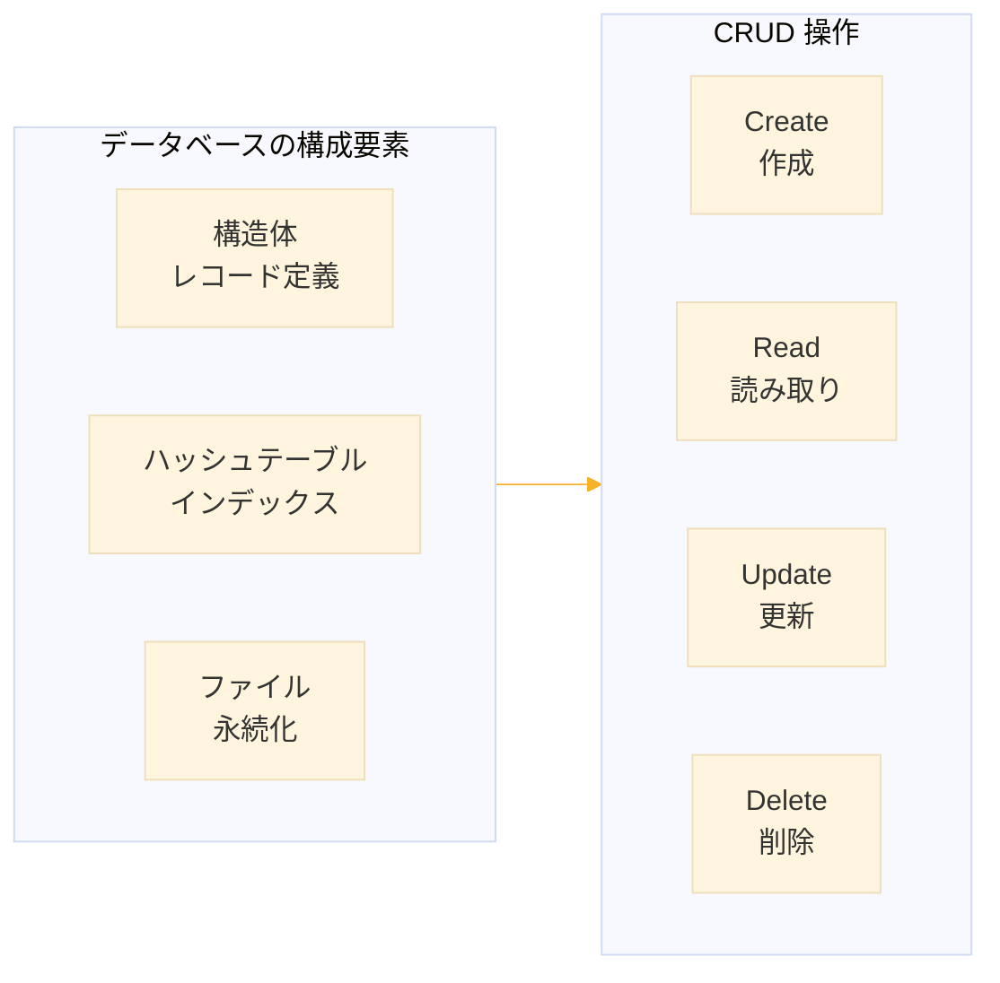
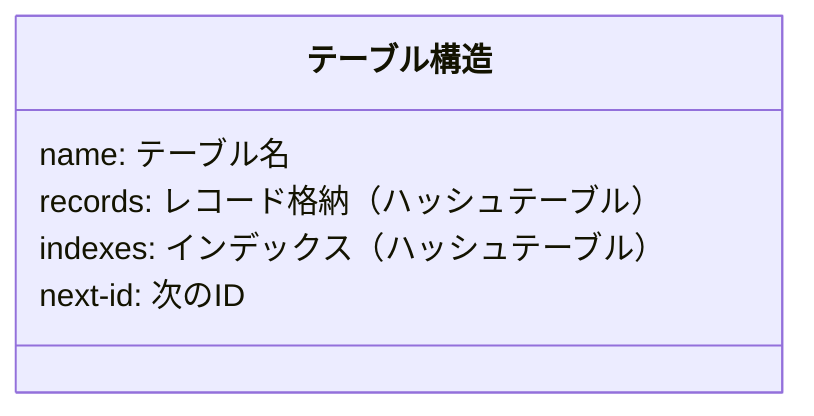
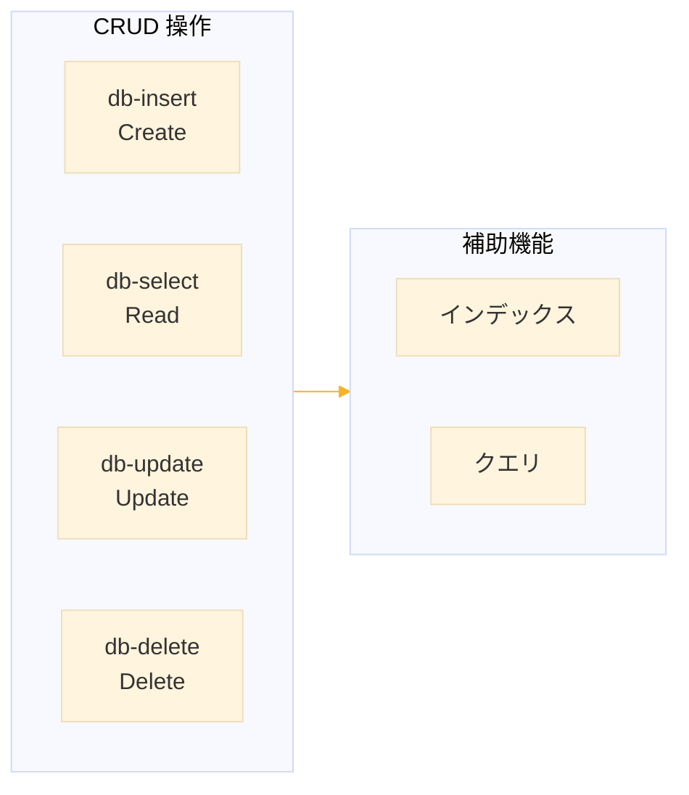
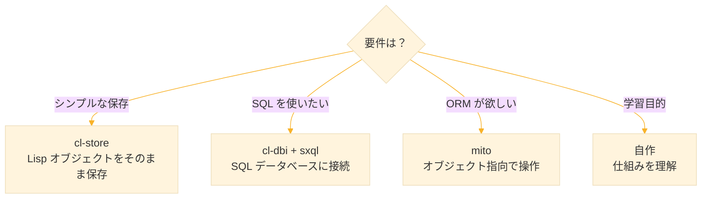
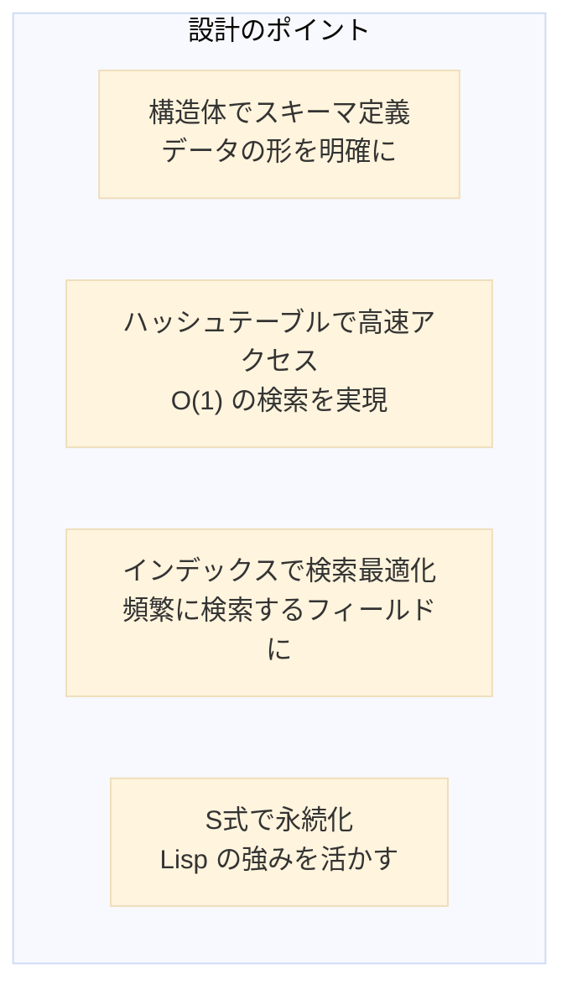

# Level 19 (簡易データベースの実装)
## 1. この章の概要

### 1-1. 学習目標

この章では、Level 18 で学んだデータ処理の知識を活かし、簡易的なインメモリデータベースを実装する。データベースは現代のソフトウェア開発において不可欠な技術であり、その内部構造を理解することは、効率的なデータ管理システムを設計するための基盤となる。

本章で構築するシステムは、構造体、ハッシュテーブル、ファイル永続化を組み合わせた実用的なデータ管理システムである。商用データベースの簡易版を自作することで、データベースの本質的な仕組みを体験的に理解できる。



### 1-2. 扱う内容

本章では、データベースシステムの核心となる以下の技術を学ぶ。それぞれが実務でも頻繁に使われる重要な概念である。

| トピック | 説明 | 実務での活用例 |
|----------|------|----------------|
| defstruct | 構造体によるレコード定義 | ユーザー情報、商品データの表現 |
| ハッシュテーブル | 高速なインデックス | O(1) での検索実現 |
| CRUD | 基本的なデータ操作 | あらゆるアプリケーションの基盤 |
| クエリ | 検索・フィルタリング | 条件に合うデータの抽出 |
| 永続化 | ファイルへの保存と復元 | プログラム終了後もデータを保持 |

### 1-3. 作成するもの

本章で作成するシンプルなインメモリデータベースシステムは、以下の機能を持つ。

- **テーブル定義と管理** ─ 異なる種類のデータを整理して格納
- **レコードの追加・検索・更新・削除** ─ 基本的な CRUD 操作
- **インデックスによる高速検索** ─ 大量データでも素早く検索
- **ファイルへの保存と復元** ─ データの永続化

このシステムを構築する過程で、実際のデータベースがどのように動作しているかを深く理解できる。


## 2. 構造体（defstruct）

### 2-1. 構造体とは

構造体は、関連するデータをまとめて1つの型として定義する仕組みである。例えば「人」を表すには、名前、年齢、メールアドレスなど複数の情報が必要だ。これらをバラバラに管理するのではなく、「person」という1つの単位にまとめることで、コードが整理され、扱いやすくなる。

データベースの文脈では、構造体は「テーブルの1行（レコード）」を表現するのに最適だ。例えば、顧客テーブルなら各顧客の情報を構造体で定義する。

```lisp
;;; 構造体の定義
;;; 「person」という型を定義し、4つのフィールドを持たせる
(defstruct person
           id      ; 識別子
           name    ; 名前
           age     ; 年齢
           email)  ; メールアドレス
;; PERSON
```

`defstruct` を実行すると、Common Lisp は自動的に便利な関数群を生成する。これにより、構造体の作成、アクセス、コピーなどが簡単に行える。

| 自動生成される関数 | 説明 | 使用例 |
|:--|:--|:--|
| make-person | コンストラクタ（インスタンス作成） | `(make-person :name "田中")` |
| person-p | 型判定（person型か確認） | `(person-p obj)` → T/NIL |
| person-id | id フィールドへのアクセサ | `(person-id p)` → 値を取得 |
| person-name | name フィールドへのアクセサ | `(person-name p)` |
| person-age | age フィールドへのアクセサ | `(person-age p)` |
| person-email | email フィールドへのアクセサ | `(person-email p)` |
| copy-person | シャローコピー作成 | `(copy-person p)` |


### 2-2. インスタンスの作成

構造体を定義しただけではデータは存在しない。`make-構造体名` 関数を使って、実際のデータ（インスタンス）を作成する。キーワード引数で各フィールドに値を設定できる。

```lisp
;;; make-構造体名 でインスタンスを作成
;;; キーワード引数（:name など）で各フィールドに値を設定
(make-person :id 1
             :name "田中太郎"
             :age 30
             :email "tanaka@example.com")

;;; 変数に格納して後で使用する
(defparameter *user1*
           (make-person :id 1
                        :name "田中太郎"
                        :age 30
                        :email "tanaka@example.com"))
;; *USER1*

;;; 構造体の内容を確認
;;; #S(...) は構造体の表示形式
*user1*
;; #S(PERSON :ID 1 :NAME "田中太郎" :AGE 30 :EMAIL "tanaka@example.com")

;;; 一部のフィールドだけ指定することも可能
;;; 指定しなかったフィールドは NIL になる
(make-person :name "鈴木花子")
;; #S(PERSON :ID NIL :NAME "鈴木花子" :AGE NIL :EMAIL NIL)
```

### 2-3. フィールドへのアクセス

構造体のデータを読み書きするには、自動生成されたアクセサ関数を使う。読み取りは `(構造体名-フィールド名 インスタンス)` の形式で、書き込みは `setf` と組み合わせる。

```lisp
;;; 各フィールドの読み取り
;;; アクセサ関数を使ってフィールドの値を取得
(person-id *user1*)
;; 1

(person-name *user1*)
;; "田中太郎"

(person-age *user1*)
;; 30

(person-email *user1*)
;; "tanaka@example.com"

;;; フィールドの更新
;;; setf とアクセサを組み合わせて値を変更
(setf (person-age *user1*) 31)
;; 31

(person-age *user1*)
;; 31  ; ← 更新された

;;; 型判定
;;; その値が特定の構造体型かどうかを確認
(person-p *user1*)
;; T  ; ← person 型である

(person-p "not a person")
;; NIL  ; ← person 型ではない
```

### 2-4. デフォルト値の設定

実務では、すべてのフィールドに毎回値を指定するのは面倒なことが多い。`defstruct` ではフィールドにデフォルト値を設定でき、指定しなかったフィールドには自動的にその値が入る。

```lisp
;;; デフォルト値付きの構造体定義
;;; (フィールド名 デフォルト値) の形式で指定
(defstruct product
  (id 0)                              ; デフォルト値 0
  (name "unnamed")                    ; デフォルト値 "unnamed"
  (price 0)                           ; デフォルト値 0
  (stock 0)                           ; デフォルト値 0
  (created-at (get-universal-time)))  ; 作成時の時刻を自動設定
```

デフォルト値には式も書ける。`(get-universal-time)` のように関数呼び出しを書くと、インスタンス作成時に評価される。これにより、作成日時の自動記録などが実現できる。

**実行例**

```lisp
(defstruct product
  (id 0)
  (name "unnamed")
  (price 0)
  (stock 0)
  (created-at (get-universal-time)))
;; PRODUCT

;;; フィールドを指定せずに作成 → デフォルト値が使われる
(make-product)
;; #S(PRODUCT :ID 0 :NAME "unnamed" :PRICE 0 :STOCK 0 :CREATED-AT 3944123456)

;;; 一部だけ指定 → 残りはデフォルト値
(make-product :name "りんご" :price 100)
;; #S(PRODUCT :ID 0 :NAME "りんご" :PRICE 100 :STOCK 0 :CREATED-AT 3944123460)
```

### 2-5. 構造体のコピー

既存の構造体を元に、少しだけ変更したものを作りたい場合がある。`copy-構造体名` 関数でシャローコピー（浅いコピー）を作成できる。コピーは別オブジェクトなので、変更しても元には影響しない。

```lisp
;;; copy-構造体名 でシャローコピーを作成
(defparameter *user2* (copy-person *user1*))
;; *USER2*

*user2*
;; #S(PERSON :ID 1 :NAME "田中太郎" :AGE 31 :EMAIL "tanaka@example.com")

;;; コピーは別オブジェクト
;;; eq は同一オブジェクトかを判定
(eq *user1* *user2*)
;; NIL  ; ← 別のオブジェクト

;;; コピーを変更しても元は変わらない
(setf (person-name *user2*) "田中次郎")
;; "田中次郎"

(person-name *user1*)
;; "田中太郎"  ; ← 元のまま
```

**注意**: シャローコピーなので、フィールドの値がリストや構造体の場合、その中身は共有される。完全に独立したコピーが必要な場合は、ディープコピーを自分で実装する必要がある。


## 3. テーブルの設計

### 3-1. テーブル構造

実際のデータベースでは、データは「テーブル」という単位で管理される。テーブルは複数のレコード（行）を持ち、各レコードは同じ構造（列）を持つ。

本章で設計するテーブルは、3つの主要な要素で構成される。

1. **レコード格納領域** ─ 実際のデータを ID をキーにして保存
2. **インデックス** ─ 特定のフィールドで高速検索するための索引
3. **ID 採番機能** ─ 新しいレコードに一意な ID を自動付与



```lisp
;;; テーブル構造体の定義
(defstruct db-table
  (name "")                                ; テーブル名
  (records (make-hash-table))              ; ID → レコード のマッピング
  (indexes (make-hash-table :test 'equal)) ; フィールド名 → インデックス
  (next-id 1))                             ; 自動採番用カウンタ
```

ハッシュテーブルを使う理由は、ID による検索が O(1)（定数時間）で行えるためだ。リストで管理すると、レコード数に比例した時間がかかってしまう。

**実行例**

```lisp
(defstruct db-table
           (name "")
           (records (make-hash-table))
           (indexes (make-hash-table :test 'equal))
           (next-id 1))
;; DB-TABLE

;;; 空のテーブルを作成
(defparameter *users-table*
           (make-db-table :name "users"))
;; *USERS-TABLE*

*users-table*
;; #S(DB-TABLE :NAME "users" :RECORDS #<HASH-TABLE :TEST EQL :COUNT 0>
;;             :INDEXES #<HASH-TABLE :TEST EQUAL :COUNT 0> :NEXT-ID 1)
```

### 3-2. データベース全体の構造

1つのアプリケーションでは、複数のテーブルを使うことが一般的だ。例えば、学校システムなら「学生テーブル」「科目テーブル」「成績テーブル」などが必要になる。これらを束ねる「データベース」構造を定義する。

```lisp
;;; データベース構造体
;;; 複数のテーブルを名前で管理する
(defstruct database
  (name "mydb")                            ; データベース名
  (tables (make-hash-table :test 'equal))  ; テーブル名 → テーブル
  (created-at (get-universal-time)))       ; 作成日時
```

**実行例**

```lisp
(defstruct database
           (name "mydb")
           (tables (make-hash-table :test 'equal))
           (created-at (get-universal-time)))
;; DATABASE

;;; "school" という名前のデータベースを作成
(defparameter *db* (make-database :name "school"))
;; *DB*

*db*
;; #S(DATABASE :NAME "school" :TABLES #<HASH-TABLE :TEST EQUAL :COUNT 0>
;;             :CREATED-AT 3944123500)
```


## 4. CRUD 操作の実装

### 4-1. 全体構成

CRUD とは、データベース操作の4つの基本操作の頭文字を取ったものだ。

- **C**reate（作成）─ 新しいデータを追加
- **R**ead（読み取り）─ データを検索・取得
- **U**pdate（更新）─ 既存データを変更
- **D**elete（削除）─ データを削除

これらはあらゆるデータ管理システムの基盤となる操作であり、Web アプリケーション、モバイルアプリ、業務システムなど、ほぼすべてのソフトウェアで使われる。



### 4-2. レコード構造体の定義

まず、テーブルに格納する個々のレコード（行）の構造を定義する。ここでは汎用性を重視し、データ本体はプロパティリストで保持する設計とする。これにより、異なるテーブルで異なるフィールドを持つことができる。

```lisp
;;; 汎用レコード構造体
;;; data フィールドにプロパティリストでデータを保持
(defstruct record
  (id 0)                                ; 一意な識別子
  (data nil)                            ; プロパティリスト形式のデータ本体
  (created-at (get-universal-time))     ; 作成日時（自動設定）
  (updated-at (get-universal-time)))    ; 更新日時（自動設定）
```

プロパティリストを使う利点は、スキーマ（フィールド構成）を事前に決めなくても良いことだ。柔軟性が高く、プロトタイピングに適している。

**実行例**

```lisp
(defstruct record
           (id 0)
           (data nil)
           (created-at (get-universal-time))
           (updated-at (get-universal-time)))
;; RECORD

;;; レコードの作成例
;;; data にはプロパティリスト形式でデータを格納
(make-record :id 1 :data '(:name "田中" :age 30))
;; #S(RECORD :ID 1 :DATA (:NAME "田中" :AGE 30)
;;           :CREATED-AT 3944123600 :UPDATED-AT 3944123600)
```

### 4-3. Create（挿入）

新しいレコードをテーブルに追加する操作。ID は自動採番され、インデックスも自動的に更新される。

```lisp
(defun db-insert (table data)
  "テーブルにレコードを挿入する。自動採番した ID を返す。"
  (let* ((id (db-table-next-id table))           ; 現在の ID を取得
         (record (make-record :id id :data data))) ; レコード作成
    ;; レコードをハッシュテーブルに保存
    (setf (gethash id (db-table-records table)) record)
    ;; 次の ID をインクリメント
    (incf (db-table-next-id table))
    ;; インデックスを更新（後述）
    (update-indexes table record :add)
    ;; 挿入した ID を返す（呼び出し側で使えるように）
    id))
```

### 4-4. Read（検索）

データを取得する操作には、複数のバリエーションがある。ID で1件取得、全件取得、件数カウントなど、用途に応じて使い分ける。

```lisp
(defun db-get (table id)
  "ID でレコードを1件取得する。見つからなければ NIL。"
  (gethash id (db-table-records table)))

(defun db-get-all (table)
  "テーブルの全レコードをリストで返す。ID 順にソート。"
  (let ((records nil))
    ;; ハッシュテーブルの全エントリを走査
    (maphash (lambda (id record)
               (declare (ignore id))  ; id は使わない
               (push record records))
             (db-table-records table))
    ;; ID 順にソートして返す
    (sort records #'< :key #'record-id)))

(defun db-count (table)
  "テーブルのレコード数を返す。"
  (hash-table-count (db-table-records table)))
```

### 4-5. Update（更新）

既存のレコードを変更する操作。インデックスの整合性を保つため、古いインデックスエントリを削除してから新しいものを追加する。

```lisp
(defun db-update (table id new-data)
  "ID で指定したレコードを更新する。成功すればレコード、失敗すれば NIL。"
  (let ((record (gethash id (db-table-records table))))
    (when record  ; レコードが存在する場合のみ
      ;; 古いインデックスエントリを削除
      (update-indexes table record :remove)
      ;; データを更新
      (setf (record-data record) new-data)
      ;; 更新日時を記録
      (setf (record-updated-at record) (get-universal-time))
      ;; 新しいインデックスエントリを追加
      (update-indexes table record :add)
      record)))
```

### 4-6. Delete（削除）

レコードを削除する操作。インデックスからも確実に削除する。

```lisp
(defun db-delete (table id)
  "ID で指定したレコードを削除する。成功すれば T、失敗すれば NIL。"
  (let ((record (gethash id (db-table-records table))))
    (when record
      ;; インデックスから削除
      (update-indexes table record :remove)
      ;; レコード本体を削除
      (remhash id (db-table-records table))
      t)))
```

### 4-7. インデックス管理

インデックスは、特定のフィールドの値からレコードを高速に検索するための仕組みだ。例えば「年齢が30の人」を検索する場合、インデックスがなければ全件を調べる必要があるが、インデックスがあれば即座に結果が得られる。

```lisp
(defun create-index (table field)
  "指定フィールドにインデックスを作成する。既存データも登録。"
  (let ((index (make-hash-table :test 'equal)))
    ;; 既存の全レコードをインデックスに追加
    (maphash (lambda (id record)
               (declare (ignore id))
               (let ((value (getf (record-data record) field)))
                 ;; 同じ値を持つレコードをリストで管理
                 (push record (gethash value index))))
             (db-table-records table))
    ;; インデックスをテーブルに保存
    (setf (gethash field (db-table-indexes table)) index)
    field))

(defun update-indexes (table record action)
  "レコードの挿入・削除時に全インデックスを更新する。"
  (maphash (lambda (field index)
             (let ((value (getf (record-data record) field)))
               (case action
                 (:add    ; 追加
                  (push record (gethash value index)))
                 (:remove ; 削除
                  (setf (gethash value index)
                        (remove record (gethash value index)))))))
           (db-table-indexes table)))

(defun db-find-by (table field value)
  "フィールドの値でレコードを検索する。インデックスがあれば高速。"
  (let ((index (gethash field (db-table-indexes table))))
    (if index
        ;; インデックスがあれば O(1) で検索
        (gethash value index)
        ;; なければ全件走査 O(n)
        (remove-if-not (lambda (record)
                         (equal (getf (record-data record) field) value))
                       (db-get-all table)))))
```

### 4-8. 実行例

ここまでの関数を使って、実際にデータベース操作を行ってみる。

```lisp
;;; テーブルを作成
(defparameter *users* (make-db-table :name "users"))
;; *USERS*

;;; レコードを挿入（Create）
(db-insert *users* '(:name "田中太郎" :age 30 :dept "工学部"))
;; 1  ; ← 自動採番された ID

(db-insert *users* '(:name "鈴木花子" :age 25 :dept "文学部"))
;; 2

(db-insert *users* '(:name "山田一郎" :age 30 :dept "理学部"))
;; 3

;;; レコード数を確認
(db-count *users*)
;; 3

;;; ID で取得（Read）
(db-get *users* 1)
;; #S(RECORD :ID 1 :DATA (:NAME "田中太郎" :AGE 30 :DEPT "工学部") ...)

;;; データ部分だけ取得
(record-data (db-get *users* 1))
;; (:NAME "田中太郎" :AGE 30 :DEPT "工学部")

;;; 全件取得
(mapcar #'record-data (db-get-all *users*))
;; ((:NAME "田中太郎" :AGE 30 :DEPT "工学部")
;;  (:NAME "鈴木花子" :AGE 25 :DEPT "文学部")
;;  (:NAME "山田一郎" :AGE 30 :DEPT "理学部"))

;;; インデックスを作成（:age フィールドで高速検索可能に）
(create-index *users* :age)
;; :AGE

;;; インデックスを使って検索
;;; 年齢が30の人を高速に取得
(mapcar #'record-data (db-find-by *users* :age 30))
;; ((:NAME "山田一郎" :AGE 30 :DEPT "理学部")
;;  (:NAME "田中太郎" :AGE 30 :DEPT "工学部"))

;;; レコードを更新（Update）
(db-update *users* 1 '(:name "田中太郎" :age 31 :dept "工学部"))
;; #S(RECORD :ID 1 :DATA (:NAME "田中太郎" :AGE 31 :DEPT "工学部") ...)

;;; 削除（Delete）
(db-delete *users* 2)
;; T

(db-count *users*)
;; 2  ; ← 1件減った
```


## 5. クエリ機能

### 5-1. 条件検索

実際のアプリケーションでは、「年齢が30以上の人」「工学部所属で25歳以上の人」のように、条件を指定してデータを絞り込むことが多い。この機能を「クエリ」と呼ぶ。

以下の `db-select` 関数は、SQL の SELECT 文に相当する機能を提供する。WHERE（条件）、ORDER BY（並び順）、LIMIT（件数制限）をサポートする。

```lisp
(defun db-select (table &key where order-by limit)
  "条件を指定してレコードを検索する。
   :where    - フィルタ条件（関数）
   :order-by - ソート指定 (フィールド 比較関数)
   :limit    - 最大件数"
  (let ((records (db-get-all table)))
    ;; WHERE 条件でフィルタ
    (when where
      (setf records
            (remove-if-not (lambda (record)
                             (funcall where (record-data record)))
                           records)))
    ;; ORDER BY でソート
    (when order-by
      (setf records
            (sort records
                  (lambda (a b)
                    (let ((va (getf (record-data a) (car order-by)))
                          (vb (getf (record-data b) (car order-by))))
                      (funcall (or (cadr order-by) #'<) va vb))))))
    ;; LIMIT で件数制限
    (when limit
      (setf records (subseq records 0 (min limit (length records)))))
    records))
```

**実行例**

```lisp
;;; 年齢が30以上のレコード
;;; :where にラムダ式で条件を指定
(mapcar #'record-data
        (db-select *users*
                   :where (lambda (data) (>= (getf data :age) 30))))
;; ((:NAME "田中太郎" :AGE 31 :DEPT "工学部")
;;  (:NAME "山田一郎" :AGE 30 :DEPT "理学部"))

;;; 年齢の昇順でソート
(mapcar #'record-data
        (db-select *users*
                   :order-by '(:age <)))
;; ((:NAME "山田一郎" :AGE 30 :DEPT "理学部")
;;  (:NAME "田中太郎" :AGE 31 :DEPT "工学部"))

;;; 年齢降順で上位1件だけ
(mapcar #'record-data
        (db-select *users*
                   :order-by '(:age >)
                   :limit 1))
;; ((:NAME "田中太郎" :AGE 31 :DEPT "工学部"))

;;; 複合条件（AND）
;;; 25歳以上かつ工学部
(mapcar #'record-data
        (db-select *users*
                   :where (lambda (data)
                            (and (>= (getf data :age) 25)
                                 (string= (getf data :dept) "工学部")))))
;; ((:NAME "田中太郎" :AGE 31 :DEPT "工学部"))
```

### 5-2. 集計機能

データの分析には、件数、合計、平均などの集計機能が欠かせない。以下の関数は、全体集計とグループ別集計の両方に対応する。

```lisp
(defun db-aggregate (table field &key group-by)
  "指定フィールドの集計を行う。
   :group-by を指定するとグループ別に集計。"
  (let ((records (db-get-all table)))
    (if group-by
        ;; グループ別集計
        (let ((groups (make-hash-table :test 'equal)))
          ;; グループごとに値を収集
          (dolist (record records)
            (let* ((data (record-data record))
                   (group-key (getf data group-by))
                   (value (getf data field)))
              (push value (gethash group-key groups))))
          ;; 各グループの統計を計算
          (let ((result nil))
            (maphash (lambda (k v)
                       (push (list :group k
                                   :count (length v)
                                   :sum (reduce #'+ v)
                                   :avg (/ (reduce #'+ v) (length v)))
                             result))
                     groups)
            result))
        ;; 全体集計
        (let ((values (mapcar (lambda (r) (getf (record-data r) field))
                              records)))
          (list :count (length values)
                :sum (reduce #'+ values)
                :avg (/ (reduce #'+ values) (length values))
                :min (reduce #'min values)
                :max (reduce #'max values))))))
```

**実行例**

```lisp
;;; データを追加して集計テスト
(db-insert *users* '(:name "佐藤次郎" :age 28 :dept "工学部"))
;; 4

(db-insert *users* '(:name "高橋三郎" :age 35 :dept "理学部"))
;; 5

;;; 全体の年齢集計
(db-aggregate *users* :age)
;; (:COUNT 4 :SUM 124 :AVG 31 :MIN 28 :MAX 35)

;;; 学部別の年齢集計
;;; :group-by で集計単位を指定
(db-aggregate *users* :age :group-by :dept)
;; ((:GROUP "理学部" :COUNT 2 :SUM 65 :AVG 65/2)
;;  (:GROUP "工学部" :COUNT 2 :SUM 59 :AVG 59/2))
```

注意：Common Lisp では整数の除算結果は分数になる（65/2 など）。浮動小数点が必要な場合は `float` で変換する。


## 6. 永続化

### 6-1. 基本的な保存と復元

ここまで作成したデータベースは「インメモリ」、つまりプログラム実行中のみデータが存在する。プログラムを終了するとデータは消えてしまう。これを解決するのが「永続化」だ。

Common Lisp の強みは、データ構造をそのまま S 式としてファイルに保存できることだ。`read` と `print` を使えば、複雑なデータ構造も簡単に保存・復元できる。

```lisp
(defun table-to-list (table)
  "テーブルをリストに変換する（保存用）。
   S式として書き出せる形式に変換。"
  (list :name (db-table-name table)
        :next-id (db-table-next-id table)
        :records (let ((records nil))
                   ;; 各レコードをリストに変換
                   (maphash (lambda (id record)
                              (push (list :id id
                                          :data (record-data record)
                                          :created-at (record-created-at record)
                                          :updated-at (record-updated-at record))
                                    records))
                            (db-table-records table))
                   records)
        ;; インデックスはフィールド名だけ保存（再構築する）
        :indexes (let ((index-fields nil))
                   (maphash (lambda (field index)
                              (declare (ignore index))
                              (push field index-fields))
                            (db-table-indexes table))
                   index-fields)))

(defun list-to-table (data)
  "リストからテーブルを復元する。"
  (let ((table (make-db-table :name (getf data :name)
                              :next-id (getf data :next-id))))
    ;; レコードを復元
    (dolist (r (getf data :records))
      (let ((record (make-record :id (getf r :id)
                                 :data (getf r :data)
                                 :created-at (getf r :created-at)
                                 :updated-at (getf r :updated-at))))
        (setf (gethash (getf r :id) (db-table-records table)) record)))
    ;; インデックスを再構築
    (dolist (field (getf data :indexes))
      (create-index table field))
    table))
```

### 6-2. ファイル入出力

上記の変換関数を使って、ファイルへの保存と読み込みを行う関数を作成する。

```lisp
(defun save-table (table filename &key (encoding :utf-8))
  "テーブルをファイルに保存する。"
  (with-open-file (out filename
                       :direction :output
                       :if-exists :supersede    ; 上書き
                       :external-format encoding)
    ;; *print-readably* を T にすると read で読める形式で出力
    (let ((*print-readably* t)
          (*print-pretty* t))  ; 見やすく整形
      (print (table-to-list table) out)))
  (format t "テーブル '~A' を ~A に保存しました（~A件）~%"
          (db-table-name table) filename (db-count table)))

(defun load-table (filename &key (encoding :utf-8))
  "ファイルからテーブルを読み込む。"
  (with-open-file (in filename
                      :direction :input
                      :external-format encoding)
    (let ((table (list-to-table (read in))))
      (format t "テーブル '~A' を読み込みました（~A件）~%"
              (db-table-name table) (db-count table))
      table)))
```

**実行例**

```lisp
;;; テーブルを保存
(save-table *users* "users.db")
;; テーブル 'users' を users.db に保存しました（4件）
;; NIL

;;; ファイルの内容を確認（S式形式で保存されている）
(uiop:read-file-string "users.db")
;; "
;; (:NAME \"users\" :NEXT-ID 6 :RECORDS
;;  ((:ID 5 :DATA (:NAME \"高橋三郎\" :AGE 35 :DEPT \"理学部\") ...)
;;   (:ID 4 :DATA (:NAME \"佐藤次郎\" :AGE 28 :DEPT \"工学部\") ...)
;;   ...)
;;  :INDEXES (:AGE)) "

;;; 別の変数にテーブルを読み込む
(defparameter *users2* (load-table "users.db"))
;; テーブル 'users' を読み込みました（4件）
;; *USERS2*

;;; データが復元されていることを確認
(mapcar #'record-data (db-get-all *users2*))
;; ((:NAME "田中太郎" :AGE 31 :DEPT "工学部")
;;  (:NAME "山田一郎" :AGE 30 :DEPT "理学部")
;;  (:NAME "佐藤次郎" :AGE 28 :DEPT "工学部")
;;  (:NAME "高橋三郎" :AGE 35 :DEPT "理学部"))
```


## 7. データベースマネージャ

### 7-1. 統合インターフェース

実際のアプリケーションでは、複数のテーブルをまとめて管理する必要がある。ここでは、データベース全体を管理するための便利な関数群を作成する。グローバル変数 `*current-db*` で現在作業中のデータベースを追跡する。

```lisp
(defvar *current-db* nil "現在のデータベース")

(defun create-database (name)
  "データベースを作成し、カレントDBに設定する。"
  (setf *current-db* (make-database :name name))
  (format t "データベース '~A' を作成しました~%" name)
  *current-db*)

(defun create-table (name)
  "現在のデータベースにテーブルを作成する。"
  (unless *current-db*
    (error "データベースが選択されていません"))
  (let ((table (make-db-table :name name)))
    (setf (gethash name (database-tables *current-db*)) table)
    (format t "テーブル '~A' を作成しました~%" name)
    table))

(defun get-table (name)
  "テーブルを名前で取得する。"
  (unless *current-db*
    (error "データベースが選択されていません"))
  (gethash name (database-tables *current-db*)))

(defun list-tables ()
  "現在のデータベースのテーブル一覧を表示する。"
  (unless *current-db*
    (error "データベースが選択されていません"))
  (format t "データベース: ~A~%" (database-name *current-db*))
  (format t "テーブル一覧:~%")
  (maphash (lambda (name table)
             (format t "  - ~A (~A件)~%" name (db-count table)))
           (database-tables *current-db*)))
```

**実行例**

```lisp
;;; データベースを作成
(create-database "school")
;; データベース 'school' を作成しました
;; #S(DATABASE :NAME "school" ...)

;;; テーブルを作成
(create-table "students")
;; テーブル 'students' を作成しました
;; #S(DB-TABLE :NAME "students" ...)

(create-table "courses")
;; テーブル 'courses' を作成しました
;; #S(DB-TABLE :NAME "courses" ...)

;;; テーブル一覧を確認
(list-tables)
;; データベース: school
;; テーブル一覧:
;;   - students (0件)
;;   - courses (0件)
;; NIL

;;; テーブルにデータを挿入
(db-insert (get-table "students") '(:name "田中" :grade 3))
;; 1

(db-insert (get-table "students") '(:name "鈴木" :grade 2))
;; 2

(list-tables)
;; データベース: school
;; テーブル一覧:
;;   - students (2件)
;;   - courses (0件)
;; NIL
```

### 7-2. データベースの保存と復元

データベース全体（複数テーブル）を1つのファイルに保存・復元する機能を作成する。

```lisp
(defun save-database (filename &key (encoding :utf-8))
  "データベース全体をファイルに保存する。"
  (unless *current-db*
    (error "データベースが選択されていません"))
  ;; データベースをリストに変換
  (let ((data (list :name (database-name *current-db*)
                    :created-at (database-created-at *current-db*)
                    :tables (let ((tables nil))
                              (maphash (lambda (name table)
                                         (push (cons name (table-to-list table))
                                               tables))
                                       (database-tables *current-db*))
                              tables))))
    (with-open-file (out filename
                         :direction :output
                         :if-exists :supersede
                         :external-format encoding)
      (let ((*print-readably* t)
            (*print-pretty* t))
        (print data out))))
  (format t "データベース '~A' を ~A に保存しました~%"
          (database-name *current-db*) filename))

(defun load-database (filename &key (encoding :utf-8))
  "ファイルからデータベースを読み込む。"
  (with-open-file (in filename
                      :direction :input
                      :external-format encoding)
    (let ((data (read in)))
      ;; データベースを復元
      (setf *current-db* (make-database :name (getf data :name)
                                        :created-at (getf data :created-at)))
      ;; 各テーブルを復元
      (dolist (table-data (getf data :tables))
        (let ((table (list-to-table (cdr table-data))))
          (setf (gethash (car table-data) (database-tables *current-db*))
                table)))))
  (format t "データベース '~A' を読み込みました~%"
          (database-name *current-db*))
  *current-db*)
```

**実行例**

```lisp
;;; データベースを保存
(save-database "school.db")
;; データベース 'school' を school.db に保存しました
;; NIL

;;; データベースを読み込み（プログラム再起動後でも復元可能）
(load-database "school.db")
;; データベース 'school' を読み込みました
;; #S(DATABASE ...)

(list-tables)
;; データベース: school
;; テーブル一覧:
;;   - students (2件)
;;   - courses (0件)
;; NIL
```


## 8. 完成したコード

ここまでに作成した全ての関数をまとめた完成版コード。このファイルを `(load "db.lisp")` で読み込めば、すぐにデータベース機能が使える。

```lisp
;;;; ===================================
;;;; 簡易データベースシステム
;;;; ===================================

;;; --- 構造体定義 ---

(defstruct record
  (id 0)
  (data nil)
  (created-at (get-universal-time))
  (updated-at (get-universal-time)))

(defstruct db-table
  (name "")
  (records (make-hash-table))
  (indexes (make-hash-table :test 'equal))
  (next-id 1))

(defstruct database
  (name "mydb")
  (tables (make-hash-table :test 'equal))
  (created-at (get-universal-time)))

;;; --- グローバル変数 ---

(defvar *current-db* nil)

;;; --- インデックス管理 ---

(defun update-indexes (table record action)
  "レコードの挿入・削除時にインデックスを更新する。"
  (maphash (lambda (field index)
             (let ((value (getf (record-data record) field)))
               (case action
                 (:add (push record (gethash value index)))
                 (:remove (setf (gethash value index)
                                (remove record (gethash value index)))))))
           (db-table-indexes table)))

(defun create-index (table field)
  "指定フィールドにインデックスを作成する。"
  (let ((index (make-hash-table :test 'equal)))
    (maphash (lambda (id record)
               (declare (ignore id))
               (let ((value (getf (record-data record) field)))
                 (push record (gethash value index))))
             (db-table-records table))
    (setf (gethash field (db-table-indexes table)) index)
    field))

;;; --- CRUD 操作 ---

(defun db-insert (table data)
  "テーブルにレコードを挿入する。"
  (let* ((id (db-table-next-id table))
         (record (make-record :id id :data data)))
    (setf (gethash id (db-table-records table)) record)
    (incf (db-table-next-id table))
    (update-indexes table record :add)
    id))

(defun db-get (table id)
  "ID でレコードを取得する。"
  (gethash id (db-table-records table)))

(defun db-get-all (table)
  "テーブルの全レコードをリストで返す。"
  (let ((records nil))
    (maphash (lambda (id record)
               (declare (ignore id))
               (push record records))
             (db-table-records table))
    (sort records #'< :key #'record-id)))

(defun db-count (table)
  "テーブルのレコード数を返す。"
  (hash-table-count (db-table-records table)))

(defun db-update (table id new-data)
  "ID で指定したレコードを更新する。"
  (let ((record (gethash id (db-table-records table))))
    (when record
      (update-indexes table record :remove)
      (setf (record-data record) new-data)
      (setf (record-updated-at record) (get-universal-time))
      (update-indexes table record :add)
      record)))

(defun db-delete (table id)
  "ID で指定したレコードを削除する。"
  (let ((record (gethash id (db-table-records table))))
    (when record
      (update-indexes table record :remove)
      (remhash id (db-table-records table))
      t)))

(defun db-find-by (table field value)
  "インデックスを使ってレコードを検索する。"
  (let ((index (gethash field (db-table-indexes table))))
    (if index
        (gethash value index)
        (remove-if-not (lambda (record)
                         (equal (getf (record-data record) field) value))
                       (db-get-all table)))))

;;; --- クエリ ---

(defun db-select (table &key where order-by limit)
  "条件を指定してレコードを検索する。"
  (let ((records (db-get-all table)))
    (when where
      (setf records (remove-if-not (lambda (record)
                                     (funcall where (record-data record)))
                                   records)))
    (when order-by
      (setf records (sort records
                          (lambda (a b)
                            (let ((va (getf (record-data a) (car order-by)))
                                  (vb (getf (record-data b) (car order-by))))
                              (funcall (or (cadr order-by) #'<) va vb))))))
    (when limit
      (setf records (subseq records 0 (min limit (length records)))))
    records))

;;; --- データベース管理 ---

(defun create-database (name)
  "データベースを作成する。"
  (setf *current-db* (make-database :name name))
  (format t "データベース '~A' を作成しました~%" name)
  *current-db*)

(defun create-table (name)
  "テーブルを作成する。"
  (unless *current-db* (error "データベースが選択されていません"))
  (let ((table (make-db-table :name name)))
    (setf (gethash name (database-tables *current-db*)) table)
    (format t "テーブル '~A' を作成しました~%" name)
    table))

(defun get-table (name)
  "テーブルを取得する。"
  (unless *current-db* (error "データベースが選択されていません"))
  (gethash name (database-tables *current-db*)))

(defun list-tables ()
  "テーブル一覧を表示する。"
  (unless *current-db* (error "データベースが選択されていません"))
  (format t "データベース: ~A~%" (database-name *current-db*))
  (format t "テーブル一覧:~%")
  (maphash (lambda (name table)
             (format t "  - ~A (~A件)~%" name (db-count table)))
           (database-tables *current-db*)))

;;; --- 永続化 ---

(defun table-to-list (table)
  "テーブルをリストに変換する。"
  (list :name (db-table-name table)
        :next-id (db-table-next-id table)
        :records (let ((records nil))
                   (maphash (lambda (id record)
                              (push (list :id id
                                          :data (record-data record)
                                          :created-at (record-created-at record)
                                          :updated-at (record-updated-at record))
                                    records))
                            (db-table-records table))
                   records)
        :indexes (let ((fields nil))
                   (maphash (lambda (field index)
                              (declare (ignore index))
                              (push field fields))
                            (db-table-indexes table))
                   fields)))

(defun list-to-table (data)
  "リストからテーブルを復元する。"
  (let ((table (make-db-table :name (getf data :name)
                              :next-id (getf data :next-id))))
    (dolist (r (getf data :records))
      (let ((record (make-record :id (getf r :id)
                                 :data (getf r :data)
                                 :created-at (getf r :created-at)
                                 :updated-at (getf r :updated-at))))
        (setf (gethash (getf r :id) (db-table-records table)) record)))
    (dolist (field (getf data :indexes))
      (create-index table field))
    table))

(defun save-database (filename &key (encoding :utf-8))
  "データベースをファイルに保存する。"
  (unless *current-db* (error "データベースが選択されていません"))
  (let ((data (list :name (database-name *current-db*)
                    :created-at (database-created-at *current-db*)
                    :tables (let ((tables nil))
                              (maphash (lambda (name table)
                                         (push (cons name (table-to-list table)) tables))
                                       (database-tables *current-db*))
                              tables))))
    (with-open-file (out filename
                         :direction :output
                         :if-exists :supersede
                         :external-format encoding)
      (let ((*print-readably* t) (*print-pretty* t))
        (print data out))))
  (format t "データベース '~A' を保存しました~%" (database-name *current-db*)))

(defun load-database (filename &key (encoding :utf-8))
  "ファイルからデータベースを読み込む。"
  (with-open-file (in filename :direction :input :external-format encoding)
    (let ((data (read in)))
      (setf *current-db* (make-database :name (getf data :name)
                                        :created-at (getf data :created-at)))
      (dolist (table-data (getf data :tables))
        (setf (gethash (car table-data) (database-tables *current-db*))
              (list-to-table (cdr table-data))))))
  (format t "データベース '~A' を読み込みました~%" (database-name *current-db*))
  *current-db*)
```


## 9. 練習課題

以下の課題に取り組むことで、データベースシステムの理解を深めよう。各課題は、実務でも求められる重要な機能だ。

### 課題1：バリデーション機能

レコード挿入時に必須フィールドをチェックする機能を追加せよ。データの整合性を保つために、実際のシステムでは必須のチェック機能だ。

**仕様:**
- 必須フィールドが欠けている場合はエラーを発生させる
- エラーメッセージには欠けているフィールド名を含める

```lisp
(db-insert-with-validation *users*
                           '(:name "田中" :age 30)
                           :required '(:name :age :email))
;; → エラー：:EMAIL は必須です
```


### 課題2：トランザクション

複数の操作をまとめて実行し、途中でエラーが発生した場合は全ての変更を取り消す（ロールバック）機能を追加せよ。銀行の送金処理など、「全部成功」か「全部失敗」のどちらかでなければならない場面で必須の機能だ。

**仕様:**
- `with-transaction` マクロで囲まれた操作は、エラー時に自動ロールバック
- エラーがなければ全ての変更が確定される

```lisp
(with-transaction (*users*)
  (db-insert *users* '(:name "田中" :age 30))
  (db-insert *users* '(:name "鈴木" :age 25))
  (error "テストエラー"))  ; ← ここでロールバック
```


### 課題3：CSV インポート/エクスポート

Level 18 で学んだ CSV 処理と連携し、CSV ファイルとの相互変換機能を作成せよ。他のシステムとのデータ連携に必須の機能だ。

**仕様:**
- テーブルのデータを CSV 形式でエクスポート
- CSV ファイルからテーブルにインポート

```lisp
(export-to-csv *users* "users.csv")
(import-from-csv *users* "users.csv")
```


### 課題4：検索クエリ DSL

S式でクエリ条件を記述できる DSL（ドメイン固有言語）を作成せよ。ラムダ式を毎回書く代わりに、より宣言的な記法でクエリを書けるようになる。

**仕様:**
- `=`, `/=`, `<`, `>`, `<=`, `>=` の比較演算子をサポート
- `and`, `or`, `not` の論理演算子をサポート

```lisp
(db-query *users*
          '(and (>= :age 25)
                (= :dept "工学部")))
```


## 10. 練習課題の解答

### 課題1の解答

必須フィールドのチェックは、挿入前にデータを走査して確認する。

```lisp
(defun db-insert-with-validation (table data &key required)
  "バリデーション付きでレコードを挿入する。"
  ;; 必須フィールドをチェック
  (when required
    (dolist (field required)
      (unless (getf data field)
        (error "フィールド ~A は必須です" field))))
  ;; 問題なければ挿入
  (db-insert table data))
```

**テスト**

```lisp
;;; 必須フィールドが欠けている場合
(db-insert-with-validation *users*
                           '(:name "田中" :age 30)
                           :required '(:name :age :email))
;; Error: フィールド :EMAIL は必須です

;;; 全ての必須フィールドがある場合
(db-insert-with-validation *users*
                           '(:name "田中" :age 30 :email "tanaka@example.com")
                           :required '(:name :age :email))
;; 6
```


### 課題2の解答

トランザクションは、操作前の状態を保存しておき、エラー時に復元する。

```lisp
(defun copy-table-state (table)
  "テーブルの状態をコピーする。"
  (let ((records-copy (make-hash-table)))
    ;; 全レコードをコピー
    (maphash (lambda (id record)
               (setf (gethash id records-copy) (copy-record record)))
             (db-table-records table))
    (list :records records-copy
          :next-id (db-table-next-id table))))

(defun restore-table-state (table state)
  "テーブルの状態を復元する。"
  (setf (db-table-records table) (getf state :records))
  (setf (db-table-next-id table) (getf state :next-id)))

(defmacro with-transaction ((table) &body body)
  "トランザクション。エラー時にロールバック。"
  (let ((state (gensym "STATE"))
        (result (gensym "RESULT")))
    `(let ((,state (copy-table-state ,table)))
       (handler-case
           (progn ,@body)
         (error (e)
           ;; エラー発生時は状態を復元
           (restore-table-state ,table ,state)
           (format t "ロールバックしました: ~A~%" e)
           nil)))))
```

**テスト**

```lisp
(db-count *users*)
;; 4

(with-transaction (*users*)
  (db-insert *users* '(:name "テスト1" :age 20))
  (db-insert *users* '(:name "テスト2" :age 21))
  (error "テストエラー"))
;; ロールバックしました: テストエラー
;; NIL

(db-count *users*)
;; 4  ; ← ロールバックされた（増えていない）
```


### 課題3の解答

CSV 処理には cl-csv ライブラリを使用する。

```lisp
(ql:quickload :cl-csv)

(defun export-to-csv (table filename &key (encoding :utf-8))
  "テーブルを CSV にエクスポートする。"
  (let* ((records (db-get-all table))
         (first-data (record-data (first records)))
         ;; キーをヘッダーに変換
         (headers (loop for (key val) on first-data by #'cddr
                        collect (string-downcase (string key))))
         ;; データ行を作成
         (rows (mapcar (lambda (record)
                         (loop for (key val) on (record-data record) by #'cddr
                               collect (format nil "~A" val)))
                       records)))
    (with-open-file (out filename
                         :direction :output
                         :if-exists :supersede
                         :external-format encoding)
      (cl-csv:write-csv (cons headers rows) :stream out))
    (format t "~A 件を ~A にエクスポートしました~%" (length records) filename)))

(defun import-from-csv (table filename &key (encoding :utf-8))
  "CSV からテーブルにインポートする。"
  (let* ((rows (with-open-file (in filename
                                   :direction :input
                                   :external-format encoding)
                 (cl-csv:read-csv in)))
         (headers (first rows))
         (data-rows (rest rows))
         (count 0))
    (dolist (row data-rows)
      ;; ヘッダーと値をペアにしてプロパティリストを作成
      (let ((data (loop for h in headers
                        for v in row
                        collect (intern (string-upcase h) :keyword)
                        collect v)))
        (db-insert table data)
        (incf count)))
    (format t "~A 件を ~A からインポートしました~%" count filename)))
```

**テスト**

```lisp
(export-to-csv *users* "users-export.csv")
;; 4 件を users-export.csv にエクスポートしました
;; NIL

(import-from-csv (create-table "users2") "users-export.csv")
;; 4 件を users-export.csv からインポートしました
;; NIL
```


### 課題4の解答

クエリ DSL は、S式をラムダ式にコンパイルするアプローチで実装する。

```lisp
(defun compile-query (expr)
  "クエリ式をラムダ関数に変換する。"
  (cond
    ;; 比較演算: (= :age 30) など
    ((and (listp expr)
          (member (first expr) '(= /= < > <= >=)))
     (let ((op (first expr))
           (field (second expr))
           (value (third expr)))
       (lambda (data)
         (funcall (symbol-function op)
                  (getf data field)
                  value))))
    
    ;; AND: (and 条件1 条件2 ...)
    ((and (listp expr) (eq (first expr) 'and))
     (let ((compiled (mapcar #'compile-query (rest expr))))
       (lambda (data)
         (every (lambda (f) (funcall f data)) compiled))))
    
    ;; OR: (or 条件1 条件2 ...)
    ((and (listp expr) (eq (first expr) 'or))
     (let ((compiled (mapcar #'compile-query (rest expr))))
       (lambda (data)
         (some (lambda (f) (funcall f data)) compiled))))
    
    ;; NOT: (not 条件)
    ((and (listp expr) (eq (first expr) 'not))
     (let ((compiled (compile-query (second expr))))
       (lambda (data)
         (not (funcall compiled data)))))
    
    ;; 未知の式
    (t (error "Unknown query expression: ~A" expr))))

(defun db-query (table expr)
  "DSL でクエリを実行する。"
  (let ((predicate (compile-query expr)))
    (db-select table :where predicate)))
```

**テスト**

```lisp
;;; 年齢が30以上
(mapcar #'record-data
        (db-query *users* '(>= :age 30)))
;; ((:NAME "田中太郎" :AGE 31 :DEPT "工学部")
;;  (:NAME "山田一郎" :AGE 30 :DEPT "理学部")
;;  (:NAME "高橋三郎" :AGE 35 :DEPT "理学部"))

;;; 年齢が25以上 AND 工学部
(mapcar #'record-data
        (db-query *users* '(and (>= :age 25)
                                (= :dept "工学部"))))
;; ((:NAME "田中太郎" :AGE 31 :DEPT "工学部")
;;  (:NAME "佐藤次郎" :AGE 28 :DEPT "工学部"))

;;; 工学部 OR 理学部
(mapcar #'record-data
        (db-query *users* '(or (= :dept "工学部")
                               (= :dept "理学部"))))
;; ((:NAME "田中太郎" :AGE 31 :DEPT "工学部")
;;  (:NAME "山田一郎" :AGE 30 :DEPT "理学部")
;;  (:NAME "佐藤次郎" :AGE 28 :DEPT "工学部")
;;  (:NAME "高橋三郎" :AGE 35 :DEPT "理学部"))
```


## 11. データベースライブラリの紹介

自作のデータベースは学習に有効だが、実務では実績のあるライブラリを使用することが多い。ここでは、Common Lisp で利用できる主要なデータベース関連ライブラリを紹介する。

### 11-1. cl-store（シンプルな永続化）

cl-store は、Lisp オブジェクトをそのままバイナリ形式でファイルに保存できるライブラリだ。設定や状態の保存など、シンプルな永続化に最適。

```lisp
(ql:quickload :cl-store)

;;; 保存（どんな Lisp オブジェクトでも OK）
(cl-store:store *users* "users.store")

;;; 復元
(defparameter *users* (cl-store:restore "users.store"))
```

**実行例**

```lisp
(ql:quickload :cl-store)
;; (:CL-STORE)

;;; テーブルを保存（バイナリ形式）
(cl-store:store *users* "users.store")
;; #P"users.store"

;;; 復元
(defparameter *restored* (cl-store:restore "users.store"))
;; *RESTORED*

(db-count *restored*)
;; 4
```

### 11-2. cl-dbi（SQL データベース接続）

cl-dbi は、SQLite、PostgreSQL、MySQL など主要な SQL データベースに接続できる統一インターフェースを提供する。SQL を直接書いてデータベースを操作する。

```lisp
(ql:quickload :cl-dbi)

;;; SQLite に接続
(defvar *conn* (dbi:connect :sqlite3 :database-name "mydb.sqlite"))

;;; テーブル作成（SQL）
(dbi:do-sql *conn*
  "CREATE TABLE IF NOT EXISTS users (id INTEGER PRIMARY KEY, name TEXT, age INTEGER)")

;;; データ挿入（プレースホルダで安全に）
(dbi:do-sql *conn* "INSERT INTO users (name, age) VALUES (?, ?)" "田中" 30)

;;; データ取得
(dbi:fetch-all (dbi:execute (dbi:prepare *conn* "SELECT * FROM users")))

;;; 切断
(dbi:disconnect *conn*)
```

**実行例**

```lisp
(ql:quickload :cl-dbi)
;; (:CL-DBI)

(defvar *conn* (dbi:connect :sqlite3 :database-name "test.sqlite"))
;; *CONN*

(dbi:do-sql *conn*
  "CREATE TABLE IF NOT EXISTS users (id INTEGER PRIMARY KEY, name TEXT, age INTEGER)")
; No values

(dbi:do-sql *conn* "INSERT INTO users (name, age) VALUES (?, ?)" "田中" 30)
; No values

(dbi:do-sql *conn* "INSERT INTO users (name, age) VALUES (?, ?)" "鈴木" 25)
; No values

(dbi:fetch-all (dbi:execute (dbi:prepare *conn* "SELECT * FROM users")))
;; ((:|id| 1 :|name| "田中" :|age| 30)
;;  (:|id| 2 :|name| "鈴木" :|age| 25))

(dbi:disconnect *conn*)
;; T
```

### 11-3. sxql（S式で SQL を生成）

sxql は、S式で SQL クエリを組み立てるライブラリだ。文字列連結でSQLを組み立てる危険（SQLインジェクション）を避けつつ、Lisp らしい書き方ができる。

```lisp
(ql:quickload :sxql)

;;; SELECT
(sxql:yield (sxql:select :*
              (sxql:from :users)
              (sxql:where (:> :age 20))))
;; → "SELECT * FROM users WHERE (age > ?)", (20)

;;; INSERT
(sxql:yield (sxql:insert-into :users
              (sxql:set= :name "田中" :age 30)))
;; → "INSERT INTO users (name, age) VALUES (?, ?)", ("田中", 30)

;;; UPDATE
(sxql:yield (sxql:update :users
              (sxql:set= :age 31)
              (sxql:where (:= :id 1))))
;; → "UPDATE users SET age = ? WHERE (id = ?)", (31, 1)
```

**実行例**

```lisp
(ql:quickload :sxql)
;; (:SXQL)

;;; 複合条件の SQL を生成
(sxql:yield (sxql:select :*
              (sxql:from :users)
              (sxql:where (:and (:> :age 20)
                                (:= :dept "工学部")))))
;; "SELECT * FROM users WHERE ((age > ?) AND (dept = ?))"
;; (20 "工学部")
```

### 11-4. mito（ORM）

mito は、Common Lisp 用の ORM（オブジェクト関係マッピング）だ。構造体のような定義でデータベースのテーブルを表現し、SQL を書かずにデータ操作ができる。Rails の ActiveRecord に似た使い心地。

```lisp
(ql:quickload :mito)

;;; モデル定義（テーブルに対応）
(mito:deftable user ()
  ((name :col-type (:varchar 64))
   (age :col-type :integer)))

;;; 接続
(mito:connect-toplevel :sqlite3 :database-name "mito.sqlite")

;;; テーブル作成（定義から自動生成）
(mito:ensure-table-exists 'user)

;;; CRUD 操作
(mito:create-dao 'user :name "田中" :age 30)   ; Create
(mito:find-dao 'user :id 1)                     ; Read
(mito:select-dao 'user (sxql:where (:> :age 25))) ; Select with condition
```

**実行例**

```lisp
(ql:quickload :mito)
;; (:MITO)

(mito:deftable user ()
  ((name :col-type (:varchar 64))
   (age :col-type :integer)))
;; #<MITO.DAO.TABLE:DAO-TABLE-CLASS USER>

(mito:connect-toplevel :sqlite3 :database-name "mito.sqlite")
;; #<DBD.SQLITE3:DBD-SQLITE3-CONNECTION ...>

(mito:ensure-table-exists 'user)
;; T

(mito:create-dao 'user :name "田中太郎" :age 30)
;; #<USER ...>

(mito:create-dao 'user :name "鈴木花子" :age 25)
;; #<USER ...>

(mito:select-dao 'user (sxql:where (:> :age 20)))
;; (#<USER ...> #<USER ...>)
```

### 11-5. ライブラリ比較

用途に応じて適切なライブラリを選択することが重要だ。

| ライブラリ | 用途 | 難易度 | 特徴 |
|-----------|------|--------|------|
| cl-store | 永続化のみ | 初級 | シンプル、すぐ使える、バイナリ形式 |
| cl-dbi | SQL 実行 | 中級 | 生 SQL を書く、複数 DB 対応 |
| sxql | SQL 生成 | 中級 | S式で SQL を構築、安全 |
| mito | ORM | 中〜上級 | Rails 風、フル機能、自動マイグレーション |

### 11-6. 選択の指針

どのライブラリを使うべきかは、プロジェクトの要件によって決まる。



一般的な指針として、プロトタイプや小規模なアプリケーションでは cl-store や自作、中規模以上のアプリケーションでは cl-dbi や mito を使用することが多い。


## 12. まとめ

### この章で学んだこと

本章では、インメモリデータベースの実装を通じて、データ管理の基礎となる重要な概念と技術を学んだ。

1. **構造体（defstruct）** ─ 関連するデータをまとめて型として定義する方法
2. **CRUD 操作** ─ あらゆるデータ管理の基盤となる4つの基本操作
3. **インデックス** ─ ハッシュテーブルを使った高速検索の実現
4. **クエリ** ─ 条件検索、ソート、集計などのデータ抽出方法
5. **永続化** ─ S式を使ったファイルへの保存と復元
6. **ライブラリ** ─ 実務で使える cl-store, cl-dbi, mito

### 主要な関数一覧

本章で作成した関数の一覧。これらは実際のアプリケーション開発でも応用できる。

| 関数 | 用途 | 対応する SQL |
|------|------|-------------|
| `make-record` | レコード作成 | - |
| `db-insert` | レコード挿入 | INSERT |
| `db-get` | ID で取得 | SELECT ... WHERE id = ? |
| `db-get-all` | 全件取得 | SELECT * |
| `db-update` | レコード更新 | UPDATE |
| `db-delete` | レコード削除 | DELETE |
| `db-select` | 条件検索 | SELECT ... WHERE ... |
| `db-find-by` | フィールド検索 | SELECT ... WHERE field = ? |
| `create-index` | インデックス作成 | CREATE INDEX |
| `save-database` | DB 保存 | - |
| `load-database` | DB 読み込み | - |

### データベース設計のポイント

効率的なデータベースを設計するための重要なポイントをまとめる。



