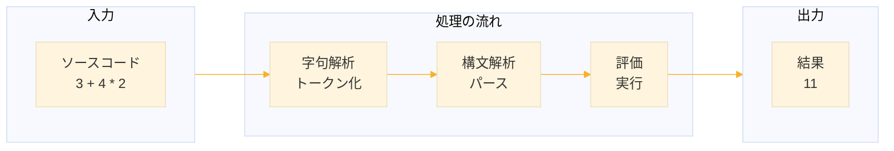
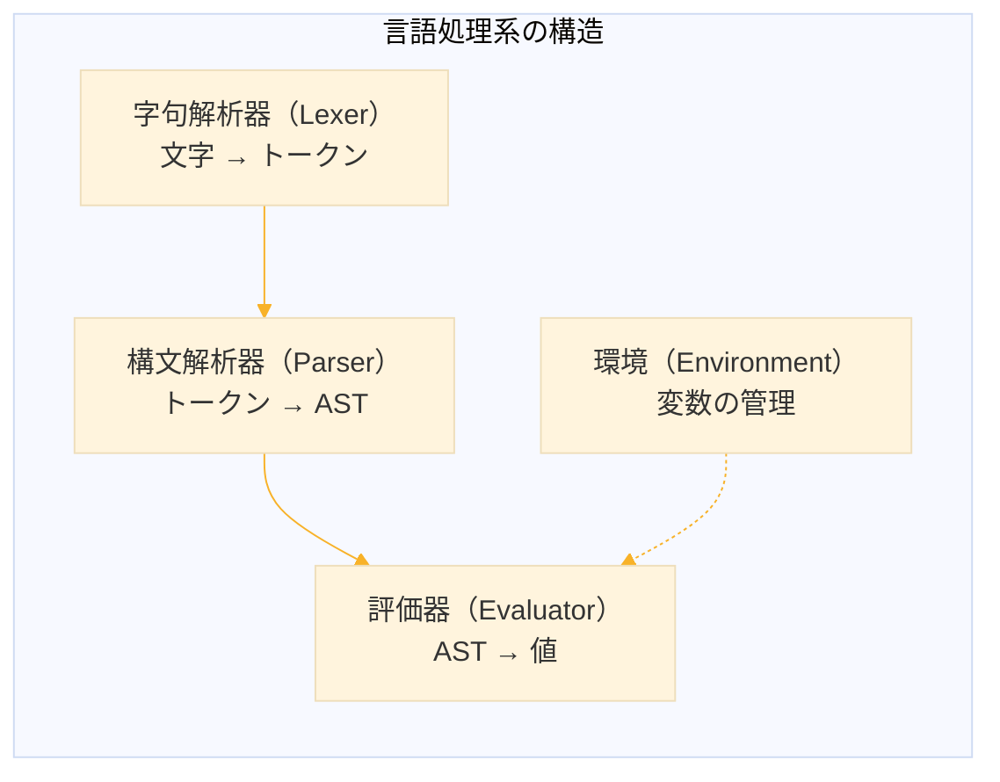
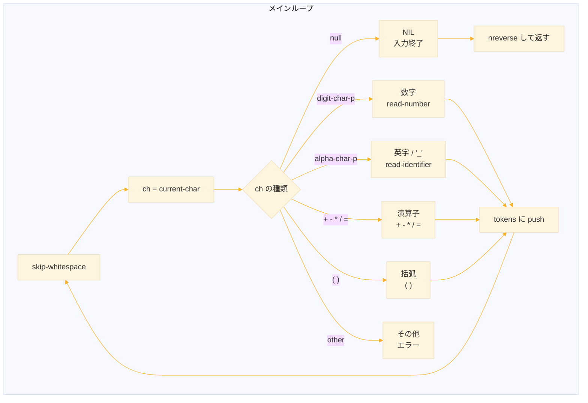
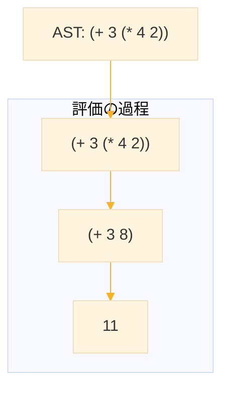
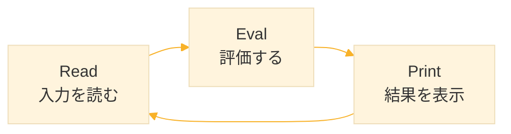
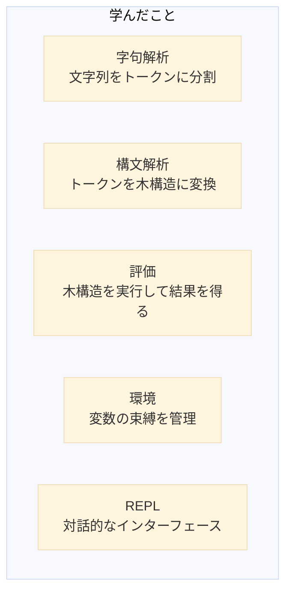
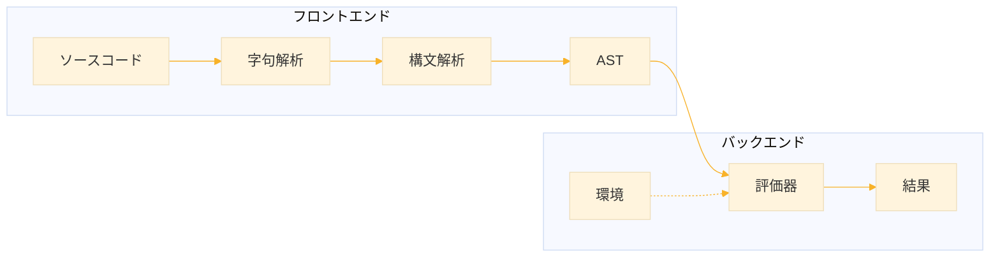

# Level 20-A (実践演習 ─ 電卓インタプリタ)
## 1. この章の概要

### 1-1. 学習目標

この章では、四則演算と変数をサポートする電卓インタプリタを実装する。「インタプリタ」とは、プログラムを読み込んで実行するプログラムのことだ。普段使っている Python や JavaScript、そして Common Lisp 自体もインタプリタ（またはコンパイラ）によって動作している。

言語処理系を自作することで、プログラミング言語がどのように動作するかを深く理解できる。この知識は、DSL（ドメイン固有言語）の設計、設定ファイルのパーサー作成、さらには新しいプログラミング言語の開発にも応用できる。



### 1-2. 扱う内容

言語処理系は、複数の段階（フェーズ）に分かれて処理を行う。本章では以下の技術を順に学ぶ。

| フェーズ | 説明 | 入力 | 出力 |
|----------|------|------|------|
| 字句解析（Lexer） | 文字列をトークンに分割 | `"3 + 4"` | `(3 + 4)` |
| 構文解析（Parser） | トークン列を木構造に変換 | `(3 + 4)` | `(+ 3 4)` |
| 評価（Evaluator） | 木構造を実行して結果を得る | `(+ 3 4)` | `7` |
| 環境（Environment） | 変数の値を管理 | `x = 10` | `{x: 10}` |

### 1-3. 作成するもの

本章で作成する電卓インタプリタは、以下の機能を持つ。

```
> 3 + 4 * 2
11
> (3 + 4) * 2
14
> x = 10
10
> x * 2 + 5
25
> y = x + 1
11
> x + y
21
```

**サポートする機能：**
- 四則演算（`+`, `-`, `*`, `/`）
- 括弧による優先順位の制御
- 変数の代入と参照
- 負の数（単項マイナス）
- 対話的な REPL（Read-Eval-Print Loop）


## 2. 言語処理系の基本構造

### 2-1. なぜ複数のフェーズに分けるのか

言語処理系を1つの大きなプログラムとして書くこともできるが、複数のフェーズに分けることで以下のメリットがある。

1. **関心の分離** ─ 各フェーズは1つの仕事に集中できる
2. **テストの容易さ** ─ 各フェーズを独立してテストできる
3. **再利用性** ─ パーサーを変えずに評価器だけ変更するなどが可能
4. **拡張性** ─ 新しい構文や機能を追加しやすい



### 2-2. 各フェーズの役割

#### 字句解析（Lexical Analysis / Tokenization）

ソースコードの文字列を「トークン」と呼ばれる意味のある単位に分割する。人間が文章を単語に分けて理解するのと同じだ。

```
入力: "3 + 42 * x"
出力: [数値:3] [演算子:+] [数値:42] [演算子:*] [識別子:x]
```

空白やコメントはこの段階で除去される。

#### 構文解析（Syntax Analysis / Parsing）

トークン列を解析し、プログラムの構造を表す木（抽象構文木、AST: Abstract Syntax Tree）を構築する。この段階で演算子の優先順位が処理される。

```
入力: [数値:3] [演算子:+] [数値:42] [演算子:*] [識別子:x]
出力: (+ 3 (* 42 x))
```

`*` は `+` より優先順位が高いので、`42 * x` が先にグループ化される。

#### 評価（Evaluation）

抽象構文木を走査し、実際に計算を行って結果を得る。変数があれば環境から値を取得する。

```
入力: (+ 3 (* 42 x))  環境: {x: 2}
計算: (+ 3 (* 42 2))
    = (+ 3 84)
    = 87
出力: 87
```

### 2-3. 本章での設計方針

Common Lisp の強みを活かし、以下の設計方針で実装する。

1. **トークンはシンボルと数値で表現** ─ 特別な構造体は使わない
2. **AST は S式で表現** ─ `(+ 3 (* 4 2))` のようなリスト構造
3. **環境は連想リストで表現** ─ `((x . 10) (y . 20))`
4. **再帰下降パーサー** ─ 文法規則を関数として実装

S式を AST として使うことで、パース結果をそのまま `eval` に渡すこともできる（ただし本章では独自の評価器を実装する）。


## 3. 字句解析（トークナイザ）

### 3-1. トークンの種類

電卓で扱うトークンは以下の種類がある。

| 種類 | 説明 | 例 |
|------|------|-----|
| 数値 | 整数または小数 | `42`, `3.14` |
| 識別子 | 変数名 | `x`, `foo`, `bar123` |
| 演算子 | 算術演算子 | `+`, `-`, `*`, `/` |
| 代入 | 代入演算子 | `=` |
| 括弧 | グループ化 | `(`, `)` |

### 3-2. トークナイザの実装

文字列を1文字ずつ読み進めながら、トークンのリストを構築する。

```lisp
(defun tokenize (input)
  "入力文字列をトークンのリストに変換する。"
  (let ((pos 0)                    ; 現在位置
        (len (length input))       ; 入力の長さ
        (tokens nil))              ; トークンを蓄積
    
    (labels
        ;; 現在の文字を取得（範囲外なら NIL）
        ((current-char ()
           (when (< pos len)
             (char input pos)))
         
         ;; 1文字進める
         (advance ()
           (incf pos))
         
         ;; 空白をスキップ
         (skip-whitespace ()
           (loop while (and (current-char)
                            (member (current-char) '(#\Space #\Tab #\Newline)))
                 do (advance)))
         
         ;; 数値を読み取る
         (read-number ()
           (let ((start pos))
             ;; 整数部分
             (loop while (and (current-char)
                              (digit-char-p (current-char)))
                   do (advance))
             ;; 小数部分（あれば）
             (when (and (current-char) (char= (current-char) #\.))
               (advance)
               (loop while (and (current-char)
                                (digit-char-p (current-char)))
                     do (advance)))
             ;; 文字列から数値に変換
             (read-from-string (subseq input start pos))))
         
         ;; 識別子を読み取る
         (read-identifier ()
           (let ((start pos))
             (loop while (and (current-char)
                              (or (alphanumericp (current-char))
                                  (char= (current-char) #\_)))
                   do (advance))
             ;; シンボルとして返す
             (intern (string-upcase (subseq input start pos))))))
      
      ;; メインループ：文字列を走査してトークン化
      (loop
        (skip-whitespace)
        (let ((ch (current-char)))
          (cond
            ;; 入力終了
            ((null ch)
             (return (nreverse tokens)))
            
            ;; 数値
            ((digit-char-p ch)
             (push (read-number) tokens))
            
            ;; 識別子（英字またはアンダースコアで始まる）
            ((or (alpha-char-p ch) (char= ch #\_))
             (push (read-identifier) tokens))
            
            ;; 演算子と括弧
            ((char= ch #\+) (advance) (push '+ tokens))
            ((char= ch #\-) (advance) (push '- tokens))
            ((char= ch #\*) (advance) (push '* tokens))
            ((char= ch #\/) (advance) (push '/ tokens))
            ((char= ch #\=) (advance) (push '= tokens))
            ((char= ch #\() (advance) (push 'lparen tokens))
            ((char= ch #\)) (advance) (push 'rparen tokens))
            
            ;; 不明な文字
            (t
             (error "不明な文字: ~A (位置 ~A)" ch pos))))))))
```




### 3-3. トークナイザのテスト

```lisp
;;; 基本的な式
(tokenize "3 + 4")
;; (3 + 4)

;;; 複雑な式
(tokenize "3 + 4 * 2")
;; (3 + 4 * 2)

;;; 括弧付き
(tokenize "(3 + 4) * 2")
;; (LPAREN 3 + 4 RPAREN * 2)

;;; 変数と代入
(tokenize "x = 10")
;; (X = 10)

;;; 小数
(tokenize "3.14 * r * r")
;; (3.14 * R * R)

;;; 複数の変数
(tokenize "result = x + y * 2")
;; (RESULT = X + Y * 2)
```

### 3-4. トークナイザの改良：負の数への対応

単項マイナス（負の数）に対応するには、トークナイザではなくパーサーで処理するのが一般的だ。`-5` は「マイナス演算子」と「5」の2つのトークンとして扱う。

```lisp
;;; -5 は2つのトークンになる
(tokenize "-5")
;; (- 5)

;;; これは後でパーサーが (neg 5) として解釈する
```


## 4. 構文解析（パーサー）

### 4-1. 文法の定義

電卓の文法を BNF（バッカス・ナウア記法）風に定義する。これは「どのような式が有効か」を形式的に記述したものだ。

```
文      ::= 代入文 | 式
代入文  ::= 識別子 '=' 式
式      ::= 項 (('+' | '-') 項)*
項      ::= 因子 (('*' | '/') 因子)*
因子    ::= 数値 | 識別子 | '(' 式 ')' | '-' 因子
```

この文法は演算子の優先順位を表現している。
- `*` と `/` は `+` と `-` より優先順位が高い
- 括弧は最も優先順位が高い
- 単項マイナスは因子レベルで処理

### 4-2. 再帰下降パーサーとは

「再帰下降パーサー」は、文法規則を関数として実装する手法だ。各規則が関数になり、規則内で他の規則を参照する場合は対応する関数を呼び出す。

```
式 ::= 項 (('+' | '-') 項)*
```

この規則は「式は、項の後に、0個以上の（'+' または '-' と項）が続く」と読む。これをそのまま関数にする。

### 4-3. パーサーの実装

トークン列を受け取り、AST（S式）を返すパーサーを実装する。

```lisp
(defun parse (tokens)
  "トークン列を解析して AST を返す。"
  (let ((pos 0))  ; 現在のトークン位置
    
    (labels
        ;; 現在のトークンを取得
        ((current-token ()
           (nth pos tokens))
         
         ;; 次のトークンを覗き見
         (peek-token ()
           (nth (1+ pos) tokens))
         
         ;; トークンを1つ進める
         (advance ()
           (prog1 (current-token)
             (incf pos)))
         
         ;; 期待するトークンを消費（なければエラー）
         (expect (expected)
           (if (eq (current-token) expected)
               (advance)
               (error "期待: ~A, 実際: ~A" expected (current-token))))
         
         ;; 文をパース（代入または式）
         (parse-statement ()
           (if (and (symbolp (current-token))
                    (not (member (current-token) '(LPAREN + - * /)))
                    (eq (peek-token) '=))
               ;; 代入文: 変数名 = 式
               (let ((var (advance)))  ; 変数名を取得
                 (advance)              ; '=' を消費
                 (list 'setq var (parse-expression)))
               ;; 式
               (parse-expression)))
         
         ;; 式をパース: 項 (('+' | '-') 項)*
         (parse-expression ()
           (let ((left (parse-term)))
             (loop while (member (current-token) '(+ -))
                   do (let ((op (advance))
                            (right (parse-term)))
                        (setf left (list op left right))))
             left))
         
         ;; 項をパース: 因子 (('*' | '/') 因子)*
         (parse-term ()
           (let ((left (parse-factor)))
             (loop while (member (current-token) '(* /))
                   do (let ((op (advance))
                            (right (parse-factor)))
                        (setf left (list op left right))))
             left))
         
         ;; 因子をパース: 数値 | 識別子 | '(' 式 ')' | '-' 因子
         (parse-factor ()
           (let ((token (current-token)))
             (cond
               ;; 数値
               ((numberp token)
                (advance))
               
               ;; 単項マイナス
               ((eq token '-)
                (advance)
                (list 'neg (parse-factor)))
               
               ;; 括弧
               ((eq token 'LPAREN)
                (advance)                    ; '(' を消費
                (let ((expr (parse-expression)))
                  (expect 'RPAREN)           ; ')' を期待
                  expr))
               
               ;; 識別子（変数）
               ((symbolp token)
                (advance))
               
               ;; エラー
               (t
                (error "予期しないトークン: ~A" token))))))
      
      ;; パース開始
      (let ((result (parse-statement)))
        ;; 全トークンを消費したか確認
        (when (current-token)
          (error "余分なトークン: ~A" (current-token)))
        result))))
```

### 4-4. パーサーのテスト

```lisp
;;; 単純な加算
(parse (tokenize "3 + 4"))
;; (+ 3 4)

;;; 優先順位の確認
;;; * は + より優先されるので、4 * 2 が先にグループ化
(parse (tokenize "3 + 4 * 2"))
;; (+ 3 (* 4 2))

;;; 括弧による優先順位の変更
(parse (tokenize "(3 + 4) * 2"))
;; (* (+ 3 4) 2)

;;; 連続した演算（左結合）
(parse (tokenize "1 + 2 + 3"))
;; (+ (+ 1 2) 3)

;;; 単項マイナス
(parse (tokenize "-5"))
;; (NEG 5)

(parse (tokenize "3 + -4"))
;; (+ 3 (NEG 4))

;;; 代入
(parse (tokenize "x = 10"))
;; (SETQ X 10)

;;; 式を含む代入
(parse (tokenize "y = x + 1"))
;; (SETQ Y (+ X 1))
```

### 4-5. AST の可視化

パース結果を見やすく表示する関数を作成する。

```lisp
(defun print-ast (ast &optional (indent 0))
  "AST を木構造として表示する。"
  (let ((prefix (make-string indent :initial-element #\Space)))
    (cond
      ;; アトム（数値やシンボル）
      ((atom ast)
       (format t "~A~A~%" prefix ast))
      ;; リスト（演算）
      (t
       (format t "~A~A~%" prefix (first ast))
       (dolist (child (rest ast))
         (print-ast child (+ indent 2)))))))
```

**実行例**

```lisp
(print-ast (parse (tokenize "3 + 4 * 2")))
;; +
;;   3
;;   *
;;     4
;;     2

(print-ast (parse (tokenize "(a + b) * (c - d)")))
;; *
;;   +
;;     A
;;     B
;;   -
;;     C
;;     D
```


## 5. 評価器（Evaluator）

### 5-1. 評価器の役割

評価器は AST を受け取り、実際に計算を実行して結果を返す。環境（変数の値を保持するもの）を参照しながら、再帰的に式を評価していく。



### 5-2. 環境の設計

変数の値を管理する「環境」は、連想リストで実装する。これは Level 19 で学んだデータ構造の応用だ。

```lisp
;;; 空の環境
(defparameter *global-env* nil)

;;; 環境に変数を追加（先頭に追加することで、同名変数のシャドウイングが可能）
(defun env-set (env var value)
  "環境に変数を設定する。新しい環境を返す。"
  (cons (cons var value) env))

;;; 環境から変数を取得
(defun env-get (env var)
  "環境から変数の値を取得する。見つからなければエラー。"
  (let ((pair (assoc var env)))
    (if pair
        (cdr pair)
        (error "未定義の変数: ~A" var))))

;;; 変数が定義されているか確認
(defun env-defined-p (env var)
  "変数が環境に定義されているか。"
  (not (null (assoc var env))))
```

**実行例**

```lisp
;;; 空の環境
(defparameter *env* nil)
;; *ENV*

;;; 変数を追加
(setf *env* (env-set *env* 'X 10))
;; ((X . 10))

(setf *env* (env-set *env* 'Y 20))
;; ((Y . 20) (X . 10))

;;; 変数を取得
(env-get *env* 'X)
;; 10

(env-get *env* 'Y)
;; 20

;;; 未定義の変数
(env-get *env* 'Z)
;; Error: 未定義の変数: Z
```

### 5-3. 評価器の実装

AST を再帰的に評価する関数を実装する。

```lisp
(defvar *env* nil "現在の環境")

(defun calc-eval (ast)
  "AST を評価して結果を返す。"
  (cond
    ;; 数値はそのまま返す
    ((numberp ast)
     ast)
    
    ;; シンボル（変数）は環境から値を取得
    ((symbolp ast)
     (env-get *env* ast))
    
    ;; リストは演算として処理
    ((listp ast)
     (let ((op (first ast)))
       (case op
         ;; 四則演算
         (+   (+ (calc-eval (second ast))
                 (calc-eval (third ast))))
         (-   (- (calc-eval (second ast))
                 (calc-eval (third ast))))
         (*   (* (calc-eval (second ast))
                 (calc-eval (third ast))))
         (/   (let ((divisor (calc-eval (third ast))))
                (if (zerop divisor)
                    (error "ゼロ除算エラー")
                    (/ (calc-eval (second ast)) divisor))))
         
         ;; 単項マイナス
         (neg (- (calc-eval (second ast))))
         
         ;; 代入
         (setq
          (let* ((var (second ast))
                 (value (calc-eval (third ast))))
            ;; グローバル環境を更新
            (setf *env* (env-set *env* var value))
            value))
         
         ;; 未知の演算子
         (otherwise
          (error "未知の演算子: ~A" op)))))
    
    ;; その他
    (t
     (error "評価できない式: ~A" ast))))
```

### 5-4. 評価器のテスト

```lisp
;;; 環境を初期化
(setf *env* nil)

;;; 数値の評価
(calc-eval 42)
;; 42

;;; 四則演算
(calc-eval '(+ 3 4))
;; 7

(calc-eval '(* 3 4))
;; 12

;;; ネストした式
(calc-eval '(+ 3 (* 4 2)))
;; 11

;;; 単項マイナス
(calc-eval '(neg 5))
;; -5

;;; 変数への代入
(calc-eval '(setq x 10))
;; 10

;;; 変数の参照
(calc-eval 'x)
;; 10

;;; 変数を使った計算
(calc-eval '(* x 2))
;; 20

;;; 複雑な式
(calc-eval '(setq y (+ x 5)))
;; 15

(calc-eval '(+ x y))
;; 25

;;; ゼロ除算
(calc-eval '(/ 10 0))
;; Error: ゼロ除算エラー
```

### 5-5. 統合：tokenize → parse → eval

3つのフェーズを統合した関数を作成する。

```lisp
(defun calc (input)
  "入力文字列を計算して結果を返す。"
  (calc-eval (parse (tokenize input))))
```

**実行例**

```lisp
(setf *env* nil)  ; 環境をリセット

(calc "3 + 4")
;; 7

(calc "3 + 4 * 2")
;; 11

(calc "(3 + 4) * 2")
;; 14

(calc "x = 10")
;; 10

(calc "y = x + 5")
;; 15

(calc "x * y")
;; 150

(calc "-5 + 3")
;; -2
```


## 6. REPL の実装

### 6-1. REPL とは

REPL は「Read-Eval-Print Loop」の略で、対話的にプログラムを実行する仕組みだ。Common Lisp の REPL と同様に、入力を読み込み、評価し、結果を表示するループを実装する。



### 6-2. 基本的な REPL

```lisp
(defun calc-repl ()
  "電卓の REPL を起動する。"
  (format t "~%=== 電卓インタプリタ ===~%")
  (format t "終了するには 'quit' と入力~%~%")
  
  ;; 環境を初期化
  (setf *env* nil)
  
  (loop
    ;; プロンプトを表示
    (format t "> ")
    (force-output)  ; 出力をフラッシュ
    
    ;; 入力を読み込む
    (let ((input (read-line *standard-input* nil)))
      (cond
        ;; EOF または quit で終了
        ((or (null input)
             (string-equal (string-trim " " input) "quit"))
         (format t "~%さようなら！~%")
         (return))
        
        ;; 空行はスキップ
        ((zerop (length (string-trim " " input)))
         nil)
        
        ;; 式を評価
        (t
         (handler-case
             (let ((result (calc input)))
               (format t "~A~%" result))
           ;; エラーをキャッチして表示
           (error (e)
             (format t "エラー: ~A~%" e))))))))
```

### 6-3. REPL の実行例

```
CL-USER> (calc-repl)

=== 電卓インタプリタ ===
終了するには 'quit' と入力

> 3 + 4
7
> 3 + 4 * 2
11
> (3 + 4) * 2
14
> x = 10
10
> y = 20
20
> x + y
30
> x * y / 2
100
> z = x + y * 2
50
> -5 + 10
5
> 10 / 0
エラー: ゼロ除算エラー
> quit

さようなら！
```

### 6-4. 機能拡張：定義済み変数の表示

環境の内容を表示するコマンドを追加する。

```lisp
(defun show-env ()
  "現在の環境（定義済み変数）を表示する。"
  (if (null *env*)
      (format t "定義済みの変数はありません~%")
      (progn
        (format t "定義済み変数:~%")
        (dolist (pair *env*)
          (format t "  ~A = ~A~%" (car pair) (cdr pair))))))

(defun calc-repl-extended ()
  "拡張版 REPL。コマンドをサポート。"
  (format t "~%=== 電卓インタプリタ ===~%")
  (format t "コマンド: quit(終了), env(変数一覧), clear(変数クリア)~%~%")
  
  (setf *env* nil)
  
  (loop
    (format t "> ")
    (force-output)
    
    (let ((input (read-line *standard-input* nil)))
      (cond
        ((or (null input)
             (string-equal (string-trim " " input) "quit"))
         (format t "~%さようなら！~%")
         (return))
        
        ;; env コマンド：変数一覧
        ((string-equal (string-trim " " input) "env")
         (show-env))
        
        ;; clear コマンド：変数クリア
        ((string-equal (string-trim " " input) "clear")
         (setf *env* nil)
         (format t "環境をクリアしました~%"))
        
        ;; 空行
        ((zerop (length (string-trim " " input)))
         nil)
        
        ;; 式を評価
        (t
         (handler-case
             (format t "~A~%" (calc input))
           (error (e)
             (format t "エラー: ~A~%" e))))))))
```


## 7. 完成したコード

すべてのコードをまとめた完成版。

```lisp
;;;; ===================================
;;;; 電卓インタプリタ
;;;; ===================================

;;; ========== 環境管理 ==========

(defvar *env* nil "現在の環境（変数束縛）")

(defun env-set (env var value)
  "環境に変数を設定する。"
  (cons (cons var value) env))

(defun env-get (env var)
  "環境から変数の値を取得する。"
  (let ((pair (assoc var env)))
    (if pair
        (cdr pair)
        (error "未定義の変数: ~A" var))))

;;; ========== 字句解析 ==========

(defun tokenize (input)
  "入力文字列をトークンのリストに変換する。"
  (let ((pos 0)
        (len (length input))
        (tokens nil))
    
    (labels
        ((current-char ()
           (when (< pos len) (char input pos)))
         
         (advance ()
           (incf pos))
         
         (skip-whitespace ()
           (loop while (and (current-char)
                            (member (current-char) '(#\Space #\Tab #\Newline)))
                 do (advance)))
         
         (read-number ()
           (let ((start pos))
             (loop while (and (current-char) (digit-char-p (current-char)))
                   do (advance))
             (when (and (current-char) (char= (current-char) #\.))
               (advance)
               (loop while (and (current-char) (digit-char-p (current-char)))
                     do (advance)))
             (read-from-string (subseq input start pos))))
         
         (read-identifier ()
           (let ((start pos))
             (loop while (and (current-char)
                              (or (alphanumericp (current-char))
                                  (char= (current-char) #\_)))
                   do (advance))
             (intern (string-upcase (subseq input start pos))))))
      
      (loop
        (skip-whitespace)
        (let ((ch (current-char)))
          (cond
            ((null ch) (return (nreverse tokens)))
            ((digit-char-p ch) (push (read-number) tokens))
            ((or (alpha-char-p ch) (char= ch #\_)) (push (read-identifier) tokens))
            ((char= ch #\+) (advance) (push '+ tokens))
            ((char= ch #\-) (advance) (push '- tokens))
            ((char= ch #\*) (advance) (push '* tokens))
            ((char= ch #\/) (advance) (push '/ tokens))
            ((char= ch #\=) (advance) (push '= tokens))
            ((char= ch #\() (advance) (push 'lparen tokens))
            ((char= ch #\)) (advance) (push 'rparen tokens))
            (t (error "不明な文字: ~A" ch))))))))

;;; ========== 構文解析 ==========

(defun parse (tokens)
  "トークン列を解析して AST を返す。"
  (let ((pos 0))
    
    (labels
        ((current-token () (nth pos tokens))
         (peek-token () (nth (1+ pos) tokens))
         (advance () (prog1 (current-token) (incf pos)))
         (expect (expected)
           (if (eq (current-token) expected)
               (advance)
               (error "期待: ~A, 実際: ~A" expected (current-token))))
         
         (parse-statement ()
           (if (and (symbolp (current-token))
                    (not (member (current-token) '(LPAREN + - * /)))
                    (eq (peek-token) '=))
               (let ((var (advance)))
                 (advance)
                 (list 'setq var (parse-expression)))
               (parse-expression)))
         
         (parse-expression ()
           (let ((left (parse-term)))
             (loop while (member (current-token) '(+ -))
                   do (let ((op (advance))
                            (right (parse-term)))
                        (setf left (list op left right))))
             left))
         
         (parse-term ()
           (let ((left (parse-factor)))
             (loop while (member (current-token) '(* /))
                   do (let ((op (advance))
                            (right (parse-factor)))
                        (setf left (list op left right))))
             left))
         
         (parse-factor ()
           (let ((token (current-token)))
             (cond
               ((numberp token) (advance))
               ((eq token '-) (advance) (list 'neg (parse-factor)))
               ((eq token 'LPAREN)
                (advance)
                (let ((expr (parse-expression)))
                  (expect 'RPAREN)
                  expr))
               ((symbolp token) (advance))
               (t (error "予期しないトークン: ~A" token))))))
      
      (let ((result (parse-statement)))
        (when (current-token)
          (error "余分なトークン: ~A" (current-token)))
        result))))

;;; ========== 評価 ==========

(defun calc-eval (ast)
  "AST を評価して結果を返す。"
  (cond
    ((numberp ast) ast)
    ((symbolp ast) (env-get *env* ast))
    ((listp ast)
     (let ((op (first ast)))
       (case op
         (+    (+ (calc-eval (second ast)) (calc-eval (third ast))))
         (-    (- (calc-eval (second ast)) (calc-eval (third ast))))
         (*    (* (calc-eval (second ast)) (calc-eval (third ast))))
         (/    (let ((divisor (calc-eval (third ast))))
                 (if (zerop divisor)
                     (error "ゼロ除算エラー")
                     (/ (calc-eval (second ast)) divisor))))
         (neg  (- (calc-eval (second ast))))
         (setq (let* ((var (second ast))
                      (value (calc-eval (third ast))))
                 (setf *env* (env-set *env* var value))
                 value))
         (otherwise (error "未知の演算子: ~A" op)))))
    (t (error "評価できない式: ~A" ast))))

;;; ========== 統合 ==========

(defun calc (input)
  "入力文字列を計算して結果を返す。"
  (calc-eval (parse (tokenize input))))

;;; ========== REPL ==========

(defun show-env ()
  "現在の環境を表示する。"
  (if (null *env*)
      (format t "定義済みの変数はありません~%")
      (progn
        (format t "定義済み変数:~%")
        (dolist (pair *env*)
          (format t "  ~A = ~A~%" (car pair) (cdr pair))))))

(defun calc-repl ()
  "電卓の REPL を起動する。"
  (format t "~%=== 電卓インタプリタ ===~%")
  (format t "コマンド: quit, env, clear~%~%")
  
  (setf *env* nil)
  
  (loop
    (format t "> ")
    (force-output)
    
    (let ((input (read-line *standard-input* nil)))
      (cond
        ((or (null input) (string-equal (string-trim " " input) "quit"))
         (format t "~%さようなら！~%")
         (return))
        ((string-equal (string-trim " " input) "env")
         (show-env))
        ((string-equal (string-trim " " input) "clear")
         (setf *env* nil)
         (format t "環境をクリアしました~%"))
        ((zerop (length (string-trim " " input)))
         nil)
        (t
         (handler-case
             (format t "~A~%" (calc input))
           (error (e)
             (format t "エラー: ~A~%" e))))))))
```


## 8. 練習課題

### 課題1：べき乗演算子の追加

べき乗演算子 `^` を追加せよ。`2 ^ 3` は `8` を返す。

**ヒント:**
- トークナイザに `^` を追加
- パーサーで優先順位を決める（乗除算より高い）
- 評価器で `expt` を使って計算

```
> 2 ^ 3
8
> 2 ^ 3 ^ 2
512
> 2 * 3 ^ 2
18
```


### 課題2：比較演算子

比較演算子（`<`, `>`, `<=`, `>=`, `==`, `!=`）を追加せよ。真なら `1`、偽なら `0` を返す。

```
> 3 < 5
1
> 3 > 5
0
> x = 10
10
> x == 10
1
> x != 10
0
```


### 課題3：組み込み関数

組み込み関数（`sqrt`, `abs`, `sin`, `cos`）を追加せよ。

```
> sqrt(16)
4.0
> abs(-5)
5
> sin(0)
0.0
> cos(0)
1.0
```

**ヒント:**
- トークナイザで関数名を識別子として読む
- パーサーで `識別子(式)` の形式を認識
- 評価器で関数を呼び出す


### 課題4：ユーザー定義関数

ユーザーが関数を定義できるようにせよ。

```
> def square(x) = x * x
<function: square>
> square(5)
25
> def add(a, b) = a + b
<function: add>
> add(3, 4)
7
```

**ヒント:**
- 関数定義用の構文を追加
- 環境に関数を保存
- 関数呼び出し時に引数を環境に束縛


## 9. 練習課題の解答

### 課題1の解答：べき乗演算子

べき乗は右結合（`2^3^2` = `2^9` = 512）にするのが一般的だ。

```lisp
;;; トークナイザに追加（tokenize 関数内）
((char= ch #\^) (advance) (push '^ tokens))

;;; パーサーに追加
;;; べき乗は乗除算より優先順位が高い
;;; 右結合にするため、再帰で処理

(defun parse-power ()
  "べき乗をパース（右結合）。"
  (let ((base (parse-factor)))
    (if (eq (current-token) '^)
        (progn
          (advance)
          ;; 右結合：再帰的に parse-power を呼ぶ
          (list '^ base (parse-power)))
        base)))

;;; parse-term を修正
(defun parse-term ()
  (let ((left (parse-power)))  ; parse-factor → parse-power
    (loop while (member (current-token) '(* /))
          do (let ((op (advance))
                   (right (parse-power)))  ; ここも
               (setf left (list op left right))))
    left))

;;; 評価器に追加（calc-eval の case 内）
(^    (expt (calc-eval (second ast)) (calc-eval (third ast))))
```

**テスト**

```lisp
(calc "2 ^ 3")
;; 8

(calc "2 ^ 3 ^ 2")  ; 2^(3^2) = 2^9 = 512
;; 512

(calc "2 * 3 ^ 2")  ; 2 * (3^2) = 2 * 9 = 18
;; 18

(calc "(2 * 3) ^ 2")  ; 6^2 = 36
;; 36
```


### 課題2の解答：比較演算子

比較演算子は算術演算子より優先順位が低い。

```lisp
;;; トークナイザに追加
;;; == と != は2文字なので特別処理
((char= ch #\<)
 (advance)
 (if (and (current-char) (char= (current-char) #\=))
     (progn (advance) (push '<= tokens))
     (push '< tokens)))
((char= ch #\>)
 (advance)
 (if (and (current-char) (char= (current-char) #\=))
     (progn (advance) (push '>= tokens))
     (push '> tokens)))
((char= ch #\=)
 (advance)
 (if (and (current-char) (char= (current-char) #\=))
     (progn (advance) (push '== tokens))
     (push '= tokens)))
((char= ch #\!)
 (advance)
 (if (and (current-char) (char= (current-char) #\=))
     (progn (advance) (push '!= tokens))
     (error "不明な文字: !")))

;;; パーサーに追加（式の最上位に比較を追加）
(defun parse-expression ()
  (let ((left (parse-additive)))
    (loop while (member (current-token) '(< > <= >= == !=))
          do (let ((op (advance))
                   (right (parse-additive)))
               (setf left (list op left right))))
    left))

(defun parse-additive ()
  "加減算をパース。"
  (let ((left (parse-term)))
    (loop while (member (current-token) '(+ -))
          do (let ((op (advance))
                   (right (parse-term)))
               (setf left (list op left right))))
    left))

;;; 評価器に追加
(<    (if (< (calc-eval (second ast)) (calc-eval (third ast))) 1 0))
(>    (if (> (calc-eval (second ast)) (calc-eval (third ast))) 1 0))
(<=   (if (<= (calc-eval (second ast)) (calc-eval (third ast))) 1 0))
(>=   (if (>= (calc-eval (second ast)) (calc-eval (third ast))) 1 0))
(==   (if (= (calc-eval (second ast)) (calc-eval (third ast))) 1 0))
(!=   (if (/= (calc-eval (second ast)) (calc-eval (third ast))) 1 0))
```

**テスト**

```lisp
(calc "3 < 5")
;; 1

(calc "3 > 5")
;; 0

(calc "3 + 2 < 10")  ; (3+2) < 10 = 5 < 10
;; 1

(calc "x = 10")
;; 10

(calc "x == 10")
;; 1

(calc "x >= 5")
;; 1
```


### 課題3の解答：組み込み関数

関数呼び出しは因子（factor）として扱う。

```lisp
;;; パーサーの parse-factor を修正
(defun parse-factor ()
  (let ((token (current-token)))
    (cond
      ((numberp token) (advance))
      ((eq token '-) (advance) (list 'neg (parse-factor)))
      ((eq token 'LPAREN)
       (advance)
       (let ((expr (parse-expression)))
         (expect 'RPAREN)
         expr))
      ;; 識別子の後に ( が続けば関数呼び出し
      ((symbolp token)
       (advance)
       (if (eq (current-token) 'LPAREN)
           ;; 関数呼び出し
           (progn
             (advance)  ; '(' を消費
             (let ((args nil))
               ;; 引数をパース
               (unless (eq (current-token) 'RPAREN)
                 (push (parse-expression) args)
                 (loop while (eq (current-token) 'COMMA)
                       do (advance)
                          (push (parse-expression) args)))
               (expect 'RPAREN)
               (list 'call token (nreverse args))))
           ;; 変数
           token))
      (t (error "予期しないトークン: ~A" token)))))

;;; トークナイザに追加（カンマ対応）
((char= ch #\,) (advance) (push 'comma tokens))

;;; 評価器に追加
(call
 (let ((func-name (second ast))
       (args (mapcar #'calc-eval (third ast))))
   (case func-name
     (SQRT (sqrt (first args)))
     (ABS  (abs (first args)))
     (SIN  (sin (first args)))
     (COS  (cos (first args)))
     (TAN  (tan (first args)))
     (LOG  (log (first args)))
     (EXP  (exp (first args)))
     ;; 2引数関数
     (MAX  (apply #'max args))
     (MIN  (apply #'min args))
     (POW  (expt (first args) (second args)))
     (otherwise
      (error "未知の関数: ~A" func-name)))))
```

**テスト**

```lisp
(calc "sqrt(16)")
;; 4.0

(calc "abs(-5)")
;; 5

(calc "sin(0)")
;; 0.0

(calc "cos(0)")
;; 1.0

(calc "max(3, 7, 2)")
;; 7

(calc "pow(2, 10)")
;; 1024

(calc "sqrt(pow(3, 2) + pow(4, 2))")  ; sqrt(9 + 16) = sqrt(25) = 5
;; 5.0
```


### 課題4の解答：ユーザー定義関数

関数定義と関数適用を実装する。

```lisp
;;; 関数を表す構造体
(defstruct user-function
  name
  params
  body)

;;; トークナイザに追加
;;; 'def' はキーワードとして扱う（識別子として読まれる）

;;; パーサーの parse-statement を修正
(defun parse-statement ()
  (cond
    ;; 関数定義: def name(params) = body
    ((eq (current-token) 'DEF)
     (advance)  ; 'def' を消費
     (let ((name (advance)))  ; 関数名
       (expect 'LPAREN)
       ;; パラメータをパース
       (let ((params nil))
         (unless (eq (current-token) 'RPAREN)
           (push (advance) params)
           (loop while (eq (current-token) 'COMMA)
                 do (advance)
                    (push (advance) params)))
         (expect 'RPAREN)
         (expect '=)
         (let ((body (parse-expression)))
           (list 'defun name (nreverse params) body)))))
    
    ;; 代入文
    ((and (symbolp (current-token))
          (not (member (current-token) '(LPAREN + - * /)))
          (eq (peek-token) '=))
     (let ((var (advance)))
       (advance)
       (list 'setq var (parse-expression))))
    
    ;; 式
    (t (parse-expression))))

;;; 評価器に追加
(defun
 (let* ((name (second ast))
        (params (third ast))
        (body (fourth ast))
        (func (make-user-function :name name
                                  :params params
                                  :body body)))
   ;; 関数を環境に保存
   (setf *env* (env-set *env* name func))
   (format nil "<function: ~A>" name)))

;;; call の処理を修正（ユーザー定義関数に対応）
(call
 (let ((func-name (second ast))
       (arg-values (mapcar #'calc-eval (third ast))))
   ;; 組み込み関数をチェック
   (case func-name
     (SQRT (sqrt (first arg-values)))
     (ABS  (abs (first arg-values)))
     ;; ... 他の組み込み関数 ...
     (otherwise
      ;; ユーザー定義関数を探す
      (let ((func (env-get *env* func-name)))
        (if (user-function-p func)
            ;; 関数を適用
            (let ((params (user-function-params func))
                  (body (user-function-body func)))
              ;; 引数を環境に束縛
              (let ((*env* *env*))  ; ローカルスコープ
                (loop for param in params
                      for value in arg-values
                      do (setf *env* (env-set *env* param value)))
                (calc-eval body)))
            (error "~A は関数ではありません" func-name)))))))
```

**テスト**

```lisp
(setf *env* nil)

(calc "def square(x) = x * x")
;; "<function: SQUARE>"

(calc "square(5)")
;; 25

(calc "def add(a, b) = a + b")
;; "<function: ADD>"

(calc "add(3, 4)")
;; 7

(calc "def hypotenuse(a, b) = sqrt(a*a + b*b)")
;; "<function: HYPOTENUSE>"

(calc "hypotenuse(3, 4)")
;; 5.0

;;; 関数の組み合わせ
(calc "square(add(2, 3))")  ; square(5) = 25
;; 25
```


## 10. 発展的なトピック

### 10-1. 言語処理系の発展

本章で作成した電卓インタプリタは、より本格的な言語処理系の基礎となる。以下に発展の方向性を示す。

#### 制御構造の追加

条件分岐やループを追加すると、より強力な言語になる。

```
if x > 0 then x else -x
while x > 0 do x = x - 1
```

#### 複合文

複数の文を順番に実行できるようにする。

```
{ x = 10; y = 20; x + y }
```

#### データ構造

リストや配列をサポートする。

```
arr = [1, 2, 3, 4, 5]
arr[0]  ; → 1
```

### 10-2. 最適化

評価器で毎回 AST を走査するのは効率が悪い。以下の最適化が考えられる。

1. **定数畳み込み** ─ `3 + 4` をパース時に `7` に置き換える
2. **バイトコード化** ─ AST を中間表現に変換してから実行
3. **JIT コンパイル** ─ 実行時にネイティブコードを生成

### 10-3. Common Lisp 処理系との連携

本章の電卓は独自の評価器を実装したが、AST を Common Lisp のコードに変換して `eval` で実行する方法もある。

```lisp
(defun compile-to-lisp (ast)
  "AST を Common Lisp のコードに変換する。"
  (cond
    ((numberp ast) ast)
    ((symbolp ast) ast)
    ((listp ast)
     (case (first ast)
       (neg `(- ,(compile-to-lisp (second ast))))
       (setq `(setf ,(second ast) ,(compile-to-lisp (third ast))))
       (otherwise
        `(,(first ast)
          ,(compile-to-lisp (second ast))
          ,(compile-to-lisp (third ast))))))))

;;; 使用例
(compile-to-lisp '(+ 3 (* 4 2)))
;; (+ 3 (* 4 2))

(eval (compile-to-lisp '(+ 3 (* 4 2))))
;; 11
```


## 11. まとめ

### この章で学んだこと

本章では、電卓インタプリタの実装を通じて、言語処理系の基礎を学んだ。



1. **字句解析（Lexer）** ─ 文字列をトークンに分割する方法
2. **構文解析（Parser）** ─ 再帰下降法による文法解析
3. **評価器（Evaluator）** ─ AST を実行して結果を得る方法
4. **環境（Environment）** ─ 変数の束縛を管理する仕組み
5. **REPL** ─ 対話的なプログラム実行環境

### 主要な関数一覧

| 関数 | 役割 |
|------|------|
| `tokenize` | 文字列をトークン列に変換 |
| `parse` | トークン列を AST に変換 |
| `calc-eval` | AST を評価して結果を返す |
| `calc` | 入力文字列を計算（統合関数） |
| `env-set` | 環境に変数を設定 |
| `env-get` | 環境から変数を取得 |
| `calc-repl` | 対話的な REPL を起動 |

### 言語処理系の全体像




