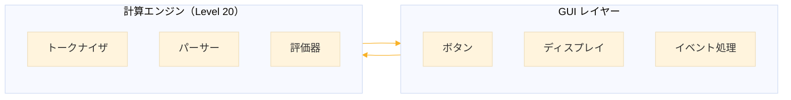
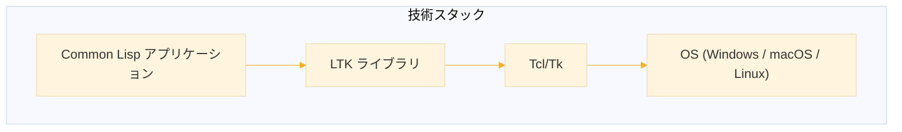
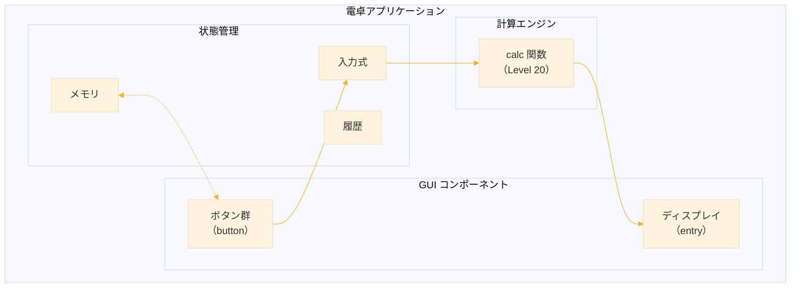
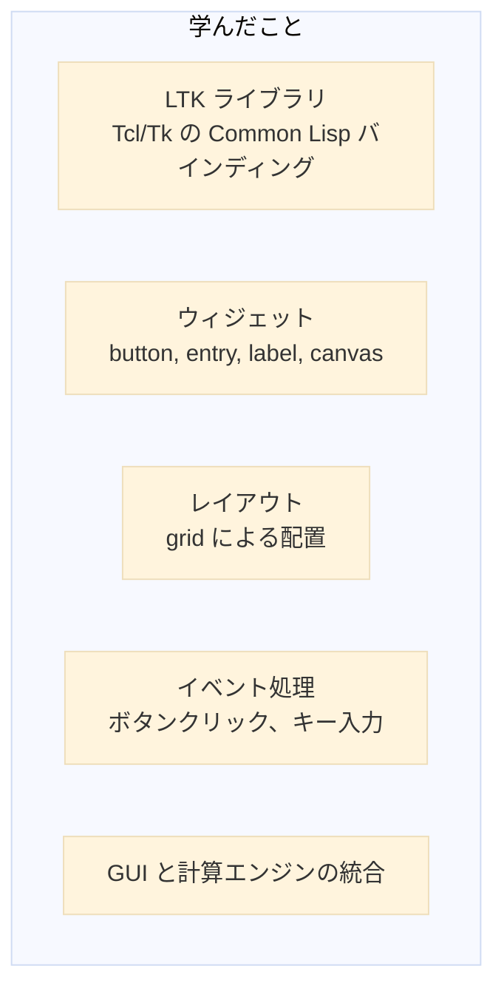

# Level 20-B (実践演習 ─ GUI 関数電卓)
## 1. この章の概要

### 1-1. 学習目標

Level 20 で作成した電卓インタプリタに、グラフィカルユーザーインターフェース（GUI）を追加する。Common Lisp から Tcl/Tk を利用するための LTK ライブラリを使用し、実用的な関数電卓アプリケーションを構築する。



### 1-2. 扱う内容

| トピック | 説明 |
|----------|------|
| LTK | Common Lisp 用 Tcl/Tk バインディング |
| ウィジェット | ボタン、ラベル、エントリーなどの GUI 部品 |
| レイアウト | grid によるウィジェット配置 |
| イベント処理 | ボタンクリック、キーボード入力の処理 |
| 関数電卓 | 三角関数、対数、メモリ機能 |

### 1-3. 作成するもの

```
┌─────────────────────────────────────┐
│  0                                  │  ← ディスプレイ
├─────────────────────────────────────┤
│ MC  MR  M+  M-  │  C   ←  │  (   ) │
├─────────────────────────────────────┤
│ sin cos tan log │  7   8   9   ÷   │
├─────────────────────────────────────┤
│ √   x²  xʸ  π   │  4   5   6   ×   │
├─────────────────────────────────────┤
│ abs  1/x  %  e  │  1   2   3   −   │
├─────────────────────────────────────┤
│    ±    │   0   │   .   │    =    +│
└─────────────────────────────────────┘
```

**機能一覧：**
- 四則演算（+, -, *, /）
- 関数（sin, cos, tan, log, sqrt, abs）
- べき乗（x², xʸ）
- 定数（π, e）
- メモリ機能（MC, MR, M+, M-）
- 括弧、パーセント計算


## 2. LTK の導入

### 2-1. LTK とは

LTK（Lisp Toolkit）は、Common Lisp から Tcl/Tk を使用するためのライブラリだ。Tcl/Tk は、クロスプラットフォームの GUI ツールキットで、Windows、macOS、Linux で動作する。



### 2-2. インストール

#### Tcl/Tk のインストール

**Windows:**
- ActiveTcl をインストール: https://www.activestate.com/products/tcl/
- または、MSYS2 で `pacman -S mingw-w64-x86_64-tk`

**macOS:**
```bash
brew install tcl-tk
```

**Linux (Ubuntu/Debian):**
```bash
sudo apt install tk
```

#### LTK のインストール

```lisp
;;; Quicklisp でインストール
(ql:quickload :ltk)
```

### 2-3. 動作確認

```lisp
(ql:quickload :ltk)

;;; 最小限のウィンドウを表示
(ltk:with-ltk ()
  (let ((button (make-instance 'ltk:button
                               :text "Hello, LTK!"
                               :command (lambda ()
                                          (format t "ボタンが押されました~%")))))
    (ltk:pack button)))
```

このコードを実行すると、ボタンが1つだけのウィンドウが表示される。ボタンをクリックすると REPL にメッセージが出力される。


## 3. LTK の基本

### 3-1. ウィジェットの種類

LTK で使用できる主なウィジェット（GUI 部品）を紹介する。

| ウィジェット | クラス名 | 用途 |
|-------------|----------|------|
| ボタン | `button` | クリック可能なボタン |
| ラベル | `label` | テキスト表示 |
| エントリー | `entry` | 1行テキスト入力 |
| テキスト | `text` | 複数行テキスト入力 |
| フレーム | `frame` | ウィジェットのコンテナ |
| キャンバス | `canvas` | 図形描画 |

### 3-2. ウィジェットの作成と配置

```lisp
(ltk:with-ltk ()
  ;; ラベルを作成
  (let ((label (make-instance 'ltk:label
                              :text "計算結果:"))
        (entry (make-instance 'ltk:entry
                              :width 30))
        (button (make-instance 'ltk:button
                               :text "計算"
                               :command (lambda ()
                                          (format t "計算実行~%")))))
    
    ;; pack でウィジェットを配置（上から順に）
    (ltk:pack label)
    (ltk:pack entry)
    (ltk:pack button)))
```

### 3-3. grid レイアウト

電卓のような整列したレイアウトには `grid` を使う。行（row）と列（column）を指定してウィジェットを配置する。

```lisp
(ltk:with-ltk ()
  (let ((b1 (make-instance 'ltk:button :text "1"))
        (b2 (make-instance 'ltk:button :text "2"))
        (b3 (make-instance 'ltk:button :text "3"))
        (b4 (make-instance 'ltk:button :text "4"))
        (b5 (make-instance 'ltk:button :text "5"))
        (b6 (make-instance 'ltk:button :text "6")))
    
    ;; 2行3列のグリッド配置
    (ltk:grid b1 0 0)  ; 0行0列
    (ltk:grid b2 0 1)  ; 0行1列
    (ltk:grid b3 0 2)  ; 0行2列
    (ltk:grid b4 1 0)  ; 1行0列
    (ltk:grid b5 1 1)  ; 1行1列
    (ltk:grid b6 1 2)  ; 1行2列
    ))
```

```
┌───┬───┬───┐
│ 1 │ 2 │ 3 │  ← row 0
├───┼───┼───┤
│ 4 │ 5 │ 6 │  ← row 1
└───┴───┴───┘
  ↑   ↑   ↑
col0 col1 col2
```

### 3-4. grid のオプション

grid にはさまざまなオプションがある。実際の例で確認しよう。

```lisp
(ltk:with-ltk ()
  (let ((btn1 (make-instance 'ltk:button :text "2列にまたがる"))
        (btn2 (make-instance 'ltk:button :text "A"))
        (btn3 (make-instance 'ltk:button :text "B"))
        (btn4 (make-instance 'ltk:button :text "上下左右に広がる"))
        (btn5 (make-instance 'ltk:button :text "余白付き")))
    
    ;; columnspan: 複数列にまたがる
    (ltk:grid btn1 0 0 :columnspan 2)
    
    ;; 通常配置
    (ltk:grid btn2 1 0)
    (ltk:grid btn3 1 1)
    
    ;; sticky: セル内での広がり方
    ;; "nsew" = 上(n)下(s)左(w)右(e)に広がる
    (ltk:grid btn4 2 0 :columnspan 2 :sticky "nsew")
    
    ;; padx/pady: 外側の余白
    (ltk:grid btn5 3 0 :columnspan 2 :padx 10 :pady 10)))
```

**オプション一覧：**

| オプション | 説明 | 例 |
|-----------|------|-----|
| `:columnspan` | 横方向に複数列を占有 | `:columnspan 2` |
| `:rowspan` | 縦方向に複数行を占有 | `:rowspan 2` |
| `:sticky` | セル内での配置方向 | `"nsew"`, `"e"`, `"w"` |
| `:padx` | 左右の余白（ピクセル） | `:padx 5` |
| `:pady` | 上下の余白（ピクセル） | `:pady 5` |

**sticky の値：**

| 値 | 意味 |
|----|------|
| `"n"` | 上寄せ |
| `"s"` | 下寄せ |
| `"e"` | 右寄せ |
| `"w"` | 左寄せ |
| `"ns"` | 上下に広がる |
| `"ew"` | 左右に広がる |
| `"nsew"` | 上下左右に広がる（セル全体を埋める） |

### 3-5. ウィジェットのスタイル設定

ウィジェットのスタイル（フォントなど）は `configure` で設定する。

```lisp
(ltk:with-ltk ()
  ;; ボタンのスタイル
  (let ((btn (make-instance 'ltk:button
                            :text "OK"
                            :width 10)))
    (ltk:pack btn))
  
  ;; エントリーのスタイル
  (let ((entry (make-instance 'ltk:entry
                              :width 40)))
    (ltk:configure entry :font "Courier 18")
    (ltk:configure entry :justify "right")  ; 右揃え
    (ltk:pack entry)))
```

**注意:** 
- `:font` や `:justify` は `make-instance` の初期化引数としては使えない。`configure` で設定すること。
- LTK のボタンは ttk（テーマ付きウィジェット）を使用しているため、`:background` や `:foreground` での色変更はできない。


## 4. 電卓の GUI 設計

### 4-1. 構造の設計

電卓アプリケーションを以下のコンポーネントに分割する。



### 4-2. グローバル状態

```lisp
;;; 電卓の状態を管理するグローバル変数
(defvar *display* nil "ディスプレイウィジェット")
(defvar *expression* "" "現在の入力式")
(defvar *memory* 0 "メモリの値")
(defvar *last-result* 0 "最後の計算結果")
(defvar *just-calculated* nil "計算直後フラグ")
```

### 4-3. ディスプレイの実装

```lisp
(defun create-display (parent)
  "ディスプレイ（入力/結果表示エリア）を作成する。"
  (let ((display (make-instance 'ltk:entry
                                :master parent
                                :width 35)))
    ;; スタイルを設定（configure を使用）
    (ltk:configure display :font "Consolas 20")
    (ltk:configure display :justify "right")
    ;; 初期値を設定
    (setf (ltk:text display) "0")
    ;; グローバル変数に保存
    (setf *display* display)
    display))

(defun display-set (text)
  "ディスプレイに値を設定する。"
  (setf (ltk:text *display*) text)
  (setf *expression* text))

(defun display-get ()
  "ディスプレイの値を取得する。"
  (ltk:text *display*))

(defun display-append (text)
  "ディスプレイに文字を追加する。"
  (when *just-calculated*
    ;; 計算直後なら、数字入力で新しい式を開始
    (when (digit-char-p (char text 0))
      (display-set ""))
    (setf *just-calculated* nil))
  (let ((current (display-get)))
    (if (string= current "0")
        (display-set text)
        (display-set (concatenate 'string current text)))))
```

### 4-4. ボタンの実装

```lisp
(defun make-calc-button (parent text row col 
                         &key (colspan 1) (rowspan 1)
                              (width 5)
                              action)
  "電卓用ボタンを作成して配置する。"
  (let* ((cmd (or action
                  ;; デフォルトは入力追加
                  (lambda () (display-append text))))
         (button (make-instance 'ltk:button
                                :master parent
                                :text text
                                :width width
                                :command cmd)))
    ;; グリッドに配置
    (ltk:grid button row col
              :columnspan colspan
              :rowspan rowspan
              :sticky "nsew"
              :padx 1 :pady 1)
    button))
```


## 5. 計算エンジンとの統合

### 5-1. Level 20 のエンジンを拡張

Level 20 で作成した電卓エンジンに、GUI 用の関数を追加する。

```lisp
;;;; ===================================
;;;; 計算エンジン（Level 20 拡張版）
;;;; ===================================

(defvar *env* nil "計算環境")

;;; ========== 環境管理 ==========

(defun env-set (env var value)
  (cons (cons var value) env))

(defun env-get (env var)
  (let ((pair (assoc var env)))
    (if pair
        (cdr pair)
        (error "未定義: ~A" var))))

;;; ========== 字句解析 ==========

(defun tokenize (input)
  "入力文字列をトークンのリストに変換する。"
  (let ((pos 0)
        (len (length input))
        (tokens nil))
    
    (labels
        ((current-char ()
           (when (< pos len) (char input pos)))
         
         (advance ()
           (incf pos))
         
         (skip-whitespace ()
           (loop while (and (current-char)
                            (member (current-char) '(#\Space #\Tab #\Newline)))
                 do (advance)))
         
         (read-number ()
           (let ((start pos))
             (loop while (and (current-char) (digit-char-p (current-char)))
                   do (advance))
             (when (and (current-char) (char= (current-char) #\.))
               (advance)
               (loop while (and (current-char) (digit-char-p (current-char)))
                     do (advance)))
             (read-from-string (subseq input start pos))))
         
         (read-identifier ()
           (let ((start pos))
             (loop while (and (current-char)
                              (or (alphanumericp (current-char))
                                  (char= (current-char) #\_)))
                   do (advance))
             (intern (string-upcase (subseq input start pos))))))
      
      (loop
        (skip-whitespace)
        (let ((ch (current-char)))
          (cond
            ((null ch) (return (nreverse tokens)))
            ((digit-char-p ch) (push (read-number) tokens))
            ((or (alpha-char-p ch) (char= ch #\_)) (push (read-identifier) tokens))
            ((char= ch #\+) (advance) (push '+ tokens))
            ((char= ch #\-) (advance) (push '- tokens))
            ((char= ch #\*) (advance) (push '* tokens))
            ((char= ch #\/) (advance) (push '/ tokens))
            ((char= ch #\^) (advance) (push '^ tokens))
            ((char= ch #\%) (advance) (push '% tokens))
            ((char= ch #\() (advance) (push 'lparen tokens))
            ((char= ch #\)) (advance) (push 'rparen tokens))
            ((char= ch #\,) (advance) (push 'comma tokens))
            (t (error "不明な文字: ~A" ch))))))))

;;; ========== 構文解析 ==========

(defun parse (tokens)
  "トークン列を解析して AST を返す。"
  (let ((pos 0))
    
    (labels
        ((current-token () (nth pos tokens))
         (peek-token () (nth (1+ pos) tokens))
         (advance () (prog1 (current-token) (incf pos)))
         (expect (expected)
           (if (eq (current-token) expected)
               (advance)
               (error "期待: ~A, 実際: ~A" expected (current-token))))
         
         (parse-expression ()
           (let ((left (parse-term)))
             (loop while (member (current-token) '(+ -))
                   do (let ((op (advance))
                            (right (parse-term)))
                        (setf left (list op left right))))
             left))
         
         (parse-term ()
           (let ((left (parse-power)))
             (loop while (member (current-token) '(* / %))
                   do (let ((op (advance))
                            (right (parse-power)))
                        (setf left (list op left right))))
             left))
         
         (parse-power ()
           (let ((base (parse-factor)))
             (if (eq (current-token) '^)
                 (progn
                   (advance)
                   (list '^ base (parse-power)))
                 base)))
         
         (parse-factor ()
           (let ((token (current-token)))
             (cond
               ((numberp token) (advance))
               ((eq token '-)
                (advance)
                (list 'neg (parse-factor)))
               ((eq token 'LPAREN)
                (advance)
                (let ((expr (parse-expression)))
                  (expect 'RPAREN)
                  expr))
               ;; 関数呼び出し
               ((and (symbolp token)
                     (eq (peek-token) 'LPAREN))
                (advance)  ; 関数名
                (advance)  ; '('
                (let ((args nil))
                  (unless (eq (current-token) 'RPAREN)
                    (push (parse-expression) args)
                    (loop while (eq (current-token) 'COMMA)
                          do (advance)
                             (push (parse-expression) args)))
                  (expect 'RPAREN)
                  (list 'call token (nreverse args))))
               ;; 定数
               ((symbolp token)
                (advance)
                (list 'const token))
               (t (error "予期しないトークン: ~A" token))))))
      
      (let ((result (parse-expression)))
        (when (current-token)
          (error "余分なトークン: ~A" (current-token)))
        result))))

;;; ========== 評価 ==========

(defun calc-eval (ast)
  "AST を評価して結果を返す。"
  (cond
    ((numberp ast) ast)
    ((listp ast)
     (let ((op (first ast)))
       (case op
         (+    (+ (calc-eval (second ast)) (calc-eval (third ast))))
         (-    (- (calc-eval (second ast)) (calc-eval (third ast))))
         (*    (* (calc-eval (second ast)) (calc-eval (third ast))))
         (/    (let ((divisor (calc-eval (third ast))))
                 (if (zerop divisor)
                     (error "ゼロ除算")
                     (/ (calc-eval (second ast)) divisor))))
         (^    (expt (calc-eval (second ast)) (calc-eval (third ast))))
         (%    (* (calc-eval (second ast)) (/ (calc-eval (third ast)) 100)))
         (neg  (- (calc-eval (second ast))))
         
         ;; 定数
         (const
          (case (second ast)
            (PI pi)
            (E (exp 1.0d0))
            (otherwise (env-get *env* (second ast)))))
         
         ;; 関数呼び出し
         (call
          (let ((func (second ast))
                (args (mapcar #'calc-eval (third ast))))
            (case func
              (SIN   (sin (first args)))
              (COS   (cos (first args)))
              (TAN   (tan (first args)))
              (ASIN  (asin (first args)))
              (ACOS  (acos (first args)))
              (ATAN  (atan (first args)))
              (LOG   (log (first args)))
              (LOG10 (log (first args) 10))
              (EXP   (exp (first args)))
              (SQRT  (sqrt (first args)))
              (ABS   (abs (first args)))
              (FLOOR (floor (first args)))
              (CEIL  (ceiling (first args)))
              (ROUND (round (first args)))
              (otherwise (error "未知の関数: ~A" func)))))
         
         (otherwise (error "未知の演算子: ~A" op)))))
    (t (error "評価不能: ~A" ast))))

;;; ========== 統合 ==========

(defun calc (input)
  "入力文字列を計算して結果を返す。"
  (handler-case
      (let ((result (calc-eval (parse (tokenize input)))))
        ;; 結果を適切な形式に変換
        (if (and (rationalp result) (not (integerp result)))
            (float result)
            result))
    (error (e)
      (format nil "Error: ~A" e))))
```

### 5-2. GUI からエンジンを呼び出す

```lisp
(defun calculate ()
  "現在の入力式を計算して結果を表示する。"
  (let* ((expr (display-get))
         (result (calc expr)))
    (if (stringp result)
        ;; エラーの場合
        (progn
          (display-set result)
          (setf *just-calculated* t))
        ;; 成功の場合
        (progn
          (setf *last-result* result)
          (display-set (format-number result))
          (setf *just-calculated* t)))))

(defun format-number (n)
  "数値を表示用にフォーマットする。"
  (cond
    ;; 整数
    ((integerp n)
     (format nil "~D" n))
    ;; 浮動小数点
    ((floatp n)
     (let ((str (format nil "~F" n)))
       ;; 末尾の不要な0を除去
       (string-right-trim "0" 
         (if (find #\. str)
             (string-right-trim "." str)
             str))))
    ;; その他
    (t (format nil "~A" n))))
```


## 6. 電卓アプリケーションの実装

### 6-1. メモリ機能

```lisp
(defun memory-clear ()
  "メモリをクリアする。"
  (setf *memory* 0))

(defun memory-recall ()
  "メモリの値をディスプレイに表示する。"
  (display-set (format-number *memory*)))

(defun memory-add ()
  "ディスプレイの値をメモリに加算する。"
  (let ((val (calc (display-get))))
    (when (numberp val)
      (incf *memory* val))))

(defun memory-subtract ()
  "ディスプレイの値をメモリから減算する。"
  (let ((val (calc (display-get))))
    (when (numberp val)
      (decf *memory* val))))
```

### 6-2. その他のユーティリティ

```lisp
(defun clear-all ()
  "全てクリアする。"
  (display-set "0")
  (setf *expression* ""
        *just-calculated* nil))

(defun backspace ()
  "1文字削除する。"
  (let ((current (display-get)))
    (if (> (length current) 1)
        (display-set (subseq current 0 (1- (length current))))
        (display-set "0"))))

(defun toggle-sign ()
  "符号を反転する。"
  (let ((current (display-get)))
    (cond
      ((string= current "0") nil)
      ((char= (char current 0) #\-)
       (display-set (subseq current 1)))
      (t
       (display-set (concatenate 'string "-" current))))))

(defun insert-function (name)
  "関数を挿入する。"
  (display-append (format nil "~A(" name)))

(defun square ()
  "二乗を計算する。"
  (let* ((current (display-get))
         (result (calc (format nil "(~A)^2" current))))
    (when (numberp result)
      (display-set (format-number result))
      (setf *just-calculated* t))))

(defun reciprocal ()
  "逆数を計算する。"
  (let* ((current (display-get))
         (result (calc (format nil "1/(~A)" current))))
    (if (numberp result)
        (progn
          (display-set (format-number result))
          (setf *just-calculated* t))
        (display-set "Error"))))
```

### 6-3. ボタン配置

```lisp
(defun create-buttons (parent)
  "電卓のボタンを作成する。"
  
  ;; メモリボタン（行1）※ディスプレイが行0
  (make-calc-button parent "MC" 1 0 :action #'memory-clear)
  (make-calc-button parent "MR" 1 1 :action #'memory-recall)
  (make-calc-button parent "M+" 1 2 :action #'memory-add)
  (make-calc-button parent "M-" 1 3 :action #'memory-subtract)
  (make-calc-button parent "C" 1 4 :action #'clear-all)
  (make-calc-button parent "←" 1 5 :action #'backspace)
  (make-calc-button parent "(" 1 6)
  (make-calc-button parent ")" 1 7)
  
  ;; 関数ボタン（行2）
  (make-calc-button parent "sin" 2 0
                    :action (lambda () (insert-function "sin")))
  (make-calc-button parent "cos" 2 1
                    :action (lambda () (insert-function "cos")))
  (make-calc-button parent "tan" 2 2
                    :action (lambda () (insert-function "tan")))
  (make-calc-button parent "log" 2 3
                    :action (lambda () (insert-function "log")))
  ;; 数字 7, 8, 9
  (make-calc-button parent "7" 2 4)
  (make-calc-button parent "8" 2 5)
  (make-calc-button parent "9" 2 6)
  (make-calc-button parent "÷" 2 7
                    :action (lambda () (display-append "/")))
  
  ;; 関数ボタン（行3）
  (make-calc-button parent "√" 3 0
                    :action (lambda () (insert-function "sqrt")))
  (make-calc-button parent "x²" 3 1 :action #'square)
  (make-calc-button parent "xʸ" 3 2
                    :action (lambda () (display-append "^")))
  (make-calc-button parent "π" 3 3
                    :action (lambda () (display-append "PI")))
  ;; 数字 4, 5, 6
  (make-calc-button parent "4" 3 4)
  (make-calc-button parent "5" 3 5)
  (make-calc-button parent "6" 3 6)
  (make-calc-button parent "×" 3 7
                    :action (lambda () (display-append "*")))
  
  ;; 関数ボタン（行4）
  (make-calc-button parent "abs" 4 0
                    :action (lambda () (insert-function "abs")))
  (make-calc-button parent "1/x" 4 1 :action #'reciprocal)
  (make-calc-button parent "%" 4 2
                    :action (lambda () (display-append "%")))
  (make-calc-button parent "e" 4 3
                    :action (lambda () (display-append "E")))
  ;; 数字 1, 2, 3
  (make-calc-button parent "1" 4 4)
  (make-calc-button parent "2" 4 5)
  (make-calc-button parent "3" 4 6)
  (make-calc-button parent "−" 4 7
                    :action (lambda () (display-append "-")))
  
  ;; 最下行（行5）
  (make-calc-button parent "±" 5 0 :action #'toggle-sign)
  (make-calc-button parent "0" 5 1 :colspan 2 :width 11)
  ;; colspan の影響で列番号が変わることに注意
  (make-calc-button parent "." 5 3)
  (make-calc-button parent "=" 5 4 :colspan 2 :width 11 :action #'calculate)
  (make-calc-button parent "+" 5 6 :colspan 2 :width 11
                    :action (lambda () (display-append "+"))))
```

### 6-4. キーボード対応

キーボードからも電卓を操作できるようにする。`ltk:bind` でキーイベントを処理する。

```lisp
(defun setup-keyboard (w)
  "キーボードショートカットを設定する。
   w: バインド先のウィジェット（通常は ltk:*tk*）"
  ;; 数字キー（ループで効率的に設定）
  (dolist (key '("0" "1" "2" "3" "4" "5" "6" "7" "8" "9"))
    (ltk:bind w (format nil "<Key-~A>" key)
              ;; クロージャで key の値をキャプチャ
              (let ((k key))
                (lambda (e) (declare (ignore e)) (display-append k)))))
  
  ;; 演算子キー
  (ltk:bind w "<Key-plus>" (lambda (e) (declare (ignore e)) (display-append "+")))
  (ltk:bind w "<Key-minus>" (lambda (e) (declare (ignore e)) (display-append "-")))
  (ltk:bind w "<Key-asterisk>" (lambda (e) (declare (ignore e)) (display-append "*")))
  (ltk:bind w "<Key-slash>" (lambda (e) (declare (ignore e)) (display-append "/")))
  (ltk:bind w "<Key-period>" (lambda (e) (declare (ignore e)) (display-append ".")))
  (ltk:bind w "<Key-parenleft>" (lambda (e) (declare (ignore e)) (display-append "(")))
  (ltk:bind w "<Key-parenright>" (lambda (e) (declare (ignore e)) (display-append ")")))
  (ltk:bind w "<Key-asciicircum>" (lambda (e) (declare (ignore e)) (display-append "^")))
  
  ;; Enter で計算
  (ltk:bind w "<Return>" (lambda (e) (declare (ignore e)) (calculate)))
  (ltk:bind w "<KP_Enter>" (lambda (e) (declare (ignore e)) (calculate)))
  
  ;; Backspace で削除
  (ltk:bind w "<BackSpace>" (lambda (e) (declare (ignore e)) (backspace)))
  
  ;; Escape でクリア
  (ltk:bind w "<Escape>" (lambda (e) (declare (ignore e)) (clear-all))))
```

**使用例：**

```lisp
;;; run-calculator 内で使用
(ltk:with-ltk ()
  ;; ... ウィジェットの作成 ...
  
  ;; キーボードバインディングを設定
  ;; ltk:*tk* はメインウィンドウを表す
  (setup-keyboard ltk:*tk*))
```


## 7. 完成したコード

すべてをまとめた完成版コード。

```lisp
;;;; ===================================
;;;; GUI 関数電卓 (LTK 版)
;;;; ===================================

(ql:quickload :ltk)

;;; ========== グローバル変数 ==========

(defvar *display* nil)
(defvar *expression* "")
(defvar *memory* 0)
(defvar *last-result* 0)
(defvar *just-calculated* nil)
(defvar *env* nil)

;;; ========== 環境管理 ==========

(defun env-set (env var value)
  (cons (cons var value) env))

(defun env-get (env var)
  (let ((pair (assoc var env)))
    (if pair (cdr pair) (error "未定義: ~A" var))))

;;; ========== 字句解析 ==========

(defun tokenize (input)
  (let ((pos 0) (len (length input)) (tokens nil))
    (labels
        ((current-char () (when (< pos len) (char input pos)))
         (advance () (incf pos))
         (skip-whitespace ()
           (loop while (and (current-char)
                            (member (current-char) '(#\Space #\Tab #\Newline)))
                 do (advance)))
         (read-number ()
           (let ((start pos))
             (loop while (and (current-char) (digit-char-p (current-char)))
                   do (advance))
             (when (and (current-char) (char= (current-char) #\.))
               (advance)
               (loop while (and (current-char) (digit-char-p (current-char)))
                     do (advance)))
             (read-from-string (subseq input start pos))))
         (read-identifier ()
           (let ((start pos))
             (loop while (and (current-char)
                              (or (alphanumericp (current-char))
                                  (char= (current-char) #\_)))
                   do (advance))
             (intern (string-upcase (subseq input start pos))))))
      (loop
        (skip-whitespace)
        (let ((ch (current-char)))
          (cond
            ((null ch) (return (nreverse tokens)))
            ((digit-char-p ch) (push (read-number) tokens))
            ((or (alpha-char-p ch) (char= ch #\_)) (push (read-identifier) tokens))
            ((char= ch #\+) (advance) (push '+ tokens))
            ((char= ch #\-) (advance) (push '- tokens))
            ((char= ch #\*) (advance) (push '* tokens))
            ((char= ch #\/) (advance) (push '/ tokens))
            ((char= ch #\^) (advance) (push '^ tokens))
            ((char= ch #\%) (advance) (push '% tokens))
            ((char= ch #\() (advance) (push 'lparen tokens))
            ((char= ch #\)) (advance) (push 'rparen tokens))
            ((char= ch #\,) (advance) (push 'comma tokens))
            (t (error "不明な文字: ~A" ch))))))))

;;; ========== 構文解析 ==========

(defun parse (tokens)
  (let ((pos 0))
    (labels
        ((current-token () (nth pos tokens))
         (peek-token () (nth (1+ pos) tokens))
         (advance () (prog1 (current-token) (incf pos)))
         (expect (expected)
           (if (eq (current-token) expected) (advance)
               (error "期待: ~A, 実際: ~A" expected (current-token))))
         (parse-expression ()
           (let ((left (parse-term)))
             (loop while (member (current-token) '(+ -))
                   do (let ((op (advance)) (right (parse-term)))
                        (setf left (list op left right))))
             left))
         (parse-term ()
           (let ((left (parse-power)))
             (loop while (member (current-token) '(* / %))
                   do (let ((op (advance)) (right (parse-power)))
                        (setf left (list op left right))))
             left))
         (parse-power ()
           (let ((base (parse-factor)))
             (if (eq (current-token) '^)
                 (progn (advance) (list '^ base (parse-power)))
                 base)))
         (parse-factor ()
           (let ((token (current-token)))
             (cond
               ((numberp token) (advance))
               ((eq token '-) (advance) (list 'neg (parse-factor)))
               ((eq token 'LPAREN)
                (advance)
                (let ((expr (parse-expression)))
                  (expect 'RPAREN) expr))
               ((and (symbolp token) (eq (peek-token) 'LPAREN))
                (advance) (advance)
                (let ((args nil))
                  (unless (eq (current-token) 'RPAREN)
                    (push (parse-expression) args)
                    (loop while (eq (current-token) 'COMMA)
                          do (advance) (push (parse-expression) args)))
                  (expect 'RPAREN)
                  (list 'call token (nreverse args))))
               ((symbolp token) (advance) (list 'const token))
               (t (error "予期しないトークン: ~A" token))))))
      (let ((result (parse-expression)))
        (when (current-token) (error "余分なトークン: ~A" (current-token)))
        result))))

;;; ========== 評価 ==========

(defun calc-eval (ast)
  (cond
    ((numberp ast) ast)
    ((listp ast)
     (let ((op (first ast)))
       (case op
         (+ (+ (calc-eval (second ast)) (calc-eval (third ast))))
         (- (- (calc-eval (second ast)) (calc-eval (third ast))))
         (* (* (calc-eval (second ast)) (calc-eval (third ast))))
         (/ (let ((d (calc-eval (third ast))))
              (if (zerop d) (error "ゼロ除算")
                  (/ (calc-eval (second ast)) d))))
         (^ (expt (calc-eval (second ast)) (calc-eval (third ast))))
         (% (* (calc-eval (second ast)) (/ (calc-eval (third ast)) 100)))
         (neg (- (calc-eval (second ast))))
         (const (case (second ast)
                  (PI pi) (E (exp 1.0d0))
                  (otherwise (env-get *env* (second ast)))))
         (call
          (let ((func (second ast))
                (args (mapcar #'calc-eval (third ast))))
            (case func
              (SIN (sin (first args))) (COS (cos (first args)))
              (TAN (tan (first args))) (ASIN (asin (first args)))
              (ACOS (acos (first args))) (ATAN (atan (first args)))
              (LOG (log (first args))) (LOG10 (log (first args) 10))
              (EXP (exp (first args))) (SQRT (sqrt (first args)))
              (ABS (abs (first args))) (FLOOR (floor (first args)))
              (CEIL (ceiling (first args))) (ROUND (round (first args)))
              (otherwise (error "未知の関数: ~A" func)))))
         (otherwise (error "未知の演算子: ~A" op)))))
    (t (error "評価不能: ~A" ast))))

(defun calc (input)
  (handler-case
      (let ((result (calc-eval (parse (tokenize input)))))
        (if (and (rationalp result) (not (integerp result)))
            (float result) result))
    (error (e) (format nil "Error: ~A" e))))

;;; ========== ディスプレイ ==========

(defun format-number (n)
  (cond
    ((integerp n) (format nil "~D" n))
    ((floatp n)
     (let ((str (format nil "~,10F" n)))
       (string-right-trim "0" (string-right-trim "." str))))
    (t (format nil "~A" n))))

(defun display-set (text)
  (setf (ltk:text *display*) text)
  (setf *expression* text))

(defun display-get ()
  (ltk:text *display*))

(defun display-append (text)
  (when *just-calculated*
    (when (and (> (length text) 0) (digit-char-p (char text 0)))
      (display-set ""))
    (setf *just-calculated* nil))
  (let ((current (display-get)))
    (if (string= current "0")
        (if (string= text ".") (display-set "0.") (display-set text))
        (display-set (concatenate 'string current text)))))

;;; ========== 機能 ==========

(defun calculate ()
  (let* ((expr (display-get))
         (result (calc expr)))
    (if (stringp result)
        (progn (display-set result) (setf *just-calculated* t))
        (progn (setf *last-result* result)
               (display-set (format-number result))
               (setf *just-calculated* t)))))

(defun clear-all ()
  (display-set "0")
  (setf *expression* "" *just-calculated* nil))

(defun backspace ()
  (let ((current (display-get)))
    (if (> (length current) 1)
        (display-set (subseq current 0 (1- (length current))))
        (display-set "0"))))

(defun toggle-sign ()
  (let ((current (display-get)))
    (cond
      ((string= current "0") nil)
      ((char= (char current 0) #\-) (display-set (subseq current 1)))
      (t (display-set (concatenate 'string "-" current))))))

(defun insert-function (name)
  (display-append (format nil "~A(" name)))

(defun square ()
  (let* ((current (display-get))
         (result (calc (format nil "(~A)^2" current))))
    (when (numberp result)
      (display-set (format-number result))
      (setf *just-calculated* t))))

(defun reciprocal ()
  (let* ((current (display-get))
         (result (calc (format nil "1/(~A)" current))))
    (if (numberp result)
        (progn (display-set (format-number result)) (setf *just-calculated* t))
        (display-set "Error"))))

(defun memory-clear () (setf *memory* 0))
(defun memory-recall () (display-set (format-number *memory*)))
(defun memory-add ()
  (let ((val (calc (display-get)))) (when (numberp val) (incf *memory* val))))
(defun memory-subtract ()
  (let ((val (calc (display-get)))) (when (numberp val) (decf *memory* val))))

;;; ========== ボタン作成 ==========

(defun make-calc-button (parent text row col
                         &key (colspan 1) (width 5) action)
  (let* ((cmd (or action (lambda () (display-append text))))
         (btn (make-instance 'ltk:button :master parent :text text
                             :width width :command cmd)))
    (ltk:grid btn row col :columnspan colspan :sticky "nsew" :padx 1 :pady 1)
    btn))

(defun create-buttons (parent)
  ;; Row 1: Memory & Control（ディスプレイが Row 0）
  (make-calc-button parent "MC" 1 0 :action #'memory-clear)
  (make-calc-button parent "MR" 1 1 :action #'memory-recall)
  (make-calc-button parent "M+" 1 2 :action #'memory-add)
  (make-calc-button parent "M-" 1 3 :action #'memory-subtract)
  (make-calc-button parent "C" 1 4 :action #'clear-all)
  (make-calc-button parent "←" 1 5 :action #'backspace)
  (make-calc-button parent "(" 1 6)
  (make-calc-button parent ")" 1 7)
  
  ;; Row 2: Functions & 7,8,9,÷
  (make-calc-button parent "sin" 2 0
                    :action (lambda () (insert-function "sin")))
  (make-calc-button parent "cos" 2 1
                    :action (lambda () (insert-function "cos")))
  (make-calc-button parent "tan" 2 2
                    :action (lambda () (insert-function "tan")))
  (make-calc-button parent "log" 2 3
                    :action (lambda () (insert-function "log")))
  (make-calc-button parent "7" 2 4)
  (make-calc-button parent "8" 2 5)
  (make-calc-button parent "9" 2 6)
  (make-calc-button parent "÷" 2 7
                    :action (lambda () (display-append "/")))
  
  ;; Row 3: Functions & 4,5,6,×
  (make-calc-button parent "√" 3 0
                    :action (lambda () (insert-function "sqrt")))
  (make-calc-button parent "x²" 3 1 :action #'square)
  (make-calc-button parent "xʸ" 3 2
                    :action (lambda () (display-append "^")))
  (make-calc-button parent "π" 3 3
                    :action (lambda () (display-append "PI")))
  (make-calc-button parent "4" 3 4)
  (make-calc-button parent "5" 3 5)
  (make-calc-button parent "6" 3 6)
  (make-calc-button parent "×" 3 7
                    :action (lambda () (display-append "*")))
  
  ;; Row 4: Functions & 1,2,3,−
  (make-calc-button parent "abs" 4 0
                    :action (lambda () (insert-function "abs")))
  (make-calc-button parent "1/x" 4 1 :action #'reciprocal)
  (make-calc-button parent "%" 4 2
                    :action (lambda () (display-append "%")))
  (make-calc-button parent "e" 4 3
                    :action (lambda () (display-append "E")))
  (make-calc-button parent "1" 4 4)
  (make-calc-button parent "2" 4 5)
  (make-calc-button parent "3" 4 6)
  (make-calc-button parent "−" 4 7
                    :action (lambda () (display-append "-")))
  
  ;; Row 5: ±, 0, ., =, +
  (make-calc-button parent "±" 5 0 :action #'toggle-sign)
  (make-calc-button parent "0" 5 1 :colspan 2 :width 11)
  (make-calc-button parent "." 5 3)
  (make-calc-button parent "=" 5 4 :colspan 2 :width 11 :action #'calculate)
  (make-calc-button parent "+" 5 6 :colspan 2 :width 11
                    :action (lambda () (display-append "+"))))

;;; ========== キーボード ==========

(defun setup-keyboard (w)
  (dolist (key '("0" "1" "2" "3" "4" "5" "6" "7" "8" "9"))
    (ltk:bind w (format nil "<Key-~A>" key)
              (let ((k key)) (lambda (e) (declare (ignore e)) (display-append k)))))
  (ltk:bind w "<Key-plus>" (lambda (e) (declare (ignore e)) (display-append "+")))
  (ltk:bind w "<Key-minus>" (lambda (e) (declare (ignore e)) (display-append "-")))
  (ltk:bind w "<Key-asterisk>" (lambda (e) (declare (ignore e)) (display-append "*")))
  (ltk:bind w "<Key-slash>" (lambda (e) (declare (ignore e)) (display-append "/")))
  (ltk:bind w "<Key-period>" (lambda (e) (declare (ignore e)) (display-append ".")))
  (ltk:bind w "<Key-parenleft>" (lambda (e) (declare (ignore e)) (display-append "(")))
  (ltk:bind w "<Key-parenright>" (lambda (e) (declare (ignore e)) (display-append ")")))
  (ltk:bind w "<Key-asciicircum>" (lambda (e) (declare (ignore e)) (display-append "^")))
  (ltk:bind w "<Return>" (lambda (e) (declare (ignore e)) (calculate)))
  (ltk:bind w "<KP_Enter>" (lambda (e) (declare (ignore e)) (calculate)))
  (ltk:bind w "<BackSpace>" (lambda (e) (declare (ignore e)) (backspace)))
  (ltk:bind w "<Escape>" (lambda (e) (declare (ignore e)) (clear-all))))

;;; ========== メイン ==========

(defun run-calculator ()
  "GUI 関数電卓を起動する。"
  (setf *memory* 0 *last-result* 0 *just-calculated* nil *env* nil)
  
  (ltk:with-ltk ()
    (ltk:wm-title ltk:*tk* "Common Lisp 関数電卓")
    
    ;; ディスプレイ（Row 0）
    (setf *display* (make-instance 'ltk:entry :width 32))
    (ltk:configure *display* :font "Consolas 18")
    (ltk:configure *display* :justify "right")
    (setf (ltk:text *display*) "0")
    (ltk:grid *display* 0 0 :columnspan 8 :sticky "nsew" :padx 5 :pady 5)
    
    ;; ボタン（Row 1〜5）
    (create-buttons ltk:*tk*)
    
    ;; キーボードバインディング
    (setup-keyboard ltk:*tk*)
    
    ;; ウィンドウサイズ固定（Tcl コマンドを直接送信）
    (ltk:format-wish "wm resizable . 0 0")))

;;; 起動
;; (run-calculator)
```

### 7-1. 使用方法

```lisp
;;; ライブラリを読み込み
(ql:quickload :ltk)

;;; 電卓を起動
(run-calculator)
```


## 8. 練習課題

### 課題1：履歴機能

計算履歴を保存し、表示する機能を追加せよ。

```
[履歴] ボタンをクリックすると、過去の計算が一覧表示される。
履歴項目をクリックすると、その式がディスプレイに入力される。
```

**ヒント:**
- リストで履歴を保持
- 新しいウィンドウ（Toplevel）で履歴を表示
- Listbox ウィジェットを使用


### 課題2：度/ラジアン切り替え

三角関数の入力を度数法とラジアンで切り替えられるようにせよ。

```
[DEG] / [RAD] トグルボタン
DEG モード: sin(90) = 1
RAD モード: sin(1.5708) ≈ 1
```


### 課題3：グラフ描画

関数のグラフを描画する機能を追加せよ。

```
入力: sin(x)
→ -π から π の範囲で sin 関数のグラフを表示
```

**ヒント:**
- Canvas ウィジェットを使用
- x の値を変化させながら y を計算
- `create-line` で点を結ぶ


### 課題4：単位変換

長さ、重さ、温度などの単位変換機能を追加せよ。

```
入力: 100
[km→mile] → 62.137
[℃→℉] → 212
```


## 9. 練習課題の解答

### 課題1の解答：履歴機能

```lisp
(defvar *history* nil "計算履歴")
(defvar *max-history* 20 "履歴の最大件数")

(defun add-to-history (expr result)
  "履歴に追加する。"
  (push (cons expr result) *history*)
  (when (> (length *history*) *max-history*)
    (setf *history* (subseq *history* 0 *max-history*))))

(defun calculate-with-history ()
  "計算して履歴に追加する。"
  (let* ((expr (display-get))
         (result (calc expr)))
    (if (stringp result)
        (progn (display-set result) (setf *just-calculated* t))
        (progn
          (add-to-history expr result)
          (setf *last-result* result)
          (display-set (format-number result))
          (setf *just-calculated* t)))))

(defun show-history ()
  "履歴ウィンドウを表示する。"
  (let* ((top (make-instance 'ltk:toplevel))
         (listbox (make-instance 'ltk:listbox
                                 :master top
                                 :width 40
                                 :height 15))
         (scrollbar (make-instance 'ltk:scrollbar :master top)))
    
    (ltk:wm-title top "計算履歴")
    
    ;; リストボックスにスクロールバーを接続
    (ltk:configure listbox :yscrollcommand
                   (lambda (start end)
                     (ltk:scrollbar-set scrollbar start end)))
    (ltk:configure scrollbar :command
                   (lambda (&rest args)
                     (apply #'ltk:yview listbox args)))
    
    ;; 履歴を追加
    (dolist (item (reverse *history*))
      (ltk:listbox-append listbox
                          (format nil "~A = ~A" (car item) (cdr item))))
    
    ;; ダブルクリックで式を入力
    (ltk:bind listbox "<Double-Button-1>"
              (lambda (evt)
                (declare (ignore evt))
                (let ((selection (ltk:listbox-get-selection listbox)))
                  (when selection
                    (let ((item (nth (first selection) (reverse *history*))))
                      (display-set (car item)))))))
    
    ;; 配置
    (ltk:grid listbox 0 0 :sticky "nsew")
    (ltk:grid scrollbar 0 1 :sticky "ns")))

;;; ボタンに追加
;; (make-calc-button parent "履歴" row col :action #'show-history)
```


### 課題2の解答：度/ラジアン切り替え

```lisp
(defvar *angle-mode* :rad "角度モード (:rad or :deg)")

(defun toggle-angle-mode ()
  "角度モードを切り替える。"
  (setf *angle-mode* (if (eq *angle-mode* :rad) :deg :rad))
  ;; ボタンのテキストを更新
  (format t "角度モード: ~A~%" *angle-mode*))

(defun to-radians (angle)
  "度をラジアンに変換する。"
  (* angle (/ pi 180)))

(defun from-radians (angle)
  "ラジアンを度に変換する。"
  (* angle (/ 180 pi)))

;;; calc-eval の call 部分を修正
(call
 (let ((func (second ast))
       (args (mapcar #'calc-eval (third ast))))
   (case func
     ;; 角度モードに応じて変換
     (SIN (let ((arg (if (eq *angle-mode* :deg)
                         (to-radians (first args))
                         (first args))))
            (sin arg)))
     (COS (let ((arg (if (eq *angle-mode* :deg)
                         (to-radians (first args))
                         (first args))))
            (cos arg)))
     (TAN (let ((arg (if (eq *angle-mode* :deg)
                         (to-radians (first args))
                         (first args))))
            (tan arg)))
     ;; 逆三角関数は結果を変換
     (ASIN (let ((result (asin (first args))))
             (if (eq *angle-mode* :deg)
                 (from-radians result)
                 result)))
     ;; ... 他の関数
     )))

;;; トグルボタンの作成
(defun create-angle-mode-button (parent row col)
  (let ((btn (make-instance 'ltk:button
                            :master parent
                            :text "RAD"
                            :width 5)))
    (setf (ltk:command btn)
          (lambda ()
            (toggle-angle-mode)
            (setf (ltk:text btn)
                  (if (eq *angle-mode* :rad) "RAD" "DEG"))))
    (ltk:grid btn row col :sticky "nsew" :padx 1 :pady 1)
    btn))
```


### 課題3の解答：グラフ描画

```lisp
(defun plot-function (func-str &key (x-min (- pi)) (x-max pi) (steps 200))
  "関数のグラフを描画する。"
  (let* ((top (make-instance 'ltk:toplevel))
         (canvas (make-instance 'ltk:canvas
                                :master top
                                :width 400
                                :height 300))
         (width 400)
         (height 300)
         (margin 40)
         (plot-width (- width (* 2 margin)))
         (plot-height (- height (* 2 margin))))
    
    ;; キャンバスの背景色を設定（Tcl コマンドを直接送信）
    (ltk:format-wish "~a configure -background white" (ltk:widget-path canvas))
    (ltk:wm-title top (format nil "グラフ: ~A" func-str))
    (ltk:pack canvas)
    
    ;; Y 値を計算
    (let* ((x-range (- x-max x-min))
           (dx (/ x-range steps))
           (y-values nil)
           (y-min most-positive-double-float)
           (y-max most-negative-double-float))
      
      ;; 全ての Y 値を計算
      (loop for i from 0 to steps
            for x = (+ x-min (* i dx))
            do (let ((y (handler-case
                            (let ((*env* (list (cons 'X x))))
                              (calc-eval (parse (tokenize func-str))))
                          (error () nil))))
                 (when (and y (realp y) (not (or (= y most-positive-double-float)
                                                  (= y most-negative-double-float))))
                   (push (cons x y) y-values)
                   (setf y-min (min y-min y))
                   (setf y-max (max y-max y)))))
      
      (setf y-values (nreverse y-values))
      
      ;; Y 範囲を調整
      (when (= y-min y-max)
        (setf y-min (1- y-min) y-max (1+ y-max)))
      (let ((y-range (- y-max y-min)))
        (setf y-min (- y-min (* 0.1 y-range)))
        (setf y-max (+ y-max (* 0.1 y-range))))
      
      ;; 座標変換関数
      (flet ((to-canvas-x (x)
               (+ margin (* plot-width (/ (- x x-min) x-range))))
             (to-canvas-y (y)
               (- height margin (* plot-height (/ (- y y-min) (- y-max y-min))))))
        
        ;; 軸を描画
        (ltk:create-line canvas
                         (list margin (to-canvas-y 0)
                               (- width margin) (to-canvas-y 0)))
        (ltk:create-line canvas
                         (list (to-canvas-x 0) margin
                               (to-canvas-x 0) (- height margin)))
        
        ;; グラフを描画
        (when (>= (length y-values) 2)
          (let ((points nil))
            (dolist (pt y-values)
              (push (to-canvas-x (car pt)) points)
              (push (to-canvas-y (cdr pt)) points))
            (ltk:create-line canvas (nreverse points) :fill "blue" :width 2)))))))

;;; 使用例
;; (plot-function "sin(X)")
;; (plot-function "X^2")
;; (plot-function "cos(X)*2")
```


### 課題4の解答：単位変換

```lisp
(defvar *unit-conversions*
  '(;; 長さ
    (:km-mile . (lambda (x) (* x 0.621371)))
    (:mile-km . (lambda (x) (* x 1.60934)))
    (:m-ft . (lambda (x) (* x 3.28084)))
    (:ft-m . (lambda (x) (* x 0.3048)))
    (:cm-inch . (lambda (x) (* x 0.393701)))
    (:inch-cm . (lambda (x) (* x 2.54)))
    ;; 重さ
    (:kg-lb . (lambda (x) (* x 2.20462)))
    (:lb-kg . (lambda (x) (* x 0.453592)))
    (:g-oz . (lambda (x) (* x 0.035274)))
    (:oz-g . (lambda (x) (* x 28.3495)))
    ;; 温度
    (:c-f . (lambda (x) (+ (* x 1.8) 32)))
    (:f-c . (lambda (x) (* (- x 32) (/ 5 9))))
    (:c-k . (lambda (x) (+ x 273.15)))
    (:k-c . (lambda (x) (- x 273.15))))
  "単位変換テーブル")

(defun convert-unit (value from-to)
  "単位変換を行う。"
  (let ((converter (cdr (assoc from-to *unit-conversions*))))
    (if converter
        (funcall converter value)
        (error "未知の変換: ~A" from-to))))

(defun show-unit-converter ()
  "単位変換ウィンドウを表示する。"
  (let* ((top (make-instance 'ltk:toplevel))
         (input-entry (make-instance 'ltk:entry :master top :width 15))
         (output-label (make-instance 'ltk:label :master top :text "結果: "))
         (result-label (make-instance 'ltk:label :master top :text "")))
    
    (ltk:wm-title top "単位変換")
    
    ;; 入力フィールド
    (ltk:grid (make-instance 'ltk:label :master top :text "値:") 0 0)
    (ltk:grid input-entry 0 1 :columnspan 2)
    
    ;; 変換ボタン
    (let ((row 1))
      (dolist (conv '(("km→mile" :km-mile) ("mile→km" :mile-km)
                      ("℃→℉" :c-f) ("℉→℃" :f-c)
                      ("kg→lb" :kg-lb) ("lb→kg" :lb-kg)))
        (let ((btn (make-instance 'ltk:button
                                  :master top
                                  :text (first conv)
                                  :width 10))
              (key (second conv)))
          (setf (ltk:command btn)
                (lambda ()
                  (let* ((input (read-from-string (ltk:text input-entry)))
                         (result (convert-unit input key)))
                    (setf (ltk:text result-label)
                          (format nil "~,4F" result)))))
          (ltk:grid btn row (mod (1- row) 3))
          (when (zerop (mod row 3)) (incf row)))))
    
    ;; 結果表示
    (ltk:grid output-label 4 0)
    (ltk:grid result-label 4 1 :columnspan 2)))

;;; ボタンに追加
;; (make-calc-button parent "単位" row col :action #'show-unit-converter)
```


## 10. まとめ

### この章で学んだこと



1. **LTK の導入** ─ インストールと基本的な使い方
2. **ウィジェット** ─ ボタン、エントリー、ラベルなどの GUI 部品
3. **レイアウト** ─ grid による整列配置
4. **イベント処理** ─ コールバック関数とキーバインド
5. **統合** ─ Level 20 の計算エンジンと GUI の連携

### 主要な関数/クラス一覧

| LTK | 用途 |
|-----|------|
| `with-ltk` | LTK アプリケーションのメインループ |
| `button` | クリック可能なボタン |
| `entry` | テキスト入力フィールド |
| `label` | テキスト表示 |
| `canvas` | 図形描画エリア |
| `grid` | グリッドレイアウト配置 |
| `pack` | パックレイアウト配置 |
| `bind` | イベントバインディング |
| `toplevel` | 新しいウィンドウ |

### GUI プログラミングのポイント

1. **状態管理** ─ グローバル変数で UI の状態を追跡
2. **イベント駆動** ─ ユーザーアクションに応じて処理を実行
3. **関心の分離** ─ UI とビジネスロジック（計算エンジン）を分離
4. **エラーハンドリング** ─ ユーザー入力のエラーを適切に処理


