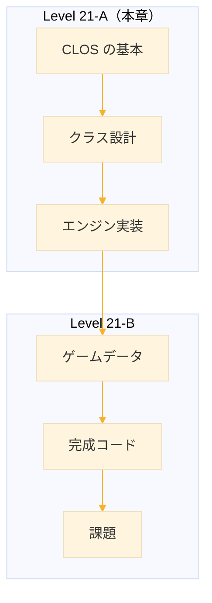
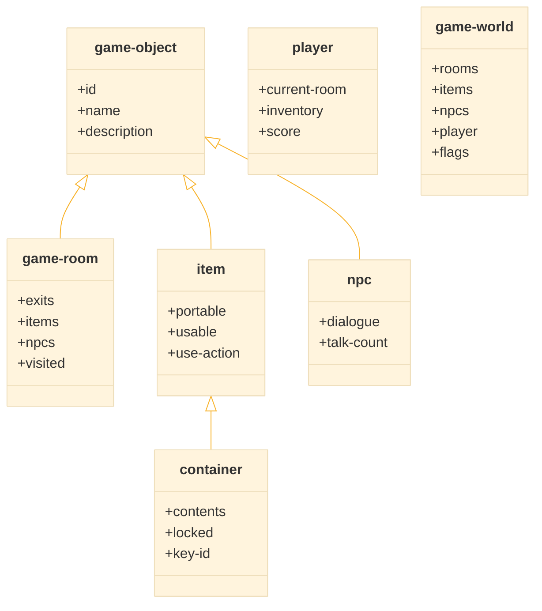
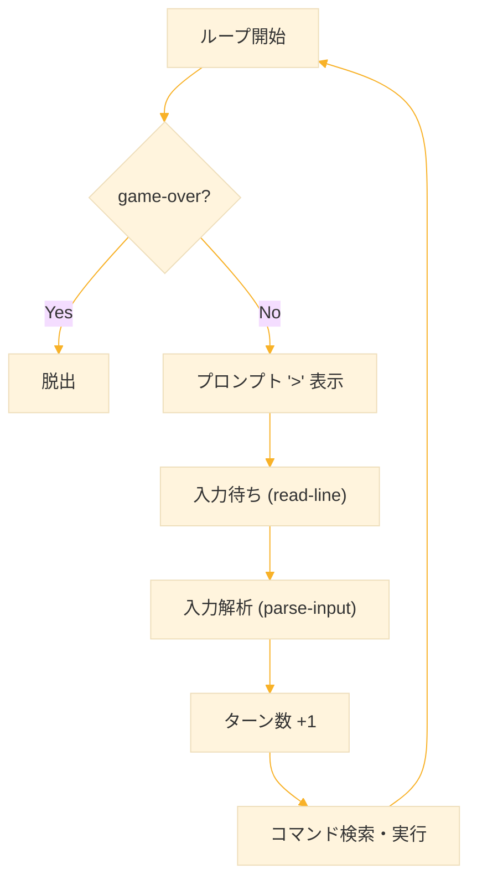
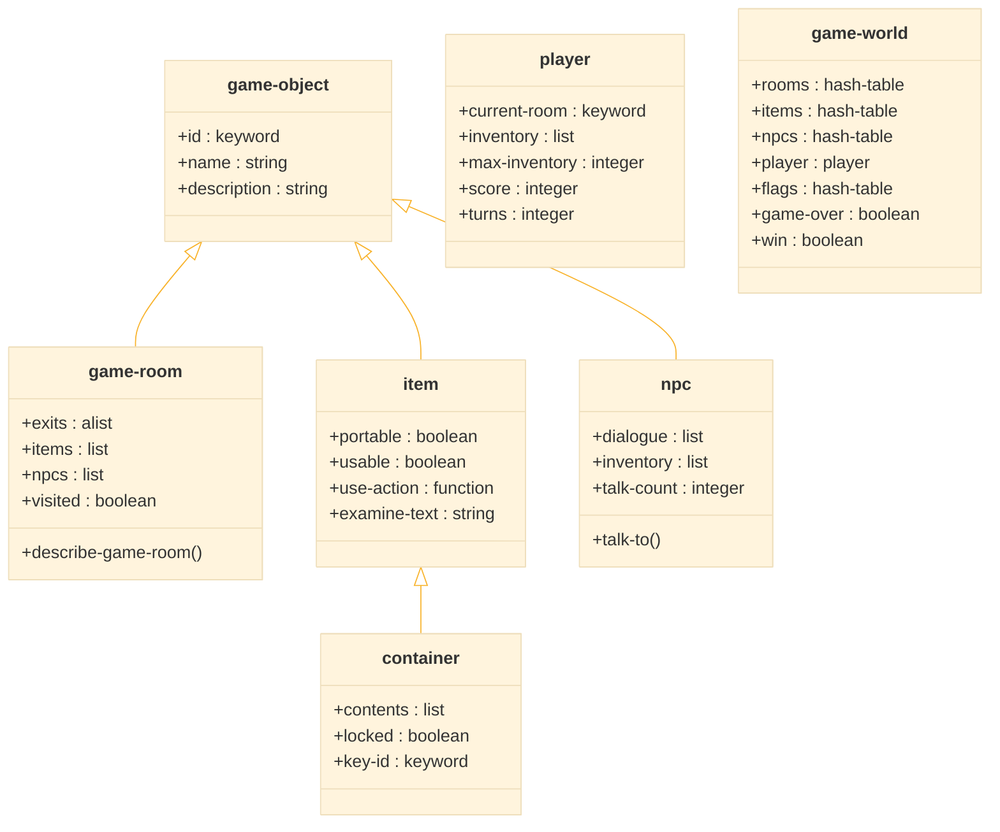
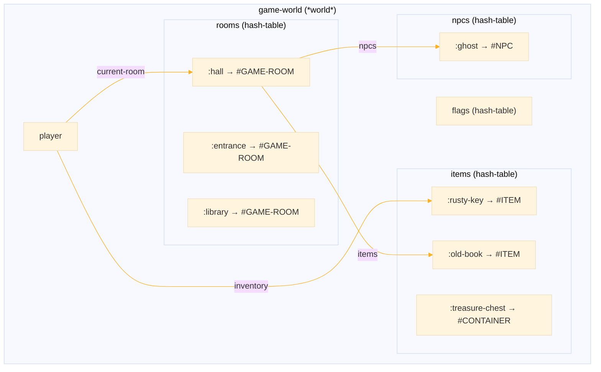
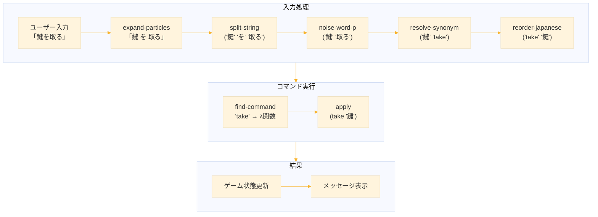
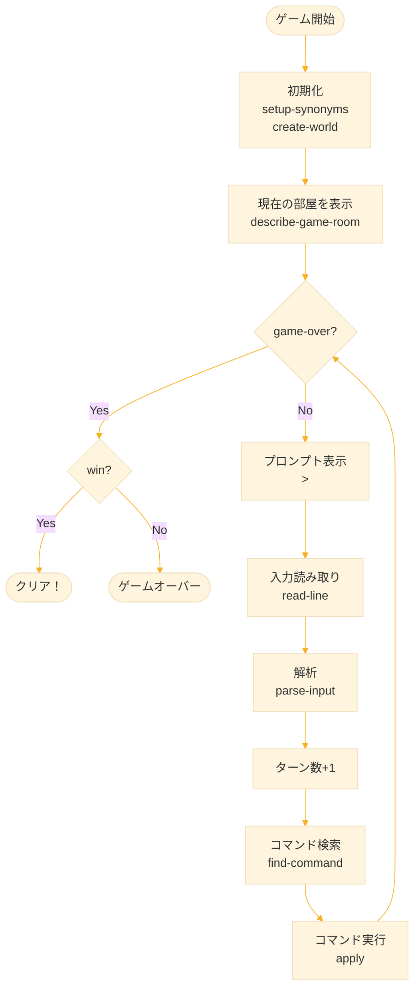
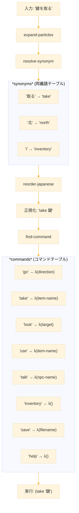
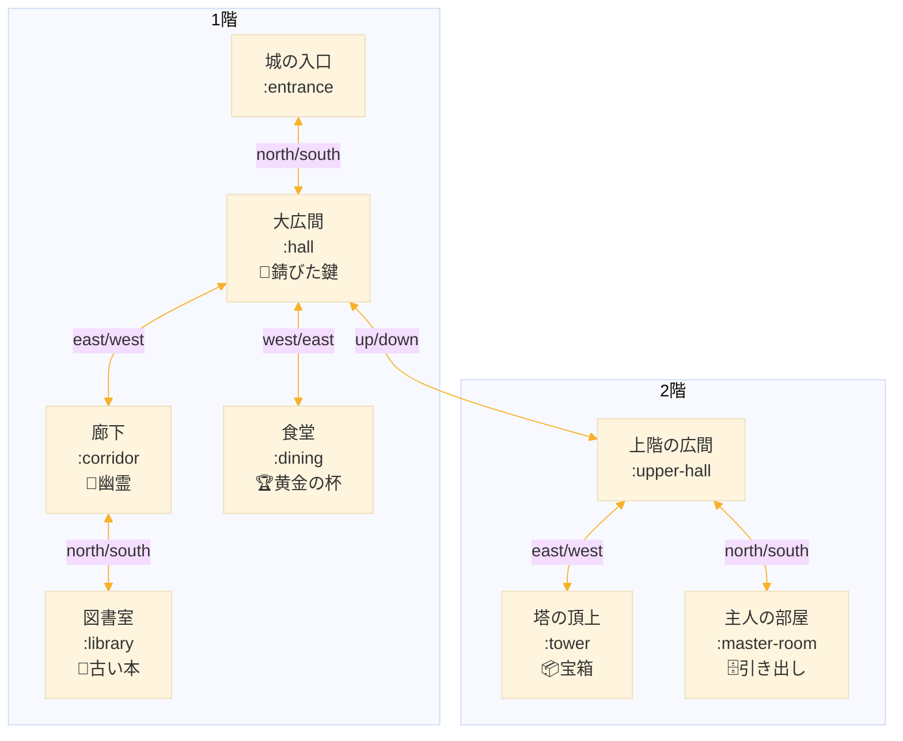
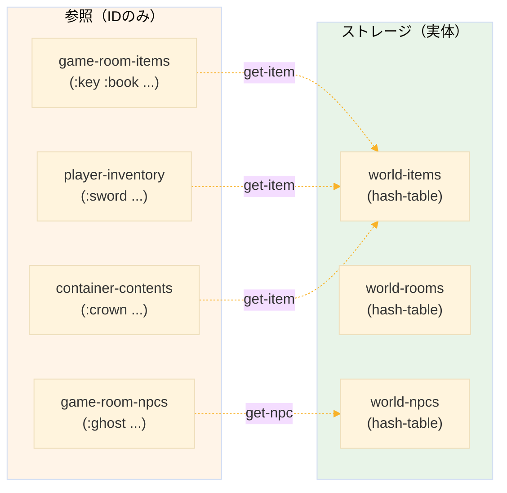

# Level 21-A (CLOS とゲームエンジン設計)
## 1. この章の概要

### 1-1. 学習目標

テキストアドベンチャーゲーム（対話型フィクション）を作成しながら、Common Lisp Object System（CLOS）を学ぶ。この Level 21-A では CLOS の基本とゲームエンジンの設計を扱い、Level 21-B で完成させる。



### 1-2. 扱う内容

| トピック | 説明 |
|----------|------|
| CLOS 基礎 | defclass, defmethod, defgeneric |
| 継承 | スロット継承、メソッドオーバーライド |
| 総称関数 | 多重ディスパッチ |
| ゲーム設計 | クラス構造、状態管理 |
| コマンドシステム | パーサー、コマンド実行 |

### 1-3. 作成するもの

```
========================================
    古城の秘密 - テキストアドベンチャー
========================================

あなたは古い城の入口に立っている。
重厚な木の扉が目の前にある。

出口: 北

> 北へ行く

【大広間】
埃っぽい大広間だ。かつては豪華だったであろう
シャンデリアが天井からぶら下がっている。

アイテム: 古びた鍵
出口: 南, 東, 上

> 鍵を取る

古びた鍵を手に入れた。
```

**ゲーム機能（Level 21-B で完成）：**
- 部屋の移動と探索
- アイテムの取得・使用・配置
- NPCとの会話
- パズル要素
- セーブ/ロード機能


## 2. CLOS の基本

### 2-1. CLOS とは

CLOS（Common Lisp Object System）は Common Lisp 標準のオブジェクト指向システム。他の言語と比べて以下の特徴がある。

| 特徴 | 説明 |
|------|------|
| 総称関数 | メソッドはクラスではなく総称関数に属する |
| 多重継承 | 複数のクラスから継承可能 |
| 多重ディスパッチ | 複数の引数の型でメソッドを選択 |
| 動的 | 実行時にクラスやメソッドを変更可能 |

### 2-2. クラスの定義

`defclass` でクラスを定義する。

```lisp
;;; 基本的なクラス定義
(defclass person ()
  ((name :initarg :name
         :accessor person-name
         :documentation "人物の名前")
   (age :initarg :age
        :accessor person-age
        :initform 0
        :documentation "年齢"))
  (:documentation "人物を表すクラス"))
```

**構文：**
```lisp
(defclass クラス名 (親クラス...)
  ((スロット名 オプション...)
   ...)
  クラスオプション...)
```

**スロットオプション：**

| オプション | 説明 | 例 |
|-----------|------|-----|
| `:initarg` | 初期化時のキーワード | `:initarg :name` |
| `:initform` | デフォルト値 | `:initform 0` |
| `:accessor` | 読み書きアクセサ | `:accessor person-name` |
| `:reader` | 読み取り専用 | `:reader object-id` |
| `:writer` | 書き込み専用 | `:writer set-value` |
| `:documentation` | ドキュメント | `:documentation "説明"` |

### 2-3. インスタンスの作成

`make-instance` でインスタンスを作成する。

```lisp
;;; インスタンス作成
(defvar *alice* (make-instance 'person :name "Alice" :age 25))

;;; アクセサでスロットにアクセス
(person-name *alice*)  ; => "Alice"
(person-age *alice*)   ; => 25

;;; setf で値を変更
(setf (person-age *alice*) 26)
(person-age *alice*)  ; => 26

;;; slot-value で直接アクセス（あまり推奨されない）
(slot-value *alice* 'name)  ; => "Alice"
```

### 2-4. 継承

親クラスを指定して継承する。

```lisp
;;; employee は person を継承
(defclass employee (person)
  ((department :initarg :department
               :accessor employee-department)
   (salary :initarg :salary
           :accessor employee-salary
           :initform 0))
  (:documentation "従業員クラス"))

;;; 子クラスは親クラスのスロットを持つ
(defvar *bob* (make-instance 'employee
                             :name "Bob"
                             :age 30
                             :department "Engineering"
                             :salary 50000))

(person-name *bob*)         ; => "Bob"（親のアクセサ）
(employee-department *bob*) ; => "Engineering"
```

**多重継承：**

```lisp
;;; 複数の親クラスから継承
(defclass manager (employee supervisor)
  ((budget :initarg :budget :accessor manager-budget)))
```

### 2-5. 総称関数とメソッド

CLOS ではメソッドは「総称関数」に属する。

```lisp
;;; 総称関数を宣言（省略可能）
(defgeneric greet (person)
  (:documentation "挨拶をする"))

;;; person クラス用のメソッド
(defmethod greet ((p person))
  (format nil "こんにちは、~A です。" (person-name p)))

;;; employee クラス用のメソッド（オーバーライド）
(defmethod greet ((e employee))
  (format nil "~A 部の ~A です。"
          (employee-department e)
          (person-name e)))

;;; 呼び出し（引数の型でメソッドが選択される）
(greet *alice*)  ; => "こんにちは、Alice です。"
(greet *bob*)    ; => "Engineering 部の Bob です。"
```

### 2-6. メソッド修飾子

`:before`, `:after`, `:around` で補助メソッドを定義できる。

```lisp
;;; プライマリメソッドの前に実行
(defmethod greet :before ((p person))
  (format t "[挨拶開始]~%"))

;;; プライマリメソッドの後に実行
(defmethod greet :after ((p person))
  (format t "[挨拶終了]~%"))

;;; 全体をラップ（call-next-method で次を呼ぶ）
(defmethod greet :around ((e employee))
  (format t "【従業員の挨拶】~%")
  (call-next-method))  ; プライマリメソッドを呼び出す
```

**実行順序：**
```
:around → :before → プライマリ → :after
```

### 2-7. 初期化のカスタマイズ

`initialize-instance` をオーバーライドして初期化処理を追加。

```lisp
;;; インスタンス作成時に自動で呼ばれる
(defmethod initialize-instance :after ((p person) &key)
  (format t "新しい person を作成: ~A~%" (person-name p)))

(make-instance 'person :name "Charlie")
; 出力: 新しい person を作成: Charlie
```

### 2-8. print-object のカスタマイズ

オブジェクトの表示方法をカスタマイズする。

```lisp
(defmethod print-object ((p person) stream)
  (print-unreadable-object (p stream :type t)
    (format stream "~A (age ~A)" (person-name p) (person-age p))))

;; REPL での表示
*alice*  ; => #<PERSON Alice (age 26)>
```


## 3. ゲームの設計

### 3-1. クラス構造

テキストアドベンチャーに必要なクラスを設計する。



**注意：** クラス名を `room` ではなく `game-room` としている。これは Common Lisp の組み込み関数 `cl:room`（メモリ使用量を表示）との名前衝突を避けるため。

### 3-2. 基底クラス

CLOS でゲームオブジェクトの基底クラスを定義し、その表示方法をカスタマイズする。

```lisp
(defclass game-object ()          ; 親クラスなし（空リスト）
  ((id :initarg :id               ; make-instance 時に :id で指定
       :reader object-id          ; 読み取り専用アクセサ
       :documentation "一意の識別子（キーワード）")
   (name :initarg :name           ; make-instance 時に :name で指定
         :accessor object-name    ; 読み書き両用アクセサ
         :documentation "表示名")
   (description :initarg :description
                :accessor object-description
                :initform ""      ; デフォルト値は空文字列
                :documentation "詳細説明"))
  (:documentation "ゲームオブジェクトの基底クラス"))

(defmethod print-object ((obj game-object) stream)
  (print-unreadable-object (obj stream :type t)
    (format stream "~A" (object-name obj))))
```

`print-unreadable-object` は「読み戻せない」オブジェクト（#<...> 形式）を出力するための標準マクロ。`:type t` を指定するとクラス名が自動で付加される。

```lisp:使用例
(defvar *key* (make-instance 'game-object
                             :id :rusty-key
                             :name "錆びた鍵"
                             :description "古くて錆びた鍵"))

(object-id *key*)          ; => :RUSTY-KEY
(object-name *key*)        ; => "錆びた鍵"
(setf (object-name *key*) "古い鍵")  ; OK（accessor）
;; (setf (object-id *key*) :old-key) ; エラー（reader のみ）

*key*  ; => #<GAME-OBJECT 錆びた鍵>
```

### 3-3. 部屋クラス

`game-object` を継承した部屋クラスを定義する。クラス名は `game-room`（`cl:room` との衝突回避）。

```lisp
(defclass game-room (game-object)  ; game-object を継承
  ;; 親クラスから id, name, description を継承
  
  ((exits :initarg :exits         ; 出口リスト ((:north . :hall) (:east . :garden) ...)
          :accessor game-room-exits
          :initform '()           ; デフォルトは空（出口なし）
          :documentation "出口 ((方向 . 部屋ID) ...)")
   
   (items :initarg :items         ; アイテムIDのリスト (:key :sword :potion ...)
          :accessor game-room-items
          :initform '()
          :documentation "部屋にあるアイテムID")
   
   (npcs :initarg :npcs           ; NPCのIDリスト (:ghost :merchant ...)
         :accessor game-room-npcs
         :initform '()
         :documentation "部屋にいるNPCのID")
   
   (visited :initarg :visited     ; 一度でも訪れたか
            :accessor game-room-visited
            :initform nil         ; 最初は未訪問
            :documentation "訪問済みフラグ"))
  
  (:documentation "部屋クラス"))
```

```lisp:使用例
(defvar *hall* 
  (make-instance 'game-room
                 :id :hall
                 :name "大広間"
                 :description "埃っぽい大広間だ。"
                 :exits '((:north . :library) (:south . :entrance))
                 :items '(:rusty-key :torch)))

;; 親クラスのアクセサも使える
(object-name *hall*)      ; => "大広間"
(object-id *hall*)        ; => :HALL

;; 子クラス固有のアクセサ
(game-room-exits *hall*)       ; => ((:NORTH . :LIBRARY) (:SOUTH . :ENTRANCE))
(game-room-items *hall*)       ; => (:RUSTY-KEY :TORCH)
(game-room-visited *hall*)     ; => NIL

;; 訪問済みに変更
(setf (game-room-visited *hall*) t)
```

**部屋の説明を表示するメソッド**

```lisp
(defmethod describe-game-room ((r game-room) &key (verbose t))
  "部屋の説明を表示する。"
  ;; 部屋名を【】で囲んで表示
  (format t "~%【~A】~%" (object-name r))
  
  ;; 詳細説明（verbose=t または 初回訪問時のみ）
  (when (or verbose (not (game-room-visited r)))
    (format t "~A~%" (object-description r)))
  
  ;; アイテム一覧（存在する場合のみ）
  (when (game-room-items r)
    (format t "~%アイテム: ~{~A~^, ~}~%"
            (mapcar #'get-item-name (game-room-items r))))
  
  ;; NPC一覧（存在する場合のみ）
  (when (game-room-npcs r)
    (format t "人物: ~{~A~^, ~}~%"
            (mapcar #'get-npc-name (game-room-npcs r))))
  
  ;; 出口一覧（常に表示）
  (format t "出口: ~{~A~^, ~}~%"
          (mapcar (lambda (x)
                    (string-downcase (symbol-name (car x))))
                  (game-room-exits r))))
```

```:出力例
【大広間】
埃っぽい大広間だ。シャンデリアが天井からぶら下がっている。

アイテム: 錆びた鍵, 松明
人物: 幽霊
出口: north, east, up
```

### 3-4. アイテムクラス

ゲーム内のアイテム（持ち物、道具など）を表す。

```lisp
(defclass item (game-object)      ; game-object を継承
  ;; 親から id, name, description を継承
  
  ((portable :initarg :portable   ; 持ち運べるか（家具などは不可）
             :accessor item-portable
             :initform t          ; デフォルトは持ち運び可能
             :documentation "持ち運び可能か")
   
   (usable :initarg :usable       ; 「使う」コマンドの対象になるか
           :accessor item-usable
           :initform nil          ; デフォルトは使用不可
           :documentation "使用可能か")
   
   (use-action :initarg :use-action  ; 使用時に呼ばれる関数
               :accessor item-use-action
               :initform nil         ; nil なら「使い方がわからない」
               :documentation "使用時のアクション（関数）")
   
   (examine-text :initarg :examine-text  ; 「調べる」で表示される追加情報
                 :accessor item-examine-text
                 :initform nil           ; nil なら description のみ
                 :documentation "調べたときの追加テキスト"))
  
  (:documentation "アイテムクラス"))
```

```lisp:使用例
;; 普通のアイテム（持てるが使えない）
(make-instance 'item
               :id :old-book
               :name "古い本"
               :description "埃をかぶった本。"
               :examine-text "「真の宝は黄金の杯に映る」と書いてある。")

;; 使えるアイテム（鍵）
(make-instance 'item
               :id :rusty-key
               :name "錆びた鍵"
               :description "古くて錆びた鍵。"
               :usable t
               :use-action #'use-rusty-key)  ; 関数を設定

;; 持ち運べないアイテム（家具）
(make-instance 'item
               :id :big-table
               :name "大きなテーブル"
               :description "重厚な木製テーブル。"
               :portable nil)  ; 取れない
```

```lisp:use-action の仕組み
;; 鍵の使用関数（別途定義）
(defun use-rusty-key (item args)
  (if (member :locked-door (game-room-items (current-room)))
      (progn
        (format t "~%鍵で扉を開けた！~%")
        ...)
      (format t "~%ここでは使えない。~%")))

;; use コマンドから呼び出される
(funcall (item-use-action item) item args)
```

アイテムごとに異なる使用処理を関数として持たせることで、柔軟なゲームロジックを実現している。

**コンテナ（箱、宝箱など）**

```lisp
(defclass container (item)        ; item を継承（宝箱、引き出し等）
  ;; 親から portable, usable, use-action, examine-text を継承
  ;; 祖父から id, name, description を継承
  
  ((contents :initarg :contents   ; 中に入っているアイテムIDのリスト
             :accessor container-contents
             :initform '()
             :documentation "中身のアイテムID")
   
   (locked :initarg :locked       ; 鍵がかかっているか
           :accessor container-locked
           :initform nil          ; デフォルトは開いている
           :documentation "ロック状態")
   
   (key-id :initarg :key-id       ; 開錠に必要な鍵のID（nil なら鍵不要）
           :accessor container-key-id
           :initform nil
           :documentation "開けるのに必要な鍵のID"))
  
  (:documentation "コンテナクラス"))
```

```lisp:使用例
(make-instance 'container
               :id :treasure-chest
               :name "宝箱"
               :description "豪華な宝箱。"
               :portable nil        ; 持ち運べない
               :locked t            ; 鍵がかかっている
               :key-id :silver-key  ; 銀の鍵で開く
               :contents '(:crown)) ; 中に王冠
```

### 3-5. NPCクラス

ゲーム内のNPC（Non-Player Character）を表すクラスと、会話メソッド。

```lisp
(defclass npc (game-object)       ; game-object を継承
  ;; 親から id, name, description を継承
  
  ((dialogue :initarg :dialogue   ; セリフのリスト（話すたびに進む）
             :accessor npc-dialogue
             :initform '()
             :documentation "会話リスト")
   
   (inventory :initarg :inventory ; NPCが持っているアイテム（交換・ドロップ用）
              :accessor npc-inventory
              :initform '()
              :documentation "所持アイテム")
   
   (talk-count :initarg :talk-count  ; 何回話しかけたか（会話進行管理）
               :accessor npc-talk-count
               :initform 0
               :documentation "会話回数"))
  
  (:documentation "NPCクラス"))


(defmethod talk-to ((n npc))
  "NPCと会話する。"
  (let ((dialogue (npc-dialogue n)))
    (if dialogue
        ;; セリフがある場合
        (let* ((count (npc-talk-count n))
               ;; nth で count 番目を取得、なければ最後のセリフを繰り返す
               (text (or (nth count dialogue)
                         (car (last dialogue)))))
          (incf (npc-talk-count n))  ; 会話回数を増やす
          (format t "~%~A: 「~A」~%" (object-name n) text))
        ;; セリフがない場合
        (format t "~%~A は何も言わない。~%" (object-name n)))))
```

**会話の仕組み**

dialogue が ("最初" "2回目" "3回目以降") の場合

- 1回目: count=0 → (nth 0 ...) → "最初"
- 2回目: count=1 → (nth 1 ...) → "2回目"  
- 3回目: count=2 → (nth 2 ...) → "3回目以降"
- 4回目: count=3 → (nth 3 ...) → nil → (car (last ...)) → "3回目以降"
- 以降ずっと最後のセリフを繰り返す

```lisp:使用例
(defvar *ghost*
  (make-instance 'npc
                 :id :ghost
                 :name "幽霊"
                 :description "青白く光る幽霊。"
                 :dialogue '("私は...この城で..."
                             "図書室の本を読むのだ..."
                             "さあ、行くのだ...")))

(talk-to *ghost*)  ; => 幽霊: 「私は...この城で...」
(talk-to *ghost*)  ; => 幽霊: 「図書室の本を読むのだ...」
(talk-to *ghost*)  ; => 幽霊: 「さあ、行くのだ...」
(talk-to *ghost*)  ; => 幽霊: 「さあ、行くのだ...」（以降繰り返し）
```

### 3-6. プレイヤークラス

```lisp
(defclass player ()               ; 親クラスなし（game-object を継承しない）
  ((current-room :initarg :current-room  ; 現在いる部屋のID
                 :accessor player-current-room
                 :documentation "現在の部屋ID")
   
   (inventory :initarg :inventory        ; 所持アイテムIDのリスト
              :accessor player-inventory
              :initform '()              ; 最初は何も持っていない
              :documentation "所持アイテムID")
   
   (max-inventory :initarg :max-inventory  ; 持てる数の上限
                  :accessor player-max-inventory
                  :initform 10
                  :documentation "最大所持数")
   
   (score :initarg :score         ; ゲームスコア（宝発見等で加算）
          :accessor player-score
          :initform 0
          :documentation "スコア")
   
   (turns :initarg :turns         ; 経過ターン数（コマンド実行回数）
          :accessor player-turns
          :initform 0
          :documentation "ターン数"))
  
  (:documentation "プレイヤークラス"))
```

プレイヤーは部屋に配置されたり、名前で検索される対象ではないため、id, name, description を持つ必要がないため、`game-object`を継承しない。

```lisp:使用例
(defvar *player*
  (make-instance 'player
                 :current-room :entrance))  ; 入口からスタート

(player-current-room *player*)  ; => :ENTRANCE
(player-inventory *player*)     ; => NIL
(player-turns *player*)         ; => 0

;; アイテム取得時
(push :rusty-key (player-inventory *player*))

;; インベントリ上限チェック
(>= (length (player-inventory *player*))
    (player-max-inventory *player*))  ; => NIL（まだ持てる）
```

### 3-7. ゲームワールドクラス

すべてを管理する中心クラス。

```lisp
(defclass game-world ()           ; ゲーム全体を管理する中心クラス
  ((rooms :initarg :rooms         ; 部屋ID → game-room オブジェクト
          :accessor world-rooms
          :initform (make-hash-table)
          :documentation "部屋のハッシュテーブル")
   
   (items :initarg :items         ; アイテムID → item オブジェクト
          :accessor world-items
          :initform (make-hash-table)
          :documentation "アイテムのハッシュテーブル")
   
   (npcs :initarg :npcs           ; NPC ID → npc オブジェクト
         :accessor world-npcs
         :initform (make-hash-table)
         :documentation "NPCのハッシュテーブル")
   
   (player :initarg :player       ; プレイヤーオブジェクト（1つだけ）
           :accessor world-player
           :documentation "プレイヤー")
   
   (flags :initarg :flags         ; イベント管理用フラグ（扉開けた等）
          :accessor world-flags
          :initform (make-hash-table)
          :documentation "ゲームフラグ")
   
   (game-over :initarg :game-over ; ゲームループ終了判定
              :accessor world-game-over
              :initform nil
              :documentation "ゲーム終了フラグ")
   
   (win :initarg :win             ; クリアか敗北かの判定
        :accessor world-win
        :initform nil
        :documentation "勝利フラグ"))
  
  (:documentation "ゲームワールドクラス"))
```

## 4. ゲームエンジンの実装

### 4-1. グローバル変数

```lisp
(defvar *world* nil "現在のゲームワールド")
(defvar *commands* (make-hash-table :test 'equal) "コマンドテーブル")
(defvar *synonyms* (make-hash-table :test 'equal) "同義語テーブル")
```

| 変数 | 用途 |
|------|------|
| `*world*` | ゲーム状態全体を保持 |
| `*commands*` | コマンド名 → 関数のマッピング |
| `*synonyms*` | 同義語 → 正規形のマッピング |

`:test 'equal` は文字列をキーにするため（デフォルトの `eql` では文字列比較できない）。

### 4-2. ユーティリティ関数

```lisp
;;; ========== オブジェクト取得 ==========

;; IDからオブジェクトを取得（ハッシュテーブル検索）
(defun get-room (id)
  (gethash id (world-rooms *world*)))

(defun get-item (id)
  (gethash id (world-items *world*)))

(defun get-npc (id)
  (gethash id (world-npcs *world*)))

;;; ========== 名前取得 ==========

;; IDから表示名を取得（表示用）
(defun get-item-name (id)
  (let ((item (get-item id)))
    (if item (object-name item) "???")))  ; 見つからなければ "???"

(defun get-npc-name (id)
  (let ((npc (get-npc id)))
    (if npc (object-name npc) "???")))

;;; ========== 現在地 ==========

;; プレイヤーがいる部屋オブジェクトを取得
(defun current-room ()
  (get-room (player-current-room (world-player *world*))))

;;; ========== フラグ操作 ==========

;; イベントフラグの取得・設定
(defun get-flag (name)
  (gethash name (world-flags *world*)))

(defun set-flag (name value)
  (setf (gethash name (world-flags *world*)) value))

;;; ========== 所持判定 ==========

;; プレイヤーがアイテムを持っているか
(defun has-item-p (item-id)
  (member item-id (player-inventory (world-player *world*))))

;; 部屋にアイテムがあるか（省略時は現在の部屋）
(defun game-room-has-item-p (item-id &optional (room (current-room)))
  (member item-id (game-room-items room)))
```

**ポイント：** `*world*` を介して間接的にアクセスすることで、コード全体の見通しが良くなる。


### 4-3. 入力パーサー

ユーザー入力を解析して単語リストに変換する。日本語の「鍵を取る」のような入力も「取る 鍵」と解釈できるようにする。

```lisp
;;; 文字列を空白（半角・全角）で分割
(defun split-string (str)
  (let ((result '())       ; 結果リスト
        (current ""))      ; 現在構築中の単語
    (loop for c across str
          do (if (member c '(#\Space #\Tab #\　))  ; 全角空白も対応
                 ;; 空白文字なら単語を区切る
                 (progn
                   (when (> (length current) 0)
                     (push current result))
                   (setf current ""))
                 ;; それ以外なら単語に追加
                 (setf current (concatenate 'string current (string c)))))
    ;; 最後の単語を追加
    (when (> (length current) 0)
      (push current result))
    (nreverse result)))  ; push で逆順になるので反転

;;; 文字列置換（すべての出現を置換）
(defun replace-all (str old new)
  "文字列内のすべてのoldをnewに置換"
  (let ((result "") (pos 0) (old-len (length old)))
    (loop
      (let ((found (search old str :start2 pos)))
        (if found
            (progn
              (setf result (concatenate 'string result (subseq str pos found) new))
              (setf pos (+ found old-len)))
            (progn
              (setf result (concatenate 'string result (subseq str pos)))
              (return result)))))))

;;; 助詞の前後に空白を挿入（「鍵を取る」→「鍵 を 取る」）
(defun expand-particles (str)
  "助詞の前後に空白を挿入して分割可能にする"
  (let ((result str))
    (dolist (p '("を" "に" "へ" "で" "と" "から" "まで"))
      (setf result (replace-all result p (format nil " ~A " p))))
    result))

;;; 不要な単語（助詞・冠詞）を判定
(defun noise-word-p (word)
  (member (string-downcase word)
          '("を" "に" "へ" "の" "と" "で" "から" "まで"  ; 日本語助詞
            "a" "an" "the" "to" "at" "in" "on")          ; 英語冠詞等
          :test #'string=))

;;; 日本語の語順を変換（「鍵 取る」→「取る 鍵」）
(defun reorder-japanese (words)
  "動詞が最後にある場合、先頭に移動する"
  (if (and words (> (length words) 1))
      (let ((last-word (car (last words))))
        (if (find-command last-word)
            (cons last-word (butlast words))
            words))
      words))

;;; 入力を解析して単語リストに変換
(defun parse-input (input)
  "入力文字列を (動詞 目的語 ...) のリストに変換。"
  (let* ((input (expand-particles input))         ; 1. 助詞展開
         (words (split-string input))             ; 2. 分割
         (words (remove-if #'noise-word-p words)) ; 3. 不要語除去
         (words (mapcar #'resolve-synonym words)) ; 4. 同義語解決
         (words (reorder-japanese words)))        ; 5. 語順変換
    words))
```

**パーサーの処理フロー：**
```
「鍵を取る」
    ↓ expand-particles
「鍵 を 取る」
    ↓ split-string
("鍵" "を" "取る")
    ↓ remove-if noise-word-p
("鍵" "取る")
    ↓ mapcar resolve-synonym
("鍵" "take")
    ↓ reorder-japanese
("take" "鍵")
```

これにより、以下の入力がすべて同じ動作になる：
- `取る 鍵`
- `取る　鍵`（全角空白）
- `鍵を取る`
- `鍵 を 取る`

### 4-4. 同義語システム

```lisp
;;; 同義語を登録（synonym → word へのマッピング）
(defun add-synonym (word synonym)
  (setf (gethash (string-downcase synonym) *synonyms*)
        (string-downcase word)))

;;; 同義語を正規形に変換（登録されていなければそのまま）
(defun resolve-synonym (word)
  (or (gethash (string-downcase word) *synonyms*)
      (string-downcase word)))

;;; ゲーム開始時に同義語を設定
(defun setup-synonyms ()
  ;; 移動系
  (add-synonym "go" "行く")
  (add-synonym "go" "いく")
  (add-synonym "go" "進む")
  (add-synonym "go" "move")
  
  ;; 方向（日本語→英語キーワードに統一）
  (add-synonym "north" "北")
  (add-synonym "south" "南")
  (add-synonym "east" "東")
  (add-synonym "west" "西")
  (add-synonym "up" "上")
  (add-synonym "down" "下")
  
  ;; アイテム操作
  (add-synonym "take" "取る")
  (add-synonym "take" "とる")
  (add-synonym "take" "拾う")
  (add-synonym "take" "get")
  (add-synonym "drop" "置く")
  (add-synonym "drop" "おく")
  (add-synonym "drop" "捨てる")
  
  ;; 調べる（x は examine の略、伝統的な略語）
  (add-synonym "look" "見る")
  (add-synonym "look" "みる")
  (add-synonym "look" "調べる")
  (add-synonym "look" "examine")
  (add-synonym "look" "x")
  
  ;; 使う・話す
  (add-synonym "use" "使う")
  (add-synonym "use" "つかう")
  (add-synonym "talk" "話す")
  (add-synonym "talk" "はなす")
  
  ;; システム（i は inventory の略）
  (add-synonym "inventory" "持ち物")
  (add-synonym "inventory" "もちもの")
  (add-synonym "inventory" "i")
  (add-synonym "help" "ヘルプ")
  (add-synonym "quit" "終了")
  (add-synonym "save" "セーブ")
  (add-synonym "load" "ロード"))
```

**動作例：**
```lisp
(resolve-synonym "取る")  ; => "take"
(resolve-synonym "北")    ; => "north"
(resolve-synonym "xyz")   ; => "xyz"（未登録はそのまま）
```

### 4-5. コマンドシステム

```lisp
;;; コマンドを定義するマクロ
(defmacro defcommand (name args &body body)
  "コマンドを定義してテーブルに登録する。"
  `(setf (gethash ,(string-downcase (string name)) *commands*)
         (lambda ,args ,@body)))

;;; コマンドを検索（同義語も解決）
(defun find-command (name)
  (gethash (resolve-synonym name) *commands*))
```

**マクロ展開例：**
```lisp
(defcommand look (&optional target)
  (format t "見る: ~A" target))

;; 展開後:
(setf (gethash "look" *commands*)
      (lambda (&optional target)
        (format t "見る: ~A" target)))
```

### 4-6. 検索関数

```lisp
;;; アイテムを名前で検索（部分一致）
(defun find-item-by-name (name)
  (let ((name-down (string-downcase name)))
    (or
     ;; まずインベントリから検索
     (find-if (lambda (id)
                (let ((item (get-item id)))
                  (search name-down
                          (string-downcase (object-name item)))))
              (player-inventory (world-player *world*)))
     ;; 次に現在の部屋から検索
     (find-if (lambda (id)
                (let ((item (get-item id)))
                  (search name-down
                          (string-downcase (object-name item)))))
              (game-room-items (current-room))))))

;;; NPCを名前で検索（現在の部屋のみ）
(defun find-npc-by-name (name)
  (let ((name-down (string-downcase name)))
    (find-if (lambda (id)
               (let ((npc (get-npc id)))
                 (search name-down
                         (string-downcase (object-name npc)))))
             (game-room-npcs (current-room)))))
```

**ポイント：**
- `search` は部分文字列検索（"鍵" で "錆びた鍵" にマッチ）
- インベントリを先に検索（持っているものを優先）

### 4-7. 基本コマンドの実装

#### 移動コマンド

```lisp
(defcommand go (direction &rest args)
  (declare (ignore args))
  (let* ((room (current-room))
         ;; 方向文字列をキーワードに変換 ("north" → :NORTH)
         (dir-key (intern (string-upcase direction) :keyword))
         ;; 出口リストから該当する出口を検索
         (exit (assoc dir-key (game-room-exits room))))
    (if exit
        (progn
          ;; 移動先の部屋IDを設定
          (setf (player-current-room (world-player *world*))
                (cdr exit))
          ;; 訪問済みフラグを立てる
          (setf (game-room-visited (current-room)) t)
          ;; 新しい部屋を表示
          (describe-game-room (current-room)))
        (format t "~%その方向には行けない。~%"))))

;;; 方向ショートカット（"北" だけで移動可能に）
(defcommand north (&rest args)
  (declare (ignore args))
  (funcall (find-command "go") "north"))

(defcommand south (&rest args)
  (declare (ignore args))
  (funcall (find-command "go") "south"))

(defcommand east (&rest args)
  (declare (ignore args))
  (funcall (find-command "go") "east"))

(defcommand west (&rest args)
  (declare (ignore args))
  (funcall (find-command "go") "west"))

(defcommand up (&rest args)
  (declare (ignore args))
  (funcall (find-command "go") "up"))

(defcommand down (&rest args)
  (declare (ignore args))
  (funcall (find-command "go") "down"))
```

#### 見るコマンド

```lisp
(defcommand look (&optional target &rest args)
  (declare (ignore args))
  (if target
      ;; 特定のものを調べる
      (let ((item-id (find-item-by-name target)))
        (if item-id
            (let ((item (get-item item-id)))
              ;; 基本説明
              (format t "~%~A~%" (object-description item))
              ;; 追加テキストがあれば表示（ヒント等）
              (when (item-examine-text item)
                (format t "~A~%" (item-examine-text item))))
            (format t "~%~A は見当たらない。~%" target)))
      ;; 引数なしなら部屋全体を見る
      (describe-game-room (current-room) :verbose t)))
```

#### アイテム操作コマンド

```lisp
;;; 取るコマンド
(defcommand take (item-name &rest args)
  (declare (ignore args))
  ;; 引数チェック
  (unless item-name
    (format t "~%何を取る？~%")
    (return-from take))
  (let ((item-id (find-item-by-name item-name)))
    (cond
      ;; アイテムが見つからない
      ((null item-id)
       (format t "~%~A は見当たらない。~%" item-name))
      ;; すでに持っている
      ((has-item-p item-id)
       (format t "~%すでに持っている。~%"))
      ;; 部屋にない（他の場所にある）
      ((not (game-room-has-item-p item-id))
       (format t "~%ここにはない。~%"))
      ;; 持ち運べない（家具等）
      ((not (item-portable (get-item item-id)))
       (format t "~%それは持ち運べない。~%"))
      ;; インベントリ上限
      ((>= (length (player-inventory (world-player *world*)))
           (player-max-inventory (world-player *world*)))
       (format t "~%これ以上持てない。~%"))
      ;; 取得成功
      (t
       (let ((item (get-item item-id)))
         ;; 部屋から削除
         (setf (game-room-items (current-room))
               (remove item-id (game-room-items (current-room))))
         ;; インベントリに追加
         (push item-id (player-inventory (world-player *world*)))
         (format t "~%~A を手に入れた。~%" (object-name item)))))))

;;; 置くコマンド
(defcommand drop (item-name &rest args)
  (declare (ignore args))
  (unless item-name
    (format t "~%何を置く？~%")
    (return-from drop))
  (let ((item-id (find-item-by-name item-name)))
    (cond
      ((null item-id)
       (format t "~%~A は見当たらない。~%" item-name))
      ;; 持っていないものは置けない
      ((not (has-item-p item-id))
       (format t "~%それは持っていない。~%"))
      (t
       (let ((item (get-item item-id)))
         ;; インベントリから削除
         (setf (player-inventory (world-player *world*))
               (remove item-id (player-inventory (world-player *world*))))
         ;; 部屋に追加
         (push item-id (game-room-items (current-room)))
         (format t "~%~A を置いた。~%" (object-name item)))))))

;;; 持ち物コマンド
(defcommand inventory (&rest args)
  (declare (ignore args))
  (let ((inv (player-inventory (world-player *world*))))
    (if inv
        (progn
          (format t "~%所持品:~%")
          ;; 各アイテムを表示
          (dolist (id inv)
            (format t "- ~A~%" (get-item-name id))))
        (format t "~%何も持っていない。~%"))))
```

#### 使う・話すコマンド

```lisp
;;; 使うコマンド
(defcommand use (item-name &rest args)
  (unless item-name
    (format t "~%何を使う？~%")
    (return-from use))
  (let ((item-id (find-item-by-name item-name)))
    (cond
      ((null item-id)
       (format t "~%~A は見当たらない。~%" item-name))
      ((not (has-item-p item-id))
       (format t "~%それは持っていない。~%"))
      (t
       (let ((item (get-item item-id)))
         ;; use-action が設定されていれば実行
         (if (item-use-action item)
             (funcall (item-use-action item) item args)
             (format t "~%~A の使い方がわからない。~%"
                     (object-name item))))))))

;;; 話すコマンド
(defcommand talk (npc-name &rest args)
  (declare (ignore args))
  (unless npc-name
    (format t "~%誰と話す？~%")
    (return-from talk))
  (let ((npc-id (find-npc-by-name npc-name)))
    (if npc-id
        ;; talk-to メソッドを呼び出し
        (talk-to (get-npc npc-id))
        (format t "~%~A はここにいない。~%" npc-name))))
```

#### システムコマンド

```lisp
;;; ヘルプコマンド
(defcommand help (&rest args)
  (declare (ignore args))
  (format t "~%========== コマンド一覧 ==========~%")
  (format t "移動: 北/南/東/西/上/下~%")
  (format t "見る: 見る, 見る <対象>~%")
  (format t "取る: 取る <アイテム>~%")
  (format t "置く: 置く <アイテム>~%")
  (format t "使う: 使う <アイテム>~%")
  (format t "話す: 話す <人物>~%")
  (format t "持ち物: 持ち物, i~%")
  (format t "セーブ/ロード: セーブ, ロード~%")
  (format t "終了: 終了~%")
  (format t "==================================~%"))

;;; 終了コマンド
(defcommand quit (&rest args)
  (declare (ignore args))
  (format t "~%ゲームを終了しますか？ (y/n): ")
  (force-output)  ; 出力をフラッシュ（プロンプト表示のため）
  (let ((answer (read-line)))
    ;; y, yes, はい のいずれかで終了
    (when (member (string-downcase answer)
                  '("y" "yes" "はい") :test #'string=)
      (setf (world-game-over *world*) t)
      (format t "~%ゲームを終了します。~%"))))
```


### 4-8. セーブ/ロード機能

```lisp
;;; ハッシュテーブルを連想リストに変換（保存用）
(defun hash-table-to-alist (ht)
  (let ((result '()))
    (maphash (lambda (k v) (push (cons k v) result)) ht)
    result))

;;; ワールドをS式に変換（シリアライズ）
(defun serialize-world (world)
  (list
   ;; プレイヤー状態
   :player-room (player-current-room (world-player world))
   :player-inventory (player-inventory (world-player world))
   :player-score (player-score (world-player world))
   :player-turns (player-turns (world-player world))
   ;; 各部屋のアイテム配置
   :game-room-items (let ((r '()))
                      (maphash (lambda (id room)
                                 (push (cons id (game-room-items room)) r))
                               (world-rooms world))
                      r)
   ;; 訪問済みの部屋
   :game-room-visited (let ((r '()))
                        (maphash (lambda (id room)
                                   (when (game-room-visited room) (push id r)))
                                 (world-rooms world))
                        r)
   ;; ゲームフラグ
   :flags (hash-table-to-alist (world-flags world))
   ;; NPC会話進行状況
   :npc-talk-counts (let ((r '()))
                      (maphash (lambda (id npc)
                                 (push (cons id (npc-talk-count npc)) r))
                               (world-npcs world))
                      r)))

;;; セーブコマンド
(defcommand save (filename &rest args)
  (declare (ignore args))
  (unless filename (setf filename "save.dat"))
  ;; S式をファイルに書き出し
  (with-open-file (out filename :direction :output
                                :if-exists :supersede)
    (print (serialize-world *world*) out))
  (format t "~%ゲームを ~A に保存しました。~%" filename))

;;; S式からワールドを復元（デシリアライズ）
(defun deserialize-world (world data)
  (let ((player (world-player world)))
    ;; プレイヤー状態を復元
    (setf (player-current-room player) (getf data :player-room))
    (setf (player-inventory player) (getf data :player-inventory))
    (setf (player-score player) (getf data :player-score))
    (setf (player-turns player) (getf data :player-turns))
    ;; 部屋のアイテムを復元
    (dolist (pair (getf data :game-room-items))
      (let ((room (get-room (car pair))))
        (when room (setf (game-room-items room) (cdr pair)))))
    ;; 訪問済みフラグをリセットしてから復元
    (maphash (lambda (id room)
               (declare (ignore id))
               (setf (game-room-visited room) nil))
             (world-rooms world))
    (dolist (id (getf data :game-room-visited))
      (let ((room (get-room id)))
        (when room (setf (game-room-visited room) t))))
    ;; フラグを復元
    (clrhash (world-flags world))
    (dolist (pair (getf data :flags))
      (setf (gethash (car pair) (world-flags world)) (cdr pair)))
    ;; NPC会話カウントを復元
    (dolist (pair (getf data :npc-talk-counts))
      (let ((npc (get-npc (car pair))))
        (when npc (setf (npc-talk-count npc) (cdr pair)))))))

;;; ロードコマンド
(defcommand load (filename &rest args)
  (declare (ignore args))
  (unless filename (setf filename "save.dat"))
  ;; ファイル存在チェック
  (if (probe-file filename)
      (progn
        ;; S式を読み込んで復元
        (with-open-file (in filename :direction :input)
          (deserialize-world *world* (read in)))
        (format t "~%ゲームを ~A から読み込みました。~%" filename)
        (describe-game-room (current-room)))
      (format t "~%セーブファイルが見つかりません。~%")))
```

**セーブデータ例：**
```lisp
(:PLAYER-ROOM :HALL 
 :PLAYER-INVENTORY (:RUSTY-KEY) 
 :PLAYER-SCORE 0 
 :PLAYER-TURNS 5
 :GAME-ROOM-ITEMS ((:HALL) (:ENTRANCE) (:LIBRARY :OLD-BOOK))
 :GAME-ROOM-VISITED (:HALL :ENTRANCE)
 :FLAGS ((:DOOR-OPENED . T))
 :NPC-TALK-COUNTS ((:GHOST . 2)))
```


### 4-9. ゲームループ

```lisp
(defun game-loop ()
  "ゲームのメインループ。"
  (loop
    ;; 終了判定
    (when (world-game-over *world*)
      (return))
    
    ;; プロンプト表示
    (format t "~%> ")
    (force-output)
    
    ;; 入力読み取り（EOF で nil）
    (let ((input (read-line *standard-input* nil)))
      (when (null input) (return))
      
      ;; 入力を解析
      (let ((words (parse-input input)))
        (when words
          ;; ターン数を増やす
          (incf (player-turns (world-player *world*)))
          
          ;; コマンドを実行
          (let* ((verb (first words))   ; 動詞（最初の単語）
                 (args (rest words))    ; 引数（残りの単語）
                 (cmd (find-command verb)))
            (if cmd
                ;; コマンドが見つかれば実行
                (apply cmd args)
                ;; 見つからなければエラー
                (format t "~%「~A」は理解できない。「ヘルプ」でコマンド一覧を確認。~%"
                        verb))))))))
```

**ゲームループの流れ**



## 5 これまでのまとめ

### 5-1. クラス継承関係



### 5-2. ゲームワールドの構成



### 5-3. 入力からコマンド実行までの流れ



### 5-4. ゲームループ



### 5-5. コマンドシステム



### 5-6. 部屋の接続（ゲームマップ例）



### 5-7. データの参照関係



## 6. まとめと次章への準備

### この章で学んだこと

| トピック | 内容 |
|----------|------|
| defclass | クラス定義、スロット、オプション |
| make-instance | インスタンス作成 |
| defmethod | メソッド定義、オーバーライド |
| 継承 | 親クラスからのスロット継承 |
| 総称関数 | 多重ディスパッチ |
| ゲーム設計 | オブジェクト構造、状態管理 |
| コマンドシステム | パーサー、同義語、実行 |
| 日本語対応 | 助詞分割、語順変換 |


