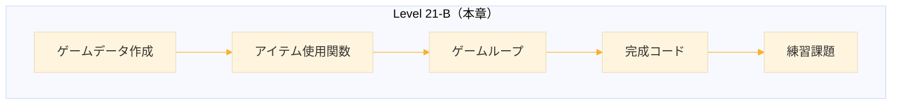
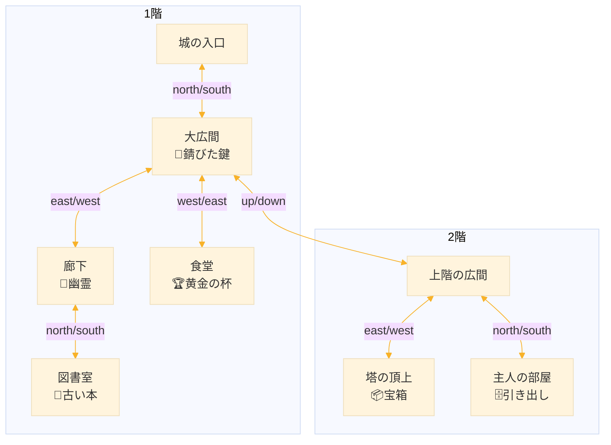
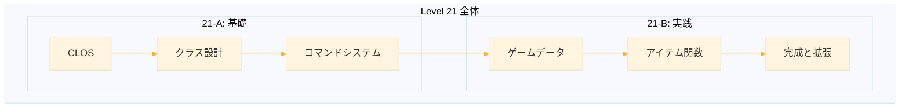

# Level 21-B (テキストアドベンチャーの完成)
## 1. この章の概要

### 1-1. 前章の復習

Level 21-A では以下を学んだ。

- CLOS の基本（defclass, defmethod, 継承）
- ゲームオブジェクトのクラス設計
- コマンドシステムとパーサー
- 基本コマンドの実装

### 1-2. この章の内容



| セクション | 内容 |
|-----------|------|
| 2. ゲームデータ | 「古城の秘密」シナリオの実装 |
| 3. アイテム使用 | 鍵、宝箱などのアクション |
| 4. ゲームループ | メインループと起動処理 |
| 5. 完成コード | 約500行の実行可能コード |
| 6. 練習課題 | 4つの拡張課題と解答 |


## 2. ゲームデータの作成

### 2-1. 「古城の秘密」シナリオ

**ストーリー：**
謎めいた古城を探索し、隠された秘宝を見つけ出す。

**マップ：**



**クリア手順：**
1. 大広間で「錆びた鍵」を取る
2. 主人の部屋で鍵を使い、引き出しから「銀の鍵」を入手
3. 塔で銀の鍵を使い、宝箱から「王冠」を入手
4. 食堂で「黄金の杯」を取る
5. 王冠を持った状態で杯を使う → クリア

### 2-2. ワールド作成関数

ゲームワールド全体を組み立てるファクトリ関数。各要素（部屋、アイテム、NPC）の作成を別関数に委譲することで、コードの見通しを良くしている。

```lisp
(defun create-castle-world ()
  "「古城の秘密」のゲームワールドを作成する。"
  ;; 空のワールドを作成
  (let ((world (make-instance 'game-world)))
    ;; プレイヤーを城の入口（:entrance）に配置
    (setf (world-player world)
          (make-instance 'player :current-room :entrance))
    ;; 各要素を作成（別関数に委譲）
    (create-castle-rooms world)   ; 部屋を作成
    (create-castle-items world)   ; アイテムを作成
    (create-castle-npcs world)    ; NPCを作成
    ;; 完成したワールドを返す
    world))
```

**設計のポイント：**
- `world` を引数として渡し、各関数内でハッシュテーブルに登録
- 最後に `world` を返すことで `(setf *world* (create-castle-world))` と使える

### 2-3. 部屋の作成

部屋はゲームの「場所」を表す。各部屋には ID、名前、説明、出口（他の部屋への接続）、配置されたアイテムやNPCを設定する。

```lisp
(defun create-castle-rooms (world)
  "城の部屋を作成する。"
  ;; world から部屋用ハッシュテーブルを取得
  (let ((rooms (world-rooms world)))
    
    ;; ===== 1階 =====
    
    ;; 城の入口（スタート地点）
    ;; :entrance はこの部屋の ID（キーワードシンボル）
    (setf (gethash :entrance rooms)
          (make-instance 'game-room
                         :id :entrance
                         :name "城の入口"
                         :description "古びた城の入口に立っている。
重厚な木の扉が北に見える。石畳は苔むしており、
長い間誰も訪れていないことがわかる。"
                         ;; 出口：北に行くと :hall に移動
                         :exits '((:north . :hall))))
    
    ;; 大広間（中央ハブ）
    ;; 複数の出口を持ち、ゲームの中心となる部屋
    (setf (gethash :hall rooms)
          (make-instance 'game-room
                         :id :hall
                         :name "大広間"
                         :description "埃っぽい大広間だ。かつては豪華だったであろう
シャンデリアが天井からぶら下がっている。
東に廊下、西に食堂への扉、上に階段がある。"
                         ;; 4方向 + 上への出口
                         :exits '((:south . :entrance)
                                  (:east . :corridor)
                                  (:west . :dining)
                                  (:up . :upper-hall))
                         ;; この部屋に錆びた鍵がある
                         :items '(:rusty-key)))
    
    ;; 廊下（幽霊がいる）
    (setf (gethash :corridor rooms)
          (make-instance 'game-room
                         :id :corridor
                         :name "廊下"
                         :description "薄暗い廊下だ。壁には古い肖像画が並んでいる。
北に図書室への扉がある。"
                         :exits '((:west . :hall)
                                  (:north . :library))
                         ;; この部屋に幽霊（NPC）がいる
                         :npcs '(:ghost)))
    
    ;; 図書室（ヒントの本）
    (setf (gethash :library rooms)
          (make-instance 'game-room
                         :id :library
                         :name "図書室"
                         :description "本棚が壁一面に並んでいる。
ほとんどの本は朽ちているが、一冊だけ綺麗な本がある。"
                         :exits '((:south . :corridor))
                         :items '(:old-book)))
    
    ;; 食堂（黄金の杯）
    (setf (gethash :dining rooms)
          (make-instance 'game-room
                         :id :dining
                         :name "食堂"
                         :description "長いテーブルがある食堂だ。
テーブルの上には埃が積もっている。
暖炉の前に何かが光っている。"
                         :exits '((:east . :hall))
                         :items '(:golden-goblet)))
    
    ;; ===== 2階 =====
    
    ;; 上の広間
    (setf (gethash :upper-hall rooms)
          (make-instance 'game-room
                         :id :upper-hall
                         :name "上階の広間"
                         :description "二階の広間だ。赤い絨毯が敷かれている。
北に主人の部屋、東に塔への階段がある。"
                         ;; :down で1階に戻れる
                         :exits '((:down . :hall)
                                  (:north . :master-room)
                                  (:east . :tower))))
    
    ;; 主人の部屋（鍵のかかった引き出し）
    (setf (gethash :master-room rooms)
          (make-instance 'game-room
                         :id :master-room
                         :name "主人の部屋"
                         :description "かつての城主の部屋だ。
大きなベッドと机がある。机の引き出しには鍵がかかっている。"
                         :exits '((:south . :upper-hall))
                         ;; 引き出しはコンテナ（中に銀の鍵）
                         :items '(:locked-drawer)))
    
    ;; 塔の頂上（宝箱）
    (setf (gethash :tower rooms)
          (make-instance 'game-room
                         :id :tower
                         :name "塔の頂上"
                         :description "塔の頂上だ。窓から城の周りが一望できる。
部屋の中央に豪華な宝箱がある。"
                         :exits '((:west . :upper-hall))
                         ;; 宝箱はコンテナ（中に王冠）
                         :items '(:treasure-chest)))))
```

**部屋設計のポイント：**

| 要素 | 説明 |
|------|------|
| `:id` | 一意の識別子（他の部屋の exits で参照） |
| `:exits` | 連想リスト `((方向 . 部屋ID) ...)` |
| `:items` | 部屋に置かれたアイテムの ID リスト |
| `:npcs` | 部屋にいる NPC の ID リスト |

**出口の双方向性：**
```lisp
;; :hall から :corridor へ行ける場合
;; :corridor から :hall へ戻れるように両方設定が必要
:hall     → :exits に (:east . :corridor)
:corridor → :exits に (:west . :hall)
```

### 2-4. アイテムの作成

アイテムはプレイヤーが操作できるオブジェクト。通常のアイテムと、中に他のアイテムを含むコンテナがある。

```lisp
(defun create-castle-items (world)
  "城のアイテムを作成する。"
  (let ((items (world-items world)))
    
    ;; ===== 通常アイテム =====
    
    ;; 錆びた鍵（引き出しを開ける）
    ;; :usable t と :use-action で「使う」コマンドに対応
    (setf (gethash :rusty-key items)
          (make-instance 'item
                         :id :rusty-key
                         :name "錆びた鍵"
                         :description "古くて錆びた鍵。どこかの扉を開けられそうだ。"
                         :portable t          ; 持ち運び可能
                         :usable t            ; 使用可能
                         :use-action #'use-rusty-key))  ; 使用時に呼ばれる関数
    
    ;; 古い本（ヒント）
    ;; :examine-text は「見る 本」で表示される追加情報
    (setf (gethash :old-book items)
          (make-instance 'item
                         :id :old-book
                         :name "古い本"
                         :description "「城の秘密」というタイトルの本。"
                         :examine-text "本を開くと、こう書いてある：
「真の宝は、黄金の杯に映る者のみが手に入れられる」"
                         :portable t))  ; usable は nil（デフォルト）
    
    ;; 黄金の杯（クリアトリガー）
    ;; 王冠を持った状態で使うとクリア
    (setf (gethash :golden-goblet items)
          (make-instance 'item
                         :id :golden-goblet
                         :name "黄金の杯"
                         :description "美しく輝く黄金の杯。"
                         :examine-text "杯を覗き込むと、自分の顔が映っている。"
                         :portable t
                         :usable t
                         :use-action #'use-golden-goblet))
    
    ;; 銀の鍵（宝箱を開ける）
    ;; 最初は引き出しの中にあり、部屋には配置されない
    (setf (gethash :silver-key items)
          (make-instance 'item
                         :id :silver-key
                         :name "銀の鍵"
                         :description "美しい銀の鍵。精巧な装飾が施されている。"
                         :portable t
                         :usable t
                         :use-action #'use-silver-key))
    
    ;; 輝く王冠（最終目的）
    ;; 最初は宝箱の中
    (setf (gethash :crown items)
          (make-instance 'item
                         :id :crown
                         :name "輝く王冠"
                         :description "宝石がちりばめられた美しい王冠。"
                         :examine-text "これこそが城の秘宝だ！"
                         :portable t))
    
    ;; ===== コンテナ =====
    ;; コンテナは item を継承し、中に他のアイテムを格納できる
    
    ;; 鍵のかかった引き出し
    (setf (gethash :locked-drawer items)
          (make-instance 'container
                         :id :locked-drawer
                         :name "鍵のかかった引き出し"
                         :description "机の引き出し。鍵がかかっている。"
                         :examine-text "古い錆びた鍵穴がある。"
                         :portable nil      ; 持ち運べない（家具）
                         :locked t          ; 最初はロック状態
                         :key-id :rusty-key ; この鍵で開く
                         :contents '(:silver-key)))  ; 中に銀の鍵
    
    ;; 宝箱
    (setf (gethash :treasure-chest items)
          (make-instance 'container
                         :id :treasure-chest
                         :name "宝箱"
                         :description "豪華な宝箱。鍵がかかっている。"
                         :examine-text "銀色の鍵穴が付いている。"
                         :portable nil
                         :locked t
                         :key-id :silver-key  ; 銀の鍵で開く
                         :contents '(:crown)))))  ; 中に王冠
```

**アイテムの種類と属性：**

| 種類 | portable | usable | use-action | 例 |
|------|----------|--------|------------|-----|
| 通常アイテム | t | nil | nil | 本、王冠 |
| 使えるアイテム | t | t | 関数 | 鍵、杯 |
| 家具 | nil | - | - | 引き出し、宝箱 |
| コンテナ | nil | - | - | locked, contents を持つ |

**コンテナの仕組み：**
```lisp
;; 開錠前
:locked t, :contents '(:silver-key)

;; 鍵を使って開錠後
:locked nil, :contents nil
;; → :silver-key は部屋の :items に移動
```

### 2-5. NPCの作成

NPC（Non-Player Character）はプレイヤーと会話できるキャラクター。話しかけるたびに異なるセリフを返し、ヒントを与える。

```lisp
(defun create-castle-npcs (world)
  "城のNPCを作成する。"
  (let ((npcs (world-npcs world)))
    
    ;; 幽霊（ヒントを与える）
    ;; :dialogue はセリフのリスト
    ;; 話しかけるたびに次のセリフに進み、最後のセリフは繰り返す
    (setf (gethash :ghost npcs)
          (make-instance 'npc
                         :id :ghost
                         :name "幽霊"
                         :description "青白く光る幽霊。かつての城の住人だろうか。"
                         :dialogue '("私は...この城で...長い間..."      ; 1回目
                                     "図書室の本を...読むのだ..."       ; 2回目
                                     "黄金の杯が...全てを教えてくれる..." ; 3回目
                                     "さあ、行くのだ...宝を見つけるのだ..."))))) ; 4回目以降
```

**会話の仕組み（talk-to メソッド）：**
```lisp
;; talk-count = 0 のとき → dialogue の 0 番目
;; talk-count = 1 のとき → dialogue の 1 番目
;; talk-count >= リスト長 のとき → 最後の要素を繰り返す
```

**NPC設計のコツ：**
- 最初のセリフは雰囲気づくり
- 中盤のセリフでヒントを散りばめる
- 最後のセリフは行動を促す内容に


## 3. アイテム使用関数

### 3-1. 鍵を使うパターン

鍵の使用処理は共通パターンがある。このパターンを理解すれば、様々な「使う」アクションを実装できる。

```lisp
;; 鍵使用の基本フロー
;; 1. 現在の部屋を取得
;; 2. 対象のコンテナがあるか確認
;; 3. ロックされているか確認
;; 4. 開錠し、中身を部屋に出す
;; 5. 鍵を消費（任意）
```

**use-action 関数のシグネチャ：**
```lisp
(defun use-xxx (item args)
  ;; item: 使用されたアイテムオブジェクト
  ;; args: コマンドの追加引数（「使う 鍵 引き出し」の「引き出し」など）
  ...)
```

### 3-2. 錆びた鍵

錆びた鍵で主人の部屋の引き出しを開ける。

```lisp
(defun use-rusty-key (item args)
  "錆びた鍵を使う。引き出しを開ける。"
  (declare (ignore item args))  ; この関数では使わない
  (let ((room (current-room)))  ; 現在の部屋を取得
    (cond
      ;; 引き出しがある部屋で使う場合
      ((member :locked-drawer (game-room-items room))
       (let ((drawer (get-item :locked-drawer)))
         (if (container-locked drawer)
             ;; まだロックされている → 開錠処理
             (progn
               ;; 1. ロックを解除
               (setf (container-locked drawer) nil)
               (format t "~%錆びた鍵で引き出しを開けた！~%")
               (format t "中に銀の鍵が入っている！~%")
               ;; 2. 中身を部屋に出す
               (dolist (id (container-contents drawer))
                 (push id (game-room-items room)))
               ;; 3. コンテナの中身を空にする
               (setf (container-contents drawer) nil)
               ;; 4. 使った鍵をインベントリから削除（消費）
               (setf (player-inventory (world-player *world*))
                     (remove :rusty-key 
                             (player-inventory (world-player *world*)))))
             ;; すでに開いている
             (format t "~%引き出しはすでに開いている。~%"))))
      ;; 使えない場所
      (t
       (format t "~%ここでは使えない。~%")))))
```

**処理フロー図：**
```
錆びた鍵を使う
    ↓
引き出しがある？ ─No→ 「ここでは使えない」
    ↓Yes
ロックされている？ ─No→ 「すでに開いている」
    ↓Yes
開錠 → 中身を部屋に → 鍵を消費
```

### 3-3. 銀の鍵

銀の鍵で塔の宝箱を開ける。錆びた鍵と同じパターン。

```lisp
(defun use-silver-key (item args)
  "銀の鍵を使う。宝箱を開ける。"
  (declare (ignore item args))
  (let ((room (current-room)))
    (cond
      ;; 宝箱がある部屋で使う場合
      ((member :treasure-chest (game-room-items room))
       (let ((chest (get-item :treasure-chest)))
         (if (container-locked chest)
             (progn
               ;; 開錠
               (setf (container-locked chest) nil)
               (format t "~%銀の鍵で宝箱を開けた！~%")
               (format t "中に輝く王冠がある！~%")
               ;; 中身を部屋に出す
               (dolist (id (container-contents chest))
                 (push id (game-room-items room)))
               (setf (container-contents chest) nil)
               ;; 鍵を消費
               (setf (player-inventory (world-player *world*))
                     (remove :silver-key 
                             (player-inventory (world-player *world*)))))
             (format t "~%宝箱はすでに開いている。~%"))))
      (t
       (format t "~%ここでは使えない。~%")))))
```

**鍵とコンテナの対応関係：**

| 鍵 | 開ける対象 | 中身 |
|----|-----------|------|
| 錆びた鍵 | 引き出し (master-room) | 銀の鍵 |
| 銀の鍵 | 宝箱 (tower) | 王冠 |

### 3-4. 黄金の杯（クリアトリガー）

黄金の杯はクリア条件をチェックするアイテム。王冠を持った状態で使うとゲームクリア。

```lisp
(defun use-golden-goblet (item args)
  "黄金の杯を使う。王冠を持っていればクリア。"
  (declare (ignore item args))
  ;; クリア条件: 王冠を所持しているか？
  (if (has-item-p :crown)
      ;; 王冠を持っている → ゲームクリア
      (progn
        (format t "~%杯を掲げると、王冠が輝きを増す。~%")
        (format t "あなたは真の宝を手に入れた！~%")
        (format t "~%========================================~%")
        (format t "    ゲームクリア！おめでとうございます！~%")
        (format t "========================================~%")
        ;; ゲーム終了フラグを立てる
        (setf (world-game-over *world*) t)
        ;; 勝利フラグを立てる（終了メッセージの分岐に使用）
        (setf (world-win *world*) t))
      ;; 王冠がない → ヒントを表示
      (format t "~%杯を見つめると、自分の顔が映っている。
何かが足りないようだ...~%")))
```

**クリア条件の設計：**
- 本のヒント「黄金の杯に映る者」→ 杯を使う
- 「真の宝」→ 王冠を持っている必要がある
- 杯と王冠の両方が揃って初めてクリア

**ゲーム終了フラグ：**
```lisp
game-over = t  ; ゲームループを終了
win = t        ; クリアメッセージを表示
              ; (win = nil ならゲームオーバーメッセージ)
```


## 4. ゲームループ

### 4-1. メインループ

ゲームの心臓部。入力を受け取り、解析し、コマンドを実行する。

```lisp
(defun game-loop ()
  "ゲームのメインループ。"
  (loop  ; 無限ループ
    ;; === 終了判定 ===
    ;; game-over フラグが立っていたら脱出
    (when (world-game-over *world*)
      (return))
    
    ;; === プロンプト表示 ===
    (format t "~%> ")
    (force-output)  ; バッファをフラッシュ（即時表示）
    
    ;; === 入力読み取り ===
    ;; 第2引数 nil: EOF でエラーを出さず nil を返す
    (let ((input (read-line *standard-input* nil)))
      ;; EOF（Ctrl+D）なら終了
      (when (null input)
        (return))
      
      ;; === 入力解析 ===
      (let ((words (parse-input input)))  ; ("take" "鍵") など
        (when words  ; 空入力でなければ
          ;; ターン数を増やす（統計用）
          (incf (player-turns (world-player *world*)))
          ;; === コマンド実行 ===
          (let* ((verb (first words))   ; 動詞（最初の単語）
                 (args (rest words))    ; 引数（残り）
                 (cmd (find-command verb)))  ; コマンド関数を検索
            (if cmd
                ;; コマンドが見つかった → 実行
                (apply cmd args)
                ;; 見つからない → エラーメッセージ
                (format t "~%「~A」は理解できない。「ヘルプ」でコマンド一覧を確認。~%"
                        verb))))))))
```

**ループの流れ：**
```
┌─→ 終了チェック ─(game-over)→ 脱出
│         ↓
│    プロンプト ">" 表示
│         ↓
│    入力待ち (read-line)
│         ↓
│    入力解析 (parse-input)
│         ↓
│    ターン数 +1
│         ↓
│    コマンド検索・実行
│         ↓
└─────────┘
```

### 4-2. ゲーム開始

ゲームの初期化とタイトル表示を行い、ゲームループを起動する。

```lisp
(defun start-game ()
  "ゲームを開始する。"
  ;; === 初期化 ===
  ;; 同義語テーブルを設定（日本語→英語コマンド等）
  (setup-synonyms)
  
  ;; === タイトル画面 ===
  (format t "~%")
  (format t "========================================~%")
  (format t "    古城の秘密 - テキストアドベンチャー~%")
  (format t "========================================~%")
  (format t "~%")
  (format t "あなたは謎めいた古城を探索することになった。~%")
  (format t "この城には秘宝が眠っているという噂だ。~%")
  (format t "~%")
  (format t "（「ヘルプ」でコマンド一覧を表示）~%")
  
  ;; === 最初の部屋を表示 ===
  ;; :verbose t で詳細説明を表示
  (describe-game-room (current-room) :verbose t)
  
  ;; === ゲームループ開始 ===
  ;; ここでブロック（ゲームが終わるまで戻ってこない）
  (game-loop)
  
  ;; === 終了メッセージ ===
  ;; game-loop から戻ってきた = ゲーム終了
  (if (world-win *world*)
      ;; クリア時
      (format t "~%ターン数: ~A~%またのプレイをお待ちしています。~%"
              (player-turns (world-player *world*)))
      ;; 途中終了時
      (format t "~%またの挑戦をお待ちしています。~%")))
```

**実行の流れ：**
```
play-castle
    ↓
create-castle-world → *world* にセット
    ↓
start-game
    ├── setup-synonyms (初期化)
    ├── タイトル表示
    ├── 最初の部屋表示
    ├── game-loop (ブロック)
    └── 終了メッセージ
```

### 4-3. エントリーポイント

ユーザーが呼び出す関数。ワールドを作成してゲームを開始する。

```lisp
(defun play-castle ()
  "「古城の秘密」をプレイする。"
  ;; 1. 新しいゲームワールドを作成
  ;; 2. グローバル変数 *world* にセット
  (setf *world* (create-castle-world))
  ;; 3. ゲーム開始
  (start-game))

;;; 起動方法
;; REPL で以下を実行:
;; (play-castle)
```

**なぜ分離するのか：**

| 関数 | 責務 |
|------|------|
| `play-castle` | ワールド作成、`*world*` への設定 |
| `start-game` | 初期化、UI表示、ループ起動 |
| `game-loop` | 入力処理、コマンド実行 |

分離することで「別のシナリオを作る」「ロード後に再開する」などが容易になる。

```lisp
;; 例：別のシナリオを作る場合
(defun play-space-station ()
  (setf *world* (create-space-station-world))
  (start-game))
```


## 5. 完成したコード

すべてをまとめた完成版コード。REPL にコピー＆ペーストして `(play-castle)` で起動。

**コード構成（約520行）：**

| セクション | 行数 | 内容 |
|-----------|------|------|
| グローバル変数 | 3行 | `*world*`, `*commands*`, `*synonyms*` |
| クラス定義 | 60行 | 6クラス + メソッド |
| ユーティリティ | 15行 | get-room, has-item-p 等 |
| パーサー | 25行 | 入力解析、同義語 |
| コマンド | 120行 | 移動、アイテム操作等 |
| セーブ/ロード | 60行 | シリアライズ/デシリアライズ |
| アイテム使用関数 | 50行 | 鍵、杯の処理 |
| ゲームデータ | 120行 | 部屋、アイテム、NPC |
| ゲームループ | 40行 | メインループ、起動 |

```lisp
;;;; ============================================================
;;;; テキストアドベンチャーエンジン + 「古城の秘密」
;;;; ============================================================

;;; ==================== グローバル変数 ====================
;;; ゲーム全体で共有される状態

(defvar *world* nil "現在のゲームワールド（game-world インスタンス）")
(defvar *commands* (make-hash-table :test 'equal) "コマンド名→関数のマッピング")
(defvar *synonyms* (make-hash-table :test 'equal) "同義語→正規形のマッピング")

;;; ==================== クラス定義 ====================
;;; CLOS によるゲームオブジェクトの階層構造

;; 基底クラス（全オブジェクト共通の属性）
(defclass game-object ()
  ((id :initarg :id :reader object-id)           ; 一意識別子
   (name :initarg :name :accessor object-name)   ; 表示名
   (description :initarg :description :accessor object-description :initform "")))

;; REPL での表示をカスタマイズ
(defmethod print-object ((obj game-object) stream)
  (print-unreadable-object (obj stream :type t)
    (format stream "~A" (object-name obj))))

;; 部屋クラス（場所を表す）
(defclass game-room (game-object)
  ((exits :initarg :exits :accessor game-room-exits :initform '())      ; 出口リスト
   (items :initarg :items :accessor game-room-items :initform '())      ; アイテムID
   (npcs :initarg :npcs :accessor game-room-npcs :initform '())         ; NPC ID
   (visited :initarg :visited :accessor game-room-visited :initform nil))) ; 訪問済み?

;; 部屋の説明を表示するメソッド
(defmethod describe-game-room ((r game-room) &key (verbose t))
  (format t "~%【~A】~%" (object-name r))
  (when (or verbose (not (game-room-visited r)))
    (format t "~A~%" (object-description r)))
  (when (game-room-items r)
    (format t "~%アイテム: ~{~A~^, ~}~%"
            (mapcar #'get-item-name (game-room-items r))))
  (when (game-room-npcs r)
    (format t "人物: ~{~A~^, ~}~%"
            (mapcar #'get-npc-name (game-room-npcs r))))
  (format t "出口: ~{~A~^, ~}~%"
          (mapcar (lambda (x) (string-downcase (symbol-name (car x))))
                  (game-room-exits r))))

;; アイテムクラス（持ち物・道具）
(defclass item (game-object)
  ((portable :initarg :portable :accessor item-portable :initform t)     ; 持てるか
   (usable :initarg :usable :accessor item-usable :initform nil)         ; 使えるか
   (use-action :initarg :use-action :accessor item-use-action :initform nil) ; 使用関数
   (examine-text :initarg :examine-text :accessor item-examine-text :initform nil))) ; 調査テキスト

;; コンテナクラス（箱・引き出しなど）
(defclass container (item)
  ((contents :initarg :contents :accessor container-contents :initform '()) ; 中身
   (locked :initarg :locked :accessor container-locked :initform nil)       ; 施錠状態
   (key-id :initarg :key-id :accessor container-key-id :initform nil)))     ; 開錠に必要な鍵

;; NPCクラス（会話可能キャラクター）
(defclass npc (game-object)
  ((dialogue :initarg :dialogue :accessor npc-dialogue :initform '())       ; セリフリスト
   (inventory :initarg :inventory :accessor npc-inventory :initform '())    ; 所持品
   (talk-count :initarg :talk-count :accessor npc-talk-count :initform 0))) ; 会話回数

;; NPCとの会話メソッド
(defmethod talk-to ((n npc))
  (let ((dialogue (npc-dialogue n)))
    (if dialogue
        (let* ((count (npc-talk-count n))
               (text (or (nth count dialogue) (car (last dialogue)))))
          (incf (npc-talk-count n))
          (format t "~%~A: 「~A」~%" (object-name n) text))
        (format t "~%~A は何も言わない。~%" (object-name n)))))

;; プレイヤークラス（主人公の状態）
(defclass player ()
  ((current-room :initarg :current-room :accessor player-current-room) ; 現在地
   (inventory :initarg :inventory :accessor player-inventory :initform '()) ; 所持品
   (max-inventory :initarg :max-inventory :accessor player-max-inventory :initform 10)
   (score :initarg :score :accessor player-score :initform 0)
   (turns :initarg :turns :accessor player-turns :initform 0)))        ; ターン数

;; ワールドクラス（ゲーム全体の状態）
(defclass game-world ()
  ((rooms :initarg :rooms :accessor world-rooms :initform (make-hash-table))
   (items :initarg :items :accessor world-items :initform (make-hash-table))
   (npcs :initarg :npcs :accessor world-npcs :initform (make-hash-table))
   (player :initarg :player :accessor world-player)
   (flags :initarg :flags :accessor world-flags :initform (make-hash-table))
   (game-over :initarg :game-over :accessor world-game-over :initform nil)
   (win :initarg :win :accessor world-win :initform nil)))

;;; ==================== ユーティリティ ====================
;;; オブジェクト取得と状態確認のヘルパー関数

(defun get-room (id) (gethash id (world-rooms *world*)))   ; ID→部屋
(defun get-item (id) (gethash id (world-items *world*)))   ; ID→アイテム
(defun get-npc (id) (gethash id (world-npcs *world*)))     ; ID→NPC

;; ID から表示名を取得（見つからなければ "???"）
(defun get-item-name (id)
  (let ((item (get-item id))) (if item (object-name item) "???")))

(defun get-npc-name (id)
  (let ((npc (get-npc id))) (if npc (object-name npc) "???")))

;; 現在の部屋オブジェクトを取得
(defun current-room ()
  (get-room (player-current-room (world-player *world*))))

;; フラグ操作（イベント管理用）
(defun get-flag (name) (gethash name (world-flags *world*)))
(defun set-flag (name value) (setf (gethash name (world-flags *world*)) value))

;; 所持判定
(defun has-item-p (item-id)
  (member item-id (player-inventory (world-player *world*))))

(defun game-room-has-item-p (item-id &optional (room (current-room)))
  (member item-id (game-room-items room)))

;;; ==================== パーサー ====================
;;; ユーザー入力を解析してコマンドに変換

;; 文字列を空白（半角・全角）で分割してリストに変換
(defun split-string (str)
  (let ((result '()) (current ""))
    (loop for c across str
          do (if (member c '(#\Space #\Tab #\　))
                 (progn (when (> (length current) 0) (push current result))
                        (setf current ""))
                 (setf current (concatenate 'string current (string c)))))
    (when (> (length current) 0) (push current result))
    (nreverse result)))

;; 文字列置換（すべての出現を置換）
(defun replace-all (str old new)
  "文字列内のすべてのoldをnewに置換"
  (let ((result "") (pos 0) (old-len (length old)))
    (loop
      (let ((found (search old str :start2 pos)))
        (if found
            (progn
              (setf result (concatenate 'string result (subseq str pos found) new))
              (setf pos (+ found old-len)))
            (progn
              (setf result (concatenate 'string result (subseq str pos)))
              (return result)))))))

;; 助詞の前後に空白を挿入（「鍵を取る」→「鍵 を 取る」）
(defun expand-particles (str)
  "助詞の前後に空白を挿入して分割可能にする"
  (let ((result str))
    (dolist (p '("を" "に" "へ" "で" "と" "から" "まで"))
      (setf result (replace-all result p (format nil " ~A " p))))
    result))

;; 助詞・冠詞などの不要語を判定
(defun noise-word-p (word)
  (member (string-downcase word)
          '("を" "に" "へ" "の" "と" "で" "から" "まで"
            "a" "an" "the" "to" "at" "in" "on")
          :test #'string=))

;; 同義語を登録
(defun add-synonym (word syn)
  (setf (gethash (string-downcase syn) *synonyms*) (string-downcase word)))

;; 同義語を解決（登録されていなければそのまま返す）
(defun resolve-synonym (word)
  (or (gethash (string-downcase word) *synonyms*) (string-downcase word)))

;; 日本語の語順を変換（「鍵 取る」→「取る 鍵」）
(defun reorder-japanese (words)
  "動詞が最後にある場合、先頭に移動する"
  (if (and words (> (length words) 1))
      (let ((last-word (car (last words))))
        (if (find-command last-word)
            (cons last-word (butlast words))
            words))
      words))

;; 入力を解析: 助詞展開 → 分割 → 不要語除去 → 同義語解決 → 語順変換
(defun parse-input (input)
  (let* ((input (expand-particles input))       ; 「鍵を取る」→「鍵 を 取る」
         (words (split-string input))           ; → ("鍵" "を" "取る")
         (words (remove-if #'noise-word-p words)) ; → ("鍵" "取る")
         (words (mapcar #'resolve-synonym words)) ; → ("鍵" "take")
         (words (reorder-japanese words)))        ; → ("take" "鍵")
    words))

;; コマンド関数を検索
(defun find-command (name) (gethash (resolve-synonym name) *commands*))

;;; ==================== コマンドシステム ====================
;;; コマンド定義マクロと同義語設定

;; コマンドを定義するマクロ（名前→関数をテーブルに登録）
(defmacro defcommand (name args &body body)
  `(setf (gethash ,(string-downcase (string name)) *commands*)
         (lambda ,args ,@body)))

;; 同義語を設定（日本語⇔英語、略語など）
(defun setup-synonyms ()
  ;; 移動
  (add-synonym "go" "行く") (add-synonym "go" "いく") (add-synonym "go" "move")
  ;; 方向
  (add-synonym "north" "北") (add-synonym "south" "南")
  (add-synonym "east" "東") (add-synonym "west" "西")
  (add-synonym "up" "上") (add-synonym "down" "下")
  ;; アイテム
  (add-synonym "take" "取る") (add-synonym "take" "とる") (add-synonym "take" "get")
  (add-synonym "drop" "置く") (add-synonym "drop" "おく") (add-synonym "drop" "put")
  (add-synonym "look" "見る") (add-synonym "look" "みる") (add-synonym "look" "x")
  (add-synonym "use" "使う") (add-synonym "use" "つかう")
  (add-synonym "talk" "話す") (add-synonym "talk" "はなす")
  ;; システム
  (add-synonym "inventory" "持ち物") (add-synonym "inventory" "i")
  (add-synonym "help" "ヘルプ") (add-synonym "quit" "終了")
  (add-synonym "save" "セーブ") (add-synonym "load" "ロード"))

;;; ==================== 検索関数 ====================
;;; 名前（部分一致）からオブジェクトを検索

;; アイテムを名前で検索（インベントリ優先）
(defun find-item-by-name (name)
  (let ((name-down (string-downcase name)))
    (or (find-if (lambda (id)
                   (search name-down (string-downcase (object-name (get-item id)))))
                 (player-inventory (world-player *world*)))
        (find-if (lambda (id)
                   (search name-down (string-downcase (object-name (get-item id)))))
                 (game-room-items (current-room))))))

;; NPCを名前で検索（現在の部屋のみ）
(defun find-npc-by-name (name)
  (let ((name-down (string-downcase name)))
    (find-if (lambda (id)
               (search name-down (string-downcase (object-name (get-npc id)))))
             (game-room-npcs (current-room)))))

;;; ==================== 基本コマンド ====================
;;; 移動、観察、アイテム操作など

;; 移動コマンド
(defcommand go (direction &rest args)
  (declare (ignore args))
  (let* ((room (current-room))
         (exit (assoc (intern (string-upcase direction) :keyword) (game-room-exits room))))
    (if exit
        (progn
          (setf (player-current-room (world-player *world*)) (cdr exit))
          (setf (game-room-visited (current-room)) t)
          (describe-game-room (current-room)))
        (format t "~%その方向には行けない。~%"))))

;; 見るコマンド（引数なしで部屋全体、ありで特定のアイテム）
(defcommand look (&optional target &rest args)
  (declare (ignore args))
  (if target
      (let ((item-id (find-item-by-name target)))
        (if item-id
            (let ((item (get-item item-id)))
              (format t "~%~A~%" (object-description item))
              (when (item-examine-text item)
                (format t "~A~%" (item-examine-text item))))
            (format t "~%~A は見当たらない。~%" target)))
      (describe-game-room (current-room) :verbose t)))

;; 取るコマンド
(defcommand take (item-name &rest args)
  (declare (ignore args))
  (unless item-name (format t "~%何を取る？~%") (return-from take))
  (let ((item-id (find-item-by-name item-name)))
    (cond
      ((null item-id) (format t "~%~A は見当たらない。~%" item-name))
      ((has-item-p item-id) (format t "~%すでに持っている。~%"))
      ((not (game-room-has-item-p item-id)) (format t "~%ここにはない。~%"))
      ((not (item-portable (get-item item-id))) (format t "~%それは持ち運べない。~%"))
      ((>= (length (player-inventory (world-player *world*)))
           (player-max-inventory (world-player *world*)))
       (format t "~%これ以上持てない。~%"))
      (t (let ((item (get-item item-id)))
           (setf (game-room-items (current-room))
                 (remove item-id (game-room-items (current-room))))
           (push item-id (player-inventory (world-player *world*)))
           (format t "~%~A を手に入れた。~%" (object-name item)))))))

(defcommand drop (item-name &rest args)
  (declare (ignore args))
  (unless item-name (format t "~%何を置く？~%") (return-from drop))
  (let ((item-id (find-item-by-name item-name)))
    (cond
      ((null item-id) (format t "~%~A は見当たらない。~%" item-name))
      ((not (has-item-p item-id)) (format t "~%それは持っていない。~%"))
      (t (let ((item (get-item item-id)))
           (setf (player-inventory (world-player *world*))
                 (remove item-id (player-inventory (world-player *world*))))
           (push item-id (game-room-items (current-room)))
           (format t "~%~A を置いた。~%" (object-name item)))))))

;; 持ち物コマンド
(defcommand inventory (&rest args)
  (declare (ignore args))
  (let ((inv (player-inventory (world-player *world*))))
    (if inv
        (progn (format t "~%所持品:~%")
               (dolist (id inv) (format t "- ~A~%" (get-item-name id))))
        (format t "~%何も持っていない。~%"))))

;; 使うコマンド（アイテムの use-action を呼び出す）
(defcommand use (item-name &rest args)
  (unless item-name (format t "~%何を使う？~%") (return-from use))
  (let ((item-id (find-item-by-name item-name)))
    (cond
      ((null item-id) (format t "~%~A は見当たらない。~%" item-name))
      ((not (has-item-p item-id)) (format t "~%それは持っていない。~%"))
      (t (let ((item (get-item item-id)))
           (if (item-use-action item)
               (funcall (item-use-action item) item args)
               (format t "~%~A の使い方がわからない。~%" (object-name item))))))))

;; 話すコマンド
(defcommand talk (npc-name &rest args)
  (declare (ignore args))
  (unless npc-name (format t "~%誰と話す？~%") (return-from talk))
  (let ((npc-id (find-npc-by-name npc-name)))
    (if npc-id
        (talk-to (get-npc npc-id))
        (format t "~%~A はここにいない。~%" npc-name))))

;; ヘルプコマンド
(defcommand help (&rest args)
  (declare (ignore args))
  (format t "~%========== コマンド一覧 ==========~%")
  (format t "移動: 北/南/東/西/上/下 (n/s/e/w)~%")
  (format t "見る: 見る, 見る <対象>~%")
  (format t "取る: 取る <アイテム>~%")
  (format t "置く: 置く <アイテム>~%")
  (format t "使う: 使う <アイテム>~%")
  (format t "話す: 話す <人物>~%")
  (format t "持ち物: 持ち物, i~%")
  (format t "セーブ/ロード: セーブ, ロード~%")
  (format t "終了: 終了~%")
  (format t "==================================~%"))

;; 終了コマンド
(defcommand quit (&rest args)
  (declare (ignore args))
  (format t "~%ゲームを終了しますか？ (y/n): ")
  (force-output)
  (let ((answer (read-line)))
    (when (member (string-downcase answer) '("y" "yes" "はい") :test #'string=)
      (setf (world-game-over *world*) t)
      (format t "~%ゲームを終了します。~%"))))

;; 方向ショートカット（go コマンドへのエイリアス）
(defcommand north (&rest args) (declare (ignore args)) (funcall (find-command "go") "north"))
(defcommand south (&rest args) (declare (ignore args)) (funcall (find-command "go") "south"))
(defcommand east (&rest args) (declare (ignore args)) (funcall (find-command "go") "east"))
(defcommand west (&rest args) (declare (ignore args)) (funcall (find-command "go") "west"))
(defcommand up (&rest args) (declare (ignore args)) (funcall (find-command "go") "up"))
(defcommand down (&rest args) (declare (ignore args)) (funcall (find-command "go") "down"))
;; 1文字略語（伝統的なテキストアドベンチャーの慣習）
(defcommand n (&rest args) (declare (ignore args)) (funcall (find-command "go") "north"))
(defcommand s (&rest args) (declare (ignore args)) (funcall (find-command "go") "south"))
(defcommand e (&rest args) (declare (ignore args)) (funcall (find-command "go") "east"))
(defcommand w (&rest args) (declare (ignore args)) (funcall (find-command "go") "west"))
(defcommand u (&rest args) (declare (ignore args)) (funcall (find-command "go") "up"))
(defcommand d (&rest args) (declare (ignore args)) (funcall (find-command "go") "down"))

;;; ==================== セーブ/ロード ====================
;;; ゲーム状態の永続化（S式によるシリアライズ）

;; ハッシュテーブルを連想リストに変換
(defun hash-table-to-alist (ht)
  (let ((result '()))
    (maphash (lambda (k v) (push (cons k v) result)) ht)
    result))

(defun serialize-world (world)
  (list :player-room (player-current-room (world-player world))
        :player-inventory (player-inventory (world-player world))
        :player-score (player-score (world-player world))
        :player-turns (player-turns (world-player world))
        :game-room-items (let ((r '()))
                      (maphash (lambda (id room) (push (cons id (game-room-items room)) r))
                               (world-rooms world)) r)
        :game-room-visited (let ((r '()))
                        (maphash (lambda (id room)
                                   (when (game-room-visited room) (push id r)))
                                 (world-rooms world)) r)
        :flags (hash-table-to-alist (world-flags world))
        :npc-talk-counts (let ((r '()))
                           (maphash (lambda (id npc)
                                      (push (cons id (npc-talk-count npc)) r))
                                    (world-npcs world)) r)
        :container-states (let ((r '()))
                            (maphash (lambda (id item)
                                       (when (typep item 'container)
                                         (push (list id
                                                     :locked (container-locked item)
                                                     :contents (container-contents item))
                                               r)))
                                     (world-items world)) r)))

(defun deserialize-world (world data)
  (let ((player (world-player world)))
    (setf (player-current-room player) (getf data :player-room))
    (setf (player-inventory player) (getf data :player-inventory))
    (setf (player-score player) (getf data :player-score))
    (setf (player-turns player) (getf data :player-turns))
    ;; 部屋のアイテム
    (dolist (pair (getf data :game-room-items))
      (let ((room (get-room (car pair))))
        (when room (setf (game-room-items room) (cdr pair)))))
    ;; 訪問済み
    (maphash (lambda (id room) (declare (ignore id)) (setf (game-room-visited room) nil))
             (world-rooms world))
    (dolist (id (getf data :game-room-visited))
      (let ((room (get-room id))) (when room (setf (game-room-visited room) t))))
    ;; フラグ
    (clrhash (world-flags world))
    (dolist (pair (getf data :flags))
      (setf (gethash (car pair) (world-flags world)) (cdr pair)))
    ;; NPC会話
    (dolist (pair (getf data :npc-talk-counts))
      (let ((npc (get-npc (car pair))))
        (when npc (setf (npc-talk-count npc) (cdr pair)))))
    ;; コンテナ状態
    (dolist (entry (getf data :container-states))
      (let ((container (get-item (first entry))))
        (when (and container (typep container 'container))
          (setf (container-locked container) (getf (cdr entry) :locked))
          (setf (container-contents container) (getf (cdr entry) :contents)))))))

(defcommand save (filename &rest args)
  (declare (ignore args))
  (unless filename (setf filename "save.dat"))
  (with-open-file (out filename :direction :output :if-exists :supersede)
    (print (serialize-world *world*) out))
  (format t "~%ゲームを ~A に保存しました。~%" filename))

(defcommand load (filename &rest args)
  (declare (ignore args))
  (unless filename (setf filename "save.dat"))
  (if (probe-file filename)
      (progn
        (with-open-file (in filename :direction :input)
          (deserialize-world *world* (read in)))
        (format t "~%ゲームを ~A から読み込みました。~%" filename)
        (describe-game-room (current-room)))
      (format t "~%セーブファイルが見つかりません。~%")))

;;; ==================== アイテム使用関数 ====================

(defun use-rusty-key (item args)
  (declare (ignore item args))
  (let ((room (current-room)))
    (cond
      ((member :locked-drawer (game-room-items room))
       (let ((drawer (get-item :locked-drawer)))
         (if (container-locked drawer)
             (progn
               (setf (container-locked drawer) nil)
               (format t "~%錆びた鍵で引き出しを開けた！~%")
               (format t "中に銀の鍵が入っている！~%")
               (dolist (id (container-contents drawer))
                 (push id (game-room-items room)))
               (setf (container-contents drawer) nil)
               (setf (player-inventory (world-player *world*))
                     (remove :rusty-key (player-inventory (world-player *world*)))))
             (format t "~%引き出しはすでに開いている。~%"))))
      (t (format t "~%ここでは使えない。~%")))))

(defun use-silver-key (item args)
  (declare (ignore item args))
  (let ((room (current-room)))
    (cond
      ((member :treasure-chest (game-room-items room))
       (let ((chest (get-item :treasure-chest)))
         (if (container-locked chest)
             (progn
               (setf (container-locked chest) nil)
               (format t "~%銀の鍵で宝箱を開けた！~%")
               (format t "中に輝く王冠がある！~%")
               (dolist (id (container-contents chest))
                 (push id (game-room-items room)))
               (setf (container-contents chest) nil)
               (setf (player-inventory (world-player *world*))
                     (remove :silver-key (player-inventory (world-player *world*)))))
             (format t "~%宝箱はすでに開いている。~%"))))
      (t (format t "~%ここでは使えない。~%")))))

(defun use-golden-goblet (item args)
  (declare (ignore item args))
  (if (has-item-p :crown)
      (progn
        (format t "~%杯を掲げると、王冠が輝きを増す。~%")
        (format t "あなたは真の宝を手に入れた！~%")
        (format t "~%========================================~%")
        (format t "    ゲームクリア！おめでとうございます！~%")
        (format t "========================================~%")
        (setf (world-game-over *world*) t)
        (setf (world-win *world*) t))
      (format t "~%杯を見つめると、自分の顔が映っている。
何かが足りないようだ...~%")))

;;; ==================== ゲームデータ ====================

(defun create-castle-world ()
  (let ((world (make-instance 'game-world)))
    (setf (world-player world) (make-instance 'player :current-room :entrance))
    ;; 部屋
    (let ((rooms (world-rooms world)))
      (setf (gethash :entrance rooms)
            (make-instance 'game-room :id :entrance :name "城の入口"
                           :description "古びた城の入口に立っている。重厚な木の扉が北に見える。"
                           :exits '((:north . :hall))))
      (setf (gethash :hall rooms)
            (make-instance 'game-room :id :hall :name "大広間"
                           :description "埃っぽい大広間だ。シャンデリアが天井からぶら下がっている。"
                           :exits '((:south . :entrance) (:east . :corridor)
                                    (:west . :dining) (:up . :upper-hall))
                           :items '(:rusty-key)))
      (setf (gethash :corridor rooms)
            (make-instance 'game-room :id :corridor :name "廊下"
                           :description "薄暗い廊下だ。壁には古い肖像画が並んでいる。"
                           :exits '((:west . :hall) (:north . :library))
                           :npcs '(:ghost)))
      (setf (gethash :library rooms)
            (make-instance 'game-room :id :library :name "図書室"
                           :description "本棚が壁一面に並んでいる。一冊だけ綺麗な本がある。"
                           :exits '((:south . :corridor))
                           :items '(:old-book)))
      (setf (gethash :dining rooms)
            (make-instance 'game-room :id :dining :name "食堂"
                           :description "長いテーブルがある食堂だ。暖炉の前に何かが光っている。"
                           :exits '((:east . :hall))
                           :items '(:golden-goblet)))
      (setf (gethash :upper-hall rooms)
            (make-instance 'game-room :id :upper-hall :name "上階の広間"
                           :description "二階の広間だ。赤い絨毯が敷かれている。"
                           :exits '((:down . :hall) (:north . :master-room) (:east . :tower))))
      (setf (gethash :master-room rooms)
            (make-instance 'game-room :id :master-room :name "主人の部屋"
                           :description "かつての城主の部屋だ。机の引き出しには鍵がかかっている。"
                           :exits '((:south . :upper-hall))
                           :items '(:locked-drawer)))
      (setf (gethash :tower rooms)
            (make-instance 'game-room :id :tower :name "塔の頂上"
                           :description "塔の頂上だ。部屋の中央に豪華な宝箱がある。"
                           :exits '((:west . :upper-hall))
                           :items '(:treasure-chest))))
    ;; アイテム
    (let ((items (world-items world)))
      (setf (gethash :rusty-key items)
            (make-instance 'item :id :rusty-key :name "錆びた鍵"
                           :description "古くて錆びた鍵。" :portable t :usable t
                           :use-action #'use-rusty-key))
      (setf (gethash :old-book items)
            (make-instance 'item :id :old-book :name "古い本"
                           :description "「城の秘密」というタイトルの本。"
                           :examine-text "「真の宝は、黄金の杯に映る者のみが手に入れられる」"
                           :portable t))
      (setf (gethash :golden-goblet items)
            (make-instance 'item :id :golden-goblet :name "黄金の杯"
                           :description "美しく輝く黄金の杯。"
                           :examine-text "杯を覗き込むと、自分の顔が映っている。"
                           :portable t :usable t :use-action #'use-golden-goblet))
      (setf (gethash :locked-drawer items)
            (make-instance 'container :id :locked-drawer :name "鍵のかかった引き出し"
                           :description "机の引き出し。鍵がかかっている。"
                           :examine-text "古い錆びた鍵穴がある。"
                           :portable nil :locked t :key-id :rusty-key
                           :contents '(:silver-key)))
      (setf (gethash :silver-key items)
            (make-instance 'item :id :silver-key :name "銀の鍵"
                           :description "美しい銀の鍵。" :portable t :usable t
                           :use-action #'use-silver-key))
      (setf (gethash :treasure-chest items)
            (make-instance 'container :id :treasure-chest :name "宝箱"
                           :description "豪華な宝箱。鍵がかかっている。"
                           :examine-text "銀色の鍵穴が付いている。"
                           :portable nil :locked t :key-id :silver-key
                           :contents '(:crown)))
      (setf (gethash :crown items)
            (make-instance 'item :id :crown :name "輝く王冠"
                           :description "宝石がちりばめられた美しい王冠。"
                           :examine-text "これこそが城の秘宝だ！" :portable t)))
    ;; NPC
    (let ((npcs (world-npcs world)))
      (setf (gethash :ghost npcs)
            (make-instance 'npc :id :ghost :name "幽霊"
                           :description "青白く光る幽霊。"
                           :dialogue '("私は...この城で...長い間..."
                                       "図書室の本を...読むのだ..."
                                       "黄金の杯が...全てを教えてくれる..."))))
    world))

;;; ==================== ゲームループ ====================

(defun game-loop ()
  (loop
    (when (world-game-over *world*) (return))
    (format t "~%> ") (force-output)
    (let ((input (read-line *standard-input* nil)))
      (when (null input) (return))
      (let ((words (parse-input input)))
        (when words
          (incf (player-turns (world-player *world*)))
          (let* ((verb (first words)) (args (rest words))
                 (cmd (find-command verb)))
            (if cmd
                (apply cmd args)
                (format t "~%「~A」は理解できない。「ヘルプ」でコマンド一覧を確認。~%"
                        verb))))))))

(defun start-game ()
  (setup-synonyms)
  (format t "~%========================================~%")
  (format t "    古城の秘密 - テキストアドベンチャー~%")
  (format t "========================================~%~%")
  (format t "あなたは謎めいた古城を探索することになった。~%")
  (format t "この城には秘宝が眠っているという噂だ。~%~%")
  (format t "（「ヘルプ」でコマンド一覧を表示）~%")
  (describe-game-room (current-room) :verbose t)
  (game-loop)
  (if (world-win *world*)
      (format t "~%ターン数: ~A~%またのプレイをお待ちしています。~%"
              (player-turns (world-player *world*)))
      (format t "~%またの挑戦をお待ちしています。~%")))

(defun play-castle ()
  "「古城の秘密」をプレイする。"
  (setf *world* (create-castle-world))
  (start-game))

;;; 起動: (play-castle)
```


## 6. 練習課題

### 課題1：戦闘システム

簡単な戦闘システムを追加せよ。

**仕様：**
- プレイヤーに HP 属性を追加
- 敵クラスを作成（HP、攻撃力、ドロップアイテム）
- 「攻撃」コマンドで戦闘
- 倒すとアイテムをドロップ

### 課題2：時間経過

ゲーム内時間の概念を追加せよ。

**仕様：**
- ターンごとに時間が経過
- 特定の時間にのみ発生するイベント
- 松明などの消耗品（時間で消える）

### 課題3：マップ表示

現在位置を示すマップ表示機能を追加せよ。

**仕様：**
- 「マップ」コマンド
- ASCII アートで部屋の配置を表示
- 現在位置を強調表示
- 未訪問の部屋は「?」で表示

### 課題4：オリジナルシナリオ

オリジナルのゲームシナリオを作成せよ。

**要件：**
- 最低10部屋
- 5つ以上のアイテム
- 2人以上のNPC
- パズル要素を含む
- クリア条件を設定


## 7. 練習課題の解答

### 課題1の解答：戦闘システム

```lisp
;;; プレイヤーに戦闘属性を追加
(defclass combat-player (player)
  ((hp :initarg :hp :accessor player-hp :initform 100)
   (max-hp :initarg :max-hp :accessor player-max-hp :initform 100)
   (attack :initarg :attack :accessor player-attack :initform 10)
   (defense :initarg :defense :accessor player-defense :initform 5)))

;;; 敵クラス
(defclass enemy (game-object)
  ((hp :initarg :hp :accessor enemy-hp)
   (max-hp :initarg :max-hp :accessor enemy-max-hp)
   (attack :initarg :attack :accessor enemy-attack :initform 5)
   (drops :initarg :drops :accessor enemy-drops :initform '())
   (hostile :initarg :hostile :accessor enemy-hostile :initform t)))

(defmethod enemy-alive-p ((e enemy))
  (> (enemy-hp e) 0))

;;; world に敵を追加
(defclass combat-world (game-world)
  ((enemies :initarg :enemies :accessor world-enemies
            :initform (make-hash-table))))

(defun get-enemy (id) (gethash id (world-enemies *world*)))

;;; 部屋に敵リストを追加
(defclass combat-room (room)
  ((enemies :initarg :enemies :accessor room-enemies :initform '())))

;;; ダメージ計算
(defun calculate-damage (attacker-atk defender-def)
  (max 1 (+ (- attacker-atk defender-def) (random 5))))

;;; 敵を名前で検索
(defun find-enemy-by-name (name)
  (let ((name-down (string-downcase name)))
    (find-if (lambda (id)
               (let ((enemy (get-enemy id)))
                 (and enemy
                      (enemy-alive-p enemy)
                      (search name-down
                              (string-downcase (object-name enemy))))))
             (room-enemies (current-room)))))

;;; 攻撃コマンド
(defcommand attack (target-name &rest args)
  (declare (ignore args))
  (unless target-name
    (format t "~%誰を攻撃する？~%")
    (return-from attack))
  (let ((enemy-id (find-enemy-by-name target-name)))
    (cond
      ((null enemy-id)
       (format t "~%~A はここにいない。~%" target-name))
      (t
       (let* ((enemy (get-enemy enemy-id))
              (player (world-player *world*)))
         ;; プレイヤーの攻撃
         (let ((damage (calculate-damage (player-attack player) 0)))
           (decf (enemy-hp enemy) damage)
           (format t "~%~A に ~A のダメージ！~%" (object-name enemy) damage))
         
         (if (enemy-alive-p enemy)
             ;; 敵の反撃
             (let ((damage (calculate-damage
                            (enemy-attack enemy)
                            (player-defense player))))
               (decf (player-hp player) damage)
               (format t "~A の反撃！ ~A のダメージを受けた。~%"
                       (object-name enemy) damage)
               (format t "あなたのHP: ~A/~A~%"
                       (player-hp player) (player-max-hp player))
               (when (<= (player-hp player) 0)
                 (format t "~%あなたは倒れた...~%")
                 (setf (world-game-over *world*) t)))
             ;; 敵を倒した
             (progn
               (format t "~%~A を倒した！~%" (object-name enemy))
               (dolist (item-id (enemy-drops enemy))
                 (push item-id (game-room-items (current-room)))
                 (format t "~A を落とした！~%" (get-item-name item-id)))
               (setf (room-enemies (current-room))
                     (remove enemy-id (room-enemies (current-room)))))))))))

;; 同義語
(add-synonym "attack" "攻撃")
(add-synonym "attack" "たたかう")
```

### 課題2の解答：時間経過

```lisp
;;; 時間管理クラス
(defclass game-time ()
  ((hour :initarg :hour :accessor time-hour :initform 8)
   (minute :initarg :minute :accessor time-minute :initform 0)
   (day :initarg :day :accessor time-day :initform 1)))

(defmethod advance-time ((gt game-time) minutes)
  "時間を進める。"
  (incf (time-minute gt) minutes)
  ;; 分のオーバーフロー処理
  (loop while (>= (time-minute gt) 60)
        do (decf (time-minute gt) 60)
           (incf (time-hour gt)))
  ;; 時のオーバーフロー処理
  (loop while (>= (time-hour gt) 24)
        do (decf (time-hour gt) 24)
           (incf (time-day gt))))

(defmethod format-time ((gt game-time))
  (format nil "~D日目 ~2,'0D:~2,'0D"
          (time-day gt) (time-hour gt) (time-minute gt)))

;;; ワールドに時間を追加
(defclass timed-world (game-world)
  ((game-time :initarg :game-time :accessor world-game-time
              :initform (make-instance 'game-time))
   (timed-events :initarg :timed-events :accessor world-timed-events
                 :initform '())))

;;; 時間ベースイベント
(defstruct timed-event
  hour          ; 発生時刻（時）
  minute        ; 発生時刻（分）
  room-id       ; 発生部屋（nil なら全部屋）
  once          ; 一度だけ発生するか
  triggered     ; 発生済みフラグ
  action)       ; 実行する関数

(defun check-timed-events ()
  "時間イベントをチェックして実行。"
  (let* ((gt (world-game-time *world*))
         (hour (time-hour gt))
         (minute (time-minute gt))
         (room-id (object-id (current-room))))
    (dolist (event (world-timed-events *world*))
      (when (and (= (timed-event-hour event) hour)
                 (<= (timed-event-minute event) minute)
                 (or (null (timed-event-room-id event))
                     (eq (timed-event-room-id event) room-id))
                 (not (timed-event-triggered event)))
        (funcall (timed-event-action event))
        (when (timed-event-once event)
          (setf (timed-event-triggered event) t))))))

;;; 消耗品アイテム
(defclass consumable-item (item)
  ((duration :initarg :duration :accessor item-duration :initform 10)
   (active :initarg :active :accessor item-active :initform nil)))

(defmethod tick-consumable ((item consumable-item))
  "消耗品の時間を進める。"
  (when (item-active item)
    (decf (item-duration item))
    (when (<= (item-duration item) 0)
      (setf (item-active item) nil)
      (format t "~%~A が消えた。~%" (object-name item)))))

;;; 時間表示コマンド
(defcommand time (&rest args)
  (declare (ignore args))
  (format t "~%現在時刻: ~A~%" (format-time (world-game-time *world*))))
```

### 課題3の解答：マップ表示

```lisp
;;; 部屋に座標を追加
(defclass mapped-room (room)
  ((map-x :initarg :map-x :accessor room-map-x :initform 0)
   (map-y :initarg :map-y :accessor room-map-y :initform 0)
   (map-z :initarg :map-z :accessor room-map-z :initform 0)))  ; 階層

;;; 指定座標の部屋を検索
(defun find-room-at (x y z)
  (maphash (lambda (id room)
             (declare (ignore id))
             (when (and (typep room 'mapped-room)
                        (= (room-map-x room) x)
                        (= (room-map-y room) y)
                        (= (room-map-z room) z))
               (return-from find-room-at room)))
           (world-rooms *world*))
  nil)

;;; マップ描画
(defun draw-map ()
  "ASCII マップを描画する。"
  (let* ((rooms (world-rooms *world*))
         (current-id (player-current-room (world-player *world*)))
         (current-room (get-room current-id))
         (current-z (if (typep current-room 'mapped-room)
                        (room-map-z current-room)
                        0))
         (min-x 0) (max-x 0)
         (min-y 0) (max-y 0))
    
    ;; 同じ階の部屋の範囲を計算
    (maphash (lambda (id room)
               (declare (ignore id))
               (when (and (typep room 'mapped-room)
                          (= (room-map-z room) current-z))
                 (setf min-x (min min-x (room-map-x room)))
                 (setf max-x (max max-x (room-map-x room)))
                 (setf min-y (min min-y (room-map-y room)))
                 (setf max-y (max max-y (room-map-y room)))))
             rooms)
    
    ;; マップを描画（Y軸は反転：北が上）
    (format t "~%===== マップ（~A階）=====~%" (1+ current-z))
    (loop for y from min-y to max-y do
      (loop for x from min-x to max-x do
        (let ((room (find-room-at x y current-z)))
          (cond
            ((null room) (format t "   "))
            ((eq (object-id room) current-id) (format t "[*]"))
            ((game-room-visited room) (format t "[.]"))
            (t (format t "[?]")))))
      (format t "~%"))
    (format t "~%凡例: * = 現在地, . = 訪問済, ? = 未訪問~%")))

;;; マップコマンド
(defcommand map (&rest args)
  (declare (ignore args))
  (draw-map))

;; 同義語
(add-synonym "map" "マップ")
(add-synonym "map" "地図")
```

**使用例（古城に座標を設定）：**

```lisp
;; 1階 (z=0)
;; :entrance  (0, 0)
;; :hall      (0, 1)
;; :corridor  (1, 1)
;; :library   (1, 2)
;; :dining    (-1, 1)

;; 2階 (z=1)
;; :upper-hall   (0, 1)
;; :master-room  (0, 2)
;; :tower        (1, 1)
```

### 課題4の解答：オリジナルシナリオ（骨格）

```lisp
;;; 「宇宙ステーションの危機」シナリオ

(defun create-space-station-world ()
  (let ((world (make-instance 'game-world)))
    (setf (world-player world)
          (make-instance 'player :current-room :bridge))
    
    (let ((rooms (world-rooms world)))
      ;; ブリッジ（司令室）- スタート地点
      (setf (gethash :bridge rooms)
            (make-instance 'game-room
                           :id :bridge :name "ブリッジ"
                           :description "宇宙ステーションの司令室だ。
警報が鳴り響いており、「酸素供給システム異常」と表示されている。"
                           :exits '((:south . :corridor-a))))
      
      ;; 廊下A
      (setf (gethash :corridor-a rooms)
            (make-instance 'game-room
                           :id :corridor-a :name "廊下A"
                           :description "白い壁の廊下。非常灯が点滅している。"
                           :exits '((:north . :bridge)
                                    (:south . :corridor-b)
                                    (:east . :lab)
                                    (:west . :quarters))))
      
      ;; 研究室
      (setf (gethash :lab rooms)
            (make-instance 'game-room
                           :id :lab :name "研究室"
                           :description "実験機器が並んでいる。"
                           :exits '((:west . :corridor-a))
                           :items '(:toolkit)))
      
      ;; 居住区
      (setf (gethash :quarters rooms)
            (make-instance 'game-room
                           :id :quarters :name "居住区"
                           :description "クルーの居住スペース。"
                           :exits '((:east . :corridor-a) (:south . :medbay))
                           :npcs '(:injured-crew)))
      
      ;; 医療室
      (setf (gethash :medbay rooms)
            (make-instance 'game-room
                           :id :medbay :name "医療室"
                           :description "医療設備が整っている部屋。"
                           :exits '((:north . :quarters))
                           :items '(:medkit)))
      
      ;; 廊下B
      (setf (gethash :corridor-b rooms)
            (make-instance 'game-room
                           :id :corridor-b :name "廊下B"
                           :description "この先に機関室がある。電子ロックがかかっている。"
                           :exits '((:north . :corridor-a)
                                    (:south . :engine-room)
                                    (:east . :storage)
                                    (:west . :airlock))))
      
      ;; 倉庫
      (setf (gethash :storage rooms)
            (make-instance 'game-room
                           :id :storage :name "倉庫"
                           :description "予備部品や補給品が保管されている。"
                           :exits '((:west . :corridor-b))
                           :items '(:oxygen-tank :spare-parts)))
      
      ;; エアロック
      (setf (gethash :airlock rooms)
            (make-instance 'game-room
                           :id :airlock :name "エアロック"
                           :description "船外活動用のエアロック。"
                           :exits '((:east . :corridor-b) (:out . :hull-exterior))
                           :items '(:spacesuit)))
      
      ;; 機関室
      (setf (gethash :engine-room rooms)
            (make-instance 'game-room
                           :id :engine-room :name "機関室"
                           :description "巨大なエンジンと生命維持装置がある。"
                           :exits '((:north . :corridor-b))
                           :items '(:broken-generator)))
      
      ;; 船外
      (setf (gethash :hull-exterior rooms)
            (make-instance 'game-room
                           :id :hull-exterior :name "船外"
                           :description "宇宙空間だ。ステーションの外壁に損傷が見える。"
                           :exits '((:in . :airlock))
                           :items '(:hull-damage))))
    
    ;; NPC
    (let ((npcs (world-npcs world)))
      (setf (gethash :injured-crew npcs)
            (make-instance 'npc
                           :id :injured-crew :name "負傷したクルー"
                           :description "腕を負傷しているクルー。"
                           :dialogue '("助けてくれ...酸素が..."
                                       "機関室の発電機を...直さないと..."
                                       "工具があれば...倉庫に..."))))
    
    ;; アイテム（省略 - 同様のパターンで作成）
    
    world))

;;; クリア条件：
;;; 1. 研究室で工具を入手
;;; 2. 機関室で発電機を修理
;;; 3. 宇宙服を着て船外で損傷を修理
;;; 4. ブリッジでシステムを再起動
```


## 8. まとめ

### この章で学んだこと



| トピック | 内容 |
|----------|------|
| ゲームデータ設計 | 部屋、アイテム、NPC の作成 |
| アイテム使用関数 | 状態変更、条件分岐 |
| コンテナの実装 | ロック/開錠、中身の管理 |
| クリア条件 | フラグとゲーム終了処理 |
| セーブ/ロード | S式によるシリアライズ |

### 主要なパターン

| パターン | 用途 |
|---------|------|
| 鍵と錠 | コンテナの開錠 |
| ヒントアイテム | examine-text での情報提供 |
| NPC の会話進行 | talk-count による段階的ヒント |
| 条件付きアクション | use-action での状態チェック |


