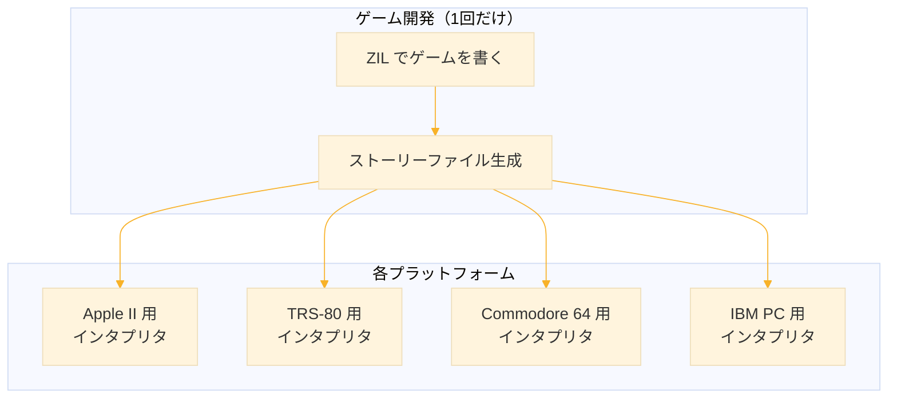
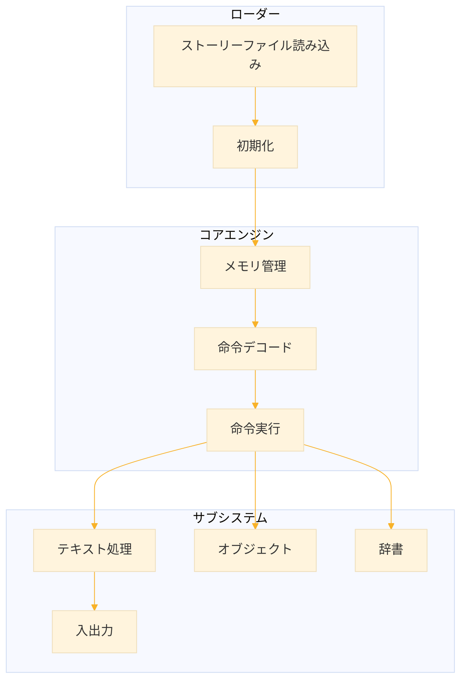
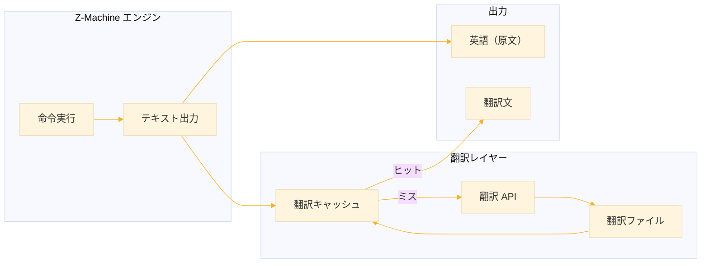

# Level 21-C (ZORKを日本語でプレイする)
## 1. Infocom とテキストアドベンチャー

### 1-1. すべての始まり：Colossal Cave Adventure

1976年、ケンタッキー州のマンモス・ケイブを愛する一人のプログラマーが、コンピュータの中に洞窟を作ろうと思い立った。

Will Crowther は MIT の卒業生で、ARPANET（インターネットの前身）の開発に携わった優秀なエンジニアだった。彼は週末になると妻と共にケンタッキー州の洞窟探検に出かけ、その複雑な地下世界に魅了されていた。離婚後、娘たちと離れて暮らすことになった彼は、洞窟の思い出と娘たちへの愛情を込めて、一つのプログラムを書き始めた。

```
YOU ARE STANDING AT THE END OF A ROAD BEFORE A SMALL BRICK BUILDING.
AROUND YOU IS A FOREST. A SMALL STREAM FLOWS OUT OF THE BUILDING AND
DOWN A GULLY.

> GO BUILDING

YOU ARE INSIDE A BUILDING, A WELL HOUSE FOR A LARGE SPRING.
```

これが「Colossal Cave Adventure」、世界初のテキストアドベンチャーゲームである。プレイヤーはテキストで描写された世界を読み、コマンドを入力して探索を進める。グラフィックスは一切ない。あるのは言葉だけ。しかしその言葉が、プレイヤーの想像力の中に無限の世界を創り出した。

このゲームは ARPANET を通じて瞬く間に広まった。1970年代後半、アメリカ中の大学や研究機関のプログラマーたちが、仕事の合間にこの不思議な洞窟を探検していた。

### 1-2. MIT の若者たち

1977年、マサチューセッツ工科大学（MIT）のコンピュータサイエンス研究所で働いていた4人の若者が、Adventure をクリアした後、こう思った。

「もっと面白いものが作れるはずだ」

Tim Anderson、Marc Blank、Bruce Daniels、Dave Lebling。彼らは MIT の Dynamic Modeling Group に所属し、昼間は国防総省の研究プロジェクトに取り組んでいた。しかし夜になると、彼らは PDP-10 メインフレームの前に集まり、自分たちのゲームを作り始めた。

Adventure の限界は明らかだった。「GET LAMP」「GO NORTH」のような2語のコマンドしか理解できない。彼らはもっと自然な英語を理解するパーサー（構文解析器）を作ろうと考えた。

「PUT THE GOLD COIN IN THE LEATHER BAG」
「ASK THE WIZARD ABOUT THE ANCIENT SPELL」

こんな複雑な文章を理解できるゲームを。

彼らが選んだプログラミング言語は MDL（通称「Muddle」）だった。これは MIT で開発された LISP の方言で、人工知能研究に使われていた言語だ。LISP の強力なシンボル処理能力は、自然言語風のコマンドを解析するのに最適だった。

### 1-3. ZORK の誕生

新しいゲームには名前が必要だった。MIT のハッカー文化では、未完成のプログラムを「zork」と呼ぶ習慣があった。意味のない言葉、プレースホルダー。彼らのゲームも最初は「Zork」と呼ばれた。

一時期「Dungeon」という名前に変更されたが、テーブルトップ RPG「Dungeons & Dragons」の出版社から商標侵害の警告が届き、結局「Zork」に戻った。この奇妙な名前が、ゲーム史に永遠に刻まれることになる。

ZORK は ARPANET を通じて MIT のメインフレームにアクセスできる人々の間で伝説となった。正式に公開されたわけではない。しかし MIT のシステムはセキュリティが緩く、誰でもどんなプログラムが動いているか見ることができた。噂は広まり、全米の大学から人々が MIT のコンピュータにログインして、この新しい「Zork」という冒険に挑戦した。

### 1-4. Infocom の設立

1979年6月22日、10人の MIT 関係者が集まり、ソフトウェア会社を設立した。社名は「Infocom」。創設メンバーには ZORK の開発者4人に加え、J.C.R. Licklider（インターネットの父と呼ばれる人物）も含まれていた。

しかし、一つ大きな問題があった。

ZORK はメインフレーム用に書かれていた。1979年当時、家庭用コンピュータの市場は急速に拡大していたが、Apple II も TRS-80 も Commodore PET も、MIT の PDP-10 とは全く互換性がなかった。しかも家庭用コンピュータはメモリが極端に少ない。PDP-10 版 ZORK は 1MB 以上のメモリを使用していたが、Apple II のメモリはわずか 48KB だった。

Marc Blank と Joel Berez は、この不可能に思える課題に取り組んだ。彼らの解決策は、コンピュータ史に残る革新的なアイデアだった。


## 2. Z-Machine：革命的な仮想マシン

### 2-1. 仮想マシンという発想

Blank と Berez が考え出したのは「仮想マシン」だった。

実際のコンピュータの上に、架空のコンピュータを作る。ゲームはその架空のコンピュータ用に書く。そして、実際の各コンピュータには、その架空のコンピュータをシミュレートするプログラム（インタプリタ）を用意する。



この架空のコンピュータは「Z-Machine」と名付けられた。「Z」は ZORK の頭文字である。

仮想マシンのアイデア自体は新しくなかった。1970年代には UCSD Pascal の P-Machine が存在していた。しかし Infocom の Z-Machine は、テキストアドベンチャーという特定の目的に最適化された、極めて効率的な設計だった。

### 2-2. 驚異的な圧縮技術

最大の課題はメモリだった。オリジナルの ZORK を 48KB に収めることは不可能に思えた。

Blank と Berez は、あらゆる圧縮技術を駆使した。

- **文字の圧縮** 
通常、1文字は8ビット（1バイト）で表現される。しかし英語のアルファベットは26文字、それに数字と記号を加えても64文字程度。Z-Machine は独自の「ZSCII」エンコーディングを開発し、1文字を5ビットで表現した。これだけで約40%の節約になる。

- **略語システム** 
テキストアドベンチャーでは同じ単語が何度も出てくる。"the"、"you"、"is"、"and"... これらの頻出単語を「略語テーブル」に登録し、1バイトの参照で置き換えた。

- **仮想メモリ** 
ゲーム全体を一度にメモリに読み込む必要はない。プレイヤーが今いる場所の周辺だけをメモリに保持し、必要に応じてフロッピーディスクから読み込む。この「ページング」技術により、物理メモリをはるかに超える大きさのゲームが実現した。

これらの技術を組み合わせた結果、オリジナルの ZORK は77KBの「ストーリーファイル」に圧縮された。さらにその中の動的データ（ゲーム中に変化する部分）はわずか18KB。これなら家庭用コンピュータでも動作可能だった。

### 2-3. ZIL：ゲーム開発言語

ゲームを書くための言語も新しく開発された。「ZIL」（Zork Implementation Language）は MDL を簡略化したもので、オブジェクト指向的な記述が可能だった。

ZIL では、ゲーム内のすべてのもの（部屋、アイテム、キャラクター）を「オブジェクト」として定義する。各オブジェクトは属性（取れる、開けられる、光る、など）とプロパティ（名前、説明、中身、など）を持つ。

たとえば、ZORK I に登場する「真鍮のランタン」の定義はこのような形式だった

| 要素 | 値 | 意味 |
|------|-----|------|
| オブジェクト名 | LANTERN | 内部識別子 |
| 場所 | LIVING-ROOM | 最初はリビングルームにある |
| 同義語 | LAMP, LANTERN, LIGHT | これらの単語で参照可能 |
| 形容詞 | BRASS | 「真鍮の」ランタン |
| 説明 | "brass lantern" | インベントリでの表示 |
| 属性 | TAKEBIT, LIGHTBIT | 取れる、光源になる |

この宣言的なスタイルは、LISP の伝統を受け継いでいる。ゲームデザイナーは「何を作るか」を記述すればよく、「どう実装するか」は Z-Machine が処理してくれる。

### 2-4. Z-Machine のバージョン

Infocom は時代と共に Z-Machine を進化させていった。

| バージョン | 年代 | 最大サイズ | 代表作 |
|-----------|------|-----------|--------|
| V1-V2 | 1979-1980 | 128KB | 初期の ZORK（非常に希少） |
| V3 | 1982-1987 | 128KB | ZORK 三部作、Hitchhiker's Guide |
| V4 | 1985-1988 | 256KB | A Mind Forever Voyaging |
| V5 | 1986-1989 | 256KB | Trinity、Beyond ZORK |
| V6 | 1988-1989 | 512KB | ZORK Zero（グラフィック対応） |

V3 が最も長く使われ、Infocom の代表作のほとんどはこのバージョンで動作する。

### 2-5. ポータビリティの勝利

1982年から1985年にかけて、Infocom は次々と新しいプラットフォーム用のインタプリタを開発した。

Apple II、Apple III、Macintosh、TRS-80 Model I/III、TRS-80 Color Computer、Commodore 64、Commodore 128、Amiga、IBM PC、IBM PCjr、Atari 400/800、Atari ST、CP/M、MS-DOS、NEC APC、DEC Rainbow、Kaypro II、Osborne 1...

1980年代は家庭用コンピュータの「戦国時代」だった。IBM と Apple が最終的に市場を二分するまで、数十種類の互換性のないマシンが乱立していた。多くのソフトウェア会社は、この混沌の中で特定のプラットフォームに賭けるしかなかった。

しかし Infocom は Z-Machine のおかげで、すべてのプラットフォームにゲームを提供できた。ライバル会社が1つか2つのプラットフォームでしか販売できない中、Infocom は市場全体をカバーしていた。これが彼らの最大の競争優位だった。


## 3. ZORK：地下帝国の冒険

### 3-1. 白い家の前で

```
ZORK I: The Great Underground Empire
Copyright (c) 1981, 1982, 1983 Infocom, Inc.
All rights reserved.
ZORK is a registered trademark of Infocom, Inc.
Revision 88 / Serial number 840726

West of House
You are standing in an open field west of a white house, 
with a boarded front door.
There is a small mailbox here.

>
```

ZORK は「白い家の西」から始まる。この何の変哲もない一文が、何百万人ものプレイヤーの冒険の出発点となった。

プレイヤーの目的は、Great Underground Empire（地下大帝国）を探索し、20個の宝物を見つけてトロフィーケースに収めること。単純に聞こえるが、その道のりは長く、危険に満ちている。

### 3-2. グルーの恐怖

ZORK を象徴する存在が「グルー」（Grue）である。

```
> GO NORTH

It is pitch black. You are likely to be eaten by a grue.

> GO NORTH

Oh no! You have walked into the slavering fangs of a lurking grue!

    **** You have died ****
```

グルーとは何か？ゲーム内ではこう説明されている。「グルーは邪悪で、よだれを垂らした獣で、暗闘を恐れている。その好物は冒険者である」

実際には、グルーは「光源なしで暗い場所を歩き回るな」というゲームルールを、物語的に表現したものだ。ランタンの電池が切れたら？ 真っ暗になって、グルーに食べられる。このシンプルだが効果的なメカニズムが、ゲーム全体に緊張感を与えている。

「You are likely to be eaten by a grue」は、ゲーマー文化における最も有名なフレーズの一つとなった。

### 3-3. 知性あるパーサー

ZORK のパーサーは、当時としては驚異的に賢かった。

```
> PUT THE GOLD COIN AND THE SILVER COIN IN THE BAG
Done.

> DROP ALL BUT THE LAMP AND THE SWORD
Dropped.

> GIVE THE TROLL THE SWORD
The troll takes the sword, and then hits you with it.
```

複数のオブジェクト、"ALL BUT"のような複雑な指定、間接目的語... Adventure の単純な2語パーサーから、何世代も進化していた。

しかしパーサーが賢いだけでなく、ゲームは「答えられないとき」の対応も洗練されていた。

```
> PICK YOUR NOSE （鼻をほじれ）
Isn't that an expected part of exploring? （それも探検の醍醐味……というわけですか？）

> HIT LAMP （ランプを叩け）
The lamp is now a trifle dented. （ランプがほんの気持ち、へこみました。）
```

このユーモアのセンスが、ZORK を単なるパズルゲームではなく、「対話」の相手として感じさせた。プレイヤーは巨大なメインフレームと会話している感覚を味わえた。

### 3-4. 論理的なパズル

ZORK のパズルは、理不尽ではなく論理的だった。

「なぜこの鍵がこのドアを開けるのか」「なぜこのアイテムをここで使うのか」—— すべてに理由があった。ヒントは注意深く配置されていた。本を読めばヒントが得られる。NPCとの会話で情報が得られる。地下世界は一見カオスだが、内部に一貫した論理があった。

代表的なパズルの例

- **トロールとの対決** 
橋を渡ろうとすると、凶暴なトロールが立ちはだかる。戦っても勝てない。しかし注意深く周囲を観察すると...

- **迷路** 
悪名高い「Twisty Little Passages」の迷路。すべての部屋の説明が同じで、方向感覚を失う。しかしアイテムを落としてマーキングすれば...

- **タイミングパズル** 
ダムを操作して水位を変える。正しい順序で、正しいタイミングで行動しなければ、水に流されてしまう。

これらのパズルは、プレイヤーに「考えること」を要求した。総当たりでは解けない。世界を注意深く観察し、論理的に推理する必要があった。

### 3-5. 三部作の物語

ZORK は三部作として商業リリースされた。

- **ZORK I: The Great Underground Empire (1980)**
白い家から地下帝国への入り口を見つけ、宝物を集める。初心者向けながら、深みのある世界観。

- **ZORK II: The Wizard of Frobozz (1981)**
地下帝国の奥深くで、気まぐれな魔法使い Frobozz と対峙する。より複雑なパズルと、広大な世界。

- **ZORK III: The Dungeon Master (1982)**
最終章。地下帝国の真の支配者、Dungeon Master との対決。哲学的なテーマを含む、シリーズの集大成。

オリジナルのメインフレーム版 ZORK は一つの巨大なゲームだったが、家庭用コンピュータのメモリ制限のために三分割された。しかし各パートは独立した物語として完結しており、分割は成功だった。


## 4. Infocom の黄金時代

### 4-1. ジャンルの多様化

ZORK の成功後、Infocom は様々なジャンルのテキストアドベンチャーを制作した。

**SF系:**
- **Starcross (1982)** - 宇宙船を操り、謎の異星人遺物を探索
- **Planetfall (1983)** - 愛らしいロボット「Floyd」との冒険
- **A Mind Forever Voyaging (1985)** - 社会シミュレーションを含む野心作

**ミステリー系:**
- **Deadline (1982)** - 殺人事件を12時間以内に解決
- **The Witness (1983)** - ハードボイルド探偵物
- **Suspect (1984)** - 自分自身が容疑者

**ファンタジー系:**
- **Enchanter 三部作 (1983-1985)** - ZORK 世界の魔法使いの物語
- **Wishbringer (1985)** - 初心者向けの優しいファンタジー

**その他:**
- **The Hitchhiker's Guide to the Galaxy (1984)** - Douglas Adams との共作
- **Leather Goddesses of Phobos (1986)** - 大人向けコメディSF
- **Trinity (1986)** - 核兵器をテーマにした問題作

### 4-2. 「Feelies」という発明

Infocom のゲームは、豪華な同梱物で知られていた。これを「Feelies」と呼んだ。

ZORK には地下帝国の地図が付属していた。Deadline には警察の報告書、証拠写真、容疑者の錠剤が入っていた。The Hitchhiker's Guide には「Don't Panic」バッジ、Peril Sensitive Sunglasses（危険感知サングラス、実際には真っ黒なプラスチック）、宇宙船の破壊命令書などが付属していた。

Feelies は三つの目的を果たした

1. **没入感の向上** - 物理的な小道具が、ゲーム世界をより現実的に感じさせた
2. **コピー防止** - ゲームの重要なパズルに Feelies の情報が必要だった
3. **コレクション価値** - 美しいパッケージは、所有する喜びを与えた

### 4-3. InvisiClues

Infocom は、ヒントの販売方法も革新的だった。

「InvisiClues」は、特殊なインクで印刷されたヒントブック。各パズルについて、段階的なヒントが書かれているが、目には見えない。付属のマーカーでこすると、そのヒントだけが現れる。

プレイヤーは必要最小限のヒントだけを見ることができた。「答えを全部見てしまう」誘惑を避けられる、巧妙なシステムだった。

### 4-4. 衰退と買収

1980年代半ば、Infocom は分岐点に立っていた。

創業者たちの一部は、ゲーム以外のビジネスソフトウェアに進出したいと考えていた。「Cornerstone」というデータベースソフトの開発に多大なリソースが投入された。これは Z-Machine と同様のポータビリティを持つビジネスソフトという野心的なプロジェクトだったが、IBM PC 市場での競争に敗れ、商業的に失敗した。

同時に、グラフィックスの進化がテキストアドベンチャーを時代遅れに見せ始めていた。Sierra On-Line の「King's Quest」(1984) のようなグラフィックアドベンチャーが人気を集める中、「文字だけのゲーム」は古臭く見えた。

1986年、財政難に陥った Infocom は Activision に買収された。しばらくはゲーム開発を続けたが、1989年、Infocom は閉鎖された。

しかし、彼らが残したものは消えなかった。


## 5. Z-Machine の不死

### 5-1. 仕様のリバースエンジニアリング

Infocom 閉鎖後、熱心なファンたちが Z-Machine の仕様を解読し始めた。

公式の仕様書は存在しなかった。しかし、ストーリーファイルを解析し、動作を観察することで、Z-Machine の内部構造を逆算することができた。1990年代半ばまでに、Z-Machine の仕様はほぼ完全に解明された。

1996年、Graham Nelson がこれらの知見をまとめて「Z-Machine Standards Document」を公開した。これは今日に至るまで、Z-Machine 実装の標準的な参考文献となっている。

### 5-2. Frotz と他のインタプリタ

仕様が公開されると、フリーの Z-Machine インタプリタが次々と登場した。

**Frotz** は最も広く使われているインタプリタだ。1995年に Stefan Jokisch が開発を始め、現在も活発に開発が続いている。Unix、Windows、macOS、さらには Game Boy や携帯電話まで、あらゆるプラットフォームに移植されている。

Z-Machine インタプリタは、おそらく最も多くのプラットフォームに移植された仮想マシンの一つだ。1980年代のビンテージコンピュータから最新のスマートフォンまで、ZORK を遊べないプラットフォームを見つけるのは難しい。

### 5-3. Inform：新しいゲームを作る

Z-Machine の仕様が公開されたことで、新しいゲームを作ることも可能になった。

**Inform** は Graham Nelson が1993年に開発したプログラミング言語で、Z-Machine 用のゲームを作成できる。Infocom の ZIL とは異なる新しい言語だが、同じ Z-Machine バイトコードを生成する。

Inform の登場により、アマチュア作家たちがテキストアドベンチャーを作成できるようになった。毎年開催される「Interactive Fiction Competition」（IFComp）には、何十もの新作が出品される。

2006年、Nelson は Inform 7 をリリースした。これは革命的だった。プログラミング言語というより、自然言語に近い記述でゲームを作れる

```
The Living Room is a room. "You are in a comfortable living room."
The wooden table is in the Living Room. It is a supporter.
The brass lamp is on the table. It is lit.
```

この自然言語スタイルにより、プログラミング経験のない作家でもインタラクティブフィクションを作成できるようになった。

### 5-4. ZORK のオープンソース化（2025年）

2025年11月、ゲーム史に残る出来事が起きた。Microsoft が ZORK I、II、III のソースコードを MIT ライセンスでオープンソース化したのだ。

Microsoft の Open Source Programs Office（OSPO）、Team Xbox、そして Activision が協力し、歴史的に重要なコードを学生、教育者、開発者の手に届けることを目的としている。

この公開は、新しいリポジトリを作るのではなく、Internet Archive の著名なデジタルアーキビスト Jason Scott が管理してきた既存の historicalsource リポジトリに、公式にライセンスを付与する形で行われた。

| リポジトリ | 内容 |
|-----------|------|
| [github.com/historicalsource/zork1](https://github.com/historicalsource/zork1) | ZORK I ソースコード |
| [github.com/historicalsource/zork2](https://github.com/historicalsource/zork2) | ZORK II ソースコード |
| [github.com/historicalsource/zork3](https://github.com/historicalsource/zork3) | ZORK III ソースコード |

各リポジトリには、ZIL ソースコード、ビルドノート、コメント、歴史的に重要なファイルが含まれている。MIT ライセンスが選ばれたのは、そのシンプルさとオープンさゆえ。コードを学び、教え、発展させることが容易になる。

Microsoft のブログは次のように述べている：「ZORK は常に単なるゲーム以上のものだった。想像力とエンジニアリングが、何世代ものハードウェアとプレイヤーを超えて生き続けられることを示している」

40年以上の時を経て、かつて MIT の学生たちが夜な夜な開発したゲームのソースコードが、正式にオープンソースとなった。これは単なるコードの公開ではない。ゲーム史の保存であり、次世代への贈り物だ。

### 5-5. 現代のテキストアドベンチャー

テキストアドベンチャーは「死んだ」ジャンルではない。形を変えて生き続けている。

**Twine** は、ウェブベースのインタラクティブフィクション作成ツール。プログラミング不要で、分岐する物語を作れる。

**Choice of Games** は、選択肢ベースのテキストゲームを商業的に成功させている。

**AI Dungeon** は、GPTベースの AI がリアルタイムでストーリーを生成する、新世代のテキストアドベンチャーだ。

そして今でも、古典的な ZORK を遊ぶ人々がいる。白い家の前に立ち、郵便受けを開け、地下帝国へ降りていく。40年以上前のゲームが、今も新しいプレイヤーを魅了し続けている。


## 6. Common Lisp で Z-Machine を実装する

https://github.com/fukuyori/zmachine-multilingual

### 6-1. なぜ Lisp で実装するのか

Z-Machine インタプリタを Common Lisp で実装することには、特別な意味がある。

ZORK 自体が MDL（LISP の方言）で書かれていた。ZIL も LISP の影響を強く受けている。Lisp で Z-Machine インタプリタを書くことは、ある意味で「原点回帰」だ。

技術的にも、Lisp は Z-Machine の実装に適している

| 特徴 | Z-Machine 実装での利点 |
|------|----------------------|
| 動的型付け | 16ビット値が文脈で異なる意味を持つことに対応 |
| シンボル処理 | オペコードの名前と実装を自然に結びつけられる |
| REPL | 対話的にテスト・デバッグできる |
| リスト操作 | オブジェクトツリーの操作が直感的 |
| マクロ | オペコード定義を簡潔に書ける |

### 6-2. 実装の概要

Z-Machine インタプリタは、以下のコンポーネントで構成される



- **メモリ管理** 
Z-Machine のメモリは単純なバイト配列。ストーリーファイルを読み込み、バイト/ワードアクセス、変数の読み書きを提供する。

- **命令デコード** 
バイトコードから命令を解析する。Z-Machine の命令は可変長で、オペコードの値によってオペランドの数と形式が決まる。

- **命令実行** 
約100個のオペコードそれぞれに対応する処理を実行する。算術演算、分岐、オブジェクト操作、入出力など。

- **テキスト処理** 
ZSCII エンコーディングのデコード、略語の展開、テキストの出力。

- **オブジェクトシステム** 
ゲーム内オブジェクトのツリー構造を管理。属性とプロパティの読み書き。

- **辞書** 
プレイヤー入力をトークン化し、ゲームの辞書と照合する。

### 6-3. Z-Machine のメモリモデル

Z-Machine のメモリは三つの領域に分かれる

| 領域 | 内容 | 特徴 |
|------|------|------|
| 動的メモリ | 変数、オブジェクト状態 | 読み書き可能、セーブ対象 |
| 静的メモリ | コード、テキスト | 読み取り専用 |
| 高位メモリ | 追加データ | 必要時にロード |

**動的メモリ** はゲームの「状態」を保持する。セーブ/ロード時には、この部分だけを保存すればよい。

**静的メモリ** にはプログラムコードとテキストが格納される。実行中に変更されることはない。

**高位メモリ** は大きなゲームで使われる追加領域。家庭用コンピュータの限られたメモリでは、必要に応じてディスクから読み込まれた。

### 6-4. 命令セットの概要

Z-Machine の命令は約100個。形式によって分類される

| 分類 | 例 | 説明 |
|------|-----|------|
| 0OP | rtrue, rfalse, print | オペランドなし |
| 1OP | jz, get_child, print_obj | オペランド1つ |
| 2OP | add, sub, je, test_attr | オペランド2つ |
| VAR | call, read, random | 可変オペランド |

### 6-5. ZSCII とテキスト圧縮

Z-Machine は独自の文字エンコーディング「ZSCII」を使用する。

通常の ASCII では1文字8ビットだが、ZSCII では5ビットで表現する。16ビットのワードに3文字を詰め込める。

5ビットでは32通りしか表現できないが、「シフト」の仕組みで切り替える

| アルファベット | 内容 |
|--------------|------|
| A0（デフォルト） | a-z の小文字 |
| A1（シフト4） | A-Z の大文字 |
| A2（シフト5） | 数字と記号 |

さらに略語システムにより、頻出単語は1バイトの参照に置き換えられる。これらの圧縮技術により、テキスト量に比して非常にコンパクトなストーリーファイルが実現した。


## 7. 多言語対応 Z-Machine インタプリタ

### 7-1. 古典を世界へ

ZORK は英語でしかプレイできなかった。1980年代の技術的制約、そして Infocom の市場が北米中心だったことから、他言語への翻訳は行われなかった。

しかし40年以上経った今、テキストアドベンチャーの古典を世界中の人々に楽しんでもらいたいと考えるのは自然なことだ。日本語で「グルーに食べられる」経験をしてみたい。フランス語で地下帝国を探検したい。

`zmachine-multilingual` プロジェクトは、この願いを実現するために作られた。Z-Machine インタプリタに翻訳システムを統合し、10言語でゲームをプレイできるようにする。

### 7-2. 対応言語

| コード | 言語 | 表記 |
|-------|------|------|
| :en | 英語 | English |
| :ja | 日本語 | 日本語 |
| :ko | 韓国語 | 한국어 |
| :zh-hans | 簡体中国語 | 简体中文 |
| :zh-hant | 繁体中国語 | 繁體中文 |
| :fr | フランス語 | Français |
| :de | ドイツ語 | Deutsch |
| :es | スペイン語 | Español |
| :pt | ポルトガル語 | Português |
| :ru | ロシア語 | Русский |

### 7-3. 翻訳システムのアーキテクチャ



翻訳システムは、Z-Machine のテキスト出力をインターセプトする。テキストが出力されるたびに

1. キャッシュを確認
2. キャッシュにあれば、その翻訳を使用
3. なければ、翻訳 API を呼び出し
4. 結果をキャッシュに保存
5. オリジナルと翻訳を両方表示（バイリンガルモード）

### 7-4. 翻訳キャッシュの重要性

テキストアドベンチャーでは、同じテキストが何度も表示される。部屋の説明、エラーメッセージ、システムメッセージ...

毎回翻訳 API を呼び出すのは非効率的だし、コストもかかる。翻訳キャッシュにより、一度翻訳したテキストは再利用される。

キャッシュはファイルに永続化される。一度ゲームを最後までプレイすれば、すべてのテキストが翻訳され、次回からは API 呼び出しなしでプレイできる。

### 7-5. バイリンガル表示

```
West of House
You are standing in an open field west of a white house, 
with a boarded front door.
There is a small mailbox here.

家の西側
あなたは白い家の西側の開けた野原に立っています。
玄関は板で塞がれています。
ここに小さな郵便受けがあります。
>
```

オリジナルの英語テキストと翻訳を同時に表示することで、原文のニュアンスを確認しながらプレイできる。また、翻訳の品質を確認し、必要に応じて修正することも容易になる。


## 8. zmachine-multilingual の解説

### 8-1. プロジェクト構成

```
zmachine-multilingual/
├── packages.lisp       # パッケージ定義
├── memory.lisp         # メモリ管理、セーブ/ロード
├── text.lisp           # テキスト処理（ZSCII デコード）
├── objects.lisp        # オブジェクトツリー操作
├── dictionary.lisp     # 辞書処理（入力解析）
├── decode.lisp         # 命令デコード
├── opcodes.lisp        # 基本オペコード (0OP/1OP/2OP)
├── opcodes-var.lisp    # 可変オペコード (VAR)
├── execute.lisp        # 実行ループ
├── translate.lisp      # 翻訳システム
├── languages.lisp      # 言語定義
├── run-zork.lisp       # 起動スクリプト
├── zmachine.asd        # ASDF システム定義
└── translations/       # 翻訳データ
```

### 8-2. 各モジュールの役割

- **packages.lisp**
Common Lisp のパッケージを定義する。外部に公開する関数（`load-story`, `run`, `set-language` など）を宣言している。

- **memory.lisp**
Z-Machine の心臓部。ストーリーファイルをバイト配列として読み込み、メモリアクセス関数を提供する。グローバル変数、ローカル変数、スタックの管理もここで行う。セーブ/リストア機能も実装されている。

- **text.lisp**
ZSCII エンコーディングを扱う。5ビット文字のデコード、アルファベットシフト、略語展開を実装。翻訳システムとの接続点でもある。

- **objects.lisp**
Z-Machine のオブジェクトシステムを実装。オブジェクトはツリー構造を持ち、親子関係で包含関係を表現する。属性（32個のフラグ）とプロパティ（可変長データ）へのアクセスを提供。

- **dictionary.lisp** 
プレイヤー入力の解析を担当。入力文字列をトークンに分割し、各トークンを辞書で検索する。見つかったアドレスをパースバッファに格納し、ゲームロジックに渡す。

- **decode.lisp** 
バイトコードのデコーダ。オペコードの形式（0OP/1OP/2OP/VAR）を判定し、オペランドを読み取り、命令構造体を生成する。

- **opcodes.lisp** と **opcodes-var.lisp** 
約100個のオペコードの実装。算術演算、比較、分岐、オブジェクト操作、入出力など、Z-Machine のすべての機能がここに含まれる。

- **execute.lisp** 
メイン実行ループ。命令をデコードし、対応するオペコード関数を呼び出し、これを繰り返す。ルーチン呼び出しとリターンの管理も行う。

- **translate.lisp** 
多言語対応の中核。翻訳キャッシュの管理、DeepL/Claude API との連携、翻訳データの保存/読み込みを実装。

- **languages.lisp** 
対応言語の定義。言語コード、英語名、ネイティブ名のテーブルを持つ。

### 8-3. 使い方

**起動**
```bash
sbcl --load run-zork.lisp
```

**REPL での操作**
```lisp
(list-languages)           ; 利用可能な言語を表示
(set-language :ja)         ; 日本語に設定
(load-story "zork1.z3")    ; ストーリーファイル読み込み
(run)                      ; ゲーム開始
```

**翻訳管理**
```lisp
(show-untranslated)        ; 未翻訳テキストを表示
(quick-translate 1 "...")  ; 手動で翻訳を追加
(setup-deepl "api-key")    ; DeepL API を設定
(auto-translate-all)       ; 自動翻訳
(save-language-translations) ; 翻訳を保存
```


## 9. まとめ：言葉の力

### 9-1. テキストアドベンチャーの遺産

ZORK と Infocom が残したものは、単なるゲームではない。

彼らは「言葉だけで世界を創る」ことの可能性を示した。グラフィックスがどれほど進化しても、言葉による描写が喚起する想像力には独特の力がある。

Z-Machine という技術は、「Write Once, Run Anywhere」の理念を、Java や .NET よりも10年以上前に実現していた。

Infocom のパーサーは、自然言語処理の実用的な応用例として、AI 研究にも影響を与えた。

### 9-2. 今なぜ Z-Machine か

40年以上前の技術を学ぶ意義は何だろうか。

- **歴史を知る** 
現代の技術は過去の上に築かれている。仮想マシン、バイトコード、ポータビリティ... これらの概念が初期にどう実装されたかを知ることは、現代の技術をより深く理解する助けになる。

- **シンプルさの美学** 
Z-Machine は制約の中で生まれた。限られたメモリ、遅いCPU、互換性のないハードウェア。その制約が、美しく効率的な設計を生んだ。

- **Lisp の実践** 
Z-Machine インタプリタは、Common Lisp の実践的なプロジェクトとして最適なサイズと複雑さを持っている。

- **楽しみ** 
そして何より、ZORK は今でも面白い。グルーに食べられ、トロールに殺され、迷路で迷う。40年経っても、その体験は色褪せない。

### 9-3. 「グルーに食べられる」を日本語で

```
真っ暗だ。グルーに食べられそうだ。

> north

おっと！潜んでいたグルーの、よだれを垂らした牙の中に
踏み込んでしまった！

    **** あなたは死んでしまった ****
```

白い家の前に立ち、郵便受けを開け、地下帝国への扉を見つける。その冒険を、あなたの言語で体験してほしい。


## 参考資料

### 公式資料・仕様書
- [The Z-Machine Standards Document](https://inform-fiction.org/zmachine/standards/)
- [Interactive Fiction Archive](https://ifarchive.org/)

### 歴史・背景
- [The Digital Antiquarian - ZIL and the Z-Machine](https://www.filfre.net/2012/01/zil-and-the-z-machine/)
- [MIT Technology Review - The Enduring Legacy of Zork](https://www.technologyreview.com/2017/08/22/149560/the-enduring-legacy-of-zork/)

### ソースコード
- [Infocom Source Code (GitHub)](https://github.com/historicalsource)
- [zmachine-multilingual](https://github.com/fukuyori/zmachine-multilingual)

### ツール
- [Frotz - Z-Machine Interpreter](https://davidgriffith.gitlab.io/frotz/)
- [Inform 7](http://inform7.com/)

