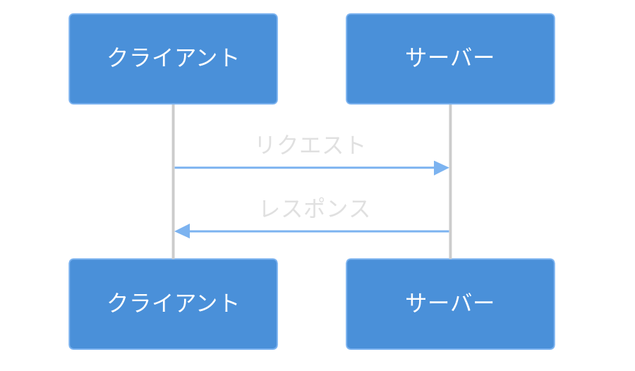

# Level 22 (HTTPクライアント)
本章では、Common LispでHTTP通信を行う方法を学ぶ。Webページの取得、APIの呼び出し、JSONデータの処理など、現代のプログラミングで必須となるネットワーク通信の基礎を習得する。

**習得する技術**
- 外部ライブラリの利用（Dexador、cl-json、Plump）
- HTTP通信（GET、POST、ヘッダー操作）
- JSONデータの解析と生成
- エラーハンドリング（ネットワークエラー対応）
- Webスクレイピングの基礎と倫理

**なぜHTTPクライアントを学ぶのか**

現代のアプリケーション開発において、外部サービスとの通信は欠かせない。天気予報の取得、地図サービスの利用、SNSとの連携など、多くの機能がWebAPIを通じて提供されている。HTTPクライアントを実装できるようになると、これらのサービスを自分のプログラムから利用できるようになる。

また、データ収集や分析の分野でも、Webからの情報取得は重要なスキルである。ただし、後述するように法的・倫理的な配慮も必要となる。


## 1 課題の説明

### 作成するもの

本章では、以下の機能を持つHTTPクライアントツールを段階的に作成する。

1. **Webページ取得ツール** ― URLを指定してHTMLを取得
2. **API呼び出しツール** ― REST APIからJSONデータを取得・送信
3. **天気情報取得ツール** ― 公開APIを利用した実用的なアプリケーション

### 学習の流れ

本章は以下の順序で進める。各ステップは前のステップの知識を前提としているため、順番に進めることを推奨する。

```
Step 1: HTTP基礎知識  → プロトコルの概念を理解する
    ↓
Step 2: GETリクエスト → Webページを取得する
    ↓
Step 3: POSTリクエスト → データを送信する
    ↓
Step 4: JSON処理     → APIレスポンスを解析する
    ↓
Step 5: エラー処理   → 失敗に備える
    ↓
Step 6: スクレイピング → HTMLを解析する（法的注意あり）
    ↓
Step 7: 統合演習     → 実用的なアプリを作る
```

### 前提知識

- Level 15で学んだパッケージとQuicklispの基礎
- Level 13で学んだエラー処理（handler-case）
- Level 11で学んだ連想リストの操作

### 必要なライブラリ

| ライブラリ | 用途 | 選定理由 |
|-----------|------|----------|
| Dexador | HTTPクライアント | 高速で使いやすい、日本人開発者による |
| cl-json | JSONのパース・生成 | シンプルで標準的 |
| Plump | HTMLのパース | 堅牢でエラー耐性が高い |
| CLSS | CSSセレクタによる要素選択 | 直感的な要素選択が可能 |
| quri | URL操作 | パラメータの構築・エンコードが容易 |


## 2 HTTPの基礎

### HTTPとは

HTTP（HyperText Transfer Protocol）は、WebブラウザとWebサーバー間の通信プロトコルである。「プロトコル」とは、通信の手順や形式を定めた規約のことだ。

普段Webブラウザでサイトを閲覧するとき、ブラウザは裏でHTTPを使ってサーバーと通信している。本章では、この通信をプログラムから行う方法を学ぶ。



HTTPの特徴は、**リクエスト・レスポンス型**の通信であることだ。クライアント（ブラウザやプログラム）がリクエストを送り、サーバーがレスポンスを返す。サーバーから自発的に通信を開始することはない。

### HTTPメソッド

HTTPには「何をしたいか」を示す**メソッド**がある。Webサイトを見るだけなら`GET`、フォームを送信するなら`POST`、というように使い分ける。

| メソッド | 用途 | 例 | サーバー上の変化 |
|---------|------|-----|-----------------|
| GET | リソースの取得 | Webページの閲覧、検索 | なし（読み取りのみ） |
| POST | データの送信・作成 | フォーム送信、新規登録 | 新しいデータが作られる |
| PUT | リソースの更新（全体） | データの上書き | 既存データが置き換わる |
| DELETE | リソースの削除 | データの削除 | データが消える |
| PATCH | リソースの部分更新 | 一部フィールドの変更 | 一部のデータが変わる |

**実務では`GET`と`POST`が最も重要**である。本章でもこの2つを中心に学ぶ。

### HTTPステータスコード

サーバーからのレスポンスには、処理結果を示す3桁の**ステータスコード**が含まれる。最初の数字で大まかな意味がわかる。

| コード範囲 | 意味 | 代表例 | プログラムでの対応 |
|-----------|------|--------|-------------------|
| 2xx | 成功 | 200 OK、201 Created | 正常処理を続行 |
| 3xx | リダイレクト | 301 Moved、302 Found | 別のURLに再リクエスト |
| 4xx | クライアントエラー | 400 Bad Request、404 Not Found | リクエストを修正 |
| 5xx | サーバーエラー | 500 Internal Server Error | 時間をおいて再試行 |

**覚えておくべきコード**
- **200**：成功（最も一般的）
- **404**：ページが見つからない
- **500**：サーバー側でエラーが発生

### リクエストとレスポンスの構造

HTTPメッセージは、**ヘッダー**（メタ情報）と**ボディ**（本体データ）で構成される。

**リクエストの例（ブラウザ → サーバー）**
```
GET /api/weather?city=Tokyo HTTP/1.1     ← リクエスト行（メソッド、パス、バージョン）
Host: api.example.com                     ← ヘッダー（どのサーバーか）
User-Agent: MyApp/1.0                     ← ヘッダー（何のプログラムか）
Accept: application/json                  ← ヘッダー（欲しいデータ形式）
                                          ← 空行（ヘッダーの終わり）
                                          ← GETにはボディがない
```

**レスポンスの例（サーバー → ブラウザ）**
```
HTTP/1.1 200 OK                           ← ステータス行（バージョン、コード、説明）
Content-Type: application/json            ← ヘッダー（データ形式）
Content-Length: 42                        ← ヘッダー（データサイズ）
                                          ← 空行
{"city": "Tokyo", "temperature": 22}      ← ボディ（実際のデータ）
```


## 3 Dexadorのインストールと設定

### なぜDexadorを使うのか

Common Lispには複数のHTTPクライアントライブラリがある。Dexadorを選ぶ理由は以下の通り。

1. **高速**: 内部で高速なソケット通信を使用
2. **使いやすいAPI**: 関数名が直感的（`dex:get`、`dex:post`など）
3. **活発な開発**: 日本人開発者（深町英太郎氏）により継続的にメンテナンス
4. **多機能**: タイムアウト、リダイレクト追跡、Cookie管理などを標準サポート

### Quicklispによるインストール

```lisp
;;; Quicklispでインストール（初回のみ、数秒〜数分かかる）
(ql:quickload :dexador)

;;; 関連ライブラリも一緒にインストール
(ql:quickload :cl-json)    ; JSON処理用
(ql:quickload :plump)      ; HTMLパース用
(ql:quickload :clss)       ; CSSセレクタ用
(ql:quickload :quri)       ; URL操作用
```

**注意**: 初回インストール時は、依存ライブラリも含めて多くのパッケージがダウンロードされる。ネットワーク環境によっては数分かかることがある。

### 動作確認

インストールが完了したら、簡単なリクエストで動作を確認する。

```lisp
;;; 簡単なGETリクエストで動作確認
(dex:get "https://httpbingo.org/get")
;; => "{\"args\": {}, \"headers\": {...}, ...}"
```

**httpbingo.org**は、HTTPリクエストのテスト用に公開されているサービスである。送ったリクエストの内容をそのまま返してくれるため、学習やデバッグに最適だ。

**注意**: httpbingo.orgは無料サービスのため、一時的に利用できないことがある（503エラーなど）。その場合は以下の代替サービスを使用する。

```lisp
;;; Postman提供、安定性高い
(dex:get "https://postman-echo.com/get")
```

動作確認で以下のような文字列が返ってくれば成功である。

```json
{
  "args": {},
  "headers": {
    "Accept": "*/*",
    "Host": "httpbingo.org",
    ...
  },
  "origin": "xxx.xxx.xxx.xxx",
  "url": "https://httpbingo.org/get"
}
```

## 4 ステップ1：GETリクエスト

### GETリクエストとは

GETリクエストは、サーバーから**データを取得する**ために使う。Webブラウザでリンクをクリックしたときや、URLを直接入力したときに行われるのがGETリクエストである。

**特徴**
- サーバーのデータを変更しない（副作用がない）
- パラメータはURLに含める（`?key=value&key2=value2`形式）
- キャッシュされることがある

### パッケージの定義

まず、作成するツールのためのパッケージを定義する。

```lisp
(defpackage :http-client
  (:use :cl)
  (:export :fetch-url
           :fetch-json
           :get-weather))

(in-package :http-client)
```

**なぜパッケージを作るのか**: 名前の衝突を防ぎ、コードを整理するため。`fetch-url`のような一般的な名前でも、パッケージ内なら他のコードと衝突しない。

### 基本的なGETリクエスト

```lisp
;;; 最もシンプルなURL取得関数
(defun fetch-url (url)
  "URLからコンテンツを取得する
   
   引数:
     url - 取得したいWebページのURL（文字列）
   
   戻り値:
     取得したコンテンツ（文字列）"
  (dex:get url))
```

`dex:get`は、指定したURLにGETリクエストを送り、レスポンスのボディ（本体）を返す。

### 実行例

```lisp
(fetch-url "https://example.com")
;; => "<!doctype html>
;;     <html>
;;     <head>
;;         <title>Example Domain</title>
;;     ..."
```

example.comは、例示用に確保されているドメインで、シンプルなHTMLを返す。

### 複数の戻り値

`dex:get`は実際には**複数の値**を返す。Common Lispの多値機能を使って、詳細な情報を取得できる。

```lisp
(multiple-value-bind (body status headers uri stream)
    (dex:get "https://httpbingo.org/get")
  (format t "ステータス: ~A~%" status)           ; 200
  (format t "Content-Type: ~A~%"
          (gethash "content-type" headers))      ; application/json
  body)                                          ; レスポンスボディを返す
```

```:出力例
ステータス: 200
Content-Type: application/json; charset=utf-8
{
  "args": {},
  "headers": {
    "Host": [
      "httpbingo.org"
    ],
    "User-Agent": [
      "Dexador/0.9.15 (SBCL 2.5.10); Win32; 10.0.26200"
    ],
    ...
```

**各戻り値の意味**
| 順番 | 変数名 | 内容 |
|------|--------|------|
| 1 | body | レスポンスの本体（文字列またはバイト列） |
| 2 | status | HTTPステータスコード（整数、例: 200） |
| 3 | headers | レスポンスヘッダー（ハッシュテーブル） |
| 4 | uri | 最終的なURI（リダイレクトがあった場合は変わる） |
| 5 | stream | 接続ストリーム（通常は使わない） |

### ヘッダーの指定

カスタムヘッダーを追加してリクエストを送信できる。**User-Agent**ヘッダーは、どのプログラムからアクセスしているかを示すもので、設定することがマナーとされている。

```lisp
(defun fetch-with-headers (url &key (user-agent "CommonLisp-Client/1.0"))
  "カスタムヘッダー付きでURLを取得する
   
   引数:
     url        - 取得するURL
     user-agent - User-Agentヘッダー（省略時は既定値）
   
   戻り値:
     レスポンスボディ"
  (dex:get url
           :headers `(("User-Agent" . ,user-agent)    ; プログラム名を通知
                      ("Accept" . "text/html"))))      ; HTMLが欲しいと通知
```

```lisp:実行例
(fetch-with-headers "https://httpbingo.org/get" :user-agent "MyLispClient/2.0")
;; →
;; {
;;   "args": {},
;;   "headers": {
;;     "Accept": [
;;       "text/html"
;;     ],
;;     "Host": [
;;       "httpbingo.org"
;;     ],
;;     "User-Agent": [
;;       "MyLispClient/2.0"
;;     ],
;;     ...
```

**よく使うヘッダー**
- `User-Agent`: クライアントの識別名
- `Accept`: 希望するレスポンス形式
- `Accept-Language`: 希望する言語
- `Authorization`: 認証情報

### クエリパラメータ

URLに`?key=value`形式でパラメータを付けることを**クエリパラメータ**という。検索条件やフィルタを指定するときによく使われる。

```lisp
;;; 方法1: URLに直接含める（シンプルな場合）
(dex:get "https://httpbingo.org/get?name=lisp&version=1.0")

;;; 方法2: quriライブラリを使う（パラメータが多い場合、エンコードが必要な場合）
(ql:quickload :quri)

(defun build-url-with-params (base-url params)
  "ベースURLにクエリパラメータを追加する
   
   引数:
     base-url - パラメータなしのURL
     params   - パラメータの連想リスト
   
   例:
     (build-url-with-params \"https://example.com/api\" 
                            '((\"q\" . \"検索語\")))
     => \"https://example.com/api?q=%E6%A4%9C%E7%B4%A2%E8%AA%9E\""
  (let ((uri (quri:uri base-url)))
    (setf (quri:uri-query-params uri) params)  ; パラメータを設定
    (quri:render-uri uri)))                     ; URL文字列に変換

;; 使用例
(build-url-with-params "https://httpbingo.org/get"
                       '(("name" . "lisp") ("version" . "1.0")))
;; => "https://httpbingo.org/get?name=lisp&version=1.0"
```

**quriを使う利点**
- 日本語などの非ASCII文字を自動でエンコード
- 特殊文字（`&`、`=`など）を適切にエスケープ
- URLの各部分（スキーム、ホスト、パスなど）を個別に操作可能


## 5 ステップ2：POSTリクエスト

### POSTリクエストとは

POSTリクエストは、サーバーに**データを送信する**ために使う。ログインフォームの送信、新規ユーザー登録、ファイルアップロードなどで使用される。

**GETとの違い**
| 項目 | GET | POST |
|------|-----|------|
| 用途 | データ取得 | データ送信 |
| データの場所 | URL内（見える） | ボディ内（見えにくい） |
| データサイズ | URL長の制限あり | 大きなデータも可 |
| キャッシュ | される | されない |
| ブックマーク | できる | できない |

### フォームデータの送信

HTMLフォームと同じ形式でデータを送信する方法。`application/x-www-form-urlencoded`という形式を使う。

```lisp
(defun post-form (url data)
  "フォームデータをPOSTする
   
   引数:
     url  - 送信先URL
     data - 送信するデータ（連想リスト）
   
   例:
     (post-form \"https://example.com/login\"
                '((\"username\" . \"alice\")
                  (\"password\" . \"secret\")))"
  (dex:post url
            :content data    ; 送信するデータ
            :headers '(("Content-Type" . "application/x-www-form-urlencoded"))))

;; 使用例
(post-form "https://httpbingo.org/post"
           '(("username" . "testuser")
             ("password" . "secret123")))
```

**httpbingo.org/post**は、受け取ったデータをそのままJSON形式で返すので、テストに便利。

### JSONデータの送信

最近のWeb APIでは、JSON形式でデータをやり取りすることが多い。

```lisp
(defun post-json (url data)
  "JSONデータをPOSTする
   
   引数:
     url  - 送信先URL
     data - 送信するデータ（Lispオブジェクト、自動でJSONに変換）
   
   例:
     (post-json \"https://api.example.com/users\"
                '((:name . \"Alice\") (:age . 30)))"
  (dex:post url
            :content (cl-json:encode-json-to-string data)  ; LispをJSONに変換
            :headers '(("Content-Type" . "application/json"))))

;; 使用例
(post-json "https://httpbingo.org/post"
           '((:name . "Alice")
             (:age . 30)
             (:active . t)))    ; tはJSONのtrueになる
```

**Content-Typeヘッダーの重要性**：サーバーはこのヘッダーを見て、送られてきたデータの形式を判断する。JSONを送るのに`application/x-www-form-urlencoded`と指定するとエラーになる。

### PUT・DELETEリクエスト

REST APIでは、データの更新にPUT、削除にDELETEを使うことが多い。

```lisp
;;; PUTリクエスト（リソースの更新）
;;; 「このデータで上書きしてください」という意味
(defun put-json (url data)
  "JSONデータでPUTリクエストを送信する"
  (dex:put url
           :content (cl-json:encode-json-to-string data)
           :headers '(("Content-Type" . "application/json"))))

;;; DELETEリクエスト（リソースの削除）
;;; 「このリソースを削除してください」という意味
(defun delete-resource (url)
  "DELETEリクエストを送信する"
  (dex:delete url))

;; 使用例（実際のAPIの場合）
;; (put-json "https://api.example.com/users/123" 
;;           '((:name . "Bob") (:age . 25)))
;; (delete-resource "https://api.example.com/users/123")
```


## 6 ステップ3：JSONの処理

### JSONとは

JSON（JavaScript Object Notation）は、データ交換のための軽量なテキスト形式である。元々はJavaScriptで使われていたが、現在はほぼすべてのプログラミング言語でサポートされ、Web APIの標準的なデータ形式となっている。

**JSONの例**
```json
{
  "name": "Alice",
  "age": 30,
  "hobbies": ["reading", "programming"],
  "address": {
    "city": "Tokyo",
    "country": "Japan"
  },
  "active": true
}
```

### cl-jsonの基本

cl-jsonライブラリを使うと、JSON文字列とLispオブジェクトを相互変換できる。

```lisp
(ql:quickload :cl-json)

;;; JSON文字列 → Lispオブジェクト（デコード）
(cl-json:decode-json-from-string "{\"name\": \"Alice\", \"age\": 30}")
;; => ((:NAME . "Alice") (:AGE . 30))
;; JSONオブジェクトは連想リストになる

;;; Lispオブジェクト → JSON文字列（エンコード）
(cl-json:encode-json-to-string '((:name . "Bob") (:age . 25)))
;; => "{\"name\":\"Bob\",\"age\":25}"
```

### 型の対応

JSONとCommon Lispのデータ型は以下のように対応する。

| JSON | Common Lisp | 例（JSON → Lisp） |
|------|-------------|-------------------|
| オブジェクト `{}` | 連想リスト | `{"a": 1}` → `((:A . 1))` |
| 配列 `[]` | リスト | `[1, 2, 3]` → `(1 2 3)` |
| 文字列 `"..."` | 文字列 | `"hello"` → `"hello"` |
| 数値 | 整数/浮動小数点数 | `42` → `42`、`3.14` → `3.14` |
| `true` | `T` | `true` → `T` |
| `false` | `NIL` | `false` → `NIL` |
| `null` | `NIL` | `null` → `NIL` |

**注意点**
- JSONのキーは文字列だが、Lispではキーワードシンボルに変換される（`"name"` → `:NAME`）
- `false`と`null`は両方とも`NIL`になるため、区別が必要な場合は注意

### APIレスポンスの処理

実際のAPIから取得したJSONを処理する関数を作る。

```lisp
(defun fetch-json (url)
  "URLからJSONを取得してLispオブジェクトとして返す
   
   引数:
     url - JSON形式のレスポンスを返すURL
   
   戻り値:
     パース済みのLispオブジェクト（連想リスト）"
  (let ((response (dex:get url)))
    (cl-json:decode-json-from-string response)))
```

### ネストしたデータへのアクセス

APIのレスポンスは入れ子構造になっていることが多い。連想リストから値を取り出すユーティリティを作ると便利。

```lisp
(defun get-nested-value (alist &rest keys)
  "ネストした連想リストから値を取得する
   
   引数:
     alist - 連想リスト
     keys  - 辿りたいキーの列
   
   例:
     データ: ((:user . ((:address . ((:city . \"Tokyo\"))))))
     (get-nested-value data :user :address :city) => \"Tokyo\""
  (reduce (lambda (acc key)
            (cdr (assoc key acc)))   ; 各キーで連想リストを辿る
          keys
          :initial-value alist))

;; 使用例
(let ((data '((:user . ((:name . "Alice")
                        (:address . ((:city . "Tokyo")
                                     (:country . "Japan"))))))))
  (get-nested-value data :user :address :city))
;; => "Tokyo"
```

### 実践：天気APIの利用

**Open-Meteo**は、無料で利用できる天気APIである。登録不要で使えるため、学習に最適。

**API仕様変更（2024年）** : Open-Meteo APIは以下のように変更された。

| 項目 | 旧形式 | 新形式 |
|------|--------|--------|
| 現在の天気 | `current_weather=true` | `current=temperature_2m,wind_speed_10m,...` |
| レスポンスキー | `:current-weather` | `:current` |
| 変数指定 | 自動（固定セット） | 明示的に指定が必要 |

**cl-jsonのキー変換規則**:
| JSON | Common Lisp |
|------|-------------|
| `temperature_2m` | `:TEMPERATURE--2-M` |
| `wind_speed_10m` | `:WIND--SPEED--10-M` |
| `is_day` | `:IS--DAY` |

ルール: アンダースコア(`_`)→ハイフン(`-`)、数字の前にもハイフン追加

```lisp
(defun get-weather (latitude longitude)
  "指定した緯度・経度の現在の天気を取得する
   
   引数:
     latitude  - 緯度（例: 35.6762 は東京）
     longitude - 経度（例: 139.6503 は東京）
   
   戻り値:
     天気情報のプロパティリスト
   
   API仕様:
     current=temperature_2m,wind_speed_10m で取得する変数を指定
   
   キー変換:
     cl-jsonはJSONキーを以下のように変換する:
     - アンダースコア(_) → ハイフン(-)
     - 数字の前にもハイフンが追加される
     例: temperature_2m → :TEMPERATURE--2-M"
  (let* (;; APIのURLを構築（新形式: currentで変数を明示指定）
         (url (format nil
                      "https://api.open-meteo.com/v1/forecast?latitude=~A&longitude=~A&current=temperature_2m,wind_speed_10m&timezone=Asia/Tokyo"
                      latitude longitude))
         ;; JSONを取得してパース
         (data (fetch-json url))
         ;; レスポンスから現在の天気部分を取り出す
         (current (cdr (assoc :current data))))
    ;; 必要な情報だけを取り出して返す
    ;; キー名はcl-jsonの変換規則に従う
    (list :temperature (cdr (assoc :temperature--2-m current))
          :windspeed (cdr (assoc :wind--speed--10-m current))
          :time (cdr (assoc :time current)))))

;; 東京の天気を取得
(get-weather 35.6762 139.6503)
;; => (:TEMPERATURE 12.3 :WINDSPEED 15.2 :TIME "2025-12-14T15:30")
```

**デバッグのヒント**: APIレスポンスのキー名がわからない場合は、まず確認する。

```lisp
;; レスポンスのキー名を確認
(let* ((data (fetch-json "https://api.open-meteo.com/v1/forecast?latitude=35.6762&longitude=139.6503&current=temperature_2m,wind_speed_10m&timezone=Asia/Tokyo"))
       (current (cdr (assoc :current data))))
  (format t "current keys: ~S~%" (mapcar #'car current)))
;; => current keys: (:TIME :INTERVAL :TEMPERATURE--2-M :WIND--SPEED--10-M)
```

### 主要都市の天気取得

よく使う都市の座標をあらかじめ定義しておくと便利。

```lisp
(defparameter *cities*
  '((:tokyo    35.6762  139.6503)
    (:osaka    34.6937  135.5023)
    (:sapporo  43.0618  141.3545)
    (:fukuoka  33.5904  130.4017)
    (:naha     26.2124  127.6809))
  "主要都市の座標データ（キー、緯度、経度）")

(defun get-city-weather (city-name)
  "都市名から天気を取得する
   
   引数:
     city-name - 都市を示すキーワード（:tokyo, :osaka など）"
  (let ((city (assoc city-name *cities*)))
    (if city
        (destructuring-bind (name lat lon) city
          (declare (ignore name))
          (get-weather lat lon))
        (error "Unknown city: ~A~%Available: ~A" 
               city-name (mapcar #'car *cities*)))))

;; 使用例
(get-city-weather :osaka)
```


## 7 ステップ4：エラーハンドリング

### なぜエラー処理が重要か

ネットワーク通信は、様々な理由で失敗する可能性がある。

- サーバーがダウンしている
- ネットワークが切断された
- タイムアウトした
- URLが間違っている
- サーバーが過負荷でエラーを返した

これらの状況に適切に対処しないと、プログラムが突然終了してしまう。

### 基本的なエラーハンドリング

`handler-case`を使って、エラーの種類ごとに処理を分ける。

```lisp
(defun safe-fetch (url)
  "エラーハンドリング付きでURLを取得する
   
   戻り値:
     成功時: (values ボディ ステータス nil)
     失敗時: (values nil ステータスまたはnil エラーメッセージ)"
  (handler-case
      ;; 正常系: リクエストを送信
      (multiple-value-bind (body status) (dex:get url)
        (values body status nil))
    
    ;; HTTPエラー（4xx, 5xxなど）
    (dex:http-request-failed (e)
      (values nil
              (dex:response-status e)
              (format nil "HTTP error: ~A" (dex:response-status e))))
    
    ;; 接続拒否（サーバーが起動していない等）
    (usocket:connection-refused-error ()
      (values nil nil "Connection refused"))
    
    ;; タイムアウト
    (usocket:timeout-error ()
      (values nil nil "Request timed out"))
    
    ;; その他のエラー
    (error (e)
      (values nil nil (format nil "Error: ~A" e)))))

;; 使用例
(multiple-value-bind (body status error-msg) (safe-fetch "https://example.com")
  (if error-msg
      (format t "Failed: ~A~%" error-msg)
      (format t "Success: ~A bytes, status ~A~%" (length body) status)))
```

### タイムアウトの設定

レスポンスが遅いサーバーを待ち続けないよう、タイムアウトを設定する。

```lisp
(defun fetch-with-timeout (url &key (timeout 10))
  "タイムアウト付きでURLを取得する
   
   引数:
     url     - 取得するURL
     timeout - タイムアウト秒数（デフォルト10秒）
   
   注意:
     connect-timeout: 接続確立までの制限時間
     read-timeout: データ受信までの制限時間"
  (dex:get url
           :connect-timeout timeout
           :read-timeout timeout))
```

### リトライ機能

一時的なエラー（ネットワークの瞬断など）の場合、再試行すると成功することがある。

```lisp
(defun fetch-with-retry (url &key (max-retries 3) (delay 1))
  "リトライ機能付きでURLを取得する
   
   引数:
     url         - 取得するURL
     max-retries - 最大リトライ回数（デフォルト3回）
     delay       - リトライ間隔（秒、デフォルト1秒）"
  (labels ((attempt (n)
             (handler-case
                 (dex:get url)
               (error (e)
                 (if (< n max-retries)
                     (progn
                       (format t "Retry ~A/~A after ~As...~%"
                               (1+ n) max-retries delay)
                       (sleep delay)
                       (attempt (1+ n)))  ; 再帰的にリトライ
                     (error e))))))       ; リトライ上限に達したらエラー
    (attempt 0)))
```

### ステータスコードによる分岐

ステータスコードに応じて適切な処理を行う。

```lisp
(defun handle-response (url)
  "ステータスコードに応じた処理を行う"
  (multiple-value-bind (body status) (dex:get url :force-string t)
    (cond
      ;; 成功（2xx）
      ((<= 200 status 299)
       (format t "Success: ~A~%" status)
       body)
      
      ;; リダイレクト（3xx）- Dexadorは自動で追跡するので通常は来ない
      ((<= 300 status 399)
       (format t "Redirect: ~A~%" status)
       nil)
      
      ;; Not Found（404）- よくあるエラー
      ((= status 404)
       (format t "Not Found~%")
       nil)
      
      ;; Rate Limited（429）- APIの呼び出し制限に達した
      ((= status 429)
       (format t "Rate limited. Please wait.~%")
       nil)
      
      ;; その他のクライアントエラー（4xx）
      ((<= 400 status 499)
       (format t "Client Error: ~A~%" status)
       nil)
      
      ;; サーバーエラー（5xx）- サーバー側の問題
      ((<= 500 status 599)
       (format t "Server Error: ~A~%" status)
       nil))))
```


## 8 発展課題：Webスクレイピング

### 重要：法的・倫理的注意事項

Webスクレイピングとは、Webページからデータを自動抽出する技術である。技術的には可能でも、**法的・倫理的に問題がある場合が多い**ことを理解する必要がある。

**必読**: 以下の記事で法的な問題を理解してから実践すること。

**参照：[Webスクレイピングの法的・倫理的ガイドライン](https://qiita.com/spumoni/items/1af061b2d189968ccf0e)**

### スクレイピングが問題になりうる理由

1. **利用規約違反**: 多くのサイトは規約でスクレイピングを禁止している
2. **著作権侵害**: 取得したコンテンツを無断で再利用すると著作権侵害になりうる
3. **業務妨害**: 大量アクセスでサーバーに負荷をかけると業務妨害になりうる
4. **不正アクセス**: ログインが必要な部分への自動アクセスは不正アクセス禁止法に抵触しうる

### スクレイピング前のチェックリスト

以下のすべてを確認してから実行すること。

```
□ 公式APIが提供されていないか確認したか
  → APIがあればそちらを使うべき
  
□ robots.txt を確認したか
  → Disallowされているパスにはアクセスしない
  
□ 利用規約でスクレイピングが禁止されていないか確認したか
  → 「自動的なアクセス」「機械的な取得」などの文言に注意
  
□ 適切なアクセス間隔（2秒以上）を設けているか
  → 連続アクセスはサーバーに負荷をかける
  
□ User-Agentに連絡先を明記しているか
  → 問題があったときに連絡が取れるように
  
□ 取得したデータの用途は適切か（個人学習・研究目的か）
  → 商用利用や再配布は特に注意が必要
```

### 禁止されている主なサイト

以下のサイトは利用規約でスクレイピングが明確に禁止されている。

| サイト | 禁止の明記場所 | 代替手段 |
|--------|---------------|----------|
| Yahoo!ファイナンス | ヘルプ | VIP倶楽部（有料） |
| Amazon | 利用規約 | Product Advertising API |
| 楽天市場 | 利用規約第7条 | 楽天ウェブサービス |
| メルカリ | 利用規約 | **なし**（合法的手段なし） |
| X（Twitter） | 利用規約 | X API v2（有料） |
| Instagram/Facebook | Meta利用規約 | Graph API |
| 食べログ | 利用規約 | （法人向けAPI） |

**各サービス利用規約（2025年12月確認）**

- **Yahoo!ファイナンス ヘルプ**
  - https://support.yahoo-net.jp/PccFinance/s/article/H000011276

- **Amazon.co.jp 利用規約**
  - https://www.amazon.co.jp/gp/help/customer/display.html?nodeId=643006

- **楽天ショッピングサービス ご利用規約**
  - https://www.rakuten.co.jp/doc/info/rule/ichiba_shopping.html

- **メルカリ 利用規約**
  - https://jp.mercari.com/help/categories/tos_list/

- **X (Twitter) 利用規約**
  - https://x.com/ja/tos

- **Meta（Facebook/Instagram）利用規約**
  - https://www.facebook.com/legal/terms
  - https://help.instagram.com/581066165581870

- **食べログ 利用規約**
  - https://tabelog.com/help/rules/

### 学習に適したサイト

以下のサイトはスクレイピングの練習用に公開されている、または練習に適している。

| サイト | 特徴 | URL |
|--------|------|-----|
| Books to Scrape | 練習専用サイト | https://books.toscrape.com |
| Quotes to Scrape | 練習専用サイト | https://quotes.toscrape.com |
| Wikipedia | 公式API完備 | https://wikipedia.org |
| 青空文庫 | 著作権切れ作品 | https://aozora.gr.jp |
| httpbin.org | HTTPテスト用 | https://httpbin.org |
| httpbingo.org | httpbin代替（Go実装） | https://httpbingo.org |
| Postman Echo | HTTPテスト用（安定） | https://postman-echo.com |

### HTMLパースの基礎

HTMLを解析するには、PlumpとCLSSを使う。

```lisp
(ql:quickload '(:plump :clss))

(defun parse-html (html-string)
  "HTML文字列をパースしてDOM（文書オブジェクトモデル）を返す
   
   DOMとは:
     HTMLを木構造として表現したもの。
     各タグが「ノード」として表現され、親子関係を持つ。"
  (plump:parse html-string))

(defun select-elements (dom selector)
  "CSSセレクタで要素を選択する
   
   セレクタの例:
     \"div\"        - すべてのdiv要素
     \".class\"     - 指定クラスを持つ要素
     \"#id\"        - 指定IDを持つ要素
     \"div.class\"  - 指定クラスを持つdiv要素
     \"div p\"      - div内のp要素"
  (clss:select selector dom))

(defun get-text-content (element)
  "要素のテキスト内容を取得する（タグを除いた文字列）"
  (plump:text element))

(defun get-attribute (element attr-name)
  "要素の属性値を取得する
   
   例: <a href=\"...\"> の href を取得
       (get-attribute link-element \"href\")"
  (plump:attribute element attr-name))
```

### 練習用サイトでのスクレイピング

Books to Scrapeは、スクレイピング練習専用に公開されているサイトである。

```lisp
;;; 礼儀正しいスクレイパーの設定
(defparameter *scrape-user-agent*
  "CommonLisp-Learning-Bot/1.0 (Educational purposes; contact@example.com)"
  "スクレイピング時に使用するUser-Agent。連絡先を含めるのがマナー。")

(defun fetch-for-scraping (url)
  "スクレイピング用にURLを取得する
   
   礼儀正しいスクレイピングのポイント:
   1. 適切な間隔を空ける（2秒以上）
   2. User-Agentで自分を名乗る
   3. 連絡先を明記する"
  (sleep 2)  ; 2秒待機してからアクセス
  (dex:get url
           :headers `(("User-Agent" . ,*scrape-user-agent*))
           :force-string t))  ; 文字列として取得

(defun scrape-books ()
  "Books to Scrapeから書籍情報を取得する
   
   このサイトの構造:
   - 各書籍は <article class=\"product_pod\"> 内にある
   - タイトルは <h3><a title=\"...\"> にある
   - 価格は <p class=\"price_color\"> にある
   - 評価は <p class=\"star-rating One/Two/.../Five\"> にある"
  (let* (;; HTMLを取得
         (html (fetch-for-scraping "https://books.toscrape.com/"))
         ;; DOMにパース
         (dom (plump:parse html))
         ;; 書籍の要素をすべて選択
         (articles (clss:select "article.product_pod" dom)))
    
    ;; 各書籍から情報を抽出
    (map 'list
         (lambda (article)
           (let ((title-link (aref (clss:select "h3 a" article) 0))
                 (price (aref (clss:select ".price_color" article) 0))
                 (rating (aref (clss:select ".star-rating" article) 0)))
             (list :title (plump:attribute title-link "title")
                   :price (plump:text price)
                   :rating (extract-rating rating))))
         articles)))

(defun extract-rating (element)
  "star-ratingクラスから評価（1-5）を数値で抽出する
   
   HTMLでは <p class=\"star-rating Three\"> のように
   クラス名に評価が含まれている"
  (let ((classes (plump:attribute element "class")))
    (cond
      ((search "One" classes) 1)
      ((search "Two" classes) 2)
      ((search "Three" classes) 3)
      ((search "Four" classes) 4)
      ((search "Five" classes) 5)
      (t 0))))
```

### 実行例

```lisp
(scrape-books)
;; => ((:TITLE "A Light in the Attic" :PRICE "£51.77" :RATING 3)
;;     (:TITLE "Tipping the Velvet" :PRICE "£53.74" :RATING 1)
;;     (:TITLE "Soumission" :PRICE "£50.10" :RATING 1)
;;     ...)
```

### robots.txtの確認

スクレイピング前に、そのサイトのrobots.txtを確認する習慣をつける。

```lisp
(defun check-robots-txt (base-url)
  "robots.txtの内容を確認する
   
   robots.txtとは:
     サイトのルートに置かれるファイルで、
     検索エンジンやクローラーに対する指示が書かれている。
     
   見方:
     User-agent: * （すべてのクローラーに対して）
     Disallow: /admin/ （/admin/以下はアクセス禁止）
     Allow: /public/ （/public/以下はアクセス許可）
     Crawl-delay: 10 （10秒間隔でアクセスすること）"
  (handler-case
      (let ((robots-url (concatenate 'string base-url "/robots.txt")))
        (dex:get robots-url :force-string t))
    (dex:http-request-not-found ()
      "robots.txt not found (scraping may be allowed)")
    (error (e)
      (format nil "Error checking robots.txt: ~A" e))))

;; 使用例
(format t "~A~%" (check-robots-txt "https://books.toscrape.com"))
```


## 9 統合演習：天気情報アプリケーション

### この演習の目的

これまでに学んだ技術を統合して、実用的なコマンドライン天気アプリを作成する。

**使用する技術**
- HTTPリクエスト（Dexador）
- JSONパース（cl-json）
- エラーハンドリング
- データの整形と表示

### 設計方針

```
アプリケーション構成:
├── 設定（API URL、都市データ）
├── HTTPリクエスト層
│   └── エラーハンドリング、タイムアウト処理
├── データ処理層
│   └── JSONパース、データ抽出
└── 表示層
    └── 整形出力
```

### 完成版コード

```lisp
;;;; weather-app.lisp
;;;; 天気情報取得アプリケーション
;;;;
;;;; 使用方法:
;;;;   (weather-app:weather-report :tokyo)  ; 東京の天気を表示
;;;;   (weather-app:list-cities)            ; 利用可能な都市一覧

(defpackage :weather-app
  (:use :cl)
  (:export :get-current-weather
           :get-forecast
           :weather-report
           :list-cities))

(in-package :weather-app)

;;; ========================================
;;; 設定
;;; ========================================

(defparameter *api-base-url* "https://api.open-meteo.com/v1/forecast"
  "Open-Meteo APIのベースURL")

(defparameter *cities*
  '((:tokyo     "東京"    35.6762  139.6503)
    (:osaka     "大阪"    34.6937  135.5023)
    (:nagoya    "名古屋"  35.1815  136.9066)
    (:sapporo   "札幌"    43.0618  141.3545)
    (:fukuoka   "福岡"    33.5904  130.4017)
    (:sendai    "仙台"    38.2682  140.8694)
    (:hiroshima "広島"    34.3853  132.4553)
    (:naha      "那覇"    26.2124  127.6809))
  "対応都市のリスト。形式: (キー 日本語名 緯度 経度)")

;;; ========================================
;;; ユーティリティ
;;; ========================================

(defun list-cities ()
  "利用可能な都市の一覧を表示する"
  (format t "~%利用可能な都市:~%")
  (dolist (city *cities*)
    (format t "  ~A (~A)~%" (first city) (second city)))
  (values))

;;; ========================================
;;; HTTPリクエスト層
;;; ========================================

(defun make-weather-url (lat lon &key forecast)
  "天気API用のURLを構築する
   
   引数:
     lat      - 緯度
     lon      - 経度
     forecast - tなら週間予報用のパラメータを追加
   
   注意:
     Open-Meteo APIは2024年に仕様変更。
     current_weather=true → current=変数名 の形式に変更された。"
  (format nil "~A?latitude=~A&longitude=~A~A&timezone=Asia/Tokyo"
          *api-base-url* lat lon
          (if forecast
              ;; 週間予報: 最高/最低気温、降水量を7日分
              "&daily=temperature_2m_max,temperature_2m_min,precipitation_sum&forecast_days=7"
              ;; 現在の天気（新形式: 変数を明示指定）
              "&current=temperature_2m,wind_speed_10m,wind_direction_10m,is_day")))

(defun fetch-weather-data (url)
  "天気データを取得する（エラーハンドリング付き）
   
   考慮するエラー:
   - HTTPエラー（APIサーバーの問題）
   - タイムアウト（ネットワークの問題）
   - JSONパースエラー（想定外のレスポンス）"
  (handler-case
      (let ((response (dex:get url
                               :connect-timeout 10
                               :read-timeout 10)))
        (cl-json:decode-json-from-string response))
    (dex:http-request-failed (e)
      (error "API request failed with status ~A" (dex:response-status e)))
    (usocket:timeout-error ()
      (error "Request timed out. Check your network connection."))
    (cl-json:json-syntax-error (e)
      (error "Failed to parse API response: ~A" e))
    (error (e)
      (error "Unexpected error: ~A" e))))

;;; ========================================
;;; 都市検索
;;; ========================================

(defun find-city (city-key)
  "都市キーから都市情報を取得する
   
   戻り値: (キー 日本語名 緯度 経度) のリスト
   見つからない場合はエラー"
  (or (assoc city-key *cities*)
      (error "Unknown city: ~A~%Use (list-cities) to see available cities."
             city-key)))

;;; ========================================
;;; 現在の天気
;;; ========================================

(defun get-current-weather (city-key)
  "指定した都市の現在の天気を取得する
   
   引数:
     city-key - 都市を示すキーワード（:tokyo, :osaka など）
   
   戻り値:
     プロパティリスト（:city :temperature :windspeed など）
   
   注意:
     cl-jsonはJSONキーを以下のように変換する:
     - アンダースコア(_) → ハイフン(-)
     - 数字の前にもハイフンが追加
     例: temperature_2m → :TEMPERATURE--2-M"
  (destructuring-bind (key name lat lon) (find-city city-key)
    (declare (ignore key))
    (let* ((url (make-weather-url lat lon))
           (data (fetch-weather-data url))
           (current (cdr (assoc :current data))))
      (list :city name
            :temperature (cdr (assoc :temperature--2-m current))
            :windspeed (cdr (assoc :wind--speed--10-m current))
            :winddirection (cdr (assoc :wind--direction--10-m current))
            :time (cdr (assoc :time current))
            :is-day (= 1 (cdr (assoc :is--day current)))))))

;;; ========================================
;;; 週間予報
;;; ========================================

(defun get-forecast (city-key)
  "指定した都市の週間予報を取得する
   
   戻り値:
     プロパティリストで、:forecastに日ごとのデータのリスト
   
   注意:
     cl-jsonのキー変換規則:
     temperature_2m_max → :TEMPERATURE--2-M--MAX"
  (destructuring-bind (key name lat lon) (find-city city-key)
    (declare (ignore key))
    (let* ((url (make-weather-url lat lon :forecast t))
           (data (fetch-weather-data url))
           (daily (cdr (assoc :daily data))))
      ;; APIは各データを別々の配列で返すので、zip的に結合
      (let ((dates (cdr (assoc :time daily)))
            (max-temps (cdr (assoc :temperature--2-m--max daily)))
            (min-temps (cdr (assoc :temperature--2-m--min daily)))
            (precip (cdr (assoc :precipitation--sum daily))))
        (list :city name
              :forecast
              (loop for date in dates
                    for tmax in max-temps
                    for tmin in min-temps
                    for prec in precip
                    collect (list :date date
                                  :max-temp tmax
                                  :min-temp tmin
                                  :precipitation prec)))))))

;;; ========================================
;;; 表示フォーマット
;;; ========================================

(defun format-wind-direction (degrees)
  "風向き（度数）を方角の文字列に変換する
   
   0度=北、90度=東、180度=南、270度=西"
  (let ((directions '("北" "北北東" "北東" "東北東"
                      "東" "東南東" "南東" "南南東"
                      "南" "南南西" "南西" "西南西"
                      "西" "西北西" "北西" "北北西")))
    ;; 360度を16方位に分割（各22.5度）
    (nth (mod (round (/ (+ degrees 11.25) 22.5)) 16) directions)))

(defun weather-report (city-key)
  "天気レポートを見やすく表示する
   
   使用例:
     (weather-report :tokyo)"
  (let ((current (get-current-weather city-key))
        (forecast (get-forecast city-key)))
    
    ;; ヘッダー
    (format t "~%========================================~%")
    (format t "  ~A の天気~%" (getf current :city))
    (format t "========================================~%~%")
    
    ;; 現在の天気
    (format t "【現在の天気】(~A)~%"
            (subseq (getf current :time) 11 16))  ; 時刻部分だけ抽出
    (format t "  気温: ~,1F℃~%" (getf current :temperature))
    (format t "  風速: ~,1F km/h (~A)~%"
            (getf current :windspeed)
            (format-wind-direction (getf current :winddirection)))
    (format t "  時間帯: ~A~%~%"
            (if (getf current :is-day) "昼" "夜"))
    
    ;; 週間予報
    (format t "【週間予報】~%")
    (dolist (day (getf forecast :forecast))
      (format t "  ~A: ~,1F℃ / ~,1F℃  降水量 ~,1Fmm~%"
              (subseq (getf day :date) 5)  ; MM-DD形式
              (getf day :max-temp)
              (getf day :min-temp)
              (getf day :precipitation)))
    (format t "~%")
    t))
```

### 実行例

```lisp
;; パッケージをロード
(ql:quickload '(:dexador :cl-json))
(load "weather-app.lisp")

;; 利用可能な都市を確認
(weather-app:list-cities)
;; 利用可能な都市:
;;   TOKYO (東京)
;;   OSAKA (大阪)
;;   ...

;; 東京の天気を表示
(weather-app:weather-report :tokyo)

;; ========================================
;;   東京 の天気
;; ========================================
;;
;; 【現在の天気】(14:00)
;;   気温: 12.3℃
;;   風速: 15.2 km/h (北西)
;;   時間帯: 昼
;;
;; 【週間予報】
;;   12-13: 14.0℃ / 6.0℃  降水量 0.0mm
;;   12-14: 12.5℃ / 4.2℃  降水量 0.0mm
;;   12-15: 11.8℃ / 3.5℃  降水量 0.0mm
;;   ...
```


## 10 演習問題

### 問題1：基本（難易度：★）

httpbin.orgを使用して、以下の関数を実装せよ。

**注意**: httpbin.orgが利用不可（503エラー等）の場合は、`httpbingo.org`または`postman-echo.com`を使用すること。

```lisp
(defun test-get-request ()
  "GETリクエストのテスト
   
   要件:
   1. https://httpbin.org/get にリクエストを送る
   2. ステータスコードを表示する
   3. いくつかのヘッダーを表示する
   4. ボディの最初の100文字を表示する"
  ...)

(defun test-post-request (data)
  "POSTリクエストのテスト
   
   要件:
   1. https://httpbin.org/post にJSONデータを送る
   2. サーバーが受け取ったデータを表示する"
  ...)
```

### 問題2：応用（難易度：★★）

Wikipedia APIを使用して、記事の要約を取得する関数を実装せよ。

```lisp
(defun get-wikipedia-summary (title &key (lang "ja"))
  "Wikipediaの記事要約を取得する
   
   引数:
     title - 記事タイトル（例: \"Common_Lisp\"）
     lang  - 言語コード（デフォルト: \"ja\"）
   
   API:
     https://{lang}.wikipedia.org/api/rest_v1/page/summary/{title}
   
   要件:
   1. 記事のタイトル、要約、URLを返す
   2. 記事が見つからない場合は適切なメッセージを返す
   3. エラーハンドリングを実装する"
  ...)

;; 使用例
(get-wikipedia-summary "Common_Lisp")
;; => (:TITLE "Common Lisp" :EXTRACT "Common Lisp（コモン・リスプ）は..." :URL "...")
```

### 問題3：発展（難易度：★★★）

Quotes to Scrape（ https://quotes.toscrape.com/ ）から名言を取得し、以下の機能を持つプログラムを作成せよ。

```lisp
(defun scrape-quotes (&key (pages 3))
  "複数ページから名言を収集する
   
   要件:
   1. 指定したページ数だけ名言を収集
   2. 各ページ間で2秒以上の間隔を空ける
   3. ページが空になったら収集を終了"
  ...)

(defun quotes-by-author (quotes)
  "名言を著者ごとに分類する
   
   引数:
     quotes - scrape-quotesの戻り値
   
   戻り値:
     ((\"Author1\" . (quote1 quote2 ...))
      (\"Author2\" . (quote3 ...))
      ...)"
  ...)

(defun search-by-tag (quotes tag)
  "タグで名言を検索する
   
   引数:
     quotes - scrape-quotesの戻り値
     tag    - 検索タグ（\"love\", \"life\" など）"
  ...)
```


## 11 解答例

### 問題1の解答

```lisp
;;; 注: httpbin.orgが利用不可の場合は、URLを以下に置き換え:
;;;   - https://httpbingo.org/get, https://httpbingo.org/post
;;;   - https://postman-echo.com/get, https://postman-echo.com/post

(defun test-get-request ()
  "GETリクエストのテスト"
  (multiple-value-bind (body status headers)
      (dex:get "https://httpbin.org/get")
    ;; ステータスコードを表示
    (format t "Status: ~A~%" status)
    
    ;; 主要なヘッダーを表示
    (format t "Headers:~%")
    (maphash (lambda (k v) (format t "  ~A: ~A~%" k v)) headers)
    
    ;; ボディのプレビュー
    (format t "~%Body preview: ~A...~%"
            (subseq body 0 (min 100 (length body))))
    status))

(defun test-post-request (data)
  "POSTリクエストのテスト"
  (let* (;; JSONとしてPOST
         (response (dex:post "https://httpbin.org/post"
                             :content (cl-json:encode-json-to-string data)
                             :headers '(("Content-Type" . "application/json"))))
         ;; レスポンスをパース
         (parsed (cl-json:decode-json-from-string response))
         ;; サーバーが受け取ったJSONデータを取り出す
         (json-data (cdr (assoc :json parsed))))
    
    (format t "Server received:~%")
    (dolist (pair json-data)
      (format t "  ~A: ~A~%" (car pair) (cdr pair)))
    json-data))
```

### 問題2の解答

```lisp
(defun get-wikipedia-summary (title &key (lang "ja"))
  "Wikipediaの記事要約を取得する"
  (handler-case
      (let* (;; タイトルをURLエンコード（日本語対応）
             (encoded-title (quri:url-encode title))
             ;; APIのURLを構築
             (url (format nil
                          "https://~A.wikipedia.org/api/rest_v1/page/summary/~A"
                          lang encoded-title))
             ;; リクエストを送信
             (response (dex:get url
                               :headers '(("Accept" . "application/json"))))
             ;; JSONをパース
             (data (cl-json:decode-json-from-string response)))
        
        ;; 必要な情報を抽出して返す
        (list :title (cdr (assoc :title data))
              :extract (cdr (assoc :extract data))
              :url (cdr (assoc :desktop
                               (cdr (assoc :content-urls data))))))
    
    ;; 記事が見つからない場合
    (dex:http-request-not-found ()
      (format nil "Article not found: ~A" title))
    
    ;; その他のエラー
    (error (e)
      (format nil "Error: ~A" e))))

;; 使用例
(let ((result (get-wikipedia-summary "Common_Lisp")))
  (when (listp result)
    (format t "Title: ~A~%~%~A~%~%URL: ~A~%"
            (getf result :title)
            (getf result :extract)
            (getf result :url))))
```

### 問題3の解答

```lisp
(defparameter *quotes-base-url* "https://quotes.toscrape.com"
  "Quotes to Scrapeのベース URL")

(defparameter *scrape-delay* 2
  "ページ間のアクセス間隔（秒）")

(defun fetch-quotes-page (page-num)
  "指定ページの名言を取得する"
  ;; 礼儀正しく待機
  (sleep *scrape-delay*)
  
  (let* (;; ページURLを構築（1ページ目はルート、2以降は/page/N/）
         (url (if (= page-num 1)
                  *quotes-base-url*
                  (format nil "~A/page/~A/" *quotes-base-url* page-num)))
         ;; HTMLを取得
         (html (dex:get url :force-string t))
         ;; DOMにパース
         (dom (plump:parse html))
         ;; 名言の要素を選択
         (quotes (clss:select "div.quote" dom)))
    
    ;; 各名言から情報を抽出
    (map 'list
         (lambda (quote-div)
           (let ((text (plump:text
                        (aref (clss:select "span.text" quote-div) 0)))
                 (author (plump:text
                          (aref (clss:select "small.author" quote-div) 0)))
                 (tags (map 'list
                            (lambda (tag) (plump:text tag))
                            (clss:select "a.tag" quote-div))))
             ;; テキストから装飾用の引用符を除去
             (list :text (string-trim '(#\") text)
                   :author author
                   :tags tags)))
         quotes)))

(defun scrape-quotes (&key (pages 3))
  "複数ページから名言を収集する"
  (format t "Collecting quotes from ~A pages...~%" pages)
  (loop for page from 1 to pages
        for quotes = (fetch-quotes-page page)
        while quotes  ; ページが空（名言がない）なら終了
        do (format t "  Page ~A: ~A quotes~%" page (length quotes))
        append quotes))

(defun quotes-by-author (quotes)
  "名言を著者ごとに分類する"
  (let ((result (make-hash-table :test 'equal)))
    ;; 著者ごとにグループ化
    (dolist (quote quotes)
      (let ((author (getf quote :author)))
        (push quote (gethash author result))))
    
    ;; ハッシュテーブルを連想リストに変換
    (let ((alist nil))
      (maphash (lambda (k v)
                 (push (cons k (nreverse v)) alist))
               result)
      ;; 著者名でソート
      (sort alist #'string< :key #'car))))

(defun search-by-tag (quotes tag)
  "タグで名言を検索する"
  (remove-if-not
   (lambda (quote)
     (member tag (getf quote :tags) :test #'string-equal))
   quotes))

;; 使用例
(let* ((all-quotes (scrape-quotes :pages 2))
       (by-author (quotes-by-author all-quotes))
       (love-quotes (search-by-tag all-quotes "love")))
  
  (format t "~%Total quotes: ~A~%" (length all-quotes))
  
  (format t "~%Authors:~%")
  (dolist (author-quotes by-author)
    (format t "  ~A: ~A quotes~%"
            (car author-quotes)
            (length (cdr author-quotes))))
  
  (format t "~%Quotes about love: ~A~%" (length love-quotes))
  (dolist (q (subseq love-quotes 0 (min 3 (length love-quotes))))
    (format t "  \"~A\" - ~A~%"
            (subseq (getf q :text) 0 (min 50 (length (getf q :text))))
            (getf q :author))))
```


## 12 まとめ

本章で学んだ内容を整理する。

### 習得した技術

| 技術 | 内容 | 主要関数/ライブラリ |
|------|------|-------------------|
| HTTPリクエスト | GET/POST/PUT/DELETE | `dex:get`, `dex:post` |
| JSON処理 | パース・生成 | `cl-json:decode-json-from-string` |
| HTMLパース | DOM操作 | `plump:parse`, `clss:select` |
| URL操作 | パラメータ構築 | `quri:uri`, `quri:url-encode` |
| エラー処理 | ネットワークエラー対応 | `handler-case` |

### 重要な原則

1. **APIファースト** ― スクレイピングより公式APIを優先する。APIは安定しており、法的にも安全。

2. **礼儀正しいアクセス** ― 適切な間隔（2秒以上）、User-Agentの設定、robots.txtの確認を怠らない。

3. **エラーへの備え** ― ネットワーク通信は常に失敗しうる。タイムアウト、リトライ、適切なエラーメッセージを実装する。

4. **法と倫理の遵守** ― 技術的に可能でも、許容されるとは限らない。利用規約を確認し、疑わしい場合は避ける。

### トラブルシューティング

| 問題 | 原因 | 対策 |
|------|------|------|
| `Connection refused` | サーバーがダウン/URLが間違い | URLを確認、時間をおいて再試行 |
| `Timeout` | ネットワーク遅延 | タイムアウト値を増やす、リトライ |
| `404 Not Found` | URLが存在しない | URLを確認 |
| `403 Forbidden` | アクセス拒否（規約違反の可能性） | 規約を確認、User-Agent設定 |
| `429 Too Many Requests` | アクセス過多 | 間隔を空ける |
| `503 Service Unavailable` | サーバー過負荷/メンテナンス中 | 代替サービスを使用、時間をおいて再試行 |
| 文字化け | エンコーディング不一致 | `:force-string t`、UTF-8確認 |
| JSONの値がNIL | キー名の不一致 | `(mapcar #'car alist)`でキー確認、cl-jsonの変換規則に注意 |

**cl-jsonのキー変換でハマりやすいポイント**:
- `temperature_2m` → `:TEMPERATURE--2-M`（数字の前にもハイフン）
- APIドキュメントのキー名とLispでのキー名が異なる

### 次のステップ

- Level 23では、サーバーサイドの実装（Hunchentoot）を学ぶ
- Level 24では、データベース連携（cl-dbi）を扱う


## 参考リンク

### ライブラリドキュメント

- [Dexador - GitHub](https://github.com/fukamachi/dexador)
- [cl-json - GitHub](https://github.com/sharplispers/cl-json)
- [Plump - GitHub](https://github.com/Shinmera/plump)
- [CLSS - GitHub](https://github.com/Shinmera/clss)
- [QURI - GitHub](https://github.com/fukamachi/quri)

### テスト・学習用API

- [Open-Meteo API](https://open-meteo.com/) ― 無料天気API
- [httpbin.org](https://httpbin.org/) ― HTTPテスト用（利用不可時は下記代替）
  - [httpbingo.org](https://httpbingo.org/) ― httpbin互換（Go実装）
  - [Postman Echo](https://postman-echo.com/) ― Postman提供
- [Books to Scrape](https://books.toscrape.com/) ― スクレイピング練習用
- [Quotes to Scrape](https://quotes.toscrape.com/) ― スクレイピング練習用

### 法的情報

- [Webスクレイピングの法的・倫理的ガイドライン](https://qiita.com/spumoni/items/1af061b2d189968ccf0e)

