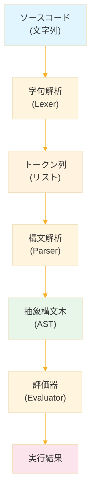
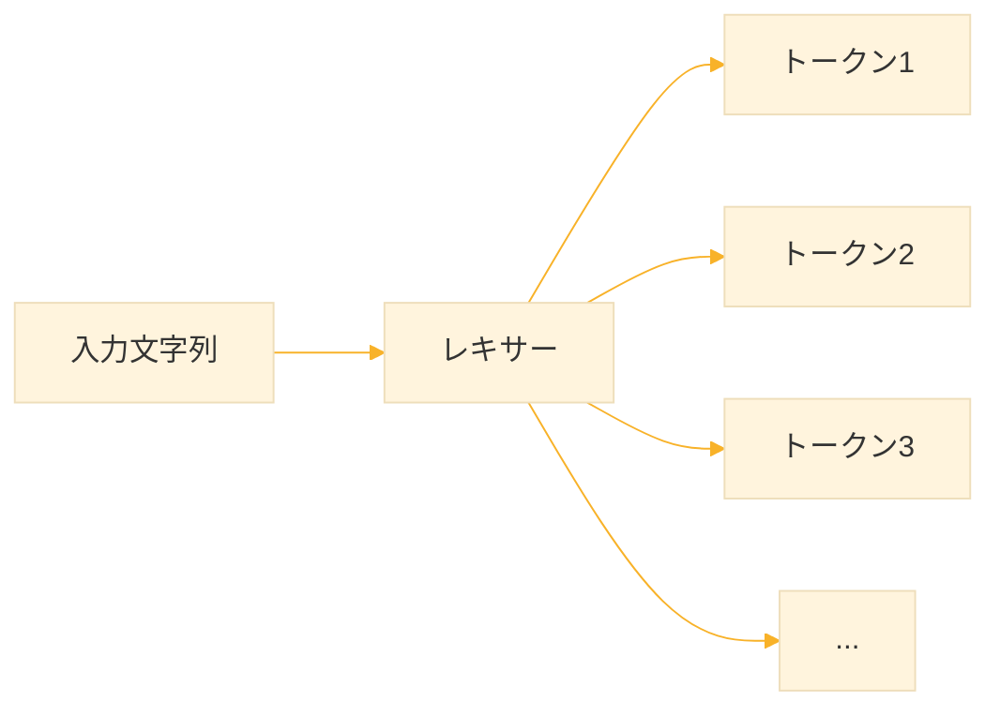
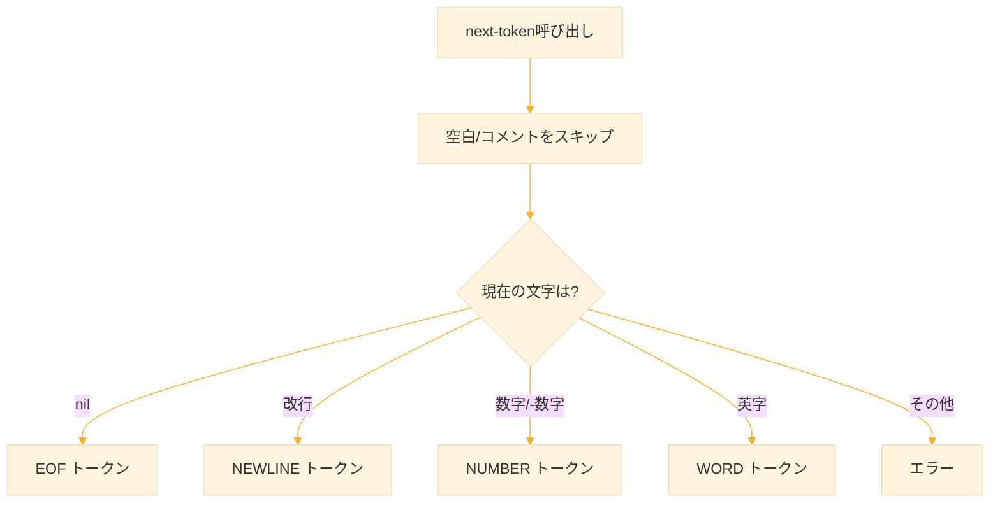
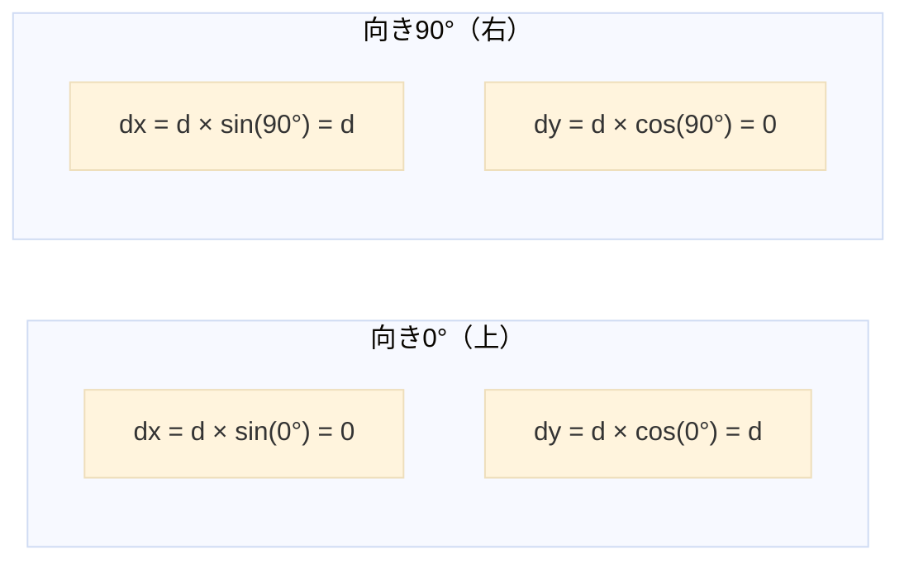
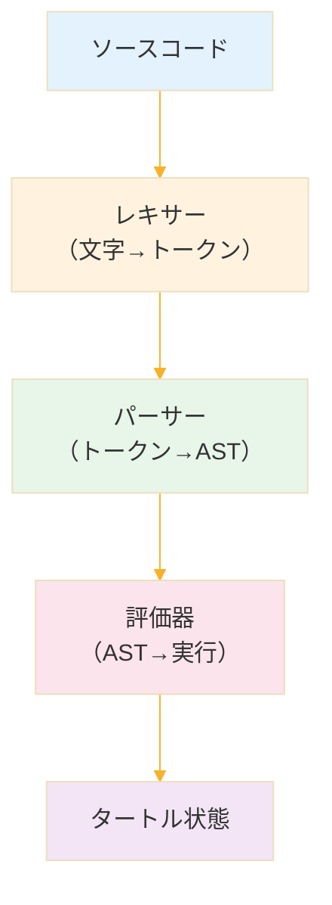

# Level 23-A (タートルグラフィックス言語（前編）)
## Common Lisp 入門 Level 23A：タートルグラフィックス言語（前編）

## はじめに

この演習では、**タートルグラフィックス言語**のインタプリタを作成します。前編では、言語処理系の基礎を学び、基本的なコマンドを実行できるインタプリタを完成させます。

### 前編で作るもの

```logo
forward 100
right 90
forward 50
```

このようなシンプルなプログラムを実行し、SVGファイルとして出力できるインタプリタを作ります。

### 前編の学習目標

1. 言語処理系の全体構造を理解する
2. 字句解析（レキサー）を実装できる
3. 構文解析（パーサー）を実装できる
4. 評価器（インタプリタ）を実装できる
5. タートルの状態管理を理解する


## 1. タートルグラフィックスとは

### 1.1 歴史と背景

タートルグラフィックスは、1967年にシーモア・パパートらが開発した教育用プログラミング言語 **Logo** で導入されました。「亀（タートル）」というキャラクターに命令を与えて図形を描くという直感的な仕組みが特徴です。

> **なぜ「亀」なのか？**
> 初期のLogoでは、床を動き回る物理的なロボット亀が使われていました。このロボットにペンを持たせ、命令に従って動かすことで、子どもたちがプログラミングの概念を学べるようにしたのです。

### 1.2 基本的な考え方

タートルグラフィックスでは、画面上に仮想的な「亀」がいます。この亀に対して「前に進め」「右を向け」などの命令を出します。亀がペンを持っていれば、移動した軌跡が線として残ります。

### 1.3 タートルの状態

タートルは3つの状態を持ちます

| 状態 | 説明 | 初期値 |
|------|------|--------|
| 位置 (x, y) | キャンバス上の座標 | (0, 0) = 中央 |
| 向き | 進行方向の角度（度） | 0° = 上向き |
| ペン | 下りていれば線を描く | 下りている |

### 1.4 座標系と角度

本演習では、以下の座標系を採用します

```
        Y軸（上が正）
          ↑
          │  
          │ 0° (上向き)
          │
    ──────┼──────→ X軸（右が正）
          │
          │
          │
          
角度は時計回りに増加
  0° = 上
 90° = 右
180° = 下
270° = 左
```

**例：forward 100 を実行した場合**

- 向きが 0°（上向き）なら：(0, 0) → (0, 100)
- 向きが 90°（右向き）なら：(0, 0) → (100, 0)
- 向きが 45°（右斜め上）なら：(0, 0) → (70.7, 70.7)


## 2. 言語処理系の構造

### 2.1 処理の流れ

プログラミング言語を実行するには、ソースコードを段階的に処理していきます



### 2.2 各段階の役割

### 字句解析（Lexical Analysis）

ソースコードの文字列を、意味のある最小単位（**トークン**）に分解します。

```
入力: "forward 100"
      ↓
出力: [WORD:"forward"] [NUMBER:100]
```

人間で言えば、文章を「単語」に区切る作業です。

### 構文解析（Parsing）

トークン列を、プログラムの構造を表す木（**抽象構文木 = AST**）に変換します。

```
入力: [WORD:"forward"] [NUMBER:100]
      ↓
出力: (:FORWARD 100)
```

人間で言えば、単語の並びから「文の構造」を理解する作業です。

### 評価（Evaluation）

ASTを走査して、各ノードに対応する処理を実行します。

```
入力: (:FORWARD 100)
      ↓
処理: タートルを100進める
```

人間で言えば、文の意味を理解して「行動」する作業です。

### 2.3 なぜ段階を分けるのか

一度にすべてを処理しようとすると、コードが複雑になります。段階を分けることで

- 各段階の責任が明確になる
- テストがしやすくなる
- 変更の影響範囲が限定される
- 再利用がしやすくなる


## 3. 言語仕様の設計

### 3.1 前編で実装するコマンド

まずはシンプルな基本コマンドのみを実装します

| コマンド | 省略形 | 引数 | 説明 |
|----------|--------|------|------|
| `forward` | `fd` | 距離 | 前進する |
| `back` | `bk` | 距離 | 後退する |
| `right` | `rt` | 角度 | 右に回転する |
| `left` | `lt` | 角度 | 左に回転する |
| `penup` | `pu` | なし | ペンを上げる |
| `pendown` | `pd` | なし | ペンを下ろす |
| `home` | - | なし | 原点に戻る |

### 3.2 プログラム例

```logo
; 正方形を描く（手動版）
forward 100
right 90
forward 100
right 90
forward 100
right 90
forward 100
right 90
```

```logo
; ペンを上げて移動
penup
forward 50
pendown
forward 100
```

### 3.3 構文規則（前編）

前編では、以下のシンプルな構文を扱います

```
プログラム ::= 文*
文         ::= コマンド
コマンド   ::= 移動コマンド 数値
             | ペンコマンド
             | "home"
移動コマンド ::= "forward" | "fd" | "back" | "bk" 
               | "right" | "rt" | "left" | "lt"
ペンコマンド ::= "penup" | "pu" | "pendown" | "pd"
数値       ::= 整数 | 小数
```


## 4. ステップ1：プロジェクトの準備

### 4.1 ファイル構成

学習のため、1つのファイルにすべてを記述します

```
turtle-lang.lisp
```

### 4.2 基本構造

```lisp
;;;; turtle-lang.lisp
;;;; タートルグラフィックス言語インタプリタ

;;; ========================================
;;; 1. トークン定義
;;; ========================================

;;; ========================================
;;; 2. 字句解析器（レキサー）
;;; ========================================

;;; ========================================
;;; 3. 構文解析器（パーサー）
;;; ========================================

;;; ========================================
;;; 4. タートル状態
;;; ========================================

;;; ========================================
;;; 5. 評価器
;;; ========================================

;;; ========================================
;;; 6. メイン処理
;;; ========================================
```

### 4.3 動作確認の方法

各ステップで動作確認ができるよう、テスト関数を用意します。SBCLのREPLで以下のように実行します

```lisp
;; ファイルを読み込む
(load "turtle-lang.lisp")

;; テストを実行
(test-lexer)
(test-parser)
(test-turtle)
```


## 5. ステップ2：トークンの定義

### 5.1 トークンとは

トークンは、ソースコードを構成する最小単位です。例えば

```
"forward 100 right 90"
```

このソースコードは、以下の4つのトークンに分解されます

1. `forward` → 単語（WORD）
2. `100` → 数値（NUMBER）
3. `right` → 単語（WORD）
4. `90` → 数値（NUMBER）

### 5.2 トークンの種類

前編で扱うトークンの種類

| 種類 | 説明 | 例 |
|------|------|-----|
| `:word` | 単語（コマンド名） | `forward`, `right` |
| `:number` | 数値 | `100`, `3.14`, `-50` |
| `:newline` | 改行 | |
| `:eof` | ファイル終端 | |

### 5.3 トークン構造体の定義

```lisp
;;; ========================================
;;; 1. トークン定義
;;; ========================================

;;; トークン構造体
;;; type: トークンの種類を表すキーワード
;;; value: トークンの値（数値や文字列）
(defstruct token
  type    ; :word, :number, :newline, :eof
  value)  ; トークンの値
```

**解説**

- `defstruct` は構造体を定義するマクロです
- `token-type` と `token-value` というアクセサが自動生成されます
- `make-token` というコンストラクタも自動生成されます

### 5.4 トークンの作成例

```lisp
;; トークンを作成する例
(make-token :type :word :value "forward")
;; => #S(TOKEN :TYPE :WORD :VALUE "forward")

(make-token :type :number :value 100)
;; => #S(TOKEN :TYPE :NUMBER :VALUE 100)

;; トークンの値を取得
(token-value (make-token :type :number :value 100))
;; => 100
```


## 6. ステップ3：レキサーの骨格

### 6.1 レキサーの役割

レキサー（字句解析器）は、入力文字列を1文字ずつ読み進めながら、トークンを生成します。



### 6.2 レキサー構造体

```lisp
;;; ========================================
;;; 2. 字句解析器（レキサー）
;;; ========================================

;;; レキサー構造体
;;; input: 入力文字列全体
;;; pos: 現在読んでいる位置（0から始まる）
;;; len: 入力文字列の長さ
(defstruct lexer
  input       ; 入力文字列
  (pos 0)     ; 現在位置
  len)        ; 入力の長さ

;;; 文字列からレキサーを作成する
(defun make-lexer-from-string (input)
  (make-lexer :input input
              :pos 0
              :len (length input)))
```

**解説**

- `input` に入力文字列全体を保持
- `pos` で「今どこまで読んだか」を追跡
- `len` は毎回計算しなくて済むよう、事前に保存

### 6.3 基本操作関数

```lisp
;;; 現在の文字を取得する（範囲外ならnilを返す）
(defun current-char (lexer)
  (when (< (lexer-pos lexer) (lexer-len lexer))
    (char (lexer-input lexer) (lexer-pos lexer))))

;;; 位置を1つ進める
(defun advance (lexer)
  (incf (lexer-pos lexer)))

;;; 現在位置から先を覗き見る（n文字先、デフォルトは1）
(defun peek-char-at (lexer &optional (offset 1))
  (let ((pos (+ (lexer-pos lexer) offset)))
    (when (< pos (lexer-len lexer))
      (char (lexer-input lexer) pos))))
```

**解説**

- `current-char`: 今読んでいる位置の文字を返す
- `advance`: 次の文字に進む
- `peek-char-at`: 先読み（今の位置を変えずに先の文字を見る）

### 6.4 動作確認

```lisp
;; 動作確認
(let ((lex (make-lexer-from-string "abc")))
  (format t "1文字目: ~A~%" (current-char lex))  ; => a
  (advance lex)
  (format t "2文字目: ~A~%" (current-char lex))  ; => b
  (advance lex)
  (format t "3文字目: ~A~%" (current-char lex))  ; => c
  (advance lex)
  (format t "終端: ~A~%" (current-char lex)))    ; => NIL
```


## 7. ステップ4：空白とコメントのスキップ

### 7.1 なぜスキップが必要か

ソースコードには、プログラムの意味に影響しない文字が含まれます

- 空白（スペース、タブ）：トークンの区切り
- コメント（`;` から行末まで）：人間のためのメモ

これらは読み飛ばす必要があります。

### 7.2 空白のスキップ

```lisp
;;; 空白文字かどうか判定する
;;; 注意：改行は空白に含めない（改行は別のトークンとして扱う）
(defun whitespace-p (char)
  (member char '(#\Space #\Tab)))

;;; 空白をスキップする
(defun skip-whitespace (lexer)
  (loop while (and (current-char lexer)
                   (whitespace-p (current-char lexer)))
        do (advance lexer)))
```

**解説**

- `#\Space` はスペース文字のリテラル
- `#\Tab` はタブ文字のリテラル
- `loop while ... do ...` は条件が真の間繰り返す

### 7.3 コメントのスキップ

```lisp
;;; コメントをスキップする
;;; セミコロン(;)から行末までがコメント
(defun skip-comment (lexer)
  (when (eql (current-char lexer) #\;)
    (loop while (and (current-char lexer)
                     (not (eql (current-char lexer) #\Newline)))
          do (advance lexer))))
```

**解説**

- `;` を見つけたら、改行が来るまで読み飛ばす
- 改行自体は読み飛ばさない（改行トークンとして処理するため）

### 7.4 まとめてスキップ

```lisp
;;; 空白とコメントをまとめてスキップする
(defun skip-whitespace-and-comments (lexer)
  (loop
    (skip-whitespace lexer)
    (if (eql (current-char lexer) #\;)
        (skip-comment lexer)
        (return))))
```

### 7.5 動作確認

```lisp
;; 動作確認
(let ((lex (make-lexer-from-string "   ; comment
forward")))
  (skip-whitespace-and-comments lex)
  (format t "スキップ後: ~A~%" (current-char lex)))  ; => #\Newline
```


## 8. ステップ5：数値の読み取り

### 8.1 数値の形式

この言語では、以下の形式の数値を扱います

- 整数：`100`, `42`, `0`
- 負の整数：`-50`, `-1`
- 小数：`3.14`, `0.5`
- 負の小数：`-2.5`

### 8.2 数値を読み取る関数

```lisp
;;; 数値を読み取る
;;; 整数または浮動小数点数を返す
(defun read-number (lexer)
  (let ((start (lexer-pos lexer))  ; 開始位置を記録
        (has-dot nil))              ; 小数点があったか
    
    ;; 1. 負号があれば読み飛ばす
    (when (eql (current-char lexer) #\-)
      (advance lexer))
    
    ;; 2. 数字と小数点を読む
    (loop while (and (current-char lexer)
                     (or (digit-char-p (current-char lexer))
                         (and (eql (current-char lexer) #\.)
                              (not has-dot))))  ; 小数点は1回だけ
          do (when (eql (current-char lexer) #\.)
               (setf has-dot t))
             (advance lexer))
    
    ;; 3. 部分文字列を切り出して数値に変換
    (let ((str (subseq (lexer-input lexer) start (lexer-pos lexer))))
      (if has-dot
          (read-from-string str)   ; 浮動小数点数
          (parse-integer str)))))  ; 整数
```

**解説**

- `digit-char-p`: 文字が数字（0-9）かどうか判定
- `subseq`: 部分文字列を取得
- `parse-integer`: 文字列を整数に変換
- `read-from-string`: 文字列をLispオブジェクトに変換

### 8.3 処理の流れ

```
入力: "-123.45"

ステップ1: 負号を読む
  pos: 0 → 1
  
ステップ2: 数字を読む
  pos: 1 → 2 → 3 → 4（"123"を読んだ）
  
ステップ3: 小数点を読む
  pos: 4 → 5
  has-dot: true
  
ステップ4: 残りの数字を読む
  pos: 5 → 6 → 7（"45"を読んだ）
  
ステップ5: 文字列を切り出して変換
  "-123.45" → -123.45
```

### 8.4 動作確認

```lisp
;; 動作確認
(let ((lex (make-lexer-from-string "123")))
  (format t "整数: ~A~%" (read-number lex)))  ; => 123

(let ((lex (make-lexer-from-string "-45.67")))
  (format t "負の小数: ~A~%" (read-number lex)))  ; => -45.67
```


## 9. ステップ6：単語の読み取り

### 9.1 単語の形式

コマンド名（`forward`, `right` など）は「単語」として読み取ります。単語は以下の文字で構成されます

- 英字（a-z, A-Z）
- 数字（0-9）
- ハイフン（-）
- アンダースコア（_）

### 9.2 単語を読み取る関数

```lisp
;;; 単語を読み取る
;;; 英数字、ハイフン、アンダースコアで構成される文字列を返す
(defun read-word (lexer)
  (let ((start (lexer-pos lexer)))
    ;; 単語を構成する文字が続く限り読む
    (loop while (and (current-char lexer)
                     (or (alphanumericp (current-char lexer))
                         (member (current-char lexer) '(#\- #\_))))
          do (advance lexer))
    ;; 部分文字列を返す
    (subseq (lexer-input lexer) start (lexer-pos lexer))))
```

**解説**

- `alphanumericp`: 英数字かどうか判定
- `member`: リストに要素が含まれるか判定

### 9.3 動作確認

```lisp
;; 動作確認
(let ((lex (make-lexer-from-string "forward 100")))
  (format t "単語: ~A~%" (read-word lex)))  ; => "forward"

(let ((lex (make-lexer-from-string "pen-down")))
  (format t "ハイフン付き: ~A~%" (read-word lex)))  ; => "pen-down"
```


## 10. ステップ7：トークン生成の統合

### 10.1 next-token 関数

これまで作った部品を組み合わせて、次のトークンを取得する関数を作ります。

```lisp
;;; 次のトークンを取得する
(defun next-token (lexer)
  ;; 1. 空白とコメントをスキップ
  (skip-whitespace-and-comments lexer)
  
  (let ((char (current-char lexer)))
    (cond
      ;; 2. ファイル終端
      ((null char)
       (make-token :type :eof :value nil))
      
      ;; 3. 改行
      ((eql char #\Newline)
       (advance lexer)
       (make-token :type :newline :value nil))
      
      ;; 4. 数値（数字または負号で始まる）
      ((or (digit-char-p char)
           (and (eql char #\-)
                (peek-char-at lexer 1)
                (digit-char-p (peek-char-at lexer 1))))
       (make-token :type :number :value (read-number lexer)))
      
      ;; 5. 単語（英字で始まる）
      ((alpha-char-p char)
       (make-token :type :word :value (read-word lexer)))
      
      ;; 6. 不明な文字
      (t
       (error "予期しない文字: ~A (位置: ~A)" 
              char (lexer-pos lexer))))))
```

**解説**

- `cond` は複数の条件分岐を行う
- 数値の判定では、`-` の次が数字かどうかも確認（`-50` と `-abc` を区別）
- `alpha-char-p` は英字かどうか判定

### 10.2 処理の流れ



### 10.3 動作確認

```lisp
;; 動作確認用関数
(defun test-next-token ()
  (let ((lex (make-lexer-from-string "forward 100")))
    (format t "Token 1: ~A~%" (next-token lex))
    (format t "Token 2: ~A~%" (next-token lex))
    (format t "Token 3: ~A~%" (next-token lex))))

;; 実行結果
;; Token 1: #S(TOKEN :TYPE :WORD :VALUE "forward")
;; Token 2: #S(TOKEN :TYPE :NUMBER :VALUE 100)
;; Token 3: #S(TOKEN :TYPE :EOF :VALUE NIL)
```


## 11. ステップ8：全トークンの取得

### 11.1 tokenize 関数

ソースコード全体をトークン列に変換する関数を作ります。

```lisp
;;; 入力文字列をすべてトークン化する
(defun tokenize (input)
  (let ((lexer (make-lexer-from-string input))
        (tokens '()))
    ;; EOFが来るまでトークンを収集
    (loop for token = (next-token lexer)
          do (push token tokens)
          until (eq (token-type token) :eof))
    ;; リストを逆順にして返す（pushで逆順になるため）
    (nreverse tokens)))
```

**解説**

- `push` はリストの先頭に要素を追加（高速だが逆順になる）
- `nreverse` はリストを破壊的に逆順にする

### 11.2 レキサーのテスト

```lisp
;;; レキサーのテスト関数
(defun test-lexer ()
  (format t "~%=== レキサーのテスト ===~%")
  
  ;; テスト1: 基本的なコマンド
  (format t "~%テスト1: forward 100~%")
  (dolist (tok (tokenize "forward 100"))
    (format t "  ~A: ~A~%" (token-type tok) (token-value tok)))
  
  ;; テスト2: 複数行
  (format t "~%テスト2: 複数行~%")
  (dolist (tok (tokenize "forward 100 right 90"))
    (format t "  ~A: ~A~%" (token-type tok) (token-value tok)))
  
  ;; テスト3: コメント付き
  (format t "~%テスト3: コメント付き~%")
  (dolist (tok (tokenize "; 正方形を描く
forward 100  ; 前進"))
    (format t "  ~A: ~A~%" (token-type tok) (token-value tok)))
  
  ;; テスト4: 省略形
  (format t "~%テスト4: 省略形~%")
  (dolist (tok (tokenize "fd 50 rt 90 bk 25"))
    (format t "  ~A: ~A~%" (token-type tok) (token-value tok))))
```

### 11.3 実行結果

```
=== レキサーのテスト ===

テスト1: forward 100
  WORD: forward
  NUMBER: 100
  EOF: NIL

テスト2: 複数行
  WORD: forward
  NUMBER: 100
  NEWLINE: NIL
  WORD: right
  NUMBER: 90
  EOF: NIL

テスト3: コメント付き
  NEWLINE: NIL
  WORD: forward
  NUMBER: 100
  EOF: NIL

テスト4: 省略形
  WORD: fd
  NUMBER: 50
  WORD: rt
  NUMBER: 90
  WORD: bk
  NUMBER: 25
  EOF: NIL
```


## 12. ステップ9：パーサーの骨格

### 12.1 パーサーの役割

パーサー（構文解析器）は、トークン列を抽象構文木（AST）に変換します。

```
トークン列: [WORD:"forward"] [NUMBER:100]
     ↓
AST: (:FORWARD 100)
```

### 12.2 抽象構文木（AST）とは

ASTは、プログラムの構造を木で表現したものです。本演習ではS式で表現します。

| コマンド | AST表現 |
|---------|---------|
| `forward 100` | `(:FORWARD 100)` |
| `right 90` | `(:RIGHT 90)` |
| `penup` | `(:PENUP)` |

### 12.3 パーサー構造体

```lisp
;;; ========================================
;;; 3. 構文解析器（パーサー）
;;; ========================================

;;; パーサー構造体
;;; tokens: トークンのリスト
;;; pos: 現在読んでいる位置
(defstruct parser
  tokens      ; トークンのリスト
  (pos 0))    ; 現在位置
```

### 12.4 基本操作関数

```lisp
;;; 現在のトークンを取得する
(defun current-token (parser)
  (nth (parser-pos parser) (parser-tokens parser)))

;;; トークンを1つ消費して返す
(defun consume (parser)
  (prog1 (current-token parser)
    (incf (parser-pos parser))))

;;; 現在のトークンが指定した型か確認する
(defun check-token (parser type)
  (eq (token-type (current-token parser)) type))

;;; 指定した型のトークンを期待して消費する（違えばエラー）
(defun expect (parser type)
  (if (check-token parser type)
      (consume parser)
      (error "期待されるトークン: ~A, 実際: ~A"
             type (token-type (current-token parser)))))

;;; 改行トークンをスキップする
(defun skip-newlines (parser)
  (loop while (check-token parser :newline)
        do (consume parser)))
```

**解説**

- `nth`: リストのn番目の要素を取得
- `prog1`: 最初の式の値を返し、残りの式も実行
- `incf`: 変数の値を1増やす


## 13. ステップ10：コマンド名の正規化

### 13.1 なぜ正規化が必要か

タートル言語では、コマンドに省略形があります

- `forward` = `fd`
- `back` = `bk`
- `right` = `rt`
- `left` = `lt`
- `penup` = `pu`
- `pendown` = `pd`

これらを統一した形式に変換（正規化）することで、後の処理が簡単になります。

### 13.2 正規化関数

```lisp
;;; コマンド名を正規化する（省略形を展開）
(defun normalize-command (name)
  (let ((cmd (string-downcase name)))  ; 小文字に統一
    (cond
      ;; 移動コマンド
      ((member cmd '("forward" "fd") :test #'string=) "forward")
      ((member cmd '("back" "bk") :test #'string=) "back")
      ((member cmd '("right" "rt") :test #'string=) "right")
      ((member cmd '("left" "lt") :test #'string=) "left")
      ;; ペンコマンド
      ((member cmd '("penup" "pu") :test #'string=) "penup")
      ((member cmd '("pendown" "pd") :test #'string=) "pendown")
      ;; その他
      ((string= cmd "home") "home")
      ;; 未知のコマンド（そのまま返す）
      (t cmd))))
```

**解説**

- `string-downcase`: 文字列を小文字に変換
- `member`: リストに要素が含まれるか確認（`:test` で比較関数を指定）
- `string=`: 文字列の比較

### 13.3 動作確認

```lisp
;; 動作確認
(normalize-command "FORWARD")  ; => "forward"
(normalize-command "fd")       ; => "forward"
(normalize-command "RT")       ; => "right"
(normalize-command "pu")       ; => "penup"
```


## 14. ステップ11：文のパース

### 14.1 文の構造

前編で扱う文は、以下の3種類です

1. **移動コマンド**：コマンド名 + 数値（例：`forward 100`）
2. **ペンコマンド**：コマンド名のみ（例：`penup`）
3. **ホームコマンド**：`home`

### 14.2 文をパースする関数

```lisp
;;; 文をパースする
(defun parse-statement (parser)
  ;; 改行をスキップ
  (skip-newlines parser)
  
  ;; 単語（コマンド名）が必要
  (unless (check-token parser :word)
    (error "コマンドが必要です: ~A" (current-token parser)))
  
  ;; コマンド名を取得して正規化
  (let* ((word (token-value (current-token parser)))
         (cmd (normalize-command word)))
    (consume parser)  ; コマンド名を消費
    
    (cond
      ;; 移動コマンド（引数が1つ必要）
      ((member cmd '("forward" "back" "right" "left") :test #'string=)
       (let ((arg (token-value (expect parser :number))))
         ;; キーワードシンボルに変換してリストを作る
         (list (intern (string-upcase cmd) :keyword) arg)))
      
      ;; ペンコマンド（引数なし）
      ((string= cmd "penup")
       '(:PENUP))
      
      ((string= cmd "pendown")
       '(:PENDOWN))
      
      ;; ホームコマンド
      ((string= cmd "home")
       '(:HOME))
      
      ;; 未知のコマンド
      (t
       (error "未知のコマンド: ~A" cmd)))))
```

**解説**

- `let*`: 順番に変数を束縛（前の変数を後の変数で参照可能）
- `intern`: 文字列をシンボルに変換
- `:keyword` パッケージに登録するとキーワードシンボルになる

### 14.3 パースの流れ

```
入力トークン: [WORD:"fd"] [NUMBER:100]

1. "fd" を読む
2. normalize-command で "forward" に変換
3. 移動コマンドと判定
4. 次のトークン（NUMBER:100）を期待して読む
5. (:FORWARD 100) を返す
```


## 15. ステップ12：プログラム全体のパース

### 15.1 プログラムの構造

プログラムは、複数の文が並んだものです

```logo
forward 100
right 90
forward 50
```

これをパースすると

```lisp
((:FORWARD 100) (:RIGHT 90) (:FORWARD 50))
```

### 15.2 プログラムをパースする関数

```lisp
;;; プログラム全体をパースする
(defun parse-program (parser)
  (let ((statements '()))
    ;; EOFが来るまで文をパース
    (loop until (check-token parser :eof)
          do (skip-newlines parser)
             (unless (check-token parser :eof)
               (push (parse-statement parser) statements))
             (skip-newlines parser))
    ;; リストを逆順にして返す
    (nreverse statements)))

;;; 文字列からASTを生成する（メイン関数）
(defun parse (input)
  (let* ((tokens (tokenize input))
         (parser (make-parser :tokens tokens)))
    (parse-program parser)))
```

### 15.3 パーサーのテスト

```lisp
;;; パーサーのテスト関数
(defun test-parser ()
  (format t "~%=== パーサーのテスト ===~%")
  
  ;; テスト1: 単一コマンド
  (format t "~%テスト1: forward 100~%")
  (format t "  AST: ~A~%" (parse "forward 100"))
  
  ;; テスト2: 複数コマンド
  (format t "~%テスト2: 複数コマンド~%")
  (format t "  AST: ~A~%" (parse "fd 100
rt 90
fd 50"))
  
  ;; テスト3: ペンコマンド
  (format t "~%テスト3: ペンコマンド~%")
  (format t "  AST: ~A~%" (parse "penup
forward 50
pd
forward 100"))
  
  ;; テスト4: 正方形
  (format t "~%テスト4: 正方形~%")
  (format t "  AST: ~A~%" (parse "fd 100 rt 90 fd 100 rt 90 fd 100 rt 90 fd 100 rt 90")))
```

### 15.4 実行結果

```
=== パーサーのテスト ===

テスト1: forward 100
  AST: ((:FORWARD 100))

テスト2: 複数コマンド
  AST: ((:FORWARD 100) (:RIGHT 90) (:FORWARD 50))

テスト3: ペンコマンド
  AST: ((:PENUP) (:FORWARD 50) (:PENDOWN) (:FORWARD 100))

テスト4: 正方形
  AST: ((:FORWARD 100) (:RIGHT 90) (:FORWARD 100) (:RIGHT 90) 
        (:FORWARD 100) (:RIGHT 90) (:FORWARD 100) (:RIGHT 90))
```


## 16. ステップ13：タートル状態の定義

### 16.1 タートルの状態

タートルは以下の情報を保持します

```lisp
;;; ========================================
;;; 4. タートル状態
;;; ========================================

;;; タートル構造体
(defstruct turtle
  (x 0.0)           ; X座標（中央が0）
  (y 0.0)           ; Y座標（中央が0）
  (angle 0.0)       ; 向き（度、上が0、時計回り）
  (pen-down t)      ; ペンが下りているか
  (lines '()))      ; 描いた線のリスト

;;; 線分構造体
(defstruct line-segment
  x1 y1   ; 始点
  x2 y2)  ; 終点
```

### 16.2 初期状態

```
位置: (0, 0) = キャンバス中央
向き: 0° = 上向き
ペン: 下りている = 線を描く
線: 空リスト
```

### 16.3 線の記録

タートルが移動するとき、ペンが下りていれば線を記録します

```lisp
;; 例：(0,0) から (100,0) への移動で線が追加される
(push (make-line-segment :x1 0 :y1 0 :x2 100 :y2 0)
      (turtle-lines turtle))
```


## 17. ステップ14：角度と移動の計算

### 17.1 角度の単位変換

Common Lisp の三角関数はラジアンを使うため、度からラジアンに変換する必要があります。

```lisp
;;; 度をラジアンに変換する
(defun deg-to-rad (degrees)
  (* degrees (/ pi 180.0)))
```

**公式** ラジアン = 度 × (π / 180)

### 17.2 移動量の計算

向きが θ 度のとき、距離 d だけ進むと

- X方向の移動量 = d × sin(θ)
- Y方向の移動量 = d × cos(θ)

> **なぜ sin と cos の役割が逆なのか？**
> 通常の数学では、X軸方向（右）が 0° ですが、タートルグラフィックスでは Y軸方向（上）が 0° だからです。



### 17.3 前進の実装

```lisp
;;; タートルを前進させる
(defun turtle-forward (turtle distance)
  (let* ((rad (deg-to-rad (turtle-angle turtle)))
         ;; 移動量を計算
         (dx (* distance (sin rad)))
         (dy (* distance (cos rad)))
         ;; 現在位置
         (old-x (turtle-x turtle))
         (old-y (turtle-y turtle))
         ;; 新しい位置
         (new-x (+ old-x dx))
         (new-y (+ old-y dy)))
    
    ;; ペンが下りていれば線を記録
    (when (turtle-pen-down turtle)
      (push (make-line-segment :x1 old-x :y1 old-y
                               :x2 new-x :y2 new-y)
            (turtle-lines turtle)))
    
    ;; 位置を更新
    (setf (turtle-x turtle) new-x
          (turtle-y turtle) new-y)))
```

### 17.4 その他の移動・回転

```lisp
;;; タートルを後退させる
(defun turtle-back (turtle distance)
  ;; 後退 = 負の距離で前進
  (turtle-forward turtle (- distance)))

;;; タートルを右に回転させる
(defun turtle-right (turtle degrees)
  ;; 角度を更新（0〜360の範囲に正規化）
  (setf (turtle-angle turtle)
        (mod (+ (turtle-angle turtle) degrees) 360.0)))

;;; タートルを左に回転させる
(defun turtle-left (turtle degrees)
  ;; 左回転 = 負の角度で右回転
  (turtle-right turtle (- degrees)))

;;; ペンを上げる
(defun turtle-penup (turtle)
  (setf (turtle-pen-down turtle) nil))

;;; ペンを下ろす
(defun turtle-pendown (turtle)
  (setf (turtle-pen-down turtle) t))

;;; ホーム位置に戻る（線は描かない）
(defun turtle-home (turtle)
  (setf (turtle-x turtle) 0.0
        (turtle-y turtle) 0.0
        (turtle-angle turtle) 0.0))
```


## 18. ステップ15：タートルのテスト

### 18.1 テスト関数

```lisp
;;; タートルのテスト関数
(defun test-turtle ()
  (format t "~%=== タートルのテスト ===~%")
  
  (let ((turtle (make-turtle)))
    ;; 初期状態
    (format t "~%初期状態:~%")
    (format t "  位置: (~,1F, ~,1F)~%" (turtle-x turtle) (turtle-y turtle))
    (format t "  向き: ~,1F°~%" (turtle-angle turtle))
    
    ;; forward 100
    (turtle-forward turtle 100)
    (format t "~%forward 100 後:~%")
    (format t "  位置: (~,1F, ~,1F)~%" (turtle-x turtle) (turtle-y turtle))
    
    ;; right 90
    (turtle-right turtle 90)
    (format t "~%right 90 後:~%")
    (format t "  向き: ~,1F°~%" (turtle-angle turtle))
    
    ;; forward 50
    (turtle-forward turtle 50)
    (format t "~%forward 50 後:~%")
    (format t "  位置: (~,1F, ~,1F)~%" (turtle-x turtle) (turtle-y turtle))
    
    ;; 描いた線
    (format t "~%描いた線: ~A本~%" (length (turtle-lines turtle)))
    (dolist (line (reverse (turtle-lines turtle)))
      (format t "  (~,1F,~,1F) → (~,1F,~,1F)~%"
              (line-segment-x1 line) (line-segment-y1 line)
              (line-segment-x2 line) (line-segment-y2 line)))))
```

### 18.2 実行結果

```
=== タートルのテスト ===

初期状態:
  位置: (0.0, 0.0)
  向き: 0.0°

forward 100 後:
  位置: (0.0, 100.0)

right 90 後:
  向き: 90.0°

forward 50 後:
  位置: (50.0, 100.0)

描いた線: 2本
  (0.0,0.0) → (0.0,100.0)
  (0.0,100.0) → (50.0,100.0)
```


## 19. ステップ16：評価器の実装

### 19.1 評価器の役割

評価器は、ASTの各ノードを実行します。

```
AST: (:FORWARD 100)
  ↓
処理: turtle-forward を呼び出す
```

### 19.2 評価器の実装

```lisp
;;; ========================================
;;; 5. 評価器
;;; ========================================

;;; 文を評価する
(defun eval-statement (stmt turtle)
  (case (first stmt)
    ;; 移動コマンド
    (:FORWARD
     (turtle-forward turtle (second stmt)))
    
    (:BACK
     (turtle-back turtle (second stmt)))
    
    (:RIGHT
     (turtle-right turtle (second stmt)))
    
    (:LEFT
     (turtle-left turtle (second stmt)))
    
    ;; ペンコマンド
    (:PENUP
     (turtle-penup turtle))
    
    (:PENDOWN
     (turtle-pendown turtle))
    
    ;; ホームコマンド
    (:HOME
     (turtle-home turtle))
    
    ;; 未知の文
    (otherwise
     (error "未知の文: ~A" stmt))))

;;; プログラム全体を評価する
(defun eval-program (program turtle)
  (dolist (stmt program)
    (eval-statement stmt turtle)))
```

**解説**

- `case`: 値によって分岐（switch文に相当）
- `first`, `second`: リストの1番目、2番目の要素を取得
- `dolist`: リストの各要素に対してループ

### 19.3 実行関数

```lisp
;;; ソースコードを実行してタートルを返す
(defun run (source)
  (let* ((ast (parse source))
         (turtle (make-turtle)))
    (eval-program ast turtle)
    turtle))
```


## 20. ステップ17：統合テスト

### 20.1 テスト関数

```lisp
;;; 統合テスト関数
(defun test-integration ()
  (format t "~%=== 統合テスト ===~%")
  
  ;; テスト1: L字
  (format t "~%テスト1: L字~%")
  (let ((turtle (run "forward 100 right 90 forward 50")))
    (format t "  最終位置: (~,1F, ~,1F)~%"
            (turtle-x turtle) (turtle-y turtle))
    (format t "  線の数: ~A~%" (length (turtle-lines turtle))))
  
  ;; テスト2: 正方形（手動）
  (format t "~%テスト2: 正方形~%")
  (let ((turtle (run "
fd 100 rt 90
fd 100 rt 90
fd 100 rt 90
fd 100 rt 90
")))
    (format t "  最終位置: (~,1F, ~,1F)~%"
            (turtle-x turtle) (turtle-y turtle))
    (format t "  線の数: ~A~%" (length (turtle-lines turtle))))
  
  ;; テスト3: ペン操作
  (format t "~%テスト3: ペン操作~%")
  (let ((turtle (run "
forward 50
penup
forward 50
pendown
forward 50
")))
    (format t "  最終位置: (~,1F, ~,1F)~%"
            (turtle-x turtle) (turtle-y turtle))
    (format t "  線の数: ~A（ペンを上げた区間は描かれない）~%"
            (length (turtle-lines turtle)))))
```

### 20.2 実行結果

```
=== 統合テスト ===

テスト1: L字
  最終位置: (50.0, 100.0)
  線の数: 2

テスト2: 正方形
  最終位置: (0.0, 0.0)
  線の数: 4

テスト3: ペン操作
  最終位置: (0.0, 150.0)
  線の数: 2（ペンを上げた区間は描かれない）
```


## 21. ステップ18：簡易テキスト出力

### 21.1 なぜテキスト出力か

SVG出力は後編で扱いますが、今の段階でも結果を確認したいです。まずは簡易的なテキスト出力を実装します。

### 21.2 ASCII アート風出力

```lisp
;;; ========================================
;;; 6. 出力（簡易版）
;;; ========================================

;;; -0.0 や極小値を 0.0 に正規化する（浮動小数点の表示用）
(defun normalize-zero (x)
  (if (< (abs x) 1.0d-10) 0.0 x))

;;; 線の情報をテキストで出力する
(defun print-lines (turtle)
  (format t "~%=== 描画結果 ===~%")
  (format t "線の数: ~A~%" (length (turtle-lines turtle)))
  (format t "~%線分一覧:~%")
  (let ((i 1))
    (dolist (line (reverse (turtle-lines turtle)))
      (format t "  ~A: (~,1F, ~,1F) → (~,1F, ~,1F)~%"
              i
              (normalize-zero (line-segment-x1 line))
              (normalize-zero (line-segment-y1 line))
              (normalize-zero (line-segment-x2 line))
              (normalize-zero (line-segment-y2 line)))
      (incf i))))

;;; 実行して結果を表示する
(defun run-and-print (source)
  (let ((turtle (run source)))
    (print-lines turtle)
    turtle))
```

- `normalize-zero` 関数は、極小値（絶対値が `1e-10` 未満）を `0.0` に変換します
- 浮動小数点の計算では、数学的に0でも `sin(360°) = -2.45e-16` のような極小値になることがあります
- これを放置すると `-0.0` として表示されるため、しきい値以下の値は 0 に丸めます

### 21.3 使用例

```lisp
CL-USER> (run-and-print "fd 100 rt 90 fd 100 rt 90 fd 100 rt 90 fd 100")

=== 描画結果 ===
線の数: 4

線分一覧:
  1: (0.0, 0.0) → (0.0, 100.0)
  2: (0.0, 100.0) → (100.0, 100.0)
  3: (100.0, 100.0) → (100.0, 0.0)
  4: (100.0, 0.0) → (0.0, 0.0)
```

> **補足**：浮動小数点の計算では、`sin(360°)` のような値が完全な 0 にならず、`-2.45e-16` のような極小値になることがあります。`normalize-zero` 関数はこのような値を `0.0` として表示します。

## 22. 前編の完成コード

すべてをまとめた前編の完成コードです。

```lisp
;;;; turtle-lang-part-a.lisp
;;;; タートルグラフィックス言語インタプリタ（前編）

;;; ========================================
;;; 1. トークン定義
;;; ========================================

(defstruct token
  type    ; :word, :number, :newline, :eof
  value)

;;; ========================================
;;; 2. 字句解析器（レキサー）
;;; ========================================

(defstruct lexer
  input
  (pos 0)
  len)

(defun make-lexer-from-string (input)
  (make-lexer :input input :pos 0 :len (length input)))

(defun current-char (lexer)
  (when (< (lexer-pos lexer) (lexer-len lexer))
    (char (lexer-input lexer) (lexer-pos lexer))))

(defun advance (lexer)
  (incf (lexer-pos lexer)))

(defun peek-char-at (lexer &optional (offset 1))
  (let ((pos (+ (lexer-pos lexer) offset)))
    (when (< pos (lexer-len lexer))
      (char (lexer-input lexer) pos))))

(defun whitespace-p (char)
  (member char '(#\Space #\Tab)))

(defun skip-whitespace (lexer)
  (loop while (and (current-char lexer)
                   (whitespace-p (current-char lexer)))
        do (advance lexer)))

(defun skip-comment (lexer)
  (when (eql (current-char lexer) #\;)
    (loop while (and (current-char lexer)
                     (not (eql (current-char lexer) #\Newline)))
          do (advance lexer))))

(defun skip-whitespace-and-comments (lexer)
  (loop
    (skip-whitespace lexer)
    (if (eql (current-char lexer) #\;)
        (skip-comment lexer)
        (return))))

(defun read-number (lexer)
  (let ((start (lexer-pos lexer))
        (has-dot nil))
    (when (eql (current-char lexer) #\-)
      (advance lexer))
    (loop while (and (current-char lexer)
                     (or (digit-char-p (current-char lexer))
                         (and (eql (current-char lexer) #\.)
                              (not has-dot))))
          do (when (eql (current-char lexer) #\.)
               (setf has-dot t))
             (advance lexer))
    (let ((str (subseq (lexer-input lexer) start (lexer-pos lexer))))
      (if has-dot
          (read-from-string str)
          (parse-integer str)))))

(defun read-word (lexer)
  (let ((start (lexer-pos lexer)))
    (loop while (and (current-char lexer)
                     (or (alphanumericp (current-char lexer))
                         (member (current-char lexer) '(#\- #\_))))
          do (advance lexer))
    (subseq (lexer-input lexer) start (lexer-pos lexer))))

(defun next-token (lexer)
  (skip-whitespace-and-comments lexer)
  (let ((char (current-char lexer)))
    (cond
      ((null char)
       (make-token :type :eof :value nil))
      ((eql char #\Newline)
       (advance lexer)
       (make-token :type :newline :value nil))
      ((or (digit-char-p char)
           (and (eql char #\-)
                (peek-char-at lexer 1)
                (digit-char-p (peek-char-at lexer 1))))
       (make-token :type :number :value (read-number lexer)))
      ((alpha-char-p char)
       (make-token :type :word :value (read-word lexer)))
      (t
       (error "予期しない文字: ~A" char)))))

(defun tokenize (input)
  (let ((lexer (make-lexer-from-string input))
        (tokens '()))
    (loop for token = (next-token lexer)
          do (push token tokens)
          until (eq (token-type token) :eof))
    (nreverse tokens)))

;;; ========================================
;;; 3. 構文解析器（パーサー）
;;; ========================================

(defstruct parser
  tokens
  (pos 0))

(defun current-token (parser)
  (nth (parser-pos parser) (parser-tokens parser)))

(defun consume (parser)
  (prog1 (current-token parser)
    (incf (parser-pos parser))))

(defun check-token (parser type)
  (eq (token-type (current-token parser)) type))

(defun expect (parser type)
  (if (check-token parser type)
      (consume parser)
      (error "期待: ~A, 実際: ~A" type (token-type (current-token parser)))))

(defun skip-newlines (parser)
  (loop while (check-token parser :newline)
        do (consume parser)))

(defun normalize-command (name)
  (let ((cmd (string-downcase name)))
    (cond
      ((member cmd '("forward" "fd") :test #'string=) "forward")
      ((member cmd '("back" "bk") :test #'string=) "back")
      ((member cmd '("right" "rt") :test #'string=) "right")
      ((member cmd '("left" "lt") :test #'string=) "left")
      ((member cmd '("penup" "pu") :test #'string=) "penup")
      ((member cmd '("pendown" "pd") :test #'string=) "pendown")
      ((string= cmd "home") "home")
      (t cmd))))

(defun parse-statement (parser)
  (skip-newlines parser)
  (unless (check-token parser :word)
    (error "コマンドが必要です: ~A" (current-token parser)))
  (let* ((word (token-value (current-token parser)))
         (cmd (normalize-command word)))
    (consume parser)
    (cond
      ((member cmd '("forward" "back" "right" "left") :test #'string=)
       (list (intern (string-upcase cmd) :keyword)
             (token-value (expect parser :number))))
      ((string= cmd "penup") '(:PENUP))
      ((string= cmd "pendown") '(:PENDOWN))
      ((string= cmd "home") '(:HOME))
      (t (error "未知のコマンド: ~A" cmd)))))

(defun parse-program (parser)
  (let ((statements '()))
    (loop until (check-token parser :eof)
          do (skip-newlines parser)
             (unless (check-token parser :eof)
               (push (parse-statement parser) statements))
             (skip-newlines parser))
    (nreverse statements)))

(defun parse (input)
  (let* ((tokens (tokenize input))
         (parser (make-parser :tokens tokens)))
    (parse-program parser)))

;;; ========================================
;;; 4. タートル状態
;;; ========================================

(defstruct turtle
  (x 0.0)
  (y 0.0)
  (angle 0.0)
  (pen-down t)
  (lines '()))

(defstruct line-segment
  x1 y1 x2 y2)

(defun deg-to-rad (degrees)
  (* degrees (/ pi 180.0)))

(defun turtle-forward (turtle distance)
  (let* ((rad (deg-to-rad (turtle-angle turtle)))
         (dx (* distance (sin rad)))
         (dy (* distance (cos rad)))
         (old-x (turtle-x turtle))
         (old-y (turtle-y turtle))
         (new-x (+ old-x dx))
         (new-y (+ old-y dy)))
    (when (turtle-pen-down turtle)
      (push (make-line-segment :x1 old-x :y1 old-y :x2 new-x :y2 new-y)
            (turtle-lines turtle)))
    (setf (turtle-x turtle) new-x
          (turtle-y turtle) new-y)))

(defun turtle-back (turtle distance)
  (turtle-forward turtle (- distance)))

(defun turtle-right (turtle degrees)
  (setf (turtle-angle turtle)
        (mod (+ (turtle-angle turtle) degrees) 360.0)))

(defun turtle-left (turtle degrees)
  (turtle-right turtle (- degrees)))

(defun turtle-penup (turtle)
  (setf (turtle-pen-down turtle) nil))

(defun turtle-pendown (turtle)
  (setf (turtle-pen-down turtle) t))

(defun turtle-home (turtle)
  (setf (turtle-x turtle) 0.0
        (turtle-y turtle) 0.0
        (turtle-angle turtle) 0.0))

;;; ========================================
;;; 5. 評価器
;;; ========================================

(defun eval-statement (stmt turtle)
  (case (first stmt)
    (:FORWARD (turtle-forward turtle (second stmt)))
    (:BACK (turtle-back turtle (second stmt)))
    (:RIGHT (turtle-right turtle (second stmt)))
    (:LEFT (turtle-left turtle (second stmt)))
    (:PENUP (turtle-penup turtle))
    (:PENDOWN (turtle-pendown turtle))
    (:HOME (turtle-home turtle))
    (otherwise (error "未知の文: ~A" stmt))))

(defun eval-program (program turtle)
  (dolist (stmt program)
    (eval-statement stmt turtle)))

(defun run (source)
  (let* ((ast (parse source))
         (turtle (make-turtle)))
    (eval-program ast turtle)
    turtle))

;;; ========================================
;;; 6. 出力（簡易版）
;;; ========================================

(defun normalize-zero (x)
  (if (< (abs x) 1.0d-10) 0.0 x))

(defun print-lines (turtle)
  (format t "~%=== 描画結果 ===~%")
  (format t "線の数: ~A~%" (length (turtle-lines turtle)))
  (format t "~%線分一覧:~%")
  (let ((i 1))
    (dolist (line (reverse (turtle-lines turtle)))
      (format t "  ~A: (~,1F, ~,1F) → (~,1F, ~,1F)~%"
              i
              (normalize-zero (line-segment-x1 line))
              (normalize-zero (line-segment-y1 line))
              (normalize-zero (line-segment-x2 line))
              (normalize-zero (line-segment-y2 line)))
      (incf i))))

(defun run-and-print (source)
  (let ((turtle (run source)))
    (print-lines turtle)
    turtle))

;;; ========================================
;;; 7. テスト
;;; ========================================

(defun test-lexer ()
  (format t "~%=== レキサーのテスト ===~%")
  (format t "~%入力: \"forward 100\"~%")
  (dolist (tok (tokenize "forward 100"))
    (format t "  ~A: ~A~%" (token-type tok) (token-value tok))))

(defun test-parser ()
  (format t "~%=== パーサーのテスト ===~%")
  (format t "~%入力: \"fd 100 rt 90 fd 50\"~%")
  (format t "  AST: ~A~%" (parse "fd 100 rt 90 fd 50")))

(defun test-turtle ()
  (format t "~%=== タートルのテスト ===~%")
  (let ((turtle (make-turtle)))
    (turtle-forward turtle 100)
    (turtle-right turtle 90)
    (turtle-forward turtle 50)
    (format t "最終位置: (~,1F, ~,1F)~%"
            (turtle-x turtle) (turtle-y turtle))))

(defun test-all ()
  (test-lexer)
  (test-parser)
  (test-turtle)
  (format t "~%=== 統合テスト ===~%")
  (run-and-print "fd 100 rt 90 fd 100 rt 90 fd 100 rt 90 fd 100"))

;;; 使用方法:
;;; (load "turtle-lang-part-a.lisp")
;;; (test-all)
;;; (run-and-print "fd 100 rt 90 fd 50")
```


## 23. 練習課題（前編）

### 課題1：トークンの追加

新しいコマンド `clear`（画面クリア）を追加してください。

1. レキサーはそのままで動作しますか？
2. パーサーに何を追加しますか？
3. 評価器に何を追加しますか？

### 課題2：エラーメッセージの改善

現在のエラーメッセージを、より分かりやすくしてください。

例：「行番号」と「位置」を含めるようにする

### 課題3：デバッグ出力

評価器に「デバッグモード」を追加し、各コマンドの実行時に状態を表示するようにしてください。


## 24. 前編のまとめ

### 学んだこと

| ステップ | 内容 |
|---------|------|
| 1-4 | プロジェクトの準備、トークン定義 |
| 5-8 | レキサーの実装（空白、数値、単語） |
| 9-12 | パーサーの実装（文、プログラム） |
| 13-15 | タートル状態の管理 |
| 16-18 | 評価器と簡易出力 |

### 言語処理系の構造



### 後編の予告

後編では、以下の機能を追加します

- **repeat文**：繰り返し処理
- **手続き定義**：再利用可能なコード
- **変数**：パラメータの受け渡し
- **SVG出力**：ブラウザで表示可能な画像生成


## 参考資料

- [Let Over Lambda](https://letoverlambda.com/) - Lispマクロの深い理解
- [SICP](https://mitp-content-server.mit.edu/books/content/sectbyfn/books_pres_0/6515/sicp.zip/index.html) - 言語処理系の基礎
- [Logo Foundation](https://el.media.mit.edu/logo-foundation/) - Logo言語の歴史

