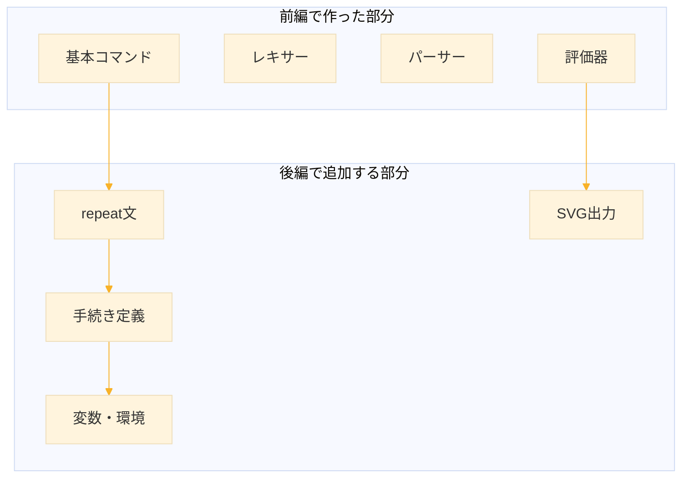
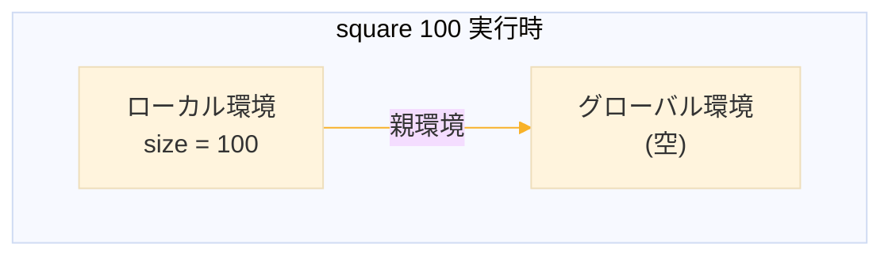
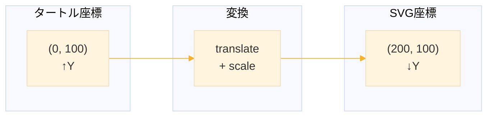

# Level 23-B (タートルグラフィックス言語（後編）)
前編では、基本的なコマンド（`forward`, `right` など）を実行できるインタプリタを作りました。後編では、より高度な機能を追加して、本格的な言語処理系を完成させます。

**後編で追加する機能**

1. **repeat文**：繰り返し処理
2. **手続き定義**：再利用可能なコード
3. **変数**：パラメータの受け渡し
4. **SVG出力**：ブラウザで表示可能な画像

**後編の学習目標**

1. 制御構造（繰り返し）の実装方法を理解する
2. 環境（スコープ）の概念を理解する
3. 手続き呼び出しの仕組みを理解する
4. SVGフォーマットでの出力方法を学ぶ




## 1. 後編の言語仕様

### 1.1 repeat文

同じ処理を繰り返します

```logo
repeat 4 [forward 100 right 90]
```

`repeat 回数 [本体]` の形式で、本体を指定回数繰り返します。

### 1.2 手続き定義

再利用可能なコードを定義します

```logo
to square :size
  repeat 4 [forward :size right 90]
end

square 100
square 50
```

- `to 名前 :引数...` で定義開始
- `end` で定義終了
- `:size` は引数（パラメータ）
- 定義した手続きは名前で呼び出せる

### 1.3 構文規則（後編で追加）

```
文         ::= コマンド 
             | repeat文 
             | 手続き定義 
             | 手続き呼び出し

repeat文   ::= "repeat" 式 "[" 文* "]"

手続き定義 ::= "to" 名前 パラメータ* 文* "end"
パラメータ ::= ":" 名前

手続き呼び出し ::= 名前 式*

式         ::= 数値 | パラメータ参照
パラメータ参照 ::= ":" 名前
```


## 2. ステップ1：トークンの追加

### 2.1 新しいトークン

後編で必要な新しいトークンを追加します

| 種類 | 説明 | 例 |
|------|------|-----|
| `:param` | パラメータ（:で始まる） | `:size`, `:n` |
| `:lbracket` | 左角括弧 | `[` |
| `:rbracket` | 右角括弧 | `]` |

### 2.2 レキサーの拡張

```lisp
;;; パラメータを読み取る（:name 形式）
(defun read-param (lexer)
  (advance lexer)  ; ':' をスキップ
  (read-word lexer))

;;; next-token を拡張（追加部分のみ）
(defun next-token (lexer)
  (skip-whitespace-and-comments lexer)
  
  (let ((char (current-char lexer)))
    (cond
      ;; ... 前編のコード ...
      
      ;; 左角括弧（新規追加）
      ((eql char #\[)
       (advance lexer)
       (make-token :type :lbracket :value "["))
      
      ;; 右角括弧（新規追加）
      ((eql char #\])
       (advance lexer)
       (make-token :type :rbracket :value "]"))
      
      ;; パラメータ（新規追加）
      ((eql char #\:)
       (make-token :type :param :value (read-param lexer)))
      
      ;; ... 残りのコード ...
      )))
```

### 2.3 動作確認

```lisp
;; 動作確認
(tokenize "repeat 4 [fd :size]")
;; => ((:WORD "repeat") (:NUMBER 4) (:LBRACKET "[") 
;;     (:WORD "fd") (:PARAM "size") (:RBRACKET "]") (:EOF))
```


## 3. ステップ2：AST ノードの追加

### 3.1 新しい AST ノード

| ノード種別 | 形式 | 例 |
|-----------|------|-----|
| 繰り返し | `(:REPEAT 回数 本体)` | `(:REPEAT 4 ((...)))` |
| 手続き定義 | `(:DEFINE 名前 引数 本体)` | `(:DEFINE "square" ("size") (...))` |
| 手続き呼出 | `(:CALL 名前 引数)` | `(:CALL "square" (100))` |
| 変数参照 | `(:VAR 名前)` | `(:VAR "size")` |

### 3.2 AST の例

```logo
to square :size
  repeat 4 [forward :size right 90]
end

square 100
```

↓ パース結果

```lisp
((:DEFINE "square" ("size")
   ((:REPEAT (:VAR "size")
      ((:FORWARD (:VAR "size"))
       (:RIGHT 90)))))
 (:CALL "square" (100)))
```


## 4. ステップ3：式のパース

### 4.1 式とは

前編では、コマンドの引数は常に数値でした

```logo
forward 100  ; 100 は数値
```

後編では、引数に**変数参照**も使えるようになります

```logo
forward :size  ; :size は変数
```

これらを統一的に「式」として扱います。

### 4.2 式をパースする関数

```lisp
;;; 式をパースする（数値または変数参照）
(defun parse-expression (parser)
  (cond
    ;; 数値リテラル
    ((check-token parser :number)
     (token-value (consume parser)))
    
    ;; 変数参照（:name形式）
    ((check-token parser :param)
     (list :VAR (token-value (consume parser))))
    
    ;; エラー
    (t
     (error "式が必要です: ~A" (current-token parser)))))
```

**解説**

- 数値の場合：そのまま数値を返す（例：`100`）
- 変数参照の場合：`(:VAR "name")` のリストを返す

### 4.3 動作確認

```lisp
;; 数値
(let ((p (make-parser :tokens (tokenize "100"))))
  (parse-expression p))
;; => 100

;; 変数参照
(let ((p (make-parser :tokens (tokenize ":size"))))
  (parse-expression p))
;; => (:VAR "size")
```


## 5. ステップ4：repeat文のパース

### 5.1 repeat文の構造

```logo
repeat 4 [forward 100 right 90]
```

構成要素
1. `repeat` キーワード
2. 回数（式）
3. `[` 開始括弧
4. 本体（文のリスト）
5. `]` 終了括弧

### 5.2 ブロックをパースする関数

まず、`[...]` で囲まれた部分（ブロック）をパースする関数を作ります

```lisp
;;; ブロック（[...]）をパースする
(defun parse-block (parser)
  ;; '[' を期待
  (expect parser :lbracket)
  (skip-newlines parser)
  
  ;; ']' が来るまで文をパース
  (let ((statements '()))
    (loop until (check-token parser :rbracket)
          do (skip-newlines parser)
             (unless (check-token parser :rbracket)
               (push (parse-statement parser) statements))
             (skip-newlines parser))
    
    ;; ']' を期待
    (expect parser :rbracket)
    (nreverse statements)))
```

**解説**

- `expect` で `[` を確認して消費
- `]` が来るまで、`parse-statement` を繰り返し呼ぶ
- 最後に `]` を確認して消費

### 5.3 parse-statement の拡張（repeat部分）

```lisp
;;; parse-statement に repeat 文を追加
(defun parse-statement (parser)
  (skip-newlines parser)
  
  (let* ((word (token-value (current-token parser)))
         (cmd (normalize-command word)))
    (consume parser)
    
    (cond
      ;; ... 前編のコマンド ...
      
      ;; repeat文（新規追加）
      ((string= cmd "repeat")
       (let ((count (parse-expression parser))  ; 回数
             (body (parse-block parser)))        ; 本体
         (list :REPEAT count body)))
      
      ;; ... 残りのコード ...
      )))
```

### 5.4 動作確認

```lisp
(parse "repeat 4 [fd 100 rt 90]")
;; => ((:REPEAT 4 ((:FORWARD 100) (:RIGHT 90))))

(parse "repeat :n [fd :size]")
;; => ((:REPEAT (:VAR "n") ((:FORWARD (:VAR "size")))))
```


## 6. ステップ5：手続き定義のパース

### 6.1 手続き定義の構造

```logo
to square :size
  repeat 4 [forward :size right 90]
end
```

構成要素
1. `to` キーワード
2. 手続き名
3. パラメータ（0個以上の `:name`）
4. 本体（文のリスト）
5. `end` キーワード

### 6.2 パラメータリストをパースする関数

```lisp
;;; パラメータリストをパースする
(defun parse-parameters (parser)
  (let ((params '()))
    ;; :param トークンが続く限り読む
    (loop while (check-token parser :param)
          do (push (token-value (consume parser)) params))
    (nreverse params)))
```

### 6.3 手続き本体をパースする関数

```lisp
;;; 手続き本体をパースする（endまで）
(defun parse-procedure-body (parser)
  (let ((statements '()))
    (skip-newlines parser)
    ;; "end" が来るまで文をパース
    (loop until (and (check-token parser :word)
                     (string= (normalize-command 
                               (token-value (current-token parser)))
                              "end"))
          do (push (parse-statement parser) statements)
             (skip-newlines parser))
    ;; "end" を消費
    (expect parser :word)
    (nreverse statements)))
```

### 6.4 parse-statement の拡張（手続き定義部分）

```lisp
;; 手続き定義（to ... end）
((string= cmd "to")
 (let* ((name (token-value (expect parser :word)))  ; 手続き名
        (params (parse-parameters parser))           ; パラメータ
        (body (parse-procedure-body parser)))        ; 本体
   (list :DEFINE name params body)))
```

### 6.5 動作確認

```lisp
(parse "to square :size
  repeat 4 [fd :size rt 90]
end")
;; => ((:DEFINE "square" ("size")
;;       ((:REPEAT (:VAR "size")
;;         ((:FORWARD (:VAR "size")) (:RIGHT 90))))))
```


## 7. ステップ6：手続き呼び出しのパース

### 7.1 手続き呼び出しの構造

```logo
square 100      ; 引数1つ
triangle 50 3   ; 引数2つ
reset           ; 引数なし
```

### 7.2 parse-statement の拡張（呼び出し部分）

未知のコマンドは、すべて手続き呼び出しとして扱います

```lisp
;; 手続き呼び出し（未知のコマンド）
(t
 (let ((args '()))
   ;; 引数を収集（数値またはパラメータが続く限り）
   (loop while (or (check-token parser :number)
                   (check-token parser :param))
         do (push (parse-expression parser) args))
   (list :CALL cmd (nreverse args))))
```

### 7.3 動作確認

```lisp
(parse "square 100")
;; => ((:CALL "square" (100)))

(parse "polygon 6 :size")
;; => ((:CALL "polygon" (6 (:VAR "size"))))
```


## 8. ステップ7：コマンド正規化の更新

### 8.1 新しいキーワード

`repeat`, `to`, `end` をキーワードとして認識させます

```lisp
(defun normalize-command (name)
  (let ((cmd (string-downcase name)))
    (cond
      ;; 移動コマンド
      ((member cmd '("forward" "fd") :test #'string=) "forward")
      ((member cmd '("back" "bk") :test #'string=) "back")
      ((member cmd '("right" "rt") :test #'string=) "right")
      ((member cmd '("left" "lt") :test #'string=) "left")
      ;; ペンコマンド
      ((member cmd '("penup" "pu") :test #'string=) "penup")
      ((member cmd '("pendown" "pd") :test #'string=) "pendown")
      ;; その他のコマンド
      ((string= cmd "home") "home")
      ;; 制御キーワード（新規追加）
      ((string= cmd "repeat") "repeat")
      ((string= cmd "to") "to")
      ((string= cmd "end") "end")
      ;; ユーザー定義（そのまま）
      (t cmd))))
```


## 9. ステップ8：環境（スコープ）の概念

### 9.1 なぜ環境が必要か

手続きにパラメータを渡すと、その値を保持する場所が必要です

```logo
to square :size        ; :size = 100 という束縛が必要
  forward :size        ; :size の値を参照
end

square 100             ; ここで :size に 100 を束縛
```

この「変数名と値の対応」を管理するのが**環境（Environment）**です。

### 9.2 環境の構造



### 9.3 環境構造体

```lisp
;;; 環境構造体
;;; bindings: 変数束縛のalist ((name . value) ...)
;;; parent: 親環境（レキシカルスコープ用）
(defstruct environment
  (bindings '())
  (parent nil))
```

### 9.4 環境の操作関数

```lisp
;;; 環境から変数を検索する
(defun env-lookup (env name)
  ;; 現在の環境で探す
  (let ((binding (assoc name (environment-bindings env) :test #'string=)))
    (if binding
        (cdr binding)  ; 見つかった
        ;; 見つからなければ親環境で探す
        (if (environment-parent env)
            (env-lookup (environment-parent env) name)
            (error "未定義の変数: ~A" name)))))

;;; 環境に変数を束縛する
(defun env-bind (env name value)
  (push (cons name value) (environment-bindings env)))
```

**解説**

- `assoc`: 連想リストから要素を探す
- 見つからなければ、親環境を再帰的に探す
- これにより**レキシカルスコープ**が実現される


## 10. ステップ9：手続きの管理

### 10.1 手続き構造体

定義された手続きを保持する構造体

```lisp
;;; 手続き構造体
(defstruct procedure
  name      ; 手続き名
  params    ; パラメータ名のリスト
  body)     ; 本体（ASTのリスト）
```

### 10.2 インタプリタ構造体

タートル、手続き定義、環境をまとめて管理

```lisp
;;; インタプリタ構造体
(defstruct interpreter
  (turtle (make-turtle))                        ; タートル
  (procedures (make-hash-table :test 'equal))   ; 手続き定義
  (global-env (make-environment)))              ; グローバル環境
```

**解説**

- `procedures` はハッシュテーブルで、手続き名から手続きオブジェクトを検索
- `global-env` はプログラム全体で共有される環境


## 11. ステップ10：式の評価

### 11.1 式を評価する関数

式（数値または変数参照）を評価して、実際の値を得ます

```lisp
;;; 式を評価する
(defun eval-expression (expr env)
  (cond
    ;; 数値リテラル：そのまま返す
    ((numberp expr)
     expr)
    
    ;; 変数参照：環境から値を取得
    ((and (listp expr) (eq (first expr) :VAR))
     (env-lookup env (second expr)))
    
    ;; エラー
    (t
     (error "評価できない式: ~A" expr))))
```

### 11.2 評価の例

```lisp
;; 環境を作成
(let ((env (make-environment)))
  (env-bind env "size" 100)
  
  ;; 数値の評価
  (eval-expression 50 env)         ; => 50
  
  ;; 変数参照の評価
  (eval-expression '(:VAR "size") env))  ; => 100
```


## 12. ステップ11：repeat文の評価

### 12.1 評価の流れ

```logo
repeat 4 [forward 100 right 90]
```

1. 回数（`4`）を評価 → `4`
2. 本体を4回実行

### 12.2 eval-statement の拡張（repeat部分）

```lisp
;; repeat文の評価
(:REPEAT
 (let ((count (eval-expression (second stmt) env))  ; 回数を評価
       (body (third stmt)))                          ; 本体
   ;; count 回繰り返す
   (dotimes (i count)
     (dolist (s body)
       (eval-statement s interp env)))))
```

### 12.3 変数を使った例

```logo
repeat :n [forward :size right 90]
```

この場合
1. `:n` を評価（例：環境に `n=4` があれば `4`）
2. 本体を4回実行
3. 本体内の `:size` も毎回評価される


## 13. ステップ12：手続き定義の評価

### 13.1 評価の流れ

```logo
to square :size
  ...
end
```

1. 手続き名、パラメータ、本体を取り出す
2. `procedure` オブジェクトを作成
3. インタプリタの `procedures` に登録

### 13.2 eval-statement の拡張（定義部分）

```lisp
;; 手続き定義の評価
(:DEFINE
 (let ((name (second stmt))     ; 手続き名
       (params (third stmt))    ; パラメータ
       (body (fourth stmt)))    ; 本体
   ;; 手続きオブジェクトを作成して登録
   (setf (gethash name (interpreter-procedures interp))
         (make-procedure :name name
                         :params params
                         :body body))))
```

**解説**

- `gethash` でハッシュテーブルにアクセス
- `setf` で値を設定


## 14. ステップ13：手続き呼び出しの評価

### 14.1 評価の流れ

```logo
square 100
```

1. 手続き名（`square`）から手続きオブジェクトを取得
2. 引数（`100`）を評価
3. 新しい環境を作成し、パラメータに引数を束縛
4. その環境で本体を実行

### 14.2 eval-statement の拡張（呼び出し部分）

```lisp
;; 手続き呼び出しの評価
(:CALL
 (let* ((name (second stmt))  ; 手続き名
        ;; 引数を評価
        (args (mapcar (lambda (a) (eval-expression a env))
                      (third stmt)))
        ;; 手続きを取得
        (proc (gethash name (interpreter-procedures interp))))
   
   ;; 手続きが存在するか確認
   (unless proc
     (error "未定義の手続き: ~A" name))
   
   ;; 新しい環境を作成（親は現在の環境）
   (let ((new-env (make-environment :parent env)))
     ;; パラメータに引数を束縛
     (loop for param in (procedure-params proc)
           for arg in args
           do (env-bind new-env param arg))
     
     ;; 本体を新しい環境で実行
     (dolist (s (procedure-body proc))
       (eval-statement s interp new-env)))))
```

### 14.3 実行の流れ（図解）

```
%%{init:{'theme':'base',
  'themeVariables': {
    'lineColor': '#F8B229'
  },
  'flowchart':{'rankSpacing':60}}
}%%
flowchart TD
    A["square 100 を評価"] --> B["手続き 'square' を検索"]
    B --> C["引数 100 を評価"]
    C --> D["新しい環境を作成"]
    D --> E["size = 100 を束縛"]
    E --> F["本体を新環境で実行"]
    F --> G["repeat 4 [...] を評価"]
    G --> H["forward :size を評価<br>(:size → 100)"]
```


## 15. ステップ14：評価器の統合

### 15.1 完全な eval-statement

```lisp
;;; 文を評価する
(defun eval-statement (stmt interp env)
  (let ((turtle (interpreter-turtle interp)))
    (case (first stmt)
      ;; 移動コマンド
      (:FORWARD
       (turtle-forward turtle (eval-expression (second stmt) env)))
      
      (:BACK
       (turtle-back turtle (eval-expression (second stmt) env)))
      
      (:RIGHT
       (turtle-right turtle (eval-expression (second stmt) env)))
      
      (:LEFT
       (turtle-left turtle (eval-expression (second stmt) env)))
      
      ;; ペンコマンド
      (:PENUP (turtle-penup turtle))
      (:PENDOWN (turtle-pendown turtle))
      
      ;; ホーム
      (:HOME (turtle-home turtle))
      
      ;; repeat文
      (:REPEAT
       (let ((count (eval-expression (second stmt) env))
             (body (third stmt)))
         (dotimes (i count)
           (dolist (s body)
             (eval-statement s interp env)))))
      
      ;; 手続き定義
      (:DEFINE
       (setf (gethash (second stmt) (interpreter-procedures interp))
             (make-procedure :name (second stmt)
                             :params (third stmt)
                             :body (fourth stmt))))
      
      ;; 手続き呼び出し
      (:CALL
       (let* ((name (second stmt))
              (args (mapcar (lambda (a) (eval-expression a env))
                            (third stmt)))
              (proc (gethash name (interpreter-procedures interp))))
         (unless proc
           (error "未定義の手続き: ~A" name))
         (let ((new-env (make-environment :parent env)))
           (loop for param in (procedure-params proc)
                 for arg in args
                 do (env-bind new-env param arg))
           (dolist (s (procedure-body proc))
             (eval-statement s interp new-env)))))
      
      ;; 未知の文
      (otherwise
       (error "未知の文: ~A" stmt)))))
```

### 15.2 プログラム評価とメイン関数

```lisp
;;; プログラム全体を評価する
(defun eval-program (program interp)
  (dolist (stmt program)
    (eval-statement stmt interp (interpreter-global-env interp))))

;;; ソースコードを実行する
(defun run (source)
  (let* ((ast (parse source))
         (interp (make-interpreter)))
    (eval-program ast interp)
    interp))
```


## 16. ステップ15：評価器のテスト

### 16.1 テスト関数

```lisp
;;; 評価器のテスト
(defun test-evaluator ()
  (format t "~%=== 評価器のテスト ===~%")
  
  ;; テスト1: repeat文
  (format t "~%テスト1: repeat 4 [fd 100 rt 90]~%")
  (let ((interp (run "repeat 4 [fd 100 rt 90]")))
    (format t "  線の数: ~A~%" 
            (length (turtle-lines (interpreter-turtle interp)))))
  
  ;; テスト2: 手続き定義と呼び出し
  (format t "~%テスト2: 手続き定義と呼び出し~%")
  (let ((interp (run "
to square :size
  repeat 4 [fd :size rt 90]
end
square 100
")))
    (format t "  線の数: ~A~%"
            (length (turtle-lines (interpreter-turtle interp)))))
  
  ;; テスト3: 複数の手続き
  (format t "~%テスト3: 複数の手続き~%")
  (let ((interp (run "
to square :size
  repeat 4 [fd :size rt 90]
end

to flower :size :count
  repeat :count [square :size rt 30]
end

flower 50 12
")))
    (format t "  線の数: ~A~%"
            (length (turtle-lines (interpreter-turtle interp))))))
```

### 16.2 実行結果

```
=== 評価器のテスト ===

テスト1: repeat 4 [fd 100 rt 90]
  線の数: 4

テスト2: 手続き定義と呼び出し
  線の数: 4

テスト3: 複数の手続き
  線の数: 48
```


## 17. ステップ16：SVGの基礎

### 17.1 SVGとは

SVG（Scalable Vector Graphics）は、XMLベースのベクター画像形式です。テキストファイルとして作成でき、ブラウザで直接表示できます。

### 17.2 SVGの基本構造

```xml
<?xml version="1.0" encoding="UTF-8"?>
<svg xmlns="http://www.w3.org/2000/svg" 
     width="400" height="400">
  
  <!-- 背景 -->
  <rect width="100%" height="100%" fill="white"/>
  
  <!-- 線を描く -->
  <line x1="0" y1="0" x2="100" y2="100" 
        stroke="black" stroke-width="1"/>
  
</svg>
```

### 17.3 主要な要素

| 要素 | 説明 | 属性 |
|------|------|------|
| `<svg>` | ルート要素 | width, height |
| `<rect>` | 矩形 | x, y, width, height, fill |
| `<line>` | 線分 | x1, y1, x2, y2, stroke |
| `<g>` | グループ | transform |


## 18. ステップ17：座標変換

### 18.1 座標系の違い

タートルの座標系とSVGの座標系は異なります

| 項目 | タートル | SVG |
|------|---------|-----|
| 原点 | 中央 | 左上 |
| Y軸 | 上が正 | 下が正 |

### 18.2 変換の方法

SVGの `transform` 属性を使って座標変換します

```xml
<g transform="translate(200, 200) scale(1, -1)">
  <!-- ここに線を描く -->
</g>
```

- `translate(200, 200)`: 原点を中央（200, 200）に移動
- `scale(1, -1)`: Y軸を反転

### 18.3 変換のイメージ




## 19. ステップ18：SVG出力の実装

### 19.1 SVGヘッダーの生成

```lisp
;;; SVGヘッダーを生成する
(defun svg-header (width height)
  (format nil "<?xml version=\"1.0\" encoding=\"UTF-8\"?>
<svg xmlns=\"http://www.w3.org/2000/svg\" 
     width=\"~A\" height=\"~A\" 
     viewBox=\"0 0 ~A ~A\">
  <rect width=\"100%\" height=\"100%\" fill=\"white\"/>
  <g transform=\"translate(~A, ~A) scale(1, -1)\">"
          width height width height
          (/ width 2) (/ height 2)))
```

### 19.2 SVGフッターの生成

```lisp
;;; SVGフッターを生成する
(defun svg-footer ()
  "  </g>
</svg>")
```

### 19.3 線分をSVGに変換

```lisp
;;; -0.0 や極小値を 0.0 に正規化する（浮動小数点の表示用）
(defun normalize-zero (x)
  (if (< (abs x) 1.0d-10) 0.0 x))

;;; 線分をSVG要素に変換する
(defun line-to-svg (line &optional (color "black") (stroke-width 1))
  (format nil "    <line x1=\"~,2F\" y1=\"~,2F\" x2=\"~,2F\" y2=\"~,2F\" stroke=\"~A\" stroke-width=\"~A\"/>"
          (normalize-zero (line-segment-x1 line))
          (normalize-zero (line-segment-y1 line))
          (normalize-zero (line-segment-x2 line))
          (normalize-zero (line-segment-y2 line))
          color
          stroke-width))
```

**解説**

- `normalize-zero`: 極小値（絶対値が `1e-10` 未満）を `0.0` に変換
- `~,2F`: 小数点以下2桁で浮動小数点数を出力
- エスケープ（`\"`）で文字列中にダブルクォートを含める


## 20. ステップ19：SVG出力の統合

### 20.1 タートルをSVGに変換

```lisp
;;; タートルの描画結果をSVG文字列に変換する
(defun turtle-to-svg (turtle &key (width 400) (height 400)
                                  (color "black") (stroke-width 1))
  (with-output-to-string (out)
    ;; ヘッダー
    (write-string (svg-header width height) out)
    (terpri out)
    
    ;; 線分（描画順に出力）
    (dolist (line (reverse (turtle-lines turtle)))
      (write-string (line-to-svg line color stroke-width) out)
      (terpri out))
    
    ;; フッター
    (write-string (svg-footer) out)))
```

### 20.2 SVGをファイルに保存

```lisp
;;; SVGをファイルに保存する
(defun save-svg (turtle filename &key (width 400) (height 400))
  (with-open-file (out filename
                       :direction :output
                       :if-exists :supersede
                       :external-format :utf-8)
    (write-string (turtle-to-svg turtle :width width :height height) out))
  (format t "SVG saved: ~A~%" filename))
```


## 21. ステップ20：メイン関数の完成

### 21.1 実行してSVG保存

```lisp
;;; ソースを実行してSVGを保存する
(defun run-and-save (source filename &key (width 400) (height 400))
  (let ((interp (run source)))
    (save-svg (interpreter-turtle interp) filename
              :width width :height height)
    interp))

;;; ファイルから読み込んで実行
(defun run-file (input-file output-file &key (width 400) (height 400))
  (let ((source (with-open-file (in input-file)
                  (let ((content (make-string (file-length in))))
                    (read-sequence content in)
                    content))))
    (run-and-save source output-file :width width :height height)))
```

### 21.2 使用例

```lisp
;; 正方形
(run-and-save "repeat 4 [fd 100 rt 90]" "square.svg")

;; 五芒星
(run-and-save "repeat 5 [fd 100 rt 144]" "star.svg")

;; 花模様
(run-and-save "
to square :size
  repeat 4 [fd :size rt 90]
end

repeat 12 [square 50 rt 30]
" "flower.svg" :width 500 :height 500)
```


## 22. ステップ21：デモプログラム

### 22.1 デモ関数

```lisp
;;; デモ: 正方形
(defun demo-square ()
  (run-and-save "repeat 4 [fd 100 rt 90]" "demo-square.svg"))

;;; デモ: 五芒星
(defun demo-star ()
  (run-and-save "repeat 5 [fd 100 rt 144]" "demo-star.svg"))

;;; デモ: 花模様
(defun demo-flower ()
  (run-and-save "
to square :size
  repeat 4 [fd :size rt 90]
end

repeat 12 [square 50 rt 30]
" "demo-flower.svg" :width 500 :height 500))

;;; デモ: 渦巻き
(defun demo-spiral ()
  (run-and-save "
to spiral :size :count
  repeat :count [
    fd :size
    rt 15
  ]
end

spiral 3 100
" "demo-spiral.svg" :width 600 :height 600))

;;; デモ: 正多角形
(defun demo-polygon ()
  (run-and-save "
; 正多角形を描く手続き
; sides: 辺の数, size: 辺の長さ, angle: 外角（360/sides）
to polygon :sides :size :angle
  repeat :sides [
    fd :size
    rt :angle
  ]
end

; 正六角形（外角 = 360/6 = 60度）
polygon 6 80 60

; 移動
pu fd 200 pd

; 正八角形（外角 = 360/8 = 45度）
polygon 8 60 45
" "demo-polygon.svg" :width 500 :height 500))

;;; すべてのデモを実行
(defun run-all-demos ()
  (format t "~%=== デモ実行 ===~%")
  (demo-square)
  (demo-star)
  (demo-flower)
  (demo-spiral)
  (demo-polygon)
  (format t "~%完了！~%"))
```


## 23. 後編の完成コード

すべてをまとめた完成コードです。

```lisp
;;;; turtle-lang.lisp
;;;; タートルグラフィックス言語インタプリタ（完成版）

;;; ========================================
;;; 1. トークン定義
;;; ========================================

(defstruct token
  type value)

;;; ========================================
;;; 2. レキサー
;;; ========================================

(defstruct lexer
  input (pos 0) len)

(defun make-lexer-from-string (input)
  (make-lexer :input input :pos 0 :len (length input)))

(defun current-char (lexer)
  (when (< (lexer-pos lexer) (lexer-len lexer))
    (char (lexer-input lexer) (lexer-pos lexer))))

(defun advance (lexer) (incf (lexer-pos lexer)))

(defun peek-char-at (lexer &optional (offset 1))
  (let ((pos (+ (lexer-pos lexer) offset)))
    (when (< pos (lexer-len lexer))
      (char (lexer-input lexer) pos))))

(defun whitespace-p (char) (member char '(#\Space #\Tab)))

(defun skip-whitespace (lexer)
  (loop while (and (current-char lexer) (whitespace-p (current-char lexer)))
        do (advance lexer)))

(defun skip-comment (lexer)
  (when (eql (current-char lexer) #\;)
    (loop while (and (current-char lexer)
                     (not (eql (current-char lexer) #\Newline)))
          do (advance lexer))))

(defun skip-whitespace-and-comments (lexer)
  (loop (skip-whitespace lexer)
        (if (eql (current-char lexer) #\;)
            (skip-comment lexer)
            (return))))

(defun read-number (lexer)
  (let ((start (lexer-pos lexer)) (has-dot nil))
    (when (eql (current-char lexer) #\-) (advance lexer))
    (loop while (and (current-char lexer)
                     (or (digit-char-p (current-char lexer))
                         (and (eql (current-char lexer) #\.) (not has-dot))))
          do (when (eql (current-char lexer) #\.) (setf has-dot t))
             (advance lexer))
    (let ((str (subseq (lexer-input lexer) start (lexer-pos lexer))))
      (if has-dot (read-from-string str) (parse-integer str)))))

(defun read-word (lexer)
  (let ((start (lexer-pos lexer)))
    (loop while (and (current-char lexer)
                     (or (alphanumericp (current-char lexer))
                         (member (current-char lexer) '(#\- #\_))))
          do (advance lexer))
    (subseq (lexer-input lexer) start (lexer-pos lexer))))

(defun read-param (lexer)
  (advance lexer)
  (read-word lexer))

(defun next-token (lexer)
  (skip-whitespace-and-comments lexer)
  (let ((char (current-char lexer)))
    (cond
      ((null char) (make-token :type :eof :value nil))
      ((eql char #\Newline) (advance lexer) (make-token :type :newline :value nil))
      ((eql char #\[) (advance lexer) (make-token :type :lbracket :value "["))
      ((eql char #\]) (advance lexer) (make-token :type :rbracket :value "]"))
      ((eql char #\:) (make-token :type :param :value (read-param lexer)))
      ((or (digit-char-p char)
           (and (eql char #\-) (peek-char-at lexer 1)
                (digit-char-p (peek-char-at lexer 1))))
       (make-token :type :number :value (read-number lexer)))
      ((alpha-char-p char) (make-token :type :word :value (read-word lexer)))
      (t (error "予期しない文字: ~A" char)))))

(defun tokenize (input)
  (let ((lexer (make-lexer-from-string input)) (tokens '()))
    (loop for token = (next-token lexer)
          do (push token tokens)
          until (eq (token-type token) :eof))
    (nreverse tokens)))

;;; ========================================
;;; 3. パーサー
;;; ========================================

(defstruct parser tokens (pos 0))

(defun current-token (parser)
  (nth (parser-pos parser) (parser-tokens parser)))

(defun consume (parser)
  (prog1 (current-token parser) (incf (parser-pos parser))))

(defun check-token (parser type)
  (eq (token-type (current-token parser)) type))

(defun expect (parser type)
  (if (check-token parser type) (consume parser)
      (error "期待: ~A, 実際: ~A" type (token-type (current-token parser)))))

(defun skip-newlines (parser)
  (loop while (check-token parser :newline) do (consume parser)))

(defun normalize-command (name)
  (let ((cmd (string-downcase name)))
    (cond
      ((member cmd '("forward" "fd") :test #'string=) "forward")
      ((member cmd '("back" "bk") :test #'string=) "back")
      ((member cmd '("right" "rt") :test #'string=) "right")
      ((member cmd '("left" "lt") :test #'string=) "left")
      ((member cmd '("penup" "pu") :test #'string=) "penup")
      ((member cmd '("pendown" "pd") :test #'string=) "pendown")
      ((string= cmd "home") "home")
      ((string= cmd "repeat") "repeat")
      ((string= cmd "to") "to")
      ((string= cmd "end") "end")
      (t cmd))))

(defun parse-expression (parser)
  (cond
    ((check-token parser :number) (token-value (consume parser)))
    ((check-token parser :param) (list :VAR (token-value (consume parser))))
    (t (error "式が必要: ~A" (current-token parser)))))

(defun parse-block (parser)
  (expect parser :lbracket)
  (skip-newlines parser)
  (let ((stmts '()))
    (loop until (check-token parser :rbracket)
          do (skip-newlines parser)
             (unless (check-token parser :rbracket)
               (push (parse-statement parser) stmts))
             (skip-newlines parser))
    (expect parser :rbracket)
    (nreverse stmts)))

(defun parse-parameters (parser)
  (let ((params '()))
    (loop while (check-token parser :param)
          do (push (token-value (consume parser)) params))
    (nreverse params)))

(defun parse-procedure-body (parser)
  (let ((stmts '()))
    (skip-newlines parser)
    (loop until (and (check-token parser :word)
                     (string= (normalize-command (token-value (current-token parser))) "end"))
          do (push (parse-statement parser) stmts)
             (skip-newlines parser))
    (expect parser :word)
    (nreverse stmts)))

(defun parse-statement (parser)
  (skip-newlines parser)
  (unless (check-token parser :word)
    (error "コマンドが必要: ~A" (current-token parser)))
  (let* ((word (token-value (current-token parser)))
         (cmd (normalize-command word)))
    (consume parser)
    (cond
      ((member cmd '("forward" "back" "right" "left") :test #'string=)
       (list (intern (string-upcase cmd) :keyword) (parse-expression parser)))
      ((string= cmd "penup") '(:PENUP))
      ((string= cmd "pendown") '(:PENDOWN))
      ((string= cmd "home") '(:HOME))
      ((string= cmd "repeat")
       (list :REPEAT (parse-expression parser) (parse-block parser)))
      ((string= cmd "to")
       (list :DEFINE (token-value (expect parser :word))
             (parse-parameters parser) (parse-procedure-body parser)))
      (t (let ((args '()))
           (loop while (or (check-token parser :number) (check-token parser :param))
                 do (push (parse-expression parser) args))
           (list :CALL cmd (nreverse args)))))))

(defun parse-program (parser)
  (let ((stmts '()))
    (loop until (check-token parser :eof)
          do (skip-newlines parser)
             (unless (check-token parser :eof)
               (push (parse-statement parser) stmts))
             (skip-newlines parser))
    (nreverse stmts)))

(defun parse (input)
  (parse-program (make-parser :tokens (tokenize input))))

;;; ========================================
;;; 4. タートル
;;; ========================================

(defstruct turtle (x 0.0) (y 0.0) (angle 0.0) (pen-down t) (lines '()))
(defstruct line-segment x1 y1 x2 y2)

(defun deg-to-rad (deg) (* deg (/ pi 180.0)))

(defun turtle-forward (turtle dist)
  (let* ((rad (deg-to-rad (turtle-angle turtle)))
         (dx (* dist (sin rad))) (dy (* dist (cos rad)))
         (ox (turtle-x turtle)) (oy (turtle-y turtle))
         (nx (+ ox dx)) (ny (+ oy dy)))
    (when (turtle-pen-down turtle)
      (push (make-line-segment :x1 ox :y1 oy :x2 nx :y2 ny) (turtle-lines turtle)))
    (setf (turtle-x turtle) nx (turtle-y turtle) ny)))

(defun turtle-back (turtle dist) (turtle-forward turtle (- dist)))
(defun turtle-right (turtle deg) (setf (turtle-angle turtle) (mod (+ (turtle-angle turtle) deg) 360.0)))
(defun turtle-left (turtle deg) (turtle-right turtle (- deg)))
(defun turtle-penup (turtle) (setf (turtle-pen-down turtle) nil))
(defun turtle-pendown (turtle) (setf (turtle-pen-down turtle) t))
(defun turtle-home (turtle) (setf (turtle-x turtle) 0.0 (turtle-y turtle) 0.0 (turtle-angle turtle) 0.0))

;;; ========================================
;;; 5. 環境・手続き・インタプリタ
;;; ========================================

(defstruct environment (bindings '()) (parent nil))
(defstruct procedure name params body)
(defstruct interpreter
  (turtle (make-turtle))
  (procedures (make-hash-table :test 'equal))
  (global-env (make-environment)))

(defun env-lookup (env name)
  (let ((b (assoc name (environment-bindings env) :test #'string=)))
    (if b (cdr b)
        (if (environment-parent env) (env-lookup (environment-parent env) name)
            (error "未定義の変数: ~A" name)))))

(defun env-bind (env name val)
  (push (cons name val) (environment-bindings env)))

;;; ========================================
;;; 6. 評価器
;;; ========================================

(defun eval-expression (expr env)
  (cond ((numberp expr) expr)
        ((and (listp expr) (eq (first expr) :VAR)) (env-lookup env (second expr)))
        (t (error "評価できない式: ~A" expr))))

(defun eval-statement (stmt interp env)
  (let ((turtle (interpreter-turtle interp)))
    (case (first stmt)
      (:FORWARD (turtle-forward turtle (eval-expression (second stmt) env)))
      (:BACK (turtle-back turtle (eval-expression (second stmt) env)))
      (:RIGHT (turtle-right turtle (eval-expression (second stmt) env)))
      (:LEFT (turtle-left turtle (eval-expression (second stmt) env)))
      (:PENUP (turtle-penup turtle))
      (:PENDOWN (turtle-pendown turtle))
      (:HOME (turtle-home turtle))
      (:REPEAT
       (let ((cnt (eval-expression (second stmt) env)) (body (third stmt)))
         (dotimes (i cnt) (dolist (s body) (eval-statement s interp env)))))
      (:DEFINE
       (setf (gethash (second stmt) (interpreter-procedures interp))
             (make-procedure :name (second stmt) :params (third stmt) :body (fourth stmt))))
      (:CALL
       (let* ((name (second stmt))
              (args (mapcar (lambda (a) (eval-expression a env)) (third stmt)))
              (proc (gethash name (interpreter-procedures interp))))
         (unless proc (error "未定義の手続き: ~A" name))
         (let ((new-env (make-environment :parent env)))
           (loop for p in (procedure-params proc) for a in args do (env-bind new-env p a))
           (dolist (s (procedure-body proc)) (eval-statement s interp new-env)))))
      (otherwise (error "未知の文: ~A" stmt)))))

(defun eval-program (program interp)
  (dolist (stmt program) (eval-statement stmt interp (interpreter-global-env interp))))

(defun run (source)
  (let ((interp (make-interpreter)))
    (eval-program (parse source) interp)
    interp))

;;; ========================================
;;; 7. SVG出力
;;; ========================================

(defun svg-header (w h)
  (format nil "<?xml version=\"1.0\" encoding=\"UTF-8\"?>
<svg xmlns=\"http://www.w3.org/2000/svg\" width=\"~A\" height=\"~A\" viewBox=\"0 0 ~A ~A\">
  <rect width=\"100%\" height=\"100%\" fill=\"white\"/>
  <g transform=\"translate(~A, ~A) scale(1, -1)\">" w h w h (/ w 2) (/ h 2)))

(defun svg-footer () "  </g>
</svg>")

(defun normalize-zero (x) (if (< (abs x) 1.0d-10) 0.0 x))

(defun line-to-svg (line &optional (color "black") (sw 1))
  (format nil "    <line x1=\"~,2F\" y1=\"~,2F\" x2=\"~,2F\" y2=\"~,2F\" stroke=\"~A\" stroke-width=\"~A\"/>"
          (normalize-zero (line-segment-x1 line)) (normalize-zero (line-segment-y1 line))
          (normalize-zero (line-segment-x2 line)) (normalize-zero (line-segment-y2 line)) color sw))

(defun turtle-to-svg (turtle &key (width 400) (height 400))
  (with-output-to-string (out)
    (write-string (svg-header width height) out) (terpri out)
    (dolist (line (reverse (turtle-lines turtle)))
      (write-string (line-to-svg line) out) (terpri out))
    (write-string (svg-footer) out)))

(defun save-svg (turtle filename &key (width 400) (height 400))
  (with-open-file (out filename :direction :output :if-exists :supersede :external-format :utf-8)
    (write-string (turtle-to-svg turtle :width width :height height) out))
  (format t "SVG saved: ~A~%" filename))

;;; ========================================
;;; 8. メイン
;;; ========================================

(defun run-and-save (source filename &key (width 400) (height 400))
  (let ((interp (run source)))
    (save-svg (interpreter-turtle interp) filename :width width :height height)
    interp))

;;; ========================================
;;; 9. デモ
;;; ========================================

(defun demo-square () (run-and-save "repeat 4 [fd 100 rt 90]" "demo-square.svg"))
(defun demo-star () (run-and-save "repeat 5 [fd 100 rt 144]" "demo-star.svg"))
(defun demo-flower ()
  (run-and-save "to square :size
  repeat 4 [fd :size rt 90]
end
repeat 12 [square 50 rt 30]" "demo-flower.svg" :width 500 :height 500))

(defun run-all-demos ()
  (format t "~%=== Running demos ===~%")
  (demo-square) (demo-star) (demo-flower)
  (format t "Done!~%"))

;;; 使用方法:
;;; (load "turtle-lang.lisp")
;;; (run-all-demos)
```


## 24. 発展課題

### 課題1：ペンの色

`pencolor` コマンドを追加してください

```logo
pencolor red
forward 100
pencolor blue
right 90
forward 100
```

**ヒント**
- タートルに `color` スロットを追加
- 線分に色情報を含める
- SVG出力で色を反映

### 課題2：円を描く

`circle` コマンドを実装してください

```logo
circle 50  ; 半径50の円
```

**ヒント**
- 小さく進んで少し回転、を繰り返す
- 360回繰り返すと円になる

### 課題3：再帰的な図形

`if` 文を追加して、再帰的な図形を描けるようにしてください

```logo
to tree :size :depth
  if :depth = 0 [
    forward :size
    back :size
  ] [
    forward :size
    left 30
    tree :size / 2 :depth - 1
    right 60
    tree :size / 2 :depth - 1
    left 30
    back :size
  ]
end

tree 100 5
```

### 課題4：変数への代入

`make` コマンドで変数に値を代入できるようにしてください

```logo
make "x 100
forward :x
```


## 25. 練習課題（後編）

### 課題1：正多角形

任意の正多角形を描く `polygon` 手続きを作成してください

```logo
to polygon :sides :size
  ; ここを実装
end

polygon 3 100  ; 正三角形
polygon 5 80   ; 正五角形
polygon 8 50   ; 正八角形
```

### 課題2：渦巻き

渦巻きを描く `spiral` 手続きを作成してください

```logo
to spiral :start :end :step :angle
  ; ここを実装
end

spiral 1 100 2 10  ; 1から100まで2ずつ増やしながら10度回転
```

### 課題3：フラクタル

コッホ雪片を描いてみましょう（`if` 文の実装が必要）

```logo
to koch :size :depth
  if :depth = 0 [
    forward :size
  ] [
    koch :size / 3 :depth - 1
    left 60
    koch :size / 3 :depth - 1
    right 120
    koch :size / 3 :depth - 1
    left 60
    koch :size / 3 :depth - 1
  ]
end
```


## 26. 後編のまとめ

### 学んだこと

| ステップ | 内容 |
|---------|------|
| 1-3 | トークン追加、ASTノード追加、式のパース |
| 4-7 | repeat文、手続き定義、手続き呼び出しのパース |
| 8-10 | 環境（スコープ）、式の評価 |
| 11-14 | repeat・手続き定義・呼び出しの評価 |
| 15-17 | SVGの基礎、座標変換 |
| 18-21 | SVG出力の実装、デモプログラム |

### 言語処理系の全体像

```
%%{init:{'theme':'base',
  'themeVariables': {
    'lineColor': '#F8B229'
  },
  'flowchart':{'rankSpacing':60}}
}%%
flowchart TD
    subgraph "フロントエンド"
        A[ソースコード] --> B[レキサー]
        B --> C[トークン列]
        C --> D[パーサー]
        D --> E[AST]
    end
    subgraph "バックエンド"
        E --> F[評価器]
        F --> G[タートル状態]
        G --> H[SVG出力]
    end
    subgraph "実行時"
        I[環境<br>変数束縛]
        J[手続き定義<br>テーブル]
    end
    F --> I
    F --> J
```

## 今後の発展

この演習で作った言語処理系は、さらに以下の方向に発展できます

- **より多くの制御構造**：`if`, `while`, `for`
- **式の拡張**：算術演算、比較演算
- **グラフィック機能**：色、太さ、塗りつぶし
- **対話モード**：REPLの実装
- **コンパイラ化**：中間コードへの変換

### 拡張版
- [Turtle Lang Full](https://github.com/fukuyori/turtle-lang)


## 参考資料

- [Logo Foundation](https://el.media.mit.edu/logo-foundation/)
- [Structure and Interpretation of Computer Programs](https://mitp-content-server.mit.edu/books/content/sectbyfn/books_pres_0/6515/sicp.zip/index.html)
- [SVG Tutorial - MDN](https://developer.mozilla.org/en-US/docs/Web/SVG/Tutorial)
- [Practical Common Lisp](https://gigamonkeys.com/book/)


