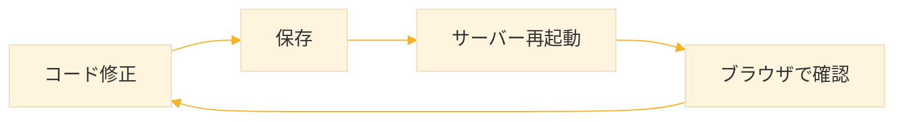
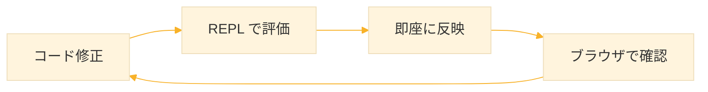
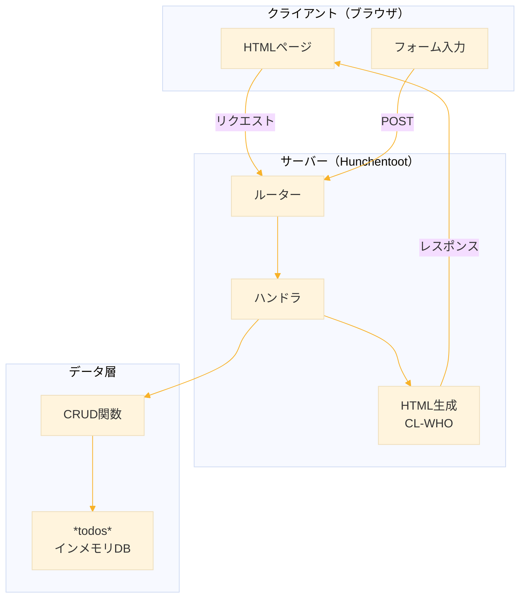
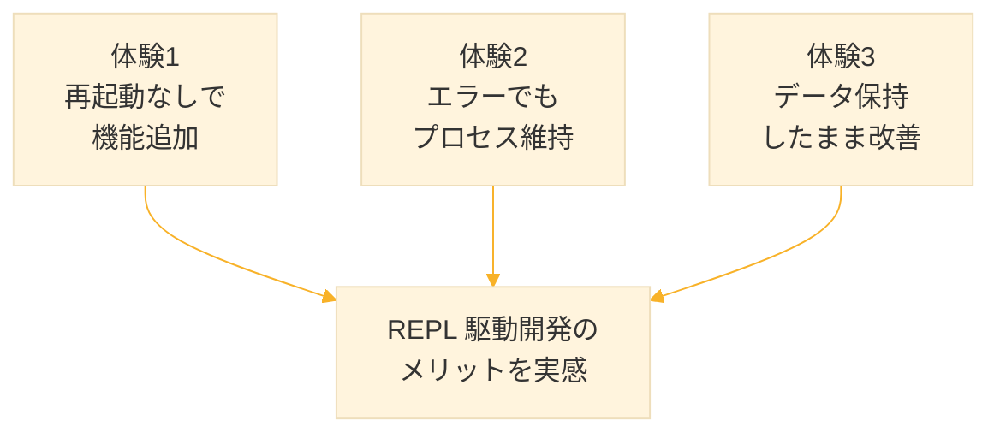

# Level 24-A (Web アプリケーション ─ Todoアプリ)
本章では、Common Lisp で **Web アプリケーション** を構築します。

ただし、単に「Web アプリを作る」だけではありません。**Lisp ならではの開発体験** を実際に手を動かして体感することが目標です。


1. サーバーを止めずにコードを修正・追加
1. エラーが起きてもプロセスが死なない
1. デバッガでその場で調査・修正・再試行
1. データを保持したまま機能を改善

## 1. なぜ Lisp で Web アプリを作るのか

### 1.1 他の言語との違い

一般的な Web 開発のサイクル



**Python / Node.js / Ruby の場合**
```
コード変更 → 保存 → サーバー再起動（数秒） → 確認
                    ↓
            セッション消失
            キャッシュ消失
            再ログイン必要
```

### 1.2 Lisp の REPL 駆動開発



**Common Lisp の場合**
```
コード変更 → REPL で評価 → 即座に反映（0秒） → 確認
                           ↓
                   セッション維持
                   データ維持
                   状態そのまま
```

### 1.3 比較表

| 項目 | Node.js / Python | Common Lisp |
|------|-----------------|-------------|
| コード変更後 | 再起動が必要 | **即座に反映** |
| エラー発生時 | プロセスがクラッシュ | **デバッガが起動** |
| セッション | 再起動で消失 | **維持される** |
| デバッグ | ログを見て推測 | **対話的に調査** |
| 機能追加 | 停止→追加→起動 | **稼働中に追加** |


## 2. 環境構築

### 2.1 必要なライブラリ

```lisp
;; Quicklisp でインストール
(ql:quickload '(:hunchentoot   ; Web サーバー
                :cl-who        ; HTML 生成
                :cl-json))     ; JSON 処理
```

### 2.2 ライブラリの役割


**Hunchentoot**
- Common Lisp の代表的な Web サーバー
- 10年以上の実績、安定性
- スレッドベースのリクエスト処理

**CL-WHO**
- S 式で HTML を記述
- Lisp のマクロと自然に統合

**CL-JSON**
- JSON のエンコード/デコード
- API レスポンスに使用


## 3. ステップ1：最小サーバー ─ 3行で起動

### 3.1 最小構成

```lisp
;;;; ===== 最小限の Web サーバー =====

(ql:quickload '(:hunchentoot :cl-who))

;; パッケージ定義
(defpackage :todo-app
  (:use :cl :hunchentoot :cl-who))

(in-package :todo-app)

;;; ----- サーバー管理 -----

(defvar *server* nil "サーバーインスタンス")

(defun start-server (&optional (port 8080))
  "サーバーを起動"
  (when *server* (hunchentoot:stop *server*))
  (setf *server* (make-instance 'easy-acceptor :port port))
  (hunchentoot:start *server*)
  (format t "~%>>> サーバー起動: http://localhost:~A/~%" port))

(defun stop-server ()
  "サーバーを停止"
  (when *server*
    (hunchentoot:stop *server*)
    (setf *server* nil)
    (format t "サーバー停止~%")))

;;; ----- ハンドラ -----

(define-easy-handler (index :uri "/") ()
  (setf (content-type*) "text/html; charset=utf-8")
  (with-html-output-to-string (s nil :prologue t)
    (:html
     (:head (:title "Hello Lisp Web"))
     (:body
      (:h1 "Hello, Lisp Web!")
      (:p "サーバーが動いています。")))))

;;; ===== エクスポート =====

(export '(start-server stop-server))
```

### 3.2 起動してみよう

```lisp
;; REPL で実行
CL-USER> (todo-app:start-server)

>>> サーバー起動: http://localhost:8080/
```

ブラウザで http://localhost:8080/ を開くと「Hello, Lisp Web!」が表示されます。


**ポイント：たった数行で Web サーバーが動く**


## 4. ステップ2：REPL から機能追加

### 4.1 サーバーを止めずにページを追加

**サーバーは起動したまま**、REPL で以下を入力してください

```lisp
;; 新しいページを追加（サーバー稼働中！）
CL-USER> (in-package :todo-app)

TODO-APP> (define-easy-handler (about :uri "/about") ()
            (setf (content-type*) "text/html; charset=utf-8")
            (with-html-output-to-string (s nil :prologue t)
              (:html
               (:head (:title "About"))
               (:body
                (:h1 "このアプリについて")
                (:p "Common Lisp + Hunchentoot で作成")
                (:a :href "/" "トップへ戻る")))))
```

**ブラウザで http://localhost:8080/about にアクセス**


→ **再起動していないのに、新しいページが表示される！**

### 4.2 既存ページの修正

```lisp
;; トップページを修正（サーバー稼働中！）
TODO-APP> (define-easy-handler (index :uri "/") ()
            (setf (content-type*) "text/html; charset=utf-8")
            (with-html-output-to-string (s nil :prologue t)
              (:html
               (:head (:title "Todo App"))
               (:body
                (:h1 "Todo アプリ")
                (:p "Lisp で作る Web アプリケーション")
                (:ul
                 (:li (:a :href "/" "ホーム"))
                 (:li (:a :href "/about" "About")))))))
```

**ブラウザをリロード** → 即座に変更が反映！


:::note
**再起動なしでコードが反映される**

Node.js なら → サーバー停止 → 修正 → 起動 → 確認
Lisp なら   → REPL で評価 → 即確認

この差は開発効率に大きく影響します
:::


## 5. ステップ3：Todo の CRUD 実装

### 5.1 データ構造

```lisp
;;; ----- Todo データ -----

;; Todo 構造体
(defstruct todo
  (id 0 :type integer)
  (title "" :type string)
  (done nil :type boolean)
  (created-at (get-universal-time) :type integer))

;; インメモリ DB
(defvar *todos* '() "Todo リスト")
(defvar *next-id* 1 "次の ID")

;; ID 生成
(defun gen-id ()
  (prog1 *next-id*
    (incf *next-id*)))
```

### 5.2 CRUD 関数

```lisp
;;; ----- CRUD 操作 -----

;; 作成
(defun add-todo (title)
  "新しい Todo を追加"
  (let ((todo (make-todo :id (gen-id) :title title)))
    (push todo *todos*)
    todo))

;; 読み取り（全件）
(defun all-todos ()
  "全ての Todo を取得（新しい順）"
  *todos*)

;; 読み取り（1件）
(defun find-todo (id)
  "ID で Todo を検索"
  (find id *todos* :key #'todo-id))

;; 更新（完了/未完了の切り替え）
(defun toggle-todo (id)
  "Todo の完了状態を切り替え"
  (let ((todo (find-todo id)))
    (when todo
      (setf (todo-done todo) (not (todo-done todo)))
      todo)))

;; 削除
(defun delete-todo (id)
  "Todo を削除"
  (setf *todos* (remove id *todos* :key #'todo-id))
  t)
```

### 5.3 動作確認（REPL で）

```lisp
;; サーバー稼働中に REPL で試す
TODO-APP> (add-todo "牛乳を買う")
##S(TODO :ID 1 :TITLE "牛乳を買う" :DONE NIL :CREATED-AT 3941234567)

TODO-APP> (add-todo "本を読む")
##S(TODO :ID 2 :TITLE "本を読む" :DONE NIL :CREATED-AT 3941234570)

TODO-APP> (all-todos)
(#S(TODO :ID 2 ...) #S(TODO :ID 1 ...))

TODO-APP> (toggle-todo 1)
##S(TODO :ID 1 :TITLE "牛乳を買う" :DONE T ...)

TODO-APP> (delete-todo 2)
T

TODO-APP> (all-todos)
(#S(TODO :ID 1 :TITLE "牛乳を買う" :DONE T ...))
```

**ポイント：Web ページを作る前に、REPL でロジックを確認できる**


## 6. ステップ4：Web インターフェース

### 6.1 共通レイアウト

```lisp
;;; ----- HTML ヘルパー -----

(defparameter *css*
  "
body { 
  font-family: system-ui, sans-serif; 
  max-width: 600px; 
  margin: 50px auto; 
  padding: 20px;
  background: #f5f5f5;
}
h1 { color: #333; }
.todo-list { list-style: none; padding: 0; }
.todo-item { 
  background: white; 
  padding: 15px; 
  margin: 10px 0; 
  border-radius: 8px;
  display: flex;
  align-items: center;
  box-shadow: 0 2px 4px rgba(0,0,0,0.1);
}
.todo-item.done { opacity: 0.6; }
.todo-item.done .title { text-decoration: line-through; }
.title { flex: 1; margin: 0 15px; }
.btn {
  padding: 8px 16px;
  border: none;
  border-radius: 4px;
  cursor: pointer;
  font-size: 14px;
}
.btn-toggle { background: #4CAF50; color: white; }
.btn-delete { background: #f44336; color: white; }
.btn-add { background: #2196F3; color: white; }
form { display: flex; gap: 10px; margin: 20px 0; }
input[type=text] { 
  flex: 1; 
  padding: 10px; 
  border: 1px solid #ddd;
  border-radius: 4px;
  font-size: 16px;
}
.message { 
  padding: 10px; 
  margin: 10px 0; 
  border-radius: 4px; 
  background: #e8f5e9;
  color: #2e7d32;
}
")

(defmacro with-page ((title) &body body)
  "共通レイアウトマクロ"
  `(with-html-output-to-string (s nil :prologue t)
     (:html
      (:head 
       (:meta :charset "utf-8")
       (:title ,title)
       (:style (str *css*)))
      (:body ,@body))))
```

### 6.2 Todo 一覧ページ

```lisp
;;; ----- ページハンドラ -----

(define-easy-handler (index :uri "/") ()
  (setf (content-type*) "text/html; charset=utf-8")
  (with-page ("Todo App")
    (:h1 "Todo リスト")
    
    ;; 追加フォーム
    (:form :action "/add" :method "post"
      (:input :type "text" :name "title" 
              :placeholder "新しい Todo を入力..." 
              :required t)
      (:button :type "submit" :class "btn btn-add" "追加"))
    
    ;; Todo 一覧
    (let ((todos (all-todos)))
      (if todos
          (htm
           (:ul :class "todo-list"
            (dolist (todo todos)
              (htm
               (:li :class (format nil "todo-item~@[ done~]" (todo-done todo))
                (:span :class "title" (str (todo-title todo)))
                (:form :action "/toggle" :method "post" 
                       :style "display:inline"
                  (:input :type "hidden" :name "id" 
                          :value (todo-id todo))
                  (:button :type "submit" :class "btn btn-toggle"
                    (str (if (todo-done todo) "Undo" "Done"))))
                (:form :action "/delete" :method "post" 
                       :style "display:inline"
                  (:input :type "hidden" :name "id" 
                          :value (todo-id todo))
                  (:button :type "submit" :class "btn btn-delete" 
                    "Del")))))))
          (htm
           (:p "Todo がありません。新しく追加しましょう！"))))))
```

### 6.3 アクションハンドラ

```lisp
;;; ----- アクション -----

;; Todo 追加
(define-easy-handler (add-action :uri "/add") ()
  (let ((title (post-parameter "title")))
    (when (and title (> (length title) 0))
      (add-todo title)))
  (redirect "/"))

;; 完了/未完了 切り替え
(define-easy-handler (toggle-action :uri "/toggle") ()
  (let ((id (ignore-errors 
              (parse-integer (post-parameter "id")))))
    (when id
      (toggle-todo id)))
  (redirect "/"))

;; 削除
(define-easy-handler (delete-action :uri "/delete") ()
  (let ((id (ignore-errors 
              (parse-integer (post-parameter "id")))))
    (when id
      (delete-todo id)))
  (redirect "/"))
```

### 6.4 動作確認

ブラウザで http://localhost:8080/ にアクセスし
1. 新しい Todo を追加
2. 完了ボタンをクリック
3. 削除ボタンをクリック

すべてブラウザから操作できます！


## 7. ステップ5：インタラクティブデバッグ

### 7.1 わざとバグを入れる

```lisp
;; バグのある関数を定義（サーバー稼働中）
TODO-APP> (defun buggy-handler ()
            (let ((x nil))
              (+ x 1)))  ; nil に 1 を足そうとする → エラー

;; ハンドラから呼び出す
TODO-APP> (define-easy-handler (bug-test :uri "/bug") ()
            (buggy-handler)
            "OK")
```

### 7.2 エラーを発生させる

ブラウザで http://localhost:8080/bug にアクセス


→ ブラウザにはエラーが表示されますが、**サーバーは死にません**

### 7.3 REPL でデバッグ

```lisp
;; REPL から直接呼び出してエラーを再現
TODO-APP> (buggy-handler)

;; デバッガが起動
;; 
;; The value NIL is not of type NUMBER
;;    [Condition of type TYPE-ERROR]
;; 
;; Restarts:
;;  0: [ABORT] Return to REPL
;;  1: [USE-VALUE] Use a different value
;; 
;; Backtrace:
;;  0: (+ NIL 1)
;;  1: (BUGGY-HANDLER)
;;  ...
```

### 7.4 その場で修正

```lisp
;; バグを修正（サーバー稼働中）
;; nil → 10 に修正
TODO-APP> (defun buggy-handler ()
            (let ((x 10))
              (+ x 1)))
```


:::note
**エラーが起きてもプロセスが死なない**

Node.js なら → クラッシュ → 再起動 → 状態消失
Lisp なら   → デバッガ起動 → 調査 → 修正 → 続行

本番環境でも同様にデバッグ可能（Swank 接続）
:::


## 8. ステップ6：状態を保持したまま改善

### 8.1 テストデータを作成

```lisp
;; いくつか Todo を追加
TODO-APP> (add-todo "Lisp を勉強する")
TODO-APP> (add-todo "Web アプリを作る")
TODO-APP> (add-todo "コーヒーを飲む")
TODO-APP> (toggle-todo 3)  ; コーヒーは完了

;; 現在の状態を確認
TODO-APP> (all-todos)
;; 3件の Todo が存在
```

### 8.2 表示形式を変更

**データは消さずに**、表示だけを改善します。

```lisp
;; Todo 一覧の表示を改善（サーバー稼働中、データ維持）
TODO-APP> (define-easy-handler (index :uri "/") ()
            (setf (content-type*) "text/html; charset=utf-8")
            (with-page ("Todo App")
              (:h1 "Todo リスト")
              
              ;; 統計情報を追加
              (let* ((todos (all-todos))
                     (total (length todos))
                     (done (count-if #'todo-done todos)))
                (htm
                 (:p :style "color: #666;"
                   (fmt "全 ~A 件 / 完了 ~A 件 / 残り ~A 件"
                        total done (- total done)))))
              
              ;; 追加フォーム
              (:form :action "/add" :method "post"
                (:input :type "text" :name "title" 
                        :placeholder "新しい Todo を入力..." 
                        :required t)
                (:button :type "submit" :class "btn btn-add" "追加"))
              
              ;; Todo 一覧（変更なし）
              (let ((todos (all-todos)))
                (if todos
                    (htm
                     (:ul :class "todo-list"
                      (dolist (todo todos)
                        (htm
                         (:li :class (format nil "todo-item~@[ done~]" 
                                            (todo-done todo))
                          (:span :class "title" (str (todo-title todo)))
                          (:form :action "/toggle" :method "post" 
                                 :style "display:inline"
                            (:input :type "hidden" :name "id" 
                                    :value (todo-id todo))
                            (:button :type "submit" :class "btn btn-toggle"
                              (str (if (todo-done todo) "Undo" "Done"))))
                          (:form :action "/delete" :method "post" 
                                 :style "display:inline"
                            (:input :type "hidden" :name "id" 
                                    :value (todo-id todo))
                            (:button :type "submit" :class "btn btn-delete" 
                              "Del")))))))
                    (htm
                     (:p "Todo がありません。"))))))
```

### 8.3 確認

ブラウザをリロード

- **Todo データはそのまま**
- **新しく統計情報が表示される**


:::note
**データを保持したまま機能改善**

Node.js なら → 再起動 → メモリ上のデータ消失
Lisp なら   → データ維持 → 表示だけ変更

開発中に何度もテストデータを入れ直す必要がない！
:::


## 9. 完成コード

### 9.1 todo-app.lisp

```lisp;;;; ============================================================
;;;; Todo App - Level 24-A
;;;; REPL 駆動開発を体感する
;;;;
;;;; 使い方:
;;;;   1. (load "todo-app.lisp")
;;;;   2. (todo-app:start-server)
;;;;   3. ブラウザで http://localhost:8080/
;;;; ============================================================

;;; ライブラリ読み込み
;;; - hunchentoot : Webサーバー
;;; - cl-who     : S式でHTML生成
(ql:quickload '(:hunchentoot :cl-who))

;;; パッケージ定義
;;; :use で指定したパッケージのシンボルを直接使える
;;; :export で外部に公開する関数を指定
(defpackage :todo-app
  (:use :cl :hunchentoot :cl-who)
  (:export :start-server :stop-server))

(in-package :todo-app)

;;; ==========================================================
;;; サーバー管理
;;; ==========================================================

;;; サーバーインスタンスを保持するグローバル変数
(defvar *server* nil)

;;; サーバー起動
;;; - 既存サーバーがあれば停止してから起動
;;; - easy-acceptor : Hunchentootの簡易サーバークラス
(defun start-server (&optional (port 8080))
  (when *server* (hunchentoot:stop *server*))
  (setf *server* (make-instance 'easy-acceptor :port port))
  (hunchentoot:start *server*)
  (format t "~%>>> Todo App started~%")
  (format t "    http://localhost:~A/~%~%" port))

;;; サーバー停止
(defun stop-server ()
  (when *server*
    (hunchentoot:stop *server*)
    (setf *server* nil)
    (format t "Server stopped~%")))

;;; ==========================================================
;;; データ定義
;;; ==========================================================

;;; Todo構造体
;;; defstruct で自動的に以下が生成される:
;;;   - コンストラクタ: make-todo
;;;   - アクセサ: todo-id, todo-title, todo-done, todo-created-at
;;;   - 述語: todo-p
(defstruct todo
  (id 0 :type integer)              ; 一意のID
  (title "" :type string)           ; タイトル
  (done nil :type boolean)          ; 完了フラグ
  (created-at (get-universal-time) :type integer))  ; 作成日時

;;; インメモリデータベース（リストで管理）
(defvar *todos* '())

;;; ID生成用カウンタ
(defvar *next-id* 1)

;;; 新しいIDを生成して返す
;;; prog1 : 最初の式の値を返しつつ、残りの式も実行
(defun gen-id ()
  (prog1 *next-id* (incf *next-id*)))

;;; ==========================================================
;;; CRUD操作
;;; ==========================================================

;;; Create: 新しいTodoを追加
;;; push でリストの先頭に追加（新しい順になる）
(defun add-todo (title)
  (let ((todo (make-todo :id (gen-id) :title title)))
    (push todo *todos*)
    todo))

;;; Read: 全Todo取得
(defun all-todos ()
  *todos*)

;;; Read: IDでTodo検索
;;; find : リストから条件に合う最初の要素を返す
;;; :key : 比較に使うアクセサを指定
(defun find-todo (id)
  (find id *todos* :key #'todo-id))

;;; Update: 完了状態を反転
(defun toggle-todo (id)
  (let ((todo (find-todo id)))
    (when todo
      (setf (todo-done todo) (not (todo-done todo)))
      todo)))

;;; Delete: Todoを削除
;;; remove : 条件に合う要素を除いた新しいリストを返す
(defun delete-todo (id)
  (setf *todos* (remove id *todos* :key #'todo-id))
  t)

;;; ==========================================================
;;; HTML生成
;;; ==========================================================

;;; CSSスタイル定義
(defparameter *css*
  "
body { 
  font-family: system-ui, sans-serif; 
  max-width: 600px; 
  margin: 50px auto; 
  padding: 20px;
  background: #f5f5f5;
}
h1 { color: #333; }
.stats { color: #666; margin-bottom: 20px; }
.todo-list { list-style: none; padding: 0; }
.todo-item { 
  background: white; 
  padding: 15px; 
  margin: 10px 0; 
  border-radius: 8px;
  display: flex;
  align-items: center;
  box-shadow: 0 2px 4px rgba(0,0,0,0.1);
}
.todo-item.done { opacity: 0.6; }
.todo-item.done .title { text-decoration: line-through; }
.title { flex: 1; margin: 0 15px; }
.btn {
  padding: 8px 16px;
  border: none;
  border-radius: 4px;
  cursor: pointer;
  font-size: 14px;
  margin-left: 5px;
}
.btn-toggle { background: #4CAF50; color: white; }
.btn-delete { background: #f44336; color: white; }
.btn-add { background: #2196F3; color: white; }
form.add-form { display: flex; gap: 10px; margin: 20px 0; }
input[type=text] { 
  flex: 1; 
  padding: 10px; 
  border: 1px solid #ddd;
  border-radius: 4px;
  font-size: 16px;
}
")

;;; HTMLページ生成マクロ
;;; with-html-output-to-string : HTML文字列を生成
;;; :prologue t : <!DOCTYPE html> を出力
;;; (:tag ...) : <tag>...</tag> を生成
;;; (str x) : xを文字列として出力
(defmacro with-page ((title) &body body)
  `(with-html-output-to-string (s nil :prologue t)
     (:html
      (:head 
       (:meta :charset "utf-8")
       (:title ,title)
       (:style (str *css*)))
      (:body ,@body))))

;;; ==========================================================
;;; ルーティング（ハンドラ定義）
;;; ==========================================================

;;; トップページ: Todo一覧表示
;;; define-easy-handler : URLとハンドラ関数を紐付け
;;; :uri "/" : ルートパスにマッピング
(define-easy-handler (index :uri "/") ()
  (setf (content-type*) "text/html; charset=utf-8")
  (with-page ("Todo App")
    (:h1 "Todo List")
    
    ;; 統計情報
    ;; count-if : 条件を満たす要素数をカウント
    (let* ((todos (all-todos))
           (total (length todos))
           (done (count-if #'todo-done todos)))
      (htm  ; htm : with-html-output 内でHTMLを追加出力
       (:p :class "stats"
         (fmt "Total: ~A / Done: ~A / Remaining: ~A"
              total done (- total done)))))
    
    ;; 追加フォーム
    ;; :action : 送信先URL
    ;; :method "post" : POSTリクエスト
    (:form :action "/add" :method "post" :class "add-form"
      (:input :type "text" :name "title" 
              :placeholder "Enter new todo..." 
              :required t)
      (:button :type "submit" :class "btn btn-add" "Add"))
    
    ;; Todo一覧
    ;; format の ~@[ ... ~] : 引数が非nilの場合のみ出力
    (let ((todos (all-todos)))
      (if todos
          (htm
           (:ul :class "todo-list"
            (dolist (todo todos)
              (htm
               (:li :class (format nil "todo-item~@[ done~]" (todo-done todo))
                (:span :class "title" (str (todo-title todo)))
                ;; 完了/未完了トグルボタン
                (:form :action "/toggle" :method "post" 
                       :style "display:inline"
                  (:input :type "hidden" :name "id" 
                          :value (todo-id todo))
                  (:button :type "submit" :class "btn btn-toggle"
                    (str (if (todo-done todo) "Undo" "Done"))))
                ;; 削除ボタン
                (:form :action "/delete" :method "post" 
                       :style "display:inline"
                  (:input :type "hidden" :name "id" 
                          :value (todo-id todo))
                  (:button :type "submit" :class "btn btn-delete" 
                    "Del")))))))
          (htm
           (:p "No todos yet. Add one!"))))))

;;; Todo追加アクション
;;; post-parameter : POSTデータから値を取得
;;; redirect : 指定URLにリダイレクト
(define-easy-handler (add-action :uri "/add") ()
  (let ((title (post-parameter "title")))
    (when (and title (> (length title) 0))
      (add-todo title)))
  (redirect "/"))

;;; 完了/未完了トグルアクション
;;; ignore-errors : エラー時にnilを返す
(define-easy-handler (toggle-action :uri "/toggle") ()
  (let ((id (ignore-errors (parse-integer (post-parameter "id")))))
    (when id (toggle-todo id)))
  (redirect "/"))

;;; 削除アクション
(define-easy-handler (delete-action :uri "/delete") ()
  (let ((id (ignore-errors (parse-integer (post-parameter "id")))))
    (when id (delete-todo id)))
  (redirect "/"))

;;; ==========================================================
;;; 起動メッセージ
;;; ==========================================================

(format t "~%todo-app.lisp loaded.~%")
(format t "Usage: (todo-app:start-server)~%")
```



## 10. まとめ

### 10.1 体感したこと



### 10.2 他の言語との比較（再確認）

| シナリオ | Node.js / Python | Common Lisp |
|---------|-----------------|-------------|
| 新ページ追加 | 再起動 | **即反映** |
| バグ修正 | 再起動 | **即反映** |
| 本番エラー | クラッシュ、ログ調査 | **対話的デバッグ** |
| UI 微調整 | 再起動、データ消失 | **データ維持** |

### 10.3 次のステップ（Level 24-B）

Level 24-B では、以下を追加してマルチユーザー対応の掲示板機能を実装します

- セッション管理
- ユーザー認証（登録・ログイン）
- 公開 Todo とコメント機能
- マクロによる DSL
- データ永続化


## 練習問題

### 課題1：優先度の追加
Todo に優先度（高・中・低）を追加し、優先度でソートして表示してください。

**ヒント**
```lisp
(defstruct todo
  ...
  (priority :medium :type keyword))  ; :high, :medium, :low
```

### 課題2：検索機能
Todo のタイトルで検索できる機能を追加してください。

**ヒント**
```lisp
(defun search-todos (query)
  (remove-if-not 
   (lambda (todo)
     (search query (todo-title todo) :test #'char-equal))
   *todos*))
```

### 課題3：締め切り機能
Todo に締め切り日を追加し、期限切れの Todo を強調表示してください。


## 参考

- [Hunchentoot Documentation](https://edicl.github.io/hunchentoot/)
- [CL-WHO Manual](https://edicl.github.io/cl-who/)
- [Practical Common Lisp - Chapter 26: Web Programming](https://gigamonkeys.com/book/practical-a-spam-filter.html)


**次回 Level 24-B では、セッション管理とマルチユーザー機能を追加します。**

