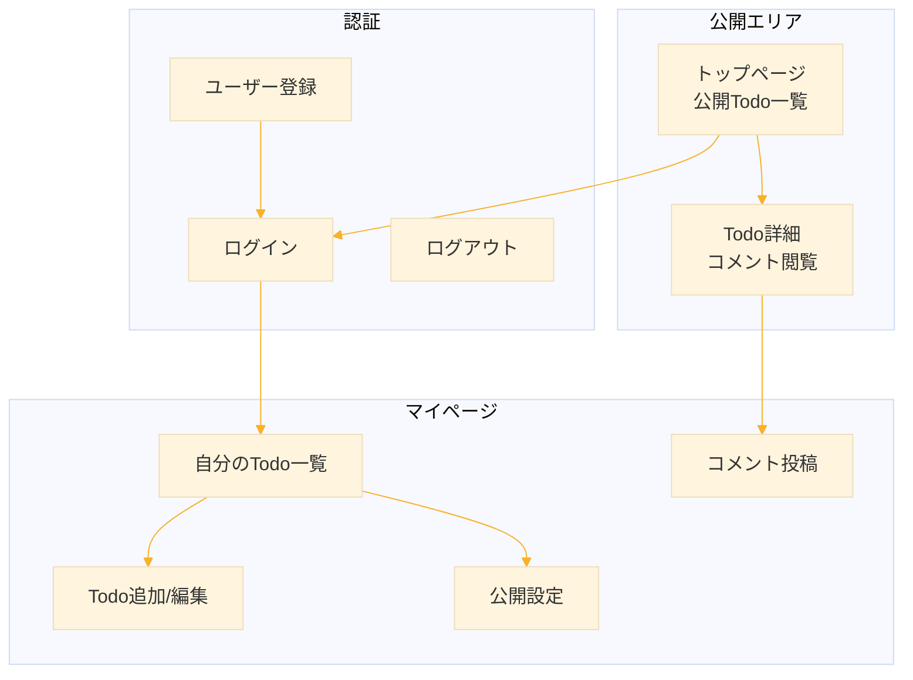
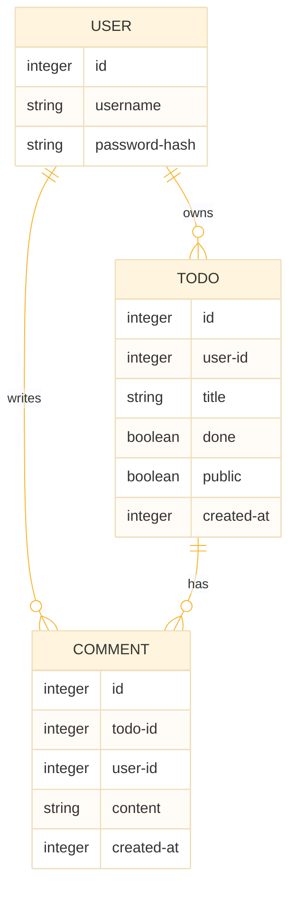
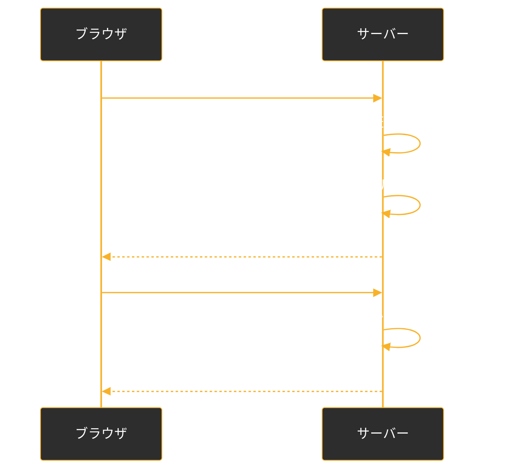
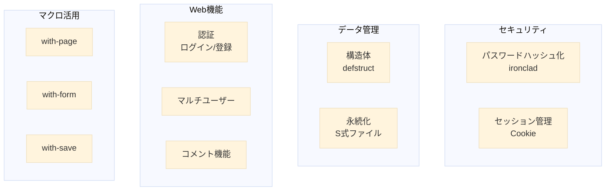

# Level 24-B (マルチユーザー Todo アプリ)
Level 24-A では REPL 駆動開発のメリットを体感しました。Level 24-B では、より実践的な機能を追加します。

* セッション管理（ログイン状態の維持）
* ユーザー認証（登録・ログイン・ログアウト）
* 公開 Todo と コメント機能（掲示板要素）
* データ永続化（ファイル保存）
* マクロによる HTML 生成の効率化


## 1. アプリケーション概要

### 1.1 機能一覧



### 1.2 データモデル




## 2. プロジェクト構成

### 2.1 ファイル構成

```
todo-app/
  todo-app.lisp      ; メインファイル
  data/
    users.dat        ; ユーザーデータ
    todos.dat        ; Todoデータ
    comments.dat     ; コメントデータ
```

### 2.2 パッケージ定義

```lisp
(ql:quickload '(:hunchentoot :cl-who :cl-json :ironclad :babel))

(defpackage :todo-app
  (:use :cl :cl-who)
  (:import-from :hunchentoot
                :define-easy-handler
                :easy-acceptor
                :content-type*
                :post-parameter
                :get-parameter
                :redirect
                :session-value
                :start-session)
  (:export :start-server :stop-server))

(in-package :todo-app)
```

**追加ライブラリ:**

| ライブラリ | 用途 |
|-----------|------|
| ironclad | パスワードハッシュ化 |
| babel | 文字エンコーディング |


## 3. ステップ1：データ構造の拡張

### 3.1 構造体定義

```lisp
;;; ==========================================================
;;; データ構造
;;; ==========================================================

;;; ユーザー
(defstruct user
  (id 0 :type integer)
  (username "" :type string)
  (password-hash "" :type string)  ; 平文は保存しない
  (created-at (get-universal-time) :type integer))

;;; Todo（公開フラグ追加）
(defstruct todo
  (id 0 :type integer)
  (user-id 0 :type integer)        ; 所有者
  (title "" :type string)
  (done nil :type boolean)
  (public nil :type boolean)       ; 公開フラグ
  (created-at (get-universal-time) :type integer))

;;; コメント
(defstruct comment*  ; comment は CL の予約語と衝突するため
  (id 0 :type integer)
  (todo-id 0 :type integer)
  (user-id 0 :type integer)
  (content "" :type string)
  (created-at (get-universal-time) :type integer))
```

### 3.2 データストア

```lisp
;;; ==========================================================
;;; インメモリデータベース
;;; ==========================================================

(defvar *users* '())
(defvar *todos* '())
(defvar *comments* '())

(defvar *next-user-id* 1)
(defvar *next-todo-id* 1)
(defvar *next-comment-id* 1)

;;; ID生成
(defun gen-user-id ()
  (prog1 *next-user-id* (incf *next-user-id*)))

(defun gen-todo-id ()
  (prog1 *next-todo-id* (incf *next-todo-id*)))

(defun gen-comment-id ()
  (prog1 *next-comment-id* (incf *next-comment-id*)))
```


## 4. ステップ2：パスワードのハッシュ化

### 4.1 なぜハッシュ化するのか

:::note warn
**パスワードを平文で保存してはいけない理由**

* データベース漏洩時に全ユーザーのパスワードが流出
* 管理者でもパスワードを見られるべきではない
* ハッシュ化すれば元のパスワードを復元できない
:::

### 4.2 実装

```lisp
;;; ==========================================================
;;; パスワード処理
;;; ==========================================================

;;; パスワードをハッシュ化（SHA-256）
;;; ironclad ライブラリを使用
(defun hash-password (password)
  (let ((digest (ironclad:make-digest :sha256)))
    (ironclad:update-digest digest 
                            (babel:string-to-octets password :encoding :utf-8))
    (ironclad:byte-array-to-hex-string 
     (ironclad:produce-digest digest))))

;;; パスワード検証
;;; 入力をハッシュ化して保存値と比較
(defun verify-password (password hash)
  (string= (hash-password password) hash))
```

### 4.3 動作確認

```lisp
;; ハッシュ値を作成
TODO-APP> (hash-password "secret123")
"a665a45920422f9d417e4867efdc4fb8a04a1f3fff1fa07e998e86f7f7a27ae3"

;; 作成されたハッシュ値で比較（ハッシュ値は上で作成されたものに入れ替える）
TODO-APP> (verify-password "secret123" 
            "a665a45920422f9d417e4867efdc4fb8a04a1f3fff1fa07e998e86f7f7a27ae3")
T

;; 違うハッシュ値で比較
TODO-APP> (verify-password "wrong" 
            "a665a45920422f9d417e4867efdc4fb8a04a1f3fff1fa07e998e86f7f7a27ae3")
NIL
```


## 5. ステップ3：ユーザー管理

### 5.1 CRUD関数

```lisp
;;; ==========================================================
;;; ユーザー CRUD
;;; ==========================================================

;;; ユーザー登録
(defun create-user (username password)
  (let ((user (make-user :id (gen-user-id)
                         :username username
                         :password-hash (hash-password password))))
    (push user *users*)
    user))

;;; ユーザー名で検索
(defun find-user-by-name (username)
  (find username *users* :key #'user-username :test #'string=))

;;; IDで検索
(defun find-user-by-id (id)
  (find id *users* :key #'user-id))

;;; ユーザー名の重複チェック
(defun username-exists-p (username)
  (not (null (find-user-by-name username))))

;;; 認証（ログイン処理）
(defun authenticate (username password)
  (let ((user (find-user-by-name username)))
    (when (and user (verify-password password (user-password-hash user)))
      user)))
```


## 6. ステップ4：セッション管理

### 6.1 セッションとは



### 6.2 Hunchentoot のセッション機能

```lisp
;;; ==========================================================
;;; セッション管理
;;; ==========================================================

;;; 現在のログインユーザーを取得
;;; session-value : セッションに保存された値を取得
(defun current-user ()
  (let ((user-id (session-value :user-id)))
    (when user-id
      (find-user-by-id user-id))))

;;; ログイン処理
;;; start-session : 新しいセッションを開始
(defun login (user)
  (start-session)
  (setf (session-value :user-id) (user-id user)))

;;; ログアウト処理
(defun logout ()
  (setf (session-value :user-id) nil))

;;; ログイン済みかチェック
(defun logged-in-p ()
  (not (null (current-user))))
```


## 7. ステップ5：Todo 拡張 CRUD

### 7.1 関数定義

```lisp
;;; ==========================================================
;;; Todo CRUD（マルチユーザー対応）
;;; ==========================================================

;;; Todo追加（ユーザーID必須）
(defun add-todo (user-id title &key (public nil))
  (let ((todo (make-todo :id (gen-todo-id)
                         :user-id user-id
                         :title title
                         :public public)))
    (push todo *todos*)
    todo))

;;; 自分のTodo一覧
(defun user-todos (user-id)
  (remove-if-not (lambda (todo)
                   (= (todo-user-id todo) user-id))
                 *todos*))

;;; 公開Todo一覧
(defun public-todos ()
  (remove-if-not #'todo-public *todos*))

;;; IDで検索
(defun find-todo (id)
  (find id *todos* :key #'todo-id))

;;; 完了トグル（所有者チェック付き）
(defun toggle-todo (id user-id)
  (let ((todo (find-todo id)))
    (when (and todo (= (todo-user-id todo) user-id))
      (setf (todo-done todo) (not (todo-done todo)))
      todo)))

;;; 公開トグル
(defun toggle-public (id user-id)
  (let ((todo (find-todo id)))
    (when (and todo (= (todo-user-id todo) user-id))
      (setf (todo-public todo) (not (todo-public todo)))
      todo)))

;;; 削除（所有者チェック付き）
(defun delete-todo (id user-id)
  (let ((todo (find-todo id)))
    (when (and todo (= (todo-user-id todo) user-id))
      (setf *todos* (remove id *todos* :key #'todo-id))
      t)))
```


## 8. ステップ6：コメント機能

### 8.1 コメント CRUD

```lisp
;;; ==========================================================
;;; コメント CRUD
;;; ==========================================================

;;; コメント追加
(defun add-comment (todo-id user-id content)
  (let ((comment (make-comment* :id (gen-comment-id)
                                :todo-id todo-id
                                :user-id user-id
                                :content content)))
    (push comment *comments*)
    comment))

;;; Todo に対するコメント一覧
(defun todo-comments (todo-id)
  (sort (remove-if-not (lambda (c)
                         (= (comment*-todo-id c) todo-id))
                       *comments*)
        #'<
        :key #'comment*-created-at))

;;; コメント削除（投稿者のみ）
(defun delete-comment (id user-id)
  (let ((comment (find id *comments* :key #'comment*-id)))
    (when (and comment (= (comment*-user-id comment) user-id))
      (setf *comments* (remove id *comments* :key #'comment*-id))
      t)))
```


## 9. ステップ7：データ永続化

### 9.1 保存と読み込み

```lisp
;;; ==========================================================
;;; 永続化（ファイル保存）
;;; ==========================================================

(defparameter *data-dir* "data/")

;;; ディレクトリ作成
(defun ensure-data-dir ()
  (ensure-directories-exist *data-dir*))

;;; データ保存
;;; with-open-file : ファイルを開いて処理
;;; print : S式をファイルに書き出し
(defun save-data ()
  (ensure-data-dir)
  ;; ユーザー
  (with-open-file (out (merge-pathnames "users.dat" *data-dir*)
                       :direction :output
                       :if-exists :supersede)
    (print (list *users* *next-user-id*) out))
  ;; Todo
  (with-open-file (out (merge-pathnames "todos.dat" *data-dir*)
                       :direction :output
                       :if-exists :supersede)
    (print (list *todos* *next-todo-id*) out))
  ;; コメント
  (with-open-file (out (merge-pathnames "comments.dat" *data-dir*)
                       :direction :output
                       :if-exists :supersede)
    (print (list *comments* *next-comment-id*) out))
  (format t "Data saved.~%"))

;;; データ読み込み
;;; probe-file : ファイル存在チェック
;;; read : S式を読み込み
(defun load-data ()
  (ensure-data-dir)
  ;; ユーザー
  (let ((path (merge-pathnames "users.dat" *data-dir*)))
    (when (probe-file path)
      (with-open-file (in path)
        (let ((data (read in)))
          (setf *users* (first data)
                *next-user-id* (second data))))))
  ;; Todo
  (let ((path (merge-pathnames "todos.dat" *data-dir*)))
    (when (probe-file path)
      (with-open-file (in path)
        (let ((data (read in)))
          (setf *todos* (first data)
                *next-todo-id* (second data))))))
  ;; コメント
  (let ((path (merge-pathnames "comments.dat" *data-dir*)))
    (when (probe-file path)
      (with-open-file (in path)
        (let ((data (read in)))
          (setf *comments* (first data)
                *next-comment-id* (second data))))))
  (format t "Data loaded.~%"))
```

### 9.2 自動保存

```lisp
;;; Todo操作時に自動保存するラッパー
(defmacro with-save (&body body)
  `(prog1 (progn ,@body)
     (save-data)))

;;; 使用例
;;; (with-save (add-todo user-id "New task"))
```


## 10. ステップ8：HTML マクロ

### 10.1 共通レイアウト

```lisp
;;; ==========================================================
;;; HTML 生成
;;; ==========================================================

(defparameter *css*
  "
* { box-sizing: border-box; }
body { 
  font-family: system-ui, sans-serif; 
  max-width: 800px; 
  margin: 0 auto; 
  padding: 20px;
  background: #f0f2f5;
}
header {
  background: #1a73e8;
  color: white;
  padding: 15px 20px;
  margin: -20px -20px 20px -20px;
  display: flex;
  justify-content: space-between;
  align-items: center;
}
header a { color: white; margin-left: 15px; }
h1, h2 { color: #333; }
.card {
  background: white;
  padding: 20px;
  margin: 15px 0;
  border-radius: 8px;
  box-shadow: 0 1px 3px rgba(0,0,0,0.1);
}
.todo-item {
  padding: 15px;
  margin: 10px 0;
  border-radius: 8px;
  background: #fafafa;
  display: flex;
  align-items: center;
}
.todo-item.done { opacity: 0.6; }
.todo-item.done .title { text-decoration: line-through; }
.title { flex: 1; margin: 0 15px; }
.meta { color: #666; font-size: 0.9em; }
.public-badge {
  background: #4CAF50;
  color: white;
  padding: 2px 8px;
  border-radius: 4px;
  font-size: 0.8em;
}
.btn {
  padding: 8px 16px;
  border: none;
  border-radius: 4px;
  cursor: pointer;
  font-size: 14px;
  margin: 2px;
}
.btn-primary { background: #1a73e8; color: white; }
.btn-success { background: #4CAF50; color: white; }
.btn-danger { background: #f44336; color: white; }
.btn-secondary { background: #757575; color: white; }
form.inline { display: inline; }
input[type=text], input[type=password], textarea {
  width: 100%;
  padding: 10px;
  margin: 5px 0 15px 0;
  border: 1px solid #ddd;
  border-radius: 4px;
  font-size: 16px;
}
.comment {
  padding: 10px;
  margin: 10px 0;
  border-left: 3px solid #1a73e8;
  background: #f8f9fa;
}
.comment .author { font-weight: bold; }
.comment .date { color: #666; font-size: 0.8em; }
.error { color: #f44336; margin: 10px 0; }
.success { color: #4CAF50; margin: 10px 0; }
")

;;; ページレイアウトマクロ
(defmacro with-page ((title &key message) &body body)
  `(with-html-output-to-string (s nil :prologue t)
     (:html
      (:head
       (:meta :charset "utf-8")
       (:meta :name "viewport" :content "width=device-width, initial-scale=1")
       (:title ,title)
       (:style (str *css*)))
      (:body
       ;; ヘッダー
       (:header
        (:a :href "/" :style "text-decoration:none;color:white"
          (:strong "Todo App"))
        (:nav
         (if (logged-in-p)
             (htm
              (:span (fmt "~A さん" (user-username (current-user))))
              (:a :href "/mypage" "マイページ")
              (:a :href "/logout" "ログアウト"))
             (htm
              (:a :href "/login" "ログイン")
              (:a :href "/register" "登録")))))
       ;; メッセージ
       (when ,message
         (htm (:p :class "success" (str ,message))))
       ;; 本文
       ,@body))))
```

### 10.2 フォーム生成マクロ

```lisp
;;; フォーム用マクロ
(defmacro with-form ((action &key (method "post") class) &body body)
  `(htm
    (:form :action ,action :method ,method 
           :class ,class
      ,@body)))

;;; 入力フィールド生成
(defmacro text-field (name label &key placeholder required)
  `(htm
    (:label :for ,name (str ,label))
    (:input :type "text" :name ,name :id ,name
            :placeholder ,placeholder
            :required ,required)))

(defmacro password-field (name label)
  `(htm
    (:label :for ,name (str ,label))
    (:input :type "password" :name ,name :id ,name :required t)))

(defmacro hidden-field (name value)
  `(htm
    (:input :type "hidden" :name ,name :value ,value)))

(defmacro submit-button (text &optional (class "btn btn-primary"))
  `(htm
    (:button :type "submit" :class ,class (str ,text))))
```


## 11. ステップ9：ハンドラ実装

### 11.1 認証ハンドラ

```lisp
;;; ==========================================================
;;; 認証ハンドラ
;;; ==========================================================

;;; ログインページ
(define-easy-handler (login-page :uri "/login") ()
  (setf (content-type*) "text/html; charset=utf-8")
  (let ((error-msg (get-parameter "error")))
    (with-page ("ログイン")
      (:div :class "card"
        (:h2 "ログイン")
        (when error-msg
          (htm (:p :class "error" (str error-msg))))
        (with-form ("/login")
          (text-field "username" "ユーザー名" :required t)
          (password-field "password" "パスワード")
          (submit-button "ログイン"))
        (:p (:a :href "/register" "アカウントを作成"))))))

;;; ログイン処理
(define-easy-handler (login-action :uri "/login" :default-request-type :post) ()
  (let* ((username (post-parameter "username"))
         (password (post-parameter "password"))
         (user (authenticate username password)))
    (if user
        (progn
          (login user)
          (redirect "/mypage"))
        (redirect "/login?error=Invalid username or password"))))

;;; ユーザー登録ページ
(define-easy-handler (register-page :uri "/register") ()
  (setf (content-type*) "text/html; charset=utf-8")
  (let ((error-msg (get-parameter "error")))
    (with-page ("ユーザー登録")
      (:div :class "card"
        (:h2 "ユーザー登録")
        (when error-msg
          (htm (:p :class "error" (str error-msg))))
        (with-form ("/register")
          (text-field "username" "ユーザー名" :required t)
          (password-field "password" "パスワード")
          (submit-button "登録"))
        (:p (:a :href "/login" "すでにアカウントをお持ちの方"))))))

;;; 登録処理
(define-easy-handler (register-action :uri "/register" 
                                      :default-request-type :post) ()
  (let ((username (post-parameter "username"))
        (password (post-parameter "password")))
    (cond
      ((or (null username) (< (length username) 1))
       (redirect "/register?error=Username required"))
      ((or (null password) (< (length password) 4))
       (redirect "/register?error=Password must be 4+ chars"))
      ((username-exists-p username)
       (redirect "/register?error=Username already taken"))
      (t
       (let ((user (create-user username password)))
         (save-data)
         (login user)
         (redirect "/mypage"))))))

;;; ログアウト
(define-easy-handler (logout-action :uri "/logout") ()
  (logout)
  (redirect "/"))
```

### 11.2 トップページ（公開Todo一覧）

```lisp
;;; ==========================================================
;;; 公開ページ
;;; ==========================================================

;;; トップページ
(define-easy-handler (index :uri "/") ()
  (setf (content-type*) "text/html; charset=utf-8")
  (with-page ("Todo App - 公開Todo")
    (:h1 "公開 Todo 一覧")
    (let ((todos (public-todos)))
      (if todos
          (htm
           (:div :class "card"
            (dolist (todo todos)
              (let ((owner (find-user-by-id (todo-user-id todo))))
                (htm
                 (:div :class (format nil "todo-item~@[ done~]" (todo-done todo))
                   (:span :class "title"
                     (:a :href (format nil "/view?id=~A" (todo-id todo))
                       (str (todo-title todo))))
                   (:span :class "meta"
                     (fmt "by ~A" (if owner (user-username owner) "Unknown")))))))))
          (htm
           (:p "公開されている Todo はありません。"))))))
```

### 11.3 マイページ

```lisp
;;; ==========================================================
;;; マイページ
;;; ==========================================================

;;; マイページ（要ログイン）
(define-easy-handler (mypage :uri "/mypage") ()
  (unless (logged-in-p)
    (redirect "/login")
    (return-from mypage))
  (setf (content-type*) "text/html; charset=utf-8")
  (let* ((user (current-user))
         (todos (user-todos (user-id user))))
    (with-page ("マイページ")
      (:h1 "マイページ")
      
      ;; Todo 追加フォーム
      (:div :class "card"
        (:h2 "新しい Todo")
        (with-form ("/todo/add")
          (text-field "title" "タイトル" 
                      :placeholder "何をしますか？" :required t)
          (:label
           (:input :type "checkbox" :name "public" :value "1")
           " 公開する")
          (:br)
          (submit-button "追加")))
      
      ;; Todo 一覧
      (:div :class "card"
        (:h2 "自分の Todo")
        (if todos
            (htm
             (dolist (todo todos)
               (htm
                (:div :class (format nil "todo-item~@[ done~]" (todo-done todo))
                  ;; 公開バッジ
                  (when (todo-public todo)
                    (htm (:span :class "public-badge" "公開")))
                  ;; タイトル
                  (:span :class "title" (str (todo-title todo)))
                  ;; 完了トグル
                  (with-form ("/todo/toggle" :class "inline")
                    (hidden-field "id" (todo-id todo))
                    (submit-button (if (todo-done todo) "Undo" "Done")
                                   "btn btn-success"))
                  ;; 公開トグル
                  (with-form ("/todo/public" :class "inline")
                    (hidden-field "id" (todo-id todo))
                    (submit-button (if (todo-public todo) "Private" "Public")
                                   "btn btn-secondary"))
                  ;; 削除
                  (with-form ("/todo/delete" :class "inline")
                    (hidden-field "id" (todo-id todo))
                    (submit-button "Del" "btn btn-danger"))))))
            (htm
             (:p "Todo がありません。")))))))
```

### 11.4 Todo 操作ハンドラ

```lisp
;;; ==========================================================
;;; Todo 操作
;;; ==========================================================

;;; Todo 追加
(define-easy-handler (add-todo-action :uri "/todo/add") ()
  (unless (logged-in-p) (redirect "/login") (return-from add-todo-action))
  (let ((title (post-parameter "title"))
        (public (post-parameter "public"))
        (user (current-user)))
    (when (and title (> (length title) 0))
      (with-save
        (add-todo (user-id user) title :public (not (null public))))))
  (redirect "/mypage"))

;;; 完了トグル
(define-easy-handler (toggle-todo-action :uri "/todo/toggle") ()
  (unless (logged-in-p) (redirect "/login") (return-from toggle-todo-action))
  (let ((id (ignore-errors (parse-integer (post-parameter "id"))))
        (user (current-user)))
    (when id
      (with-save (toggle-todo id (user-id user)))))
  (redirect "/mypage"))

;;; 公開トグル
(define-easy-handler (public-todo-action :uri "/todo/public") ()
  (unless (logged-in-p) (redirect "/login") (return-from public-todo-action))
  (let ((id (ignore-errors (parse-integer (post-parameter "id"))))
        (user (current-user)))
    (when id
      (with-save (toggle-public id (user-id user)))))
  (redirect "/mypage"))

;;; 削除
(define-easy-handler (delete-todo-action :uri "/todo/delete") ()
  (unless (logged-in-p) (redirect "/login") (return-from delete-todo-action))
  (let ((id (ignore-errors (parse-integer (post-parameter "id"))))
        (user (current-user)))
    (when id
      (with-save (delete-todo id (user-id user)))))
  (redirect "/mypage"))
```

### 11.5 Todo詳細とコメント

```lisp
;;; ==========================================================
;;; Todo 詳細・コメント
;;; ==========================================================

;;; 時刻フォーマット
(defun format-time (universal-time)
  (multiple-value-bind (sec min hour day month year)
      (decode-universal-time universal-time)
    (declare (ignore sec))
    (format nil "~4,'0D/~2,'0D/~2,'0D ~2,'0D:~2,'0D"
            year month day hour min)))

;;; Todo 詳細ページ
;;; Todo 詳細ページ（/view?id=123 形式）
(define-easy-handler (todo-detail :uri "/view") ()
  (setf (content-type*) "text/html; charset=utf-8")
  (let* ((id (ignore-errors (parse-integer (get-parameter "id"))))
         (todo (when id (find-todo id))))
    (if (and todo (todo-public todo))
        (let ((owner (find-user-by-id (todo-user-id todo)))
              (comments (todo-comments id)))
          (with-page ((todo-title todo))
            (:div :class "card"
              (:h1 (str (todo-title todo)))
              (:p :class "meta"
                (fmt "投稿者: ~A / ~A"
                     (if owner (user-username owner) "Unknown")
                     (format-time (todo-created-at todo))))
              (when (todo-done todo)
                (htm (:p (:strong "完了済み")))))
            
            ;; コメント一覧
            (:div :class "card"
              (:h2 "コメント")
              (if comments
                  (dolist (c comments)
                    (let ((author (find-user-by-id (comment*-user-id c))))
                      (htm
                       (:div :class "comment"
                         (:span :class "author"
                           (str (if author (user-username author) "Unknown")))
                         (:span :class "date"
                           (fmt " - ~A" (format-time (comment*-created-at c))))
                         (:p (str (comment*-content c)))))))
                  (htm (:p "コメントはまだありません。")))
              
              ;; コメント投稿フォーム
              (if (logged-in-p)
                  (htm
                   (:h3 "コメントを投稿")
                   (with-form ("/comment/add")
                     (hidden-field "todo-id" id)
                     (:textarea :name "content" :rows "3" 
                                :placeholder "コメントを入力...")
                     (submit-button "投稿")))
                  (htm
                   (:p (:a :href "/login" "ログイン") "してコメント"))))))
        (with-page ("Not Found")
          (:p "Todo が見つかりません。")))))

;;; コメント追加
(define-easy-handler (add-comment-action :uri "/comment/add") ()
  (unless (logged-in-p) (redirect "/login") (return-from add-comment-action))
  (let ((todo-id (ignore-errors (parse-integer (post-parameter "todo-id"))))
        (content (post-parameter "content"))
        (user (current-user)))
    (when (and todo-id content (> (length content) 0))
      (with-save (add-comment todo-id (user-id user) content)))
    (redirect (format nil "/view?id=~A" todo-id))))
```


## 12. サーバー管理

```lisp
;;; ==========================================================
;;; サーバー管理
;;; ==========================================================

(defvar *server* nil)

(defun start-server (&optional (port 8080))
  (when *server* (hunchentoot:stop *server*))
  (load-data)  ; データ読み込み
  (setf *server* (make-instance 'easy-acceptor :port port))
  (hunchentoot:start *server*)
  (format t "~%>>> Todo App started~%")
  (format t "    http://localhost:~A/~%~%" port))

(defun stop-server ()
  (when *server*
    (save-data)  ; データ保存
    (hunchentoot:stop *server*)
    (setf *server* nil)
    (format t "Server stopped~%")))
```


## 13. 完成コード

完成した todo-app.lisp は長くなるため、githubで公開します。

https://github.com/fukuyori/todo-app

### 13.1 使い方

```lisp
;; 1. ライブラリインストール（初回のみ）
(ql:quickload '(:hunchentoot :cl-who :ironclad :babel))

;; 2. ファイル読み込み
(load "todo-app.lisp")

;; 3. サーバー起動
(todo-app:start-server)

;; 4. ブラウザでアクセス
;;    http://localhost:8080/

;; 5. サーバー停止（データ自動保存）
(todo-app:stop-server)
```

### 13.2 動作確認

1. http://localhost:8080/register でユーザー登録
2. http://localhost:8080/mypage でTodo追加（公開チェック付き）
3. http://localhost:8080/ で公開Todo確認
4. Todo詳細ページでコメント投稿
5. サーバー停止→再起動でデータが維持されることを確認


## 14. まとめ

### 14.1 学んだ技術



### 14.2 Level 24 全体の振り返り

| Level 24-A | Level 24-B |
|------------|------------|
| REPL駆動開発の体験 | 実践的な機能実装 |
| 最小構成のWebアプリ | マルチユーザー対応 |
| インメモリデータ | ファイル永続化 |
| 基本的なCRUD | 認証・セッション |


## 練習問題

### 課題1：Todo 編集機能
Todo のタイトルを編集できる機能を追加してください。

### 課題2：いいね機能
公開 Todo に「いいね」できる機能を追加してください。

### 課題3：検索機能
Todo をキーワードで検索できる機能を追加してください。


## 参考

- [Hunchentoot - Sessions](https://edicl.github.io/hunchentoot/#sessions)
- [Ironclad - Cryptographic Library](https://github.com/sharplispers/ironclad)
- [CL-WHO Manual](https://edicl.github.io/cl-who/)


