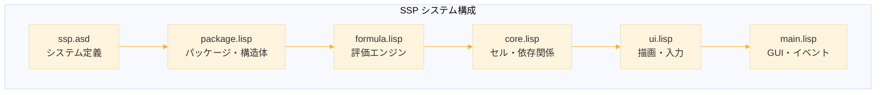
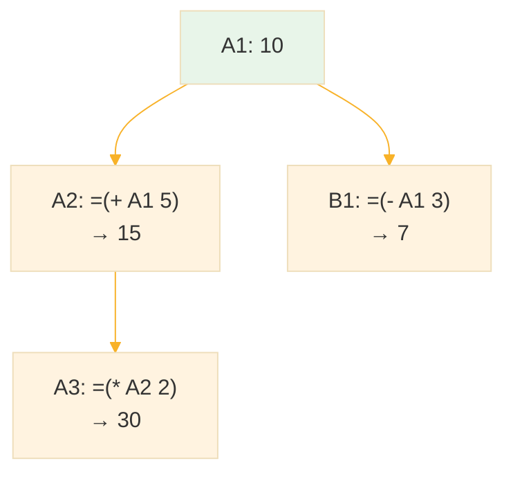
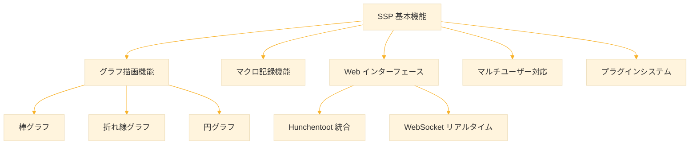

# Level 26 (SSP: シンボリック・スプレッドシート)

この Level では、これまで学んできた Common Lisp の知識を総動員して、実践的なアプリケーション「**SSP (Symbolic Spreadsheet for Lisp Learning)**」のソースコードを読み解きながら学習します。

SSP は「スプレッドシート」と「Lisp REPL」を融合させた教育用ツールです。セルに S式を入力し、依存関係を持たせながらリアルタイムに評価結果を確認できます。Excel とは異なり、**セルがあらゆる Lisp 値（リスト、シンボル、関数結果など）を保持できる**のが大きな特徴です。

```
╔════════════════════════════════════════════════════╗
║ セル A1: 10                                        ║
║ セル A2: =(+ A1 5)        → 15                     ║
║ セル A3: =(range A1 A2)   → (10 15)                ║
║ セル A4: =(apply #'+ A3)  → 25                     ║
╚════════════════════════════════════════════════════╝
```

> **SSP の理念**: セルは「スクリプト」ではなく「式」を保持する。  
> スプレッドシートのグリッドが、ライブな評価環境となる。


https://github.com/fukuyori/ssp

## 1. SSP の概要

### 1.1 SSP とは

SSP (Symbolic Spreadsheet for Lisp Learning) は、以下の特徴を持つ Common Lisp 製スプレッドシートです。

| 特徴 | 説明 |
|------|------|
| **S式ベースの数式** | `=(+ A1 B1)` のように Lisp の構文で数式を記述 |
| **多様な値型** | 数値、リスト、シンボル、文字列など Lisp の全データ型を保持 |
| **150以上の関数** | 安全にホワイトリスト化された純粋関数群 |
| **依存関係の自動追跡** | セル参照を変更すると関連セルが自動再計算 |
| **GUI対応** | LTK（Tcl/Tk バインディング）による視覚的インターフェース |

### 1.2 学習目標

この Level を完了すると、以下を習得できます。

1. **パッケージシステムの実践的な使い方**（Level 15 の復習）
2. **構造体とアクセサ関数による状態管理**（Level 7 の発展）
3. **評価器の実装技法**（Level 20 の発展）
4. **GUI プログラミングの基礎**（LTK/Tk）
5. **実用的なプロジェクト構成**（ASDF）


## 2. 環境構築

### 2.1 必要なソフトウェア

```
┌─────────────────────────────────────────────────┐
│ コンポーネント       │ 推奨バージョン          │
├─────────────────────┼─────────────────────────┤
│ SBCL                │ 2.0 以上                │
│ Quicklisp           │ 最新版                  │
│ Tcl/Tk              │ 8.5 以上                │
└─────────────────────────────────────────────────┘
```

### 2.2 インストール手順

### Ubuntu/Debian の場合

```bash
## SBCL と Tk のインストール
sudo apt install sbcl tk
```

### macOS の場合

```bash
## Homebrew を使用
brew install sbcl tcl-tk
```

### Windows の場合

1. SBCL: http://www.sbcl.org/ からダウンロード
2. Tcl/Tk: https://www.activestate.com/products/tcl/ からダウンロード

### 2.3 Quicklisp のセットアップ

```bash
## Quicklisp のダウンロード
curl -O https://beta.quicklisp.org/quicklisp.lisp

## SBCL で実行
sbcl --load quicklisp.lisp
```

SBCL の REPL で以下を実行します。

```lisp
;; Quicklisp のインストール
(quicklisp-quickstart:install)

;; 起動時に自動ロードされるよう設定
(ql:add-to-init-file)

;; 終了
(quit)
```

### 2.4 SSP のダウンロードと起動

```bash
## リポジトリのクローン
git clone https://github.com/fukuyori/ssp.git
cd ssp
```

### 方法1: ASDF を使用（推奨）

```lisp
;; SBCL を起動
;; SSP ディレクトリを ASDF に登録
(push #P"/path/to/ssp/" asdf:*central-registry*)

;; システムをロード
(asdf:load-system :ssp)

;; SSP を起動
(ssp:start)
```

### 方法2: シンプルローダーを使用

```lisp
;; ASDF 不要でも起動可能
(load "/path/to/ssp/load.lisp")
(ssp:start)
```

### 起動オプション

```lisp
;; デフォルト: 26行 × 14列
(ssp:start)

;; カスタムサイズ
(ssp:start :rows 50 :cols 10)

;; 数式入力エリアを拡大
(ssp:start :input-lines 5)
```

## 3. プロジェクト構造の理解

SSP のディレクトリ構成は以下のとおりです。

```
ssp/
├── ssp.asd          ; ASDF システム定義
├── load.lisp        ; シンプルローダー（ASDF不要）
├── package.lisp     ; パッケージ、定数、構造体、アクセサ
├── formula.lisp     ; 許可関数リスト、評価エンジン
├── core.lisp        ; セル操作、依存関係、Undo/Redo、ファイルI/O
├── ui.lisp          ; 描画、入力処理、シンタックスハイライト
├── main.lisp        ; GUI構築、イベントハンドラ
├── README.md        ; 英語ドキュメント
└── README-JP.md     ; 日本語ドキュメント
```




## 4. ソースコード解説

### 4.1 package.lisp ─ パッケージ定義と構造体

このファイルでは、SSP のパッケージを定義し、アプリケーション全体で使用する構造体とアクセサ関数を提供します。

### パッケージの定義

```lisp
;; SSP パッケージの定義
(defpackage :ssp
  (:use :cl :ltk)        ; Common Lisp と LTK を使用
  (:export               ; 外部に公開するシンボル
   ;; メインAPI
   :start
   :new-sheet
   :save
   :load-file
   :export-csv
   :import-csv
   ;; その他...
   ))

(in-package :ssp)
```

**ポイント**: `:use :ltk` により、LTK（GUI ライブラリ）の全シンボルが使用可能になります。

### セル構造体

```lisp
;; セルの構造体定義
(defstruct cell
  value    ; 評価後の値（任意の Lisp オブジェクト）
  formula) ; 元の数式（S式）

;; 例：セル A1 に数式 (+ 10 20) を設定した場合
;; value   = 30
;; formula = (+ A1 20)  ; A1 が 10 の場合
```

**ポイント**: `defstruct` により、`make-cell`, `cell-value`, `cell-formula` などが自動生成されます（Level 7 参照）。

### スプレッドシート状態の構造体

```lisp
;; スプレッドシート全体の状態
(defstruct ss-state
  rows           ; 行数
  cols           ; 列数
  sheet          ; セルのハッシュテーブル
  refs           ; 各セルの参照先
  dependents     ; 各セルの依存先
  undo-stack     ; Undo 履歴
  redo-stack     ; Redo 履歴
  ;; ... その他の状態
  )
```

### アクセサ関数

```lisp
;; グローバル状態へのアクセスはアクセサ関数を経由
(defvar *state* nil "現在のスプレッドシート状態")

;; カーソル位置の取得
(defun cursor-x () (ss-state-cursor-x *state*))
(defun cursor-y () (ss-state-cursor-y *state*))

;; カーソルの移動
(defun move-cursor (x y)
  (setf (ss-state-cursor-x *state*) x
        (ss-state-cursor-y *state*) y))

;; セルの取得
(defun get-cell (name)
  (gethash name (ss-state-sheet *state*)))

;; 依存関係の取得
(defun get-dependents (name)
  (gethash name (ss-state-dependents *state*)))
```

**設計原則**: グローバル変数 `*state*` への直接アクセスを避け、アクセサ関数を介することで、状態管理を一元化しています。


### 4.2 formula.lisp ─ 評価エンジン

このファイルは、セルに入力された数式を安全に評価するためのエンジンを実装しています。

### 許可関数のホワイトリスト

```lisp
;; 安全に実行できる関数のリスト（一部抜粋）
(defparameter *allowed-functions*
  '(;; 算術演算
    + - * / mod rem 1+ 1- floor ceiling round truncate
    abs max min sqrt expt log exp sin cos tan gcd lcm
    
    ;; 比較
    = /= < > <= >= equal equalp eq eql
    
    ;; リスト操作
    car cdr cons list first last nth length append reverse
    member assoc mapcar mapc mapcan reduce remove remove-if
    remove-if-not find find-if position count sort subseq
    butlast nthcdr
    
    ;; 文字列操作
    string-upcase string-downcase string-capitalize
    string-trim concatenate format char subseq
    
    ;; 論理演算
    and or not null if cond when unless case
    
    ;; 型判定
    numberp stringp listp symbolp atom zerop plusp minusp
    evenp oddp
    
    ;; 高階関数
    apply funcall lambda mapcar mapc reduce
    remove-if remove-if-not find-if every some notevery notany
    ))
```

**セキュリティ**: `eval` や `load` などの危険な関数は含まれていません。これにより、悪意のあるコードの実行を防ぎます。

### 数式の評価

```lisp
;; 評価コンテキストの構造体
(defstruct eval-context
  row          ; 現在の行
  col          ; 現在の列
  stack        ; 循環参照検出用スタック
  env)         ; 環境（変数束縛など）

;; 数式の評価（簡略版）
(defun evaluate-formula (formula context)
  "数式を評価し、結果を返す"
  (cond
    ;; セル参照の場合（例: A1）
    ((cell-reference-p formula)
     (get-cell-value formula))
    
    ;; リスト（関数呼び出し）の場合
    ((listp formula)
     (let ((fn (car formula))
           (args (cdr formula)))
       ;; 関数がホワイトリストに含まれているか確認
       (unless (member fn *allowed-functions*)
         (error "許可されていない関数: ~A" fn))
       ;; 引数を再帰的に評価し、関数を適用
       (apply fn (mapcar (lambda (arg)
                           (evaluate-formula arg context))
                         args))))
    
    ;; それ以外（数値、文字列など）はそのまま
    (t formula)))
```

### セル参照の解決

```lisp
;; セル名から値を取得
(defun cell-reference-p (x)
  "X がセル参照かどうかを判定"
  (and (symbolp x)
       (cl-ppcre:scan "^[A-Z]+[0-9]+$" (symbol-name x))))

;; 相対参照の処理
;; (rel -1 0) → 1つ上のセル
;; (rel 0 -1) → 1つ左のセル
(defun resolve-relative-ref (row col drow dcol)
  "相対参照を絶対参照に変換"
  (let ((target-row (+ row drow))
        (target-col (+ col dcol)))
    (make-cell-name target-col target-row)))

;; 範囲参照の処理
;; (range A1 A5) → (A1の値 A2の値 A3の値 A4の値 A5の値)
(defun expand-range (start-cell end-cell)
  "範囲内の全セル値をリストとして返す"
  (let ((start-row (cell-row start-cell))
        (end-row (cell-row end-cell))
        (col (cell-col start-cell)))
    (loop for r from start-row to end-row
          collect (get-cell-value (make-cell-name col r)))))
```


### 4.3 core.lisp ─ セル操作と依存関係

このファイルは、セルの読み書き、依存関係の追跡、Undo/Redo 機能を実装しています。

### 依存関係グラフ



### 依存関係の追跡

```lisp
;; セルの参照先を抽出
(defun extract-references (formula)
  "数式から参照しているセル名を抽出"
  (cond
    ((cell-reference-p formula)
     (list formula))
    ((listp formula)
     (reduce #'append
             (mapcar #'extract-references formula)))
    (t nil)))

;; 依存関係の更新
(defun update-dependencies (cell-name formula)
  "セルの依存関係を更新"
  (let ((old-refs (get-refs cell-name))
        (new-refs (extract-references formula)))
    ;; 古い参照から自分を削除
    (dolist (ref old-refs)
      (remove-dependent ref cell-name))
    ;; 新しい参照に自分を追加
    (dolist (ref new-refs)
      (add-dependent ref cell-name))
    ;; 参照リストを更新
    (set-refs cell-name new-refs)))

;; セル変更時の再計算
(defun propagate-changes (cell-name)
  "セルの変更を依存先に伝播"
  (let ((dependents (get-dependents cell-name)))
    (dolist (dep dependents)
      (recalculate-cell dep)
      ;; 再帰的に伝播
      (propagate-changes dep))))
```

### Undo/Redo の実装

```lisp
;; Undo 情報の保存
(defun save-undo-state (cell-name old-value old-formula)
  "Undo 用に現在の状態を保存"
  (push (list :cell cell-name
              :old-value old-value
              :old-formula old-formula)
        (ss-state-undo-stack *state*))
  ;; Undo したら Redo スタックはクリア
  (setf (ss-state-redo-stack *state*) nil))

;; Undo の実行
(defun undo ()
  "最後の操作を取り消す"
  (let ((action (pop (ss-state-undo-stack *state*))))
    (when action
      (let ((cell-name (getf action :cell))
            (old-value (getf action :old-value))
            (old-formula (getf action :old-formula)))
        ;; 現在の状態を Redo スタックに保存
        (push (list :cell cell-name
                    :old-value (get-cell-value cell-name)
                    :old-formula (get-cell-formula cell-name))
              (ss-state-redo-stack *state*))
        ;; 古い状態を復元
        (set-cell-value cell-name old-value old-formula)))))
```

### ファイル保存/読み込み

```lisp
;; ネイティブ形式（.ssp）での保存
;; ファイル形式
;; (:spreadsheet
;;  :format-version 1
;;  :metadata (:created "2025-12-20T10:30:00"
;;             :modified "2025-12-20T11:45:00"
;;             :app-version "0.6")
;;  :grid (:rows 26 :cols 14)
;;  :cells (("A1" 100)
;;          ("A2" 200 (+ A1 100))
;;          ("B1" "Hello")))

(defun save-spreadsheet (filename)
  "スプレッドシートをファイルに保存"
  (with-open-file (out filename :direction :output
                                :if-exists :supersede)
    (let ((data (list :spreadsheet
                      :format-version 1
                      :metadata (list :created (get-timestamp)
                                      :app-version "0.6")
                      :grid (list :rows (sheet-rows)
                                  :cols (sheet-cols))
                      :cells (collect-non-empty-cells))))
      (write data :stream out :pretty t))))

;; CSV エクスポート
(defun export-csv (filename)
  "スプレッドシートを CSV として出力"
  (with-open-file (out filename :direction :output
                                :if-exists :supersede)
    (dotimes (row (sheet-rows))
      (dotimes (col (sheet-cols))
        (let ((value (get-cell-value (make-cell-name col row))))
          (format out "~A" (csv-escape value))
          (unless (= col (1- (sheet-cols)))
            (write-char #\, out))))
      (terpri out))))
```


### 4.4 ui.lisp ─ 描画とユーザーインターフェース

このファイルでは、スプレッドシートの描画とユーザー入力の処理を行います。

### セル値の表示フォーマット

```lisp
;; 値を表示用に整形
(defun format-cell-value (value)
  "セルの値を表示用文字列に変換"
  (cond
    ;; NIL は空白
    ((null value) "")
    
    ;; 整数
    ((integerp value)
     (format nil "~D" value))
    
    ;; 浮動小数点（小数点以下4桁）
    ((floatp value)
     (format nil "~,4F" value))
    
    ;; 分数（そのまま表示）
    ((rationalp value)
     (format nil "~A" value))
    
    ;; 文字列
    ((stringp value) value)
    
    ;; シンボル
    ((symbolp value)
     (symbol-name value))
    
    ;; リスト
    ((listp value)
     (format nil "~S" value))
    
    ;; その他
    (t (format nil "~S" value))))
```

### シンタックスハイライト

```lisp
;; 数式入力エリアのシンタックスハイライト
(defun apply-syntax-highlighting (text)
  "テキストにシンタックスハイライトを適用"
  (let ((tokens (tokenize text)))
    (dolist (token tokens)
      (let ((type (token-type token))
            (start (token-start token))
            (end (token-end token)))
        (case type
          (:keyword
           (apply-tag text start end "keyword"))
          (:function
           (when (member (token-value token) *allowed-functions*)
             (apply-tag text start end "function")))
          (:cell-ref
           (apply-tag text start end "cell-ref"))
          (:number
           (apply-tag text start end "number"))
          (:string
           (apply-tag text start end "string")))))))

;; S式の自動整形（Ctrl+Shift+F）
(defun format-sexp (text)
  "S式を読みやすく整形"
  (handler-case
      (let ((sexp (read-from-string text)))
        (with-output-to-string (out)
          (pprint sexp out)))
    (error () text)))  ; パースエラー時は元のテキストを返す
```


### 4.5 main.lisp ─ GUI とイベント処理

このファイルでは、LTK を使用して GUI を構築し、ユーザーイベントを処理します。

### メインウィンドウの作成

```lisp
;; SSP の起動
(defun start (&key (rows 26) (cols 14) (input-lines 3))
  "SSP を起動"
  (setf *state* (make-ss-state :rows rows :cols cols))
  
  (with-ltk ()
    (let ((frame (make-instance 'frame)))
      ;; メニューバー
      (create-menu-bar frame)
      
      ;; 数式入力エリア
      (create-formula-bar frame input-lines)
      
      ;; スプレッドシートグリッド
      (create-grid frame rows cols)
      
      ;; ステータスバー
      (create-status-bar frame)
      
      ;; キーバインドの設定
      (setup-key-bindings)
      
      ;; 初期描画
      (refresh-display))))
```

### イベントハンドラ

```lisp
;; キーバインドの設定
(defun setup-key-bindings ()
  "キーボードショートカットを設定"
  ;; ナビゲーション
  (bind-key "<Up>"    #'move-up)
  (bind-key "<Down>"  #'move-down)
  (bind-key "<Left>"  #'move-left)
  (bind-key "<Right>" #'move-right)
  
  ;; 編集
  (bind-key "<F2>"        #'edit-cell)
  (bind-key "<Delete>"    #'clear-cell)
  (bind-key "<Return>"    #'confirm-and-move-down)
  (bind-key "<Control-Return>" #'confirm-and-stay)
  
  ;; クリップボード
  (bind-key "<Control-c>" #'copy-selection)
  (bind-key "<Control-x>" #'cut-selection)
  (bind-key "<Control-v>" #'paste-selection)
  
  ;; Undo/Redo
  (bind-key "<Control-z>" #'undo)
  (bind-key "<Control-y>" #'redo)
  
  ;; ファイル操作
  (bind-key "<Control-n>" #'new-sheet)
  (bind-key "<Control-o>" #'open-file)
  (bind-key "<Control-s>" #'save-file))

;; セル入力の確定
(defun confirm-input ()
  "現在の入力を確定し、セルを更新"
  (let* ((input (get-input-text))
         (cell-name (current-cell-name)))
    (cond
      ;; 数式（= で始まる）
      ((and (> (length input) 0)
            (char= (char input 0) #\=))
       (let ((formula (parse-formula (subseq input 1))))
         (set-cell-with-formula cell-name formula)))
      
      ;; 数値
      ((numberp (read-safely input))
       (set-cell-value cell-name (read-safely input)))
      
      ;; 文字列
      (t
       (set-cell-value cell-name input)))
    
    ;; 再描画
    (refresh-display)))
```


## 5. SSP の基本操作

### 5.1 セルへの入力

| 入力方法 | 例 | 結果 |
|----------|-----|------|
| 直接入力 | `42` | 数値 42 |
| 文字列 | `"Hello"` | 文字列 "Hello" |
| シンボル | `hello` | シンボル HELLO |
| 数式 | `=(+ 1 2)` | 3 |
| リスト | `=(list 1 2 3)` | (1 2 3) |
| 範囲 | `=(range A1 A5)` | (v1 v2 v3 v4 v5) |

### 5.2 数式の例

### 基本演算

```lisp
=(+ 1 2 3)              ;; → 6
=(* A1 A2)              ;; → A1 と A2 の積
=(/ (+ A1 A2) 2)        ;; → A1 と A2 の平均
```

### 範囲操作

```lisp
=(range A1 A10)                      ;; → (1 2 3 4 5 6 7 8 9 10)
=(apply #'+ (range A1 A10))          ;; → 合計
=(apply #'max (range A1 A10))        ;; → 最大値
=(length (range A1 A10))             ;; → 要素数
```

### リスト処理

```lisp
=(mapcar #'1+ (range A1 A5))               ;; → 各要素に 1 を加算
=(remove-if #'oddp (range A1 A10))         ;; → 偶数のみ抽出
=(sort (range A1 A5) #'<)                  ;; → 昇順ソート
```

### ラムダ式

```lisp
=(mapcar (lambda (x) (* x x)) (range A1 A5))  ;; → 二乗
=(reduce (lambda (a b) (+ a b)) (range A1 A5)) ;; → 合計
```

### 条件分岐

```lisp
=(if (> A1 0) "正" "非正")
=(cond ((< A1 0) "負")
       ((= A1 0) "零")
       (t "正"))
```

### 5.3 相対参照

```lisp
=(rel -1 0)                        ;; → 1つ上のセル
=(rel 0 -1)                        ;; → 1つ左のセル
=(+ (rel -1 0) (rel -2 0))         ;; → 上2つのセルの合計
=(apply #'+ (rel-range -4 0 -1 0)) ;; → 上4つのセルの合計
```

### 5.4 キーボードショートカット

### ナビゲーション

| キー | 動作 |
|------|------|
| 矢印キー | カーソル移動 |
| Shift+矢印 | 選択範囲の拡大 |
| Home / End | 行の先頭/末尾 |
| Ctrl+Home | A1 へ移動 |
| Page Up/Down | ページスクロール |

### 編集

| キー | 動作 |
|------|------|
| 任意の文字 | 直接入力開始 |
| F2 | 編集モード（既存内容を保持） |
| Delete/Backspace | セルクリア |
| Escape | 編集キャンセル |
| Ctrl+Shift+F | S式の整形 |

### 確定

| キー | 動作 |
|------|------|
| Enter | 確定して下へ移動 |
| Ctrl+Enter | 確定して留まる |
| Alt+Enter | 確定して右へ移動 |
| Shift+Enter | 入力内で改行 |
| Tab | 確定して右へ移動 |

### ファイル

| キー | 動作 |
|------|------|
| Ctrl+N | 新規シート |
| Ctrl+O | ファイルを開く |
| Ctrl+S | 保存 |
| Ctrl+Shift+S | 名前を付けて保存 |


## 6. 学習課題

### 課題1：ソースコードリーディング

SSP のソースコードを読み、以下の質問に答えてください。

1. **package.lisp**: どのようなシンボルがエクスポートされていますか？
2. **formula.lisp**: 循環参照はどのように検出されていますか？
3. **core.lisp**: セルの値を変更したとき、依存セルはどのような順序で再計算されますか？
4. **ui.lisp**: 数値と文字列で表示の配置（右寄せ/左寄せ）が異なるのはなぜですか？

### 課題2：機能の追加

以下のいずれかの機能を SSP に追加してください。

### A. 新しい関数の追加

`*allowed-functions*` に新しい関数を追加し、その関数を使った数式が正しく評価されることを確認してください。

例
- `average` 関数（平均を計算）
- `median` 関数（中央値を計算）
- `variance` 関数（分散を計算）

```lisp
;; average 関数の実装例
(defun average (&rest numbers)
  "数値リストの平均を計算"
  (if (null numbers)
      0
      (/ (apply #'+ numbers)
         (length numbers))))

;; 使用例：=(average (range A1 A10))
```

### B. 新しいセル参照方式の追加

「名前付き範囲」機能を実装してください。

```lisp
;; 例
;; (define-range "売上" A1 A12)
;; =(apply #'+ (named-range "売上"))
```

### C. 新しいファイル形式のサポート

Excel ファイル（.xlsx）のインポート/エクスポート機能を追加してください。

### 課題3：バグ修正と改善

SSP を実際に使用して、以下を試してください。

1. 大きな範囲（100行以上）での計算パフォーマンス
2. 複雑な循環参照のケース
3. 特殊文字（日本語など）を含むセル値

問題を発見した場合は、原因を特定し、修正案を提案してください。


## 7. 発展学習

### 7.1 LTK（GUI ライブラリ）の学習

SSP は LTK を使用しています。LTK の詳細は以下のリソースで学習できます。

- 公式ドキュメント: https://www.peter-herth.de/ltk/ltkdoc/
- Quicklisp: `(ql:quickload :ltk)`

### 7.2 関連プロジェクト

- **VisiCalc**: 最初のスプレッドシート（1979年）
- **Org-mode**: Emacs のスプレッドシート機能
- **SICP の評価器**: 構造と解釈（4章）

### 7.3 さらなる拡張のアイデア




## 8. まとめ

この Level では、SSP のソースコードを通じて以下を学びました。

| 学習項目 | SSP での実装 |
|----------|--------------|
| パッケージ設計 | `package.lisp` での明確な API 設計 |
| 構造体と状態管理 | `cell`, `ss-state` 構造体 |
| 評価器の実装 | `formula.lisp` でのホワイトリスト評価 |
| 依存関係グラフ | `core.lisp` での参照追跡 |
| GUI プログラミング | LTK を使用したイベント駆動 |
| ファイル I/O | S式とCSVの読み書き |

SSP は、これまでの 25 レベルで学んだ知識を統合した「生きた教材」です。ソースコードを読み、改造し、自分なりの機能を追加することで、Common Lisp の実践力を高めてください。


## 参考資料

### リポジトリ

- GitHub: https://github.com/fukuyori/ssp
- ライセンス: MIT

### スプレッドシートの思想史 
- https://note.com/fukuy/n/nddb994b9b772

### 関連 Level

| Level | 関連内容 |
|-------|----------|
| 7 | データ構造（構造体） |
| 8 | 関数型プログラミング（高階関数） |
| 9 | 入出力とファイル操作 |
| 15 | パッケージとシステム（ASDF） |
| 16 | CLOS（オブジェクト指向） |
| 20 | 電卓インタプリタ（評価器） |


**「すべてのセルは式であり、グリッドはあなたの REPL である」** ─ SSP

